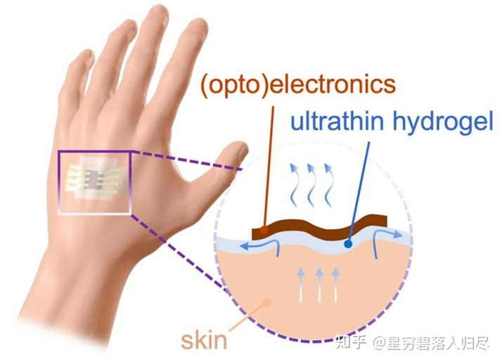
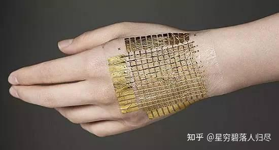

###### datetime:2025/09/11 11:00

###### author:nzb

# 机器人基础知识学习笔记---传感器篇

## 1. 引言

在现代机器人技术中，机器人运动以及功能实现离不开其基础硬件系统。如图所示，机器人硬件系统的基本组成包括相机、芯片、传感器等构成的感知层；各类电机、传感器、轴承等组成的关节驱动系统；以及电池组、传感器、冷却系统和FSD系统构成的整体躯干层。

在机器人技术的迅猛发展进程中，传感器作为机器人的“感官”和“神经”，发挥着不可或缺的作用。它们是连接机器人硬件系统与外部环境的关键纽带，负责将复杂的环境信息转化为可处理的数据信号，为机器人的决策和行动提供依据。从工业自动化到智能安防，从智能家居到医疗诊断，传感器的性能直接决定了机器人对环境的感知能力和任务执行的精准度。本文将深入剖析机器人传感器的多种类型、工作原理、应用场景以及未来的发展趋势。

## 6. 电流环力控传感器

### 6.1. 基本概念

电流环力控是一种基于电机电流反馈实现力控制的技术。通过监测电机驱动电流的变化，可以间接感知机器人末端执行器与环境之间的接触力。这种方法具有结构简单、成本低的优点，广泛应用于工业机器人、协作机器人等领域。

### 6.2. 工作原理

#### 6.2.1 电流与力的关系

**原理**

在机器人关节中，电机产生的扭矩 $$T$$ 与电流 $$I$$ 的关系由电机的转矩常数 $$K_t$$ 决定：

$$T = K_t \cdot I$$

其中：
- $$T$$ ：电机输出扭矩。
- $$K_t$$ ：电机的转矩常数。
- $$I$$ ：电机驱动电流。

假设机器人末端执行器与环境接触时，接触力 $$F$$ 可以通过关节扭矩 $$T$$ 和杠杆臂长度 $$r$$ 计算：

$$F = \frac{T}{r}$$

将 $$T = K_t \cdot I$$ 代入，得到接触力与电流的关系：

$$F = \frac{K_t \cdot I}{r}$$

**推导过程**

根据牛顿第二定律，电机产生的扭矩 $$T$$ 包括两部分：负载扭矩 $$T_{L}$$ 和摩擦扭矩 $$T_{f}$$：

$$T = T_L + T_f$$

负载扭矩 $$T_L$$ 由接触力 $$F$$ 和杠杆臂长度 $$r$$ 决定：

$$T_L = F \cdot r$$

因此，接触力 $$F$$ 可表示为：

$$F = \frac{T - T_f}{r}$$

将 $$T - K_t \cdot I$$ 代入，得到：

$$F = \frac{K_t \cdot I - T_f}{r}$$

在实际应用中，摩擦扭矩 $$T_f$$ 通常较小，可忽略不计，简化为：

$$F \approx \frac{K_t \cdot I}{r}$$

#### 6.2.2 力控算法

**PID控制**

为了实现精确的力控制，通常使用PID控制器调节电机电流。设目标力为 $$F_d$$ ，实际力为 $$F$$ ，误差为 $$e = F_d - F$$ ，则PID控制器的输出电流 $$I_{out}$$ 为：

$$I_{out} = K_p \cdot e + K_i \int e \, dt + K_d \frac{de}{dt}$$

其中：
- $$K_p$$ ：比例增益。
- $$K_i$$ ：积分增益。
- $$K_d$$ ：微分增益。

将 $$F = \frac{K_t \cdot I}{r}$$ 代入误差公式：

$$e = F_d - \frac{K_t \cdot I}{r}$$

整理得：

$$e = F_d - \frac{K_t}{r} \cdot I$$

将误差代入PID控制器公式：

$$I_{out} = K_p \left(F_d - \frac{K_t}{r} \cdot I\right) + K_i \int \left(F_d - \frac{K_t}{r} \cdot I\right) \, dt + K_d \frac{d}{dt} \left(F_d - \frac{K_t}{r} \cdot I\right)$$

#### 6.2.3 动态模型

**转动惯量的影响**

在动态过程中，电机需要克服负载的转动惯量 $$J$$ 和粘性阻尼 $$B$$ 。动力学方程为：

$$J \cdot \ddot{\theta} + B \cdot \dot{\theta} + T_L = T$$

其中：
- $$J$$ ：转动惯量。
- $$B$$ ：粘性阻尼系数。
- $$\theta$$ ：关节角度。

将 $$T = K_t \cdot I$$ 和 $$T_L = F \cdot r$$ 代入：

$$J \cdot \ddot{\theta} + B \cdot \dot{\theta} + F \cdot r = K_t \cdot I$$

结合 $$F = \frac{K_t \cdot I}{r}$$ ，得到：

$$J \cdot \ddot{\theta}  + B \cdot \dot{\theta } + \frac{K_{t} \cdot I}{r} \cdot r = K_{t}\cdot I$$

简化为：

$$J \cdot \dot{\theta} + B \cdot \theta = 0$$

## 7. 电子皮肤传感器

### 7.1 基本概念

电子皮肤（E-skin）是一种模仿人类皮肤功能的柔性触觉传感器系统，旨在模仿人类皮肤的功能感知压力、温度、湿度和触觉等外部刺激。具备高柔韧性、灵敏度和多模态感知能力。

电子皮肤通常由柔性材料和多种类型的传感器组成，包括压力传感器、温度传感器和应变传感器等，通过集成微型传感阵列感知压力、温度、湿度等多种物理量，是实现机器人精细化操作和人机交互的关键技术。在机器人领域，电子皮肤被广泛应用于人机交互、环境感知和物体抓取等任务中，以增强机器人的感知能力和安全性。

电子皮肤通常由以下几部分组成：

1. 基底层：提供柔韧性和机械支撑，常见的材料包括PDMS、PET等。
2. 传感层：包含压阻式、电容式或压电式传感器，用于检测外部刺激。
3. 信号处理层：将传感器输出的电信号转换为数字信号，并进行分析处理。
4. 保护层：防止外界干扰，确保电子皮肤的稳定性和耐用性。

其工作原理是通过传感器感知外部压力、温度或湿度变化，将这些变化转换为电信号，再通过信号处理层进行分析和输出。

### 7.2 工作原理

#### 7.2.1 压力感知

**电阻式压力传感器**

电阻式压力传感器通过测量材料电阻的变化来感知压力。假设材料的电阻 $$R$$ 随压力 $$F$$ 的变化关系为：

$$R = R_0 \cdot e^{-kF}$$

其中：
- $$R_0$$ ：无压力时的初始电阻。
- $$k$$ ：压力敏感系数。

根据欧姆定律，电阻与电流的关系为：

$$V = I \cdot R$$

将 $$R = R_0 \cdot e^{-kF}$$ 代入：

$$V = I \cdot R_0 \cdot e^{-kF}$$

整理得：$$F = -\frac{1}{k} \ln \left( \frac{V}{I \cdot R_0} \right)$$

**电容式压力传感器**

电容式压力传感器通过测量电容的变化来感知压力。假设电容器的电容 $$C$$ 由极板面积 $$A$$ 和间距 $$d$$ 决定：

$$C = \frac{\varepsilon \cdot A}{d}$$

其中：
 - $$\varepsilon$$：介电常数。
 - $$A$$：极板面积。
 - $$d$$：极板间距。

当施加压力 $$F$$ 时，间距 $$d$$ 发生变化，导致电容 $$C$$ 改变。假设压力 $$F$$ 导致间距变化 $$\Delta d$$，则新的间距为：

$$d' = d + \Delta d$$

新的电容为：

$$C' = \frac{\varepsilon A}{d + \Delta d}$$

整理得：

$$\Delta C = C' - C = \frac{\varepsilon A}{d + \Delta d} - \frac{\varepsilon A}{d}$$

进一步简化：

$$\Delta C = \frac{\varepsilon A (-\Delta d)}{d (d + \Delta d)}$$

对于小变形（$$\Delta d \ll d$$），可以近似为：

$$\Delta C \approx -\frac{\varepsilon A}{d^2} \cdot \Delta d$$

结合压力与形变的关系（如胡克定律）：

$$\Delta d = \frac{F}{k}$$

其中 $$k$$ 是材料的刚度系数。将 $$\Delta d$$ 代入：

$$\Delta C \approx -\frac{\varepsilon A}{d^2} \cdot \frac{F}{k}$$

最终得到：

$$F = -\frac{k d^2}{\varepsilon A} \cdot \Delta C$$

#### 7.2.2 温度感知

**热敏电阻原理**

热敏电阻是一种基于电阻随温度变化的传感器。假设热敏电阻的阻值 $$R$$ 随温度 $$T$$ 的变化关系为：

$$R = R_0 \cdot e^{B \left( \frac{1}{T} - \frac{1}{T_0} \right)}$$

其中：
- $$R_0$$ ：参考温度 $$T_0$$ 下的电阻值。
- $$B$$ ：热敏电阻的材料常数。

通过测量电阻值 $$R$$，可以计算当前温度 $$T$$：

$$T = \frac{B}{\ln \left( \frac{R}{R_0} \right) + \frac{B}{T_0}}$$

#### 7.2.3 应变感知

**应变片原理**

应变片通过测量材料应变的变化来感知形变。应变 $$\epsilon$$ 与应力 $$\sigma$$ 的关系为：

$$\epsilon = \frac{\sigma}{E}$$

- $$E$$ : 材料的杨氏模量。

应力 $$\sigma$$ 可以由作用力 $$F$$ 和截面积 $$A$$ 计算：

$$\sigma = \frac{F}{A}$$

因此，应变与力的关系为：

$$\epsilon = \frac{F}{E \cdot A}$$

应变片通常连接成惠斯通电桥电路，其输出电压 $$V_{out}$$ 与应变 $$\epsilon$$ 的关系为：

$$V_{out} = k \cdot \epsilon \cdot V_s$$

其中：
- $$k$$ ：应变片灵敏系数。
- $$V_s$$ ：电桥供电电压。

将应变与力的关系代入：

$$V_{out} = k \cdot \frac{F}{E \cdot A} \cdot V_s$$

整理得：

$$F = \frac{V_{out} \cdot E \cdot A}{k \cdot V_s}$$

总结

电子皮肤的核心原理包括压力感知、温度感知和应变感知等多种机制。其核心公式包括：

- 压力感知（电阻式）：$$F = -\frac{1}{k} \ln \left( \frac{V}{I \cdot R_0} \right)$$

- 压力感知（电容式）：$$F = -\frac{k \cdot d^2}{\varepsilon \cdot A} \cdot \Delta C$$

- 温度感知：$$T = \frac{B}{\ln \left( \frac{R}{R_0} \right) + \frac{B}{T_0}}$$

- 应变感知：$$F = \frac{V_{out} \cdot E \cdot A}{k \cdot V_s}$$

## 8. MEMS传感器

### 8.1. 基本概念

MEMS（Micro-Electro-Mechanical Systems，微机电系统）传感器是一种集成了微型机械结构、电子电路和信号处理单元的设备。它能够感知环境中的物理量（如加速度、角速度、压力、温度等），并将其转换为电信号输出。在机器人领域，MEMS传感器广泛应用于姿态控制、导航、振动监测等任务中。

MEMS传感器主要分为以下几类：

1. **MEMS测距传感器**：包括激光测距传感器、超声波测距传感器、红外测距传感器和电容测距传感器。这些传感器通过发射和接收信号（如激光、超声波、红外光或电容变化）来测量机器人与物体之间的距离。
2. **MEMS惯性传感器**：由加速度计、陀螺仪和磁力计组成，用于测量机器人在空间中的运动状态和姿态。
3. **MEMS力/触觉传感器**：用于感知机器人与环境之间的力交互，包括多维力、压力、滑移和纹理等。

MEMS传感器通常由以下部分组成：

1. **敏感元件**：如微型机械结构、电容电极、应变片等，用于感知物理量的变化。
2. **信号转换模块**：将物理量变化转换为电信号。
3. **信号处理单元**：对采集到的信号进行放大、滤波和数字化处理。
4. **通信接口**：用于将传感器数据传输到机器人控制系统。

MEMS传感器在机器人领域的应用极为广泛，其能够通过测距传感器实时感知周围环境，帮助机器人进行自主导航、路径规划和避障；惯性传感器用于测量机器人的加速度、角速度和磁场，提供精确的运动状态反馈；力/触觉传感器使机器人能够感知外界力和触觉信息，实现更自然的人机交互。在机器人导航与避障、姿态控制与运动监测、人机交互与触觉反馈以及精密操作与工业自动化都有着诸多应用。

### 8.2. 工作原理

#### 8.2.1 加速度传感器

**原理**

MEMS加速度传感器基于牛顿第二定律，通过测量质量块的位移来感知加速度。假设质量块的质量为 $$m$$，在外力 $$F$$ 的作用下产生位移 $$x$$，则有：

$$F = m \cdot a$$

其中：
- a：加速度。
- F：外力。

根据胡克定律，弹簧的恢复力与位移成正比：

$$F = k \cdot x$$

其中：
- k：弹簧刚度。

将两式联立，得到加速度与位移的关系：

$$a = \frac{k}{m} \cdot x$$

**推导过程**

假设质量块的位移 $$x$$ 被电容式检测器测量，电容的变化量 $$\Delta C$$ 与位移 $$x$$ 的关系为：

$$\Delta C = \frac{\varepsilon A}{d_0 - x} - \frac{\varepsilon A}{d_0 + x}$$

其中：
- $$\varepsilon$$：介电常数。
- $$A$$：极板面积。
- $$d_0$$：初始间距。

对于小位移（$$x \ll d_0$$），可以近似为：

$$\Delta C \approx \frac{2\varepsilon A}{d_0^2} \cdot x$$

结合加速度公式 $$a = \frac{k}{m} \cdot x$$，可得：

$$x = \frac{m}{k} \cdot a$$

将 $$x$$ 代入电容变化公式：

$$\Delta C \approx \frac{2\varepsilon A}{d_0^2} \cdot \frac{m}{k} \cdot a$$

最终得到加速度与电容变化的关系：

$$a = \frac{k \cdot d_0^2}{2\varepsilon A \cdot m} \cdot \Delta C$$

#### 8.2.2 角速度传感器（陀螺仪）

**原理**

MEMS 陀螺仪基于科里奥利效应，通过检测振动物体在旋转时产生的横向力来感知角速度。假设振动物体的质量为 $$m$$，振动速度为 $$v$$，旋转角速度为 $$\omega$$，则科里奥利力为：

$$F_c = 2 \cdot m \cdot v \cdot \omega$$

根据胡克定律，横向位移 $$y$$ 与科里奥利力的关系为：

$$F_c = k_y \cdot y$$

其中：
- $$k_y$$：横向弹簧刚度。

将两式联立，得到角速度与位移的关系：

$$y = \frac{2 \cdot m \cdot v}{k_y} \cdot \omega$$

**推导过程**

假设横向位移 $$y$$ 被电容式检测器测量，电容的变化量 $$\Delta C$$ 与位移 $$y$$ 的关系为：

$$\Delta C=\frac{\varepsilon A}{d_{0}-y}-\frac{\varepsilon A}{d_{0}+y}$$

对于小位移 $$(y \ll d_{0})$$ ，可以近似为：

$$\Delta C \approx \frac{2 \varepsilon A}{d_{0}^{2}} \cdot y$$

结合角速度公式 $$y=\frac{2 \cdot m \cdot v}{k_{y}} \cdot \omega$$ ，可得：

$$\Delta C \approx \frac{2 \varepsilon A}{d_{0}^{2}} \cdot \frac{2 \cdot m \cdot v}{k_{y}} \cdot \omega$$

最终得到角速度与电容变化的关系：

$$\omega=\frac{k_{y} \cdot d_{0}^{2}}{4 \varepsilon A \cdot m \cdot v} \cdot \Delta C$$

#### 8.2.3 压力传感器

**原理**

MEMS压力传感器基于膜片变形原理，通过测量膜片的形变来感知压力。假设膜片的半径为 $$r$$ ，厚度为 $$h$$ ，弹性模量为 $$E$$ ，泊松比为 $$\nu$$ ，则膜片中心的位移 $$z$$ 与压力 $$P$$ 的关系为：

$$z=\frac{P \cdot r^{4}}{64 \cdot E \cdot h^{3} \cdot(1-\nu^{2})}$$

**推导过程**

假设膜片的形变被电容式检测器测量，电容的变化量 $$\Delta C$$ 与位移 $$z$$ 的关系为：

$$\Delta C=\frac{\varepsilon A}{d_{0}-z}-\frac{\varepsilon A}{d_{0}}$$

对于小位移 $$(z \ll d_{0})$$ ，可以近似为：

$$\Delta C \approx \frac{\varepsilon A}{d_{0}^{2}} \cdot z$$

结合压力公式 $$z=\frac{P \cdot r^{4}}{64 \cdot E \cdot h^{3} \cdot(1-\nu^{2})}$$ ，可得：

$$\Delta C \approx \frac{\varepsilon A}{d_{0}^{2}} \cdot \frac{P \cdot r^{4}}{64 \cdot E \cdot h^{3} \cdot(1-\nu^{2})}$$

最终得到压力与电容变化的关系：

$$P=\frac{64 \cdot E \cdot h^{3} \cdot(1-\nu^{2}) \cdot d_{0}^{2}}{\varepsilon A \cdot r^{4}} \cdot \Delta C$$

**总结**

MEMS传感器的核心原理包括加速度感知、角速度感知和压力感知等多种机制。其核心公式包括：

- 加速度感知： $$\alpha=\frac{k \cdot d_{0}^{2}}{2 \varepsilon \cdot A \cdot m} \cdot \Delta C$$
- 角速度感知： $$\omega=\frac{k_{y} \cdot d_{0}^{2}}{4 \varepsilon A \cdot m \cdot v} \cdot \Delta C$$
- 压力感知： $$P=\frac{64 \cdot E \cdot h^{3} \cdot(1-\nu^{2}) \cdot d_{0}^{2}}{\varepsilon A \cdot r^{4}} \cdot \Delta C$$

