###### datetime:2025/09/11 11:00

###### author:nzb

# 机器人基础知识学习笔记---控制器篇

## 1.引言

在现代机器人技术中，机器人运动以及功能实现离不开其基础硬件系统。 如图所示，机器人硬件系统的基本组成包括相机、芯片、传感器等构成的感知层；各类电机、传感器、轴承等组成的关节驱动系统；以及电池组、传感器、冷却系统和FSD系统构成的整体躯干层。

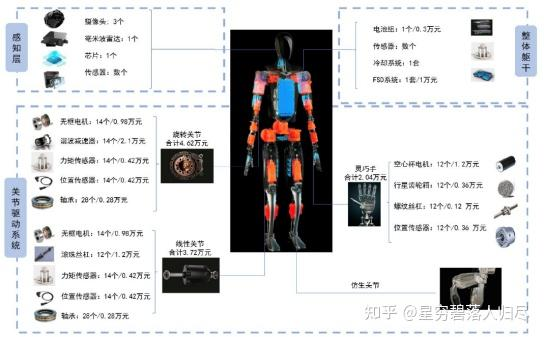

在机器人技术的迅猛发展进程中，控制器作为机器人的“大脑”，发挥着不可或缺的作用。它是连接机器人硬件系统与软件系统的中枢，负责将感知到的环境信息转化为具体的动作指令，为机器人的决策和行动提供核心支持。从工业自动化生产线上的精准操作，到服务机器人在复杂环境中的自主导航，从物流机器人高效的任务分配，到医疗机器人在微创手术中的精准控制，控制器的性能直接决定了机器人对任务的理解能力、决策的准确性和动作的精确性。本文将深入剖析机器人控制器的多种类型、工作原理、应用场景以及未来的发展趋势。

## 2.控制系统组织结构

工业自动化领域的运动控制架构采用分层式拓扑设计，其模块化组成可划分为以下三个核心层级‌：

一、组织层（中央决策单元）
基于工业级处理器构建的上位管理系统，通过分布式任务调度引擎实现生产计划的动态优化。该单元具备资源分配、工序编排和异常诊断功能，依托OPC UA协议实现与下层设备的双向通信‌。

二、协调层（运动协调中枢）
采用嵌入式运动控制器实现轨迹生成与多轴同步控制，运用实时控制算法（如三次样条插值）对速度曲线进行平滑处理。该层级通过前瞻控制技术解决加减速突变问题，并采用电子凸轮算法实现多执行机构的相位耦合‌。

三、执行层（执行驱动模块）
由伺服驱动单元和永磁同步电机构成动力输出链，每个执行单元配备高精度磁栅编码器（分辨率达23bit），通过EtherCAT总线实现μs级同步周期。该模块集成过载保护电路和热补偿算法，支持在线惯量辨识功能‌。

运动控制器是机器人系统的核心部件，负责处理来自传感器的数据、执行算法指令，并控制机器人的运动和动作。根据功能，机器人控制器可以分为“大脑”和“小脑”两部分：大脑负责复杂的算法处理、环境感知、任务规划和决策执行，其硬件主要依赖于GPU、CPU和NPU等主控芯片。小脑则专注于运动控制，将来自“大脑”的指令转化为具体的机械动作，包括对伺服系统和传感器的控制，其硬件主要由MCU和电控系统组成。运动控制器的基本硬件架构采用异构计算平台，以ARM Cortex-A9为核心处理单元（主频800MHz）配合Xilinx Zynq-7020 FPGA实现硬实时控制。该平台集成PROFINET、CANopen等工业总线接口，支持EtherCAT从站协议栈，可扩展至32轴联动控制。实验表明，该架构在重复定位精度（±0.02mm）和动态响应（阶跃响应<50ms）方面较传统系统提升40%以上‌。

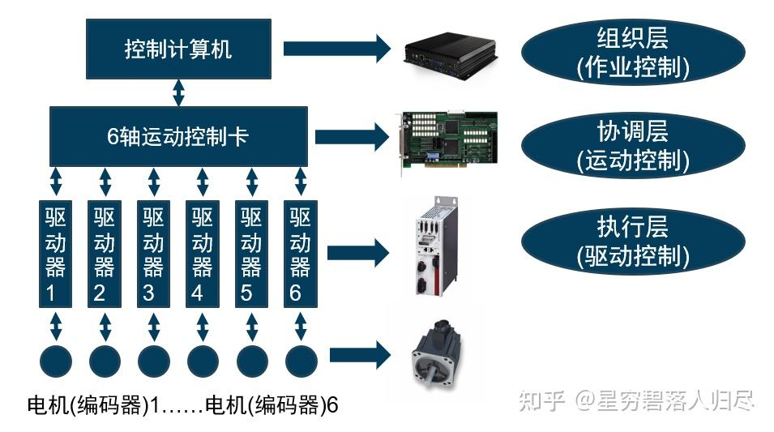

针对自动驾驶、医疗机器人、协作机器人，工业机器人，人形机器人等不同具身智能的应用领域，其硬件控制器的场景需求和算力要求各有侧重：

- **自动驾驶**：自动驾驶域控制器需要满足高级别自动驾驶功能实现，具备多类型信号接入、多类型计算、高实时、高安全、大算力等复杂功能及特点。域控制器硬件算力需支撑感知运算、融合运算、预测筛选运算、规划运算、定位运算、地图运算、接渲染运算和车控运算等。
- **医疗机器人**：医疗机器人通常需要精确控制和实时反馈，以确保在手术或治疗过程中的安全性和精确度。控制器需要具备足够的算力来处理传感器数据，进行图像识别和路径规划，同时保持低功耗以延长电池寿命。此外，控制器还需要能够与医疗设备进行通信，实现远程监控和操作。
- **协作机器人**：协作机器人（Cobots）需要在人类工作环境中安全地操作，因此对控制器的实时性和安全性要求较高。控制器需要能够处理多传感器数据，如视觉、力觉和触觉传感器，以实现精确的运动控制和碰撞避免。此外，控制器还需要支持高并发处理，以同时处理多个计算任务，如路径规划和任务执行。
- **工业机器人**：工业机器人控制器通常需要处理复杂的运动控制任务，如多轴协调和精确定位。控制器需要具备强大的算力来实现高速、高精度的运动控制，同时保持低延时和高吞吐率，以确保生产效率和质量。此外，工业机器人控制器还需要支持多种通信接口，以实现与其他自动化设备和系统的集成。
- **人形机器人**：人形机器人全身运动控制需要[20-50 TFLOPS](#知识扩展)的算力。控制器需要处理来自多个关节和传感器的数据，并执行复杂的运动规划和控制任务。这要求控制器具备高算力、高实时性和低功耗，以实现人形机器人的自然运动和精确控制。

对于以上应用场景，其相应的嵌入式计算硬件平台都需要具备大算力、高实时性、低功耗和高并发处理能力，以满足复杂多变的应用需求。同时，控制器还需要支持深度学习大模型，以实现更高级的智能决策和控制。这些需求推动了嵌入式计算平台的发展，如基于ARM A9和FPGA（如Xilinx Zynq）的硬件平台，它们支持多种通信接口，增强了系统的灵活性和扩展性。

而具体到机器人控制器上，其芯片呈现“高性能边缘计算+专用控制+底层驱动”的层级架构：

- **上层**：NVIDIA Orin、昇腾等处理AI推理与复杂决策；

- **中层**：国讯芯微、拓斯达等专用控制器实现运动规划与实时控制；

- **底层**：MCU、PLC等完成精准执行。

而针对每一层的层级架构，又分为相应的硬件平台：

- **高性能边缘计算平台**：目前主流采用的一般是NVIDIA Jetson Orin系列，其核心架构基于Arm Cortex-A78AE CPU与Ampere架构GPU，集成CUDA核心、Tensor Core和深度学习加速器（DLA），提供了高达275 TOPS（INT8）的算力，能够支持实时多模态数据处理和AI推理。其中AGX Orin适用于复杂机器人控制、自动驾驶及大规模并行计算，而Orin Nano则面向低功耗边缘设备，更适用于轻量级AI任务（如服务机器人基础感知与决策）。

- **专用运动控制器**

  - 1.国讯芯微NSPIC-R006NP：其采用了工业级ARMv8架构，具有64GB LPDDR5内存，AI算力达275 sparseTOPS（INT8），能够支持多任务并行处理与13B参数大模型加载，适用于复杂运动控制与认知决策。该控制器还搭载自主硬实时系统，其中断响应速度达纳秒级，控制周期抖动仅125微秒，能够满足高精度工业机器人需求。

  - 2.拓斯达X5控制平台：基于华为openEuler操作系统，对云端-边缘协同计算进行了优化，提升了实时数据处理能力，能够适配人形机器人多关节运动控制。

  - 3.天准科技具身域控制器：支持多传感器接入与边缘计算，并对英伟达Isaac平台进行了适配，并提供了相应的AI算法工具链，能够覆盖仿真、训练到部署全流程。

- **底层驱动器**

  - 1.可编程逻辑控制器（PLC）：支持模块化设计，可以灵活配置I/O模块，具备高速响应（开关延迟<0.3ms），适用于精确的传感器信号处理与执行器控制，能够适应燃气处理、工业流水线等场景的自动化控制，但传统PLC更多用于工业自动化底层控制，需与上层AI控制器（如Orin）结合，才能够进行机器人高级智能功能的控制实现。

  - 2.微控制器（MCU）：比较常用的是TI系列微控制器，采用低功耗设计，能够适配实时操作系统（RTOS），满足高动态响应需求，能够支持无刷直流电机（BLDC）的精准控制，适用于机器人关节驱动与姿态调整。

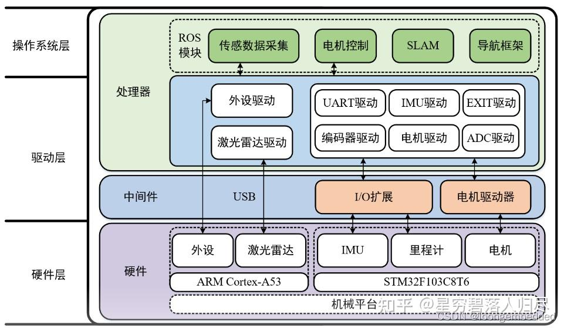

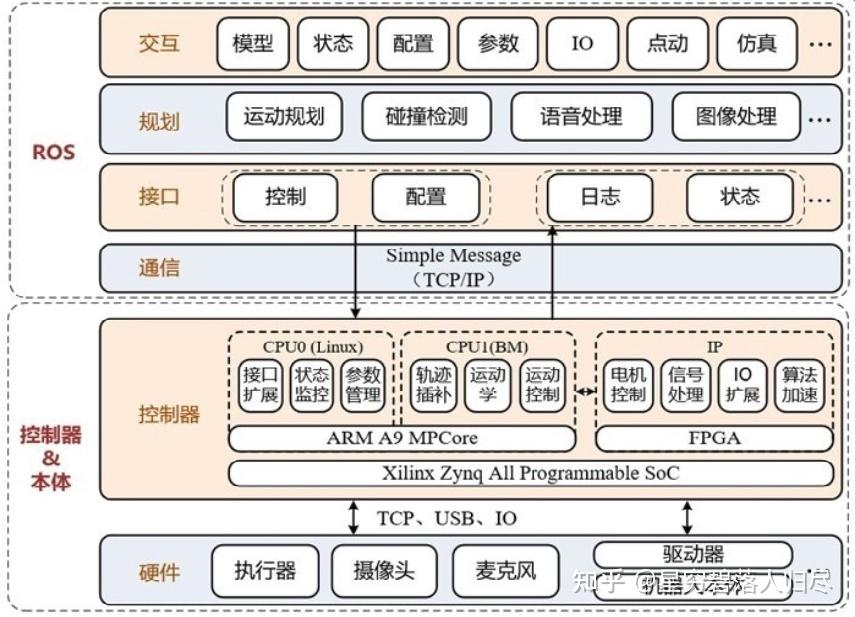

## 3.常用机器人控制器平台分类

机器人运动控制的嵌入式硬件平台种类多样，根据性能、应用场景和技术特点的不同，可分为以下几类，并结合实际案例和技术趋势进行介绍：

### 3.1基于通用微控制器的平台

这类平台以ARM、STM32等通用微控制器为核心，适合中小型机器人或对实时性要求较高的场景。

- **ARM+CPLD组合**：由ARM（如Cortex-M系列）负责主控逻辑，CPLD（复杂可编程逻辑器件）处理高速并行任务（如PWM生成、信号滤波）。比如，在四足机器人控制器设计中，ARM实现运动算法，CPLD辅助处理多路传感器信号和电机驱动逻辑。

- **STM32系列开发板**：其具有成本低、开发便捷，适合快速原型设计等特点，如STM32F407开发板支持PWM输出、编码器接口和传感器集成，搭配直流电机驱动模块实现移动机器人控制。

### 3.2 DSP（数字信号处理器）平台

适用于需要高速运算和多传感器融合的场景。

核心芯片：如TI的TMS320VC5402，专为实时信号处理优化，支持多路模拟量、脉冲量和开关量输入输出。

应用场景：工业机器人中实现多轴运动控制、网络通信及复杂算法（如PID、模糊控制）。

### 3.3 FPGA（现场可编程门阵列）平台

以并行处理和高实时性为核心优势，适合复杂控制任务。

- **纯FPGA方案**： 通过硬件描述语言实现逻辑电路，拥有可定制PWM调速、编码器计数等功能模块，响应速度能够达到微秒级。 如在人形机器人腰部控制系统中，FPGA主要负责处理多自由度电机同步控制及传感器信号预处理。

- **FPGA+嵌入式处理器组合**：这种组合主要结合了FPGA的并行处理能力和处理器的通用计算，例如通过UART或CAN总线与上位机通信，实现复杂运动规划。

### 3.4 嵌入式工控机

适合高性能需求及复杂环境下的机器人控制。

典型产品：

- 1.东田DTB-3049-H310：搭载Intel CPU，支持-25~70℃宽温运行，提供多网口和USB接口，适用于消防、巡检机器人。

- 2.DTB-3312-Q670E：配备PCIe扩展插槽和GPU支持，适合图像识别和深度学习任务。

优势：扩展性强、支持多种操作系统（如Ubuntu、Android），满足工业级稳定性需求。

### 3.5 AI融合的高性能平台

结合AI算法与大模型，推动机器人智能化。

- 1.拓斯达新一代运动控制平台

特点：基于欧拉操作系统（openEuler），集成AI大模型，支持多协议通信（如Modbus、Ethernet/IP），实现物理世界与数字世界的交互。

- 2.HARMONIOUS系统

特点：仿人机器人运动控制中，通过多模态感知（视觉、触觉）优化轨迹规划，结合二次规划算法实现类人运动平滑性。

### 3.6 专用模块化控制器

一般针对特定机器人类型（如四足、人形）定制，如在宇树科技的四足机器人控制器中集成了自主研发的电机驱动、传感器接口和运动控制算法，可以支持多传感器融合与高精度反馈控制。

在嵌入式硬件选型中，针对不同应用场景的技术路线呈现出显著差异。

- **‌小型机器人领域‌**需重点考量设备续航与响应速度，采用ARM架构搭配CPLD可编程器件或STM32系列微控制器，能够实现μA级休眠电流与毫秒级任务响应‌，这类方案特别适合电池供电的巡检机器人或医疗辅助设备等移动场景。
- **‌复杂计算场景‌**如自动驾驶和智能质检系统，建议采用X86架构嵌入式工控机与FPGA+NPU的异构计算方案，例如英特尔Movidius加速芯片与Xilinx Ultrascale+ FPGA的组合，可提供15TOPS算力支撑视觉算法运行‌，其动态功耗管理技术还能平衡性能与能耗。‌
- **工业级应用‌**则更注重系统稳定性，推荐TI C6000系列DSP处理器或倍福CX系列模块化工控机，这类设备不仅支持-40℃~85℃宽温工作，其双网口冗余设计和热插拔模块还能保障产线24小时不间断运行‌，在焊接机器人或数控机床等场景中展现出卓越的环境适应性。

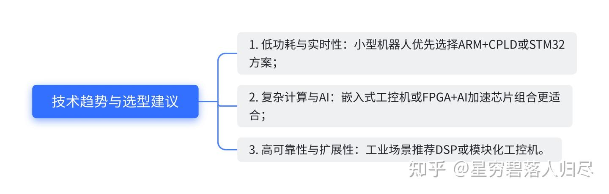

## 4. SOC平台

### 4.1 SoC介绍

SoC（System on Chip，片上系统）是一种高度集成的芯片，将处理器核心、存储器、外设接口、通信模块以及专用加速器等功能集成在一个芯片上，形成一个完整的系统。这种设计大大减少了系统的体积、功耗和成本，同时提高了性能和可靠性。

### 4.2 常用的SoC类型

- `ARM Cortex`系列SoC：广泛应用于移动设备、嵌入式系统和物联网设备。特点：低功耗、高性能、支持多种操作系统.
- `Qualcomm Snapdragon`系列：主要用于智能手机和平板电脑。特点：高性能处理器、集成GPU和通信模块.
- `NVIDIA Jetson`系列：专为边缘计算和人工智能应用设计。特点：高性能GPU、支持深度学习和计算机视觉
- `Intel Atom`系列：用于低功耗计算设备，如平板电脑、小型PC和嵌入式系统。特点：兼容x86架构，支持多种操作系统。

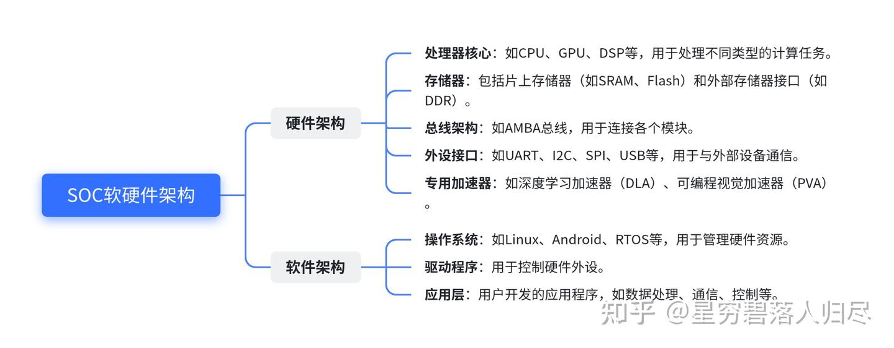

### 4.3 Jetson Orin系列介绍

英伟达的Jetson Orin系列是专为下一代机器人和边缘解决方案设计的高性能嵌入式AI计算机。该系列包括七个模块，具有相同的架构，能够提供高达每秒275万亿次操作（TOPS）的处理能力，是上一代性能的8倍。这一强大的性能使其非常适合多模态AI推理、高速接口支持以及生成性AI、计算机视觉和高级机器人技术等应用。

Jetson Orin模块由与其他NVIDIA平台相同的AI软件和云原生工作流程提供支持，它们提供了在边缘构建自主机器所需的性能和能效。此外，功能强大的Jetson软件堆栈具有预训练的AI模型、参考AI工作流程和垂直应用框架，加速了生成性AI以及任何边缘AI和机器人应用的端到端开发。同时提供了许多与电源管理、热管理和电管理相关的功能，以在特定平台的约束条件下提供最佳的用户体验。

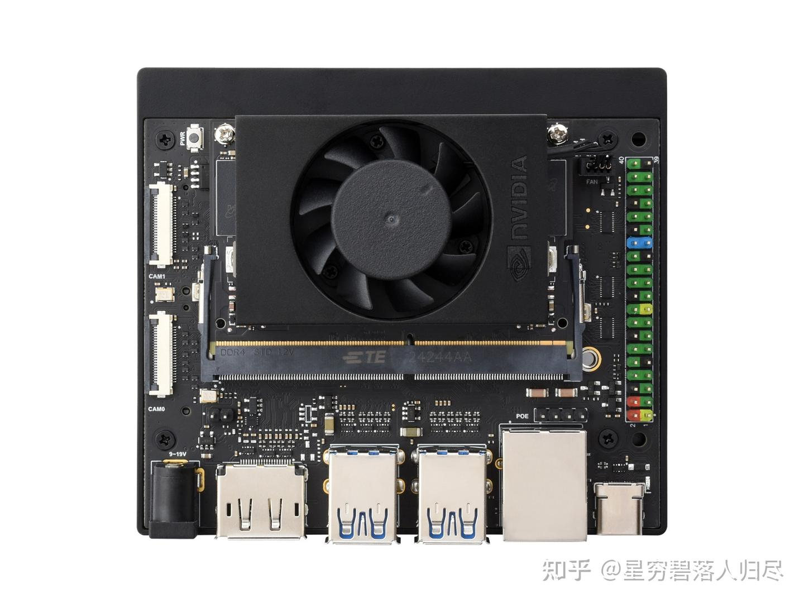

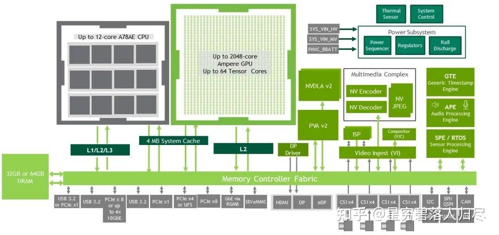

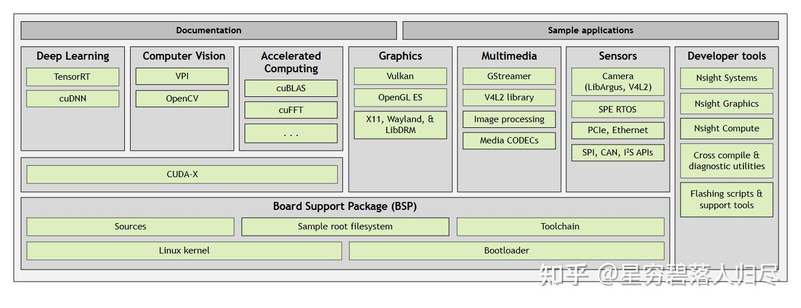

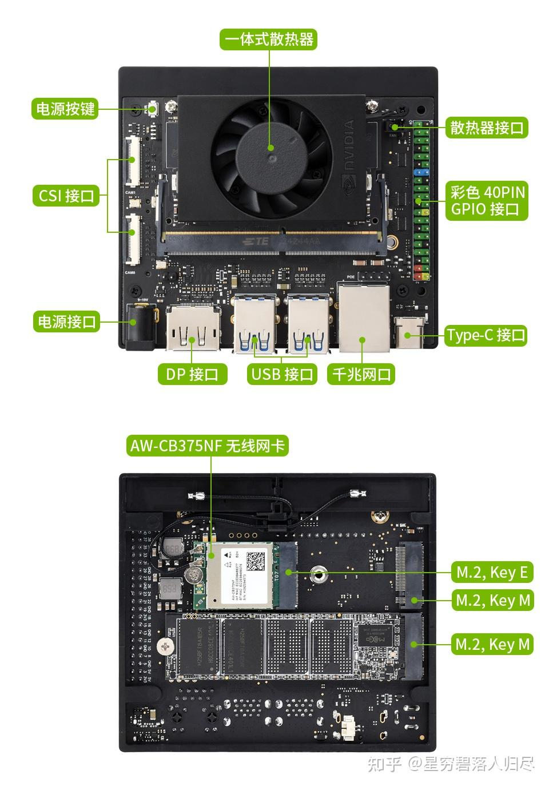

#### 4.3.1 硬件架构

##### 核心处理器（SoC）

- **CPU**：基于Arm Cortex-A78AE架构的多核设计。具体配置因型号而异：
  - **Jetson AGX Orin**：最高配备12核Cortex-A78AE（主频2.2 GHz），支持多线程任务处理，适用于复杂机器人控制和高并发AI推理813。
  - **Jetson Orin NX**：8核Cortex-A78AE（主频2 GHz），这些核心被组织成多个四核心集群。这些集群包含每个核心的私有L1和L2缓存、一个Snoop控制单元（SCU）以及一个集群级L3缓存（由四个核心共享），一个互连结构和调试支持模块（CoreSight），平衡性能与功耗。
  - **Jetson Orin Nano**：6核Cortex-A78AE（主频1.5 GHz），面向入门级边缘AI设备。

- **GPU**：全系列搭载NVIDIA Ampere架构GPU，包含集成的Ampere GPU，由2个图形处理集群（GPCs）、多达8个纹理处理集群（TPCs）、多达16个流式多处理器（SM’s）、每个SM的192 KB的L1缓存和4 MB的L2缓存组成。与Volta相比，Ampere每个SM有128个CUDA核心，以及每个SM的四个第三代Tensor核心，完全支持CUDA加速和Tensor Core：
  - **AGX Orin**：最高2048个CUDA核心，64个Tensor Core，提供275 TOPS算力（INT8），适合大规模并行计算。
  - **Orin NX**：1024个CUDA核心，32个Tensor Core，算力达100 TOPS8。
  - **Orin Nano**：512个CUDA核心（16个Tensor Core），算力最高40 TOPS810。

##### 专用加速器

- **深度学习加速器（DLA）**：支持多路并行推理，如AGX Orin配备2个第二代NVDLA，可独立处理视觉和语音任务，降低CPU/GPU负载。
- **视觉加速器（PVA）**：用于图像预处理（如去噪、特征提取），部分高端型号（如AGX Orin）集成PVA v2，提升摄像头数据处理效率。

##### 内存与存储

- **内存**：采用LPDDR5，带宽最高204.8 GB/s（AGX Orin 64GB版本），支持多传感器数据实时处理813。
- **存储**：部分型号内置eMMC（如Orin NX 16GB含64GB eMMC），支持NVMe扩展，满足高吞吐量存储需求8。

##### 外设与接口

- **传感器支持**：最多16通道MIPI CSI-2接口（AGX Orin），可连接多摄像头、LiDAR等传感器，并支持时间同步校准。
- **网络与扩展**：集成GbE/10GbE以太网、PCIe 4.0（AGX Orin支持x8通道）、USB 3.2等，适用于工业物联网和机器人扩展。
- **功耗管理**：动态功耗调节：AGX Orin支持15W-60W可调，Orin Nano低至5W-15W，适应不同场景的能效需求。

#### 4.3.2软件架构

##### Bootloader与系统启动

支持Ubuntu Linux作为基础操作系统，并提供安全启动（Secure Boot）功能，防止未授权固件加载，其采用统一引导流程，开发者可通过Jetson AGX Orin开发者套件模拟全系列模块，实现从开发到量产的无缝迁移。

##### CUDA加速与AI软件栈

- CUDA-X库：集成CUDA、cuDNN、TensorRT等，优化AI模型推理效率，例如通过TensorRT将模型转换为硬件优化格式，提升推理速度。
- 多模态AI支持：结合NVIDIA Isaac平台，提供视觉SLAM、3D重建等预训练模型，适用于机器人导航和工业检测。

##### JetPack SDK

包含完整的开发工具链（如Nsight工具）、驱动程序和AI框架（PyTorch、TensorFlow），支持从模型训练到边缘部署的全流程。同时也提供了云原生工作流，支持Kubernetes和容器化部署，便于大规模边缘AI应用管理。

##### 机器人操作系统（ROS）集成

兼容ROS/ROS2，结合Isaac Sim仿真工具，开发者可在虚拟环境中测试算法，减少实体机器人调试成本。

## 5. 可编程逻辑控制器PLC

PLC（可编程逻辑控制器）以其可靠性高、抗干扰能力强、编程简单等特点，广泛应用于工业自动化领域。PLC的内部结构类似于计算机，具备强大的计算能力，并配备多样化的输入、输出接口，使其能够灵活应对复杂多变的生产环境。通过编程，PLC可以实现对机器人的控制和动作规划，满足各种复杂的生产需求。

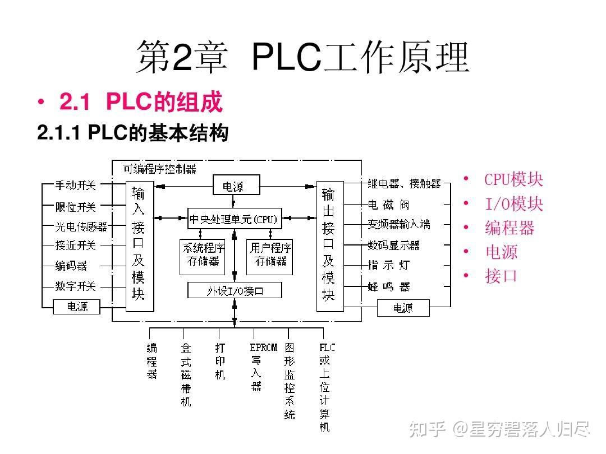

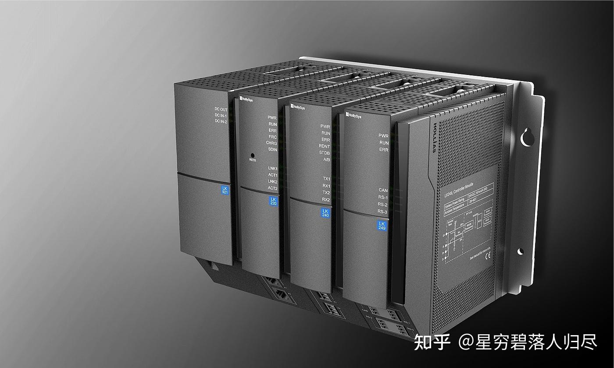

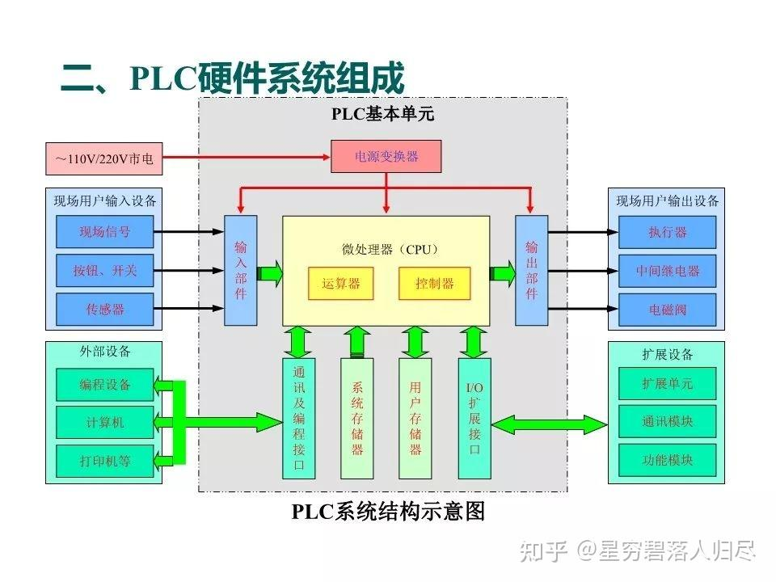

PLC（Programmable Logic Controller）是一种专为工业环境设计的数字控制设备，用于自动化控制机械或生产过程。其核心特点是高可靠性、实时性和抗干扰能力，广泛应用于制造业、能源、交通等领域。

### 5.1 PLC 的工作原理

PLC 采用“**循环扫描**”工作模式，其扫描周期通常在毫秒级（如1ms~100ms），实时性强，其扫描模式为集中输入、集中输出，避免冲突。主要分为三个阶段完成控制任务：

- 1.**输入扫描（Input Scan）**：读取所有输入端口的状态（如传感器信号、按钮状态等），并将这些状态存储在输入映像寄存器中。输入信号在这一阶段被统一采集，确保程序执行过程中输入状态的一致性。
- 2.**程序执行（Program Execution）**：CPU 按照用户编写的控制逻辑（如梯形图、指令表等）逐行执行程序，根据输入映像寄存器的值进行逻辑运算，并将结果写入输出映像寄存器。此阶段不直接操作物理输出，仅更新内部寄存器。
- 3.**输出刷新（Output Update）**：将输出映像寄存器的值发送到物理输出模块，驱动执行器（如电机、电磁阀、指示灯等）。完成后重新开始下一轮扫描，循环往复。

### 5.2 PLC 的硬件系统架构

PLC 的硬件采用模块化设计，便于扩展和维护，主要组件如下：

- **中央处理单元（CPU）**：为核心部件，主要负责执行控制程序、处理数据、协调各模块工作。其内置的存储区包括程序存储器（存储用户程序）和数据存储器（存储变量、状态等）。
- **输入/输出模块（I/O 模块）**：该模块通常具备电气隔离和滤波功能，防止干扰，其数字量 I/O：处理开关信号（如0/1），例如按钮、限位开关。其模拟量 I/O：处理连续信号（如4~20mA、0~10V）。
- **电源模块**：将外部电源（如220V AC）转换为 PLC 内部所需的直流电压（如24V DC）。
- **通信模块**：支持工业通信协议（如Modbus、Profinet、Ethernet/IP），实现PLC与上位机、HMI、其他PLC或智能设备的数据交互。
- **扩展模块**：通过总线（如背板总线）扩展更多I/O模块或特殊功能模块（如运动控制、高速计数）。
- **编程设备/接口**：通过编程电缆或网络连接PC，用于下载程序和调试（如RS232、USB、以太网接口）。

### 5.3 PLC 的软件系统架构

PLC 的软件系统分为系统程序和用户程序两部分：

- **系统程序（固化在ROM中）**：主要包括，
  - 操作系统：实时多任务系统，管理扫描周期、通信、中断等。
  - 通信协议栈：支持多种工业网络协议。
  - 诊断功能：检测硬件故障、程序错误等。

- **用户程序（存储在RAM或闪存中）**：用户根据控制需求编写的逻辑程序，常用编程语言包括：
  - 梯形图（Ladder Diagram, LD）：类似电气原理图，适合逻辑控制。
  - 结构化文本（Structured Text, ST）：类高级语言（如Pascal），适合复杂算法。
  - 功能块图（Function Block Diagram, FBD）：图形化模块化编程。
  - 指令表（Instruction List, IL）：类似汇编语言，现已较少使用。
- **编程软件（上位机工具）**：提供编程、仿真、调试和监控功能。
- **诊断与维护工具**：实时监控PLC状态、变量值、通信状态，支持在线修改程序和故障排查。

对于工业机器人，控制器需要能够处理复杂的逻辑控制和高稳定性的输出信号。PLC（可编程逻辑控制器）通常用于工业自动化控制系统中，它们具有高度的实时性，能够快速响应外部输入并作出控制输出，这对于工业自动化控制至关重要。

## 6.嵌入式工控机

### 6.1. 常见的嵌入式工控机类型

嵌入式工控机（Embedded Industrial Computer）是一种专为工业现场设计的紧凑型计算机，通常具有低功耗、无风扇、高可靠性和多种接口等特点。常见的类型包括：

- **BOX工控机**：低功耗、无风扇设计，适用于恶劣环境。
- **无风扇工控机**：采用全封闭设计，通过机箱散热，防尘、防潮。
- **定制化工控机**：根据特定工业需求定制，支持多种接口和扩展。

### 6.2. 工作原理

嵌入式工控机的工作原理主要基于其独特的硬件设计和散热机制：

- **散热机制**：采用全封闭无风扇设计，CPU散热面涂有导热硅胶，与机箱散热片直接接触，将热量传导至散热片，实现高效散热。
- **硬件集成**：采用嵌入式、低功耗主板，硬件集成度高，减少了外部连接引起的问题。
- **实时性**：通常配备实时操作系统（RTOS）或实时扩展操作系统，以满足工业控制系统对实时性的要求。

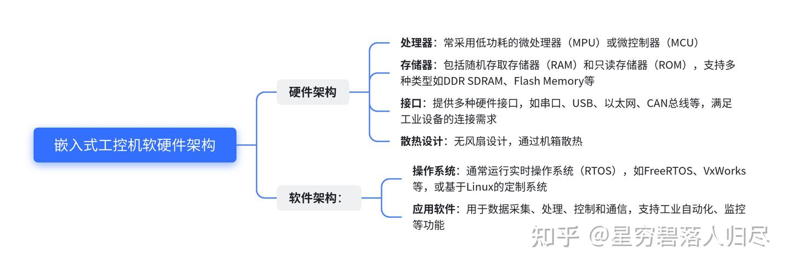

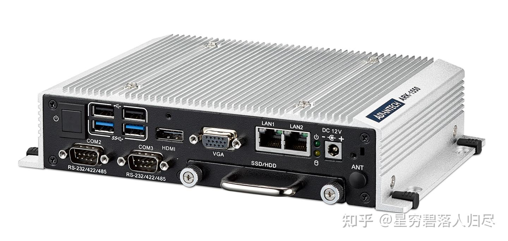

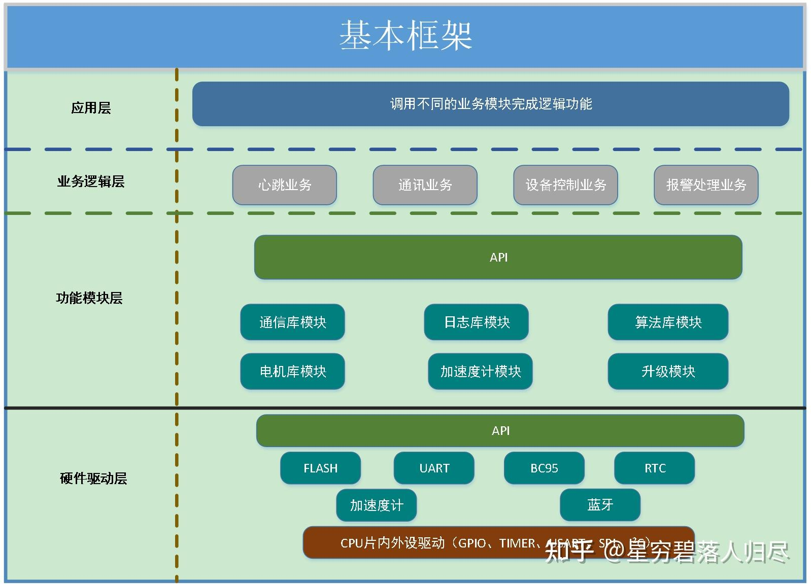

## 7.FPGA

### 7.1 FPGA介绍

FPGA（Field-Programmable Gate Array，现场可编程门阵列）是一种高度灵活的集成电路，用户可以在现场对其进行硬件功能的配置和定制。它类似于一个可动态重新编程的电路板，能够根据需求实现各种逻辑功能。

### 7.2 FPGA的工作原理

FPGA的工作原理基于其核心组件：**可编程逻辑单元（CLB）和可编程互连结构**。

- 可编程逻辑单元（CLB）：CLB是FPGA的核心，类似于“积木”，通过配置可以完成各种逻辑功能。其主要组成部分包括：
  - 查找表（LUT）：用于存储逻辑函数的模块，通过预设的输入-输出关系实现复杂逻辑运算。
  - 多路复用开关：根据条件选择不同输入信号
  - 触发器：用于存储信号状态，保持数据或同步信号。
- 可编程互连结构：FPGA内部包含大量可重新配置的连接线路，用于连接不同的CLB和模块，实现数据传输和信号路由。

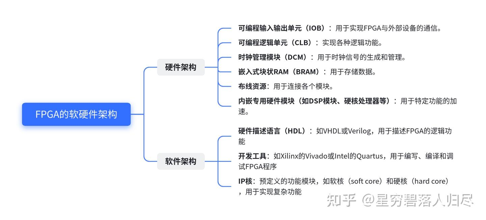

### 7.3. FPGA的应用

FPGA广泛应用于多个领域，包括但不限于：

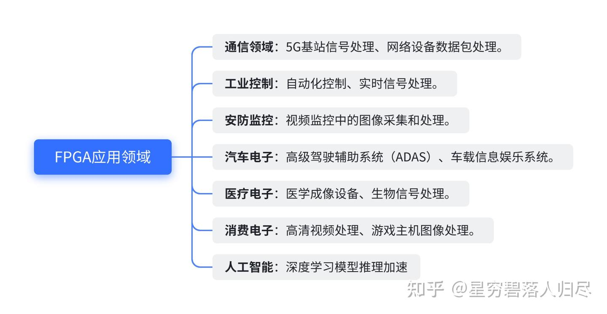

FPGA凭借其高度定制化架构和并行计算优势，在多个技术领域展现出独特价值。在通信领域，FPGA不仅实现5G基站中的大规模MIMO波束成形算法‌，还能完成400G光模块的PAM4信号调制与解调‌，其动态协议转换能力更支撑着SDN网络架构的灵活部署‌。工业场景中，FPGA通过μs级响应实现数控机床的闭环控制‌，在智能仓储系统中同步处理多轴伺服电机的实时信号‌。

视频安防领域，FPGA支持16路4K视频流的并行编解码与目标检测‌。汽车电子方面，Xilinx Zynq UltraScale+平台可并行处理ADAS系统的12路摄像头数据‌，同时实现车载以太网TSN协议的时间敏感型通信‌。医疗设备中，FPGA既能加速MRI设备的k空间数据重建‌，也可完成EEG信号采集系统的50kHz同步采样‌。

消费电子领域，FPGA为8K电视提供MEMC动态补偿算法‌，在游戏主机中实现实时光线追踪的硬件加速‌。人工智能应用中，采用FPGA+NPU异构架构可提升ResNet50模型推理速度达3.8倍‌，其可重构特性更适应不同神经网络模型的动态部署需求‌。

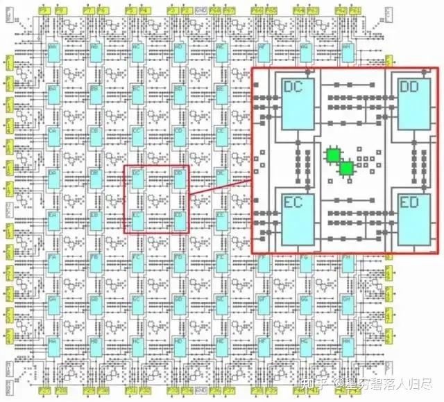

## 8.微控制器

### 8.1. 常见的微控制器类型

微控制器（MCU，Microcontroller Unit）是一种将处理器核心、存储器、输入/输出接口和其他功能模块集成在一个芯片上的集成电路。常见的微控制器类型包括

- **8位微控制器**：如Intel 8051系列、Microchip PIC系列。适用于简单任务和低功耗应用，如家电控制、玩具等。
- **16位微控制器**：如TI的MSP430系列。在功耗和性能之间取得平衡，适合中等复杂度的应用。
- **32位微控制器**：如ARM Cortex-M系列、STM32系列。性能强大，适用于复杂计算和高性能需求，如汽车电子、工业控制。
- **特殊用途微控制器**：如带有蓝牙模块、温度传感器等的微控制器，适用于特定应用场景。

### 8.2. 微控制器的工作原理

微控制器的工作原理基于其内部各个组成部分的协同工作，主要包括以下几个步骤：
- **初始化**：系统上电或复位时，微控制器进行自检，初始化存储器、外设接口和时钟。
- **程序执行**：CPU从程序存储器（如Flash）中读取指令并执行，处理数据并存储到RAM中。
- **输入/输出处理**：通过I/O接口读取外部信号或控制外部设备。
- **中断处理**：当外部事件触发中断时，微控制器暂停当前任务，执行中断服务程序。

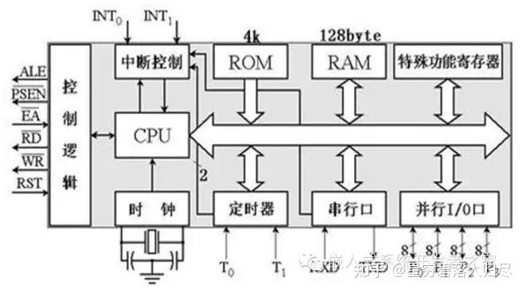

### 8.3. 微控制器的软硬件架构

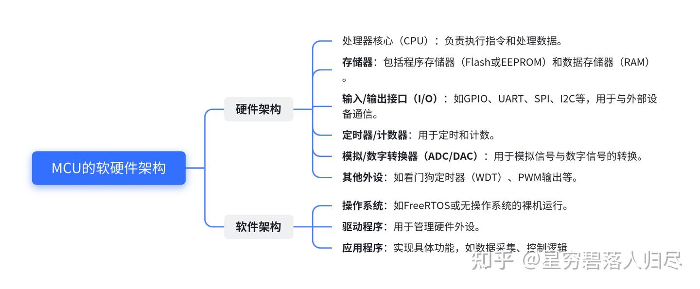

### 8.4 微控制器的应用

微控制器（MCU）凭借其高度集成与可编程特性，在现代化设备控制中形成多层次应用体系。‌

- **家电控制领域**‌中，搭载Cortex-M内核的MCU不仅实现空调的变频压缩机驱动与温度闭环调节‌，更通过智能算法优化洗衣机的能效管理，例如在滚筒洗衣机中完成布量检测与水位自适应控制‌。‌
- **汽车电子系统**‌内，32位车规级MCU（如NXP S32K系列）支撑着发动机ECU的燃油喷射时序控制‌，同时通过CAN总线协议实现车身稳定系统与胎压监测模块的实时诊断‌，其-40℃~125℃的工作温度范围确保极端环境下的可靠性‌。
- **工业自动化场景‌**下，STM32F4系列MCU通过PWM调制实现伺服电机的精准定位‌，配合SPI接口的高速ADC模块完成多路传感器信号的同步采集‌，其硬件加密引擎还能保障工业物联网节点的数据安全传输‌。‌
- **消费电子产品**‌中，8位MCU（如PIC16F）为智能玩具提供语音识别与动作反馈功能‌，在游戏手柄中则通过HID协议实现毫秒级按键响应‌。‌
- **医疗设备领域**‌，低功耗MCU（如MSP430）支撑便携式心电监测仪实现24小时连续数据采集‌，其内置的Σ-Δ ADC可精确捕捉0.5mV级生物电信号波动‌，而硬件看门狗模块则确保医疗设备运行的绝对稳定性‌。这种跨领域的渗透能力，印证了MCU作为智能化社会基础元器件的核心价值‌。

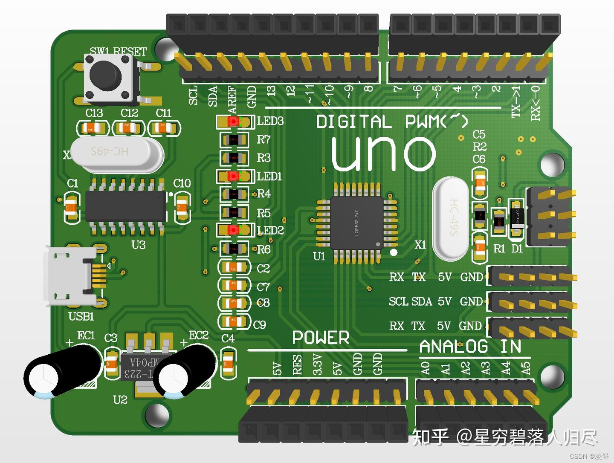

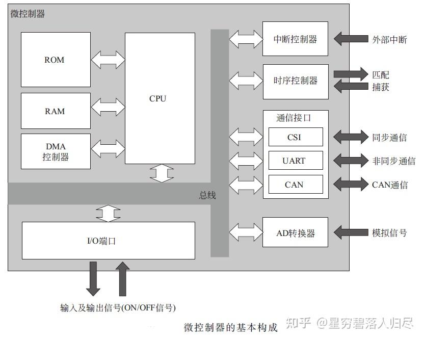

### 8.5 ESP32介绍

ESP32是一种功能强大的微控制器（MCU）。它集成了处理器核心、存储器、外设接口和无线通信模块，能够在一个芯片上实现完整的嵌入式系统功能。虽然它具备一些类似微处理器（MPU）的特性，但其设计目标仍然是作为一个完整的、集成化的嵌入式系统解决方案。

特点：

- **处理器核心**：ESP32采用了双核处理器架构，支持双核运行，提供更高的处理能力。它基于Tensilica Xtensa LX6架构，支持多任务处理和复杂的计算任务。它还支持多种低功耗模式，适合电池供电的设备。
- **存储器**：ESP32集成了多种存储器，包括：内部Flash：用于存储程序代码和静态数据。SRAM：用于运行时数据存储。外部存储器接口：支持扩展存储器，如SDRAM。
- **外设接口**：ESP32提供了丰富的外设接口，包括：
  - GPIO：通用输入输出接口，用于连接传感器和执行器。
  - I2C、SPI、UART：用于与其他设备通信。
  - ADC和DAC：用于模拟信号的采集和输出。
  - PWM：用于控制电机或其他设备。

- **无线通信功能**

ESP32的一个显著特点是其强大的无线通信能力：

Wi-Fi：支持2.4GHz频段的Wi-Fi通信，适用于物联网设备的网络连接。

蓝牙：支持蓝牙4.2和低功耗蓝牙（BLE），用于短距离无线通信。

这些无线功能使得ESP32非常适合用于物联网（IoT）设备，例如智能家居、智能穿戴等。

- **低功耗设计**

ESP32支持多种低功耗模式，如深度睡眠模式（Deep Sleep）、轻睡眠模式（Light Sleep）等，能够在低功耗和高性能之间灵活切换，适合电池供电的设备。

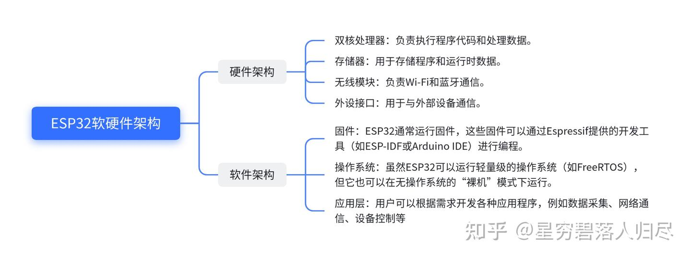

## 知识扩展

TOPS和TFLOPS都是衡量计算设备算力的单位，但它们的应用场景和背后的计算类型有本质区别。

简单来说，核心区别在于：
*   **TOPS** 衡量的是**整数运算**能力，主要用于**AI推理和专用加速**。
*   **TFLOPS** 衡量的是**浮点数运算**能力，主要用于**科学计算、图形渲染和AI训练**。

下面我们进行详细的对比和解释。

---

### TOPS (Tera Operations Per Second)

**1. 定义：**
*   **TOPS**：每秒万亿次操作。
*   **1 TOPS** = 每秒执行一万亿（10^12）次操作。
*   它还有一个更常用的前缀 **GOPS** (Giga Operations Per Second)，即每秒十亿次操作。1 TOPS = 1000 GOPS。

**2. 衡量什么：**
*   它衡量的是对**整数（INT8, INT16, INT4等）** 的操作速度。
*   “操作”通常指乘积累加运算（MAC, Multiply-Accumulate）。一次MAC操作（a*b + c）通常被计为**两次操作**（一次乘法和一次加法）。
*   它高度关注**低精度**（如INT8, INT4）下的吞吐量，因为神经网络推理对极高精度不敏感，降低精度可以极大提升能效和速度。

**3. 主要应用场景：**
*   **AI推理（Inference）**：这是TOPS最常见的应用领域。例如，手机NPU、自动驾驶芯片、安防监控芯片、边缘计算设备等，它们的算力通常都用TOPS来表示。
*   **专用处理器（ASIC/NPU）**：如谷歌的TPU、华为昇腾、寒武纪等AI加速卡，其峰值算力常用TOPS标称。

**4. 特点：**
*   **效率高**：针对特定类型的计算（如矩阵乘法、卷积）进行了高度优化。
*   **精度低**：通常使用低精度整数，牺牲了数值精度以换取极高的吞吐量。
*   **难以直接比较**：不同架构的芯片（如GPU vs NPU）即使有相同的TOPS，其实际性能也可能差异巨大，因为它严重依赖于内存带宽、软件栈、数据复用能力等因素。

---

### TFLOPS (Tera Floating Point Operations Per Second)

**1. 定义：**
*   **TFLOPS**：每秒万亿次浮点运算。
*   **1 TFLOPS** = 每秒执行一万亿（10^12）次浮点运算。
*   它通常指对**32位单精度浮点数（FP32）** 的操作，这也是最经典的衡量标准。此外还有针对FP16、FP64的衡量（例如 H100 的 FP8 算力）。

**2. 衡量什么：**
*   它专门衡量**浮点数（Floating Point）** 的计算能力，最常见的是一次完整的浮点乘法或加法运算。

**3. 主要应用场景：**
*   **科学计算与仿真**：流体力学、天体物理、气候模拟等，需要高精度浮点运算。
*   **AI训练（Training）**：训练深度神经网络需要计算梯度并更新权重，这个过程对数值精度和动态范围要求较高，因此传统上大量使用FP32或FP16混合精度。
*   **图形渲染（3D Graphics）**：游戏、CG动画等需要大量的顶点变换、光照计算，这些都是浮点运算。
*   **传统高性能计算（HPC）**：超级计算机的性能排名（TOP500）主要使用**FP64（双精度）** 的TFLOPS（或PFLOPS）作为标准。

**4. 特点：**
*   **精度高**：使用浮点数，能表示非常大和非常小的数字，计算精度高。
*   **通用性强**：是衡量通用计算芯片（如CPU、GPU）浮点性能的经典指标。
*   **相对可比性高**：对于相同架构的芯片（如NVIDIA的不同世代GPU），TFLOPS是衡量其性能提升的一个非常核心的指标。

---

### 重要注意事项和误区

1.  **不能直接换算和比较**：**1 TOPS ≠ 1 TFLOPS**。这是两种完全不同类型的操作。一个标称100 TOPS的NPU和一个标称10 TFLOPS的GPU，无法直接说谁更强，因为它们是为完全不同任务设计的。

2.  **“操作” vs “浮点操作”**：一次“操作”可能包含多次计算（如MAC算2次操作），而一次“浮点操作”通常指一次独立的计算。这使得单纯比较数字大小没有意义。

3.  **峰值算力 vs 实际性能**：两者通常都是**峰值算力**，是理论上的最大值。**实际性能（Throughput）** 严重受限于**内存带宽（Memory Bandwidth）**、延迟、软件优化程度等因素。一个拥有高算力但内存带宽低的芯片，实际表现可能很差（称为“内存墙”问题）。

4.  **厂商的“小心机”**：有些厂商在宣传AI算力时，可能会使用**较低精度**（如INT4甚至二进制）下的TOPS来给出一个非常巨大的数字，因为这看起来更吸引人。但在实际应用中，算法可能需要更高的精度（如INT16），这时实际算力会大幅下降。因此，**一定要关注算力是基于何种数据精度**。

### 总结

*   如果你的工作是**AI推理、部署边缘设备**，那么请重点关注 **TOPS**（并弄清是INT8还是其他精度），以及与之配套的内存带宽和能效。
*   如果你的工作是**AI训练、科学计算或3D渲染**，那么请重点关注 **TFLOPS**（并弄清是FP32还是FP16/FP64），以及GPU的架构和显存大小。

简单记：**TOPS看推理，TFLOPS看训练和科学计算**。在选择硬件时，一定要根据你的具体工作负载和所需的数值精度来理解这些指标，而不是单纯地比较数字大小。

