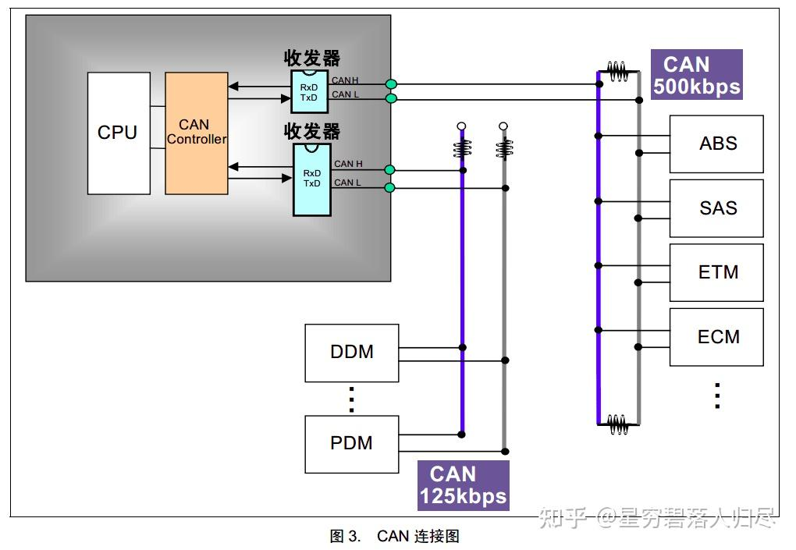
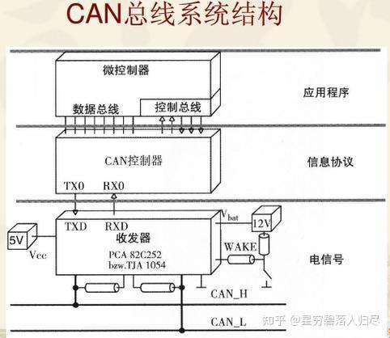
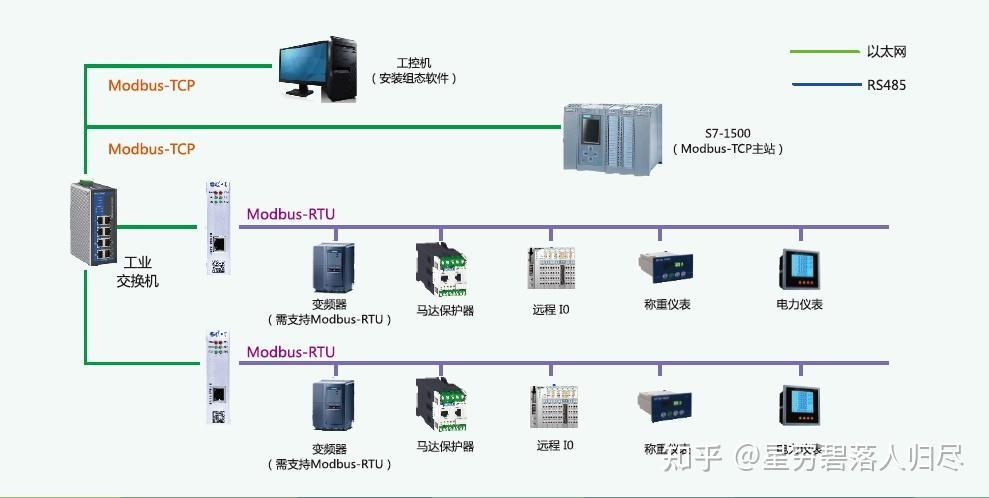
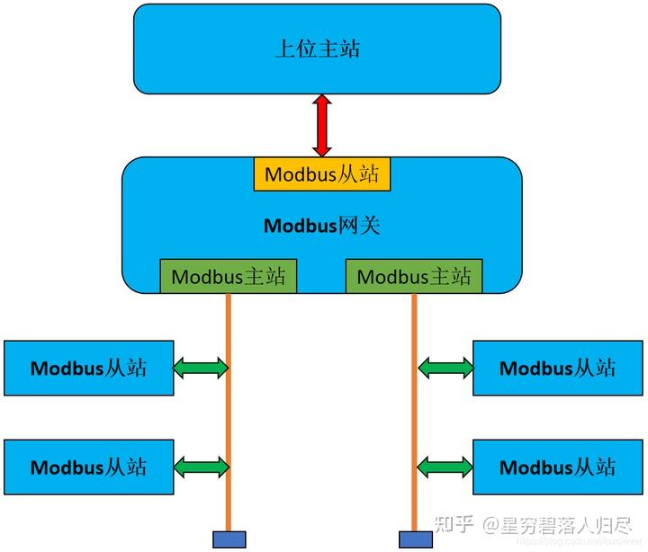

###### datetime:2025/09/17 12:00

###### author:nzb

# 机器人基础知识学习笔记---通信篇

## 1.引言

在现代机器人技术中，机器人运动以及功能实现离不开其基础硬件系统。 如图所示，机器人硬件系统的基本组成包括相机、芯片、传感器等构成的感知层；各类电机、传感器、轴承等组成的关节驱动系统；以及电池组、传感器、冷却系统和FSD系统构成的整体躯干层。

在机器人技术的蓬勃发展浪潮中，通信模块作为机器人身体组件之间的“神经系统”，扮演着至关重要的角色。它是连接机器人各个硬件部件的关键纽带，负责将传感器收集到的环境数据高效地传输至控制器，并将控制器生成的动作指令精准地传达给执行机构，确保机器人各部分协同工作。无论是工业机器人在复杂生产流程中多部件的同步协作，还是服务机器人在动态环境中与人类和其他设备的交互，亦或是医疗机器人在手术过程中各组件的精准配合，通信模块的性能直接影响机器人系统的响应速度、数据传输的稳定性和整体运行的流畅性。本文将深入探讨机器人通信模块的多种技术架构、数据传输协议、应用场景以及未来的发展方向。

## 2.通信方式的分类

### 2.1 有线通信

#### 2.1.1 PROFIBUS/PROFINET通信

作为德国工业4.0的核心通信标准，PROFIBUS诞生于1989年，采用主从令牌环架构，支持RT（实时）和IRT（等时实时）两种模式，IRT模式时钟抖动<1μs，最高速率12Mbps，支持127节点组网支持星型、环型和混合拓扑，最大网络直径达200公里。其升级版PROFINET基于以太网实现。在汽车制造车间中，通过PROFINET IRT实现200台焊接机器人毫秒级同步，定位精度达±0.05mm。

#### 2.1.2 CAN总线通信‌

CAN总线（Controller Area Network）是一种用于实时数据传输的串行通信协议，广泛应用于汽车电子、工业自动化、航空航天等领域。由博世公司于1986年研发，具有实时性好，高可靠性、抗干扰能力强、支持多节点分布式控制等特点，其物理层采用差分信号传输，内置CRC校验、帧格式校验和应答校验三重保障，误码率 < $$10^{-12}$$，已成为工业控制领域的经典解决方案。在机器人领域，CAN总线也得到了广泛的应用，例如在Boston Dynamics Atlas人形机器人中，通过CAN FD协议实现28个关节的500μs同步控制周期。CAN总线还衍生和发展了许多协议类型，比如基于CAN总线的CANopen协议。

#### 2.1.3 板级数字总线‌通信

- **‌I2C总线**‌：（Inter-Integrated Circuit）通信是一种广泛使用的串行通信协议，主要用于连接低速设备，如传感器、EEPROM、RTC（实时时钟）等。它具有简单、成本低、占用引脚少等优点，因此在嵌入式系统和物联网设备中非常常见。

- **‌SPI总线‌**：SPI（Serial Peripheral Interface，串行外设接口）是一种高速、同步、全双工的串行通信协议，主要用于微控制器（MCU）与外部设备之间的通信。SPI总线采用主从模式，即一个主设备（Master）和一个或多个从设备（Slave ）。

#### 2.1.4 异步串行通信‌

- **‌UART通信**：UART（Universal Asynchronous Receiver/Transmitter，通用异步收发传输器）是一种常见的串行通信协议，用于设备之间的数据传输。它允许设备以异步方式发送和接收数据，即发送方和接收方不需要共享时钟信号。其特点如下：

  - 异步通信：发送方和接收方不需要共享时钟信号，数据传输通过起始位和停止位来同步。
  - 全双工：UART支持全双工通信，即发送方和接收方可以同时发送和接收数据。
  - 简单高效：硬件接口简单，适用于低速、短距离通信。

#### ‌2.1.5 EtherCAT通信

EtherCAT（Ethernet for Control Automation Technology）是一种高性能的实时以太网通信协议，广泛应用于工业自动化领域。它由德国Beckhoff Automation公司在2003年开发，并于2007年成为国际标准（IEC 61158和IEC 61784）。其具有高实时性、高带宽的特点。在特斯拉Optimus中，通过EtherCAT G（千兆级）传输4K双目视觉数据，带宽利用率达97%。

#### 2.1.6 单线对以太网通信（SPE）‌

单对以太网（Single Pair Ethernet，SPE）是一种新兴的以太网技术，通过仅使用一对双绞线实现数据传输，同时支持数据线供电（PoDL）。它旨在满足工业物联网（IIoT）和工业自动化中对高效、低成本和小型化网络的需求。该通信方式简化了布线，传统以太网需要两对或四对双绞线，而SPE仅需一对双绞线，显著减少了布线的复杂性和成本。SPE支持多种传输速率，从10 Mbps到1 Gbps，传输距离可达1000米。SPE通信基于IEEE 802.3标准，确保了不同厂商设备之间的互操作性。SPE相对于传统以太网通信进行了小型化与轻量化，其电缆和连接器尺寸更小，适合在空间受限的环境中使用。在实际应用中，SPE通信方式的布线使Honda E2-DR人形机器人减少1.2kg线缆重量。

#### ‌2.1.7 Modbus通信

Modbus 是一种广泛应用于工业自动化领域的通信协议，最初由 Modicon 公司（现为施耐德电气的一部分）于 1979 年开发，用于支持可编程逻辑控制器（PLC）之间的通信。它已成为工业电子设备间通信的重要标准，支持多种物理层接口，包括串行接口（如 RS-232、RS-485）和以太网接口。Modbus 协议有多个变种，常见的包括：

- Modbus RTU：使用串行通信（如 RS-485 或 RS-232），数据以二进制形式传输，适用于长距离和噪声环境。
- Modbus ASCII：使用文本编码，便于调试和监控，但效率较低。
- Modbus TCP/IP：基于以太网的实现，支持 TCP/IP 网络，适用于分布式系统。
- Modbus UDP：基于 UDP 的实现，适用于对速度要求较高的场景。
- Modbus RTU over TCP：将 Modbus RTU 帧封装在 TCP/IP 报文中，结合了 RTU 的高效性和 TCP/IP 的网络功能。

#### ‌2.1.8 RS-232/RS-485通信

RS-232 和 RS-485 是两种常见的串行通信标准，广泛应用于工业自动化、嵌入式系统和计算机通信等领域。它们都基于串行通信，但具有不同的电气特性和应用场景。RS-232 是一种单点通信标准，通常用于点对点通信，如计算机与调制解调器（Modem）之间，RS-232通信距离较短，仅适用于短距离通信，不适合高速数据传输，易受电磁干扰。RS-485支持多点通信，可以连接多个设备（最多可达 32 个），适合长距离通信，其通信距离可达1200米左右，且支持较高的数据传输速率，并且能够有效抵抗电磁干扰，但其硬件复杂且布线要求高。

#### ‌2.1.9 USB Type-C扩展‌通信

USB Type-C 是一种新型的通用串行总线（USB）接口标准，广泛应用于现代电子设备中。它不仅支持高速数据传输，还支持多种功能，如电力传输、视频输出和音频传输。其支持多种USB协议，包括USB 2.0、USB 3.2、USB 4.0。

### 2.2 无线通信

#### 2.2.1. WiFi通信

WiFi（Wireless Fidelity）是一种无线局域网（WLAN）通信标准，基于IEEE 802.11标准。它允许设备（如手机、笔记本电脑、平板电脑等）通过无线信号连接到网络，而无需使用物理电缆。WiFi设备工作是通过无线接入点（AP）或路由器发送和接收无线信号。无线信号在空气中传播，设备通过天线接收这些信号并解码为数据。其具有高带宽、支持中远距离通信的特点，但可能受延迟影响。

#### 2.2.2. LPWAN通信（低功耗广域网）

‌LPWAN（Low-Power Wide-Area Network，低功耗广域网）是一种专为物联网（IoT）和机器对机器（M2M）应用设计的无线通信技术，旨在实现低功耗、长距离和低成本的通信。其网络架构由节点（物联网设备）、网关和云服务器组成，当节点通过无线信号与网关通信时网关将数据传输到云服务器。该通信方式采用多种协议，如LoRa、Sigfox、NB-IoT等，这些协议通过不同的频段、调制方式和编码方式实现低功耗和长距离通信。LPWAN的核心优势是μA级休眠电流，单电池可持续工作5-10年，能够支持百万级设备连接。

#### 2.2.3. 短距通信技术

‌蓝牙/BLE‌：蓝牙（Bluetooth）是一种短距离无线通信技术，主要用于连接设备（如手机、耳机、平板电脑、笔记本电脑、智能手表等），以实现数据传输和通信。蓝牙通信基于一种主从架构，其中一个设备（主设备）可以与多个从设备通信。其具有低功耗、短距离、设备直连的特点，典型应用有可穿戴设备实现肌电传感器数据实时同步，以及NFC辅助配对机器人外设。

‌Zigbee/Thread‌：Zigbee 和 Thread 都是基于 IEEE 802.15.4 标准的低功耗无线通信协议，广泛应用于物联网（IoT）和智能家居设备。尽管它们共享相同的物理层（PHY）和媒体访问控制层（MAC），但在上层协议和应用场景上存在显著差异。Zigbee定义了完整的应用层，保证了较强的应用层互操作性，Thread 是一种基于 IPv6 的低功耗无线通信协议，支持IPv6无缝接入互联网。

#### 2.2.4. 射频模块通信

‌射频模块通信（RF Module Communication）：射频模块（RF Module）是一种小型电子设备，用于在两个设备之间无线传输和接收射频信号。它广泛应用于各种无线通信场景，包括智能家居、工业自动化、远程控制等。射频模块通常集成了射频前端电路、调制解调器、天线接口等功能，能够在不同频段实现无线通信。射频模块主要有以下几种类型：

- 发射模块（Transmitter Module）：将数据转换为射频信号并发送；
- 接收模块（Receiver Module）：接收射频信号并将其转换回数据；
- 收发模块（Transceiver Module）：集成了发射和接收功能，支持双向通信。

射频模块的工作基于电磁波的传输原理，通信主要原理是调制，传输，接收以及解调。该方式无需物理连接，可在一定距离内传输数据，根据频率和功率，射频模块可以覆盖较远距离，适用于大面积监控。射频模块可应用在工业机器人遥控指令传输，能够做到毫秒级响应；在电磁敏感环境中，可以支持核电站巡检机器人的冗余通信。

#### 2.2.5. 蜂窝网络（5G/4G）

‌5G是第五代无线网络技术，旨在提供比4G更高的数据传输速度、更低的延迟，并支持更多设备和服务。5G技术的核心优势包括超高速、低延迟和大规模机器类型通信，能够满足从个人娱乐到工业自动化等多样化的需求。5G技术支持三大主要应用场景：

- 增强型移动宽带：适用于需要高带宽的服务，如4K/8K超高清视频、虚拟现实（VR）和增强现实（AR）。
- 超可靠低延迟通信：适用于对延迟要求极高的应用，如自动驾驶汽车、远程医疗手术和工业自动化。
- 大规模机器类型通信：适用于大量设备的连接，如智能城市、智能农业和工业物联网。

#### 2.2.6. 软件层通信

‌ROS中间件‌通信

ROS （Robot Operating System）是一种面向机器人系统的分布式通信框架，提供了多种通信方式以满足不同的应用场景。ROS适用于分布式系统，支持零拷贝数据传输，可明显降低CPU负载，以下为ROS定义的几种通信方式：

- 话题（Topics）：基于发布-订阅模式，节点可以发布消息到一个话题，其他节点可以订阅该话题以接收消息。这种方式适用于需要频繁更新的数据（如传感器数据）；
- 服务（Services）：基于请求-响应模式，客户端节点发送请求到服务节点，并等待响应。这种方式适用于需要明确应答的操作；
- 动作（Actions）：结合了请求-响应和发布-订阅模式，适用于需要长时间执行的任务，支持反馈和取消功能；
- 参数（Parameters）：用于配置节点行为，支持动态更新和复杂的参数结构。

与 ROS1 相比，ROS2 在多个方面进行了改进：

- 通信机制：ROS1基于TCP/UDP，而ROS2基于DDS，提供了更高效、更可靠的通信；
- 系统架构：ROS1依赖中心节点，ROS2采用去中心化架构，增强了系统的健壮性；
- 实时性：ROS2优化了实时控制能力，适合高实时性需求的场景；
- 安全性：ROS 2提供了更完善的安全特性，如通信加密和身份认证。

DDS协议栈‌通信

DDS（Data Distribution Service）通信是一种高性能的分布式数据交换中间件，广泛应用于实时系统中，如航空航天、工业自动化和自动驾驶等领域。它基于发布-订阅模型，允许设备或应用程序作为发布者发布数据，而其他设备或应用程序作为订阅者接收这些数据。DDS的核心通信模式基于发布者-订阅者模型，数据发布者将数据发送到全局数据空间，订阅者从该空间接收数据。其数据话题定义了数据的类型和结构，是数据交换的“频道”。DDS采用完全去中心化的架构，系统组件之间可以自动发现并建立通信，提高了系统的灵活性和可扩展性。DDS具有高可靠性、支持复杂数据流的特点，能够在毫秒级别提供快速的数据传输，适用场景于自动驾驶中多传感器融合方案需要时钟严格同步的情况。

## 3.技术选型与场景适配

在当今快速发展的科技时代，通信技术已成为推动机器人技术进步的关键因素之一。不同的通信方式在实时性、功耗、部署成本和数据安全等方面各有优劣，而合理的技术选型和适配是实现高效、可靠机器人通信系统的基础。

**实时性：从硬实时到非实时**

实时性是通信系统的重要性能指标，尤其在机器人控制和自动化系统中。根据实时性要求的不同，通信协议可以分为硬实时、软实时和非实时三类。

- **硬实时（Hard Real-Time）**：硬实时系统要求在严格的时间约束内完成任务，延迟必须控制在极低水平。例如，EtherCAT 是一种广泛应用于工业自动化领域的硬实时协议，它能够实现微秒级的同步精度，适用于需要高精度控制的场景，如机器人的关节驱动和平衡控制。

- **软实时（Soft Real-Time）**：软实时系统虽然也有时间约束，但允许一定程度的延迟。DDS（数据分发服务）是一种典型的软实时协议，它在航空航天、军事和智能交通等领域有广泛应用。DDS能够根据数据的重要性和优先级动态调整传输策略，适用于对实时性有一定要求但不需要极端精确的场景。

- **非实时（Non-Real-Time）**：非实时系统对时间要求较低，延迟较高。WiFi是最常见的非实时通信技术，广泛应用于日常的互联网接入和智能家居设备。虽然延迟较高，但其灵活性和易用性使其成为许多应用场景的首选。

**功耗：从低功耗到高功耗**

功耗是通信系统设计中不可忽视的因素，尤其在移动设备和物联网应用中。不同的通信技术在功耗方面存在显著差异。

- BLE（蓝牙低能耗）：BLE以其极低的功耗（nJ/bit）著称，是低功耗设备的理想选择。它广泛应用于可穿戴设备、医疗设备和智能家居传感器，能够在极低的功耗下实现稳定的通信。

- Zigbee：Zigbee是一种低功耗、低速率的无线通信协议，适用于物联网中的传感器网络。它通过优化网络拓扑和数据传输策略，实现了较低的功耗和较长的电池寿命。

- LoRa：LoRa是一种长距离无线通信技术，具有低功耗和高覆盖范围的特点。它适用于需要长距离传输且对数据传输速率要求不高的场景，如智能农业和环境监测。

- 5G：5G技术虽然提供了高速率和低延迟的通信能力，但其功耗相对较高（mJ/bit）。5G适用于对性能要求极高的场景，如工业自动化、自动驾驶和高清视频传输。

**部署：从私有射频到工业以太网**

部署成本是通信系统选型的重要考量因素之一。不同的通信技术在部署成本上存在显著差异。

- 私有射频：私有射频系统通常成本最低，适合小范围或特定用途的部署。它们不需要复杂的基础设施，部署简单快捷。

- WiFi：WiFi的部署成本适中，广泛应用于家庭、办公和公共场所。其设备成本低，易于安装和配置，但覆盖范围有限。

- 蜂窝网络：蜂窝网络（如4G和5G）的部署成本较高，需要大量的基站和复杂的网络架构。然而，蜂窝网络覆盖范围广，能够提供高速率和低延迟的通信服务。

- 工业以太网：工业以太网的部署成本最高，但其可靠性和抗干扰能力使其成为工业环境中的首选。它能够支持高速数据传输和高精度控制，适用于对可靠性要求极高的场景。

**数据安全：从基础加密到高级加密**

数据安全是通信系统的重要保障，尤其是在涉及隐私和敏感信息的场景中。不同的通信技术在数据安全方面提供了不同程度的保护。

- Zigbee：Zigbee采用 AES-128加密，提供了基本的安全保护。它适用于对安全性要求不高的物联网设备。

- WiFi：WiFi的 WPA3加密标准提供了更强的安全性，能够有效防止数据泄露和未授权访问。它适用于需要保护隐私的场景，如家庭和办公网络。

- 5G：5G的 KMS（密钥管理系统）加密提供了最高级别的安全保护。它能够动态管理密钥，确保数据传输的安全性和完整性，适用于对数据安全要求极高的场景，如金融和医疗领域。

**多协议异构组网：构建高可靠机器人通信系统**

在实际应用中，单一的通信技术往往难以满足复杂场景下的所有需求。通过多协议异构组网，可以结合多种通信技术的优势，构建出高可靠性和高性能的机器人通信系统。例如，将 5G、BLE 和 EtherCAT结合使用，可以实现以下优势：

5G提供高速率和低延迟的通信能力，适用于远程数据处理和 AI 模型更新。

BLE提供低功耗的通信能力，适用于移动设备和传感器网络。

EtherCAT提供高精度的实时控制能力，适用于机器人的关节驱动和平衡控制。

这种多协议异构组网方式能够充分发挥各协议的优势，满足机器人在不同场景下的通信需求。

### 3.1 机器人的混合通信架构

机器人通常需要处理多种复杂任务，因此通常采用混合通信架构，结合高速总线、实时协议和无线技术，以满足不同场景下的通信需求。以下是典型的通信架构设计：

- 实时控制：使用 CAN、EtherCAT 或 TSN协议进行关节驱动和平衡控制。这些协议能够提供低延迟和高精度的实时控制能力，确保机器人的稳定性和灵活性。
- 传感器网络：利用 I2C/SPI用于板载传感器，Zigbee 用于分布式环境监测。I2C/SPI适用于近距离、低功耗的传感器通信，而 Zigbee则适用于长距离、低功耗的传感器网络。
- 人机交互：通过 Wi-Fi/蓝牙传输语音指令或视频流。Wi-Fi和蓝牙技术能够实现快速的数据传输，适用于人机交互场景。
- 云端协作：借助 5G/Wi-Fi支持远程数据处理与 AI 模型更新。5G和 Wi-Fi能够提供高速率和低延迟的通信能力，确保机器人能够实时获取最新的数据和模型。

### 3.2 设计考量

在设计机器人通信系统时，需要综合考虑以下因素：

- 实时性：控制环路需低延迟，如 EtherCAT。对于需要高精度控制的场景，实时性是关键。
- 可靠性：抗干扰能力，如 CAN/RS-485。在工业环境中，抗干扰能力是确保系统稳定运行的重要因素。
- 带宽：视觉数据需高吞吐量，如 以太网/光纤。对于需要传输大量数据的场景，如视觉处理和 AI 模型更新，高带宽是必不可少的。
- 功耗：移动设备倾向低功耗协议，如 BLE/Zigbee。在移动设备和物联网应用中，低功耗是延长设备使用寿命的关键。
- 扩展性：模块化设计需支持多节点，如 ROS/DDS。模块化设计能够提高系统的可扩展性和灵活性，适应不同规模的应用场景。

通过对比不同通信技术的实时性、功耗、部署成本和数据安全等关键指标，我们可以更好地进行技术选型和适配。在实际应用中，采用多协议异构组网和混合通信架构能够充分发挥各技术的优势，构建出高效、可靠的机器人通信系统。

## 4.CAN通信

### 4.1 CAN通信技术介绍

CAN（Controller Area Network，控制器局域网）是一种串行通信协议，主要用于汽车电子系统、工业自动化设备以及其他嵌入式设备之间的数据交换。它以其高可靠性、多主通信能力和灵活的网络拓扑结构而被广泛应用。随着技术的发展，CAN的变种CAN FD（CAN with Flexible Data-rate）进一步提升了数据传输速率，最高可达8Mbps，传统CAN协议最高支持1Mbps的数据速率，CAN FD协议支持更高的速率，最高可达8Mbps，CAN的波特率范围通常为10Kbps到1Mbps，具体速率可根据应用场景调整。CAN网络长度和设备数量受限于总线电容，高速CAN（如1Mbps）的总线长度较短，而低速CAN（如40kbps）的总线长度可达1000米。CAN通信使用的电源电压一般有3.3V和5V， 而汽车应用中，CAN芯片支持12V和24V系统，耐压范围从42V到58V或更高。CAN通信的工作模式有三种：支持设备之间正常通信的模式，用于测试和调试的回环模式，适用于低功耗应用的待机模式和睡眠模式。CAN协议包括错误检测、错误通知和错误恢复功能，确保数据通信的可靠性，部分CAN芯片具备抗单粒子软错误设计，适用于电磁环境恶劣的场景。

CAN通信的应用场景十分广泛，常用的有应用于汽车控制系统中发动机控制、车辆安全、信息娱乐等模块。电动车的ECU（电子控制单元）可以通过CAN协议实现快速而可靠的内部通信，协调车辆的多种功能；在工业自动化生产中，用于机器人控制、自动化生产线、传感器网络等场景的CAN通信技术可实现实时数据交换和远程控制，以及对设备状态的实时监控和故障预测。CAN协议在家庭自动化控制中，承担高速、实时、安全的控制命令传输任务，在智能家居中，各类智能设备通过CAN通信连接，实现统一管理和控制。

### 4.2 CAN通信原理

#### 4.2.1. CAN通信的基本特点

- 多主模式：网络中的每个节点都可以主动发送数据。
- 非破坏性仲裁：通过标识符（ID）进行总线仲裁，优先级高的消息可以抢占总线。
- 差分信号传输：使用CAN_H和CAN_L两条信号线，抗干扰能力强。
- 错误检测与处理：具备强大的错误检测机制，包括CRC校验、位填充等。

#### 4.2.2. CAN帧结构

CAN协议定义了多种类型的帧，其中最常用的是数据帧。以下是数据帧的结构：

| 字段名称 | 长度（位） | 描述 |
| ----- | ----- | ----- |
| 起始位 | 1 | 标识帧的开始 |
| 标识符（ID） | 11或29 | 唯一标识消息，决定优先级 |
| 控制位 | 6 | 包含数据长度码（DLC） |
| 数据段 | 0-64 | 实际传输的数据，最多8字节 |
| CRC校验段 | 15 | 用于检测传输错误 |
| 应答段 | 2 | 接收节点确认接收到正确的数据 |
| 结束位 | 7 | 标识帧的结束 |

#### 4.2.3. CAN通信的物理层

CAN采用差分信号传输，使用两根信号线：

- CAN_H（高电平线）
- CAN_L（低电平线）

信号电平分为两种状态：

- 显性电平（Dominant）：表示逻辑“0”，此时CAN_H > CAN_L。
- 隐性电平（Recessive）：表示逻辑“1”，此时CAN_H ≈ CAN_L。

差分电压计算公式为：

$$ V_{diff} = V_{CAN\_H} - V_{CAN\_L} $$

当 $$ V_{diff} > 0.9V $$ 时，判定为显性电平；当 $$ V_{diff} < 0.5V $$ 时，判定为隐性电平。

#### 4.2.4. CAN通信的仲裁机制

CAN总线上的多个节点可能同时尝试发送数据，这时需要通过仲裁机制决定哪个节点获得总线使用权。仲裁基于标识符（ID），ID值越小，优先级越高。

仲裁规则：

- 显性电平（逻辑“0”）优先于隐性电平（逻辑“1”）。
- 发送节点在仲裁段逐位比较自己的ID与总线上的信号。如果发现总线上的信号与自己发送的信号不同，则停止发送，退出仲裁。

例如，两个节点分别发送以下ID：

- 节点A：00001000（优先级高）
- 节点B：00001010（优先级低）

仲裁过程：

- 两位都发送 000010，没有冲突。
- 第7位，节点A发送 0，节点B发送 1。由于显性电平优先，节点A获胜，继续发送；节点B退出。

#### 4.2.5. 位填充机制

为了确保信号的同步性，CAN协议采用了位填充技术：

每连续5个相同电平后，插入一个相反电平。

接收端会自动移除填充位。

例如，原始数据为：00000111110

经过位填充后变为：0000010111110

#### 4.2.6. CAN波特率计算

CAN通信的波特率由以下公式决定：

$$Baudrate = \frac{1}{T_{bit}}$$

其中，$$T_{bit}$$是每位的时间长度，由以下部分组成：

$$T_{bit} = T_{sync} + T_{prop} + T_{phase\_1} + T_{phase\_2}$$

- $$T_{sync}$$ ：同步段，固定为1个时间单元（Time Quantum, TQ）。

- $$T_{prop}$$ ：传播段，用于补偿信号传播延迟。

- $$T_{phase\_1}$$和 $$T_{phase\_2}$$：相位缓冲段，用于调整采样点位置。

采样点的位置通常设置在位时间的70%-90%之间，以确保数据的正确采样。

#### 4.2.7. CAN的错误处理

CAN协议具有强大的错误检测和处理能力，主要包括以下几种错误类型：

- 位错误：发送节点检测到发送的位与总线上的位不一致。
- 填充错误：违反位填充规则。
- CRC错误：接收节点检测到CRC校验失败。
- 应答错误：发送节点未收到接收节点的应答信号。
- 格式错误：帧格式不符合规范。

每个节点维护两个错误计数器：
- 发送错误计数器（TEC）
- 接收错误计数器（REC）

当错误计数器超过一定阈值时，节点进入错误被动状态或离线状态。

#### 4.2.8.总结

CAN通信通过差分信号、仲裁机制、位填充和错误检测等技术，实现了高效可靠的通信。其核心公式包括差分电压计算和波特率计算：

$$V_{diff} = V_{CAN\_H} - V_{CAN\_L}$$

$$Baudrate = \frac{1}{T_{bit}}$$

### 4.3 CAN FD 与 CAN 的主要区别

CAN FD（Controller Area Network Flexible Data-rate）是 CAN（Controller Area Network）协议的扩展版本，旨在解决传统 CAN 协议在数据传输速率和灵活性方面的局限性。以下是 CAN FD 与 CAN 的主要区别：

| 对比 | CAN | CAN FD |
| ----- | ----- | ----------|
| 传输速率 | 最高传输速率为1 Mbps；适用于低速率传感器数据采集和简单控制指令传输 | 支持两种位速率：  1、仲裁阶段最高1 Mbps，数据阶段最高可达8 Mbps   2、在数据阶段可实现更高的传输速率，适合处理大量数据 |
| 数据域长度 | 数据帧长度最大为8字节,适用于简单数据和控制指令的传输 | 数据帧长度最大可达64字节；支持更大的数据负载，适合传输大块数据或复杂数据结构 |
| 帧格式 | 包括标准帧（11位标识符）和扩展帧（29位标识符）；帧结构简单，适合低速率和小数据量应用 | 在传统 CAN 基础上增加 FDF、BRS 和 ESI 字段；帧结构更复杂，提供更高灵活性和传输效率 |
| 兼容性 | 广泛应用于现有的汽车电子系统和工业控制系统 | 向后兼容传统 CAN，可与传统 CAN 设备共存；但传统 CAN 设备无法利用其高速特性 |
| 应用场景 | 适用于底盘和动力系统等对数据传输速率要求不高的场景 | 更适合高带宽场景，如 ADAS、车联网和工业自动化 |
| 错误检测 | 使用15位 CRC 校验，适用于低速率和小数据量传输 | 使用改进的 CRC 算法，支持更长数据帧，降低未检测到错误的风险 |

CAN FD 是对传统 CAN 协议的升级，通过支持更高的传输速率和更大的数据帧长度，显著提升了数据传输效率。同时，它保持了与传统 CAN 的兼容性，使得汽车制造商和工业用户可以逐步升级现有系统，而无需完全替换硬件设施。

## 5.Ethcat通信

### 5.1 EtherCAT 简介

EtherCAT（Ethernet for Control Automation Technology）是一种基于以太网的实时通信协议，专为工业自动化领域设计。它以其卓越的实时性、高效率和灵活性而闻名，被誉为工业自动化领域的“超高速快递系统”。EtherCAT 于 2003 年由德国倍福（Beckhoff）公司提出，并于 2007 年成为国际标准（IEC 61158）。EtherCAT 同步精度小于1微秒，能够实现极高的实时性能，1000 个 I/O 的更新时间仅需 30 微秒，100 个伺服轴的通信可在每 100 微秒内完成，确保所有轴的实际位置和状态实时更新。EtherCAT 带宽利用率超过 90%，单个以太网帧最多可交换 1486 字节的过程数据。其数据帧在传输过程中即可被多个从站实时处理，采用“On the Fly”机制。EtherCAT支持线型、树型、星型和环型等多种拓扑结构，其结构灵活，易于扩展和维护。EtherCAT完全兼容以太网，支持 TCP/IP、UDP/IP 等标准协议，支持与其他协议（如 CAN、SERCOS）的无缝集成。EtherCAT 广泛应用于需要快速、精确控制的工业自动化场景，如工业机器人中用于控制机械臂的关节同步，实现数控机床的多轴联动的精密加工，高速串焊机的精准时序控制。

#### 5.1.1 EtherCAT 的技术选型

- 主站设备：

主站通常由工业 PC 或 PLC 担当，需要支持 EtherCAT 协议栈。

主站硬件应具备高性能的以太网接口，如 Intel 网卡。

- 从站设备：

从站设备包括伺服驱动器、传感器、I/O 模块等。

从站控制器芯片（ESC）价格低廉，支持多种接口。

- 网络拓扑：

选择合适的网络拓扑结构，根据实际需求选择线型、树型或星型。

环型拓扑可用于提高网络的冗余性和可靠性。

- 协议支持：

确保主站和从站设备支持 EtherCAT 协议，包括 CoE（CANopen over EtherCAT）、SoE（SERCOS over EtherCAT）等。

### 5.2 EtherCAT通信原理简介

#### 5.2.1 数据帧的传输

EtherCAT使用标准以太网帧（IEEE 802.3）进行数据传输。主站发送一个数据帧，该帧通过所有从站，并在每个从站中被实时处理。从站根据其地址提取或插入数据，然后将帧传递给下一个从站。

数据帧的结构如下：

| 字段名称 | 长度（字节） | 描述 |
| ------- | ------- | ------- |
| 前导码 | 7 | 用于同步 |
| 帧起始符 | 1 | 标识帧的开始 |
| 目标MAC地址 | 6 | 主站的MAC地址 |
| 源MAC地址 | 6 | 从站的MAC地址 |
| 类型/长度 | 2 | 数据长度或协议类型 |
| 数据段 | 可变 | 包含多个子报文 |
| 帧校验序列（FCS） | 4 | 用于检测传输错误 |

#### 5.2.2 On-the-fly技术

EtherCAT的关键技术是“On-the-fly”，即数据帧在从站中被实时读取和写入，而无需存储整个帧。这种方式极大地减少了延迟。

从站处理数据的过程如下：

1. 数据帧到达从站时，硬件电路提取与该从站相关的数据。

2. 从站将自己的状态信息插入到数据帧中。

3. 数据帧继续传递给下一个从站。

#### 5.2.3 EtherCAT的拓扑结构

EtherCAT支持多种拓扑结构，包括：

- 线型：从站依次连接，形成一条链。
- 星型：从站通过交换机连接到主站。
- 环型：从站首尾相连，形成闭环。
- 树型：结合线型和星型的混合结构。

无论采用哪种拓扑结构，EtherCAT都只需一个数据帧即可完成所有从站的通信。

#### 5.2.4 EtherCAT的同步机制

EtherCAT通过分布式时钟（Distributed Clocks, DC）实现高精度的时间同步。主站通过广播同步信号，确保所有从站的时钟保持一致。

分布式时钟的工作原理

主站发送一个包含时间戳的同步帧。

从站接收到同步帧后，调整本地时钟以匹配主站的时间。

同步误差通过以下公式计算：

$$\Delta t = T_{slave} - T_{master}$$

其中：
- $$\Delta t$$ ：同步误差。
- $$T_{master}$$：主站的时间。
- $$T_{slave}$$：从站的本地时间。

同步精度：通过分布式时钟，EtherCAT可以实现纳秒级的时间同步，满足高精度运动控制的需求。

#### 5.2.5 EtherCAT的性能指标

循环时间

EtherCAT的循环时间（Cycle Time）由以下公式决定：

$$T_{cycle} = \frac{L_{frame}}{B_{rate}}  + T_{processing}$$

其中：
- $$T_{cycle}$$：循环时间。
- $$L_{frame}$$：数据帧的长度（比特数）。
- $$B_{rate}$$：以太网的传输速率（比特/秒）。
- $$T_{processing}$$：从站处理数据的时间。

例如，在100 Mbps的以太网中，传输1000字节的数据帧需要：

$$T_{transmission} = \frac{1000 \times 8}{ 100 \times 10^{6}}  = 80\mu s$$

数据吞吐量

EtherCAT的有效数据吞吐量可以通过以下公式计算：

$$Throughput = \frac{N_{data}}{T_{cycle}} $$

其中：
- $$Throughput$$：数据吞吐量（字节/秒）。
- $$N_{data}$$：每次循环传输的数据量（字节）。
- $$T_{cycle}$$：循环时间（秒）。

#### 5.2.6 EtherCAT的错误检测与处理

EtherCAT具备强大的错误检测能力，主要包括以下机制：

- 帧校验序列（FCS）：检测数据帧的传输错误。
- 看门狗机制：监控从站的状态，防止通信中断。
- 冗余机制：在环型拓扑中，支持数据帧的双路传输，提高可靠性。

当检测到错误时，主站会采取相应的措施，例如重新发送数据帧或隔离故障从站。

#### 5.2.7 EtherCAT的应用场景

EtherCAT适用于各种高性能自动化场景，例如：

- 运动控制：多轴联动、机器人控制。
- 过程控制：实时监测和调节工业流程。
- 数据采集：高速传感器数据的采集与处理。

#### 5.2.8总结

EtherCAT通过“On-the-fly”技术和分布式时钟实现了高效的实时通信。其核心公式包括循环时间和数据吞吐量的计算：

$$T_{cycle} = \frac{L_{frame}}{B_{rate}}  + T_{processing}$$

$$Throughput = \frac{N_{data}}{T_{cycle}} $$

## 6.Modbus通信

### 6.1 Modbus 通信简介

Modbus 是一种广泛应用于工业环境的串行通信协议，最初由施耐德电气（Schneider Electric）于 1979 年开发，用于实现 PLC（可编程逻辑控制器）之间的通信。Modbus 协议简单、可靠且易于实现，经过多年的发展，已经成为工业自动化领域中最流行的通信协议之一。Modbus 协议支持多种物理介质，包括串行线（如 RS-232、RS-485）和以太网（Modbus TCP）。它主要用于工业环境中设备之间的数据交换，如传感器、控制器、执行器等。在工业自动化场景中用于 PLC、传感器、执行器等设备之间的数据交换，实现设备的远程监控和控制。

#### 6.1.1 Modbus 协议的类型

- Modbus RTU（Remote Terminal Unit）：

用于串行通信（如 RS-485），是最常见的 Modbus 版本。

采用二进制编码，数据传输效率高。

支持主从通信模式，一个主设备可以与多个从设备通信。

- Modbus ASCII：

也用于串行通信，但采用 ASCII 编码。

数据传输效率较低，但兼容性较好，适合调试和诊断。

- Modbus TCP：

基于以太网的 Modbus 协议，使用 TCP/IP 协议栈。

支持多主通信，适用于复杂的工业网络。

提供更高的数据传输速率和更远的通信距离。

#### 6.1.2 Modbus 通信的协议结构

Modbus 协议的核心是其数据帧结构，以下是 Modbus RTU 数据帧的典型格式：

- 设备地址（1 字节）：标识从设备的地址，范围为 0x01 到 0xFF。
- 功能码（1 字节）：定义了主设备要执行的操作，如读取寄存器、写入寄存器等。
- 数据域（可变长度）：包含实际的数据内容，如寄存器的值。
- 校验码（2 字节，CRC）：用于检测数据传输中的错误。

Modbus 通信具有简单易用的特点，其通信协议简单，易于理解和实现，同时支持多种编程语言和开发平台。Modbus支持多种物理介质（RS-232、RS-485、以太网等）可与多种工业设备无缝集成。其还能够支持主从通信模式，确保通信的稳定性和安全性。但Modbus 通信亦有其不足之处， Modbus RTU的传输速率较低，不适合高带宽需求的应用，Modbus TCP 虽然支持高速传输，但需要复杂的网络基础设施。Modbus 协议本身缺乏加密和身份验证机制，在工业物联网环境中，需要额外的安全措施来保护数据。Modbus 协议主要用于简单的数据读写操作，缺乏复杂的功能支持，对于复杂的工业自动化任务，可能需要结合其他协议（如 EtherCAT、Profibus）。

### 6.2 Modbus通信原理简介

#### 6.2.1 Modbus RTU通信帧结构

Modbus RTU的数据帧格式如下：

| 字段名称 | 长度（字节） | 描述 |
| ----- | ----- | ----- |
| 从站地址 | 1 | 标识目标从站（1-247） |
| 功能码 | 1 | 指定操作类型（如读寄存器、写寄存器） |
| 数据段 | 可变 | 包含请求或响应的具体数据 |
| CRC校验 | 2 | 循环冗余校验，用于检测传输错误 |

Modbus的功能码定义了主站请求的操作类型。常用的功能码包括：
- 0x01：读线圈状态（Read Coils）
- 0x02：读离散输入状态（Read Discrete Inputs）
- 0x03：读保持寄存器（Read Holding Registers）
- 0x04：读输入寄存器（Read Input Registers）
- 0x05：写单个线圈（Write Single Coil）
- 0x06：写单个寄存器（Write Single Register）
- 0x10：写多个寄存器（Write Multiple Registers）

#### 6.2.2 Modbus RTU的CRC校验

Modbus RTU使用CRC-16校验算法检测数据帧的完整性。CRC校验值通过以下公式计算：

其中：

$$Data[i]$$：数据帧中的第$$i$$个字节。

$$G(x)$$：生成多项式，通常为 $$x^{16} + x^{15} + x^{2} + 1$$ （十六进制表示为 `0xA001`）。

$$N$$：数据帧的字节数。

计算步骤：

1. 初始化CRC寄存器为 0xFFFF。

2. 对每个字节进行异或运算，并依次移位。

3. 根据生成多项式更新CRC寄存器。

4. 最终得到的CRC值附加到数据帧末尾。

#### 6.2.3 Modbus TCP通信帧结构

Modbus TCP基于以太网，其数据帧格式如下：

| 字段名称 | 长度（字节） | 描述 |
| ------ | ------ | ------- |
| 事务标识符 | 2 | 标识请求和响应的匹配 |
| 协议标识符 | 2 | 固定为 `0x0000` |
| 长度 | 2 | 表示后续数据的长度 |
| 单元标识符 | 1 | 标识目标从站 |
| 功能码 | 1 | 指定操作类型 |
| 数据段 | 可变 | 包含请求或响应的具体数据 |

#### 6.2.4 Modbus的地址映射

Modbus协议定义了四种主要的数据区域，每种区域的地址范围如下：

线圈（Coils）：地址范围 0x0000 - 0xFFFF，读写，1位。

离散输入（Discrete Inputs）：地址范围 0x0000 - 0xFFFF，只读，1位。

输入寄存器（Input Registers）：地址范围 0x0000 - 0xFFFF，只读，16位。

保持寄存器（Holding Registers）：地址范围 0x0000 - 0xFFFF，读写，16位。

实际应用中，地址通常以1开头，例如“40001”表示保持寄存器的第1个地址。

#### 6.2.5 Modbus的性能指标

数据传输时间

在串行通信中，数据传输时间可以通过以下公式计算：

$$T_{transmission} = \frac{N_{bits}}{B_{rate}}$$

其中：
- $$T_{transmission} $$：数据传输时间（秒）。
- $$N_{bits}$$：传输的总比特数（包括起始位、数据位、停止位和校验位）。
- $$B_{rate}$$：波特率（比特/秒）。

例如，在9600波特率下，传输10字节的数据（每个字节10比特）需要：

$$T_{transmission} = \frac{10 \times 10}{9600} \approx 10.42 ms$$

吞吐量

吞吐量可以通过以下公式计算：

$$Throughput = \frac{N_{data}}{T_{cycle}} $$

其中：
- $$Throughput$$：数据吞吐量（字节/秒）。
- $$N_{data}$$：每次循环传输的数据量（字节）。
- $$T_{cycle}$$：通信周期（秒）。

#### 6.2.6 Modbus的应用场景

Modbus广泛应用于以下领域：

工业自动化：PLC与传感器、执行器之间的通信。

能源管理：电力监控系统中的数据采集。

楼宇自动化：HVAC系统的控制与监测。

#### 6.2.7 总结

Modbus通过简单的主从架构实现了高效可靠的通信。其核心公式包括CRC校验和传输时间的计算：

$$CRC = \oplus ^{N-1}_{i=0}(Data[i] \cdot  x^{16}) mod G(x)$$

$$T_{transmission} = \frac{N_{bits}}{B_{rate}}$$

## 7.[ROS通信](../../ROS2/ROS2入门篇/第1章-ROS2介绍与安装/入门/001-ROS2的前世今生.md)