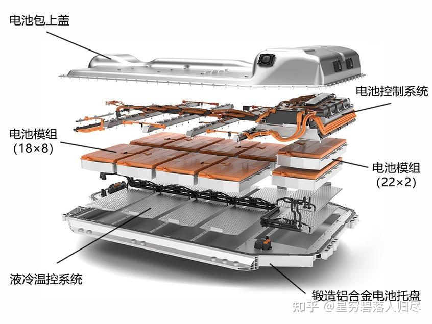
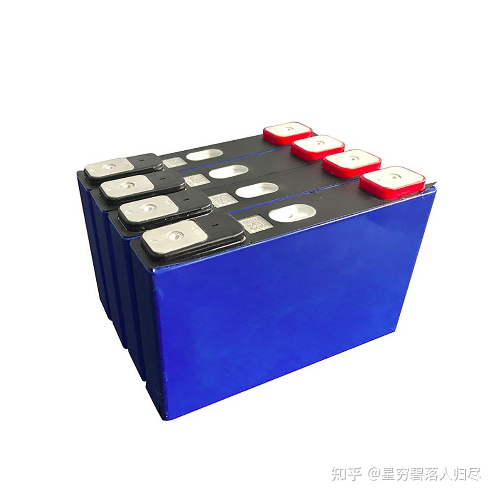
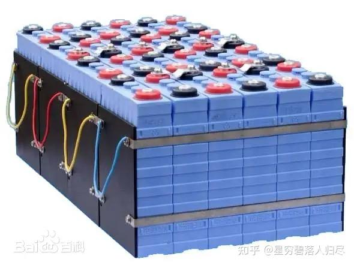
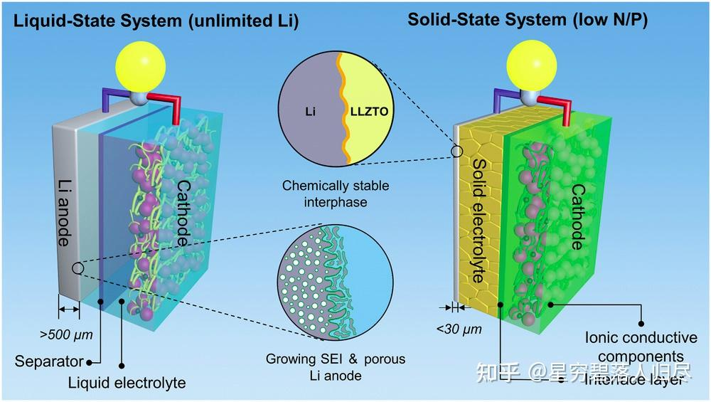

###### datetime:2025/09/19 15:45

###### author:nzb

# 机器人基础知识学习笔记---电池篇

## 1.引言

在现代机器人技术中，机器人运动以及功能实现离不开其基础硬件系统。 如图所示，机器人硬件系统的基本组成包括相机、芯片、传感器等构成的感知层；各类电机、传感器、轴承等组成的关节驱动系统；以及电池组、传感器、冷却系统和FSD系统构成的整体躯干层。

在机器人技术的不断进步中，动力电池如同机器人能量供应的“心脏”，发挥着不可或缺的作用。它是维持机器人长时间运行和高效工作的核心要素，负责为机器人的各个部件提供持续而稳定的能量供给，确保传感器、处理器和执行机构等硬件组件得以无缝协作，协同完成任务。无论是在工业机器人执行精密制造任务时的能量需求，还是在服务机器人进行家庭服务或医疗辅助时的持久运行，亦或是在探索机器人进行野外考察或灾难救援时的可靠供电，动力电池的性能都直接关系到机器人的工作效率、续航能力和操作的连续性。本文将深入分析机器人动力电池的类型、能量密度、充电技术、应用领域以及未来发展趋势。

## 2.机器人动力电池系统介绍

### 2.1机器人动力电池系统概述

机器人动力电池系统是为机器人提供动力的核心组件，其性能直接影响机器人的续航能力、工作效率和安全性。动力电池系统通常包括电池组、电池管理系统（BMS）、热管理系统以及相关的连接和保护装置。

- **电池组：**电池组是动力电池系统的核心部分，通常由多个电池单体组成。常见的电池类型包括锂离子电池、磷酸铁锂电池和三元锂电池。
- **电池管理系统（BMS）：**电池管理系统作为机器人动力电池的核心控制模块，通过三大核心功能实现电池全周期安全管理：
  - **实时监测：**集成传感器持续采集电压、电流、温度等关键参数，动态监控电池运行状态
  - **主动均衡：**采用智能均衡技术消除单体电池差异，提升电池组整体效能，寿命延长30%以上
  - **多层防护：**具备四重保护机制（过充/过放/过流/短路），响应速度达毫秒级，异常工况下0.5秒内切断电路
- **热管理系统：**热管理系统用于调节电池的温度，确保电池在合适的温度范围内工作，提高电池的性能和寿命。

## 3.机器人动力电池简介及分类

人形机器人作为高度机电一体化的复杂系统，对电池的能量密度、安全性、功率输出等性能提出了极高要求。以下是目前人形机器人领域常用的电池类型及其特点介绍：

### 3.1 锂离子电池

锂离子电池是目前人形机器人中最主流的电池类型，具有高能量密度、轻量化、充电效率高、循环寿命长，输出功率高等优点。人形机器人通常使用由圆柱形锂离子电池组成的电池组，安装在机器人的躯干内。常见的系统电压为48—58V，采用13-16串3-9并的电池组结构。

应用案例：
- 特斯拉Optimus：配备2.3千瓦时/52伏的电池包；
- H1人形机器人：搭载15Ah（0.864KWh）锂电池；

### 3.2 磷酸铁锂电池

磷酸铁锂电池是锂离子电池的一种，具有更高的安全性和稳定性，适合对安全性要求较高的场景。其能量密度相对三元锂电池略低，但循环寿命长、热稳定性好。

应用场景
- 室内服务机器人：如医疗、仓储AGV等。

### 3.3 三元锂电池

三元锂电池（NCM或NCA）是另一种锂离子电池，具有更高的能量密度，适合对续航能力要求较高的机器人。

应用场景
- 高功率机器人：如需要快速奔跑或执行复杂任务的机器人，如户外救援机器人。

### 3.4 固态电池

固态电池是未来人形机器人电池的重要发展方向，具有更高的能量密度和更好的安全性。目前，一些人形机器人已经开始探索使用固态电池。

应用案例：
- 广汽第三代人形机器人GoMate：采用全固态电池，续航提升至6小时。

### 3.5 超级电容器

超级电容器具有非常高的功率密度，适合提供短时间内的大电流输出。它可以与锂电池结合，为人形机器人在执行快速动作或急速加速时提供瞬时高功率输出。

## 4.机器人动力电池选型

在机器人动力系统设计中，电池选型是决定其性能边界的核心环节，需遵循场景导向、参数耦合、全周期优化的技术原则，从应用需求解构到工程参数匹配形成完整的决策链条。机器人电池选型本质是多物理场耦合的系统工程，需在能量密度、功率输出、安全性、环境适应性等维度建立量化设计模型，结合仿真分析（如电池热失控扩散模拟）与实测验证（如全工况循环寿命测试），最终实现 “场景需求 - 电气参数 - 机械结构” 的最优匹配。随着固态电池、快充技术的迭代，未来机器人电池将向 “更高能量密度、更低内阻、更智能管理” 方向演进，推动人机协作场景的持续拓展。

### 4.1 应用场景特性考量

#### 环境适应性

工作环境的温度梯度、湿度、粉尘 / 腐蚀性气体浓度等参数直接决定电池材料体系的选择：

- 高温户外场景（如巡检机器人）：需采用磷酸铁锂（LFP）电池，其热失控温度＞500℃，搭配液冷 / 相变材料热管理系统，可将电芯表面温度控制在 60℃以下，避免容量衰减加速。
- 低温室内场景（如仓储 AGV）：三元锂（NCM）电池凭借 - 20℃下仍保持 85% 以上放电容量的优势成为首选，配合脉冲加热技术可在 10 分钟内将电芯预热至 0℃以上，保障低温启动性能。

#### 负载特性

恒定负载（如协作机器人）与波动负载（如搬运机器人）对电池放电特性提出不同要求：

- 恒定负载场景需关注电池的能量效率，通过能量流仿真优化放电曲线，降低能量损耗；
- 波动负载场景（峰值功率可达额定功率 3 倍以上）需重点考核电池的脉冲放电能力，如 10 秒内持续输出 30C 放电电流时的电压稳定性，避免电机堵转或控制系统误动作。

#### 续航需求

短时高机动性场景（如消费级服务机器人，单次工作 2 小时）可采用高能量密度的三元锂电池（280Wh/kg 以上），配合无线充电技术实现 “即停即充”；
长时作业场景（如农业机器人，单日工作 8 小时以上）则需采用磷酸铁锂与超级电容的混合方案，利用超级电容承担峰值功率需求，延长电池循环寿命。

### 4.2 核心电气参数

#### 电压平台匹配

电池组额定电压需与机器人驱动系统（电机控制器、传感器等）的输入电压范围严格匹配（误差 ±2% 以内）。例如，24V 直流母线系统通常采用 6 串三元锂电池（标称电压 25.2V），需通过 BMS 的主动均衡技术将单体电压差控制在 5mV 以内，避免功率模块过压保护。

#### 容量与续航建模

基于机器人功耗模型（静态功耗 + 动态负载功耗）进行容量测算，公式为：

$$C \ge U_{cut} \times \eta P_{avg} \times T \times k$$

其中：
- $$U_{cut}$$：为放电截止电压（V）
- $$\eta$$：为放电效率（取 0.9~0.95）。
- $$P_{avg}$$：为平均功耗（W）
- $$T$$：目标续航时间（h）
- $$k$$：为安全系数（1.2~1.5）

#### 放电能力校核

最大放电电流需满足机器人启动 / 爬坡 / 急加速等极端工况需求，计算公式为：

$$I_{max} \ge U_{nom} \times \lambda P_{peak}$$

其中， 
- $$P_{peak}$$为峰值功率（W）
- $$\lambda$$ 为电池放电效率系数（0.85~0.95）。

例如，负载 100kg 的移动机器人爬坡时峰值电流可达 50C，需选用具备 50C 持续放电能力的动力型锂电池。

### 4.3 生命周期性能

#### 循环寿命工程设计

针对高频次使用场景（如工业机器人日均充电 3 次），需选择循环次数＞2000 次（80% DOD）的电池，并通过 BMS 的充电截止电压动态调整（如 25℃时 4.20V，0℃时 4.15V），延缓正极材料晶格衰减。

#### 充电技术适配

支持 5C 以上快充的电池需配备定制化充电模块（如 30 分钟充至 80%），并集成充电电流动态调节算法，根据电池温度（＞45℃时降为 3C）和剩余容量（＞80% 时降为 1C）优化充电曲线，避免析锂风险。

### 4.4 不同类型机器人的应用特性

1. 人形机器人 以特斯拉 Optimus 为例，其关节驱动系统对电池提出 “轻量化 + 高动态响应” 需求，采用 21700 型三元锂电池组（能量密度 280Wh/kg），通过分布式电池管理架构（每个关节独立 BMS）实现 ±2% 的能量分配精度，保障步态运动的能量均衡。

2. 移动机器人（AGV/AMR） 在智能仓储场景中，AGV 采用 “感应供电 + 锂电池” 混合方案：在固定路径区域通过电磁感应充电（效率＞90%）实时补能，脱离路径时由锂电池（容量 20~50Ah）提供移动能量，配合能量回收技术（制动能量回收率＞30%），实现 7×24 小时连续作业。

3. 工业机器人 焊接机器人等重载场景需满足 “高功率输出 + 长寿命” 要求，通常选用磷酸铁锂方形电池（容量 100~200Ah），搭配主动均衡 BMS（均衡电流＞500mA），确保在 20C 持续放电工况下，单体电压差＜10mV，延长电池组寿命至 5 年以上。

4. 服务机器人 清洁机器人采用 “快充 + 自维护” 设计：电池支持 6C 快充（15 分钟充至 50%），内置充电触点自清洁模块（定期去除氧化层），配合 BMS 的休眠电流控制技术（待机功耗＜50μA），实现 “即用即充、长期闲置不亏电” 的用户体验。

### 4.5 机器人动力电池性能需求

作为高度集成化的智能体，机器人对电池提出了能量 - 功率 - 安全 - 环境的多维平衡要求：

| 技术指标 | 参数要求 | 工程实现路径 |
| ------ | ----- | ------ |
| 能量密度 | 250~350Wh/kg | 采用高镍三元正极（NCM811）+ 硅碳负极体系，通过叠片工艺提升体积能量密度至 600Wh/L |
| 瞬时放电倍率 | 20C~50C 持续放电 | 优化极片导电网络设计，降低内阻（＜0.5mΩ/ 单体），采用多极耳结构提升电流收集效率 |
| 快充能力 | 5C~7C 充电（30 分钟充至 80%） | 开发高离子电导率电解液（＞10mS/cm），匹配 800V 高压快充平台，降低充电极化效应 |
| 安全性 | 通过针刺 / 过充 / 热滥用测试 | 集成陶瓷隔膜（熔点 130℃闭合孔隙）+ 防爆阀（开启压力 1.2MPa），BMS 响应时间＜10ms |
| 循环寿命 | ＞1000 次（80% DOD） | 应用电池健康状态（SOH）预测算法，动态调整充放电截止参数，减缓容量衰减速率 |
| 温度适应性 | -20℃~60℃工作温度 | 采用耐低温电解液（冰点 - 40℃）+ 耐高温粘结剂，配合热管散热系统控制电芯温差＜5℃ |

## 5.三元锂电池

### 5.1 概念

三元锂电池是一种锂离子电池，其正极材料由镍、钴、锰（或镍、钴、铝）三种元素组成的三元正极材料。这种材料的组合能够有效提高电池的容量和循环性能。

### 5.2 工作原理

充电过程：

- 阳极反应：外部电源施加电压，锂离子从正极的三元材料中释放出来，经过电解液，迁移到负极的石墨材料中并嵌入其中。
- 阴极反应：正极的三元材料（如镍钴锰氧化物或镍钴铝氧化物）逐渐释放储存的锂离子。
- 锂离子迁移：锂离子从正极向负极迁移，被负极材料吸收并嵌入其中。

放电过程：
- 阴极反应：锂离子从负极石墨材料中脱嵌，重新回到正极。
- 阳极反应：负极石墨材料释放之前吸收的锂离子。
- 电流产生：锂离子的迁移导致电流的流动，从而实现电池产生电能供给外部设备使用。

电极材料与反应

三元锂电池的正极材料通常为 镍钴锰酸锂（Li(NiCoMn)O₂），负极材料为石墨（C）。在充电和放电过程中，锂离子在正负极之间迁移。

充放电技术

- 充电技术：通常采用恒流充电和恒压充电相结合的方式。先以恒定电流充电，当电池电压接近额定电压时，切换为恒压充电，直到电池充满。
- 放电技术：在放电过程中，需要控制放电电流和电压，避免过放电，以延长电池寿命。

**正极反应**

充电时，正极材料中的锂离子脱出，反应如下：

$$Li(NiCoMn)O_{2} \to Li_{1-x}(NiCoMn)O_{2} +xLi^{+} + xe^{-}$$

其中， $$x$$为锂离子的脱出量，通常在 0 到 1 之间。

放电时，锂离子重新嵌入正极材料：

$$Li_{1-x}(NiCoMn)O_{2} + xLi^{+}  + xe^{-} \to Li(NiCoMn)O_{2}$$

**负极反应**

充电时，锂离子嵌入石墨负极：

$$xLi^{+} + xe^{-} + 6C \to  Li_{x}C_{6}$$

其中，$$Li_{x}C_{6}$$表示锂离子嵌入石墨后的化合物。

放电时，锂离子从石墨负极中脱出：

$$Li_{x}C_{6} \to xLi^{+} + xe^{-} + 6C$$

**整体电池反应**

将正极和负极反应合并，得到三元锂电池的总反应：

充电：

$$Li(NiCoMn)O_{2} + 6C \to Li_{1-x}(NiCoMn)O_{2} + Li_{x}C_{6}$$

放电：

$$Li_{1-x}(NiCoMn)O_{2} + Li_{x}C_{6} \to Li(NiCoMn)O_{2} + 6C$$

**电化学方程与能量计算**

根据法拉第定律，电池的容量 $$Q$$与锂离子的转移量 $$n$$和电荷数 $$z$$有关：

$$Q = nF$$

其中，$$F$$为法拉第常数，约为 96485 C/mol。

电池的电压 $$V$$ 可以通过正负极的电极电势差来计算：

$$V = E_{正极} - E_{负极}$$

假设正极电势为 3.6 V，负极电势为 0.2 V，则电池电压为：

$$V = 3.6V - 0.2V = 3.4V$$

电池的能量 $$E$$ 可以通过容量和电压计算：

$$E = QV$$

假设电池容量为 2 Ah，则能量为：

$$E = 2Ah \times 3.4V = 6.8Wh$$

**保护措施**

- 过充保护：通过电池管理系统（BMS）监测电池电压，当电压超过设定值时，切断充电电路。
- 过放保护：当电池电压低于设定值时，切断放电电路，防止电池过度放电。
- 过流保护：在电流超过设定值时，切断电路，防止电池过热和损坏。
- 温度保护：监测电池温度，当温度过高或过低时，采取措施调节温度或切断电路。

## 6.磷酸铁锂电池

### 6.1 概念

磷酸铁锂电池是一种锂离子电池，其正极材料为磷酸铁锂（LiFePO₄），负极材料通常为碳材料。

### 6.2 工作原理

磷酸铁锂电池的正极材料为 磷酸铁锂（LiFePO₄），负极材料为石墨（C）。在充电和放电过程中，锂离子在正负极之间迁移。

充放电技术

- 充电过程：
  - 锂离子从磷酸铁锂晶体表面迁移至晶体外部表面，在电场力的作用下，进入电解液，穿过隔膜，然后嵌入到石墨晶格中。
  - 电子通过导体流向正极的铝箔集流体，经极耳、电池极柱、外部电路、负极极柱、负极极耳流向负极的铜箔集流体，再经导体流到石墨负极，使负极的电荷达至平衡。
  - 锂离子从磷酸铁锂脱嵌后，磷酸铁锂转化成磷酸铁。

- 放电过程：
  - 锂离子从石墨晶体中脱嵌出来，进入电解液，穿过隔膜，迁移到磷酸铁锂晶体的表面，然后重新嵌入到磷酸铁锂的晶格内。
  - 电子经导电体流向负极的铜箔集电极，经极耳、电池负极柱、外电路、正极极柱、正极极耳流向电池正极的铝箔集流体，再经导电体流到磷酸铁锂正极，使正极的电荷达至平衡。

**正极反应**

充电时，锂离子从磷酸铁锂中脱出，反应如下：

$$LiFePO_{4} \to FePO_{4} + Li^{+} + e^{-}$$

放电时，锂离子重新嵌入磷酸铁锂：

$$FePO_{4} + Li^{+} + e^{-} \to LiFePO_{4}$$

**负极反应**

充电时，锂离子嵌入石墨负极：

$$Li^{+} + e^{-} + 6C \to  LiC_{6}$$

放电时，锂离子从石墨负极脱出：

$$LiC_{6} \to Li^{+} + e^{-} + 6C$$

**整体电池反应**

将正极和负极反应合并，得到磷酸铁锂电池的总反应：

充电：

$$LiFePO_{4} + 6C \to FePO_{4} + LiC_{6}$$

放电：

$$FePO_{4} + LiC_{6} \to LiFePO_{4} + 6C$$

**电化学方程与能量计算**

根据法拉第定律，电池的容量 $$Q$$ 与锂离子的转移量 $$n$$ 和电荷数 $$z$$ 有关：

$$Q = nF$$

其中，$$F$$ 为法拉第常数，等于 96 485 C/mol。

电池的电压 $$V$$ 可以通过正负极的电极电势差来计算：

$$V = E_{正极} - E_{负极}$$

假设正极电势为 3.3 V，负极电势为 0.2 V，则电池电压为：

$$V = 3.3V - 0.2V = 3.1V$$

电池的能量 $$E$$ 可以通过容量和电压计算：

$$E = Q \times V$$

假设电池容量为 2 Ah，则能量为：

$$E = 2Ah \times 3.1V = 6.2Wh$$

**保护措施**

- 过充保护：通过BMS监测电池电压，当电压超过设定值时，切断充电电路。
- 过放保护：当电池电压低于设定值时，切断放电电路，防止电池过度放电。
- 过流保护：在电流超过设定值时，切断电路，防止电池过热和损坏。
- 温度保护：磷酸铁锂电池的热稳定性较好，但在极端温度条件下，仍需通过BMS进行温度监测和调节。

### 6.3 三元锂电池和磷酸铁锂电池对比

| 特性 | 三元锂电池 | 磷酸铁锂电池 |
| ------ | ------- | ------- |
| 能量密度 | 高（200-250 Wh/kg） | 较低（100-120 Wh/kg） |
| 循环寿命 | 一般（1000-2000 次） | 高（2000-3000 次） |
| 安全性 | 较低（热稳定性差） | 高（热稳定性好） |
| 成本 | 较高（钴成本高） | 较低（无钴） |
| 工作温度范围 | -20°C 至 60°C | -20°C 至 60°C |
| 应用场景 | 电动汽车、高端电子产品 | 储能、商用车、低速电动车 |

三元锂电池与磷酸铁锂电池在电化学特性和性能表现上各有优势，其选型需结合具体应用场景的核心需求：三元锂电池以高能量密度为显著优势，适合对轻量化和长续航要求高的场景（如人形机器人、无人机），但其耐高温性较弱，需额外的热管理设计。磷酸铁锂电池则以优异的安全性和长循环寿命见长，适用于高温环境、高安全需求或频繁充放电场景（如储能系统、电动工具），但能量密度较低，同等容量下体积重量更大。了解两者的核心性能差异（能量密度、安全性、循环寿命），是合理设计电池系统及匹配应用需求的关键。

## 7. 固态电池原理

### 7.1 基本概念

固态电池是一种使用固体电解质代替传统液态或凝胶电解质的电池技术。这种设计不仅提高了电池的安全性，还能够实现更高的能量密度和更长的循环寿命。固态电池被认为是下一代高性能电池的重要发展方向，尤其适用于电动汽车、便携式电子设备和储能系统等领域。

### 7.2 工作原理

#### 7.2.1.基础电化学反应

与传统锂离子电池相似，固态电池的基本工作原理也是基于锂离子在正负极之间的嵌入和脱嵌过程。充电时，锂离子从正极材料中脱出，穿过固体电解质到达负极并嵌入；放电时则相反。

固态电池的核心公式包括：

- 电解质电阻： $$R = \frac{d}{A \cdot \sigma } $$

- 离子电导率： $$\sigma = t^{+} \cdot \lambda \cdot N_{A} \cdot e\cdot F$$

充放电技术

**正极反应：**

$$LiMO_{2} \leftrightarrow Li_{1-x}MO_{2} + xLi^{+} + xe^{-}$$

**负极反应（以金属锂为例）：**

$$xLi^{+} + xe^{-} \to xLi$$

**总反应为：**

$$LiMO_{2} + xLi \leftrightarrow Li_{1-x}MO_{2} + xLi$$

#### 7.2.2.固体电解质的作用

固体电解质的主要功能是在正负极之间传导锂离子。理想的固体电解质应具有高离子电导率、良好的机械强度以及与电极材料的良好相容性。

假设固体电解质的厚度为 $$d$$ ，离子电导率为 $$\sigma$$ ，则其电阻 $$R$$ 可表示为：

$$R = \frac{d}{A \cdot \sigma } $$

其中，$$A$$ 是电池的横截面积。

#### 7.2.3.固态电池的优势

安全性提升：由于采用了固体电解质，固态电池避免了传统液态电解质可能引发的泄漏、挥发和燃烧等问题。此外，固体电解质在高温下也更加稳定，减少了热失控的风险。

能量密度提高：固态电池可以使用更高电压的正极材料（如硫化物或氧化物），从而显著提高电池的能量密度。理论上，固态电池的能量密度可达500 Wh/kg以上，远高于现有商用锂离子电池的水平。

循环寿命延长：固体电解质的稳定性有助于减少副反应的发生，从而延长电池的循环寿命。研究表明，某些固态电池的循环寿命可超过10000次。

#### 7.2.4.关键技术挑战

离子电导率优化

尽管固体电解质具有许多优点，但其离子电导率通常低于液态电解质。为了提高离子电导率，研究人员正在探索多种材料体系，包括硫化物、氧化物和聚合物等。

假设固体电解质的离子迁移数为 $$t^{+}$$，则其离子电导率 $$\sigma$$ 可表示为：

$$\sigma = t^{+} \cdot \lambda \cdot N_{A} \cdot e\cdot F$$

其中，$$\lambda$$ 是离子迁移率，$$N_{A}$$ 是阿伏伽德罗常数，$$e$$ 是基本电荷量，$$F$$ 是法拉第常数。

电极/电解质界面问题

固态电池中的电极与固体电解质之间的界面接触不良可能导致较大的界面阻抗，影响电池性能。解决这一问题的方法包括改进界面涂层技术和开发新型复合电极材料。

假设界面阻抗为 $$Z_{int}$$ ，则其对电池整体内阻 $$R_{total}$$ 的贡献为：

$$R_{total} = R_{electrolyte} + Z_{int}$$

#### 7.2.5.应用前景

电动汽车：固态电池因其高能量密度和安全性优势，有望成为未来电动汽车的主要动力源。预计到2030年，固态电池将在电动汽车市场占据重要份额。
便携式电子设备：对于智能手机、笔记本电脑等便携式电子设备，固态电池可以提供更长的续航时间和更快的充电速度，满足用户日益增长的需求。
储能系统：固态电池还可应用于大规模储能系统，如电网调峰、分布式能源存储等场景，有助于提高能源利用效率和可靠性。
