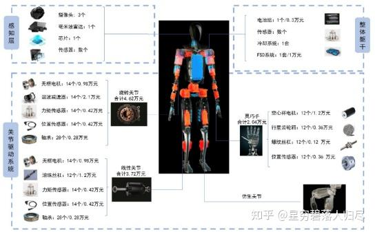

###### datetime:2025/09/24 16:48

###### author:nzb

# 机器人基础知识学习笔记---具身结构篇

## 1.引言

在现代机器人技术中，机器人运动以及功能实现离不开其基础硬件系统。 如图所示，机器人硬件系统的基本组成包括相机、芯片、传感器等构成的感知层；各类电机、传感器、轴承等组成的关节驱动系统；以及电池组、传感器、冷却系统和FSD系统构成的整体躯干层。

在机器人技术的飞速发展进程中，机械结构就如同机器人身体的“骨骼”，发挥着至关重要的作用。它是支撑机器人完成各种任务的基础架构，负责为机器人的各个部件提供稳定的物理支撑和灵活的运动能力，确保传感器、处理器和执行机构等硬件组件得以精准协作，高效完成任务。无论是在工业机器人进行复杂生产流程时的高精度定位，还是在服务机器人灵活穿梭于不同场景时的高效移动，亦或是在探索机器人面对复杂环境地形时的可靠支撑，机械结构的性能都直接关系到机器人的工作效率、运动能力和操作的稳定性。本文将深入探讨机器人机械结构的设计原理、材料选择、关节灵活性、应用领域以及未来发展趋势。

## 2. 机器人结构的基本组成

机器人结构是机器人能够正常工作和完成各种任务的基础。机器人的主体结构主要包括机身、手臂、手腕和末端执行器，移动机构，驱动系统等。机身是机器人的支撑部分，通常具有一定的刚性和稳定性，为其他部件提供安装基础。手臂是机器人进行空间运动的关键部件，其结构形式多样，常见的有直角坐标型、圆柱坐标型、球坐标型和关节型等。手腕连接手臂和末端执行器，用于调整末端执行器的姿态和位置，一般具有多个自由度，能够实现灵活的运动。末端执行器是机器人直接与外界物体接触并完成操作的部分，根据不同的任务需求，可以是夹持器、焊枪、喷头等。移动机构是机器人进行运动的关键部分，其设计决定了机器人在不同地形上的运动能力和灵活性。在机器人机械结构上安装感知，控制，执行等部分模块，就形成了机器人的基础硬件生态。机器人结构未来的发展趋势主要体现在以下四个方面：

**模块化和标准化：**随着机器人技术的不断发展和应用领域的扩大，模块化和标准化成为机器人结构设计的重要发展方向。通过将机器人的各个部件设计成标准化的模块，可以根据不同的应用需求进行灵活组合和配置，大大提高了机器人的通用性和可扩展性，降低了机器人的研发和制造成本，同时也便于机器人的维护和升级。

**柔性化和可重构性：**为了适应多变的工作环境和任务要求，机器人结构正朝着柔性化和可重构性的方向发展。柔性化机器人可以根据不同的任务自动调整其运动参数和工作方式，而可重构机器人则可以通过改变其结构形式或部件组合，实现不同的功能和运动模式。例如，一些可重构机器人可以根据不同的工作场景，快速调整其手臂的长度、关节的布局和末端执行器的类型，以满足不同的操作需求。

**高性能材料的应用：**新型高性能材料的不断涌现为机器人结构的发展提供了有力支持。例如，高强度铝合金、碳纤维复合材料、形状记忆合金、智能材料等在机器人结构中的应用，不仅可以减轻机器人的重量，提高机器人的运动性能和能源利用效率，还可以使机器人具备一些特殊的功能，如自感知、自适应、自修复等。这些高性能材料的应用将使机器人的性能和功能得到进一步提升。

**与人工智能技术的深度融合：**未来机器人结构将与人工智能技术深度融合，使机器人具备更强的感知、认知和决策能力。通过将机器学习、深度学习、计算机视觉等人工智能技术应用于机器人的控制和感知系统，机器人可以更好地理解周围环境和任务要求，自主地进行路径规划、避障、物体识别和抓取等操作，实现更加智能化和自主化的运行。

### 2.1 机身

机身是机器人的基础支撑结构，用于安装其他部件，如手臂、驱动系统和控制系统。它需要具备足够的刚性和稳定性，以承受整个机器人的重量以及在操作过程中产生的各种力。常见形式主要为固定式机身和移动式机身，固定式机身通常安装在地面或工作台上，适用于固定位置的操作任务，如工业生产线上的焊接机器人。而移动式机身则配备了轮子、履带或其他移动机构，使机器人能够在一定范围内自由移动，适用于物流机器人、巡检机器人等。

### 2.2 移动机构

移动机构是机器人实现移动的关键部件，其设计决定了机器人在不同地形上的运动能力和灵活性。

常见类型

- 轮式移动机构
  - 单轮驱动：适用于简单平坦的环境，如室内导航机器人。
  - 双轮差动驱动：通过控制两个轮子的不同转速实现转向，灵活性高，适用于狭窄空间。
  - 多轮驱动：如四轮或六轮驱动，通常配备独立悬挂系统，适用于复杂地形，如户外勘探机器人。

- 履带式移动机构
  - 特点：具有良好的抓地力和通过性，适用于崎岖不平的地形，如军事侦察机器人和救援机器人。
  - 结构：由履带、驱动轮、导向轮和张紧装置组成。

- 腿式移动机构
  - 特点：能够模拟动物的行走方式，具有高度的灵活性和适应性，适用于复杂地形，如山地、森林等。
  - 结构：通常由多个关节和连杆组成，每个腿可以独立控制，如波士顿动力的Spot机器人。

- 复合移动机构
  - 特点：结合了轮式和履带式或腿式的优点，可以根据不同地形切换不同的移动方式，如轮腿式机器人。

### 2.3 手臂

手臂是机器人实现空间运动的关键部件，用于将末端执行器移动到目标位置。其运动形式和自由度决定了机器人的操作范围和灵活性。

主要组成部分

- 关节：关节是手臂的活动连接部分，通常由电机、减速器和关节轴承组成。关节的数量和类型决定了手臂的自由度。例如，一个六自由度的机器人手臂通常有六个关节，每个关节可以独立运动。
- 连杆：连杆是连接关节的刚性部件，用于传递力和运动。连杆的长度和形状会影响手臂的运动范围和工作空间。

常见类型

- 直角坐标型：沿X、Y、Z三个方向的直线运动，适用于规则空间内的操作。
- 圆柱坐标型：一个水平旋转关节和两个直线运动关节，适用于圆柱形空间内的操作。
- 球坐标型：两个旋转关节和一个直线运动关节，适用于球形空间内的操作。
- 关节型：多个旋转关节，通常用于复杂形状物体的操作，如工业机器人中的六轴或多轴机械臂。

### 2.4 手腕

手腕连接手臂和末端执行器，用于调整末端执行器的姿态和位置。手腕的灵活性和自由度对于完成精细操作非常重要。

主要组成部分

- 旋转关节：手腕通常包含多个旋转关节，用于实现多方向的运动。例如，一个三自由度的手腕可以实现俯仰、偏航和翻转运动。
- 连接部件：用于将手腕与手臂和末端执行器连接，确保运动的平稳性和可靠性。

常见类型

- 单自由度手腕：只能进行单一方向的旋转，适用于简单任务。
- 多自由度手腕：通常有两到三个自由度，能够实现更复杂的手势和姿态调整。

### 2.4 末端执行器

末端执行器是机器人直接与外界物体接触并完成操作的部分，其功能取决于具体的应用场景。

常见类型

- 夹持器：
  - 平行夹持器：用于夹持规则形状的物体，如圆柱形或方形物体。
  - 多指夹持器：类似于人类的手指，可以抓取不规则形状的物体，适用于复杂操作。

- 工具类末端执行器：
  - 焊枪：用于焊接操作。
  - 喷头：用于喷涂作业。
  - 刀具：用于切割或雕刻。
  - 吸盘：用于吸附轻质物体，如玻璃、塑料等。
  - 机械手：用于模拟人类手部的操作，完成复杂的抓取和操作任务。
  
### 2.5 驱动系统

驱动系统为机器人的运动提供动力，将电能或其他形式的能量转化为机械能，驱动关节和末端执行器运动。

主要组成部分

- 电机：常见的有直流电机、交流电机、伺服电机和步进电机。伺服电机和步进电机因其高精度和可控性，常用于机器人关节的驱动。
  - 直流电机：适用于简单的轮式机器人，成本低，控制简单。
  - 伺服电机：用于需要高精度控制的机器人，如腿部关节驱动。
  - 无刷电机：效率高，寿命长，适用于高性能移动机器人。
- 减速器：用于降低电机的转速并增加扭矩，确保关节能够输出足够的力矩。常见的减速器有谐波减速器、行星减速器和RV减速器。
  - 行星减速器：体积小，传动效率高，适用于轮式机器人。
  - 谐波减速器：精度高，适用于关节驱动。
  - RV减速器：承载能力强，适用于大型机器人。

- 传动机构：将电机的动力传递到关节，常见的传动方式有齿轮传动、皮带传动和链条传动。
  - 齿轮传动：用于传递动力，提高扭矩。
  - 皮带传动：适用于轻量级机器人，传动平稳。
  - 链条传动：适用于重载机器人，传动效率高。

### 2.6 转向系统

转向系统用于控制机器人的移动方向，使其能够灵活地在环境中导航。

常见类型
- 差动转向：通过控制两个轮子的不同转速实现转向，适用于双轮差动驱动机器人。
- 舵轮转向：通过一个或多个舵轮实现转向，适用于多轮驱动机器人。
- 全向轮转向：使用全向轮（麦克纳姆轮）实现全方位移动和转向，灵活性极高，适用于室内物流机器人。

### 2.7 悬挂系统

悬挂系统用于吸收地面不平带来的冲击，提高机器人的稳定性和通过性。

常见类型
- 独立悬挂：每个轮子都有独立的悬挂装置，能够更好地适应复杂地形，如汽车悬挂系统。
- 非独立悬挂：多个轮子共用一个悬挂装置，结构简单，成本低，但适应性较差。

### 2.8 电源系统

电源系统为机器人提供能量，确保其能够正常运行。

常见类型：

- 电池：如锂离子电池、镍氢电池等，用于提供电能。
- 燃料电池：适用于需要长时间运行的机器人，能量密度高。
- 太阳能板：用于户外机器人，通过太阳能充电。

### 2.9 连接部件和支撑结构

这些部件用于连接机器人的各个主要部分，确保整体结构的稳定性和可靠性。

常见部件

- 连接轴：用于连接电机和减速器，或连接关节之间的部件。
- 支撑架：用于支撑手臂和手腕，确保其在运动过程中的稳定性。
- 固定件：如螺栓、螺母、螺钉等，用于固定各个部件，确保结构的牢固性。
 
### 2.10 传感器安装部件

虽然传感器本身属于感知部分，但其安装部件是机械结构的一部分，用于固定和保护传感器，确保其能够正常工作。

常见部件

- 传感器支架：用于安装视觉传感器（如摄像头）、力觉传感器、触觉传感器等。
- 传感器保护罩：用于保护传感器免受外界环境的干扰和损坏。

### 2.11 导航和定位部件

这些部件用于帮助机器人在环境中导航和定位，确保其能够自主移动到目标位置。

常见部件
- 激光雷达：用于测量距离和构建环境地图。
- 摄像头：用于视觉导航和目标识别。
- 惯性测量单元：用于测量机器人的加速度和角速度，辅助导航。
- GPS模块：用于户外机器人，提供全球定位信息。
- 里程计：通过测量轮子的转速和角度，计算机器人的移动距离和方向。

### 2.12 通信部件

通信部件用于机器人与外部设备（如控制中心、其他机器人）之间的数据传输。

常见部件

- 无线通信模块：如Wi-Fi、蓝牙、4G/5G模块，用于无线通信。
- 有线通信接口：如以太网接口，用于有线通信。

### 2.13 电缆和管道

电缆和管道用于传输电力和信号，确保机器人的各个部件能够正常工作。

常见部件

- 动力电缆：用于传输电能，为电机和其他电气部件供电。
- 信号电缆：用于传输控制信号和传感器反馈信号。
- 气管或液压管：对于气动或液压驱动的末端执行器，需要通过管道传输气体或液体。

### 2.14 防护部件

防护部件用于保护机器人免受外界环境的影响，如灰尘、液体、碰撞等，同时也可以保护操作人员的安全。

常见部件

- 防护罩：用于覆盖机器人的关键部件，如电机、减速器和关节。
- 安全护栏：用于隔离机器人工作区域，防止人员进入危险区域。
- 防尘盖：用于保护关节和传感器，防止灰尘进入。

### 2.15 紧急停止和安全装置

这些装置用于在紧急情况下停止机器人的运动，确保人员和设备的安全。

常见部件：
- 紧急停止按钮：通常安装在机器人机身或控制面板上，按下后立即停止所有运动。
- 碰撞传感器：当机器人与物体或人员发生碰撞时，触发紧急停止。
- 安全光幕：用于检测机器人工作区域内的人员，一旦检测到人员进入，立即停止机器人运动。

这些机械部件共同构成了机器人的物理基础，使其能够完成各种复杂的任务。

## 3. 机器人结构设计

### 3.1 设计流程

机器人结构设计需要融合多领域知识进行系统性规划。设计过程中需平衡功能实现与技术限制，首先需要进行需求定位以及需求拆解，根据机器人的应用场景明确运动参数指标，包括动作幅度、精度要求及载荷承受能力，建立量化设计基准。接下来进行机器人结构件材料的选型，优选轻质高强复合材料（如钛铝合金、碳纤维基材），综合评估抗疲劳性、环境适应性与经济成本，避免单一性能指标决策。之后就可以进行运动系统的构建，在采用复合关节设计时，需设计冗余自由度配置方案。最后通过组合万向节、滚动轴承等传动元件，在活动范围与结构稳定性间建立动态平衡。

在进行具体技术实施时，首先要进行力学仿真验证。运用CAD/CAE工具进行拓扑优化，借助有限元分析（FEA）识别应力集中区域，迭代改进结构形态以提升力传导效率。接下来就可以进行原型测试体系包含驱动单元、传感反馈的完整测试平台的搭建。最后就是要确定一套迭代升级机制和方案， 建立模块化组件库，支持快速更换损坏单元；选择仿真方法虚拟调试，缩短实物验证周期。

在设计机器人的结构时，需关注以下要点：
- 一是刚度和强度，要根据工作要求和载荷情况选材并优化设计，确保其能承受载荷，保持运动稳定性和精度，且可靠耐用；
- 二是运动精度，对于精密操作机器人，其运动精度受机械传动系统、关节间隙、传感器等因素影响，需用高精度部件、工艺及误差补偿手段提升精度；
- 三是灵活性和自由度，需依据应用需求确定自由度，平衡性能与成本；
- 四是轻量化设计，在保障性能的基础上，通过优化结构、用轻质材料等减轻重量，提高性能和能效，降低成本；
- 五是可靠性和安全性，考虑故障情况并设防护措施，进行可靠性分析和测试。通过多维度的设计考量，才能实现机器人性能、成本与安全性的综合最优解，满足不同应用场景的个性化需求。

### 3.2 常用材料

不同类型的机器人对机身材料有不同的要求，主要考虑强度、重量、耐久性、成本和环境适应性等因素。以下是一些常见机器人机身材料及其应用情况：

#### 铝合金

因其轻量化、高强度和良好的加工性能，广泛应用于各类机器人机身，如通用机械臂、移动机器人、复合机器人、人形机器人和四足机器人。

特点：铝合金具有较高的比强度（强度与密度的比值），即在较轻的重量下能够提供较高的强度。它还具有良好的加工性能，可以通过铸造、挤压、机加工等多种方式制造复杂的机械臂结构件。

应用：广泛用于工业机械臂和协作机械臂的臂体、关节外壳等部件。例如，一些轻型协作机械臂的臂体采用铝合金材料，既保证了机械臂的强度和刚性，又减轻了重量，便于操作和搬运。在一些轻型移动机器人,中高端复合机器人,人形机器人,四足机器人中，机身外壳和部分结构件也会采用铝合金材料。例如，家用扫地机器人的外壳采用铝合金材质，不仅减轻了机器人的重量，使其便于移动，还具有良好的外观质感。某些用于工业生产的复合机器人，其车身和机械臂的连接部件采用高强度铝合金，能够承受较大的载荷，同时减轻机器人的重量。特斯拉Optimus人形机器人的部分结构件采用铝合金材料。

#### 碳纤维复合材料

在高端机器人中应用广泛，特别是在需要高强度、轻量化和高动态性能的部件中，如人形机器人和四足机器人的关键部件。

特点：碳纤维复合材料具有极高的比强度和比刚度，同时重量非常轻。它还具有良好的抗疲劳性能和耐腐蚀性。

应用：在一些高端工业机械臂和协作机械臂中，碳纤维复合材料用于制造大臂和小臂等关键部件，以提高机械臂的动态性能和负载能力。例如，某些用于航空航天零部件加工的高精度工业机械臂，其臂体采用碳纤维复合材料，能够在保证高精度的同时，减轻机械臂的惯性，提高运动速度和精度。高端人形机器人中，腿部、手臂等关键部件采用碳纤维复合材料。在某些用于科研和高端服务的人形机器人，其腿部和手臂采用碳纤维复合材料，提高了机器人的运动性能和负载能力。

#### 高强度钢

主要用于重型机器人或需要承受较大载荷的部件，如重型AGV和重型四足机器人。

特点：高强度钢具有较高的强度和良好的韧性，能够承受较大的载荷。它还具有良好的加工性能，可以通过焊接、切割等方式制造复杂的结构。

应用：在AGV（自动导引车）和一些重型移动机器人中，车身框架和承载部件常采用高强度钢。例如，用于物流仓储的重型AGV，其车身采用高强度钢制造，能够承载较重的货物，并在频繁的搬运过程中保持结构的稳定性。在一些重型四足机器人中，腿部和身体框架也会采用高强度钢。

#### 工程塑料

在一些对成本敏感或对重量要求不高的机器人中应用，如消费级扫地机器人和中低端人形机器人。

特点：工程塑料具有重量轻、成本低、耐腐蚀、绝缘性能好等特点。一些工程塑料（如ABS、PC等）还具有良好的机械性能。

应用：在一些对成本敏感的移动机器人，中低端人形机器人中，机身外壳和部分非关键结构件采用工程塑料。例如，一些入门级扫地机器人和教育用的人形机器人的外壳采用ABS工程塑料，降低了生产成本，同时满足了基本的使用要求。

#### 铝合金和碳纤维复合材料的组合

特点：结合了铝合金的加工性能和碳纤维复合材料的高强度、轻量化特点。

应用：在一些高端复合机器人中，车身框架采用铝合金材料，而机械臂等关键部件采用碳纤维复合材料。例如，某些用于医疗手术的复合机器人，其车身框架采用铝合金，机械臂采用碳纤维复合材料，既保证了机器人的整体强度和刚性，又减轻了机械臂的重量，提高了操作的灵活性。

## 4.机器人结构分类

### 4.1 按用途分类

- 工业机器人：主要用于工业生产领域，如汽车制造、电子设备生产、机械加工等。它们可以完成焊接、喷涂、搬运、装配、码垛等多种工业操作，提高生产效率、产品质量和生产安全性。例如，弧焊机器人可以按照预设的焊接路径和参数，精确地完成焊接任务，保证焊接质量的稳定性和一致性。
- 服务机器人：主要服务于人类生活和社会服务领域，如家庭服务、医疗护理、餐饮服务、物流配送等。家庭服务机器人可以进行清洁、扫地、擦地等工作，为人们的生活提供便利；医疗护理机器人可以协助医护人员进行手术、康复护理、药品配送等任务，提高医疗服务的质量和效率。
- 特种机器人：用于执行一些特殊任务，如军事侦察、排爆、深海探测、太空探索等。这些机器人通常需要具备特殊的性能和功能，以适应恶劣的工作环境和复杂的任务要求。例如，排爆机器人可以在危险的爆炸物附近进行侦察、拆除和处理，保障人员的安全。

### 4.2 按结构和运动形式分类

- 串联机器人：由多个关节串联而成，每个关节连接一个连杆。这种结构类似于人类的手臂，具有一定的灵活性。例如，六轴串联机器人，它的六个关节可以实现复杂的运动，能够到达工作空间内的多个位置。串联机器人广泛应用于工业生产中的装配、焊接等任务。由于其结构简单、运动学模型相对容易建立，因此在工业领域得到了广泛应用。
- 并联机器人 ：由多个支链并联连接到一个平台上。它的运动是通过多个支链的协同作用来实现的。例如，DELTA机器人是一种典型的并联机器人，它由三个或四个支链连接到一个移动平台上，能够实现快速、精准的运动。并联机器人结构主要用于高速、高精度的拾取和放置任务，如电子元件的装配、食品包装等。它的优点是运动速度快、刚度高，能够承受较大的负载。

- 固定式机器人 ：安装在固定的位置上，只能在其工作空间内进行运动。例如，安装在生产线上的工业机器人，其运动范围是固定的，只能在预设的区域内进行操作。固定式机器人主要用于工业生产中的固定位置操作任务，如焊接、装配等。由于其运动范围有限，因此需要在设计时充分考虑工作空间的布局。
- 移动机器人：具有移动能力，能够在不同的环境中自主移动。其移动方式可以是轮式、履带式或腿式等。例如，轮式移动机器人具有较高的运动效率，适合在平坦的地面上行驶；腿式移动机器人则具有更好的地形适应性，能够在崎岖不平的地面上行走。移动机器人在物流、仓储、服务等领域有广泛应用。例如，物流机器人可以在仓库中自主搬运货物，服务机器人可以在酒店、商场等场所为顾客提供服务。

## 5.具身机器人

### 5.1 具身智能的定义

具身智能（Embodied Intelligence）是指智能体通过物理实体与环境实时交互，实现感知、认知、决策和行动一体化的智能系统。其核心在于将人工智能与物理实体结合，使机器人能够像人类一样通过实践学习适应复杂环境，并实现自主进化。具身智能强调智能的本质必须通过身体与环境的动态互动来塑造和体现。

### 5.2 具身机器人的种类

具身智能机器人可以有多种形态，以下是一些常见的具身机器人类型：
1. 人形机器人：人形机器人是具身智能的典型代表，具有类似人类的外观和运动能力，能够适应人类的生活和工作环境。例如，特斯拉Optimus人形机器人。
2. 四足机器人：四足机器人具有较高的稳定性和灵活性，能够在复杂地形上行走和奔跑。例如，波士顿动力的Spot机器人。
3. 轮式机器人：轮式机器人通过轮子移动，适用于平坦地面的快速移动任务。例如，一些物流机器人和扫地机器人。
4. 机械臂：机械臂是工业领域常见的具身智能设备，能够完成精确的抓取和操作任务。
5. 无人机：无人机通过飞行来完成任务，适用于空中侦察、物流配送等场景。
6. 智能汽车：智能汽车通过自动驾驶技术实现具身智能，能够在道路上自主行驶。

### 5.3 具身智能与具身机器人的区别

具身智能是一个更广泛的概念，它涵盖了所有通过物理实体与环境交互的智能系统。具身机器人则是具身智能的具体实现形式之一，是具有物理身体的机器人。简而言之，具身智能是智能体通过身体与环境互动的能力，而具身机器人是这种能力的具体物理载体。

具身智能的特点

- 身体与智能的相互依存：智能体的身体形态不仅限制了其在环境中的行动能力，也在一定程度上塑造了智能体的认知方式。
- 环境中的实时感知与反馈：具身智能强调智能体对外部环境的实时感知和反馈，能够通过触觉、视觉、听觉等多种感官来实时感知周围环境的变化。
- 感知-动作循环：具身智能的核心之一是感知-动作循环，即智能体通过持续的感知反馈来动态调整自身行为。
- 学习与适应性：具身智能强调智能体的学习与适应能力，能够通过反复试错来找到最佳行为策略。

具身智能和具身机器人在未来具有广阔的应用前景，但目前仍面临一些技术挑战，如运动控制、自主学习和环境适应能力等。随着技术的不断进步，具身智能有望在工业、服务、医疗等多个领域发挥重要作用。

## 6.通用机械臂

### 6.1 定义

通用机械臂是一种多关节的机械装置，它可以通过编程来控制其运动轨迹和操作动作，以完成各种任务。它具有较高的灵活性和适应性，能够广泛应用于不同的工业场景和非工业场景。

### 6.2 基本结构组成

工业机械臂

- 基座：是机械臂的支撑基础，通常是一个坚固的结构，用于固定机械臂并承受其重量和负载力矩，保证机械臂的稳定性。
- 大臂和小臂：大臂和小臂通过关节连接，它们的长度和形状决定了机械臂的工作范围。大臂一般连接在基座上，小臂连接在大臂的末端。在关节处通常安装有电机和减速器，电机提供动力，减速器降低转速并增大扭矩，使机械臂能够精确地控制运动。
- 末端执行器：根据不同的工业应用，末端执行器可以是夹爪、焊枪、喷漆喷头等。夹爪用于抓取和搬运物体，其内部有驱动装置（如气动、电动）来控制夹爪的开合；焊枪则用于焊接作业，内部有冷却系统和气体输送通道等结构。
- 传感器：包括位置传感器（如编码器，安装在关节电机上，用于测量关节的角度位置）、力矩传感器（安装在关节处，用于测量末端执行器受到的力和力矩，以便进行力控制）等。

协作机械臂

- 基座：相对工业机械臂的基座，协作机械臂的基座可能更轻便一些，便于移动和安装在不同的工作位置，同时也要保证一定的稳定性。
- 臂体：通常由多个关节组成，每个关节都有独立的电机和减速器，关节之间的连接部分可能采用更灵活的设计，以保证机械臂在与人协作时能够更安全、灵活地运动。例如，有些关节采用特殊的制动器，在碰撞时能够迅速停止运动，防止对人造成伤害。
- 末端执行器：一般可以快速更换，以适应不同的任务，如抓取工具、进行装配操作等。末端执行器的连接部分有标准化的接口，方便更换。
- 传感器：除了位置和力矩传感器外，协作机械臂还可能配备视觉传感器（如摄像头，用于识别物体的位置和姿态，辅助抓取和操作）和碰撞检测传感器（如在关节或臂体表面安装的力传感器阵列，用于感知轻微的碰撞）。

医疗机械臂

- 基座：在手术室等医疗环境中，基座需要满足严格的卫生和消毒要求，同时要保证机械臂在手术过程中的稳定性和精确性。
- 臂体：一般具有高精度的关节，关节的运动精度要求极高，以确保手术操作的准确性。关节的电机和减速器通常采用高精度的型号，而且可能采用特殊的材料和设计，以防止电磁干扰等对医疗设备的影响。
- 末端执行器：根据不同的手术类型，末端执行器可以是手术刀、剪刀、镊子等医疗器械。这些末端执行器的结构符合人体工程学，便于医生操作，并且内部可能有微型传感器和驱动装置，用于精确控制手术器械的运动。
- 传感器：包括高精度的位置传感器、力传感器（用于感知手术器械对组织的力，避免过度用力造成损伤）以及视觉传感器（如内窥镜摄像头，用于提供手术部位的清晰图像）。

### 6.3 关键零部件

- 关节轴承：关节轴承是一种特殊类型的轴承，能够承受多方向的载荷，允许机械臂的关节在多个方向上灵活运动。它通常安装在机械臂的关节处，确保关节的运动精度和灵活性。
- 制动器：制动器用于在机械臂停止运动时锁定关节，防止关节因重力或外力而发生意外移动。例如，在协作机械臂中，制动器可以在碰撞时迅速锁紧关节，保护操作人员的安全。
- 编码器：编码器是位置传感器的一种，用于精确测量关节的角度位置。高精度的编码器能够确保机械臂的运动精度，使其能够完成复杂的操作任务。
- 减速器：如谐波减速器、RV减速器等，用于降低电机转速并增大扭矩，提高机械臂的运动精度和负载能力。
- 末端执行器：根据不同的应用需求，末端执行器可以是夹爪、焊枪、喷漆喷头等，其内部有驱动装置和传感器，用于抓取和操作物体。

## 7.移动机器人

### 7.1 定义

移动机器人是一种具有自主导航和移动能力的机器人系统。它能够通过传感器感知环境信息，规划路径，并根据预设任务或实时决策完成移动和操作任务。移动机器人广泛应用于工业、物流、服务、医疗、军事等多个领域。

### 7.2 基本结构组成

无人机

- 机身：是无人机的主体结构，用于安装各种部件。机身通常采用轻质高强度的材料（如碳纤维）制成，以减轻重量并保证结构强度。机身内部有空间用于安装电池、飞控系统等核心部件。
- 机翼（固定翼）或旋翼（旋翼无人机）：固定翼无人机的机翼有翼梁、翼肋等结构，翼梁用于承受主要的弯曲力和剪切力，翼肋用于支撑机翼的形状并传递载荷。旋翼无人机的旋翼由桨叶和桨毂组成，桨叶通过桨毂与电机相连，电机驱动桨叶旋转产生升力。桨叶的形状和角度会影响无人机的升力和飞行性能。
- 动力系统：包括电机、电调（电子调速器）和电池。电机提供动力，电调用于控制电机的转速，电池为整个动力系统提供能量。在固定翼无人机中，动力系统还可能包括螺旋桨和发动机（燃油发动机或电动发动机）。
- 飞控系统：是无人机的“大脑”，安装在机身上。飞控系统包括传感器（如陀螺仪、加速度计、气压计等，用于测量无人机的姿态、速度和高度等信息）、处理器和控制算法。处理器根据传感器的数据，通过控制电机的转速来调整无人机的飞行姿态和轨迹。

扫地机器人

- 底盘：是扫地机器人的主要支撑结构，通常呈圆形或椭圆形，底部有轮子用于移动。底盘上安装有各种传感器和清扫部件。底盘的材料一般要具备一定的强度和耐磨性，以应对地面的摩擦。
- 轮子：包括主动轮和从动轮。主动轮由电机驱动，提供扫地机器人前进和转向的动力。从动轮用于支撑和辅助转向。轮子的结构可能有特殊的花纹，以增加与地面的摩擦力，防止打滑。
- 清扫部件：主要有边刷和主刷。边刷安装在底盘的侧面，用于将角落的灰尘扫向中间；主刷位于底盘的底部，一般是滚筒状的，通过旋转将灰尘和垃圾扫入垃圾盒。垃圾盒是一个容器，用于收集清扫的垃圾。
- 传感器：包括碰撞传感器（安装在底盘四周，用于感知碰撞，防止机器人损坏家具等物体）、悬崖传感器（安装在底盘底部，用于检测地面落差，防止机器人从楼梯等高处跌落）和灰尘传感器（用于检测清扫区域的灰尘浓度，以调整清扫策略）。

AGV（自动导引车）

- 车体：是AGV的主体结构，用于安装各种部件。车体的形状和尺寸根据不同的应用场景而设计，例如在仓储环境中，车体可能设计成能够方便地搬运货物托盘的形状。车体通常采用金属或高强度塑料等材料制成，以保证其承载能力和耐用性。
- 驱动轮和从动轮：驱动轮由电机驱动，提供AGV的前进、后退和转向动力。从动轮用于支撑和辅助转向。驱动轮的结构可能包括电机、减速器和轮毂等部件，电机提供动力，减速器降低转速并增大扭矩，轮毂将动力传递到轮子上。
- 导航传感器：AGV的导航方式有多种，如磁条导航、激光导航、视觉导航等。对于磁条导航AGV，导航传感器是磁感应传感器，安装在车体底部，用于检测地面上的磁条；激光导航AGV则配备激光雷达，用于测量AGV与周围环境（如反射板）的距离，确定AGV的位置和行驶路径；视觉导航AGV通过摄像头识别地面的标记或环境特征来导航。
- 货物搬运装置：根据不同的货物搬运需求，AGV可能配备叉车式搬运装置（用于搬运托盘货物）、辊筒式搬运装置（用于输送带状货物）等。这些搬运装置的结构与货物的形状和重量相匹配，以实现高效的货物搬运。

### 7.3 关键零部件

- 麦克纳姆轮：麦克纳姆轮是一种特殊的轮子，具有多个倾斜的小轮子，能够实现全向移动。这种轮子可以使机器人在狭窄空间内灵活地移动，无需旋转车身即可改变方向，广泛应用于AGV和一些服务机器人。
- 惯性测量单元（IMU）：IMU是一种传感器组合，包括加速度计和陀螺仪，用于测量机器人的加速度和角速度。通过IMU，机器人可以感知自身的运动状态和姿态，从而实现稳定的移动和导航。
- 驱动桥：在一些重型AGV或移动机器人中，驱动桥用于将电机的动力传递到轮子上。驱动桥的设计需要考虑承载能力和传动效率，以确保机器人能够在负载状态下稳定运行。
- 激光雷达：在AGV和扫地机器人等移动机器人中广泛应用，用于测量机器人与周围环境的距离，实现自主导航和避障。
- 无刷电机：提供稳定的动力输出，具有高效率、低噪音、长寿命等特点，是移动机器人驱动轮的主要动力来源。

## 8.复合机器人

### 8.1 定义

复合机器人是一种多功能、多模态的机器人系统，它结合了移动机器人的自主导航能力和机械臂的精确操作能力。通过集成多种传感器和先进的控制系统，复合机器人可以在动态环境中自主感知、规划和执行任务，广泛应用于工业、物流、服务、医疗等领域。

### 8.2 基本结构组成

轮式双臂机器人

- 车体：车体是机器人的移动平台，底部有轮子用于移动。车体的结构要保证足够的强度和稳定性，以承载双臂和货物等的重量。车体内部通常安装有电池、驱动系统和控制系统等部件。
- 轮子：包括驱动轮和从动轮，驱动轮由电机驱动，提供机器人移动的动力。轮子的结构和材料要保证良好的耐磨性和减震性能，以适应不同的地面环境。
- 双臂：双臂的结构类似于通用机械臂，每条臂有多个关节，关节处有电机和减速器，用于控制臂的运动。双臂可以协同工作，例如一只手抓住物体，另一只手进行操作。双臂的末端可以安装不同的执行器，如夹爪、工具等。
- 传感器：包括位置传感器（用于测量关节的角度）、力传感器（用于感知手臂与物体的力交互）、视觉传感器（如摄像头，用于识别物体和环境）等。视觉传感器可以帮助机器人在移动过程中避开障碍物，也可以辅助双臂进行精确的操作。

轮式单臂机器人

- 车体和轮子：与轮式双臂机器人的车体和轮子类似，但结构相对简单一些，因为只需要承载单臂的重量。车体和轮子的设计仍然要保证机器人的移动性能和稳定性。
- 单臂：单臂的结构也类似于通用机械臂，有多个关节，关节处有电机和减速器。单臂的末端可以根据任务需求安装不同的执行器，如抓取工具、焊接工具等。
- 传感器：包括位置传感器、力传感器和视觉传感器等。这些传感器的作用与轮式双臂机器人的传感器类似，用于感知机器人的运动状态、与物体的交互以及周围环境。

轮足机器人

- 车身：车身是机器人的主体结构，用于安装轮子和腿部等部件。车身的形状和尺寸根据机器人的应用场景和运动需求而设计，通常要保证足够的强度和轻量化。
- 轮子和腿部：轮足机器人结合了轮式和足式机器人的特点。在平坦的地面上，机器人可以使用轮子快速移动；在复杂地形（如楼梯、崎岖地面）时，可以切换到足式运动模式。腿部的结构通常有多个关节，关节处有电机和减速器，用于控制腿部的运动。腿部的末端可以是脚掌形状，脚掌上可能有传感器（如压力传感器，用于感知地面的接触情况）。
- 传感器：包括位置传感器（用于测量轮子和腿部关节的角度）、力传感器（用于感知腿部与地面的力交互）、视觉传感器（用于识别环境和障碍物）等。这些传感器使机器人能够根据不同的地形和任务需求，灵活地切换运动模式并调整运动姿态。

### 8.3 关键零部件

- 轮腿融合结构：轮式双臂机器人和轮足机器人通常采用轮腿融合结构，结合了轮式和足式机器人的优点，在平坦地面使用轮子快速移动，在复杂地形切换到足式运动模式。
- 多自由度关节：复合机器人的机械臂和腿部通常具有多个自由度的关节，每个关节处有电机和减速器，用于控制关节的运动，实现灵活的操作和运动。
- 多自由度机械臂：复合机器人的机械臂通常具有多个自由度，能够实现复杂的运动。每个关节处的电机和减速器是机械臂的核心部件，而关节轴承和制动器则确保了机械臂的运动精度和安全性。
- 柔性关节：柔性关节是一种新型的关节结构，能够在受到外力时产生一定的变形，从而减少碰撞时的冲击力。这种关节在协作机器人和一些需要与人交互的复合机器人中应用广泛。
- 同步带传动装置：在一些复合机器人的机械臂或移动部件中，同步带传动装置用于传递动力。它具有传动精度高、噪音低、结构紧凑等优点。

## 9.四足机器人

### 9.1 定义

四足机器人是一种通过四个腿部结构实现移动和操作的机器人。它的设计目标是模拟四足动物的运动方式，能够在不平坦的地形、楼梯、斜坡等复杂环境中稳定行走，并执行各种任务。四足机器人通常具有较高的灵活性和适应性，能够在动态环境中自主导航和避障。

### 9.2 基本结构组成

- 机身：机身是机器人的主体结构，用于安装腿部等部件。机身的形状和尺寸根据机器人的运动需求和负载能力而设计，通常要保证足够的强度和轻量化。
- 四肢：四肢是机器人的主要运动部件，每条腿有多个关节，关节处有电机和减速器，用于控制腿部的运动。腿部的结构和运动方式使机器人能够在复杂地形（如草地、山坡、楼梯等）上行走和奔跑。腿部的末端是脚掌，脚掌上可能有传感器（如压力传感器，用于感知地面的接触情况）。
- 传感器：包括位置传感器（用于测量腿部关节的角度）、力传感器（用于感知腿部与地面的力交互）、视觉传感器（用于识别环境和障碍物）和陀螺仪（用于感知机器人的姿态和平衡状态）等。这些传感器使机器人能够根据地形和运动状态，调整腿部的运动姿态，保持平衡并实现稳定的行走和奔跑。

### 9.3 关键零部件

- 高强度轻量化腿部结构：四足机器人的腿部需要承受较大的载荷，同时又要保证轻量化以便于快速运动。因此，腿部通常采用高强度铝合金或碳纤维等材料制造，结构上采用多连杆设计，以提高运动的灵活性和稳定性。
- 关节电机与减速器组合：四足机器人的每个关节都需要独立的电机和减速器来驱动，以实现精确的运动控制。关节电机通常采用高扭矩密度的无刷电机，减速器则采用高精度的行星减速器。
- 弹性关节：弹性关节是一种特殊的关节结构，能够在受到外力时产生一定的弹性变形，从而减少碰撞时的冲击力。这种关节在四足机器人的腿部应用广泛，能够提高机器人在复杂地形上的通过性和稳定性。

## 10.人形机器人

### 10.1 定义

人形机器人（Humanoid Robot）是一种模仿人类外形和运动方式的机器人，其机械结构设计旨在实现类似人类的动作和交互能力。人形机器人的机械结构通常比传统机器人更为复杂，因为它需要具备高度的灵活性、平衡性和适应性。

### 10.2 基本结构组成

#### 10.2.1 轮式人形机器人

- 车身：车身是机器人的主体结构，类似于人的躯干部分。车身内部安装有电池、控制系统和各种传感器等部件。车身的形状和尺寸要保证机器人的整体协调性和稳定性。
- 轮子：安装在车身的底部，用于移动。轮子的结构和驱动方式与普通轮式机器人类似，但可能在设计上更注重与人形机器人的整体外观协调性。轮子可以采用独立驱动的方式，使机器人能够灵活地转向和移动。
- 上肢：上肢的结构类似于人的手臂，有肩关节、肘关节和腕关节等。每个关节处有电机和减速器，用于控制手臂的运动。上肢的末端可以安装不同的执行器，如手爪，手爪的结构可以模仿人手，有多个手指，手指内部有驱动装置和传感器，用于抓取和操作物体。
- 传感器：包括位置传感器（用于测量关节的角度）、力传感器（用于感知手臂与物体的力交互）、视觉传感器（如摄像头，用于识别物体和环境）和听觉传感器（如麦克风，用于语音交互）等。

#### 10.2.1 人形机器人 

**头部结构**

头部内部安装有视觉传感器（如摄像头，用于识别物体、人脸和环境）、听觉传感器（如麦克风，用于语音识别）和语音合成模块（用于语音输出）。头部的外部可能有人工智能交互界面，如显示屏等。
- 外壳：头部外壳通常采用轻质材料，如工程塑料或碳纤维复合材料。这些材料既保证了头部的强度，又不会使机器人头部过于沉重。外壳的形状设计一般会参考人类头部的轮廓，以增加机器人的亲和力和拟人程度。
- 传感器：
  - 视觉传感器 ：主要是摄像头，用于捕捉图像信息。人形机器人的摄像头可以安装在头部的 “眼睛” 位置，能够实现类似人类的视觉功能，如物体识别、人脸识别、距离测量等。例如，机器人可以通过摄像头识别出面前是一个苹果还是一个橙子，或者分辨出不同人的面孔。
  - 听觉传感器 ：麦克风阵列是常见的听觉传感器。它可以用来接收声音信号，实现语音识别和声源定位。比如，当有人在机器人旁边说话时，麦克风阵列能够捕捉声音，并且通过算法确定声音的方向，就像人类通过双耳来判断声音来源一样。
  - 触觉传感器 ：分布在头部的一些接触区域，如额头、脸颊等。当有人触摸机器人的头部时，触觉传感器可以感知触摸的力度和位置，使机器人能够做出相应的反应，如眨眼或者发出语音提示。

- 执行机构
  - 眼部执行机构：用于控制机器人眼睛的运动，如眼球的转动。通过电机等驱动装置，可以让机器人的眼睛左右、上下转动，模拟人类观察周围环境的动作。
  - 面部表情执行机构：包括控制眉毛、嘴唇等部位运动的电机和连杆机构。这些执行机构可以使机器人做出各种面部表情，如微笑、皱眉等，以更好地与人类进行情感交互。

**躯干结构**

躯干是机器人的主体结构，内部安装有电池、控制系统和各种传感器等部件。躯干的外部可能有外壳，外壳的形状和材质要保证机器人的外观协调性和安全性。
- 外壳与骨架：躯干外壳同样采用轻质且坚固的材料，内部有类似骨架的结构来支撑整个身体。骨架一般由金属（如铝合金）或高强度塑料制成，为安装各种部件提供基础，并且保证机器人的整体结构稳定性。

- 传感器
  - 姿态传感器 ：用于检测机器人的身体姿态，如倾斜角度等。这对于机器人的平衡控制非常重要。例如，当机器人在行走过程中身体出现倾斜时，姿态传感器可以将信息反馈给控制系统，以便及时调整姿势，防止摔倒。
  - 力传感器 ：安装在躯干与四肢连接处等关键位置，用于测量作用在机器人身体上的力。这有助于机器人在与物体接触或者在复杂地形行走时，合理控制自身的动作力度。

- 动力系统与能源存储
  - 电池 ：是机器人主要的能源供应设备，一般安装在躯干内部。常见的电池类型有锂电池，它具有能量密度高、自放电率低等优点。电池的容量和性能直接影响机器人的工作时间和活动范围。
  - 电机驱动器和控制器 ：这些设备用于控制机器人的各种电机。电机驱动器根据控制器发出的指令，为电机提供合适的电流和电压，使电机能够精确地运转，从而驱动机器人的关节运动。

**四肢结构**
 
四肢包括上肢和下肢。上肢的结构和功能与轮式人形机器人的上肢类似。下肢的结构类似于人的腿部，有髋关节、膝关节和踝关节等。每个关节处有电机和减速器，用于控制腿部的运动，使机器人能够行走、站立和坐下等。下肢的末端是脚掌，脚掌上可能有压力传感器，用于感知地面的接触情况和机器人的平衡状态。

- 手臂结构：上臂、前臂和手部外壳 ：外壳材料和躯干类似，起到保护内部机械结构和线路的作用，同时也有一定的美观功能。
  - 关节结构
    - 肩关节 ：通常具有多个自由度，包括前后摆动、左右摆动和旋转等。这使得机器人的手臂可以像人类一样在空间中灵活地定位和移动。例如，机器人可以用手臂去够取不同方向的物体。
    - 肘关节 ：主要实现手臂的弯曲和伸展动作。通过电机驱动肘关节的运动，机器人可以调整手臂的长度，方便抓取不同距离的物体。
    - 腕关节 ：具有旋转和屈伸的功能，用于调整手部的姿态。这对于机器人的手部操作非常重要，如在拧螺丝或者拿取杯子等操作中，腕关节的灵活运动可以确保手部能够正确地接触物体。

  - 手部结构
    - 手指结构 ：人形机器人的手指一般由多个指节组成，每个指节通过小型电机或舵机驱动。手指可以实现弯曲、伸展等动作，能够抓取和操作各种形状和大小的物体。例如，它可以抓握笔、球体或者薄片等物品。
    - 触觉传感器 ：分布在手指表面，用于感知物体的形状、硬度、温度等信息。当机器人用手抓取物体时，触觉传感器可以反馈物体的特性，帮助机器人更好地控制抓取力度。

- 腿部结构：大腿、小腿和脚部外壳 ：起到保护和支撑的作用，同时其形状设计也会影响机器人的外观和行走稳定性。
  - 关节结构
    - 髋关节 ：是腿部最重要的关节之一，具有多个自由度，包括前后摆动、左右摆动和旋转。髋关节的运动对于机器人的行走、转身等动作至关重要。例如，在机器人行走时，髋关节的协调运动可以使腿部交替向前摆动。
    - 膝关节 ：主要实现腿部的弯曲和伸展动作。通过膝关节的运动，机器人可以调整腿部的长度，在行走过程中实现支撑和迈步的动作。
    - 踝关节 ：用于调整脚部的姿态，使机器人能够在不同地形上保持平衡。踝关节的运动可以使脚部在行走时更好地适应地面的起伏。

  - 脚部结构
    - 足底传感器 ：安装在脚底，用于感知地面的接触情况，如压力分布等。这对于机器人的平衡控制和行走稳定性非常重要。例如，当机器人走在不平的地面上时，足底传感器可以感知到脚部与地面的接触变化，反馈给控制系统，以便机器人调整身体姿态和步伐。

**传感器**

包括位置传感器、力传感器、视觉传感器、听觉传感器等。这些传感器使机器人能够感知自身的运动状态、与物体和环境的交互情况，从而实现自主运动和交互。

### 10.3 结构特点

1. 高度灵活性：人形机器人需要具备多个自由度，以实现类似人类的动作，如手臂的多关节运动和腿部的复杂行走步态。
2. 平衡控制：腿部和躯干的设计需要考虑重心的稳定性和平衡控制，以防止机器人在行走或操作过程中摔倒。
3. 适应性：人形机器人需要能够适应不同的地形和环境，如平坦地面、楼梯、斜坡等。
4. 交互性：头部和手臂的设计需要考虑与人类的交互能力，如视觉感知、语音交互和物体操作。

### 10.4 应用场景

人形机器人在不同应用场景中需要根据具体任务和环境进行特化设计，以更好地适应其功能需求。这些特化设计包括肢体结构、关节控制、末端执行器、外观设计、传感器集成、耐久性设计、安全交互设计等方面。通过这些特化设计，人形机器人能够在服务、医疗、教育、工业、娱乐、巡检和救援等领域发挥重要作用，为人类提供更加便捷和高效的服务。

**服务场景**

灵活的关节设计：关节需要足够的灵活性和精确性，以便完成各种家务劳动，如开门、拿取物品等。例如，机器人的手指关节设计应能够灵活抓握不同形状和大小的物品。
安全交互设计：考虑到与老人和儿童的互动，机器人的身体表面应采用柔软、圆润的材料，避免尖锐边缘，防止碰撞伤害。同时，关节处应配备力矩传感器，以感知碰撞并及时停止动作。

**医疗场景**

可调节的肢体结构：机器人的肢体结构应能够根据患者的肢体长度和形状进行调节，以适应不同患者的身体特征。
精确的力控制：关节处需要配备高精度的力矩传感器和电机，以实现精确的力控制，避免对患者造成伤害。
舒适的接触部件：与患者接触的部分应采用柔软、舒适的材料，如硅胶等，以提高患者的舒适度。

**教育场景**

可编程的控制接口：机器人的身体结构应配备易于编程的控制接口，方便学生进行编程学习和操作。
模块化设计：采用模块化设计，学生可以自由更换和组装不同的部件，如传感器、执行器等，以进行各种实验和项目。
安全防护设计：考虑到学生使用，机器人的身体应有安全防护措施，如低电压设计、过载保护等，防止学生在操作过程中发生意外。

**工业场景**

高强度的肢体结构：机器人的肢体需要采用高强度材料，如铝合金或碳纤维复合材料，以承受较大的负载和频繁的操作。
高精度的关节控制：关节处的电机和减速器需要高精度，以实现精确的装配和操作任务。
防尘防水设计：在工业环境中，机器人的身体应具备防尘防水功能，以防止灰尘和液体进入内部部件，影响其正常运行。

**娱乐场景**

灵活的肢体运动：机器人的肢体需要具备高度的灵活性和协调性，以完成复杂的舞蹈动作和表演。
外观设计：根据表演需求，机器人的外观可以进行个性化设计，如涂装、服装等，以增强视觉效果。
声音交互功能：配备高质量的扬声器和麦克风，用于与观众进行声音互动，如对话、唱歌等。

**巡检场景**

传感器集成：机器人的身体需要集成多种传感器，如摄像头、红外传感器、气体传感器等，用于检测设备状态和环境参数。
耐久性设计：考虑到巡检环境的复杂性，机器人的身体应具备良好的耐久性，能够适应不同的气候条件和地形。
自主导航能力：配备先进的导航系统，如激光雷达、视觉传感器等，以实现自主巡检和避障。

**救援场景**

高强度的肢体和关节：机器人的肢体和关节需要具备高强度和高韧性，以应对复杂的救援环境。
多功能末端执行器：配备多功能末端执行器，如切割工具、抓取工具等，用于执行不同的救援任务。
防水防尘和耐高温设计：机器人的身体应具备防水、防尘和耐高温功能，以适应火灾、洪水等灾害现场。
远程操控和自主决策能力：具备远程操控功能，同时能够根据环境信息进行一定的自主决策，提高救援效率。
人形机器人的机械结构设计是一个复杂的系统工程，需要综合考虑运动学、动力学、材料科学、传感器技术和控制算法等多个领域的知识。随着技术的不断进步，人形机器人将具备更高的性能和更广泛的应用前景。

### 10.5 关键结构件

**丝杠**

滚珠丝杠：摩擦力小、传动效率高、精度高，主要用于实现精确的运动和定位。作为一种高精度的传动部件，滚珠丝杠能够将电机的旋转运动转化为直线运动，为机器人的关节提供稳定且精确的运动，从而帮助人形机器人更精准地模拟人类的肢体动作，因此被广泛应用于人形机器人的线性关节。在人形机器人的关节部位，滚珠丝杠凭借其高精度的传动性能，能够实现关节的灵活且准确的运动。这使得机器人可以模拟人类肢体的弯曲、伸展等动作，例如手臂和腿部的动作。通过精确控制滚珠丝杠的运动，机器人能够调整自身姿态，以保持平衡或完成特定的动作要求，从而控制人形机器人的整体姿态。

常见的如行星滚柱丝杠，其具有高承载、耐冲击、体积小、高速度、低噪音、高精度、长寿命等优点，适合人形机器人腿部等空间和重量受限的部位，其接触形式为线接触，相比滚珠丝杠大量增加接触点，提升承载力和刚性，利于达到较高的导程精度。如特斯拉Optimus人形机器人全身14个线性关节采用行星滚柱丝杠，其中肘部和小腿使用负载3900Nm的中型行星滚柱丝杠，腕部使用负载500Nm的小型丝杠，大腿使用负载8000Nm的大型丝杠。

**直线执行器**

直线执行器是一种能够将输入的旋转运动转换为直线运动的装置，广泛应用于各种自动化设备和机器人系统中。它通常由电机、传动机构（如丝杠、齿轮等）和外壳组成。直线执行器的优势在于其结构紧凑、控制精度高，能够实现精确的直线运动控制。它可以根据不同的应用需求，提供不同的行程、推力和速度选择。例如，在工业自动化中，直线执行器可用于物料搬运、精密装配等任务；在机器人领域，它可用于机器人的关节驱动或末端执行器的控制，帮助机器人完成复杂的直线运动任务。

特斯拉Optimus人形机器人的直线执行器采用无框电机与行星滚柱丝杠的组合，通过内转子电机与球轴承驱动倒置滚柱丝杠旋转，从而驱动行星滚柱从动，最终实现直线运动传递，这种结构相对旋转执行器紧凑性、耐用度更高，且利于产品用于工厂操作，但成本相比旋转执行器更高。

**无框力矩电机**

无框力矩电机是一种高性能的电机，专为高精度、高扭矩的应用场景设计。它由定子和转子组成，去掉了传统电机的外壳和轴承，直接将电机嵌入到应用设备中，从而减少了体积和重量，提高了系统的集成度和效率。无框力矩电机具有高扭矩密度、低惯量和高动态响应速度的特点，能够实现精确的扭矩控制和快速的位置调整。这种电机在机器人关节驱动、航空航天、精密机床等领域有着广泛的应用，尤其是在需要高精度和高动态性能的场合，无框力矩电机能够提供卓越的性能表现。

**空心杯电机**

空心杯电机是一种小型、高性能的直流电机，其特点是电机的转子为空心杯状结构，因此得名。这种电机具有体积小、重量轻、效率高、响应快等优点，非常适合用于空间受限的应用场景。空心杯电机的空心杯转子设计减少了转子的惯量，从而提高了电机的动态响应速度，使其能够快速启动和停止。此外，空心杯电机还具有低噪音、长寿命的特点，适用于需要高精度和高可靠性的应用。在机器人领域，空心杯电机常用于小型机器人的关节驱动、微型无人机的螺旋桨驱动以及各种精密仪器的控制部件中，为设备提供高效、可靠的动力支持。

**灵巧手**

灵巧手是一种高度仿生的机器人末端执行器，旨在模拟人类手部的结构和功能。它通常由多个关节、手指和传感器组成，能够实现复杂的抓取、操作和感知功能。灵巧手的关键特点是其高度的灵活性和适应性，可以抓取各种形状和大小的物体，并且能够进行精细的操作，如拧螺丝、写字等。此外，灵巧手还配备了多种传感器，如力传感器、触觉传感器和视觉传感器，使其能够感知物体的形状、重量和表面特性。这种能力使得灵巧手在机器人领域具有广泛的应用前景，包括工业自动化、医疗辅助、服务机器人等。

