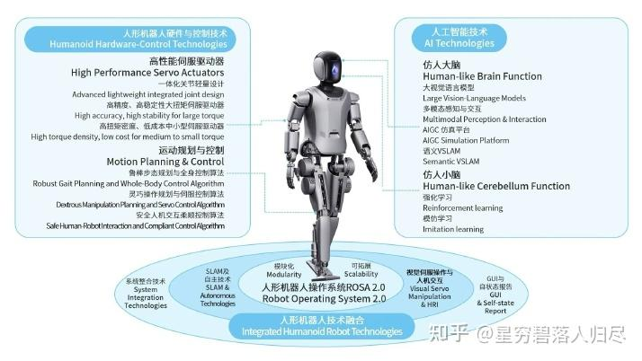
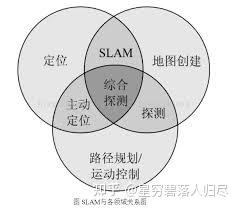

###### datetime:2025/09/26 15:55

###### author:nzb

# 机器人基础知识学习笔记---导航篇

## 1.引言

人类神经系统的工作原理可以类比为双核处理器系统：大脑皮层作为高级认知中心，负责需要复杂运算的"慢思考"任务（如逻辑推理、语言处理、情感分析等）；小脑则承担着即时响应的"快思考"功能，专门处理需要毫秒级响应的运动控制（如平衡调节、肌肉协调等）。现代人工智能技术正在用不同方式优化这两个"系统"：对于大脑的智能升级，科学家采用"具身智能"技术——通过让AI模型在虚拟环境中模拟人体感知，就像给计算机建立虚拟感官系统，使其能更自然地理解物理世界。而提升运动能力的"小脑系统"，目前主要依靠精密算法对已有运动模式进行迭代优化，就像人类通过反复训练形成肌肉记忆。这两个系统既独立发展又协同工作，最终目标是让人工智能既能像哲学家般深度思考，又能像运动员般敏捷行动。

**导航（Navgation）** 作为具身机器人中从认知到运动的桥梁，承担着机器人由感知到行动的转化任务。它不仅是视觉理解能力的延伸，更是驱动机器人完成复杂任务的核心机制，要求机器人具备自主探索环境、构建空间地图、精确定位目标并执行策略的能力。无论是物流仓库中自动导引车（AGV）在复杂货架间高效穿梭，还是医院配送机器人在狭窄走廊中精准避障，亦或是在灾难救援场景中无人驾驶车辆快速规划救援路径，机器人导航的性能都直接决定了任务的执行成功率、环境适应性和运动效率。本文将深入探讨机器人导航的感知技术、路径规划算法、地图构建与更新策略、多场景适配性及未来发展方向。

| 技术路线 | 适用场景 | 优势 | 挑战 |
| ------ | ------ | ------ | ------ |
| 传统模块化 | 工业、结构化环境 | 高稳定性、可解释性强 | 动态环境适应性差 |
| 端到端模型 | 复杂动态环境（如城市道路） | 高效感知决策耦合 | 数据需求大、黑箱模型 |
| VLN | 语义化指令响应 | 自然交互、任务泛化 | 依赖大规模预训练模型 |

机器人导航技术近年来在学术界和工业界均取得了显著进展，主要技术路线可分为端到端模型和模块化模型两大类，同时结合了传统算法、视觉语言导航（VLN）、强化学习（RL）等不同方向。以下从技术特点、应用场景及典型案例展开分析。

## 2.导航过程

在智能机器人的导航系统中，我们可以形象的将其核心控制架构类比生物神经机制，尤其是人类大脑与小脑的协同工作原理。这套精密的调控系统如同为机器人赋予了 "数字神经系统"，使它们能够在复杂环境中实现自主移动。下面，我们将从仿生学视角，解析机器人导航系统中 "大脑" 与 "小脑" 的核心功能。

### 2.1 大脑的作用

**目标规划：**大脑在导航过程中起到关键的规划作用。它根据任务需求，例如要从客厅前往厨房，大脑会综合考虑环境信息（地图、障碍物位置等）来确定最优的路径。这类似于人类大脑在日常出行中规划路线的过程。在机器人中，其大脑模块会调用地图数据和路径规划算法，如A*算法（一种启发式搜索算法），来计算从起点到终点的可能路径。

**决策制定：**当机器人在导航过程中遇到意外情况，如道路上有障碍物或环境发生变化时，大脑需要做出决策。例如，是选择绕过障碍物、改变路径，还是等待障碍物移除。这就像人类在遇到道路施工时，判断是绕行还是原地等待。

### 2.2 小脑的作用

**运动协调：**小脑在机器人导航中主要负责运动的协调性。对于人形机器人，它需要控制多个关节和肢体的动作，以实现平稳的行走。例如，在机器人行走时，小脑模块会协调腿部关节的运动，包括髋关节、膝关节和踝关节的屈伸、旋转等动作，使机器人能够保持平衡，就像人类小脑在行走时协调身体姿态一样。

**平衡控制：**小脑对机器人的平衡控制至关重要。它会根据机器人身体的姿态传感器（如陀螺仪和加速度计）反馈的信息，实时调整机器人的重心位置和肢体动作。比如当机器人在不平整的路面上行走时，小脑会通过调节腿部力量和姿态，使机器人避免倾倒。

## 3.传统算法导航技术

传统机器人导航主要依赖精确建图与预设路径规划。例如在工业自动化场景中，机器人通过激光雷达和超声波传感器构建涵盖地标和障碍物的环境地图，随后运用 A* 或 Dijkstra 算法规划从起点到终点的最短路径。这一模式的优势在于路径规划逻辑清晰、结果可预测，且地图精度高时导航可靠性强。但其局限性也同样明显，地图构建过程复杂且对环境动态变化适应性差，若障碍物位置稍有变动，预设路径便可能失效，需要人工重新规划。地图可以是二维的平面地图或者三维的立体地图。对于二维地图，机器人通过定位自身在地图中的位置，然后根据路径规划算法生成的路径进行运动。例如，在一个已知布局的工厂车间，机器人可以利用激光雷达扫描周围环境，结合预先绘制的车间平面图，确定自己在车间内的位置。然后按照规划好的路径，从原材料存放区运输货物到加工区。在三维地图环境中，机器人可以更好地处理有楼梯、斜坡等复杂地形的情况。不过，构建和维护高质量的三维地图成本较高，且对机器人的硬件（如高精度的传感器）要求也比较高。

### 3.1 定位及建图

SLAM 是机器人或自主移动设备在一个未知环境中运动时，利用传感器（如激光雷达、摄像头、毫米波雷达等）来估计自身位置，同时构建环境地图的过程。例如，在一个室内场景中，一个搭载激光雷达的机器人在未知的房间内移动，激光雷达不断扫描周围环境物体（如墙壁、家具等），通过算法处理这些扫描数据，一方面确定自己在房间中的位置，另一方面构建出房间的平面或三维地图。

基于滤波的方法 ：像扩展卡尔曼滤波（EKF - SLAM）是一种常用方法。它将机器人的状态（位置、速度等）和地图中的特征点（如墙角、特定物体等）的状态进行联合估计。以 EKF - SLAM 为例，它通过预测步骤和更新步骤来实现。在预测阶段，根据机器人运动模型（如轮式机器人的运动学模型）来预测机器人下一步的状态以及地图特征点的状态；在更新阶段，当传感器获取到新的观测数据（如激光雷达扫描到某个特征点的距离和角度）时，利用卡尔曼滤波的更新公式来修正机器人和地图特征点的状态估计，从而减少估计误差。

基于优化的方法 ：例如批处理 SLAM。它将整个机器人运动轨迹和地图构建看作一个全局优化问题。收集大量的传感器数据后，通过最小化某种误差函数（通常是观测误差，即传感器观测到的特征点位置和根据机器人位置以及地图构建的特征点位置之间的差异）来优化机器人的位姿（位置和姿态）和地图参数。这种方法可以在数据收集完整后得到相对精确的机器人轨迹和地图，但计算量较大，不适合实时性要求很高的场景。

### 3.2 路径规划算法

这是机器人导航的基础部分。常见的有 A* 算法、Dijkstra 算法等。A* 算法是一种启发式搜索算法，它通过评估从起点到终点的最短路径来引导机器人。例如，在一个室内环境中，机器人需要从客厅到达卧室。A* 算法会综合考虑路径的实际距离（如沿着墙壁、家具等障碍物边缘的距离）和启发式信息（如直线距离到目标的大致估计），为机器人规划出一条相对较优的路径。

Dijkstra 算法则主要用于计算图中的最短路径，它可以确保机器人找到从起点到终点的最短路径，但计算效率相对较低，在复杂环境中可能会耗费较多时间。

其他还有人工势场法，它将机器人视为一个质点，在目标点产生吸引势场，障碍物产生排斥势场。机器人在这些势场的合力作用下运动。不过，这种方法容易陷入局部极小值，导致机器人无法到达目标点。例如，在一个狭窄的通道中，障碍物产生的排斥力可能会使机器人停在通道中间，无法继续前进。

### 3.3 组成与优势

模块化模型将导航任务分解为多个子模块，如建图模块、全局规划模块和局部控制模块。建图模块负责构建和更新环境地图，全局规划模块根据地图和目标位置生成大致的路径，局部控制模块则根据实时的环境信息（如近距离的障碍物）对机器人的运动进行微调。这种模块化的方式使得各个模块之间相对独立，便于开发、调试和优化。例如，如果发现局部控制模块在障碍物避碰方面存在不足，可以单独对这个模块进行改进，而不需要重新设计整个导航系统。

### 3.4 挑战与应用前景

模块之间的信息交互和协调是一个挑战。各个模块需要准确地传递信息，如地图信息、规划路径等，否则会影响整个导航系统的性能。随着技术的发展，模块化模型在实际应用中前景广阔。例如，在户外农业机器人中，建图模块可以利用卫星定位和传感器数据构建农田地图，全球规划模块规划农作物巡逻路线，局部控制模块则根据田间的杂草、农作物等障碍物实时调整机器人的运动，实现高效的农业监测和管理任务。

## 4.端到端导航

端到端学习方法摒弃了传统导航中复杂的模块化流程，直接将传感器数据输入与机器人动作输出相连。以深度强化学习为例，机器人在模拟或真实环境中自主试错，通过奖励函数塑造行为策略。这种方法的优势在于能快速适应复杂、动态的环境，例如在人群熙攘的商场中，机器人可实时根据人流密度调整行进方向和速度。然而，端到端学习模型的可解释性始终是难题，且训练过程对大量高质量数据和强大算力的需求，限制了其在资源受限场景中的广泛应用。

### 4.1 工作方式与优势

端到端模型直接将感知输入（如图像、深度信息等）映射为动作决策。它不需要像传统算法那样进行复杂的路径规划和中间步骤处理。例如，使用深度神经网络构建的端到端模型，可以直接将摄像头拍摄的图像输入模型，经过网络的处理，输出机器人应该采取的动作（如车轮的转速和方向）。这种导航方式的优势在于其高效性，能够快速地将感知信息转化为行动，适合实时性要求较高的场景。

### 4.2 训练与局限性

端到端模型的训练可以采用强化学习（RL）、模仿学习（IL）等多种方式。在模仿学习中，模型通过学习人类专家的示范数据来学习导航策略。然而，端到端模型的可解释性较差，很难理解模型内部是如何做出决策的。而且，如果训练数据存在偏差或者不完整，模型在实际应用中可能出现不可预测的行为。

## 5.强化学习导航

### 5.1 基本原理

强化学习导航是通过让机器人在环境中不断试错来学习最优的导航策略。机器人会根据当前的环境状态（如位置、周围障碍物信息等）采取行动（如向前移动、向左转、向右转等），然后根据环境给予的奖励信号来更新自己的策略。例如，当机器人成功接近目标点时会获得正向奖励，而碰到障碍物或者偏离目标方向会受到惩罚。通过不断地学习，机器人逐渐学会如何在复杂环境中有效地导航。

### 5.2 应用场景与局限性

在动态环境（如人群密集的商场、有其他移动机器人的仓库等）中，强化学习导航能够更好地适应环境的变化。因为机器人可以根据实时的环境反馈调整自己的策略。然而，强化学习训练过程通常需要大量的样本数据和计算资源。而且，在训练初期，机器人可能会出现很多不合理的动作，导致学习时间较长，也可能对实际环境造成一定的干扰（如在真实场景中频繁碰撞障碍物）。

### 5.3 模仿学习与混合导航策略的兴起

模仿学习通过让机器人模仿人类专家的操作示范来学习导航策略。在物流机器人训练中，先由人类操作员驾驶机器人完成一系列典型任务，机器人记录并学习这些操作模式。其优势在于能将人类丰富的经验转化为机器人的行为模式，但对专家示范数据的质量和多样性要求极高，若示范数据不足或存在偏差，机器人学到的策略可能无法泛化到实际复杂场景中。

## 6.视觉-语言导航（VLN）

### 6.1 概念与优势

VLN 是一种新兴的导航技术路线。它将自然语言指令与视觉感知相结合。例如，机器人接收到 “去厨房的冰箱旁，旁边有一个蓝色的柜子” 这样一个指令。它需要理解这个语言指令，同时利用视觉系统识别厨房环境中的冰箱以及蓝色柜子。这种导航方式的优势在于它更加符合人类的交互习惯，使得人机交互更加自然。

### 6.2 技术挑战

语言理解是其中的关键难点。自然语言的模糊性和多样性给机器人带来了巨大的挑战。比如，“旁边” 这个词可能有不同的理解范围，是指紧挨着冰箱的柜子，还是在冰箱周围一定距离内的柜子。而且，语言指令可能包含各种语法结构、口语化表达等。同时，视觉与语言的融合也是一个难题。如何将视觉场景中的元素准确地与语言指令中的描述对应起来，需要复杂的人工智能模型，如基于 `Transformer` 的模型架构来实现有效的信息交互。

### 6.3 近期工作

- 1.数据增强与环境生成
  - 全景图像生成（PanoGen++）：提出基于预训练生成模型（如Stable Diffusion）的领域自适应框架，通过掩码修复和递归外推生成多样化的全景环境，显著提升智能体在未见场景中的泛化能力。实验显示在R2R、R4R等数据集上的导航成功率（SR）和路径长度加权成功率（SPL）均优于传统方法。
  - 复杂长程任务数据生成（NavGen）：中山大学团队开发自动化平台NavGen，支持双向生成机制：前向基于GPT-4生成多步骤指令（如“拿毛巾→送厨房→取茶壶”），后向分解为原子动作序列。生成的任务平均包含4-6个子步骤，覆盖216个3D室内场景，适配四足机器人和轮式机械臂等多种形态。

- 2.模型架构与算法创新
  - 多模态记忆与推理（MGDM）：针对长程导航任务，提出分层记忆机制：短期记忆通过滑动窗口动态遗忘次要信息，长期记忆检索历史成功案例辅助决策。结合链式思维（CoT）反馈，利用GPT-4生成显式推理步骤（如“左转进入浴室，确认门位置”），降低模型幻觉风险。
  - 预训练与历史感知（HOP）：设计面向VLN的预训练任务，包括轨迹顺序建模（TOM）、分组顺序建模（GOM）和历史感知动作预测（APH）。在R2R、REVERIE等数据集上，HOP模型的目标进展（GP）比基线提升2.16米，验证了时空序列建模的有效性。
  - 对话交互导航（UNMuTe）：结合GPT-2解码器和图Transformer（DUET），实现导航过程中主动生成问题-答案对。通过动态熵阈值触发对话，提升不确定场景下的决策鲁棒性。在CVDN数据集上，目标进展达13.35米，成功率提升7.73%。

- 3.任务与数据集扩展
  - 动态人机交互（HA-R2R）：扩展传统R2R数据集，引入动态人类活动（如行人移动），开发HA3D模拟器。实验显示现有模型在动态环境中的碰撞率（CR）显著上升，突显实时决策的挑战性。
  - 复杂长程导航基准（LHPR-VLN）：构建包含3260个多阶段任务的基准，要求机器人按顺序完成“定位-抓取-转移”逻辑链条。评估指标新增独立成功率（ISR）和条件成功率（CSR），传统模型在2-3子任务场景中成功率趋近0%。

- 4.多模态融合与Prompts设计
  - 多模态指令（VLN-MP）：提出结合文本与图像的指令形式，设计三种图像Prompts配置（Aligned、Related、Terminal）。利用ControlNet生成增强数据，在R2R-MP等数据集上验证了多模态融合模块（MPF）的优越性，SPL指标提升12%。
  - 视觉-语言-动作统一模型（VLN-CM）：在HA-VLN任务中，通过跨模态编码器整合视觉特征与语言指令，支持动态环境中的语义地图构建与路径规划。实验表明，其在碰撞率（CR）和路径连贯性（CGT）上优于传统端到端模型。

- 5.仿真到现实的迁移与落地
  - 具身大模型与机器人平台：元戎启行推出RoadAGI平台，集成VLN模型实现自然语言导航。其Spark平台支持移动智能体在无地图场景中完成“家庭→商场”跨场景任务，验证了VLN技术在自动驾驶和机器人领域的实用性。
  - Sim2Real迁移学习：阿德莱德大学团队提出利用Holodeck等高保真仿真工具缩小虚拟与现实差距，通过预训练模型（如HOP）优化实体机器人运动控制模块，解决跨场景泛化难题

## 7.应用类型和场景介绍

以下是不同类型机器人在不同场景下使用的主流自主导航算法及其差别：

**无人机**

- 传统算法 ：在军事侦察、边境巡逻等场景中，无人机常依赖精确的运动学模型和先验地图，通过经典优化理论实现有限自主导航，但难以适应复杂环境。
- 深度学习算法：在物流配送、航拍测绘等场景，利用深度学习将感知信息映射到特征空间预测机动策略。如在城市环境物流配送中，以此规划飞行路径并躲避障碍物，但依赖大量人工标注数据，适应性有限。
- 深度强化学习算法：在搜索救援、环境监测等复杂场景中广泛应用。无人机通过与环境交互探索状态 - 动作空间，学习最优控制策略。如在地震后的废墟环境中，能自主寻找路径并避开障碍物执行任务，但存在训练样本需求大、计算资源消耗高等问题。

**自动驾驶汽车**

- 传统路径规划算法：在城市道路、高速公路等场景，依赖高精度地图和传感器数据，运用 A*、Dijkstra 等算法规划全局路径，结合车辆动力学模型进行局部路径调整，确保行驶安全和效率，但在复杂交通状况下适应性不足。
- 深度学习算法：基于深度神经网络的端到端学习模型，直接将摄像头图像、激光雷达点云等感知数据映射到车辆的控制动作，实现自动驾驶。在复杂城市交通中，能快速做出驾驶决策，但可解释性差，对数据和算力要求高。
- 多传感器融合定位与规划算法：融合激光雷达、摄像头、毫米波雷达等多种传感器数据，提高车辆在各种环境下的定位精度和感知能力，再结合路径规划算法实现精准导航，能有效应对复杂多变的路况。

**AGV**

- 传统磁条引导算法：在制造车间、仓库等场景，沿预先铺设的磁条路径行驶，通过检测磁条信号实现导航。路径固定，导航精度高，但灵活性差，难以适应环境变化和任务调整。
- 激光 SLAM 算法：在大型物流中心、智能仓储等场景应用广泛。利用激光雷达扫描环境构建地图，并实时定位自身位置，规划最优路径。具有较高的灵活性和自主性，可自动适应环境变化和任务需求，但对激光雷达的性能和环境的反射特征有一定要求。
- 视觉导航算法：基于摄像头采集的图像信息进行导航，通过识别环境中的特征点或标志物确定自身位置和方向。成本较低，但受光照条件、环境纹理等因素影响较大。

**AMR**

- SLAM 算法：在医院、酒店、办公室等动态复杂环境中，通过激光 SLAM 或视觉 SLAM 技术构建地图并实现实时定位与导航，能自主避开障碍物、规划路径，适应环境变化，完成物品配送、引导等任务。
- 深度强化学习算法：在一些需要与人类密切协作的场景，如餐饮服务、养老护理等，利用深度强化学习算法学习与人类交互的策略和行为模式，根据环境反馈调整自身行为，提高服务质量和效率，但训练过程较为复杂。
- 多机器人协同导航算法：在多机器人协作的场景，如工厂物流、仓储搬运等，多 AMR 之间通过通信和协同算法协调运动，避免碰撞和冲突，提高整体工作效率。

**扫地清洁机器人**

- 随机碰撞导航算法：早期扫地机器人多采用此算法，通过碰撞传感器感知障碍物，随机改变方向继续清扫。结构简单、成本低，但清扫效率低、覆盖率不高。
- 激光 SLAM 导航算法：目前主流的导航方式，利用激光雷达扫描房间构建地图，规划系统清扫路径，导航精度高、清扫效率和覆盖率大幅提升，但激光雷达成本较高。
- 视觉 SLAM 导航算法：通过摄像头采集图像信息构建环境地图并导航。成本相对较低，但在光照变化、纹理特征不明显等环境下性能可能受影响。

**室外物流小车**

- 传统路径规划与卫星定位融合算法：在校园、园区等相对开放的环境中，结合卫星定位技术和路径规划算法，按预设路线行驶。定位精度受卫星信号影响，在建筑物遮挡、信号干扰等情况下可能出现偏差。
- 激光 SLAM 与视觉融合导航算法：在复杂的城市道路、工业园区等场景，融合激光雷达和摄像头数据，构建高精度地图并实时定位导航。能有效应对环境变化和动态障碍物，提高物流小车的自主性和可靠性，但传感器成本和算法复杂度较高。
- 深度学习与强化学习结合算法：通过深度学习模型处理大量的道路图像和环境数据，学习道路特征和行驶模式，结合强化学习算法优化行驶策略。能适应复杂多变的路况和交通流量，提高配送效率，但需要大量数据进行训练和优化。

**四足机器人**

- 传统运动学模型与轨迹规划算法：在实验室研究、科研探索等场景，基于四足机器人的运动学和动力学模型，通过轨迹规划算法实现行走、奔跑等基本运动模式。对地形适应性有限，通常用于平坦地面或简单地形的实验研究。
- 深度强化学习算法 ：在复杂地形探索、灾难救援等场景中，通过深度强化学习算法让机器人在模拟或真实环境中学习适应不同地形的行走策略。能自主调整步态和姿态，应对崎岖山路、废墟等复杂地形，但训练过程复杂，对硬件性能要求高。
- 视觉与触觉融合导航算法：融合视觉传感器和足底触觉传感器的信息，实时感知地形和障碍物，调整步伐和姿态。提高机器人在复杂地形下的稳定性和通过性，但在传感器数据融合和实时处理方面面临挑战。

**人形机器人**

- 传统控制算法与动力学模型：在工业装配、实验室研究等场景，依据精确的动力学模型设计关节控制器，实现精准的动作控制和操作任务。对模型精度要求高，难以适应不确定性和外部扰动。
- 深度学习与模仿学习算法：通过深度学习和模仿学习技术，学习人类的动作和行为模式，实现复杂任务的操作和人机交互。在家庭服务、教育陪伴等场景中，能模仿人类的动作和表情，提供自然的交互体验，但可解释性和泛化能力有待提高。
- 多模态感知与融合导航算法：融合视觉、听觉、触觉等多种传感器信息，实现对环境的全面感知和理解，进而进行自主导航和操作。在复杂多变的实际应用场景中，能更好地适应环境和完成任务，但对多模态数据的处理和融合算法要求极高。

**特种机器人**

- 传统定位与避障算法：在管道检测、矿井作业等相对结构化的特殊环境下，采用激光雷达、超声波传感器等进行定位和避障，结合传统的路径规划算法完成任务。对环境的适应性和自主性有限，通常需要人工干预。
- 深度强化学习与适应性控制算法：在消防救援、核设施巡检等复杂危险环境中，运用深度强化学习算法学习适应极端环境的导航和操作策略，自主完成救援、巡检等任务。能应对复杂多变的环境和危险状况，但训练和应用成本较高。
- 多传感器融合与遥操作导航算法：融合多种传感器信息，同时结合遥操作技术，操作人员可在安全区域远程控制机器人在危险环境中执行任务。在水下作业、太空探索等场景中，通过这种方式提高机器人的操作精度和适应性，但对通信技术和传感器性能要求严格。

## 8.总结

**端到端导航：**是一种将传感器输入（如图像、激光雷达数据等）直接映射到输出动作（如速度、转向等）的导航方式，跳过了中间复杂的步骤，如对环境进行详细的建模、路径规划等，直接通过一个模型来实现从感知到行动的转换，主要任务是将传感器感知到的环境信息直接映射为车辆的控制动作，以实现车辆从一个位置到另一个位置的自主移动，不依赖于预先规划好的路径或导航指令

**强化学习导航：**强化学习是一种机器学习方法，智能体（agent）在环境中采取行动，通过与环境的交互来学习策略，以最大化累积的奖励信号。在强化学习导航中，智能体（如机器人或虚拟角色）在环境中移动，通过不断地尝试不同的动作（如向前移动、向左转、向右转等），根据环境反馈的奖励（如成功到达目标位置获得正奖励，碰到障碍物获得负奖励）来学习最优的导航策略。

**VLN：**即视觉语言导航，是具身智能和多模态理解的重要整合，其任务是使自主智能体能够根据自然语言指令在复杂的未知环境中进行导航，需要同时理解语言指令和视觉场景。

| 维度 | 传统算法导航 | 端到端导航 | 强化学习导航 | VLN导航 |
| ----- | ----- | ------ | ----- | ------ |
| 技术核心 | 规则与模块化设计 | 单一神经网络端到端映射 | 奖励驱动的策略优化 | 多模态语义对齐 |
| 数据依赖 | 低（依赖人工规则） | 高（需海量场景数据） | 中高（仿真+真实数据） | 高（需语言-视觉配对数据） |
| 可解释性 | 高 | 低（黑盒模型） | 中（依赖奖励函数设计） | 中（依赖语义解析） |
| 环境适应性 | 静态或低动态环境 | 复杂动态环境 | 高动态、不确定性环境 | 需语义理解的开放环境 |
| 典型挑战 | 长尾场景处理能力弱 | 调试困难、算力需求高 | 仿真-现实差异、奖励设计 | 跨模态语义鸿沟 |
