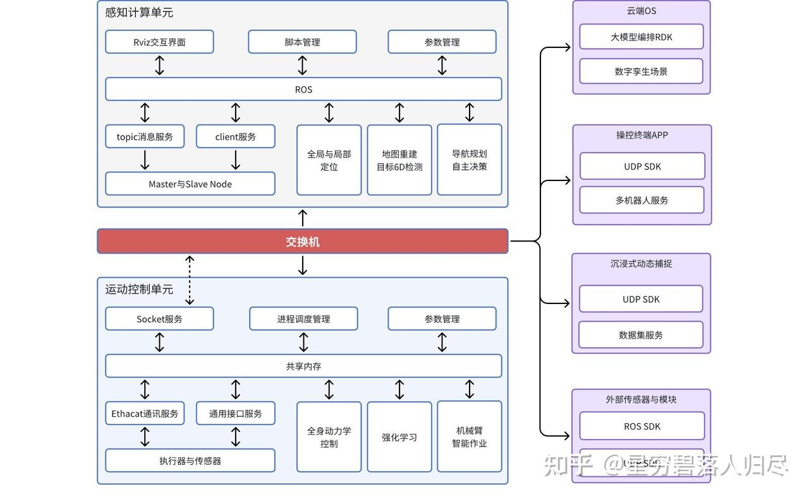
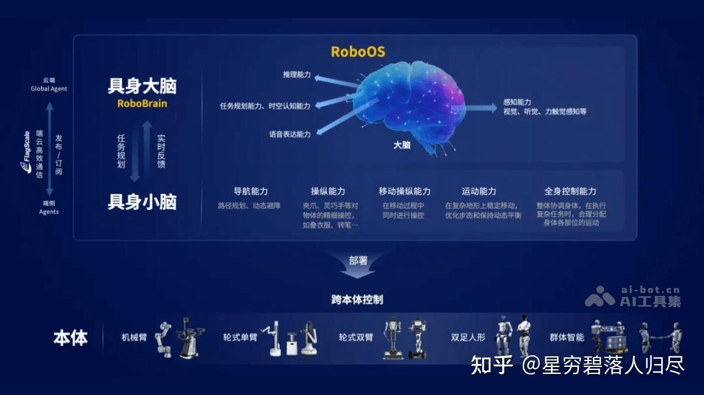
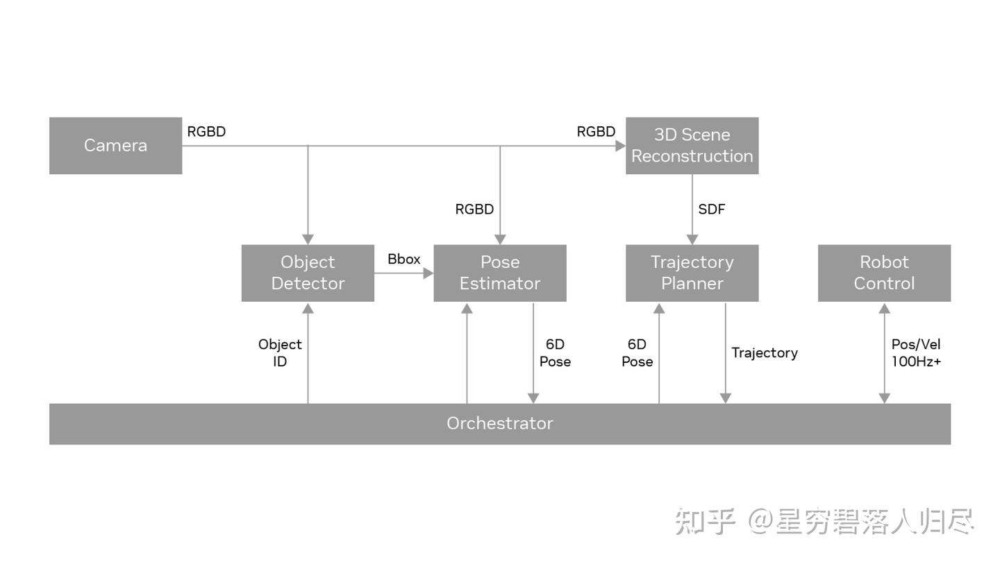
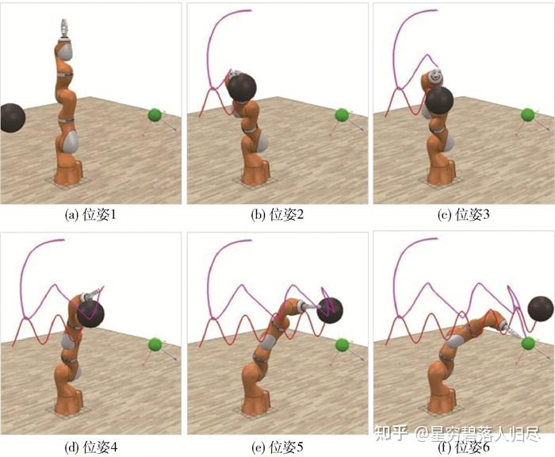
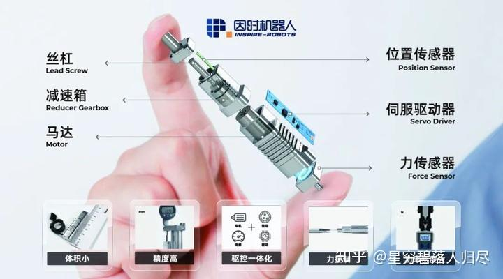
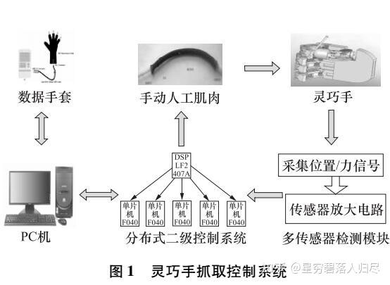
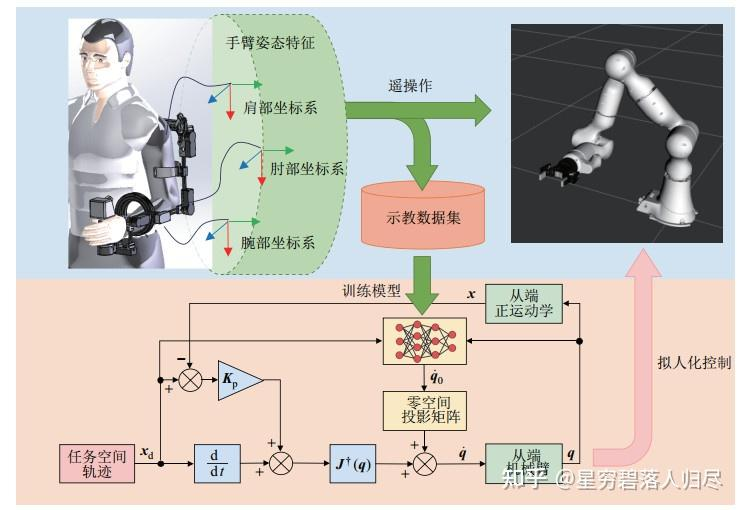
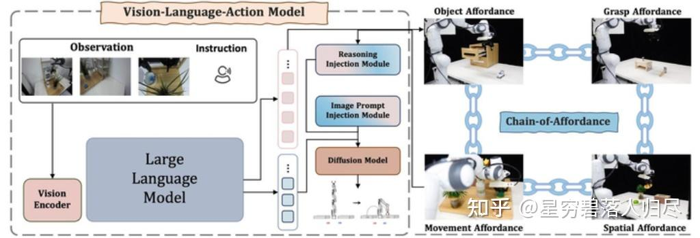
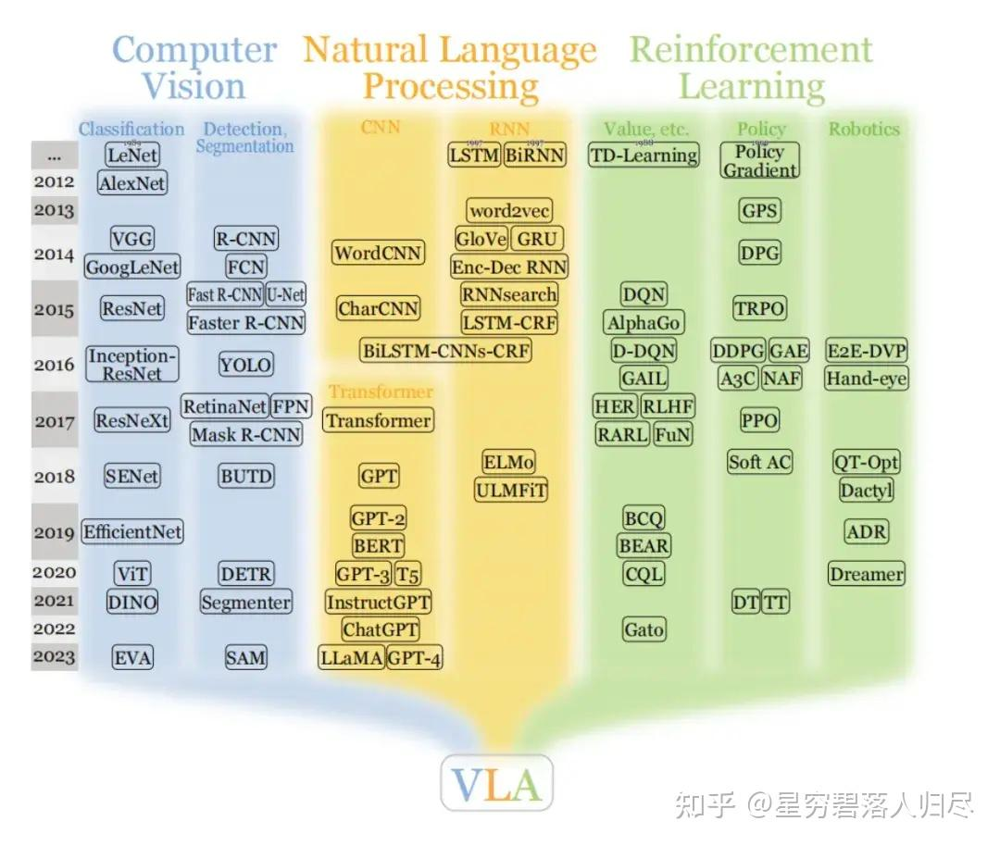

###### datetime:2025/10/09 14:53

###### author:nzb

# 机器人基础知识学习笔记---操作篇

## 1.引言

人类神经系统的工作原理可以类比为双核处理器系统：大脑皮层作为高级认知中心，负责需要复杂运算的"慢思考"任务（如逻辑推理、语言处理、情感分析等）；小脑则承担着即时响应的"快思考"功能，专门处理需要毫秒级响应的运动控制（如平衡调节、肌肉协调等）。现代人工智能技术正在用不同方式优化这两个"系统"：对于大脑的智能升级，科学家采用"具身智能"技术——通过让AI模型在虚拟环境中模拟人体感知，就像给计算机建立虚拟感官系统，使其能更自然地理解物理世界。而提升运动能力的"小脑系统"，目前主要依靠精密算法对已有运动模式进行迭代优化，就像人类通过反复训练形成肌肉记忆。这两个系统既独立发展又协同工作，最终目标是让人工智能既能像哲学家般深度思考，又能像运动员般敏捷行动。

**操作（Manipulation）** 作为实现具身智能从感知到执行闭环的关键环节，深度嵌入了从目标识别到动作规划的完整流程。它不仅需要整合视觉、触觉及力反馈等多模态感知数据，更要求系统具备实时决策与动态调整能力，以适应复杂环境中的任务需求。在工业生产线上，协作机器人通过精准抓取与组装完成毫秒级工艺操作；在家庭场景中，服务机器人需根据语音指令实现物体搬运与空间整理的无缝衔接；而在医疗手术辅助领域，机械臂必须在毫米级精度下完成组织分离与器械传递。操作任务的执行效能取决于感知模块的语义理解深度、运动规划算法的实时性以及人机交互界面的自然流畅性。本文将聚焦机器人操作任务中的目标识别框架、力位混合控制策略、跨领域适配机制，探讨机器人的操作技术路线，分类以及未来发展。

## 2.机器人操作任务简介

机器人的核心任务可以概括为两点：**操作**和**导航**。后者是解决机器人“我要去哪里以及怎么去的问题”，前者则是“我要做什么以及怎么做”的问题。那么机器人经典操作任务有哪些？接下来按照常见的落地场景来对操作任务分类进行简要的介绍：

经典的**工业场景**有**装配、焊接、喷涂、搬运、分拣、包装**，常用的机器人就是工业机器人和机械臂,例如在汽车制造中，机器人需要将各种零部件搬运并准确地装配到相应位置，完成焊接、喷涂等工序，同时对产品质量进行检测。

在**家庭场景**中，经典的任务就是**清洁、物品抓取、备餐、整理收纳、照顾老人或儿童**，具体的细节就是物品的抓取与放置，如从冰箱取物品、摆放餐具；清洁工作，如扫地、擦桌子；还有协助人类进行一些简单操作，如开关门、倒水等。

**医疗场景**中常见的就是**手术辅助、康复训练、送药、消毒、实验室自动化**，涵盖手术操作，如微创手术中的器械操控、缝合伤口；康复治疗，如辅助患者进行肢体康复训练；护理工作，如协助患者进食、翻身等。

**特殊场景**的机器人需要做的更多了，比如**灾难救援、太空作业、深海探索、农业采摘、危险品处理**等，还有农业场景里的播种，收割，或者建筑中的砌砖等。在太空环境中，机器人需要完成空间站的建造、维修、设备更换等任务；在海底，要进行水下探测、资源开采、设备安装与维护；在核辐射、化学污染等危险环境中，负责物品搬运、设备操作、环境监测等工作。

| 应用场景 | 经典操作任务 |
| ----- | ----- |
| 工业场景 | 装配、焊接、喷涂、搬运、分拣、包装、质量检测 |
| 家庭场景 | 清洁、物品抓取、备餐、整理收纳、老人 / 儿童照料 |
| 医疗场景 | 手术辅助（如达芬奇系统）、康复训练、送药、消毒、实验室自动化 |
| 特殊场景 | 灾难救援（废墟搜救）、太空作业（ISS 机械臂）、深海探索、农业采摘、危险品处理 |

在明确了机器人的操作任务之后，要完成这些任务就需要相应的部分配合进行完成。比如感知部分，使用用摄像头、激光雷达、传感器，来实现运动规划，路径规划和避障。在控制部分，常用算法如力控制和位置控制。人机交互部分，比如语音或图形界面。比如通信模块，比如与中央系统或其他机器人协作。比如计算平台，常用的如嵌入式系统或GPU服务器。

| 核心组件类别 | 详细内容 |
| ----- | ----- |
| 感知系统 | 
传感器：RGB-D 摄像头、LiDAR、IMU、力 / 触觉传感器（如 BioTac）、红外测温
 
算法：SLAM、目标检测（YOLO）、语义分割
 |
| 运动规划与控制 | 
规划：RRT*、A * 算法
 
控制：PID、阻抗控制、模型预测控制（MPC）
 |
| 人机交互 | VR/AR 界面、语音交互（如 Alexa 集成）、手势识别 |
| 通信与计算 | ROS/ROS2 中间件、5G 实时传输、边缘计算（NVIDIA Jetson） |

进行操作任务的核心也就是操作设备，主要依赖于执行器，也即机械臂和末端执行器等系统的密切配合。工业常用用多关节串联机械臂，SCARA，Delta机器人，夹爪，真空吸盘。机械臂提供运动能力和多个自由度，末端执行器根据任务选择如夹爪、吸盘、焊枪、喷涂枪等，传感器用于感知环境和物体信息，控制系统则根据传感器反馈和预设程序控制机械臂和末端执行器的动作。家庭场景用轻型协作臂，软体机器人，多指灵巧手。

家庭场景下需要机械臂与末端执行器、传感器、导航系统等协同工作。机械臂实现灵活的运动，末端执行器如夹具、吸盘等用于抓取不同物体，传感器感知周围环境和物体的位置、形状等信息，导航系统引导机器人在家庭环境中移动，一般采用轻型、灵活且安全性高的机械臂，如关节型机械臂。末端执行器多为仿人手的灵巧手或针对特定物体设计的夹具，以及用于清洁的毛刷、吸尘口等。

医疗场景下需要应用柔性臂，专用手术工具等高精度的机械臂、专业的末端执行器、各种医疗传感器以及精准的控制系统。机械臂保证手术器械或康复设备的精确运动，末端执行器如手术器械、康复手套等与患者身体直接接触并完成操作，传感器实时监测患者的身体状况和操作过程中的各种参数，控制系统根据传感器反馈和医疗专家的指令进行精确控制。在手术领域，有达芬奇手术机器人的机械臂，其末端执行器为精细的手术器械；康复治疗中，有外骨骼机械臂等，末端执行器为康复训练装置。此外，还有一些用于医疗护理的机械臂，末端执行器可能是喂食装置、护理床等。

在特殊场景需要考虑特化设计，考虑使用的有如模块化机械臂，防水防爆设计，或者仿生结构。末端执行器可能根据任务不同，比如夹持器、吸盘、手术刀、喷枪等。

机械臂：

| 应用场景 | 典型机器人型号及特点 |
| ----- | ----- |
| 工业 | KUKA LBR iiwa（协作型机械臂）、SCARA（高速装配机械臂）、Delta（高速分拣并联机器人） |
| 医疗 | 达芬奇手术臂（7 自由度柔性机械臂，适用于微创手术）、SteadyHand（显微手术精准操控机械臂） |
| 特殊场景 | 波士顿动力 Spot（四足移动底盘 + 机械臂，适用于复杂地形作业）、Soft Robotics 软体抓手（柔性抓取技术） |

末端执行器：

| 类型 | 典型末端执行器型号及用途 |
| ----- | ----- |
| 通用 | 气动夹爪（SCHUNK，适用于通用抓取场景）、电磁吸盘（用于金属工件搬运） |
| 专用 | 手术电刀（医疗场景精准切割）、3D 打印喷头（增材制造）、多指灵巧手（Shadow Hand，高精度操作） |

**总结**

| 场景类型 | 经典操作任务 | 配合部分 | 机械臂及末端执行器 | 传统方法与学习方法 | 主流及前沿方向 |
| ----- | ----- | ----- | ----- | ----- | ----- |
| 工业场景 | 搬运、码垛、装配、焊接、喷涂、打磨、质量检测（如汽车制造中零部件装配、焊接等） | 机械臂 + 末端执行器 + 传感器 + 控制系统 | 六轴机械臂、SCARA 机械臂；夹爪 / 吸盘（搬运 / 装配）、焊枪（焊接）、喷涂枪（喷涂）、打磨器（打磨） | 传统：运动学 / 动力学模型 + 规则控制；学习：强化学习 / 深度学习（模拟试错优化路径、抓取策略） | ① 提升精度与速度；② 人机协作（交互 + 控制技术）；③ 数字孪生仿真优化 |
| 家庭场景 | 物品抓取 / 放置（冰箱取物、摆餐具）、清洁（扫地、擦桌）、协助操作（开关门、倒水） | 机械臂 + 末端执行器 + 传感器 + 导航系统 | 轻型关节型机械臂；仿人灵巧手 / 特定夹具（抓取）、毛刷 / 吸尘口（清洁） | 传统：预设程序 + 传感器逻辑判断；学习：机器学习（学人类示范）、深度学习（物体识别分类） | ① 智能自主化（理解人类意图、适应复杂环境）；② 自然语言 / 语音交互；③ 高效节能驱动 |
| 医疗场景 | 手术（微创器械操控、缝合）、康复（肢体训练）、护理（进食、翻身） | 高精度机械臂 + 专业末端执行器 + 医疗传感器 + 精准控制系统 | 达芬奇手术机械臂（末端为手术器械）、外骨骼机械臂（末端为康复装置）、护理机械臂（末端为喂食 / 床） | 传统：医生经验 + 物理模型控制；学习：深度学习 / 强化学习（学手术案例辅助规划、康复数据调方案） | ① 更高精度、安全性；② 微型灵活器械 / 机械臂；③ 多模态信息融合（影像 + 生理信号） |
| 特殊场景 | 太空（空间站建造 / 维修 / 换设备）、海底（探测 / 开采 / 安装维护）、危险环境（搬运 / 操作 / 监测） | 适应极端环境的机械臂 + 专用末端执行器 + 环境感知传感器 + 自主 / 遥操作系统 | 太空：抗辐射高精度机械臂（末端维修工具）；海底：耐压防水机械臂（末端采样 / 作业工具）；危险环境：防腐蚀机械臂（末端操作装置） | 传统：精准建模 + 预设程序（应对已知环境）；学习：强化学习（极端环境模拟训练）、深度学习（环境感知 / 故障诊断） | ① 极端环境适应性（材料、结构）；② 自主决策 + 遥操作融合；③ 多场景通用模块化机械臂研发 |

## 3.操作过程

在智能机器人的操作控制系统中，我们可以形象的将其核心控制架构类比生物神经机制，尤其是人类大脑与小脑的协同工作原理。这套仿生控制架构如同为机械臂赋予了 "数字神经中枢"，使冰冷的金属肢体能够完成抓握杯子、零件装配等精细操作。下面，我们将从仿生学视角，解析机器人操作过程中两大核心模块的协同运作机制。

### 3.1 大脑的作用

**任务理解与规划**：大脑负责理解操作任务的要求。例如，机器人需要拿起一个杯子并将其放在指定位置，大脑会分析这个任务，确定杯子的位置、形状和大小，以及放置位置的坐标和姿态要求。然后，它会规划出机械臂或手部的动作序列，包括关节的运动角度和顺序。

**智能决策**：在操作过程中，大脑还需要做出智能决策。比如，当机器人抓取一个易碎物品时，大脑会根据物品的材质和形状，决定抓取的力度和方式，是采用轻柔的抓取还是需要特殊的夹具来辅助抓取。

### 3.2 小脑的作用

**动作执行的精准性**：小脑在操作过程中确保机器人的动作精准执行。它会对机械臂或手部的运动进行微调，使机器人的操作更加精确。例如，在机器人进行高精度的装配任务时，小脑会控制机械臂的运动轨迹，使其能够准确地将零件插入到指定位置。

**运动的连贯性**：小脑使机器人的操作动作更加连贯。它会协调不同关节的运动速度和加速度，避免出现动作突兀或卡顿的情况。就像人类小脑在进行精细的手部操作（如书写或弹钢琴）时，保证动作的流畅性一样。

### 3.3 操作技术路线

在机械臂和灵巧手的控制中，**Model-based**（基于模型）和 **Learning-based**（基于学习） 方法是两类核心技术路线，各自有不同的理论基础和应用场景：

传统方法包括基于模型的控制，PID，运动学逆解，视觉处理用OpenCV，力反馈控制。学习方法包括强化学习，模仿学习，深度学习如CNN处理图像，DRL用于复杂任务。结合大模型的话，可能是利用预训练模型进行任务规划，比如用GPT生成指令，或VLM处理视觉语言信息，多模态模型整合多传感器数据。

目前的主流以及前沿方向，有强化学习与仿真结合，比如在虚拟环境中训练迁移到现实；人机协作的安全性和自适应控制，柔性机器人结构，多模态感知融合，大模型的任务规划和决策，还有云机器人，共享学习经验。另外，自主学习和少量数据下的适应能力可能也是前沿，比如元学习或迁移学习。还有结合触觉反馈和视觉的增强学习，以及模块化机器人设计，便于快速更换执行器适应不同任务。

## 4.基于模型的方法

基于模型的方法依赖于系统的数学建模（如动力学、运动学模型），通过理论推导设计控制器，适用于模型已知或可精确建模的场景。

### 4.1 机械臂规划方法

机械臂的运动规划与控制算法可根据核心思想分为优化型、采样型、搜索型三大类，它们在数学原理、适用场景和性能特性上有显著差异。以下从定义、核心方法、典型算法及应用场景展开分析：

#### 4.1.1 采样型算法（Sampling-Based Algorithms）

**定义**

通过在状态空间（如关节空间、笛卡尔空间）中**随机或启发式采样**生成候选解，逐步构建可行路径或轨迹。

**核心思想**

- **概率完备性**：随着采样点数增加，找到可行解的概率趋近于 1（如 RRT*）。
- **维度扩展性**：适用于高维空间（如 7 + 自由度机械臂），避免传统方法的 “维度灾难”。
- **无模型依赖**：无需精确动力学模型，适合未知或复杂环境。

**典型算法**

| 方法名称 | 核心思想 | 变种 / 阶段 | 应用场景 | 典型案例 | 优势 | 局限 |
| ----- | ----- | ----- | ----- | ----- | ----- | ----- |
| RRT 及其变种（RRT*, Informed RRT*） | 快速探索随机树，通过随机采样扩展树结构，逐步逼近目标区域 | RRT*（渐近最优）、Informed RRT*（启发式引导采样） | 高维空间路径规划（如人形机器人全身运动规划） | 在 14 自由度机械臂中，RRT * 在 10 秒内生成无碰撞轨迹，成功率达 92% | 适用于高维、非结构化环境；实现简单，无需复杂数学推导。 | 解的质量依赖采样策略（可能非最优）；低维空间效率低于搜索型算法；实时性受采样次数限制。 |
| PRM（概率路线图方法） | 两阶段：离线学习阶段构建环境连通图，在线查询阶段通过图搜索生成路径 | 两阶段：离线建图阶段、在线查询阶段 | 静态环境下的批量规划（如工业机械臂多任务路径预计算） | - | 同上 | 同上 |
| 高斯采样与优化 | 混合方法：先通过随机采样生成初始轨迹，再利用优化算法（如梯度下降、QP）细化轨迹 | - | 需兼顾轨迹平滑度与避障安全性的场景（如机械臂抓取规划） | 结合 RRT 采样与 QP 优化，提升机械臂抓取轨迹的平滑度与避障安全性 | 同上；通过优化进一步提升轨迹质量和可行性。 | 同上；优化过程可能增加计算复杂度，对初始采样质量仍有依赖。 |

#### 4.1.2 搜索型算法（Search-Based Algorithms）

**定义**

在离散化的状态空间中，通过**遍历节点**并依据特定策略（如代价优先、启发式引导）搜索从起点到目标的可行路径。

**核心思想**

- **状态空间离散化**：将连续空间（如关节角度）转化为离散节点（如栅格化）。
- **搜索策略**：定义节点扩展顺序（如广度优先、代价优先），利用启发式函数加速。
- **完备性**：理论上可保证找到解（如 Dijkstra）或最优解（如 A*）。

**典型算法**

| 方法名称 | 核心思想 | 策略 / 改进 | 应用场景 | 典型案例 | 优势 | 局限 |
| ----- | ----- | ----- | ----- | ----- | ----- | ----- |
| Dijkstra 算法 | 基于图搜索的最短路径算法 | 优先扩展代价最小的节点，保证全局最优解 | 离散状态下的精确路径规划（如机械臂结构化环境点位运动） |  | 理论完备性（必找到最优解或证明无解）；解的绝对最优性。 | 离散化导致精度损失；高维空间状态爆炸，内存消耗大；实时性差，需预处理。 |
| A * 算法 | 在 Dijkstra 基础上引入启发式搜索 | 利用启发式函数（如曼哈顿距离）估计剩余代价，加速搜索 | 栅格化环境中的高效路径规划（如移动机器人导航） | 在 3 自由度机械臂栅格空间中，比 Dijkstra 算法提速 40% 以上。 | 同上；启发式引导显著减少搜索量，保持最优性（当启发式可采纳时）。 | 同上；启发式函数设计影响效率，高维场景仍存状态爆炸问题。 |
| 双向搜索算法 | 从起点和终点同时扩展搜索树 | 双向并行扩展，缩短搜索空间半径 | 复杂障碍物环境的快速路径查找（如手术机械臂避障） |  | 同上；搜索效率理论上优于单向搜索，减少扩展节点数。 | 同上；需同时维护双向搜索树，实现复杂度略高；非最优场景可能失效。 |

#### 4.1.3 优化型算法（Optimization-Based Algorithms）

**定义**

通过数学优化框架建模机械臂运动问题，将轨迹规划或控制问题转化为**目标函数最小化 / 最大化**问题，同时满足运动学、动力学约束。

**核心思想**

- **目标函数设计**：如最小化能量消耗、运动时间、轨迹平滑度等。
- **约束条件**：关节角度限制、速度 / 加速度极限、避障约束等。
- **求解器**：利用数值优化方法（如梯度下降、牛顿法）或解析法寻找最优解。

**典型算法**

| 方法名称 | 核心思想 | 应用场景 | 典型案例 | 优势 | 局限 |
| ----- | ----- | ----- | ----- | ----- | ----- |
| 二次规划（QP） | 将问题建模为二次目标函数与线性约束的优化问题，求解最优控制量或运动参数 | 机械臂逆运动学求解（冗余机械臂任务优先级分配） | 在 7 自由度机械臂中，通过 QP 优化关节空间运动，同时满足末端轨迹跟踪和关节限位约束。 | 解的质量高（全局最优或局部最优）；可显式处理多目标优化与复杂约束。 | 计算复杂度高，实时性差（尤其高维问题）；需精确数学模型，对不确定性鲁棒性不足。 |
| 非线性规划（NLP） | 处理非线性目标函数或非线性约束的优化问题，常通过迭代方法（如 SQP）求解 | 动态轨迹优化（高速运动下的动力学约束满足） | 使用 Sequential Quadratic Programming（SQP）求解机械臂抓取时的碰撞 - free 轨迹，目标函数包含关节力矩最小化。 | 同上；可处理更复杂的非线性目标与约束。 | 同上；迭代求解可能收敛慢，对初始值敏感。 |
| 模型预测控制（MPC） | 在每个控制周期内求解有限时域的优化问题，通过滚动优化生成控制输入 | 实时轨迹修正与动态障碍物处理（如移动机械臂避障） | 移动机械臂在动态环境中避障，通过 MPC 优化末端速度与关节加速度，实现实时调整。 | 同上；天然适合处理动态约束和实时优化，可引入系统预测模型。 | 同上；每个周期需重复求解优化问题，计算量随时域增加而剧增。 |

#### 4.1.4 三类算法对比与融合趋势

| 维度 | 优化型 | 采样型 | 搜索型 |
| ----- | ----- | ----- | ----- |
| 数学基础 | 数值优化、凸优化 | 概率统计、随机过程 | 图论、状态空间搜索 |
| 环境适应性 | 需已知模型，适合结构化 | 无需模型，适合未知环境 | 需离散化模型，适合静态环境 |
| 解的性质 | 最优 / 局部最优 | 概率完备，渐近最优 | 最优（如 A*）或可行解 |
| 计算复杂度 | O (n³)（n 为变量数） | O (N log N)（N 为采样数） | O (b^d)（b 为分支因子，d 为深度） |
| 典型应用 | 工业机械臂轨迹优化 | 人形机器人运动规划 | 移动机器人栅格路径搜索 |

#### 4.1.5 融合趋势

- **采样 + 优化**：如 RRT-Connect 结合采样快速性与 QP 优化轨迹平滑度。
- **搜索 + 学习**：如 Hindsight Experience Replay (HER) 增强 A * 在未知环境中的泛化能力。
- **分层规划**：高层用搜索 / 采样确定粗略路径，底层用优化细化轨迹（如 OMPL 框架）。

#### 4.1.6 总结

- **优化型算法**适用于需要高精度、可解释解的结构化场景（如工业装配）；
- **采样型算法**在高维、动态环境中表现优异（如服务机器人避障）；
- **搜索型算法**适合离散化、需最优解的小规模问题（如仓储机械臂路径规划）。

实际应用中常采用混合架构，例如用 RRT * 生成初始路径，再用 MPC 优化动力学特性，以平衡效率、精度与鲁棒性。

### 4.2 机械臂控制方法

#### **PID 控制（Proportional-Integral-Derivative Control）**

原理：通过比例、积分、微分环节对位置、速度、加速度误差进行反馈控制，常用于工业机械臂的位置跟踪，工业机械臂常用P和D。在一些对位置控制精度要求相对不高，但需要快速响应的场合，如机械臂的粗定位、大范围抓取等任务中，PD 控制能够使机械臂快速到达目标位置附近。对于机械臂的轨迹跟踪，PD 控制可以在一定程度上保证机械臂沿着预设的轨迹运动，尤其在轨迹速度和加速度变化较为平缓的情况下，PD 控制能够取得较好的控制效果

$$U(t) = K_{p}e(t) + K_{i}\int 0te(\tau)d\tau + K_{d}dtde(t)$$

其中， 
- $$U(t)$$ 是控制器的输出， 
- $$e(t)$$ 是误差信号， 
- $$K_{p}, K_{i}, K_{d}$$分别是比例、积分、微分的增益系数

特点：结构简单、鲁棒性强，但对非线性系统控制效果有限。

#### **计算力矩控制（Computed Torque Control, CTC）**

原理：利用机械臂的动力学模型（如欧拉 - 拉格朗日方程）设计控制器，将非线性系统线性化，再结合线性控制（如 PD 控制）实现轨迹跟踪。

公式： $$\tau = M(q)\ddot{qd} + C(q,\dot{q} )\dot{qd}  + G(q) + \tau d$$

其中，
- $$M(q)$$ 为惯性矩阵
- $$C(q,\dot{q} )$$ 为科里奥利/离心力矩阵
- $$G(q)$$为重力向量
- $$\tau d$$ 为 PD 控制力矩。

特点：需精确动力学模型，对参数误差敏感，常用于仿真或高精度机械臂。

#### **自适应控制（Adaptive Control）**

- 原理：在线估计模型参数（如质量、惯性矩），自适应调整控制器参数以应对不确定性。
- 典型方法：模型参考自适应控制（MRAC）、自整定 PID。
- 特点：适用于参数缓慢变化的场景，但计算复杂度较高。

### 4.3 末端执行器规划方法

- 目标：生成平滑的关节空间或笛卡尔空间轨迹，避免速度和加速度突变。如灵巧手抓取球形物体时，指尖沿圆弧轨迹接近，通过 5 次多项式规划关节角度。

**常用方法：**

- **多项式插值**：如 5 次多项式（保证位置、速度、加速度连续）；
- **样条曲线**：B 样条或贝塞尔曲线，用于复杂路径拟合；
- **梯形/S型速度规划**：限制最大速度与加加速度，减少机械冲击。

### 4.4 灵巧手典型控制算法

- 核心目标：控制灵巧手与环境的接触力（如抓取力、操作力），适用于需要力反馈的场景（如抓取易碎物体、人机协作）。

#### 4.4.1 直接力控制（Direct Force Control）

通过力传感器直接测量接触力，并闭环控制至目标值。

##### **阻抗控制（Impedance Control）**

阻抗控制的核心思想是将被控对象（如机械臂）看作一个弹性系统，通过调节其阻抗参数（如弹性系数、阻尼系数）来实现对运动的控制。阻抗控制与力控制密切相关，但它们在应用上有所不同。力控制主要关注于直接控制作用在机械臂末端的力，而阻抗控制则通过调节机械臂的阻抗特性来间接控制力。阻抗控制的优点在于能够更灵活地适应不同的环境条件，实现柔顺的运动控制。阻抗控制特点是在位置环中隐式控制力，无需显式力闭环；适合动态调整接触刚度（如抓取软硬不同物体）。阻抗控制能够灵活地适应不同的环境条件，实现柔顺的运动控制；通过调节阻抗参数，可以实现对力和位置的精确控制。但其控制算法相对复杂，需要精确的动力学模型和参数调整；对传感器和控制系统的要求较高。

原理：将灵巧手视为 “质量 - 弹簧 - 阻尼” 系统，通过调整位置参考值实现力控制：

$$Fext = M(\ddot{q}des - \ddot{q}act) + B(\dot{q}des - \dot{q}act)  + K(qdes - qact)$$

其中，
- $$M$$ 为抗阻惯性参数
- $$B$$ 为抗阻阻尼参数
- $$K$$ 为抗阻刚度参数
- $$q$$ 为位置
- $$\dot{q}$$ 为速度
- $$\ddot{q}$$ 为加速度。

- **应用场景**：阻抗控制在工业机械臂中有多种应用：
  - **柔性装配**：在装配过程中，机械臂需要与零件进行精确的接触和配合，阻抗控制可以调节机械臂的柔顺性，使其能够适应零件的形状和位置变化。
  - **人机协作**：在与人类操作员协作的场景中，阻抗控制可以确保机械臂在受到外力时能够安全地做出反应，避免对人类造成伤害。
  - **复杂表面的打磨和抛光**：机械臂需要根据工件的表面形状调整接触力，阻抗控制可以实现对接触力的精确控制，保证打磨和抛光的质量。
  - **医疗手术机器人**：在手术过程中，机械臂需要与人体组织进行精确的交互，阻抗控制可以帮助机械臂实现柔顺的运动，减少对组织的损伤。

##### **导纳控制（Admittance Control）**

导纳控制是一种基于力反馈的控制策略，根据外部施加的力来调整系统的运动状态。它将机器人的末端执行器视为一个具有特定导纳特性的“虚拟通道”，通过感知环境的力和位置信息，以动态方式调整机械臂的控制输入，使其与环境保持一定的导纳特性。

基本原理：其核心是根据测量的外力来控制机器人的运动。具体来说，通过力/力矩传感器获取机器人末端的外力信息，然后依据设定的导纳参数（如虚拟刚度、阻尼、惯性等），计算出期望的目标位置，再将该目标位置输入位置控制环路，从而实现对机器人运动的控制，使机器人能够顺应外部力的作用，表现出柔顺的运动特性。

导纳控制的数学模型可以表示为

$$Md\ddot{x}d + Dd\dot{x}d + Kd(xd - x0) = -Fr$$

其中
- $$Md$$、$$Dd$$、$$Kd$$ 分别为导纳控制器的虚拟质量、阻尼和刚度参数； 
- $$xd$$为期望的目标位置； 
- $$x0$$ 为初始位置或参考位置； 
- $$Fr$$ 为参考接触力或外部施加的力。

该公式的物理意义在于，通过调节虚拟质量、阻尼和刚度参数，使机器人末端在受到外部力 $$Fr$$时，能够按照预期的动态特性运动到目标位置 $$xd$$。当给定参考接触力 $$Fr​$$ 时，可以根据此公式计算出相应的目标位置 $$xd$$​，从而使机器人实现柔顺的力控制。

**与阻抗控制的区别**

- 响应特性：阻抗控制具有刚性、精确的响应特性，机器人的力取决于末端执行器的运动或位置；而导纳控制具有柔软、顺从的响应特性，机器人的运动取决于外部施加的力。
- 控制方式：阻抗控制是基于位置或运动的控制来调节机器人的力；导纳控制则是基于力的控制来调节机器人的运动。
- 应用场景：阻抗控制适用于需要对外部环境施加精确力或位置控制的场景，如力控制、刚性操作等；导纳控制适用于需要与外部力交互并保持柔软性和适应性的场景，如装配、接触任务等。
- 参数控制：阻抗控制的主要参数是质量 M 、阻尼 D 和刚度 K ，用于调节机器人对外部位移或运动的响应性；导纳控制的主要参数是阻尼 D 和刚度 K，用于调节机器人对外部力的响应性。

**应用场景**

- 装配任务：在机械臂进行零部件装配时，导纳控制可以根据装配过程中产生的接触力，实时调整机械臂的运动姿态和位置，使机械臂能够灵活地适应零部件的形状和位置偏差，实现精确的装配操作，避免对零部件造成损坏。
- 接触任务：例如在机械臂与物体进行表面接触、擦拭、打磨等操作时，导纳控制能够使机械臂根据接触力的大小自动调整接触压力和运动轨迹，保证接触的均匀性和稳定性，提高操作质量和效率。
- 人机协作：在人机协作场景中，导纳控制可以使机器人更加安全地与人类操作员协同工作。当机器人感知到人类施加的力时，能够迅速做出响应，调整自身的运动，遵循人类的引导，实现柔顺、自然的人机交互。
- 医疗手术机器人：在医疗手术中，导纳控制有助于手术机器人根据组织的反作用力实时调整操作力度和运动轨迹，实现精准、安全的手术操作，减少对组织的损伤。

#### 4.4.2 力/位混合控制（Hybrid Position/Force Control）

力/位混合控制的**核心思想**是将任务空间分解为**位置控制子空间**（如沿接触面切向移动）和**力控制子空间**（如垂直于接触面施加压力）。在位置控制子空间内，机械臂的末端执行器需要精确跟踪预定的轨迹；而在力控制子空间内，则需要精确控制机械臂与环境之间的接触力。这两种控制方式基于正交性原理：位置控制和力控制分别在彼此正交的子空间内进行，确保两者互不干扰，从而实现对机械臂的综合控制。

力/位混合控制的数学模型可以表示为：

$$ S \cdot F = 0 $$

其中， 
- $$S$$ 是位置控制的选择矩阵，用于选择位置控制的自由度； 
- $$F$$ 是力控制的选择矩阵，用于选择力控制的自由度。通过选择矩阵区分力控和位控方向，结合 PD 控制律实现精确控制。

数学模型和公式推导

**力/位混合控制的力控制方程为：**

$$Fd = Kf(xd - x) + Bf(vd - v)$$

其中，
- $$Fd$$ 是期望的接触力；
- $$Kf$$ 是力控制的刚度；
- $$Bf$$ 是力控制阻尼系数矩阵；
- $$xd$$ 和 $$vd$$ 分别是期望的位置和速度；
- $$x$$ 和 $$v$$ 是实际的位置和速度；

**位置控制方程为：**

$$vd = Kp(xd - x) + Bp(vd - v)$$

其中， $$Kp$$ 和 $$Bp$$​ 是位置控制的刚度和阻尼系数矩阵。

**应用场景：**

- 装配任务（如将零件插入孔中：沿轴向控制力，切向控制位置）；
- 灵巧手抓取异形物体时的多指协调（如拇指控制力，其他指控制位置）。

#### 4.4.3 基于模型的力控制

##### **自适应控制（Adaptive Control）**

- 自适应控制的核心在于控制器能够实时地估计或辨识被控对象的参数，并根据这些参数自动调整自身的结构或参数，以使系统始终保持良好的控制性能。这种控制方法适用于系统参数不确定、系统动态特性变化或存在外部扰动的情况。
- 模型参考自适应控制（MRAC）：基于模型参考的自适应控制是一种常用的自适应控制方法，其基本思想是自适应控制系统能够自动调整控制策略，使被控对象的输出能够跟随参考模型的输出，达到期望的动态响应。主要方法包括基于李雅普诺夫函数的模型参考自适应控制和基于逆系统方法的模型参考自适应控制。
- 自校正控制：自校正控制是一种经典的自适应控制方法，其基本思想是通过在线估计被控对象的参数，实时校正控制器的参数，以使系统始终保持最优控制性能。自校正控制的实现通常包括系统辨识、控制律设计和参数估计等步骤。

##### **鲁棒控制（Robust Control）**

- 原理：设计控制律时考虑模型不确定性边界，保证力控制精度在扰动下的稳定性（如 H∞控制）。
- 应用：复杂接触环境（如粘滑摩擦显著的表面操作）。

#### 4.4.4 位控与力控的融合策略

实际应用中常结合位控与力控，分阶段实现复杂操作：

- **预定位阶段（位控主导）：**：灵巧手通过位控快速接近目标物体（如视觉引导下的开环轨迹规划）。
- **接触过渡阶段（位 / 力混合控制）：**：指尖触碰到物体时，切换至力控模式，同时维持位置约束（如阻抗控制保持指尖在物体表面的法向力）。
- **稳定抓取阶段（力控主导）：**：通过力控调节各手指抓取力，确保物体不滑落且不被捏损（如基于力闭环的自适应抓取）。

示例：当Shadow Hand 抓取鸡蛋时：

- 接近阶段：5 次多项式位控规划手指开合轨迹；
- 接触后：切换至阻抗控制，通过降低法向刚度（调小 K）避免冲击力过大，同时通过力传感器反馈维持约 0.5N 的握持力。

### 4.5 关键技术挑战与前沿

- 1.**传感器配置**：高精度力 / 扭矩传感器（如 OptiForce 六维力传感器）是力控的基础，但成本较高；无传感器力控（如基于电机电流估计关节扭矩）成为研究热点（如 MIT 的 RoboTurk 项目）。
- 2.**欠驱动灵巧手的控制**：如 Robotiq 2-Finger 85 手，通过腱传动实现欠驱动，需结合被动柔顺性与位控间接测力（如通过关节位置反推抓取力）。
- 3.**智能算法融合**：强化学习（RL）用于力位控参数优化（如 DeepMind 的 Dexterity 项目通过 RL 训练机械手开瓶盖）；神经网络补偿模型不确定性（如基于学习的阻抗控制参数自适应）。

### 4.6 总结

- **位控算法**以轨迹跟踪为核心，适用于非接触或刚性运动场景，依赖精确模型与反馈精度；
- **力控算法**通过阻抗 / 导纳、混合控制等实现接触力的柔性调节，是灵巧手完成精细操作的关键；
- **未来趋势**：轻量化传感器、无模型控制（如数据驱动）、多模态控制（力-位-触觉融合）将推动灵巧手向人类级操作能力发展。

## 5.基于学习的方法

基于学习的方法通过数据驱动优化控制策略，无需显式数学模型，适用于高维、非线性或复杂环境（如未知物体抓取、动态场景）。

### 5.1 机械臂 Learning-based 方法

#### **强化学习（Reinforcement Learning, RL）**

原理：智能体通过与环境交互试错，最大化累积奖励来学习控制策略。通过强化学习算法，机械臂能够学习到如何精准地跟踪预设的轨迹，即使在存在外部扰动或模型不确定的情况下，也能保持良好的跟踪性能。例如，使用深度确定性策略梯度（DDPG）算法控制 7 自由度机械臂的轨迹跟踪，通过不断地与环境交互学习，机械臂可以准确地按照设定的轨迹进行运动。强化学习也可用于优化机械臂的抓取动作，使其能够更有效地抓取各种形状和大小的物体。如基于深度 Q 网络（DQN）和 DDPG 的方法在仿真环境中对机械臂进行训练，可实现高精度的抓取任务，且具有较好的适应性和鲁棒性。在一些需要精确力控制的场景中，如机械臂与物体的接触、装配等任务，强化学习可以学习到如何根据力传感器的反馈信息，实时调整机械臂的力输出，以实现稳定的力控制。强化学习能够使机械臂在不同的环境条件下自动调整控制策略，以适应各种任务需求。例如，在面对不同的负载、摩擦特性或动力学参数变化时，通过强化学习算法，机械臂可以自主学习到最优的控制参数和策略，提高其适应性和通用性

**典型算法：**

- 无模型 RL：DQN（离散动作）、PPO/SAC（连续动作），用于机械臂抓取、避障、操作等任务。
- 基于模型的 RL（Model-based RL）：先学习环境动态模型（如神经网络建模），再用模型规划动作（如 Dyna 算法）。
- 应用案例：OpenAI 的机械臂叠毛巾、DeepMind 的灵巧手操作。

#### **模仿学习（Imitation Learning）**

模仿学习是一种通过让机器人模仿人类或其他专家的示范行为来学习执行任务的技术，模仿学习可以通过视觉采集终端识别手部运动，使仿生机械臂根据人手动作完成物体抓取，即使在非结构化环境中，也能依靠智能感知和学到的技能动作自主决策和应用。模仿学习也可用于机械臂的轨迹跟踪和路径规划任务。研究人员设置了堆叠积木任务和Pick and Place任务，验证了模仿学习模型用于机械臂获取运动技能的有效性和可行性。还有研究通过拖动机械臂获取示教路径，基于模仿学习和深度神经网络（DNN）实现机械臂对示教路径的快速学习，解决机械臂动作规划编程复杂的问题。在工业生产中，对于一些需要精确操作技能的任务，如3C装配，研究人员利用模仿学习方法提出有效的离线编程技术。首先通过动作捕捉设备获取人手的位姿信息，然后对数据进行预处理和学习，从而驱动机器人在新环境下完成相同的装配任务。模仿学习可以使机械臂更好地理解和适应人类的合作意图，实现高效的人机协作。比如在一些需要人机共同完成的装配或搬运任务中，机械臂通过模仿人类的操作方式和动作模式，与人类操作员进行自然流畅的协作。

**常用方法**

- **拖动示教**：通过人拖动机械臂完成所需动作，机器人记录过程中的状态信息，如关节角度和扭矩等，作为训练数据。该方法直观，对用户要求低，在轻型工业机器人场景中应用广泛，但演示质量受操作者动作灵活性和流畅性影响，且受机器人形态限制。
- **遥操作**：借助手柄、图形界面或其他交互设备向机器人提供外部输入，用于轨迹学习、任务学习、抓取等。其优势是可远程实现，不受地理位置限制，但需要开发输入界面等额外工作，且对用户培训要求较高。
- **视觉模仿学习**：利用视觉传感器（如摄像头）采集人类操作的图像或视频数据，然后通过深度学习算法（如卷积神经网络）让机械臂学习人类的动作和操作技能。例如，通过视觉采集终端识别手部运动，使仿生机械臂能够根据人手的动作做出相应反应。
- **基于动态运动原语和自适应控制的模仿学习**：先通过拖动示教记录机械臂关节位置、速度、加速度和外部负载力矩等数据，再对轨迹特征和负载力矩特征进行建模，生成动作序列控制机械臂复现动作，并通过自适应神经网络控制器实现动作复现。这种方法不仅模仿动作轨迹，还考虑负载力矩，可使机械臂执行更多任务，且系统具有稳定性。

**研究进展与挑战**

- 研究进展：近年来，模仿学习在机械臂控制领域取得了显著进展。如兰州大学阎石教授团队采用大模型与人工智能的方案设计机器人模仿学习控制，目前正尝试加载双臂系统，配合使用工具，并加入API语音接口，以实现更复杂的任务操作。此外，一些研究将模仿学习与强化学习相结合，以实现更高效的机械臂控制和任务规划。
- 挑战：示教数据的质量和多样性对模仿学习的效果有重要影响，如何获取高质量、丰富的示教数据是挑战之一。另外，现实环境复杂多变，机械臂在模仿学习中需要具备更强的环境适应性和泛化能力，以应对不同的任务和场景变化。而且，模仿学习模型的训练和优化也面临一定的挑战，如何提高模型的准确性和鲁棒性，使其在实际应用中更加稳定可靠，是需要解决的问题。

**优势与前景**

- 优势：模仿学习能够将人类的先验知识和技能直接传递给机械臂，使其快速学会执行复杂的任务，减少了对大量标注数据的依赖，提高了学习效率。通过模仿人类的操作，机械臂可以更好地适应复杂多变的环境，表现出较高的灵活性和适应性。与传统的编程方法相比，模仿学习无需精确的数学模型和复杂的动力学分析，简化了机械臂的控制设计。
- 前景：随着人工智能和机器人技术的不断发展，模仿学习在机械臂控制中的应用前景广阔。未来，模仿学习有望在机械臂的自主规划、复杂操作、人机协作等领域取得更大的突破，实现更加智能化、柔性化的机械臂控制系统，为工业、医疗、服务等领域的自动化和智能化发展提供更强大的技术支持。

**典型方法**

- 行为克隆（Behavior Cloning, BC）：直接拟合演示数据的状态 - 动作映射（如用神经网络）。
- 逆强化学习（Inverse RL）：从演示中推断奖励函数，再用 RL 求解策略。
- 应用：机械臂重复操作任务（如拧螺丝、装配）的快速学习。

- **监督学习（Supervised Learning）** ：通过标注数据训练模型（如 CNN/RNN），实现端到端控制或状态预测。在视觉伺服（Visual Servoing）中可输入图像直接输出机械臂关节动作。在动力学建模中可用神经网络替代传统动力学方程，预测关节力矩。
- **基于学习的模型预测控制（LMPC）** ：用学习模型（如神经网络）预测系统未来状态，结合模型预测控制（MPC）的滚动优化框架，实现鲁棒控制。其能够结合学习的建模能力和 MPC 的优化能力，适用于模型不确定的机械臂系统。

### 5.2 灵巧手Learning-based 方法

- **强化学习与触觉融合**：利用触觉传感器数据（如压力、接触位置）作为状态输入，通过 RL 学习抓取策略，优化手指协调和握力调整。目前存在的难点在于高维状态空间（触觉 + 关节状态）和稀疏奖励信号（如抓取成功 / 失败），需设计辅助奖励（如力均匀性）。
- **模仿学习与生成模型**：从大量抓取数据（真实或仿真）中学习抓取姿态的分布，生成针对新物体的抓取策略。常用方法有**生成对抗网络**（GAN）可直接生成新物体的可行抓取姿势。**扩散模型（Diffusion Models）**从噪声中逐步拟合最优抓取动作。
- **元学习（Meta-Learning）** ：训练灵巧手快速适应新物体或任务（如不同形状、材质的物体），通过少量样本更新策略。典型算法有**MAML（Model-Agnostic Meta-Learning）、神经过程（Neural Processes）**。

## 6.混合方法（Model-based + Learning-based）

实际应用中常结合两类方法优势：

- **基于学习的模型辨识**：用神经网络估计机械臂 / 灵巧手的动力学参数（如惯性矩阵），提升 Model-based 控制器精度。
- **RL + 动力学模型预训练**：在仿真中用 Model-based 方法生成大量数据预训练策略，再通过 RL 在真实环境中微调（如 Sim-to-Real 迁移）。
- **安全强化学习（Safe RL）**：用动力学模型设计安全约束（如关节力矩限制），避免 RL 探索时损坏硬件。

## 7.基于视觉 - 语言 - 动作多模态大模型（VLA）方法

**视觉 - 语言 - 动作（VLA, Vision-Language-Action）**模型是当前机器人操作领域的核心技术，通过整合视觉感知、语言理解和动作生成，使机器人能够直接根据自然语言指令完成复杂任务。VLA 模型通过多模态融合、预训练迁移和分层架构，正在推动机器人从 “程序执行” 向 “智能协作” 跃迁。未来，随着轻量化模型、实时推理技术和多机协同算法的发展，VLA 将进一步渗透工业、家庭、医疗等场景，重塑人机协作范式。以下是其核心原理、方法和概念的详细解析：

### 7.1核心原理

VLA 模型的核心是多模态信息融合，通过统一的架构将视觉、语言和动作数据映射为可执行的机器人动作序列。具体包括以下机制：

- **视觉-语言对齐**：利用预训练的视觉语言模型（如 CLIP、GPT-4V）将图像和语言指令编码为统一的语义空间，例如将 “红色杯子” 的语言描述与摄像头捕获的视觉特征对齐。
- **动作解码与生成**：通过 Transformer 或扩散模型将语义表征转化为动作序列。例如，RT-2 通过自回归解码生成离散动作 token，而 DexVLA 使用扩散模型专家生成连续动作轨迹。
- **闭环控制与动态适应**：结合视觉反馈实时调整动作，例如 ViLa 模型通过 GPT-4V 生成动作步骤后，根据新的视觉输入动态修正后续规划

### 7.2主流方法与技术路径

#### 7.2.1. 基于 Transformer 的端到端模型

- 代表模型：RT-2（Google DeepMind）、Helix（Figure AI）
- 技术特点：直接将语言指令和视觉输入编码为动作序列，如 RT-2 通过互联网数据预训练后，在机器人操作数据上微调，实现 62% 的未知任务成功率。
- 分层架构提升效率：Helix 采用 “系统 1 + 系统 2” 设计，系统 2（7B 参数 VLM）负责语义解析，系统 1（80M 参数策略模型）以 200Hz 频率生成动作，响应时间达毫秒级。

#### 7.2.2. 扩散模型与动作分块

- 代表模型：DexVLA、PD-VLA
- 技术特点：扩散模型生成高维动作空间的多样性动作，如 DexVLA 通过扩散模型专家处理跨具身数据，在衬衫折叠任务中得分达 0.92（满分 1.0）
- 动作分块（Action Chunking）结合并行解码加速推理：PD-VLA 通过 Jacobi 迭代法并行预测动作 token，使 7 自由度机械手执行频率提升 2.52 倍 。

#### 7.2.3. LLM 驱动的任务规划

- 代表模型：ViLa、HAMSTER
- 技术特点：利用大语言模型（LLM）进行任务分解和推理，如 ViLa 通过 GPT-4V 生成动作步骤，支持多模态目标（语言 + 图像）和动态环境适应。
- 分层架构解耦决策与执行：HAMSTER 的高层 VLM 模块处理语义规划，底层 3D 策略网络转化为毫米级动作，在汽车生产线中换型调试时间从 2 周缩短至 4 小时。

### 7.3 关键概念与技术突破

- 具身智能（Embodied AI）：VLA 模型是具身智能的核心实现，通过将语言指令与物理世界交互绑定，使机器人具备 “理解-推理-执行” 闭环能力。例如，RT-2 能通过语义理解将 “扔垃圾” 指令转化为识别垃圾、抓取、投掷的连贯动作。
- 零样本泛化与迁移学习：预训练模型的知识迁移能力显著，如 RT-2 在未见过的 “用石头当锤子” 任务中，通过网络数据习得的物理常识完成操作。Helix 模型仅需 500 小时监督数据即可处理数千种新物品。
- 多机器人协作：VLA 模型支持多机协同，例如两台 Helix 机器人可分工整理陌生杂货，通过语义解析和动作协调完成复杂任务。

### 7.4应用场景与案例

**工业自动化**

- 汽车混流装配：HAMSTER 模型使同一机械臂处理 12 种车型零部件，良品率提升至 99.99%。
- 3C 精密装配：结合逆运动学的 VLA 模型处理 0.1mm 精度的手机摄像头模组安装。

**家庭服务**

- 家务协作：Helix 模型通过自然语言指令完成物品分类、关门等任务，支持双机器人协同。
- 智能厨房：VLA 模型根据菜谱视频自主完成切菜、翻炒全流程，适应不同厨具 。

**复杂环境作业**

- 核电站检修：VLA 驱动的机器人在强辐射环境中实现 0.01mm 精度阀门操控。
- 太空探索：在月球表面自主搭建太阳能板阵列，适应极端温差 。

### 7.5存在的问题以及未来研究方向

- 1.**实时性瓶颈**：高参数模型推理速度慢，如 RT-2 处理复杂任务需秒级响应。解决方案包括分层架构（如 Helix）、并行解码（PD-VLA）和轻量级模型（TinyVLA）。
- 2.**泛化能力局限**：对物理动态（如物体变形）和极端场景的理解不足。UP-VLA 等模型通过联合视觉预测与多模态理解增强低级空间感知。
- 3.**数据与算力成本**：训练需海量数据（如 RT-2 耗资超 2 亿美元），未来可通过仿真增强（Sim-to-Real）和联邦学习降低成本。
- 4.**安全与伦理**：端到端模型的不可解释性可能导致风险。需引入可解释性设计（如轨迹预测验证）和人类监督机制。

## 8.总结

### 8.1 技术方法演进

- **​​传统方法**​​：传统基于模型的方法有​​运动学逆解（IK）、视觉伺服（IBVS）、CAD环境离线编程。依赖精确建模，适合结构化环境和高精度任务（如工业机械臂），但泛化能力有限。例如汽车焊接中的离线路径规划。传统方法依靠精确的运动学和动力学模型以及基于规则的控制算法来规划和控制机器人的动作，依赖于预设的程序和传感器数据进行简单的逻辑判断与控制，依赖于经验和精确的操作技巧，以及基于物理模型的控制算法来确保操作任务的有效性。
- **​​学习方法​​**：学习方法如强化学习、深度学习等逐渐被应用，常用的强化学习​​方法如DeepMind的QT-Opt（抓取策略）、OpenAI的Dactyl（魔方操作），学习方法基于数据驱动，适合非结构化环境和复杂任务（如灵巧手抓取未知物体），但需大量数据和计算资源。通过让机器人在模拟环境中学习大量的试错经验，从而更高效地完成任务，例如利用强化学习优化机器人的路径规划和抓取策略。在家庭场景中，通过机器学习算法让机器人学习人类的操作示范，从而掌握物品抓取、放置等技能，或者利用深度学习对家庭环境中的物体进行识别和分类，以更好地完成任务。模仿学习​​方法如DAgger算法用于手术动作模仿，通过学习大量的手术案例数据，机器人能够辅助医生进行更精准的手术规划和操作，或者根据患者的康复数据调整康复训练方案。

- **​大模型融合​​方法**
  - 任务规划​​：PaLM-E生成多步骤指令（如“清理桌子→分类物品”）。
  - ​​多模态感知​​：RT-2模型结合视觉与语言指令调整抓取策略。
  - ​​仿真训练​​：NVIDIA Isaac Gym中的强化学习并行训练。

### 8.2 主流与前沿方向

​​近期及未来的机器人操作方向的前沿方向主要有几个重点，一方面，提高机器人的精度和速度，以满足更高生产效率和质量的要求；另一方面，人机协作成为重要发展方向，研发更安全、自然的人机交互方式和协作控制技术。此外，数字孪生技术与机器人的结合，通过创建机器人的虚拟模型进行仿真和优化，以提高机器人的性能和可靠性。提升机器人的智能水平和自主性，使其能够更好地理解人类意图和适应复杂多变的家庭环境。例如开发更先进的自然语言理解和语音交互技术，让机器人能够通过语音指令与人类进行更自然、有效的沟通；同时，研究更高效、节能的驱动技术，延长机器人的工作时间。

**学术界热点​​**

- ​​Sim2Real​​：领域随机化（DR）提升迁移能力，如OpenAI的Rubik's Cube转移实验。
- ​​触觉增强​​：MIT的DigiChip触觉传感器与视觉融合的抓取策略。
- ​​自监督学习​​：通过视频预测（如TD-MPC）减少标注依赖。

​​**工业界应用​​**

- ​​协作机器人​​：Universal Robots的UR5e通过力觉实现人机共融。
- ​​云机器人​​：Rapyuta平台实现多机器人知识共享。

​​**前沿探索​​**

- ​​大模型+机器人​​：Google的RT-2-X（1B参数）实现zero-shot任务泛化。
- ​​神经符号系统​​：结合LLM任务分解与传统规划器（如PDDL）。
- ​​柔性机器人​​：哈佛的Octobot仿生结构适应非结构化环境。