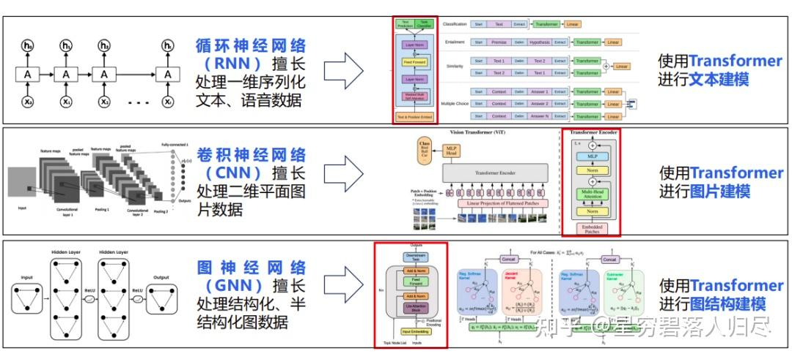
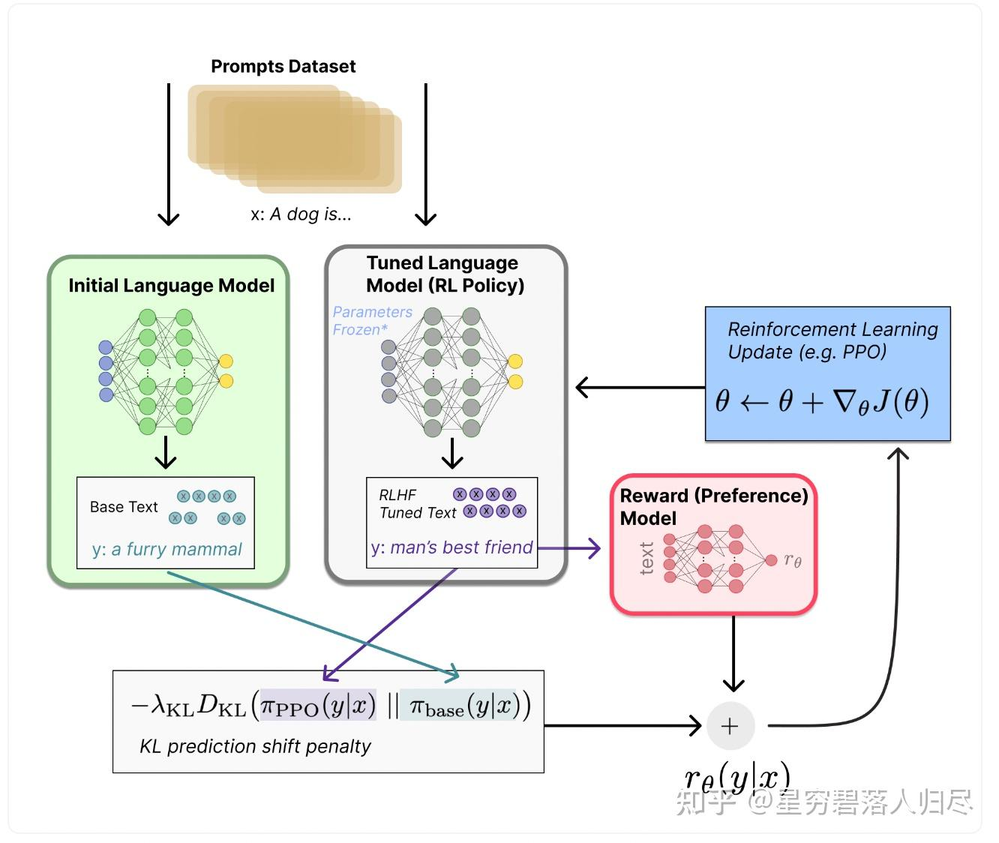

###### datetime:2025/10/20 11:24

###### author:nzb

# 机器人基础知识学习笔记---大模型篇

## 1.引言

人类神经系统的工作原理可以类比为双核处理器系统：大脑皮层作为高级认知中心，负责需要复杂运算的"慢思考"任务（如逻辑推理、语言处理、情感分析等）；小脑则承担着即时响应的"快思考"功能，专门处理需要毫秒级响应的运动控制（如平衡调节、肌肉协调等）。现代人工智能技术正在用不同方式优化这两个"系统"：对于大脑的智能升级，科学家采用"具身智能"技术——通过让AI模型在虚拟环境中模拟人体感知，就像给计算机建立虚拟感官系统，使其能更自然地理解物理世界。而提升运动能力的"小脑系统"，目前主要依靠精密算法对已有运动模式进行迭代优化，就像人类通过反复训练形成肌肉记忆。这两个系统既独立发展又协同工作，最终目标是让人工智能既能像哲学家般深度思考，又能像运动员般敏捷行动。


大模型（Large Language Model）作为实现具身智能从感知到决策闭环的核心驱动力，深度贯穿了从环境理解到策略生成的全流程。它不仅需要融合视觉、文本及环境反馈等多模态数据资源，更要求系统具备实时推理与自适应优化能力，以应对动态场景中的复杂任务。在金融交易系统中，基于大模型的风险预测平台通过毫秒级数据分析完成高频交易决策；在教育场景中，智能学习伙伴需根据用户语音与文本输入实现知识推送与思维引导的无缝衔接；而在自动驾驶领域，决策系统必须在厘米级精度下完成路径规划与障碍规避。大模型的应用效能取决于语义解析的深度、算法推理的时效性以及人机交互界面的自然流畅性。本文将聚焦大模型在具身智能中的语义融合框架、动态推理策略、跨领域迁移机制，探讨其技术实现路径、分类特征以及未来发展趋势。


## 2.大模型基本原理

大模型，如 GPT-4、CLIP 等，是指那些拥有大量参数（通常在数十亿甚至上千亿级别）的深度学习模型。这些模型通过在大规模数据上进行无监督或弱监督学习，能够捕捉复杂的数据模式和特征，从而在众多自然语言处理（NLP）和计算机视觉等任务上表现出色。如在自然语言处理方面，大模型可以用于文本生成、机器翻译、问答系统等。例如，ChatGPT 可以生成连贯、有意义的对话内容，帮助用户解决问题；在计算机视觉领域，大模型能够进行图像识别、目标检测、图像分割等任务。比如，一些用于医疗影像的模型可以准确地识别出 X 光片中的病变部位。

### 2.1 核心逻辑

大模型（Large Language Models, LLMs）的核心原理建立在深度学习基础上，通过海量数据训练超大规模神经网络，实现对自然语言的理解、生成和推理。其基于的理论是霍普菲尔德网络（联想记忆）与 `Transformer` 的自注意力机制结合，实现长距离依赖建模，以及神经符号系统假说，即通过大规模参数存储隐性知识，替代传统符号 AI 的显式规则。其核心原理可概括为：

#### 2.1.1 统计语言的建模

通过学习海量文本数据中的概率分布，预测下一个 token（字 / 词）的出现概率，例如 GPT 系列模型。

- **自回归生成（Autoregressive, AR）**：如 GPT 系列，将语言建模为条件概率分布，通过前一时刻的输出预测下一 token（如 “今天天气很”→“晴朗”）；
- **自编码表征（Autoencoding, AE）**：如 BERT，通过掩码部分 token 让模型预测缺失内容，学习上下文语义关联（如 “[MASK] 天气很晴朗”→“今天”）。

#### 2.1.2 分布式表示

将词语映射为高维向量（词嵌入），使语义相近的词汇在向量空间中距离更近，如 BERT 的 WordPiece 嵌入。

#### 2.1.3 规模化拓展效应

随着模型参数（如 GPT-4 达万亿级）和训练数据量的增加，模型会涌现出上下文理解、逻辑推理、知识泛化等新兴能力。

- **参数规模与能力涌现**：大模型参数数量从数十亿（如 GPT-3：1750 亿）到数万亿（如 PaLM 2：5400 亿），参数规模的扩大使其具备处理复杂语义、逻辑推理和知识泛化的能力。
- **预训练 - 微调范式**：
- **预训练阶段**：在无标注海量文本数据上学习通用语言表征（如掩码语言模型、自回归生成）。
- **微调阶段**：针对特定任务（如问答、翻译）用少量标注数据优化模型，实现 “通用能力 + 领域适配”。

#### 2.1.4 长距离依赖与并行计算

传统循环神经网络（RNN）处理长文本时存在梯度消失和串行计算瓶颈，而大模型基于 Transformer 架构，通过注意力机制实现：

**长距离依赖建模**：直接计算序列中任意两个位置的关联，避免信息衰减。
**并行计算**：一次性处理整个序列，大幅提升训练效率（如 GPT-4 训练需数千块 GPU 并行计算数月）。


### 2.2 架构设计

Transformer 架构是大模型的基础，其设计突破了传统序列模型的局限。

#### 2.2.1 Transformer 基础架构

Transformer 由编码器（Encoder）和解码器（Decoder）组成，两者结构类似但功能不同：

| 组件 | Encoder（如 BERT） | Decoder（如 GPT） | 
| ----- | ----- | ----- | 
| 核心功能 | 提取输入序列的语义表征（双向注意力） | 基于输入表征生成输出序列（单向因果注意力） | 
| 注意力类型 | 自注意力（Self-Attention）+ 层间连接 | 自注意力（带掩码，防止看到未来 token）+ 交叉注意力（Cross-Attention，可选） | 
| 应用场景 | 文本理解（分类、问答） | 文本生成（对话、创作） | 

现代大模型几乎都基于 Transformer 架构，即为编码器 - 解码器结构。




| 组件 | 功能 | 代表模型 | 
| ----- | ----- | ----- | 
| 仅编码器（Encoder-only） | 双向处理输入文本，适合理解任务 | BERT、RoBERTa | 
| 仅解码器（Decoder-only） | 自回归生成文本，适合生成任务 | GPT 系列、Llama | 
| 编码器 - 解码器（Encoder-Decoder） | 处理序列到序列任务 | T5、BART | 


#### 2.2.2 核心模块详解

以 Encoder 为例，每个层包含四大组件：

- **1.多头自注意力（Multi-Head Attention）**
  - **作用**：将输入拆分为多个子空间并行计算注意力，增强模型捕捉不同语义关系的能力，让模型从不同 “视角” 捕捉序列中的语义关联（如语法结构、实体关系）。
  - **实现**：将输入拆分为多个子空间（如 8 头），每个头独立计算注意力，再拼接结果。

- **2.前馈神经网络（Feed Forward Network, FFN）**
  - **结构**：由两层线性变换组成，引入非线性激活函数（如 GELU），主要结构由两层线性变换 + ReLU 激活函数组成（FFN(x)=max(0,xW1​+b1​)W2​+b2​）。
  - **作用**：对注意力输出进行非线性变换，增强模型表达能力。

- **3.残差连接（Residual Connection）**
  - **公式**： $$ LayerNorm(x + Attention(x)) $$ 。
  - **作用**：解决深层网络训练中的梯度消失问题，让信息直接跨层流动。

- **4.层归一化（Layer Normalization）**
  - **作用**：稳定训练过程，解决梯度消失问题
  - **与 Batch Normalization 区别**：对单个样本的所有维度归一化（而非批量样本的同一维度），更适合变长序列（如文本）。


#### 2.2.3 主流大模型架构变体


| 模型 | 架构特点 | 典型应用 | 
| ----- | ----- | ----- | 
| BERT | Encoder-only，双向注意力 | 文本理解、特征提取 | 
| GPT | Decoder-only，单向因果注意力 | 文本生成、对话系统 | 
| T5 | Encoder-Decoder，支持双向 + 交叉注意力 | 多任务统一建模（翻译、摘要） | 
| PaLM | Decoder-only，并行高效架构 | 复杂推理、代码生成 | 


### 2.3 注意力机制

注意力机制是 Transformer 的 “灵魂”，其本质是一种 “动态加权” 方法，让模型聚焦于输入序列中的关键信息。

#### 2.3.1 自注意力（Self-Attention）的数学原理

自注意力机制通过计算输入序列中每个 token 与其他所有 token 的关联度，赋予关键信息更高权重，数学表达为：

$$ Attention(Q,K,V) = softmax(dkQKT)V $$

- **Q（查询向量）**：当前 token 的特征表示，用于查询其他 token 的相关性；
- **K（键向量）**：其他 token 的特征表示，作为被查询的 "键"；
- **V（值向量）**：其他 token 的特征值，用于聚合信息。

这个过程可以类比图书馆查书：Q 是 “查询需求”，K 是 “书籍索引”，V 是 “书籍内容”。模型通过 Q 与 K 的匹配度（分数），从 V 中提取最相关的信息。

对于输入序列 $$ x = [x1,x2,...,xn] $$ ，自注意力机制的计算步骤如下：

QKV 矩阵生成：将每个 token 的嵌入向量 xi​ 映射为三个向量，公式为

$$ Q = xWQ, K = xWK, V = xWV $$

其中 $$ WQ, WK, WV $$  是可学习参数矩阵。

注意力分数计算：计算每个 token i 与所有 token j 的关联分数,公式变形：

$$ Attention(Q,K,V) = softmax(dkQKT)Vdk$$

其中， $$dk$$ 为缩放因子，避免点积结果过大导致 `softmax` 梯度消失；`softmax` 确保分数和为 1，表征 “注意力权重”。

#### 2.3.2 多头注意力（Multi-Head Attention）

- **核心思想**：将 Q、K、V 拆分为多个子空间（头），每个头独立计算注意力，再拼接结果。
- **公式**： $$ MultiHead(Q,K,V) = \text{Concat}(head_1, ..., Head_h)WO $$
- 其中 $$ head_i = Attention(QW_iQ, KW_iK, VW_iV) $$ 。
- **作用**：不同头可捕捉不同类型的语义关系（如语法头关注动词 - 宾语结构，实体头关注人名 - 地名关联）。

#### 2.3.3 注意力机制的关键优势

- **长距离依赖建模**：直接计算任意位置的关联，解决 RNN 的 “记忆瓶颈”（如理解 “前文中的代词指涉”）。
- **并行计算效率**：所有 token 的注意力分数可同时计算，而非像 RNN 逐个处理。
- **可解释性**：注意力权重可可视化，直观展示模型关注的关键信息（如翻译时源语言与目标语言的对齐关系）。

#### 2.3.4 注意力机制的变体

- **因果注意力（Causal Attention）**：用于 Decoder 生成时，通过掩码（Mask）禁止模型关注未来 token（如生成 “abc” 时，生成 b 时不能看到 c），确保自回归的合理性。
- **交叉注意力（Cross-Attention）**：在 Encoder-Decoder 架构中，Decoder 通过 Cross-Attention 关注 Encoder 的输出（如机器翻译中，目标语言生成时关注源语言的语义表征）。
- **稀疏注意力**：如 Longformer 通过滑动窗口限制注意力范围，解决长序列计算瓶颈

#### 2.3.5 总结

大模型的强大能力源于三大支柱：

- **Transformer 架构**：通过注意力机制突破序列建模的效率与长距离依赖瓶颈；
- **规模化训练**：海量数据与超大规模参数推动 “智能涌现”；
- **预训练 - 微调范式**：通用能力与领域适配的平衡。

## 3.训练与实现步骤

### 3.1 训练阶段和流程

#### 3.1.1 **预训练阶段**

- **1.数据收集：**爬取网页、书籍、代码等多源数据（如 GPT-3 使用 CommonCrawl）；
- **2.无监督目标函数：**
  - 掩码语言模型（MLM）：随机掩盖部分 token，预测原词（BERT），如 BERT 在维基百科上预训练时，采用 [MASK] 标记替换 15% 单词，优化交叉熵损失；
  - 自回归语言模型（AR）：根据前文预测下一个 token（GPT），适用于生成任务，目标函数：最大化对数似然概率： $$ L = -\sum_{}t =1T \log P(xt|x1,...,xt-1) $$ ；
  - 自编码语言模型（AE）：结合两者（T5）。
- **3.分布式训练**：使用数据并行（多 GPU 划分数据）和模型并行（分层划分模型）加速训练。

#### 3.1.2 微调阶段

- **监督微调（SFT）**：用标注数据（如问答对）微调预训练模型，用交叉熵损失优化模型；
- **提示工程（Prompt Engineering）**：通过设计输入提示引导模型输出，将多种任务（问答、翻译、摘要）统一为「指令 - 回答」格式，提升模型泛化能力，如 "请用三段话解释量子计算"；
- **参数高效微调**：如 LoRA（低秩适应）冻结预训练参数，仅更新少量矩阵，降低微调成本。

### 3.2 强化学习微调技术（RLHF）

#### 3.2.1 核心背景与目标

RLHF 是目前最主流的大模型强化学习微调方案，由 OpenAI 在 ChatGPT 中首次大规模应用大模型预训练（如 GPT、LLaMA）。大模型虽具备强大的语言理解能力，但直接输出可能存在：

- **对齐性问题**：生成内容与人类意图、价值观不符（如有害信息、错误价值观）；
- **实用性不足**：缺乏特定场景下的交互逻辑（如对话连贯性、任务完成度）。

**强化学习微调（Reinforcement Learning Fine-tuning）**的核心目标，是通过模拟人类反馈信号，引导模型学会「符合人类偏好的输出策略」。其本质是将「人类主观偏好」转化为「可计算的奖励信号」，再通过强化学习算法优化模型参数。RLHF是大模型对齐人类偏好的关键技术，主要流程就是先进行奖励模型（RM）训练，由人类标注员对模型的多个输出进行排序，然后用排序数据训练 RM，预测哪个输出更符合人类预期。接下来就是进行策略梯度优化，在最大化奖励的同时，最小化与预训练策略的差异。一般主要使用 PPO（近端策略优化）算法，以 RM 的评分作为奖励信号，如ChatGPT 通过 RLHF 减少有害回答，提升回答的相关性和可读性。



### 3.3 RLHF经典技术框架

RLHF技术主要流程可拆解为四个关键阶段：

#### 3.3.1 阶段一：预训练模型 + 监督微调（SFT）

- **预训练模型**：基于海量无标注数据（如网页、书籍）训练的基础大模型（如 GPT-4）。
- **监督微调**：
  - **数据收集**：人类标注者针对特定 prompt 生成「示范回答」（如针对 “如何保护环境？” 提供结构化回答）；
  - **模型训练**：用监督学习（交叉熵损失）让模型模仿人类示范，初步对齐基础能力。

#### 3.3.2 阶段二：奖励模型（Reward Model, RM）训练，即构建一个能预测【人类对回答偏好】的模型。

- 主要的技术细节：
  - **数据收集**：标注者对同一 prompt 的多个回答（可能来自 SFT 模型或随机采样）进行排序，如 “回答 A 比回答 B 更合理”；
  - **模型架构**：通常使用预训练大模型的轻量级副本，输入为【prompt + 回答】，输出为奖励分数；
  - **训练方法**：通过排序损失（如 pairwise ranking loss）让 RM 学会拟合人类偏好，例如：若人类认为回答 A 优于回答 B，则训练 RM 使 A 的奖励分数 > B 的分数。

#### 3.3.3 阶段三：强化学习微调（RL Fine-tuning），其核心逻辑为将大模型视为「策略网络 π」，通过与环境交互（生成回答并获取奖励）优化参数。其关键组件为：

- **环境**：由奖励模型 RM 和用户 prompt 构成，模型生成回答后，RM 给出奖励分数；
- **策略网络**：即大模型本身，输入 prompt，输出 token 序列的概率分布；
- **强化学习算法**：主流使用**PPO（Proximal Policy Optimization）**，相比传统 RL 算法（如 TRPO）更易实现，无需重要性采样修正，且能够有效减少计算量，适合大模型训练。

注：PPO 在大模型中的应用流程为：

- 1.策略网络πθ生成回答序列： $$\pi \theta (response|prompt)$$；
- 2.奖励模型RM计算奖励： $$r = RM(prompt, response)$$ ；
- 3.计算优势函数 $$A(s,a) = r - 基线（如历史平均奖励）$$；
- 4.优化目标：最大化 $$\sum A(s,a) \cdot \log \pi \theta (response|prompt)$$；
- 5.约束条件：新旧策略差异不超过ε（如KL散度限制）。

#### 3.3.4 阶段四：迭代优化与人类反馈闭环

- **持续改进**：通过多轮 RLHF 迭代，不断收集新的人类反馈数据，更新奖励模型和策略网络；
- **典型案例**：ChatGPT 的 RLHF 流程中，标注者不仅排序回答，还会直接提供【修改建议】或【拒绝生成有害内容】，形成动态优化闭环。

### 3.4 技术关键点

- **奖励模型的设计难点**：人类偏好的模糊性便是一个显著的难题。例如，“幽默”和“专业”这类主观标准难以量化，这可能导致奖励模型出现偏差。为了解决这一问题，可以采用多维度评分的方法，将偏好拆解为“准确性”“相关性”“安全性”等可量化指标，这样可以更细致地评估模型的输出。此外，引入群体智慧也是一个有效的策略，通过多名标注者投票，能够减少个体偏好带来的偏差，使奖励信号更加稳定和可靠。

- **强化学习训练的稳定性**：模型的稳定性是一个关键问题。当模型参数规模庞大，达到万亿级别时，训练过程中很容易出现策略崩溃的情况，模型可能会输出无意义的内容。为了应对这一挑战，研究者们提出了一系列关键技术。在PPO（近端策略优化）算法中，加入KL散度正则化约束，可以有效防止参数更新幅度过大，从而避免模型行为发生剧烈变化。同时，通过调整温度系数来控制softmax函数的输出随机性，能够使模型在探索和利用之间取得平衡，避免陷入局部最优。

- **数据效率与可扩展性**：RLHF（基于人类反馈的强化学习）面临着需要大量人类标注数据的挑战，通常需要数万至数十万条偏好对比数据，这无疑增加了成本。为了解决这个问题，可以探索无监督奖励模型的方法，尝试用自监督信号，如语言模型的困惑度，来替代部分人工标注，以此降低成本并提高数据利用效率。此外，参数高效微调也是一个有前景的方向，结合LoRA（低秩适应）等技术，在微调过程中仅更新少量参数，便可以完成RLHF，从而实现模型的高效训练和优化。

### 3.5 高效训练技术

#### 3.5.1 分布式训练架构

- 数据并行：将数据分批发送到不同 GPU，同步更新梯度（如 PyTorch DDP）；
- 模型并行：将模型分层放在不同 GPU（如 Transformer 层拆分），适合超大模型（>100B 参数）；
- 张量并行：将矩阵乘法拆分到多个 GPU，提升计算效率（如 Megatron-LM 方案）。

#### 3.5.2 优化算法改进

在优化算法改进方面，AdamW在Adam算法的基础上引入了权重衰减机制，有效缓解了过拟合问题，尤其在处理复杂模型时表现出色。随机权重平均（SWD）通过在多轮迭代中对参数取平均值，增强了模型的泛化能力，使模型在不同数据分布下表现更加稳定。梯度累积技术则允许在小批量数据上进行多次前向和反向传播后再更新参数，从而模拟大批次训练的效果，降低了对硬件资源的需求。

#### 3.5.3混合精度训练

混合精度训练是另一种提升效率的关键技术，通过使用FP16（半精度）或BF16（脑浮点数）替代传统的FP32精度，显存占用可减少一半，而精度损失几乎可以忽略不计。这一技术在保持模型性能的同时，显著加速了训练过程。常用的工具如NVIDIA Apex和PyTorch AMP能够自动管理精度转换，简化了混合精度训练的实现过程，使其成为现代深度学习训练中的标准配置。这些技术的结合，使得训练超大规模模型成为可能，并在保持模型性能的同时大幅降低了资源消耗和训练时间。

### 3.6 经典应用案例

- 1.**ChatGPT 的 RLHF 实践**：奖励模型输入包含【prompt + 回答 + 标注者反馈】，输出 0-1 分奖励；其强化学习阶段使用 PPO 算法，结合【拒绝采样】机制过滤有害输出。
- 2.**Anthropic 的宪法强化学习（Constitutional RL）**：其创新点在于无需直接人类偏好排序，通过【规则说明书】（如 “禁止歧视”）生成奖励信号；其大致流程为用规则自动评估回答合规性，转化为奖励分数，减少人工标注依赖。
- 3.**DeepMind 的 REINFORCE 算法应用**：在早期大模型微调中尝试传统 RL 算法（如 REINFORCE），但因梯度方差大被 PPO 替代。

### 3.7 总结

强化学习微调大模型的本质，是将【人类价值观】编码为【可计算的奖励函数】，通过算法让模型学会【在不确定环境中最大化人类偏好】。其核心突破在于：

- 从【被动模仿】到【主动优化】：相比监督学习，RLHF 让模型具备【目标导向】的决策能力；
- 从【静态规则】到【动态对齐】：通过持续接收人类反馈，模型可适应不断变化的社会规范与应用场景。

大模型的成功遵循
- 【数据质量 > 数据规模】【训练策略 > 模型架构】的原则
- 在数据层面需要平衡**多样性（覆盖多领域）、准确性（无偏见标注）、结构性（适合任务需求）**
- 在训练层面需要**预训练解决通用能力**，**微调解决领域适配**，**高效技术解决成本瓶颈**。


## 4.经典数据集与训练方案

### 4.1 经典数据集分类与核心特性

以下列出了当前比较有代表性的数据集：

| 数据集 | 特点 | 应用场景 | 
| ------ | ------ | ------ | 
| BooksCorpus | 7000 本未出版书籍，长文本连贯 | GPT-2 预训练 | 
| Wikipedia | 结构化百科知识，准确率高 | 知识增强 | 
| Common Crawl | 网页爬虫数据，含大量自然语言 | 通用大模型训练 | 
| CodeXGLUE | 多语言代码数据集，编程模型训练 | CodeGPT 等代码生成模型 | 

大模型数据集的设计遵循【覆盖广度 + 领域深度】原则，按数据类型可分为以下几类：

- **通用文本语料库**：一般用以构建大模型对基本语言的理解基础，比较有代表性的如下所示：

| 数据集名称 | 数据规模 | 核心特点 | 典型应用场景 |
| ------ | ------ | ------ | ------ |
| Common Crawl | 万亿级 token | 全网网页爬取数据，含多种语言、多领域内容，但噪声较高（广告、重复内容） | GPT 系列、LLaMA 等基础预训练 |
| 维基百科 | 数百亿 token | 结构化知识文本，涵盖百科条目、概念定义，语言规范但内容偏正式 | 知识增强型模型 |
| Books3 | 千亿级 token | 开源书籍语料，长文本特性突出，适合训练长上下文理解能力 | GPT-3、PaLM 等大模型 |
| CC-News | 数百亿 token | 新闻文章集合，时效性强，含丰富事件描述和结构化信息 | 事件理解、摘要生成任务 |

经典案例如，GPT-3 的训练数据组合主要包含：Common Crawl（60%）、BooksCorpus（22%）、维基百科（3%）、其他专业语料（15%）。通过混合网页数据的多样性和书籍数据的长文本连贯性，平衡模型泛化能力与深度理解。

- **代码语料库**：能够增强其在编程与逻辑推理方面的能力，但代码数据一般需进行特殊预处理，如保留语法结构、函数命名规范，部分模型（如 AlphaCode）还会引入「算法复杂度」标签。经典数据集如下：
  - **BigCode-15B**：含 150 亿行代码，覆盖 Python、Java 等 20 余种编程语言，来自 GitHub 开源项目；
  - **CodeX**：OpenAI 构建的代码数据集，通过筛选高星 GitHub 仓库 + 自然语言注释对齐，用于 CodeGPT 等模型；
  - **HumanEval**：人工编写的编程问题数据集，含 164 个编程任务，用于评估模型代码生成的正确性。

- **多模态数据集**：如文本、图像、视频等多种不同类型信息集合的数据集，如：

| 类型 | 数据集名称 | 数据规模 | 核心能力 |
| ------ | ------ | ------ | ------ |
| 图文对 | COCO | 120 万图像 | 图像标注（物体检测、语义分割）+ 文本描述，用于 VQA、图像生成模型 |
| 图文对 | Conceptual Captions | 330 万图文对 | 从互联网图像 + ALT 文本提取，语言多样性高，适合多模态对齐 |
| 视频 - 文本 | HowTo100M | 1.2 亿视频片段 | 短视频 + 语音转文本，用于视频理解、生成脚本等任务 |
| 3D 场景 | Replica Dataset | 37 个室内场景 | 三维重建数据 + 语义标注，支持具身智能模型（如机器人导航） |

- **高质量指令-回答对**：这些就是完成大模型回答精准度的关键内容，一般用以微调核心数据。如：
  - **Stanford Alpaca**：通过 GPT-4 生成的 5.2 万条指令 - 回答对，覆盖问答、推理、创作等场景；
  - **Dolly 15K**：Databricks 构建的人工标注数据集，含 1.5 万条专业领域（如医疗、法律）指令；
  - **Anthropic HH-RLHF**：含 15 万条人类偏好排序数据，用于训练奖励模型，典型于 Claude 系列。


### 4.2 数据预处理

数据预处理看似繁琐，却是大模型训练中性价比最高的环节。高质量预处理可减少训练迭代次数（如清洗后收敛速度提升 30%）、降低过拟合风险，并显著改善模型在边缘场景的表现。随着模型规模向万亿参数发展，预处理技术也在向自动化（如 AutoML 驱动的数据清洗）、智能化（如基于模型反馈优化预处理策略）方向演进。大模型训练数据通常具备 “海量、多源、异构” 特点（如万亿级 token），预处理直接决定：

- 模型收敛速度与训练稳定性（如数据噪声会导致梯度震荡）
- 泛化能力（数据多样性不足会导致过拟合）
- 计算效率（如分词粒度影响内存占用）

也即直接影响模型性能，其核心流程包括：

#### 4.2.1 清洗与去重

- 噪声过滤：移除 HTML 标签、广告文本、乱码，使用正则表达式或 NLP 工具（如 spaCy）；
- 重复数据识别：通过 MinHash 算法检测重复文档，避免模型过拟合相似内容；
- 语言检测：过滤非目标语言数据；
- 敏感信息脱敏：删除隐私数据（如邮箱、身份证号）。

#### 4.2.2 分词与向量化

- **词级分词（Word-based）**：如英语分词为单词，但低频词处理差；
- **字符级分词（Character-based）**：如中文拆分为字，保留所有信息但序列变长；
- **子词分词（Subword-based）**：平衡词汇量和语义，如 BPE（字节对编码）。

主流分词器比如BPE（Byte Pair Encoding），能够平衡词汇表大小与稀有词处理，GPT、LLaMA模型在使用；再比如基于概率合并子词的WordPiece，被Google 系模型（如 BERT）采用。

#### 4.2.3 数据增强与结构化

- 长文本处理：将超长文档切分为固定长度片段（如 512/2048 token），重叠部分保留上下文；
- 多模态对齐：图像 - 文本对通过 CLIP 等模型提取特征，生成联合嵌入向量；
- 时序数据处理：视频帧按固定帧率采样，音频转梅尔频谱图后与文本对齐。


### 4.3 数据预处理全流程

#### 4.3.1 数据收集与筛选

| 分类类型 | 具体内容 |
| ----- | ----- |
| 来源分类 | 公开数据集：如 Common Crawl（网页）、ImageNet（图像）、LibriSpeech（语音）|
|  | 私有数据：企业日志、用户对话记录、专业文档（需合规处理） |
| 筛选标准 | 相关性：与任务匹配（如代码大模型需优先收集 GitHub 项目） |
|  | 时效性：避免过时数据（如 2020 年前的新闻对实时问答任务价值低） |
|  | 多样性：覆盖不同领域、语言、风格（如跨语种大模型需平衡各语言数据量） |


#### 4.3.2 数据清洗

| 数据类型 | 清洗操作 |
| ----- | ----- |
| 文本数据清洗 | 去除无效字符：HTML 标签、特殊符号（如 @#$%）、乱码（\x00） |
|  | 过滤低质量内容：广告文本、重复段落（如 “点击这里” 类垃圾信息） |
|  | 处理缺失值：删除空行或填充默认标记（如 [MISSING]） |
| 图像数据清洗 | 剔除模糊、尺寸异常的图片（如分辨率 < 100×100） |
|  | 修正标注错误（如物体框坐标超出图像边界） |

#### 4.3.3 分词与 Tokenization

| 分类类型 | 具体内容 |
| ----- | ----- |
| 分词策略 | 英文：基于空格 + 标点分割（如 "hello world"→["hello", "world"]） |
|  | 中文：需分词工具（如 jieba、THULAC），例："我爱自然语言处理"→["我", "爱", "自然", "语言", "处理"] |
|  | 跨语言：使用 BPE（Byte Pair Encoding）混合策略，例：原始词："loving"、"loved"BPE 合并："lov" + "ing" → "loving"，"lov" + "ed" → "loved" |
| 大模型特化 Tokenization | 添加特殊 token：[CLS]（分类任务起始）、[SEP]（句子分隔）、[PAD]（填充长度） |
|  | 字节级处理：如 GPT-4 使用的 GPT-2 Tokenizer，可处理未知字符（如表情符号） |
| 工具库 | Hugging Face tokenizers（高性能分词库，支持 BPE、WordPiece） |
|  | SentencePiece（Google 开源工具，常用于多语言模型） |

#### 4.3.4 数据增强

| 数据类型 | 增强方法 | 详细说明 |
| ------ | ------ | ------ |
| 文本增强方法 | 回译 | 将句子翻译成其他语言再译回，增加句式变化（如 "我爱 AI"→英文→"I love AI"→中文→"我喜爱人工智能"） |
| |  | 掩码（Masking） |  | 随机替换部分词汇为 [MASK]，用于预训练任务（如 BERT 的 MLM） | |
| |  | 同义词替换 |  | 基于词向量找近义词（如 "快乐"→"高兴"） | |
| 图像增强方法 | 基础操作 | 旋转、翻转、缩放、添加噪声（如高斯模糊） |
| 多模态增强方法 | 文本 - 图像对齐 | 随机替换图像描述中的部分词汇，保持语义一致性 |

#### 4.3.5 数据分块与长文本处理

`Transformer` 模型受限于注意力机制计算复杂度（O (n²)），通常输入长度限制在 512-4096token，要所以就需要对长文本进行处理并数据进行分块，如：

| 处理技术 | 核心原理 | 具体示例 | 应用场景 |
| ------ | ------ | ------ | ------ |
| 滑动窗口 | 将长文本按固定窗口大小分割为重叠片段，通过重叠部分保持上下文连续性 | 原文：ABCDEFGHIJK（长度 11） <br>窗口 1：ABCDEFGH（1-8）<br>窗口 2：EFGHIJK（5-11） | 常规长度文本分块（如 LLM 输入限制） |
| 分块 + 全局索引 | 对超长文本先按逻辑结构（章节、段落）分层切分，同时记录全局位置关联信息 | 书籍处理：先分章节，再按段落切分 <br>索引示例：Book1_Chapter2_Paragraph5 | 大规模文档（如书籍、知识库） |
| 特殊编码（Longformer） | 通过改进注意力机制，使模型能高效处理长序列，保留关键位置的全局注意力 | 滑动窗口注意力：仅计算窗口内局部注意力，对特殊位置（如 CLS）添加全局注意力 | 超长文本建模（如文档理解、摘要） |

#### 4.3.6 格式标准化与批处理优化

- **统一数据格式**：比如将文本统一转为 JSONL 格式（每行一个样本，含{"text": "...", "label": "..."}）；或者统一图像的尺寸（如 224×224）和色彩空间（RGB）。
- **批处理优化**：同批次内样本填充至最大长度，减少内存浪费，并将数据转为 float16/int8 格式，降低显存占用。
- **分布式预处理**：常用的工具如Dask（处理海量文本）、Spark（分布式数据清洗）。


#### 4.3.7 数据集划分与缓存

- **训练/验证/测试集划分**：常用比例一般为：8:1:1（训练集 80%，验证集 10%，测试集 10%），然后进行分层抽样，按类别比例划分（如情感分析中正负样本均衡）。
- **数据缓存**：将预处理后的数据保存为二进制格式（如 HDF5、TFRecord），避免重复计算。示例代码（使用 Hugging Face Dataset）：

```python
from datasets import Dataset  # 预处理后的数据 
data = [{"text": "hello", "label": 0}, {"text": "world", "label": 1}] 
dataset = Dataset.from_list(data) 
dataset.save_to_disk("./processed_data") # 缓存为二进制文件
```


**典型挑战**

- **数据规模**：处理 TB 级非结构化数据（如网页文本、图像标注）；
- **质量问题**：含噪声（广告、乱码）、重复数据、格式不统一；
- **多模态融合**：文本、图像、音频的特征对齐难题；
- **隐私保护**：敏感信息（如身份证号）需脱敏处理；

### 4.4 预处理的解决方案

| 挑战类型 | 具体问题 | 解决方案 | 
| ----- | ----- | ----- | 
| 多语言一致性 | 不同语言分词规则差异（如中文需分词，英文按空格） | 使用统一的 Subword 分词（如 BPE），或为每种语言训练独立分词器 | 
| 隐私保护 | 数据含敏感信息（如姓名、身份证号） | 正则替换（如\d{18}→[ID_MASK]）、差分隐私技术（添加噪声） | 
| 长文本语义断裂 | 分块导致上下文信息丢失 | 使用重叠窗口、添加段落级索引，或训练支持长序列的模型（如 Transformer-XL） | 
| 数据不平衡 | 某类数据占比过高（如 90% 正样本） | 过采样（复制少数类）、欠采样（丢弃多数类）、生成式增强（如 SMOTE） | 

## 5.思维链（Chain of Thought, CoT）

思维链是一种让大语言模型通过生成中间推理步骤（即 “思考过程”）来解决复杂问题的技术。模型不再直接给出答案，而是先逐步分析问题，再推导出结论，类似人类解决问题时的 “打草稿” 过程。2022 年，Google 研究团队在论文《Chain of Thought Prompting Elicits Reasoning in Large Language Models》中首次提出 CoT 概念，发现通过提示模型生成中间推理步骤，可显著提升复杂问题（如数学推理、常识问答）的解决能力，大模型在参数规模达到一定程度（如 1000 亿参数以上）后，通过 CoT 提示能激发其潜在的推理能力。

### 5.1 核心原理

#### 传统模型 vs. CoT 模型的差异

- **传统模型**：输入问题后直接输出答案，缺乏可解释性，对复杂问题易出错（如多步数学计算、逻辑嵌套问题）。
- **CoT 模型**：输入问题 → 生成中间推理步骤（如分解问题、推导过程）→ 基于推理链输出答案，提升准确性和可解释性。

#### 为什么 CoT 能提升模型能力？

- **分解复杂性**：将复杂问题拆解为多个简单子问题，降低模型一次性解决问题的难度。
- **模拟人类思维**：人类解决复杂问题时通常分步思考，CoT 让模型学习这种思维模式，符合认知规律。
- **错误定位与修正**：中间步骤可暴露模型推理中的错误，便于后续优化（如通过微调修正偏差）。

### 5.2 核心思想

思维链的核心思想是让模型在回答问题前先生成中间推理步骤。如在提示词给出示例，提供包含推理步骤的样例，比如提18×5+3=？ 思考的过程中会推18×5=90，90+3=93，然后给出答案为93。或者直接零样本提示，比如通过 "请逐步思考" 等指令触发推理。目前来看，CoT能够显著提升数学推理、常识问答等任务的准确率，且该过程能够暴露模型的决策过程，提升其可解释性，因此小模型也能够通过 CoT 提示逼近大模型性能。CoT方法的进阶技术包括采用自我询问（Self-Questioning）方法，让模型通过提问引导自己思考，思考过程也可采用树状思考（Tree of Thought）从而生成多个推理路径并选择最优解。

### 5.3 优势与挑战

- **优势**

| 优势类型 | 具体表现 |
| ----- | ----- | 
| 准确率提升 | 在数学推理任务中，CoT 可使 GPT-3 等模型的准确率提升 40%~80%（如 GSM8K 数据集上从 10% 提升至 50%+） |
| 可解释性增强 | 中间推理步骤让模型决策过程透明，便于人类理解和纠错 |
| 小样本学习能力 | 通过 CoT 提示，模型可在少量示例下解决复杂问题，降低数据依赖 |

- **挑战**

| 挑战类型 | 具体表现 |
| ----- | ----- |
| 计算成本增加 | 生成推理链需更多 token，导致推理速度变慢（如输入输出 token 数翻倍） |
| 推理链质量不稳定 | 模型可能生成逻辑错误或冗余的中间步骤（如 “循环论证”“错误推导”） |
| 标注成本高 | 人工编写高质量推理链耗时费力，尤其对专业领域（如医学、法律） |

### 5.4 关键数据集与工具

- 1.推理链标注数据集

| 数据集名称 | 具体描述 |
| ----- | ----- |
| GSM8K | 8000 道数学应用题，含详细解题步骤 |
| MathQA | 数学问题与多步骤推理链的配对数据 |
| CoT-Science | 科学领域问题的推理链数据集（如物理、化学） |

- 2.开源工具与模型

| 工具 / 模型名称 | 发布方 / 类型 | 具体功能 |
| ----- | ----- | ----- |
| Llama 2 with CoT | Meta | 支持 CoT 推理的大模型 |
| FastChat | 开源框架 | 支持 CoT 提示工程与模型微调 |
| CoT 提示生成工具 | 工具集合 | 包含 Auto-CoT（自动生成提示示例）、Self-CoT（模型自生成推理链） |

### 5.5 发展和应用

#### Cot技术目前发展

- **自回归推理链（Self-CoT）**：模型无需人工示例，通过自我提问生成推理链（如 “问题→子问题1→子问题2→答案”）。
- **树状思维链（Tree of Thought, ToT）**：将推理链扩展为树状结构，允许模型在不同推理路径中搜索最优解（类似博弈论中的蒙特卡洛树搜索）。
- **多模态思维链**：结合图像、视频等模态，生成跨模态推理链（如看图说话时的分步描述与逻辑推断）。

思维链技术通过将大模型的 “黑盒决策” 转化为 “白盒推理”，不仅提升了模型解决复杂问题的能力，也为 AI 的可解释性迈出了重要一步。随着技术发展，未来 CoT 可能与更多领域（如科学发现、医疗诊断）结合，成为大模型实现 “类人智能” 的关键桥梁。

#### 大模型技术延伸

| 技术延伸方向 | 具体内容 |
| ----- | ----- |
| 多模态融合 | 结合图像、语音、视频等数据，如 GPT-4V、CLIP |
| 参数高效微调 | 如 QLoRA（4 位量化微调）使大模型在消费级 GPU 运行 |
| 伦理挑战 | 偏见生成、虚假信息传播、隐私泄露 |
| 可解释性瓶颈 | 万亿参数模型如同 "黑箱"，难以追溯决策依据技术延伸方向 |

通过上述技术体系，大模型正在重塑自然语言处理、代码生成、科学发现等多个领域，而持续的架构创新与训练优化将推动其向通用人工智能迈进。

#### 典型应用场景

| 应用领域 | 具体说明 | 案例 |
| ----- | ----- | ----- |
| 数学与逻辑推理 | 解决多步数学应用题（如 GSM8K 数据集）、逻辑谜题（如 Wordle 推理） | 模型通过分步计算解决几何问题：“计算半径为 5 的圆的面积，首先想到公式 S=πr²，代入 r=5，得到 25π，约 78.54。” |
| 常识与因果推理 | 回答需要背景知识推导的问题 | “为什么夏天海水比沙滩凉？”→推理 “海水比热容大，吸收热量升温慢”。代表数据集：CommonsenseQA、StrategyQA |
| 代码生成与调试 | 通过 CoT 分解编程任务 | “如何用 Python 排序列表？”→推理 “首先导入 sort 方法，然后对列表调用该方法，处理边界条件...” |
| 多语言翻译与歧义消解 | 对歧义句子通过推理链确定语义 | “bank” 在句子中的含义是 “银行” 还是 “河岸”，通过上下文推理判断 |

## 6.大模型应用--VLA

### 6.1 VLA定义

多模态智能体的核心引擎VLA（Vision-Language-Action）模型是一种融合视觉感知、语言理解与动作生成的多模态人工智能技术，旨在使智能体（如机器人、自动驾驶车辆）能够通过自然语言指令理解任务，并在物理或数字环境中执行具体动作。 其核心目标是将人类指令转化为可执行的物理操作，实现“感知-决策-执行”闭环。例如，机器人根据“请整理桌面”的指令，识别物体位置并规划抓取路径。 区别于ChatGPT等纯语言模型，VLA强调具身性（Embodiment），即智能体需与环境实时交互，处理动态变化的物理约束。

### 6.2 VLA与大模型的关系

#### 6.2.1 视觉 - 语言对齐的概念

`Vision - Language - Action（VLA）`是指将视觉信息（如图像、视频等）和语言信息（如文本描述）之间建立关联和对齐的过程。例如，在图片描述任务中，模型需要理解图片中的内容（视觉信息）并生成准确的文本描述（语言信息），这就涉及到视觉 - 语言对齐。

- **VLA 作为大模型应用的体现**：大模型为 VLA 提供了强大的能力基础。以 CLIP（Contrastive Language - Image Pre - training）模型为例，它是一种视觉-语言大模型。CLIP 通过在大规模的图像 - 文本对数据集上进行对比学习，学习到了图像和文本之间的关联。这使得 CLIP 可以对输入的图像和文本进行语义关联的判断。在实际应用中，基于这样的大模型可以实现多种功能。例如，在图像检索任务中，用户输入一段文本描述，模型可以根据 VLA 的原理找到与该描述最相关的图像。这个过程充分利用了大模型在视觉和语言两大模态上的知识整合能力，所以 VLA 是大模型技术的一种典型应用。

- **VLA 作为一种端到端方法的优势和特点**：端到端（End - to - End）方法是指将输入数据直接映射到输出结果，中间过程由模型自动学习。在 VLA 中，它将视觉和语言数据作为输入，通过一个统一的网络结构（如基于Transformer的大模型架构），直接输出视觉 - 语言对齐的结果。例如，在图像描述生成任务中，输入图像后，经过端到端的 VLA 模型处理，就能直接输出描述该图像的文字。这种端到端的方式使得模型能够在训练过程中自动学习视觉和语言特征之间的关联，避免了传统方法中需要手动设计复杂的特征提取和对齐规则的步骤。它能够很好地捕捉复杂的视觉 - 语言关系，比如在处理一些具有隐喻或者抽象描述的图像文字对齐任务时，比非端到端的方法更具优势。

- **大模型对 VLA 能力的提升基础**：大模型通常具有大量的参数，可以捕捉数据中的复杂模式。在 VLA 应用中，大模型的预训练阶段可以在海量的文本和图像数据上学习到通用的视觉和语言特征表示。例如，像 CLIP 这样的视觉 - 语言大模型，它在预训练时利用了大量的图像 - 文本对，学习了视觉和语言之间的语义关联。大模型的这种强大的表示学习能力为 VLA 提供了坚实的基础。当进行具体的 VLA 任务（如视觉问答、图像检索等）时，可以基于大模型进行微调或者直接利用其特征表示。它能够理解语言中的细微语义差别和视觉中的复杂场景细节，从而更好地完成视觉 - 语言对齐任务。

### 6.3 VLA实现方案分类

当前VLA的实现方案多样，主要分为以下几类：

#### 6.3.1 基于预训练LLM/VLM的方案

代表模型：谷歌RT-2、OpenVLA（开源）。

这类方案充分发挥了大规模语言模型的强大能力，例如借助类似 Llama 2 之类的大规模语言模型，对多模态输入进行处理，巧妙地将动作预测转化为序列生成问题，使其在泛化能力方面表现优异，能够适应多种不同场景和任务，但在实时性上稍显不足，对于需要快速响应的场景可能无法及时给出结果。

#### 6.3.2 基于扩散模型的方案

代表模型：Diffusion Policy、RDT-1B。

其核心原理是借助去噪扩散过程来生成高维连续动作，这使得它在应对复杂动作分布时具有独特优势，比如在灵巧手操作这类需要精准、复杂动作的任务中能够大展身手，然而，这种方案对计算资源的需求较高，大规模的计算任务可能限制了其在一些计算能力有限的环境中的应用。

#### 6.3.3 分层端到端方案

代表模型：灵初智能Psi R0.5、Figure AI的Helix。

其特点是将模型结构分拆为高层规划和低层控制两部分，高层规划侧重于语言理解，准确把握任务意图；低层控制则专注于动作生成，确保动作的准确执行。这种架构在泛化性和实时性之间取得了良好平衡，以 Helix 为例，它通过双系统架构，实现了 7 - 9 Hz 的决策频率以及 200 Hz 的高频控制，有效满足了实时性和准确性的双重需求

#### 6.3.4 视频生成+逆运动学方案

代表模型：UniPiRo、BoDreamer。

特点在于先利用视频生成技术创建出运动视频，再运用逆运动学原理推导出动作轨迹，这种做法显著提升了动作的可解释性，让人们能够更清晰地理解模型生成动作的依据和逻辑，便于对模型的行为进行分析和优化。

#### 6.3.5 类比补充

- LLM/VLM：像 “手机系统”，预装了各种基础功能，装 App 就能扩展用途。
- 扩散模型：像 “画家创作”，从模糊草稿逐步细化到高清作品。
- 分层端到端：像 “工厂流水线”，每个环节分工明确，但环节间需要严格配合。
- 视频 + 逆运动学：像 “导演拍电影”，先拍素材再用特效调整动作细节。

### 6.4 VLA核心模块

典型 VLA 模型架构包含以下核心模块：**多模态输入处理、跨模态融合层以及动作解码与闭环控制**。多模态输入处理模块负责接收来自不同模态的数据，如视觉、听觉、文本等多方面的信息输入，并对这些输入数据进行初步的处理和预加工，以使其能够适应后续的处理流程。在经过初步处理后，数据会流入跨模态融合层，这一层的关键任务在于将不同模态的数据有效地结合起来，打破模态之间的壁垒，实现信息的交互与互补，从而形成一份更为全面、综合且具有深度理解性的数据表示形式。而动作解码与闭环控制模块则是基于前面融合后的数据，进行动作的解码工作，将融合后得到的信息转化为具体的动作指令，并建立起闭环控制系统，以便模型能够根据实时反馈来不断调整和优化自身的行为动作，达到精准、动态且符合目标预期的执行效果

### 6.5 VLA技术瓶颈

VLA（视觉-语言-动作模型）目前的技术瓶颈主要集中在**模型效率、硬件算力、任务泛化能力**三个方面，具体如下：

- **模型效率瓶颈**：传统VLA模型（如OpenVLA）采用自回归生成动作的方式，每一步动作都依赖前一步的输出，导致推理速度仅为3-6Hz，无法满足如双臂机器人25Hz实时操作的高频控制任务。另一个问题就是数据依赖高，现有VLA模型需在大规模机器人数据集上预训练，真实场景中难以收集如此庞大的数据。
- **硬件算力限制**：目前在自动驾驶领域在车端部署较为困难，现有的VLA模型参数过于庞大，现有车载芯片（如OrinX）算力不足，无法支持实时推理。 未来新的芯片量产可能能够缓解算力问题，但成本和多片部署仍然存在问题。
- **任务泛化能力局限**：对于极端场景适应性不足 当在视角剧烈变化、物体极端位置或高精度任务中，VLA泛化能力仍弱于人类。且多任务长程推理有待验证，目前VLA虽然支持复杂任务分解，但思维链技术的实际应用尚未明确，需要依赖分层框架间接实现。
