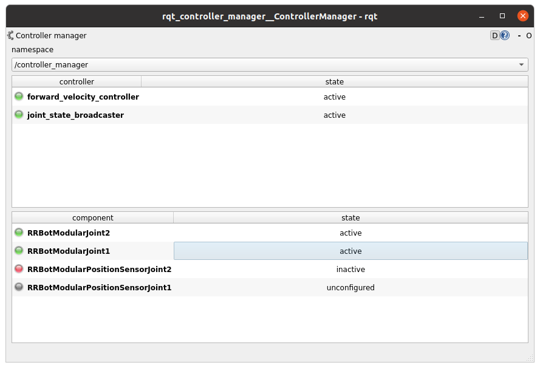
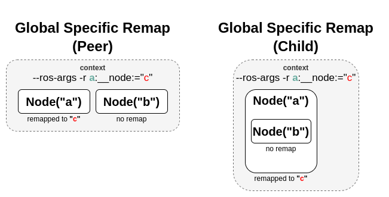

###### datetime:2025/05/07 11:01

###### author:nzb

# [控制器管理器](https://control.ros.org/humble/doc/ros2_control/controller_manager/doc/userdoc.html#controller-manager)

## 确定性

为了在控制硬件时获得最佳性能，您希望控制器管理器在主控制回路中具有尽可能少的抖动。普通的 `linux` 内核针对计算吞吐量进行了优化，因此不太适合硬件控制。两个最简单的内核选项是 `Real-time Ubuntu 22.04 LTS Beta` 或 Debian `Bullseye` 上的 `linux-image-rt-amd64`.

如果安装了实时内核，`Controller Manager` 的主线程会尝试配置优先级为 `50` 的 `SCHED_FIFO`。默认情况下，用户没有设置如此高优先级的权限。要向用户授予此类权限，请添加一个名为 `realtime` 的组，并将控制您的机器人的用户添加到此组：

```shell
$ sudo addgroup realtime
$ sudo usermod -a -G realtime $(whoami)
```

然后，将以下限制添加到 `/etc/security/limits.conf` 中的 `realtime` 组：

```shell
@realtime soft rtprio 99
@realtime soft priority 99
@realtime soft memlock unlimited
@realtime hard rtprio 99
@realtime hard priority 99
@realtime hard memlock unlimited
```

这些限制将在您注销并重新登录后应用。

## 订阅者

- **~/robot_description [std_msgs::msg::String]**：带有 `URDF xml` 的字符串，例如，来自 `robot_state_publisher` 。

> 注意: 通常，人们会将主题重新映射到 `/robot_description`，这是 `robot_state_publisher` 的默认设置。`python launchfile` 的一个示例是
> 
> ```python
> control_node = Node(
>    package="controller_manager",
>    executable="ros2_control_node",
>    parameters=[robot_controllers],
>    output="both",
>    remappings=[
>        ("~/robot_description", "/robot_description"),
>    ],
>)
> ```

## 参数

- **hardware_components_initial_state**

用于硬件组件受控生命周期管理的参数映射。组件的名称定义为 `robot_description` 中 `<ros2_control>`-tag 的属性。 在 `robot_description` 中找到但没有明确状态定义的硬件组件将立即激活。下面给出了每个参数的详细说明。以下示例给出了 `map` 的完整结构：

```yaml
hardware_components_initial_state:
  unconfigured:
    - "arm1"
    - "arm2"
  inactive:
    - "base3"
```

- **hardware_components_initial_state.unconfigured (optional; list<string>; default: empty)**：定义哪些硬件组件仅在控制器管理器启动时立即加载。
- **hardware_components_initial_state.inactive (optional; list<string>; default: empty)**：定义在启动 `Controller Manager` 时将立即配置哪些硬件组件。

> 注意：将机器人描述参数直接传递给 `control_manager` 节点的做法已被弃用。请使用 `robot_state_publisher` 中的 `~/robot_description` 主题。

- **robot_description (optional; string; deprecated)**：**已弃用**，以 URDF 字符串作为机器人描述的字符串。这通常是通过 xacro 命令解析描述文件的结果。
- **update_rate (mandatory; double)**：控制器管理器的实时更新循环的频率。此循环从硬件读取状态，更新控制器并将命令写入硬件。
- **<controller_name>.type**：使用 `pluginlib` 为控制器导出的插件的名称。这是一个类，从中创建名为 `controller_name` 的控制器实例。

## 辅助脚本

有两个脚本可从启动文件中与控制器管理器交互：
- `spawner` : 在启动时加载、配置和启动控制器。
- `unspawner` : 停止和卸载控制器。
- `hardware_spawner` : 激活和配置硬件组件。


- `spawner`：使用`ros2 run controller_manager spawner -h`查看帮助信息。

解析后的控制器配置文件可以遵循与典型的 `ROS 2` 参数文件格式相同的约定。现在，生成器可以处理带有通配符条目的配置文件，也可以处理绝对命名空间中的控制器名称。请参阅配置文件中的以下示例：

```yaml
/**:
  ros__parameters:
    type: joint_trajectory_controller/JointTrajectoryController

    command_interfaces:
      - position
      .....

position_trajectory_controller_joint1:
  ros__parameters:
    joints:
      - joint1

position_trajectory_controller_joint2:
  ros__parameters:
    joints:
      - joint2
```

```yaml
/**/position_trajectory_controller:
  ros__parameters:
    type: joint_trajectory_controller/JointTrajectoryController
    joints:
      - joint1
      - joint2

    command_interfaces:
      - position
      .....
```

```yaml
/position_trajectory_controller:
  ros__parameters:
    type: joint_trajectory_controller/JointTrajectoryController
    joints:
      - joint1
      - joint2

    command_interfaces:
      - position
      .....
```

```yaml
position_trajectory_controller:
  ros__parameters:
    type: joint_trajectory_controller/JointTrajectoryController
    joints:
      - joint1
      - joint2

    command_interfaces:
      - position
      .....
```

```yaml
/rrbot_1/position_trajectory_controller:
  ros__parameters:
    type: joint_trajectory_controller/JointTrajectoryController
    joints:
      - joint1
      - joint2

    command_interfaces:
      - position
      .....
```

- `unspawner`：使用`ros2 run controller_manager unspawner -h`查看帮助信息。
- `hardware_spawner`：使用`ros2 run controller_manager hardware_spawner -h`查看帮助信息。

## rqt_controller_manager

一个 `GUI` 工具，用于与 `controller manager` 服务交互，以便能够切换控制器和硬件组件的生命周期状态。



可以使用以下命令独立启动它，也可以将其作为 rqt 插件启动。

```shell
 ros2 run rqt_controller_manager rqt_controller_manager

* Double-click on a controller or hardware component to show the additional info.
* Right-click on a controller or hardware component to show a context menu with options for lifecycle management.
```

## 在进程中使用控制器管理器

`ControllerManager` 也可以在进程中实例化为类，但在执行此作时必须小心。这是因为 `ControllerManager` 类继承自 `rclcpp::Node`。

如果过程中有多个 `Node` ，全局节点名称重映射规则也可以强制更改 `ControllerManager` 的节点名称，从而导致节点名称重复。无论节点是同级节点还是存在于层次结构中，都会发生这种情况。


解决方法是在传递给 `ControllerManager` 节点的 `NodeOptions` 中指定另一个节点名称重映射规则（使其忽略全局规则），或确保任何重映射规则都针对特定节点。



```cpp
auto options = controller_manager::get_cm_node_options();
  options.arguments({
    "--ros-args",
    "--remap", "_target_node_name:__node:=dst_node_name",
    "--log-level", "info"});

  auto cm = std::make_shared<controller_manager::ControllerManager>(
    executor, "_target_node_name", "some_optional_namespace", options);
```

## 使用 ros2_control_node 启动 controller_manager

`controller_manager` 可以使用 `ros2_control_node` 可执行文件启动。以下示例显示如何使用 `ros2_control_node` 可执行文件启动 `controller_manager`：

```python
control_node = Node(
    package="controller_manager",
    executable="ros2_control_node",
    parameters=[robot_controllers],
    output="both",
)
```

`ros2_control_node` 可执行文件使用 `controller_manager` 节点中的以下参数：

- **lock_memory (optional; bool; default: false for a non-realtime kernel, true for a realtime kernel)**

启动时将 `controller_manager` 节点的内存锁定到物理 `RAM`，以避免页面错误并防止节点换出到磁盘。在以下链接中查找有关内存锁定设置的更多信息： 如何设置 `ulimit` 值 以下命令可用于临时设置内存锁定限制：`ulimit -l unlimited`。

- **cpu_affinity (optional; int; default: -1)**：将 `controller_manager` 节点的 `CPU` 亲合度设置为指定的 `CPU` 内核。值 `-1` 表示未设置 `CPU` 亲合度。
- **thread_priority (optional; int; default: 50)**：将 `controller_manager` 节点的线程优先级设置为指定值。该值必须介于 `0` 和 `99` 之间。
- **use_sim_time (optional; bool; default: false)**：允许在 `controller_manager` 节点中使用模拟时间。

## 概念

### 重启所有控制器

重新启动所有控制器的最简单方法是使用 `switch_controllers` 服务或 `CLI`，并将所有控制器添加到启动和停止列表。请注意，并非所有控制器都必须重新启动，例如广播公司。

### 重启硬件

如果硬件重新启动，则应再次经历其生命周期。这可以通过从接口实现的 `write` 和 `read` 方法返回 `ERROR` 来简单地实现。 **尚未实现 - 请暂时手动停止/重新启动所有控制器** 控制器管理器检测到这一点，并停止所有命令该硬件的控制器，并重新启动正在侦听其状态的广播公司。


