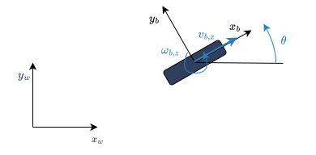
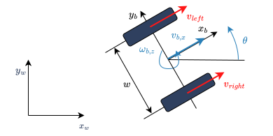
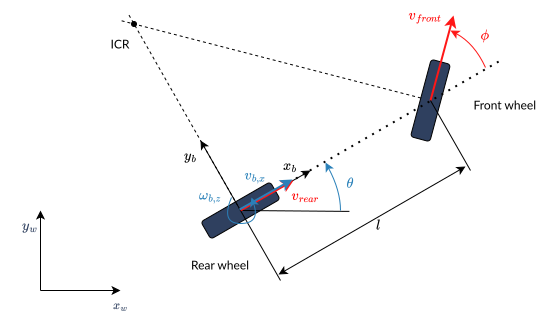
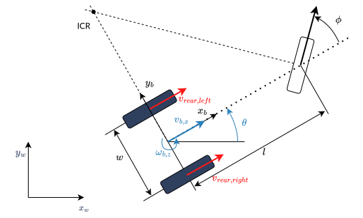
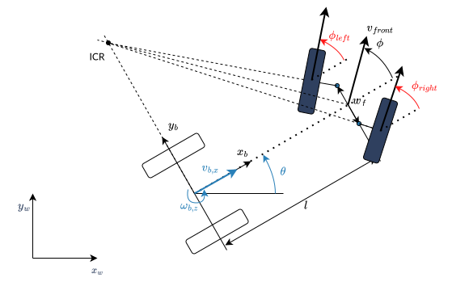
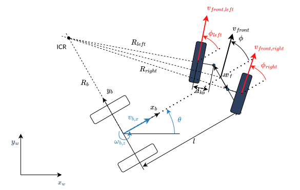

###### datetime:2025/06/23 11:50

###### author:nzb

# [轮式移动机器人运动学](https://control.ros.org/humble/doc/ros2_controllers/doc/mobile_robot_kinematics.html)

- 轮式移动机器人可以分为两类：
  - **Omnidirectional robots**：全向机器人，可以在平面上瞬间向任何方向移动
  - **Nonholonomic robots**：非完整机器人，在平面上无法瞬间移动到任何方向。

使用轮执行器的编码器对运动学模型进行正向集成——称为里程计定位或被动定位或航位推算。我们将它简称为里程计。

## 全向轮式移动机器人

- [使用全向轮的全向驱动机器人](https://control.ros.org/humble/doc/ros2_controllers/doc/mobile_robot_kinematics.html#omnidirectional-drive-robots-using-omni-wheels)

## 非完整轮式移动机器人 

- [Unicycle model 单轮模型](https://control.ros.org/humble/doc/ros2_controllers/doc/mobile_robot_kinematics.html#unicycle-model)

- [Differential Drive Robot 差分驱动机器人](https://control.ros.org/humble/doc/ros2_controllers/doc/mobile_robot_kinematics.html#differential-drive-robot)

- [Car-Like (Bicycle) Model 汽车式（自行车）模型](https://control.ros.org/humble/doc/ros2_controllers/doc/mobile_robot_kinematics.html#car-like-bicycle-model)

- [Double-Traction Axle 双牵引轴](https://control.ros.org/humble/doc/ros2_controllers/doc/mobile_robot_kinematics.html#double-traction-axle)

- [Ackermann Steering 阿克曼转向](https://control.ros.org/humble/doc/ros2_controllers/doc/mobile_robot_kinematics.html#ackermann-steering)

为防止前轮打滑，前轮的转向角不能相等。这就是所谓的阿克曼转向。

- [Ackermann Steering with Traction 阿克曼转向与牵引力](https://control.ros.org/humble/doc/ros2_controllers/doc/mobile_robot_kinematics.html#ackermann-steering-with-traction)

