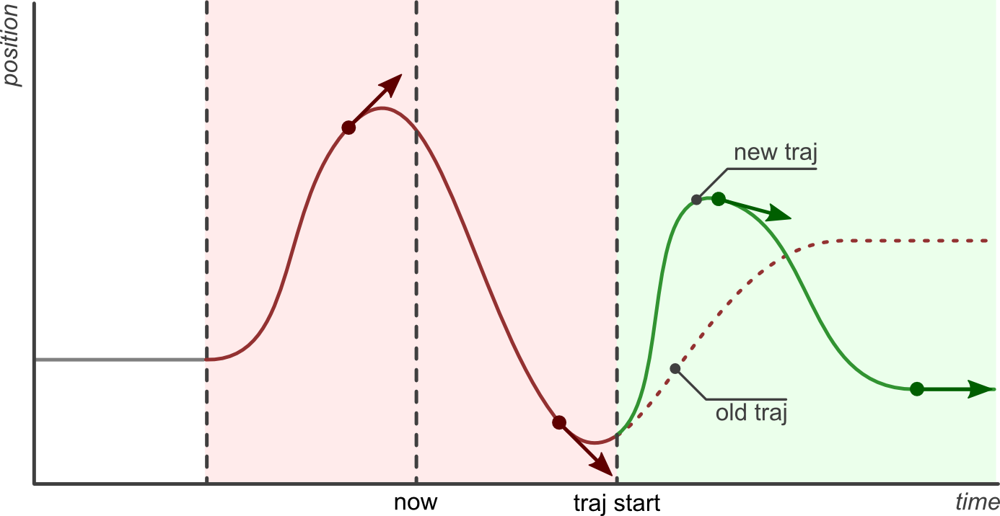

###### datetime:2025/06/24 16:12

###### author:nzb

# 关节轨迹控制器

## [轨迹表示(Trajectory Representation)](https://control.ros.org/humble/doc/ros2_controllers/joint_trajectory_controller/doc/trajectory.html#trajectory-representation)

轨迹在内部使用 `trajectory_msgs/msg/JointTrajectory` 数据结构表示。

目前实现了两种插值方法： `none` 和 `spline` 。默认情况下提供样条插值器，但也可以支持其他表示形式。

> 警告：用户必须确保为轨迹提供正确的输入，这些输入是控制器设置命令接口和 `PID` 配置所需的。没有进行有效性检查，采样轨迹中缺失的字段可能会导致段错误。

### 插值方法 none

它返回初始点，直到第一个轨迹数据点的时间到达。然后，它简单地取下一个给定的数据点。

> 警告：它不会从导数中推断（积分）轨迹，也不会计算导数。也就是说，必须按需提供位置及其导数。

### 插值方法 spline

样条插值器根据航点规范使用以下插值策略：

- `Linear`：线性
  - 如果仅指定了位置，则使用此策略。
  - 返回位置和速度
  - 在位置级别保证连续性。
  - 不建议使用，因为它产生的轨迹在航点处的速度不连续。
- `Cubic`:  三次曲线
  - 当位置和速度被指定时使用。
  - 返回位置、速度和加速度。
  - 保证速度级别的连续性。
- `Quintic`:  五次多项式
  - 如果指定了位置、速度和加速度，则使用。
  - 返回位置、速度和加速度。
  - 保证加速度级别的连续性。

如果 `allow_integration_in_goal_trajectories` 为真，则可以处理并接受仅包含速度场、仅包含速度和加速度场或仅包含加速度场的轨迹。然后，使用 `Heun` 方法分别从速度（或加速度）中积分位置（和速度）。

### 可视化示例

为了可视化不同插值方法及其输入的差异，定义了在 0.5 秒网格上的不同轨迹，并以 10 毫秒的速率进行采样。

仅给定位置时的线性样条插值轨迹：

仅给定速度时的三次样条插值轨迹（不使用插值方法 `none` ）：

给定位置和速度时的样条插值轨迹：

> 如果使用相同的积分方法（ `Trajectory` 类使用 `Heun` 方法），则 `spline` 方法与仅给定速度作为输入时得到相同的结果。

仅给定加速度时的五次样条插值轨迹（不进行插值方法 `none` 的推导）：

给定位置、速度和加速度点时的采样轨迹：

> 如果使用相同的积分方法（ `Trajectory` 类使用 `Heun` 方法），那么 `spline` 方法与仅给出加速度作为输入时给出的结果相同。

给定与上述相同的位移、速度和加速度点，但初始点非零时的采样轨迹：

给定与上述相同的位移、速度和加速度点，但第一个点从 `t=0` 开始时的采样轨迹：

> 如果第一个点从 `t=0` 开始，则初始点与轨迹之间没有插值。

给定不一致的位置、速度和加速度点时，使用样条曲线的采样轨迹：

插值方法 `none` 仅给出下一个输入点，而 `spline` 插值方法为了匹配给定的轨迹点显示出较高的超调。

## [轨迹替换(Trajectory Replacement)](https://control.ros.org/humble/doc/ros2_controllers/joint_trajectory_controller/doc/trajectory.html#trajectory-replacement)

关节轨迹消息允许通过头部时间戳指定新轨迹应开始执行的时间，其中零时间（默认值）表示“立即开始”。

新轨迹命令的到达并不一定意味着控制器会完全丢弃当前正在运行的轨迹并用新轨迹替换它。相反，控制器会取两者中有效的部分并适当组合，从而实现更智能的轨迹替换策略。

控制器进行轨迹替换所遵循的步骤如下：

- 获取新轨迹的有用部分：保留所有到达时间在未来的航点，丢弃那些时间已过去的航点。如果没有有用部分（即所有航点都在过去），则拒绝新轨迹，并继续执行当前轨迹而不做更改。
- 获取当前轨迹的有用部分：保留当前轨迹到新轨迹开始时间之前的部分，丢弃后面的部分。
- 结合当前轨迹和新轨迹的有用部分。

以下示例详细描述了这种行为。

第一个示例展示了一个处于保持位置模式（图中标记为 `pos hold` 的浅灰色线）的关节。一个新的轨迹（以红色显示）在当前时间（`now`）到达，其中包含三个航点和一个未来的起始时间（`traj start`）。航点应到达的时间（ `trajectory_msgs/JointTrajectoryPoint` 的 `time_from_start` 成员 ）是相对于轨迹起始时间的。

控制器在时间 `traj start` 处拼接当前保持轨迹，并附加三个航点。请注意，在 `now` 和 `traj start` 之间，之前的保持位置仍然维持，因为新轨迹尚未开始。到达最后一个航点后，其位置被保持，直到新的指令到达。

控制器保证当前轨迹与新轨迹之间的转换将平滑。到达第一个航点的时长越长，转换就越慢。

接下来的示例将讨论以不同的起始时间向控制器发送相同轨迹的效果。场景是控制器执行上一个示例中的轨迹（显示为红色），并接收到一个新的命令（显示为绿色），该命令的轨迹起始时间设置为零（立即开始）、未来时间或过去时间。

特别值得关注的是最后一个示例，其中新的轨迹起始时间和第一个航路点都在过去（现在之前）。在这种情况下，第一个航路点会被舍弃，只有第二个航路点会被实现。

## [参数详情](https://control.ros.org/humble/doc/ros2_controllers/joint_trajectory_controller/doc/parameters.html#details-about-parameters)

## [rqt_joint_trajectory_controller](https://control.ros.org/humble/doc/ros2_controllers/rqt_joint_trajectory_controller/doc/userdoc.html#rqt-joint-trajectory-controller)

`rqt_joint_trajectory_controller` 提供了一个直观的图形界面，让您可以测试不同的关节位置和轨迹，而无需手动构建复杂的轨迹消息或使用命令行界面。

该界面允许您：

- 从下拉菜单中选择控制器管理器命名空间和控制器。
- 使用交互式滑块调整关节（关节 1 和关节 2）的目标位置。
- 使用精确的数值输入微调关节位置。
- 使用速度缩放滑块控制运动速度。
- 使用中央电源按钮激活轨迹执行。
- 实时可视化当前关节配置。