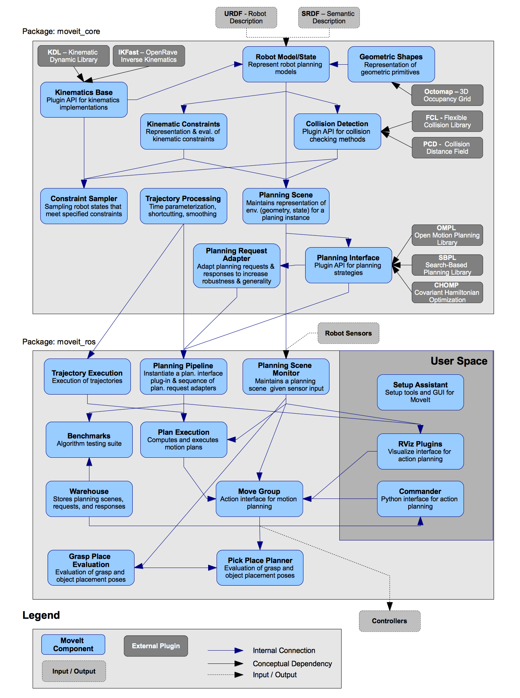

###### datetime:2025/02/08 14:37

###### author:nzb

## **源代码**

MoveIt 代码托管在 GitHub 上的 `moveit` 组织中，具体仓库如下：

- **movelt** - MoveIt 的主仓库，包含以下包：
  - `movelt` - 元包
  - `movelt_core` - 核心功能，包括 RobotModel、RobotState、碰撞检测
  - `movelt_ros_planning` - 规划组件、执行管理器、插件加载器
  - `movelt_ros_move_group` - 用于通过 ROS 消息使用 MoveIt 的 `move_group` 主节点
  - `movelt_ros_planning_interface` - 与 `move_group` 通信的 Python 和 ROS 消息接口
  - `movelt_ros_perception` - Octomap 和其他感知插件
  - `moveit_ros_manipulation` - 高级抓取和放置管道
  - `movelt_ros_robot_interaction` - Rviz 的交互式标记工具
  - `movelt_ros_visualization` - Rviz 工具
  - `movelt_ros_warehouse` - 用于存储场景和配置数据的数据库插件
  - `movelt_ros_benchmarks` - 使用 Planner Arena 进行基准测试
  - `movelt_ros` - 元包
  - `movelt_planners` - 元包
  - `movelt_planners_ompl` - 开放运动规划库插件
  - `movelt_commander` - 使用类似 Python 语法的终端控制接口
  - `movelt_setup_assistant` - 用于快速设置 MoveIt 的 GUI
  - `movelt_plugins` - 控制器管理器的插件
  - `chomp_motion_planner` - 用于高效运动规划的梯度优化技术
  - `chomp_interface` - 用于将 CHOMP 与 MoveIt 结合的适配器
- **moveit2** - 用于 ROS 2 的 MoveIt 测试版
- **moveit_msgs** - ROS 消息
- **moveit_task_constructor** - 一种分层、多阶段操作规划的方法
- **moveit_grasps** - 用于操作的基于几何的抓取生成库
- **moveit_visual_tools** - 在 Rviz 中显示和调试数据
- **moveit_resources** - 大文件资源，如测试机器人
- **moveit_calibration** - 带有 GUI 的手眼校准例程
- **moveit_advanced** - 实验性高级功能
- **moveit_cl** - 用于持续集成的 Travis 脚本
- **rqt_movelt** - ROS 的 GUI 框架 RQT 的插件
- **srdfdom** - 由 MoveIt 独占使用的语义机器人描述格式

**由 MoveIt 团队维护的依赖项：**

- `warehouse_ros` - 用于持久化 ROS 消息数据的抽象接口
- `random_numbers` - 用于生成随机数的包

**以下仓库可以找到文档：**

- `movelt.ros.org` - 主网站
- `movelt_tutorials` - 学习 MoveIt 的逐步示例
- `movelt_example_apps` - 示例高级应用程序代码的沙盒

## **ROS Noetic Code API**

### **Move Group Interface**

- **MoveItCpp 类** - 主要的新、更快的 C++ 接口到 MoveIt。
- **MoveGroupInterface 类** - 到 `move_group_node` 的主要 C++ 接口。`MoveGroupInterface` 是之前版本中 `MoveGroup` 类的继任者，现已弃用。
- **PlanningSceneInterface 类** - 到规划场景的 C++ 接口
- **MoveIt commander** - MoveIt commander 的文档。

### MoveIt ROS

*此 API 面向高级开发者。大多数用户应使用 Move Group 接口（如上）。*

- **规划** - MoveIt ROS 中的规划组件，尤其是规划场景、运动学和监视器
- **Move Group** - `move_group_node`
- **感知** - MoveIt ROS 中的感知组件
- **机器人交互** - MoveIt ROS 中的交互组件

### MoveIt Core

*此 API 面向高级开发者。大多数用户应使用 Move Group 接口（如上）。*

- **核心** - MoveIt 中的核心组件，包括运动学、规划场景、约束、运动规划、碰撞检测和插件接口

### MoveIt OMPL Interface

*此 API 面向高级开发者。大多数用户应使用 Move Group 接口（如上）。*

- **OMPL 接口** - 允许 MoveIt 与 OMPL 通信的类集合。