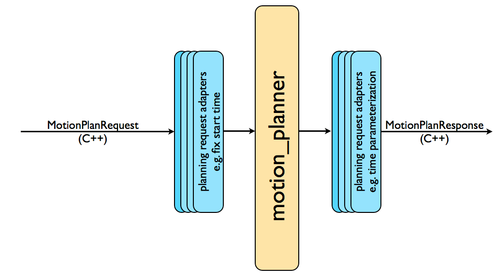

###### datetime:2025/04/24 11:47

###### author:nzb

# [**运动规划 (Motion Planning)**](https://moveit.picknik.ai/main/doc/concepts/motion_planning.html)

## **运动规划插件 (The Motion Planning Plugin)**  
`MoveIt`通过插件接口与多种运动规划库交互，使其具备高度可扩展性。运动规划器通过`ROS action`或`service`（由`move_group`节点提供）与`MoveIt`通信。默认规划器由`MoveIt Setup Assistant`配置，主要基于**OMPL**（`Open Motion Planning Library`），同时支持其他规划器（如`Pilz`工业运动规划器和`CHOMP`）。  

## **运动规划请求 (The Motion Plan Request)**  
运动规划请求定义了规划目标，例如：  
- 将机械臂移动到关节空间中的新位置  
- 使末端执行器到达指定位姿  

默认启用碰撞检测（包括自碰撞和附着物体检测）。用户可通过参数指定规划器和约束条件，`MoveIt`内置的约束类型包括：  
1. **位置约束**：限制某连杆的位置在空间特定区域内。  
2. **方向约束**：限制连杆的滚转、俯仰或偏航角范围。  
3. **可见性约束**：确保连杆上的某点位于传感器视野锥内。  
4. **关节约束**：限制关节运动在设定范围内。  
5. **自定义约束**：支持通过回调函数定义用户专属约束。  

## **运动规划结果 (The Motion Plan Result)**  
`move_group`节点响应请求后生成**时间参数化轨迹**（而非单纯路径），该轨迹会考虑指定的最大速度和加速度限制，确保关节级运动符合动力学约束。  

## **运动规划适配器 (Motion Planning Adapters)**  

完整运动规划流程由规划器与**规划请求适配器**协同完成。适配器负责请求预处理和响应后处理，预处理在多种情况下都很有用，例如，当机器人的起始状态略微超出指定的机器人关节限制时。其他一些操作也需要后处理，例如将为机器人生成的路径转换为时间参数化轨迹。`MoveIt` 提供了一组默认的运动规划适配器，每个适配器都能执行特定的功能。

1. **CheckStartStateBounds**  
   - **功能**：若起始状态超出URDF定义的关节限位，将其调整至限位内。  
   - **参数**：可设置允许的超出阈值（避免大幅越限时强行修正）。  

2. **ValidateWorkspaceBounds**  
   - **功能**：若请求未指定工作空间，默认启用`10m×10m×10m`的立方体空间。  

3. **CheckStartStateCollision**  
   - **功能**：若起始状态存在碰撞，通过微调关节值采样无碰撞配置。  
   - **参数**：  
     - `jiggle_fraction`：扰动幅度（占关节运动范围的百分比）。  
     - 最大随机采样次数。  

4. **AddTimeParameterization**  
   - **功能**：将“无时间参数的路径”转换为符合速度/加速度约束的轨迹。  

5. **ResolveConstraintFrames**  
   - **功能**：将约束坐标系转换为物体或机器人本体坐标系（例如将目标位姿从`cup/handle`转换到`cup`）。  

## **OMPL集成**  
OMPL（开源运动规划库）是`MoveIt`的默认规划引擎，专注于随机化规划算法。其本身无机器人模型概念，`MoveIt`为其提供机器人后端支持，实现具体场景的规划。  

