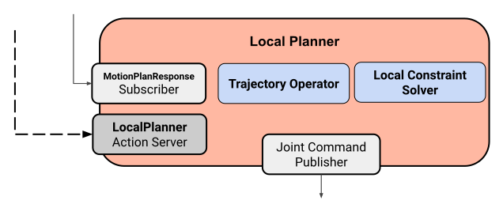
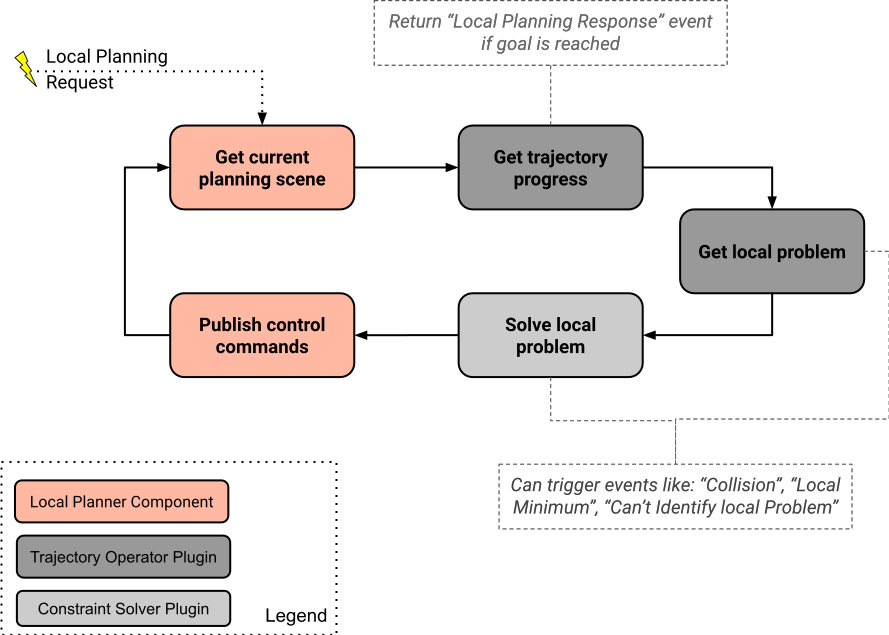

###### datetime:2025/04/24 11:47

###### author:nzb

# [**混合规划（Hybrid Planning）**](https://moveit.picknik.ai/main/doc/concepts/hybrid_planning/hybrid_planning.html)

MoveIt的运动规划遵循**“感知-规划-执行”（Sense-Plan-Act）**流程：  
1. **感知（Sense）**：获取环境与机器人状态信息。  
2. **规划（Plan）**：通过规划器计算运动轨迹。  
3. **执行（Act）**：通过轨迹控制器一次性执行规划结果。  

该方案适用于**静态已知环境**的全局运动规划，但在动态或不确定场景（如给人递水、在黑板上写字）中表现不足。例如：  
- 环境动态变化（如移动障碍物）。  
- 任务本身存在不确定性（如粉笔书写时需实时调整压力，且粉笔长度逐渐缩短）。  

## **什么是混合规划？** 
 
混合规划是一种**结合异构规划器**的运动规划方法，通过全局与局部规划器的协同工作提升鲁棒性和实时性。该理念在导航领域（如`navigation2`）已广泛应用。  

MoveIt的混合规划架构包含两个核心组件：  
1. **全局规划器（Global Planner）**  
   - **任务**：解决全局运动规划问题（类似传统“Sense-Plan-Act”中的规划器）。  
   - **特性**：  
     - **完备性**：保证能找到解（但计算耗时较长）。  
     - **非实时安全**：不保证在截止时间内完成。  
     - **输出**：生成初始解或迭代优化解。  

2. **局部规划器（Local Planner）**  
   - **任务**：在执行过程中持续生成机器人指令，跟随全局轨迹并处理局部问题。  
   - **特性**：  
     - **实时性**：快速响应传感器反馈，通常需满足实时安全（Real-time-safe）。  
     - **确定性**：避免运动抖动或不稳定。  
     - **功能**：  
       - 融合或调整连续的全局参考轨迹。  
       - 动态避障（跟随全局路径时避开近距离碰撞）。  
       - 适应局部约束（如根据表面不平度调整力控、基于视觉反馈修正工具位姿）。  
       - 局部轨迹优化与时间参数化（计算效率更高）。  

3. **全局与局部规划器的协作逻辑**  
  - **依赖关系**：局部规划器基于全局参考轨迹工作，避免陷入局部极小值。  
  - **异常处理**：若局部规划器无法解决约束（如陷入局部极小），可触发全局重新规划。  
  - **事件驱动**：支持自定义事件逻辑，适应不同应用场景和规划器类型。  

### **规划器对比**  

| **全局规划器**                | **局部规划器**                  |  
|-----------------------------|--------------------------------|  
| 生成全局解轨迹 持续优化轨迹路径                | 遵循全局参考轨迹 解决局部问题约束 可处理传感器输入 优化局部解决方案 计算控制器指令                |  
| 完整 计算时间不受限制 非实时安全 不一定具有确定性                  | 可能陷入局部最小值 计算时间短 实时安全(取决于求解器) 确定性            |  
| OMPL 计划器 STOMP TrajOpt 笛卡尔运动计划器 Pilz 工业运动计划器 MTC        | IK 求解器，雅可比 Potential field planner 轨迹优化算法 模型预测控制 (MPC) 基于传感器的优化控制 |  

混合规划可用于多种使用情况。大多数应用可分为以下三种情况。

- 在线运动规划： 全局规划器创建初始全局解决方案，并不断对其进行优化。与此同时，局部规划器执行参考轨迹，并将更新的轨迹段融合到其中。
- 反应式运动： 全局规划器用于修复失效的解决方案（重新规划），而本地规划器则在碰撞前减速或停止
- 自适应运动： 本地规划器用于调整全局解决方案，以适应动态条件，例如保持工具与不平表面的稳定接触

## 混合规划架构

下图描述了构成混合规划架构的基本插件类型和 ROS 接口。

该架构由三个`ROS`组件节点构成：

**混合规划管理器 (Hybrid Planning Manager)**
- 提供用于混合规划请求的ROS动作接口
- 运行规划逻辑并协调各规划器

**全局规划器 (Global Planner)**
- 解决全局规划问题并发布解决方案轨迹
- 生成全局参考轨迹

**局部规划器 (Local Planner)**
- 处理传入的全局轨迹更新
- 基于机器人状态、环境信息和参考轨迹解决局部规划问题
- 向机器人驱动器发送位置/速度控制指令

架构特点：
1. **通用性与可定制性**  
   组件间仅通过ROS 2消息接口交互，可轻松替换具体实现
   
2. **插件化设计**  
   接口设计最小化，最大限度抽象算法实现细节，开发者可专注核心算法开发

3. **高复用性**  
   相同组件可适配不同硬件配置或规划场景

### 混合规划管理器

该组件是架构的“大脑”，其主要功能是处理`HybridPlanner`动作请求，并基于规划逻辑插件协调运动规划与执行过程。规划逻辑通过`PlanningLogic`插件实现，采用事件驱动设计。事件由字符串标识符定义，可能触发针对全局或局部规划器的动作调用或取消。下图展示了一个简单规划逻辑的事件日志示例：

事件触发机制由`Hybrid Planning`动作请求以及全局和局部规划器的动作反馈消息触发。在本示例中，`Hybrid Planning Manager`在接收到混合规划请求后启动全局规划器。当全局轨迹生成后，启动局部规划器；局部规划器完成后，`Hybrid Planning Manager`返回混合规划响应。

自定义规划逻辑通过自定义`Planning Logic`插件，可以将通用事件映射到架构提供的可用动作，例如“启动全局规划”、“停止轨迹执行”或“切换到局部规划器约束x”。这使得运动规划行为具有高度的可定制性和适应性。

## 全局规划器

全局规划器是该架构中最简单的组件。它提供了一个动作服务器来处理全局规划器请求。这些请求包括常见的 `MotionPlanRequests`，由全局规划器插件处理。默认情况下，这只是 `MoveIt` 的规划管道，但从技术上讲，任何类型的规划器，甚至 `MTC` 都可以在这里使用。规划结果通过动作反馈进行报告，解决方案轨迹将发布到局部规划器以供进一步处理。

## 局部规划器

局部规划器运行一个动作服务器，用于处理来自混合规划管理器的请求。该动作用于启动和停止执行，并可配置运行时参数，如约束条件或求解器类型。

**局部规划器的实现基于两个插件：**  
1. **轨迹操作器 (Trajectory Operator)**  
   - 维护全局参考轨迹  
   - 处理来自全局规划器的轨迹更新  
   - 监控当前机器人状态  

2. **局部约束求解器 (Local Constraint Solver)**  
   - 实现迭代求解算法，基于参考轨迹和局部约束生成机器人控制指令  
   - 可能包含动态处理传感器输入或事件更新的接口  

**局部规划器的工作流程：**  
1. 每次迭代中，局部规划器请求当前规划场景，并将当前机器人状态与参考轨迹匹配。  
2. 如果目标已到达，局部规划动作成功完成。  
3. 否则，基于当前机器人状态识别局部规划问题并求解。  
4. 最终，将生成的控制指令发布到机器人控制器。  

## 混合规划器的工作原理  

混合规划器的运行时行为可以通过绘制工作流图来理解，该图展示了不同组件的通信通道和事件。

**成功轨迹执行的工作流：**  
1. 混合规划请求触发混合规划管理器。  
2. 混合规划管理器调用全局规划器。  
3. 全局规划器计算并发布轨迹，轨迹被混合规划管理器和局部规划器接收。  
4. 局部规划器处理新轨迹，但仅在混合规划管理器调用后开始执行。  
5. 局部规划器逐步执行参考轨迹，到达最终状态后返回动作响应。  
6. 混合规划管理器返回成功的混合规划响应。  

**复杂场景：动态避障与重规划**  

1. 初始全局轨迹计算后，碰撞物体发生变化，局部规划器检测到即将发生的碰撞并暂停执行。  
2. 局部规划器重新调用全局规划器以生成新的无碰撞轨迹。  
3. 在全局规划器计算新轨迹期间，局部规划器保持机器人当前位置以避免碰撞。  
4. 全局规划器发布新轨迹后，局部规划器的轨迹操作器插件将更新融入参考轨迹。  
5. 局部规划器继续执行更新后的参考轨迹，绕过碰撞物体。  

## 混合规划示例教程  

如果您想在应用中使用混合规划或进行实验，请查看[混合规划示例教程](https://moveit.picknik.ai/main/doc/examples/hybrid_planning/hybrid_planning_tutorial.html)。