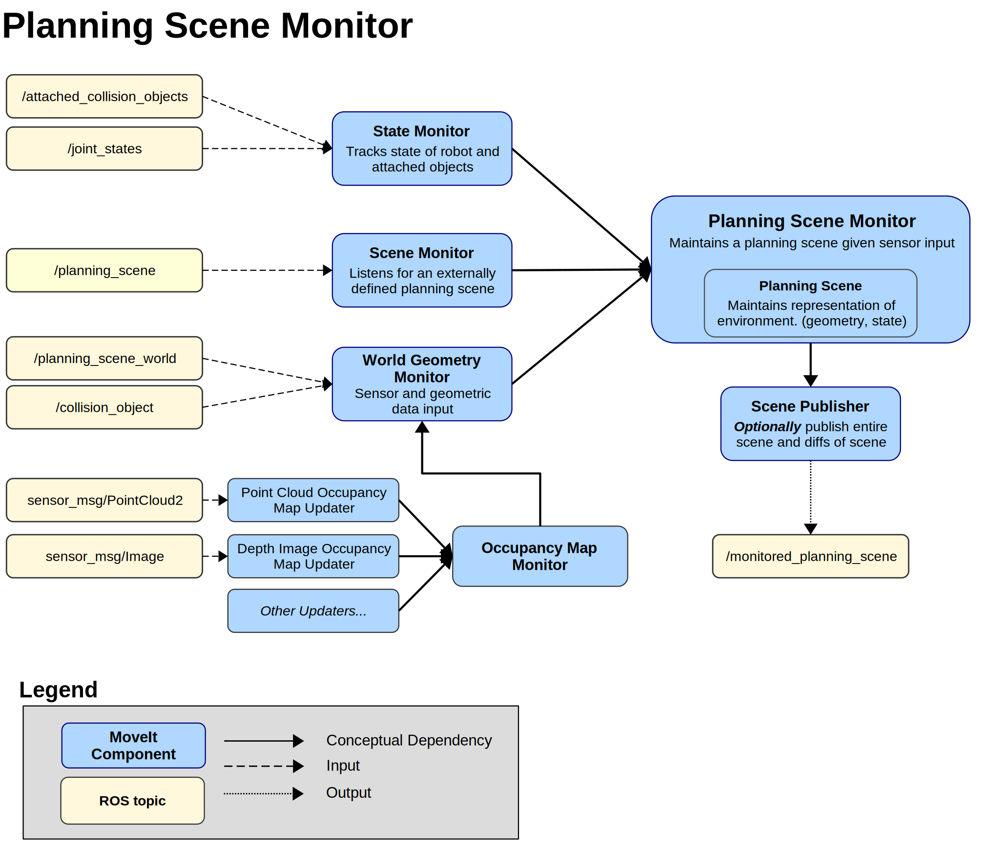

###### datetime:2025/04/25 16:39

###### author:nzb

# [**规划场景监控器（Planning Scene Monitor）**](https://moveit.picknik.ai/main/doc/concepts/planning_scene_monitor.html)

规划场景（`planning_scene`）是一个用于存储机器人周围环境及自身状态的对象。其内部状态通常由**规划场景监控器（Planning Scene Monitor, PSM）** 管理，确保线程安全的读写操作。  

- **应用场景**：  
  - `move_group`节点和Rviz的规划场景插件均内置独立的PSM。  
  - `move_group`的PSM监听`/planning_scene`话题，并将规划场景状态发布至`monitored_planning_scene`话题（供Rviz插件订阅）。  

## **世界几何监控器（World Geometry Monitor）**  
该组件通过机器人传感器（如激光雷达、深度相机）和用户输入构建环境几何模型：  
1. 使用**占据地图监控器**（下文详述）生成3D环境表示。  
2. 通过`planning_scene`话题补充物体信息（如用户添加的障碍物）。  

## **3D感知（3D Perception）**  
MoveIt的3D感知由**占据地图监控器**处理，其采用插件架构支持多种传感器输入：
  
| 输入类型       | 处理插件                          |  
|----------------|----------------------------------|  
| 点云（Point Cloud） | `PointCloudOccupancyMapUpdater` |  
| 深度图像（Depth Image） | `DepthImageOccupancyMapUpdater` |  

> **扩展性**：用户可自定义插件以支持其他传感器类型。  

## **Octomap**  
占据地图监控器使用**Octomap**维护环境占据地图：  
- **特性**：支持概率化体素编码（当前未在MoveIt中启用）。  
- **集成**：Octomap可直接传递给碰撞检测库FCL使用。  

### **深度图像占据地图更新器** 
 
该插件包含**自过滤功能**：  
- 基于机器人当前状态（`robot_state`），自动从深度图像中剔除机器人本体部分，避免自遮挡干扰环境建模。  
