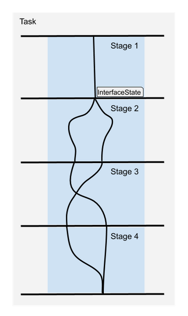
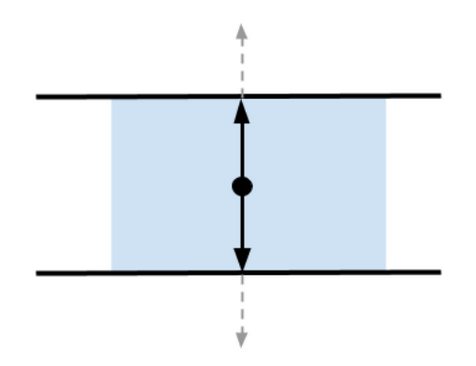
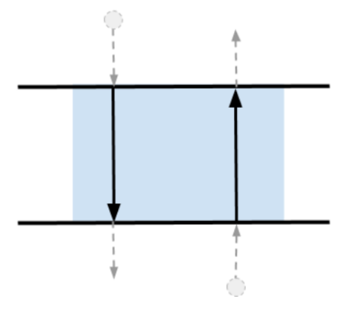

###### datetime:2025/04/27 16:39

###### author:nzb

# [MoveIt 任务构造函数](https://moveit.picknik.ai/main/doc/concepts/moveit_task_constructor/moveit_task_constructor.html#)

## 什么是 MoveIt 任务构造函数？

`MoveIt Task Constructor （MTC）` 框架有助于将复杂的规划任务分解为多个相互依赖的子任务。`MTC`
使用 `MoveIt` 来解决子任务。来自 `subtasks` 的信息通过 `InterfaceState` 对象传递。



## MTC Stages

MTC 阶段是指任务执行管道中的组件或步骤。

阶段可以按任意顺序排列，其层次结构仅受各个阶段类型的限制。阶段的排列顺序受传递结果的指示的限制。

与结果流相关的可能阶段有三个：
- 生成阶段
- 传播阶段
- 连接阶段

### 生成阶段



生成器阶段没有从相邻阶段获得输入。他们计算结果并在两个方向中传递它们，即向前和向后。

`MTC` 任务的执行从 `Generator` 阶段开始。

最重要的生成器阶段是 `CurrentState` ，它将当前机器人状态作为起点进行规划管道。

`Monitoring Generator`是一个阶段，用于监视另一个阶段（非相邻）的解决方案，以使用解决方案进行规划。

监控生成器示例 - `GeneratePose` 。它通常监控 `CurrentState` 或修改 `PlanningScene`阶段。通过监视 `CurrentState` 、 `GeneratePose` 的 `Stage` 可以找到它应围绕其生成姿势的对象或帧。

有关 `MTC` 提供的生成阶段的更多信息，请在此处找到 - [`Generang Stages`](https://moveit.picknik.ai/main/doc/concepts/moveit_task_constructor/generating_stages.html#generating-stages)。

### 传播阶段



传播阶段从一个相邻状态接收解决方案，解决一个问题，然后将结果传播到另一侧的邻居。

根据具体实施情况，此阶段可以向前、向后或双向传递解决方案。

示例 - 相对于姿势移动(`Move Relative`)。此阶段通常用于接近要拾取的物体。

有关 `MTC` 提供的宣传舞台的更多信息，请点击此处 - [`Propagang Stages`](https://moveit.picknik.ai/main/doc/concepts/moveit_task_constructor/propagating_stages.html#propagating-stages)。

### 连接阶段


连接器不会传播任何结果，但会主动连接相邻阶段提供的 `start` 和 `goal` 输入。

连接阶段通常会解决起始状态和目标状态之间的可行轨迹。

有关 `MTC` 提供的连接阶段的更多信息，请点击此处 - [Connecng Stages](https://moveit.picknik.ai/main/doc/concepts/moveit_task_constructor/connecting_stages.html#connecting-stages)。

### 包装器

包装器封装另一个阶段以修改或筛选结果。

包装器示例 - `Compute IK` for `Generate Grasp Pose` 阶段。`Generate Grasp Pose`阶段将生成笛卡尔姿势解决方案。通过将 `Compute IK` 阶段环绕 `Generate Pose`阶段中，`Generate Pose` 阶段中的笛卡尔姿势解决方案可用于生成 `IK` 解决方案,（即） 产生的关节状态配置以达到目标姿势。

有关 `MTC` 提供的包装器的更多信息，请参见 此处 - [包装器](https://moveit.picknik.ai/main/doc/concepts/moveit_task_constructor/wrappers.html#wrappers)。

## MTC 容器

`MTC` 框架支持使用容器对阶段进行分层组织，从而允许顺序和并行组合。

`MTC` 容器有助于组织阶段的执行顺序。通过编程方式，可以通过编程方式将一个容器添加到另一个容器中。当前可用的容器：
- 串行容器
- 平行容器

### 串行容器

串行容器线性地组织阶段，并且仅将端到端解决方案视为结果。
默认情况下，`MTC` 任务存储为串行容器。

### 并行容器

并行容器组合了一组阶段，以允许规划备用解决方案。
有关并行容器的更多信息，请在此处找到 - [并行容器](https://moveit.picknik.ai/main/doc/concepts/moveit_task_constructor/parallel_containers.html#parallel-containers)。

## 初始化 MTC 任务

顶级规划问题被指定为 `MTC` 任务，而由 `Stages` 指定的子问题将添加到 `MTC` 任务对象中。

```cpp
auto node = std::make_shared<rclcpp::Node>();
auto task = std::make_unique<moveit::task_constructor::Task>();
task->loadRobotModel(node);
// Set controllers used to execute robot motion. If not set, MoveIt has controller discovery logic.
task->setProperty("trajectory_execution_info", "joint_trajectory_controller gripper_controller");
```

## 向 MTC 任务添加容器和阶段

- 向 MTC 任务添加阶段

```cpp
auto current_state = std::make_unique<moveit::task_constructor::stages::CurrentState>("current_state");
task->add(std::move(current_state));
```

容器派生自 `Stage`，因此可以类似地将容器添加到 `MTC` 任务中

```cpp
auto container = std::make_unique<moveit::task_constructor::SerialContainer>("Pick Object");
// TODO: Add stages to the container before adding the container to MTC task
task->add(std::move(container));
```

## 设置规划求解器

进行运动规划的阶段需要求解器信息。

`MTC` 中可用的求解器
- `PipelinePlanner` - 使用 `MoveIt` 的规划流水线
- `JointInterpolation` - 在起始关节状态和目标关节状态之间进行插值。不支持复杂的运动。
- `CartesianPath` - 在笛卡尔空间中沿直线移动末端执行器。

关于如何初始化求解器的代码示例

```cpp
const auto mtc_pipeline_planner = std::make_shared<moveit::task_constructor::solvers::PipelinePlanner>(
    node, "ompl", "RRTConnectkConfigDefault");
const auto mtc_joint_interpolation_planner =
    std::make_shared<moveit::task_constructor::solvers::JointInterpolationPlanner>();
const auto mtc_cartesian_planner = std::make_shared<moveit::task_constructor::solvers::CartesianPath>();
```

这些求解器将传递到 `MoveTo` 、 `MoveRelative` 和 `Connect` 等阶段。

## 设置属性

每个 `MTC` 阶段都有可配置的属性。示例 - 规划组、超时时间、目标状态等。
可以使用下面的函数设置不同类型的属性。

```cpp
void setProperty(const std::string& name, const boost::any& value);
```

子阶段可以轻松地从其父阶段继承属性，从而减少配置开销。

## 阶段成本计算器

`CostTerm` 是计算 `MTC` 阶段解决方案成本的基本接口。

`MTC` 中可用的 `CostTerm` 实现
- `Constant` - 为每个解决方案添加一个常量成本
- `PathLength` - 成本取决于轨迹长度，不同关节的权重可选
- `TrajectoryDuration` - 成本取决于整个轨迹的执行时长
- `TrajectoryCostTerm` - 仅适用于 `SubTrajectory` 解决方案的成本项
- `LambdaCostTerm` - 传入一个 `lambda` 表达式来计算成本
- `DistanceToReference` - 成本取决于到参考点的加权关节空间距离
- `LinkMotion` - 成本取决于连杆的笛卡尔轨迹长度
- `Clearance` - 成本是碰撞距离的倒数

如何使用 `LambdaCostTerm` 设置 `CostTerm` 的示例代码

```cpp
stage->setCostTerm(moveit::task_constructor::LambdaCostTerm(
      [](const moveit::task_constructor::SubTrajectory& traj) { return 100 * traj.cost(); }));
```

`MTC` 提供的所有阶段均有默认的成本项。生成轨迹作为解决方案的阶段通常使用路径长度来计算成本。

## 规划和执行 MTC 任务

规划 `MTC` 任务将返回 `MoveItErrorCode`。请参阅[此处](https://github.com/moveit/moveit_msgs/blob/ros2/msg/MoveItErrorCodes.msg)以识别不同的错误类型。如果规划成功，您可以预期规划函数将返回 `moveit_msgs::msg::MoveItErrorCodes::SUCCESS`。

```cpp
auto error_code = task.plan()
```

规划完成后，提取第一个成功的解决方案并将其传递给执行函数。这将创建一个`execute_task_solution`操作客户端。该操作服务器位于 `MTC` 提供的`execute_task_solution_capability`插件中。该插件扩展了 `MoveGroupCapability`。它根据 `MTC` 解决方案构建一个 `MotionPlanRequest`，并使用 `MoveIt` 的 `PlanExecution` 来驱动机器人。

```cpp
auto result = task.execute(*task.solutions().front());
```

## 更多信息链接

这里有一个关于如何使用 `MTC` 创建拾放流水线的[教程](../tutorials/04-pick_and_place.md)。

以下链接包含更多关于 `MTC` 提供的平台和容器的信息

- [Generating Stages](https://moveit.picknik.ai/main/doc/concepts/moveit_task_constructor/generating_stages.html)
- [Propagating Stages](https://moveit.picknik.ai/main/doc/concepts/moveit_task_constructor/propagating_stages.html)
- [Connecting Stages](https://moveit.picknik.ai/main/doc/concepts/moveit_task_constructor/connecting_stages.html)
- [Wrappers](https://moveit.picknik.ai/main/doc/concepts/moveit_task_constructor/wrappers.html)
- [Parallel Containers](https://moveit.picknik.ai/main/doc/concepts/moveit_task_constructor/parallel_containers.html)
- [Debugging MTC tasks](https://moveit.picknik.ai/main/doc/concepts/moveit_task_constructor/debugging_mtc_task.html)


