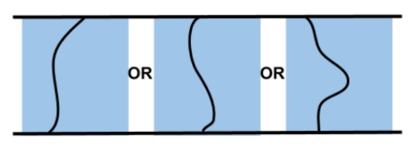
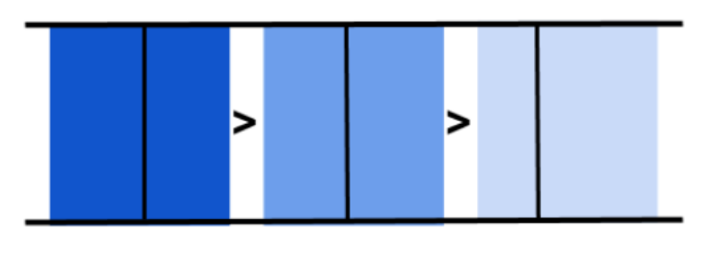
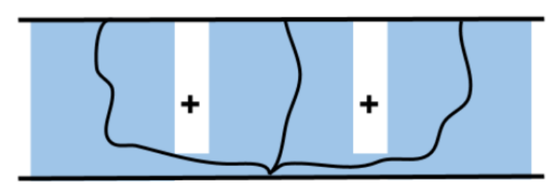

###### datetime:2025/04/27 16:39

###### author:nzb

# 平行容器

平行容器将一系列阶段结合起来，以便规划备用解决方案。

MTC 提供的三个阶段可在平行容器中使用：

- Alternatives(替代方案)
- Fallback(备选方案)
- Merger(合并)

## Alternatives



替代容器允许并行执行添加阶段。

所有子阶段的解决方案都会在最后收集起来，并按成本排序。

示例 - 规划一条有多个成本项的轨迹。

```cpp
auto pipeline{ std::make_shared<solvers::PipelinePlanner>(node) };

auto alternatives{ std::make_unique<Alternatives>("connect") };
{
    auto connect{ std::make_unique<stages::Connect>(
         "path length", stages::Connect::GroupPlannerVector{ { "panda_arm", pipeline } }) };
    connect->setCostTerm(std::make_unique<cost::PathLength>());
    alternatives->add(std::move(connect));
}
{
    auto connect{ std::make_unique<stages::Connect>(
         "trajectory duration", stages::Connect::GroupPlannerVector{ { "panda_arm", pipeline } }) };
    connect->setCostTerm(std::make_unique<cost::TrajectoryDuration>());
    alternatives->add(std::move(connect));
}
t.add(std::move(alternatives));
```

## Fallbacks



备选容器按顺序执行子阶段，直到其中一个阶段返回成功或所有阶段返回失败。

示例 - 每次使用不同的求解器进行规划，直到获得成功的解决方案。

```cpp
auto cartesian = std::make_shared<solvers::CartesianPath>();
auto ptp = std::make_shared<solvers::PipelinePlanner>(node, "pilz_industrial_motion_planner", "PTP")
auto rrtconnect = std::make_shared<solvers::PipelinePlanner>(node, "ompl", "RRTConnectkConfigDefault")

// fallbacks to reach target_state
auto fallbacks = std::make_unique<Fallbacks>("move to other side");

auto add_to_fallbacks{ [&](auto& solver, auto& name) {
     auto move_to = std::make_unique<stages::MoveTo>(name, solver);
     move_to->setGroup("panda_arm");
     move_to->setGoal(target_state);
     fallbacks->add(std::move(move_to));
 } };
add_to_fallbacks(cartesian, "Cartesian path");
add_to_fallbacks(ptp, "PTP path");
add_to_fallbacks(rrtconnect, "RRT path");
```

## Merger



合并容器中的各阶段可合并多个不同的问题，即并行规划不同的规划组。

所有子阶段的解决方案都会合并为一个解决方案，以便并行执行。

示例 - 将机械臂移动到某一位置时打开夹具

```cpp
auto cartesian_planner = std::make_shared<solvers::CartesianPath>();
const auto joint_interpolation_planner = std::make_shared<moveit::task_constructor::solvers::JointInterpolationPlanner>();

auto merger = std::make_unique<Merger>("move arm and close gripper");

auto move_relative = std::make_unique<moveit::task_constructor::stages::MoveRelative>("Approach", cartesian_planner);
 merger->add(std::move(move_relative));

auto move_to =
   std::make_unique<moveit::task_constructor::stages::MoveTo>("close gripper", joint_interpolation_planner);

merger->add(std::move(move_to));
```


