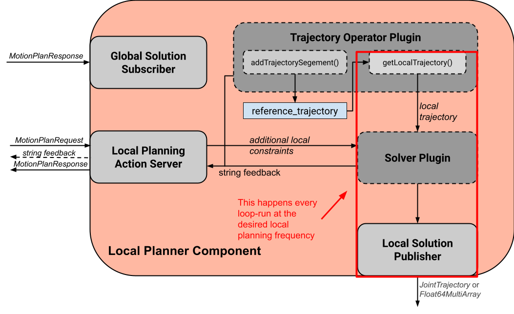

###### datetime:2025/04/09 16:37

###### author:nzb

# [混合规划](https://moveit.picknik.ai/main/doc/examples/hybrid_planning/hybrid_planning_tutorial.html)

在本节中，您将学习如何使用 MoveIt 2 的混合规划功能。

通过混合规划功能，您可以使用 MoveIt 2 在线（重新）规划和执行机器人运动，并在机器人运动规划管道中添加更多规划逻辑。


## 什么是混合规划？

混合规划将（较慢的）全局运动规划器与（较快的）局部运动规划器相结合，使机器人能够在动态环境中在线解决不同的任务。通常，全局运动规划器用于离线创建初始运动规划，并在全局解决方案失效时重新规划。局部规划器则根据局部约束条件调整全局解决方案，并对环境变化立即做出反应。有关架构的更详细说明，请参阅 ["混合规划概念"]()页面。

在 MoveIt 2 中实现混合规划的架构如下所示：


混合规划管理器为混合规划请求提供应用程序接口，实现高级规划逻辑，并协调两个规划器及其交互。全局规划请求由 "全局规划器组件"（`Global Planner Component`）响应，该组件负责解决给定的规划问题并发布解决方案。本地规划组件处理接收到的全局轨迹更新，并在每次迭代时解决本地规划问题。使用该架构的主要优势如下：

- 可分别处理全局和局部受限运动规划问题
- 利用局部规划器可实现在线运动规划
- 在动态或未知环境中进行反应式重新规划

## 快速开始

运行以下命令启动演示：  

```bash
ros2 launch moveit_hybrid_planning hybrid_planning_demo.launch.py
```

您应该会看到与上面 GIF 示例中类似的行为，但没有重新规划。

要与架构进行交互，只需向混合规划管理器提供的动作服务器发送混合规划请求即可。

让我们来改变这种行为，使架构重新扫描已失效的轨迹。为此，只需将演示[配置](https://github.com/moveit/moveit2/blob/main/moveit_ros/hybrid_planning/test/config/hybrid_planning_manager.yaml)中的 `planner_logic_plugin` 插件名称替换为 `"moveit_hybrid_planning/ReplanInvalidatedTrajectory"`（混合规划/重新规划无效轨迹），然后重建软件包： `colcon build --packages-select moveit2_tutorials`

重新运行上述发射命令后，你应该会看到该架构重新扫描了已失效的轨迹。

要在项目中加入混合规划架构，需要在启动文件中添加一个混合规划组件节点，并在其中加入必要的参数：

```python
# Generate launch description with multiple components
container = ComposableNodeContainer(
    name="hybrid_planning_container",
    namespace="/",
    package="rclcpp_components",
    executable="component_container",
    composable_node_descriptions=[
        ComposableNode(
            package="moveit_hybrid_planning",
            plugin="moveit::hybrid_planning::GlobalPlannerComponent",
            name="global_planner",
            parameters=[
                global_planner_param,
                robot_description,
                robot_description_semantic,
                kinematics_yaml,
                ompl_planning_pipeline_config,
            ],
        ),
        ComposableNode(
            package="moveit_hybrid_planning",
            plugin="moveit::hybrid_planning::LocalPlannerComponent",
            name="local_planner",
            parameters=[
                local_planner_param,
                robot_description,
                robot_description_semantic,
                kinematics_yaml,
            ],
        ),
        ComposableNode(
            package="moveit_hybrid_planning",
            plugin="moveit::hybrid_planning::HybridPlanningManager",
            name="hybrid_planning_manager",
            parameters=[hybrid_planning_manager_param],
        ),
    ],
    output="screen",
)
```

## 定制混合规划架构

与 `MoveIt2` 的其他部分一样，混合规划架构设计为高度可定制，同时也提供了轻松重用现有解决方案的可能性。该架构的每个组件都是一个 `ROS2` 节点，只要能提供其他节点所需的应用程序接口，就能完全被自己定制的 `ROS2` 节点所取代。每个组件的运行行为都由插件定义。本节主要介绍如何通过实施自己的插件来定制混合规划架构。

### 全局和局部运动规划

要获得全局运动规划解决方案，需要通过全局规划动作服务器激活全局规划器组件。当收到运动规划请求（`MotionPlanRequest`）时，该组件会使用全局规划插件计算运动规划，并将解决方案发布给其他组件。组件内的数据流如下图所示：


全局规划器插件可用于实现和定制全局规划算法。要实现自己的规划器，只需继承 [`GlobalPlannerInterface`](https://github.com/moveit/moveit2/blob/main/moveit_ros/hybrid_planning/global_planner/global_planner_component/include/moveit/global_planner/global_planner_interface.hpp) 即可：

```cpp
class MySmartPlanner : public GlobalPlannerInterface
{
public:
  // Constructor and Destructor - Don't forget to define it!
  MySmartPlanner() = default;
  ~MySmartPlanner() = default;

  // This function is called when your plugin is loaded
  bool initialize(const rclcpp::Node::SharedPtr& node) override;

  // Defines how the planner solves the motion planning problem
  moveit_msgs::msg::MotionPlanResponse
  plan(const std::shared_ptr<rclcpp_action::ServerGoalHandle<moveit_msgs::action::GlobalPlanner>> global_goal_handle) override;

  // This is called when global planning is aborted or finished
  bool reset() override;
};
```

在[这里](https://github.com/moveit/moveit2/blob/main/moveit_ros/hybrid_planning/global_planner/global_planner_plugins/)可以找到全局规划器的实现示例。

本地规划器组件的行为更为复杂。数据流如下所示：



本地规划器通过本地规划操作服务器启动和停止。组件启动后，每次迭代都会执行以下任务：
- 通过调用 `getLocalTrajectory()` 获取基于当前状态的本地规划问题
- 解决由所需本地轨迹和本地求解器插件定义的可选附加约束所定义的本地规划问题
- 以 `JointTrajectory` 或 `Float64MultiArray` 消息的形式发布本地解决方案

本地规划器组件通过全局解决方案订阅器接收全局规划更新，这些更新经过处理后混合到参考轨迹中。本地规划器一旦启动，就会根据参考轨迹识别并解决本地规划问题。轨迹操作器的 `addTrajectorySegment()` 函数定义了如何处理全局轨迹更新并将其纳入参考轨迹。

本地规划器组件的行为可通过轨迹运算器插件和本地求解器插件进行定制：

轨迹操作器插件处理参考轨迹。要创建自己的操作符，需要创建一个继承自 [TrajectoryOperatorInterface](https://github.com/moveit/moveit2/blob/main/moveit_ros/hybrid_planning/local_planner/local_planner_component/include/moveit/local_planner/trajectory_operator_interface.hpp) 的插件类：

```cpp
class MyAwesomeOperator : public TrajectoryOperatorInterface
{
public:
  // Constructor and Destructor - Don't forget to define it!
  MyAwesomeOperator() = default;
  ~MyAwesomeOperator() = default;

  // This function is called when your plugin is loaded
  bool initialize(const rclcpp::Node::SharedPtr& node, const moveit::core::RobotModelConstPtr& robot_model,
                  const std::string& group_name) override;
  moveit_msgs::action::LocalPlanner::Feedback

  // Process global trajectory updates
  moveit_msgs::action::LocalPlanner::Feedback
  addTrajectorySegment(const robot_trajectory::RobotTrajectory& new_trajectory) override;

  // Sample the local planning problem from the reference trajectory
  moveit_msgs::action::LocalPlanner::Feedback
  getLocalTrajectory(const moveit::core::RobotState& current_state,
                     robot_trajectory::RobotTrajectory& local_trajectory) override;

  // Optional but can be useful for the algorithm you're using
  double getTrajectoryProgress(const moveit::core::RobotState& current_state) override;

  // This is called when local planning is aborted or re-invoked
  bool reset() override;
};
```

轨迹操作[实例](https://github.com/moveit/moveit2/blob/main/moveit_ros/hybrid_planning/local_planner/trajectory_operator_plugins/)可在此处找到。

本地求解器插件实现了每次迭代时求解本地规划问题的算法。要实现您的解决方案，您需要继承 [`LocalConstraintSolverInterface`](https://github.com/moveit/moveit2/blob/main/moveit_ros/hybrid_planning/local_planner/local_planner_component/include/moveit/local_planner/local_constraint_solver_interface.hpp)

```cpp
class MyAwesomeSolver : public LocalConstraintSolverInterface
{
public:
  // Constructor and Destructor - Don't forget to define it!
  MyAwesomeSolver() = default;
  ~MyAwesomeSolver() = default;

  // This function is called when your plugin is loaded
  bool initialize(const rclcpp::Node::SharedPtr& node,
                  const planning_scene_monitor::PlanningSceneMonitorPtr& planning_scene_monitor,
                  const std::string& group_name) override;

  // This is called when the local planning is aborted or re-invoked
  bool reset() override;

  // Within this function the local planning problem is solved.
  // Conversation into the configured msg type is handled by the local planner component
  moveit_msgs::action::LocalPlanner::Feedback
  solve(const robot_trajectory::RobotTrajectory& local_trajectory,
        const std::shared_ptr<const moveit_msgs::action::LocalPlanner::Goal> local_goal,
        trajectory_msgs::msg::JointTrajectory& local_solution) override;
};
```

本地约束求解器的[示例](https://github.com/moveit/moveit2/blob/main/moveit_ros/hybrid_planning/local_planner/local_constraint_solver_plugins/)实现可以在这里找到。

这两个插件在初始化时都会收到一个指向 `ROS2` 节点的共享指针，可用于创建额外的自定义 `ROS2` 通信接口，例如订阅额外的传感器源。

### 规划逻辑和反应行为

除了可以结合全局和局部运动规划器外，这种结构还能让机器人对事件做出在线反应。您可以使用规划逻辑插件自定义这种行为。下图是混合规划逻辑的一个简单示例：


事件是离散信号，可触发混合规划管理器中的回调功能。ROS2 的行动反馈、行动结果和主题都被用作事件通道。需要指出的是，从规划器节点到混合规划管理器的行动反馈不是用来返回反馈，而是用来触发对行动激活时发生的事件的反应。例如，在线本地规划过程中出现了不可预见的碰撞对象： 本地规划器组件会通过行动反馈通道向混合规划管理器发送 "前方有碰撞物体 "的事件消息，但当前的本地规划行动是被中止还是仅更新参考轨迹，则由混合规划管理器中的规划器逻辑插件决定。

混合计划管理器中事件通道的回调函数如下所示：

```cpp
// Local planner action feedback callback
local_goal_options.feedback_callback =
    [this](rclcpp_action::ClientGoalHandle<moveit_msgs::action::LocalPlanner>::SharedPtr /*unused*/,
           const std::shared_ptr<const moveit_msgs::action::LocalPlanner::Feedback> local_planner_feedback) {

      // Call the planner plugin's react function with a given event string
      ReactionResult reaction_result = planner_logic_instance_->react(local_planner_feedback->feedback);

      // If the reaction is not successful, the whole hybrid planning action is aborted
      if (reaction_result.error_code.val != moveit_msgs::msg::MoveItErrorCodes::SUCCESS)
      {
        auto result = std::make_shared<moveit_msgs::action::HybridPlanning::Result>();
        result->error_code.val = reaction_result.error_code.val;
        result->error_message = reaction_result.error_message;
        hybrid_planning_goal_handle_->abort(result);
        RCLCPP_ERROR(LOGGER, "Hybrid Planning Manager failed to react to  '%s'", reaction_result.event.c_str());
      }
    };
```

要创建自己的规划逻辑插件，需要继承 [`PlannerLogicInterface`](https://github.com/moveit/moveit2/blob/main/moveit_ros/hybrid_planning/hybrid_planning_manager/hybrid_planning_manager_component/include/moveit/hybrid_planning_manager/planner_logic_interface.hpp)

```cpp
class MyCunningLogic : public PlannerLogicInterface
{
public:
  // Brief constructor and destructor
  MyCunningLogic() = default;
  ~MyCunningLogic() = default;

  // The plugin needs a shared pointer to the hybrid planning manager to access its member functions like planGlobalTrajectory()
  bool initialize(const std::shared_ptr<moveit_hybrid_planning::HybridPlanningManager>& hybrid_planning_manager) override;

  // This function can be used to implement reaction to some default Hybrid Planning events
  ReactionResult react(const BasicHybridPlanningEvent& event) override;

  // Here are reactions to custom events encoded as string implemented
  ReactionResult react(const std::string& event) override;
};
```

`react()` 函数的一种可能实现方式是，像[示例](https://github.com/moveit/moveit2/blob/main/moveit_ros/hybrid_planning/hybrid_planning_manager/hybrid_planning_manager_component/include/moveit/hybrid_planning_manager/planner_logic_interface.hpp)逻辑插件中那样，包含一个将事件映射到操作的 `switch-case` 语句。