###### datetime:2025/02/21 18:48

###### author:nzb

# [机械臂设置助手](https://moveit.picknik.ai/main/doc/examples/setup_assistant/setup_assistant_tutorial.html#)


## 概述

`MoveIt` 设置助手是一个图形用户界面，用于配置任何机器人，以便与 `MoveIt` 配合使用。 其主要功能是为机器人生成一个语义机器人描述格式（`SRDF`）文件，其中指定了`MoveIt`所需的其他信息，如规划组、末端效应器和各种运动学参数。 此外，它还能生成其他必要的配置文件，供 `MoveIt` 管道使用。 要使用 `MoveIt` 设置助手，您需要为机器人准备一个 `URDF` 文件

一旦有了 `URDF` 文件，您就可以打开 `MoveIt` 设置助手并导入 `URDF。` 本教程将通过一系列步骤指导您配置机器人的各个方面，如定义运动学结构、指定规划组和末端效应器以及碰撞检查相关设置。 要了解有关 `URDF` 和 `SRDF` 的更多信息，请参阅 `URDF` 和 `SRDF` 概述页面。

## 使用步骤

我们使用 `moveit_resources_panda_description` 包。如果您已完成 `MoveIt` 安装说明，此包应该已包含在您的工作区中。

### 步骤1：开始

- 启动

```shell
ros2 launch moveit_setup_assistant setup_assistant.launch.py
```

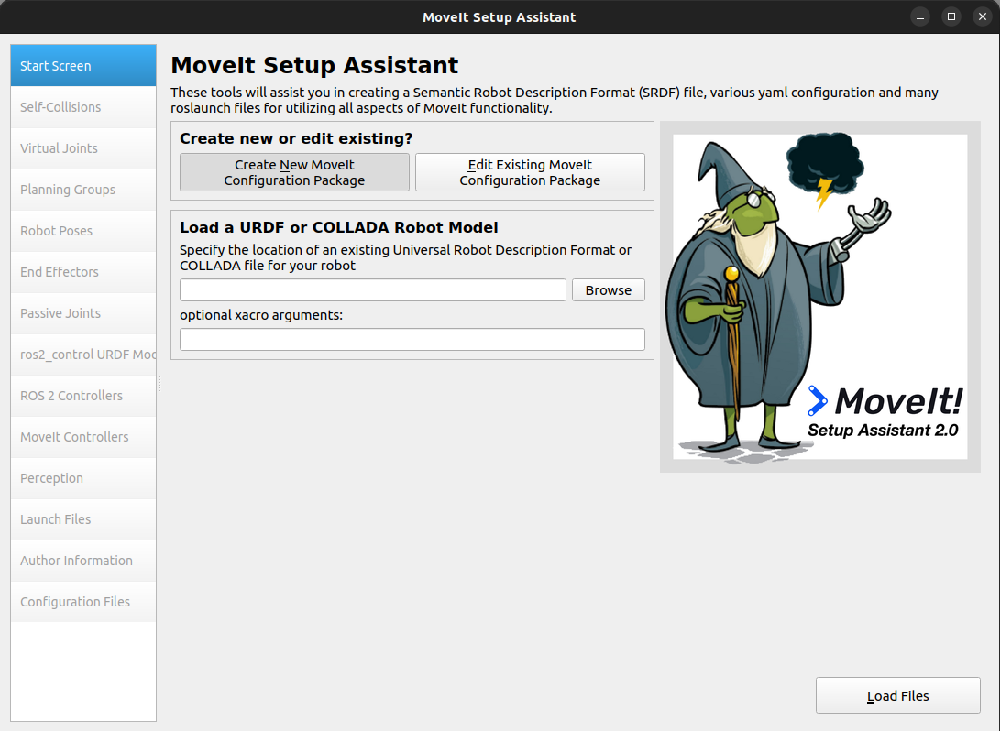

- 新建：`Create New MoveIt Configuration Package` -> `Browse` -> 选择`urdf` -> `Load Files`
- 编辑已有的包：选择包文件夹

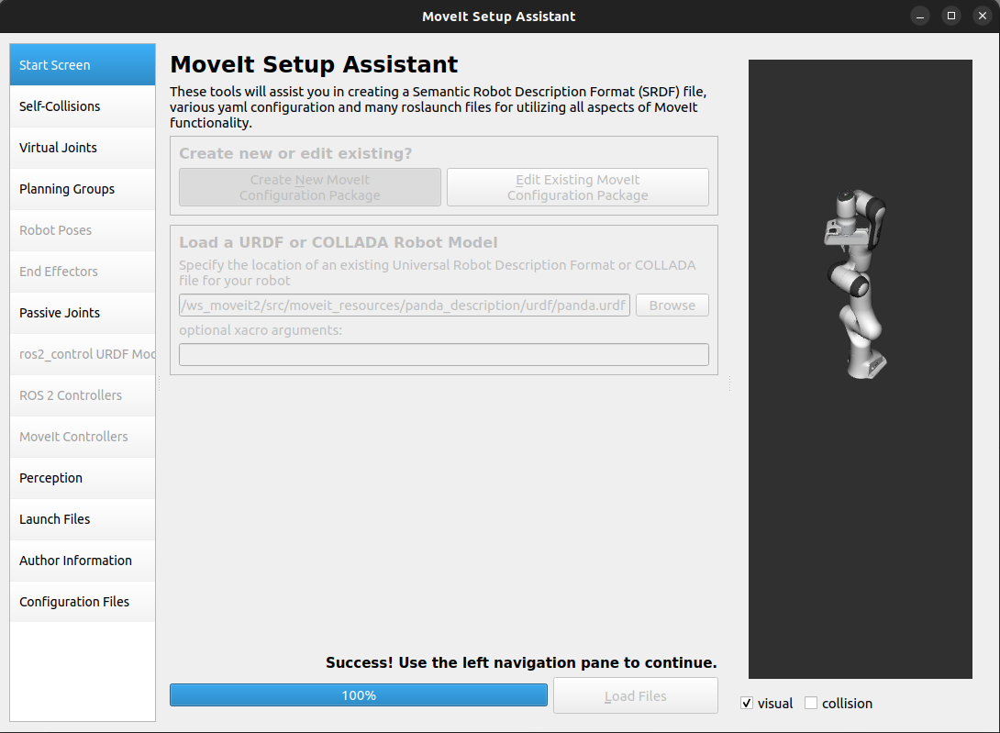

### 步骤2：生成自碰撞矩阵

默认的 "自碰撞矩阵 "生成器可通过禁用机器人上已知安全的链接对的碰撞检查，帮助减少运动规划时间。 具体方法是确定哪些链接对始终处于碰撞状态、从不处于碰撞状态、在机器人默认位置处于碰撞状态或在运动学链上彼此相邻。 

您可以设置抽样密度，它决定了对多少个随机机器人位置进行自碰撞检查。 虽然生成器默认检查 10,000 个随机位置，但建议使用最大采样密度值，以确保获得更精确的结果。 碰撞检查是并行进行的，以减少生成碰撞矩阵的整体处理时间。 

要生成碰撞矩阵，请选择 `MoveIt` 设置助手左侧的 "`Self-Collisions`" 窗格，并调整自碰撞采样密度。 然后点击 "`Generate Collision Matrix`"按钮启动计算。 设置助手需要几秒钟来计算自碰撞矩阵，其中包括检查可以安全禁用碰撞检查的链路对。

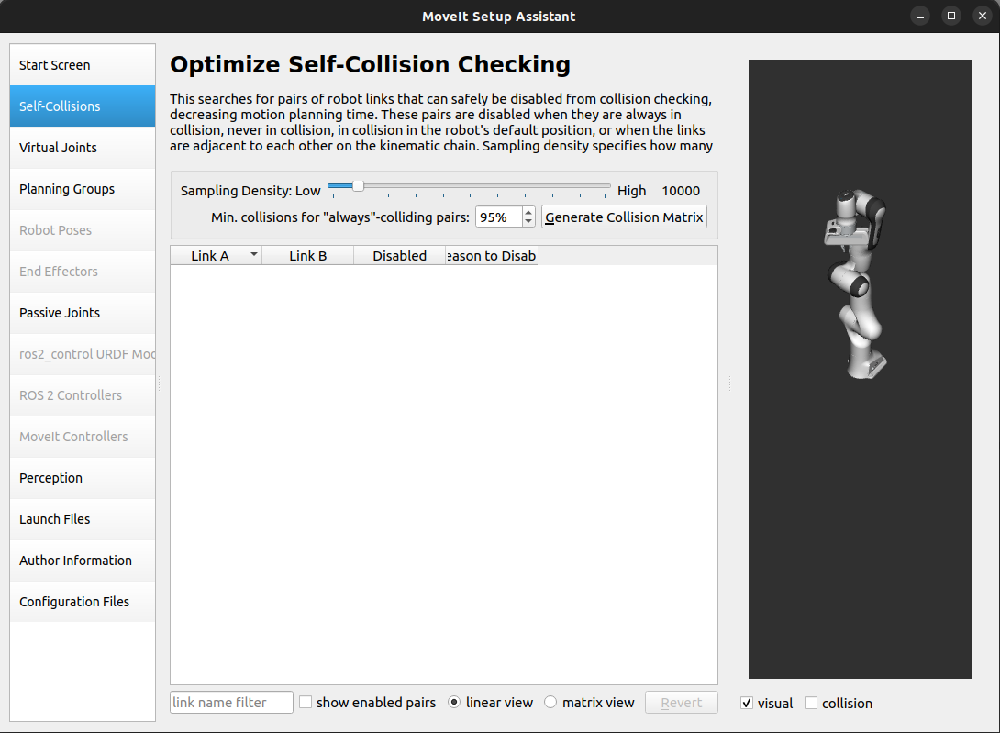

计算完成后，结果将显示在主表中。 该表显示了通过碰撞检查确定为安全或不安全的链路对。 安全禁用的链路用复选标记标出。 您可以根据需要手动调整复选标记，以启用或禁用特定链路对的自碰撞检查。

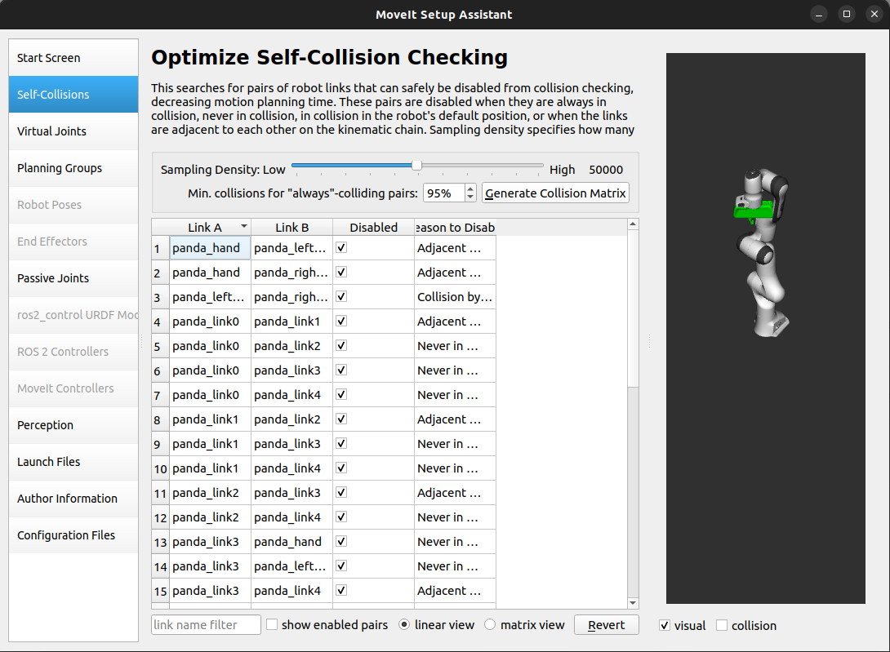

### 步骤3：添加虚拟关节

虚拟关节主要用于连接机器人与世界。 熊猫机械臂是一个固定基座的机械手，定义一个固定虚拟关节是可选的。 不过，我们将定义一个固定虚拟关节，将机械臂的 `panda_link0` 连接到世界帧。 这个虚拟关节表示手臂的基座在世界帧中保持静止。

- 点击左侧`Virtual Joints` -> `Add Virtual Joint`
- 设置关节名称`virtual_joint`.
- 设置子帧 `panda_link0` 和父帧`world`
- 设置类型为`fixed`
- 点击`Save`保存

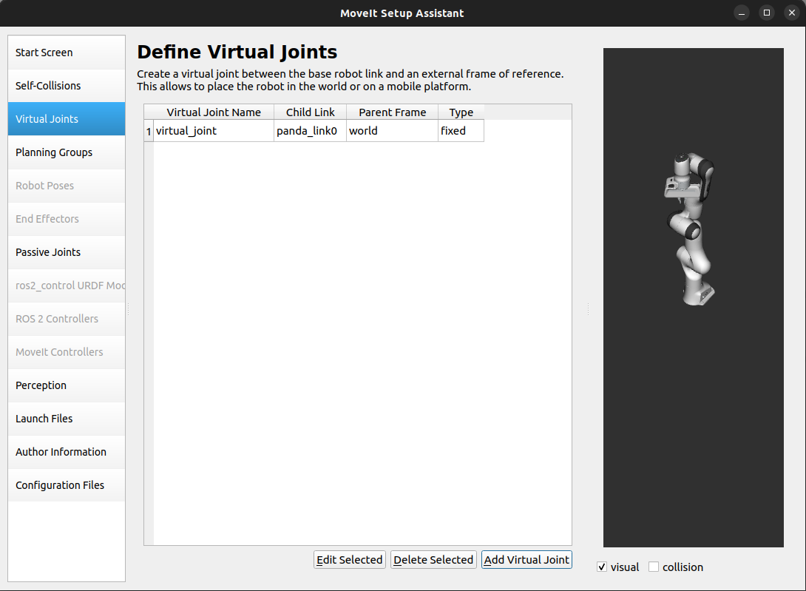

> 虚拟关节对具有移动基座的机器人（如移动机械手）尤其有益。 虚拟关节可以模拟机器人底座的运动，这对运动规划和控制至关重要。 例如，虚拟平面关节可用于连接机器人底座框架和里程测量框架，从而有效地表示机器人在环境中的运动。

### 步骤4：设置规划组

MoveIt 中的规划组从语义上描述了机器人的不同部分，如手臂或末端效应器，以方便进行运动规划。 

移动组可配置为与机器人上的特定运动链相对应，运动链是一组链接和关节，定义了从机器人底座到末端效应器的转换序列。 例如，可以定义一个移动组来表示机器人的手臂，它由移动手臂所需的所有链接和关节组成。 

移动组也可以由机器人上对应的链接或关节集来表示。 例如，可以定义一个移动组来表示机器人的抓手，该组由所有必要的链接或关节组成，它们一起移动以实现抓手的打开或关闭动作。

- 点击左侧`Planning Groups` -> `Add Group`

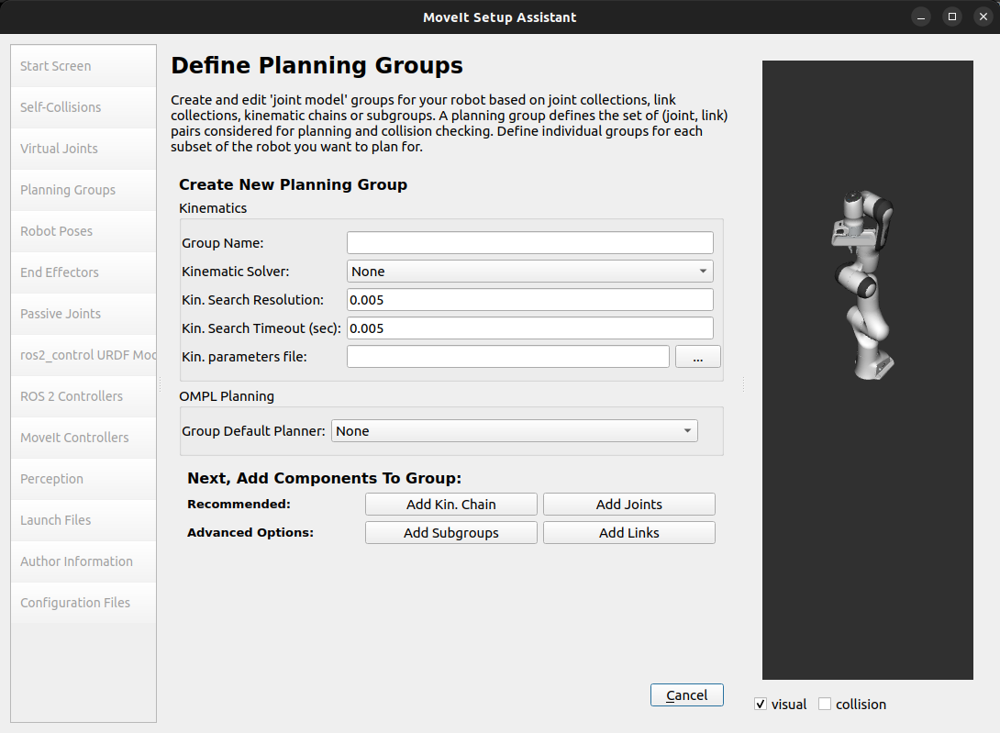

- 添加手臂为一个规划组
  - 设置组名称`panda_arm`
  - 选择`kdl_kinematics_plugin/KDLKinematicsPlugin`作为运动学求解器，这是`Moveit`默认的，你也可以选择`IKFast` 或 `pick_ik.`
  - `Kin. Search Resolution`和`Kin. Search Timeout`保持默认值

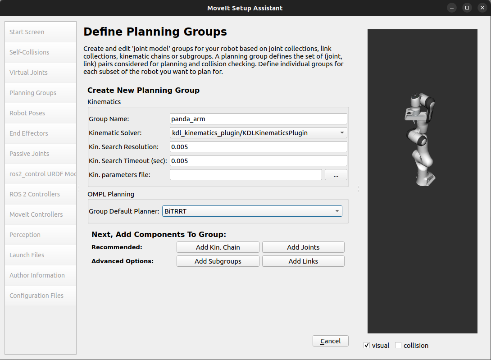

- 现在，点击`Add Joints`按钮。 你将看到左侧的关节列表。 您需要选择属于手臂的所有关节，并将它们添加到右侧。 关节将按照内部树形结构中的存储顺序排列。 这样就可以方便地选择一系列关节。
  - 点击 `virtual_joint`，按住键盘上的 `Shift` 键，然后点击 `panda_joint8`。 现在点击 `>` 按钮，将这些关节添加到右侧的 "已选关节 "列表中。

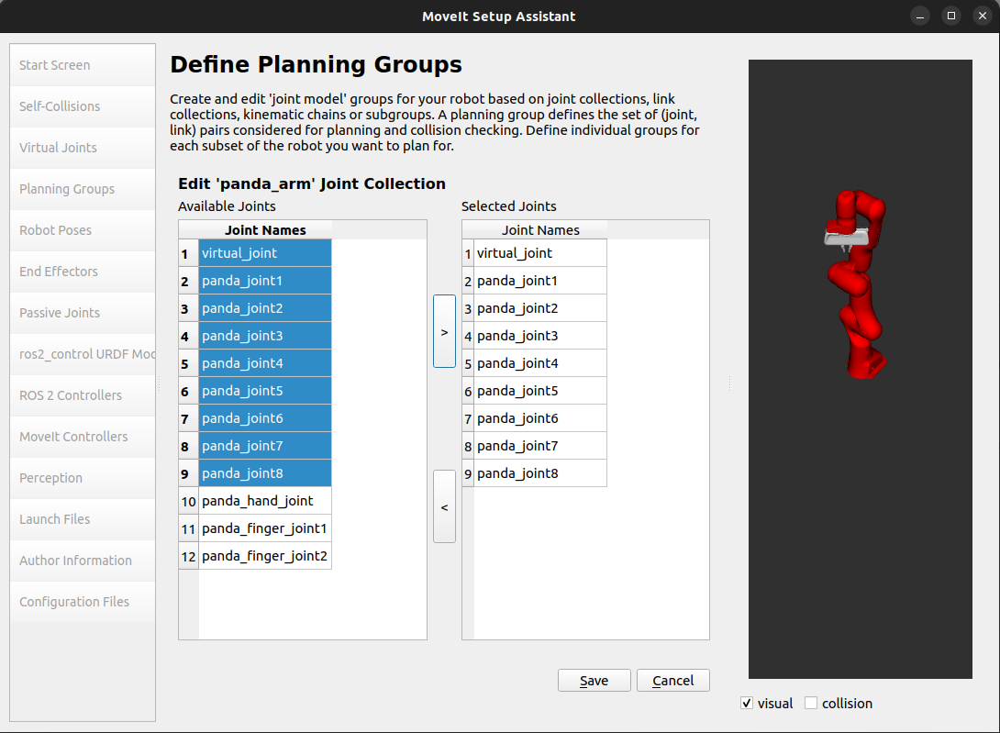

- 点击`Save`保存

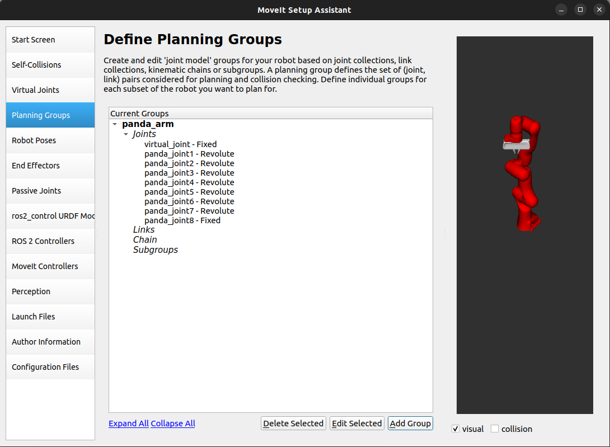

- 添加末端执行器为一个规划组

> 末端执行器并不是由连接成串行链的链节组成的。 因此，该组的运动学求解器`Kinematic Solver`应设置为 "无"。

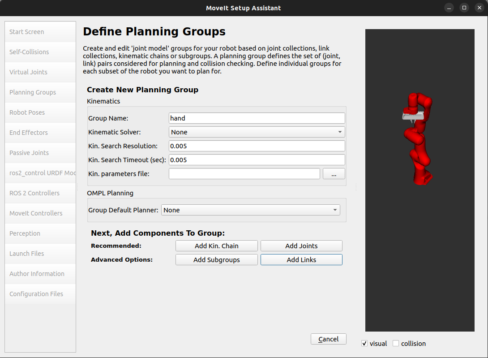

- 末端执行器设置步骤
  - 点击`Add Groups`按钮。
  - 设置组名称`hand`。
  - 保持`Kinematic Solver`为默认值`None`。
  - 保持`Kin. Search Resolution`和`Kin. Search Timeout`为默认值。
  - 点击`Add Links`按钮。
  - 选择`panda_hand`，`panda_leftfinger`和`panda_rightfinger`，并将它们添加到右侧的`Selected Links`列表中。
  - 点击`Save`保存。

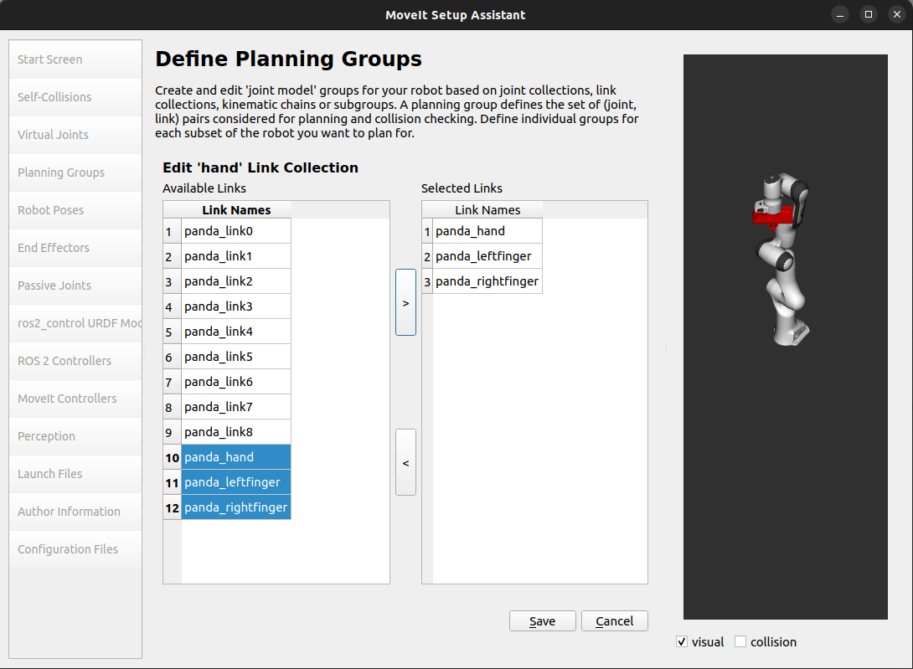

- 手臂和末端执行器都添加完成后，效果如下

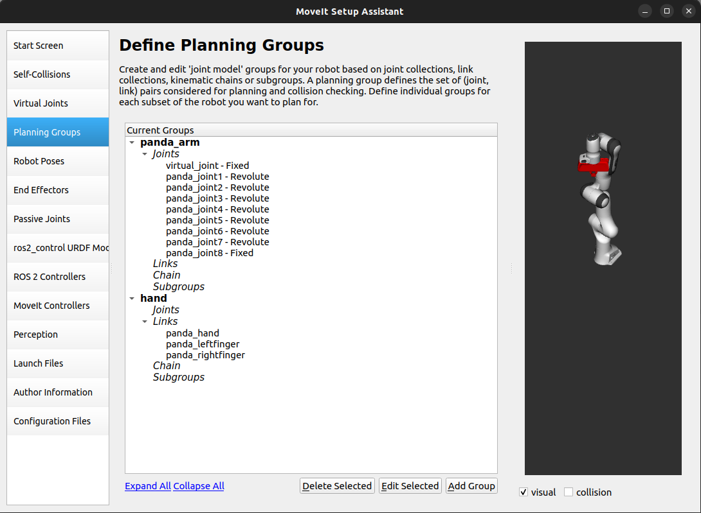

> 通过添加子组（`Add Subgroup`）选项，可以建立由其他移动组组成的移动组。 在需要同时控制多个移动组的情况下，例如在规划多臂系统的同步运动时，这样做会很有帮助。

### 步骤5：添加机器人位姿

设置助手允许您在机器人配置中添加预定义姿势，这对于定义特定的初始姿势或准备姿势非常有用。 之后，可以使用 `MoveIt API` 命令机器人移动到这些姿势。

- 点击左侧`Robot Poses`
- 点击`Add Pose`，设置名称为`ready`，并设置关节值为`{0.0, -0.785, 0.0, -2.356, 0.0, 1.571, 0.785}`，- 注意位姿是与特定规划组关联的。 您可以为每个组保存单独的姿势。点击`Save`保存
> 重要提示：尝试移动所有关节。 如果您的 URDF 中的关节限制有问题，您应该可以在这里立即看到。

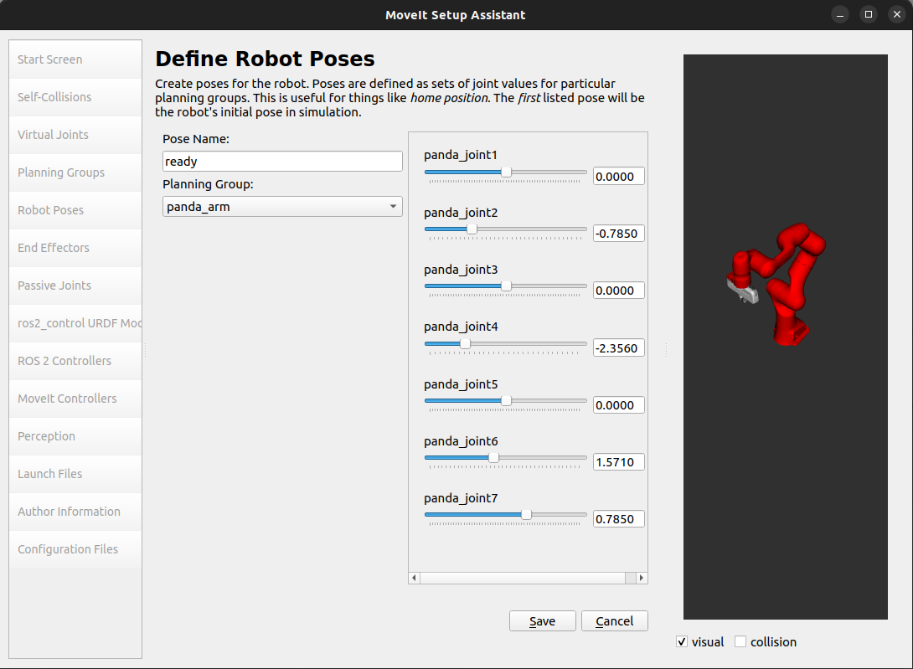

- 添加一个末端执行器位姿，选择`hand`规划组，设置名称为`open`，并设置关节值为`{0.035}`，点击`Save`保存

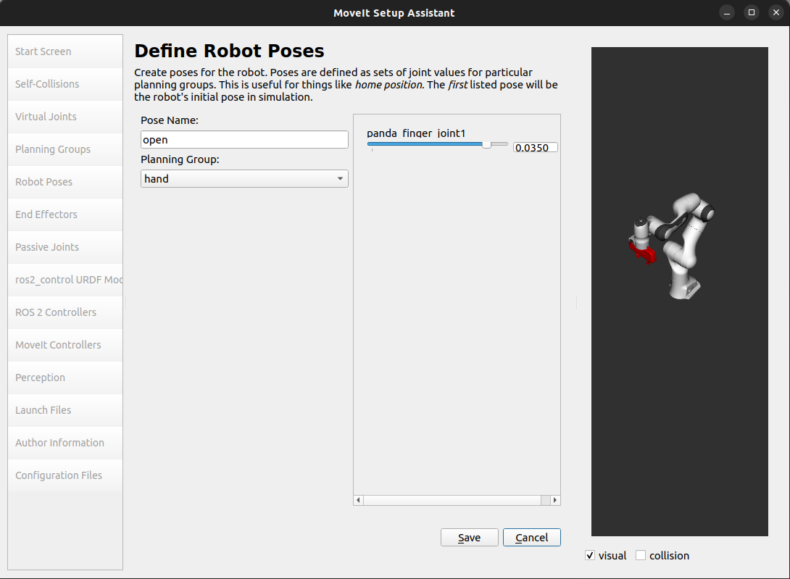

- 添加一个末端执行器位姿，选择`hand`规划组，设置名称为`close`，并设置关节值为`{0.0}`，点击`Save`保存

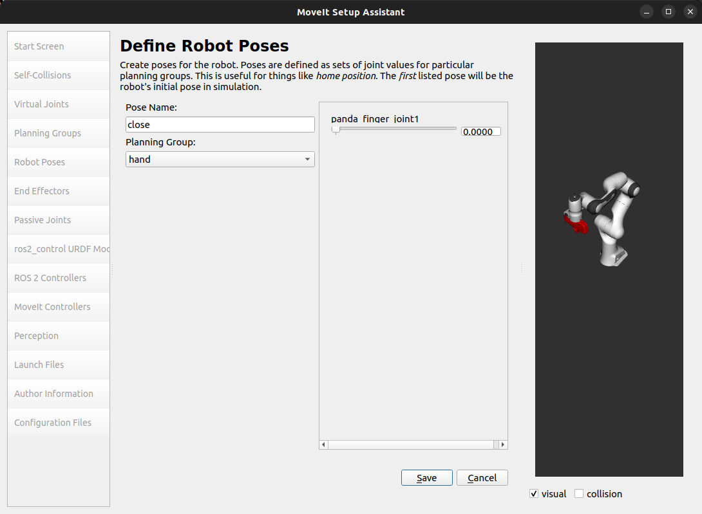

> 只有 `panda_finger_joint1` 出现在列表中，因为 `panda_finger_joint2` 模拟了它的值。

- 添加完成后，效果如下

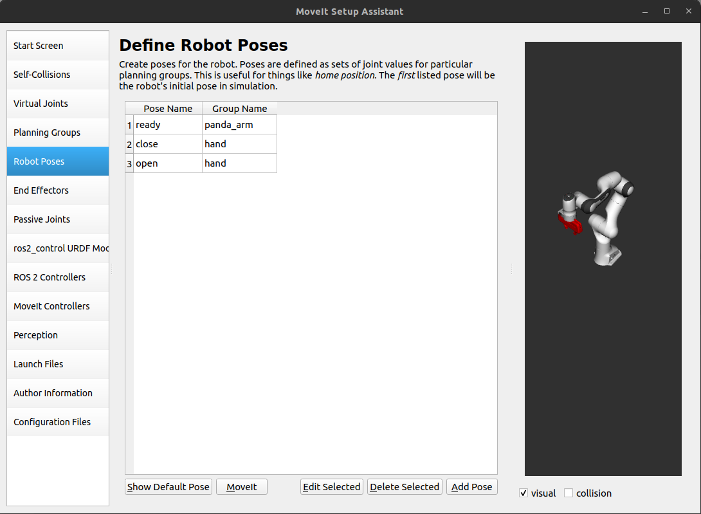

### 步骤6：标签末端效应器

既然我们已经将熊猫的手添加为一个移动组，那么我们就可以将它指定为终端执行器。 `将一个移动组指定为末端执行器后，MoveIt` 就可以对其执行某些特殊操作。 例如，在执行拾放任务时，末端执行器可用于将物体附着在手臂上。

- 点击`End Effectors`标签页
- 点击`Add End Effector`按钮
- 设置名称为`hand`
- 选择`hand`作为末端执行器组
- 选择`panda_link8`作为末端执行器父链接
- `Parent Group`保持为空
- 点击`Save`保存  

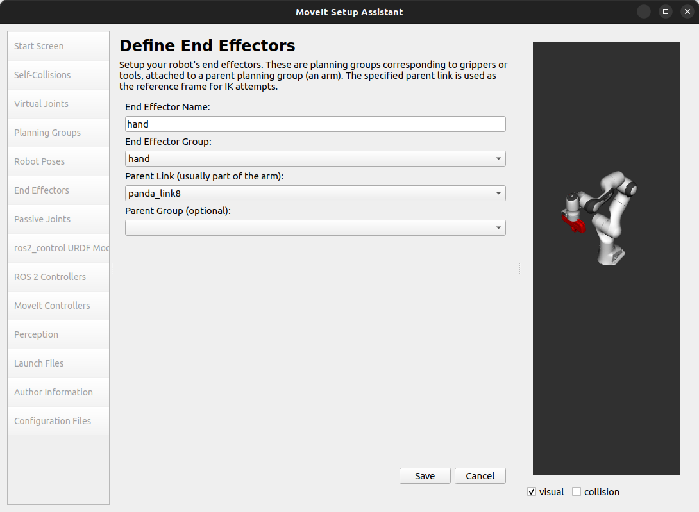

### 步骤7：添加被动关节

被动关节窗格用于指定机器人中可能存在的任何被动关节。 这些关节是无驱动的，也就是说无法直接控制。 指定被动关节非常重要，这样规划人员才能意识到它们的存在，并避免为它们进行规划。 如果规划器不知道被动关节的存在，它们可能会尝试规划涉及移动被动关节的轨迹，这将导致规划无效。 熊猫机器人手臂没有任何被动关节，因此我们将跳过这一步。


### 步骤8： ros2_control修改 URDF

`ros2_control URDF` 修改窗格有助于修改机器人 `URDF`，以便与 [`ros2_control`](https://control.ros.org/master/index.html) 配合使用。

> 如果机器人的 `URDF/xacro` 已包含 `ros2_control.xacro`，则可跳过此步骤。

此修改为已定义的移动组中的每个关节添加了命令和状态接口标签。 命令接口（`command_interface`）标签定义了可用于控制关节的命令类型。 `state_interface` 标签定义了可从关节读取的状态信息类型。

在默认情况下，`MoveIt` 设置助手会选定命令界面中的位置以及状态界面的位置和速度，我们将继续进行此设置。

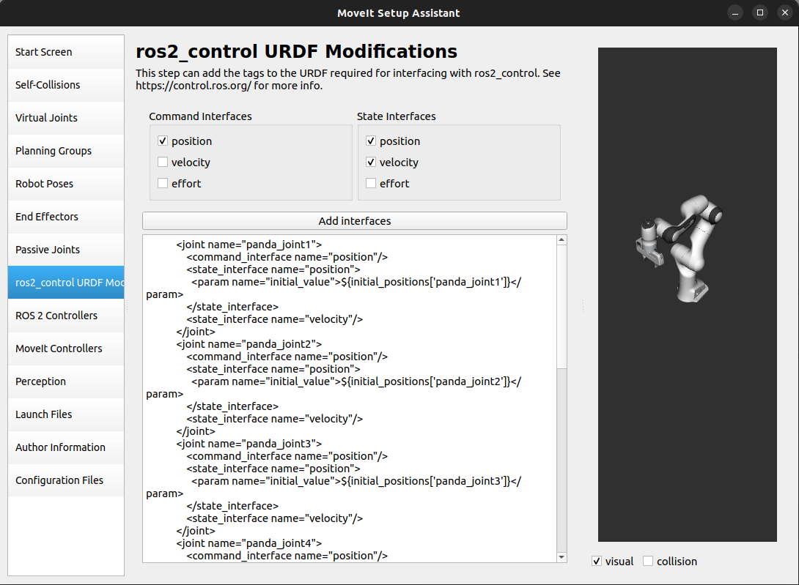

如有必要，为机器人关节选择所需的命令或状态接口，然后单击 "`Add Interfaces`"按钮。

### 步骤9：ROS2 Controllers

`ROS2 Control `是一个用于实时控制机器人的框架，旨在管理和简化新机器人硬件的集成。 更多详情，请参阅 [`ros2_control`](https://control.ros.org/master/index.html) 文档。 `ROS2` 控制器窗格可用于自动生成模拟控制器，以驱动机器人关节。

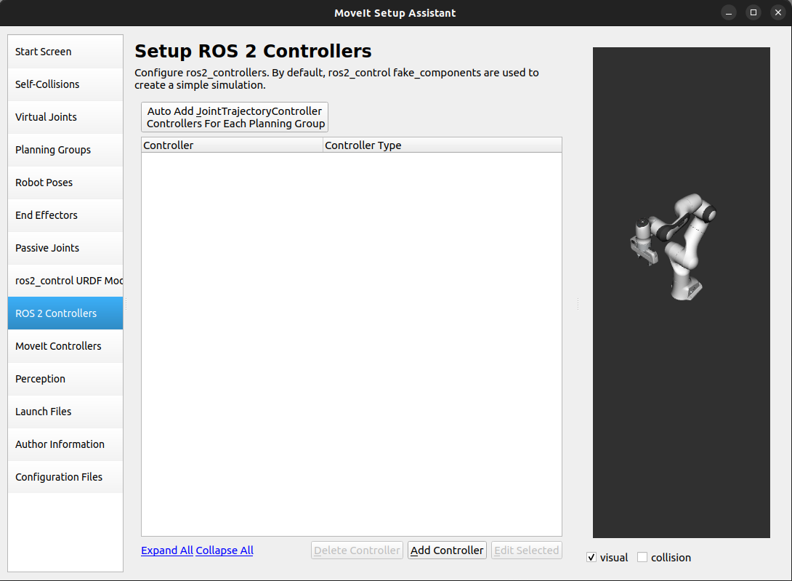

- 点击`ROS 2 Controllers`标签页
- 点击`Add Controller`按钮
- 设置名称为`panda_arm_controller`
- 选择`joint_trajectory_controller/JointTrajectoryController `作为控制类型

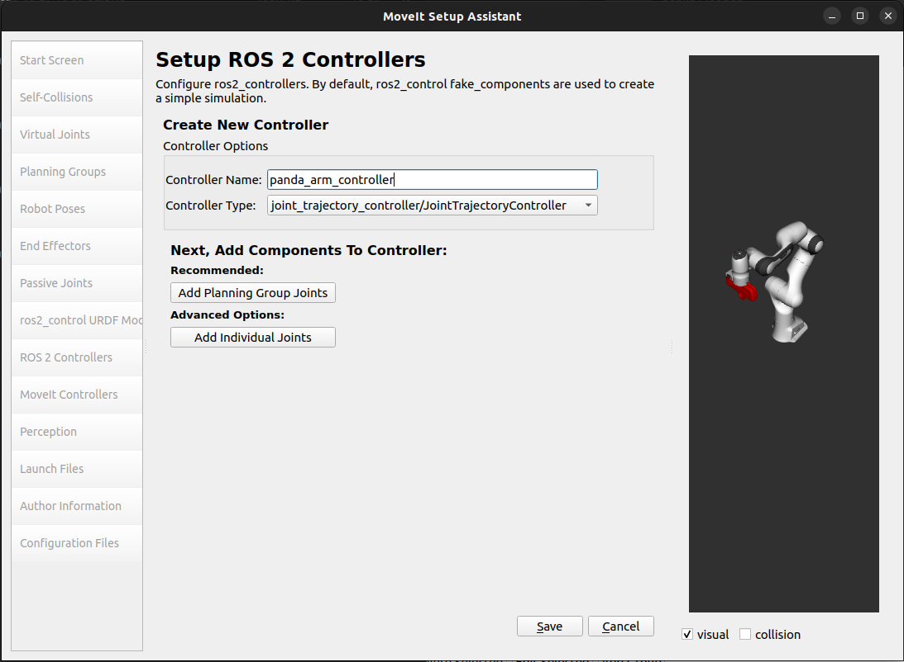

- 接下来，我们需要选择控制器关节。关节可以单独添加，也可以通过移动组添加。
- 点击`Add Planning Group Joints`
- 选择`panda_arm`组，点击`>`添加到`Selected Groups`
- 点击`Save`保存

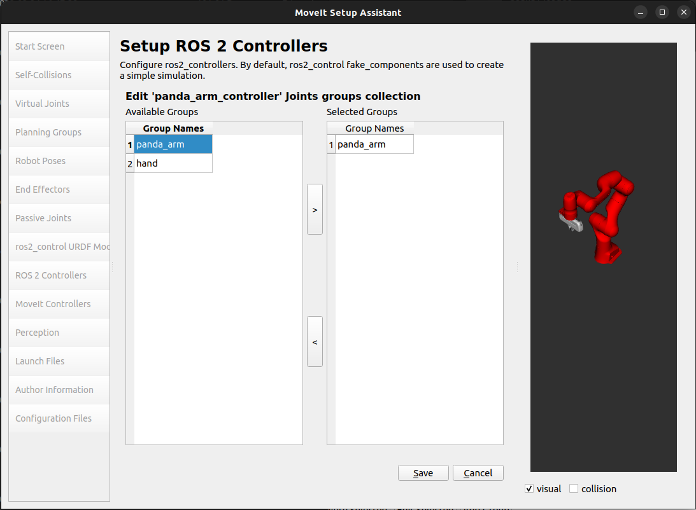

- 添加手控制器
- 跟手臂一样，但是控制器类型选择`position_controllers/GripperActionController`

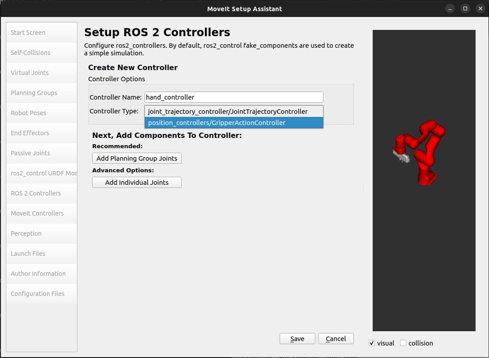

- 选择`hand`组，点击`>`添加到`Selected Groups`
- 点击`Save`保存

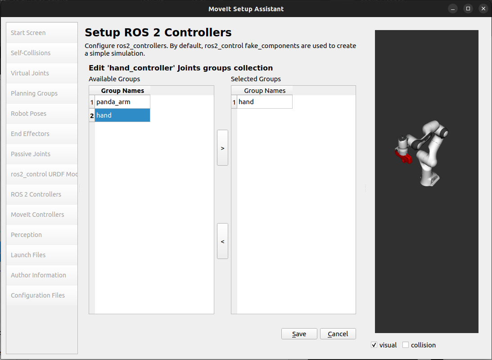

- 最终效果

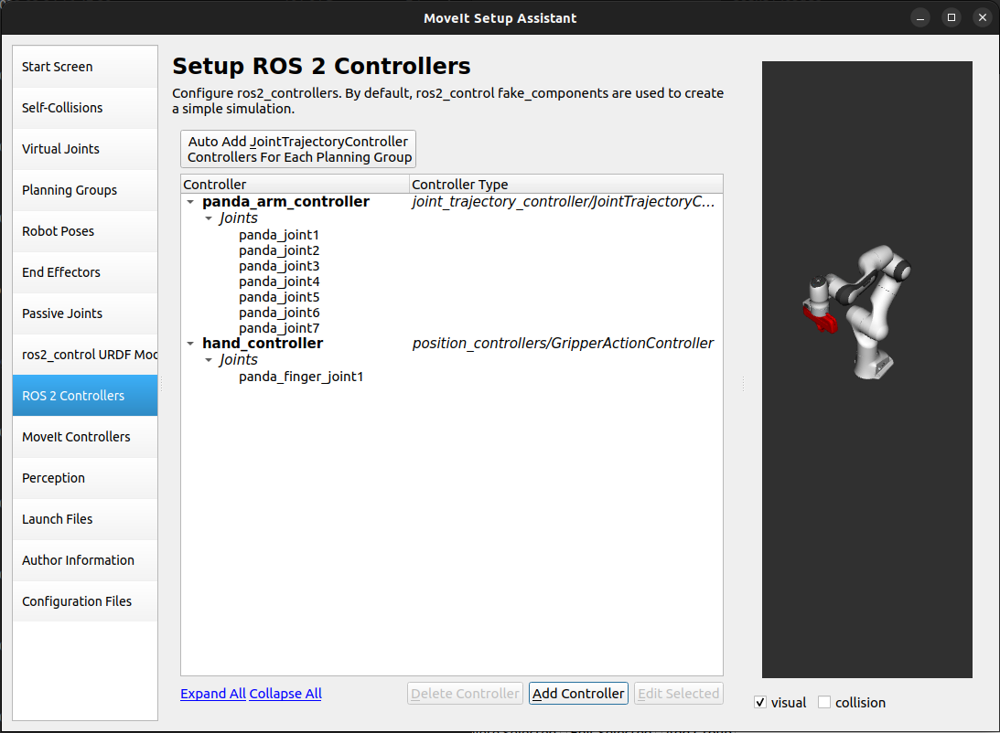

### 步骤10：MoveIt Controllers

`MoveIt` 需要带有 `FollowJointTrajectoryAction` 接口的轨迹控制器来执行计划轨迹。 该接口将生成的轨迹发送至机器人 `ROS2` 控制器。

`MoveIt Controllers` 面板可用于自动生成 `MoveIt` 控制器管理器使用的控制器。 确保控制器名称与之前 `ROS2` 控制器步骤中配置的名称一致。 此步骤的用户界面与前一步类似。

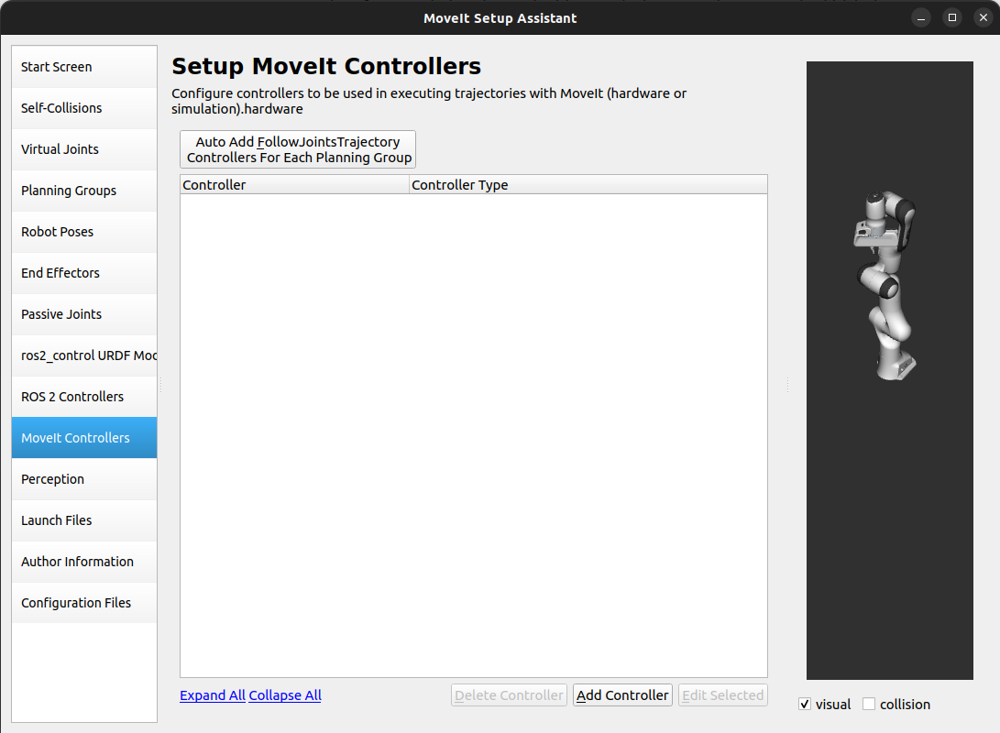

- 添加手臂控制器
  - 点击`MoveIt Controllers`面板
  - 点击`Add Controller`按钮
  - 设置`Controller Name`为`panda_arm_controller`
  - 选择`FollowJointTrajectory`作为控制器类型
  - 点击`Add Planning Group Joints`（也可单独添加关节）
  - 选择`panda_arm`组，点击`>`添加到`Selected Groups`
  - 点击`Save`保存

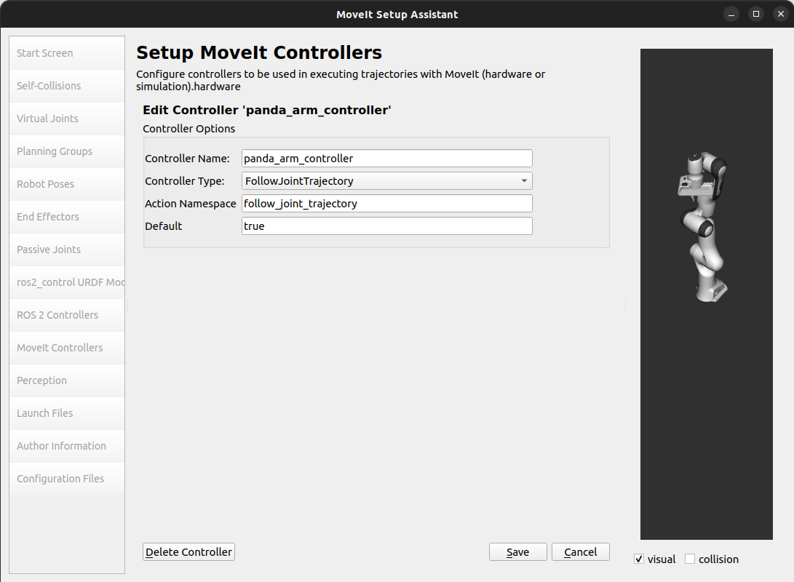

- 添加手控制器
  - 点击`Add Controller`按钮
  - 设置`Controller Name`为`hand_controller`
  - 选择`Gripper Command`作为控制器类型
  - 点击`Add Planning Group Joints`（也可单独添加关节）
  - 选择`hand`组，点击`>`添加到`Selected Groups`
  - 点击`Save`保存

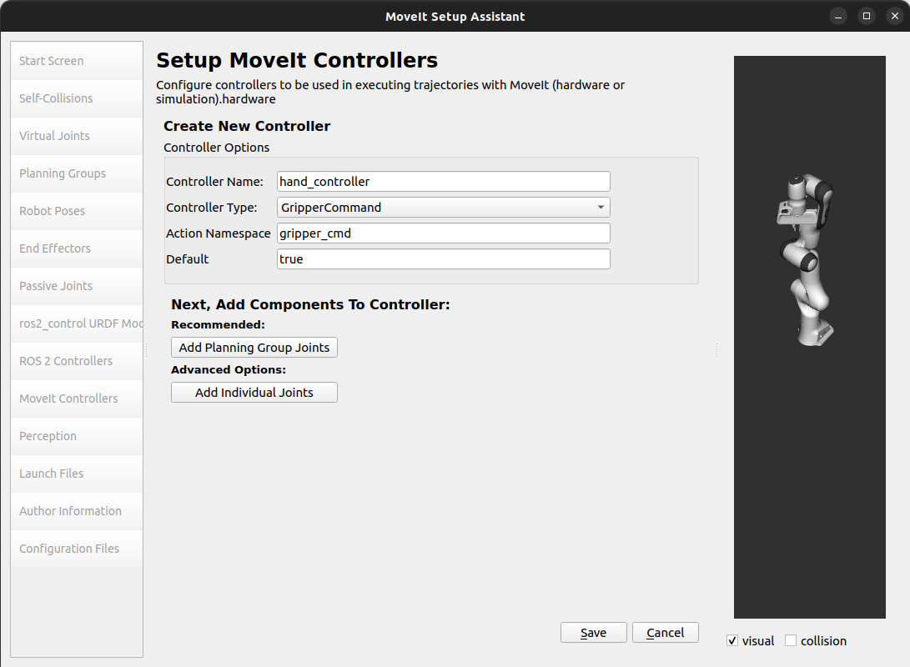

- 最终效果

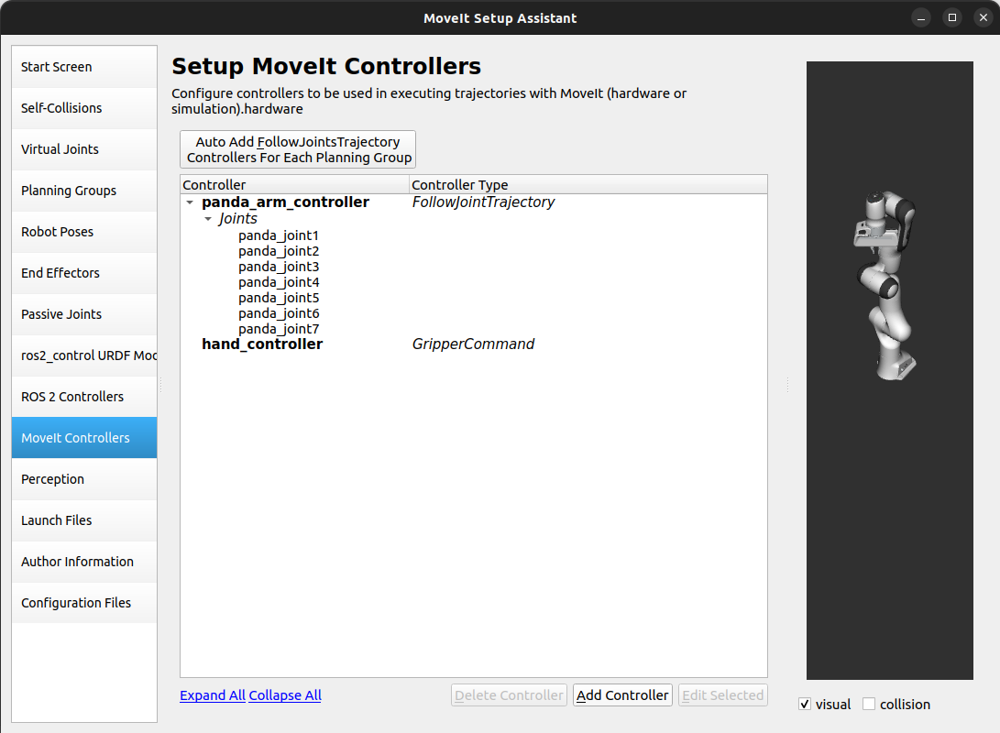

### 步骤11：感知

配置助手中的 "感知 "选项卡用于配置机器人使用的 3D 传感器的设置。 这些设置保存在名为 `sensors_3d.yaml` 的 `YAML` 配置文件中。 如果不需要 `sensors_3d.yaml`，请选择 "无 "并进入下一步。


要生成 `point_cloud` 配置参数，请参阅下面的示例：

> 该配置不适用于熊猫机械臂，因为它没有头戴式 `kinect` 摄像头。

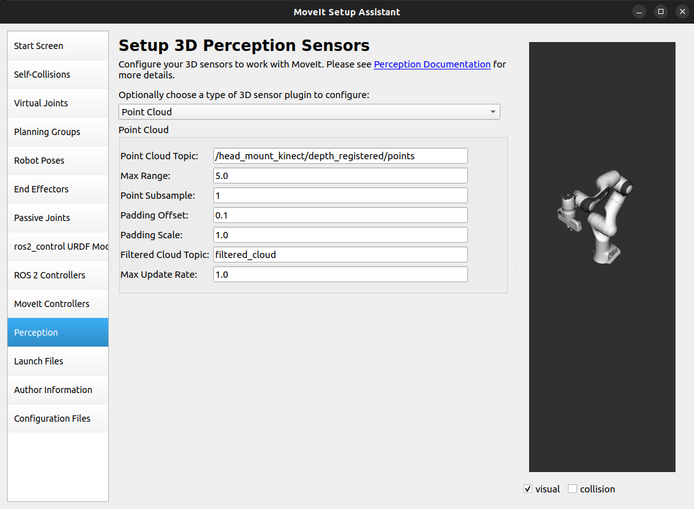

有关这些参数的更多详情，请参阅 [`Perception Pipeline`](https://moveit.picknik.ai/main/doc/examples/perception_pipeline/perception_pipeline_tutorial.html) 教程。

### 步骤12：启动文件

在 "启动文件 "窗格中，您可以查看将生成的启动文件列表。 默认选项通常就足够了，但如果您对自己的应用程序有特殊要求，可以根据需要进行更改。 点击每个文件可查看其功能摘要。

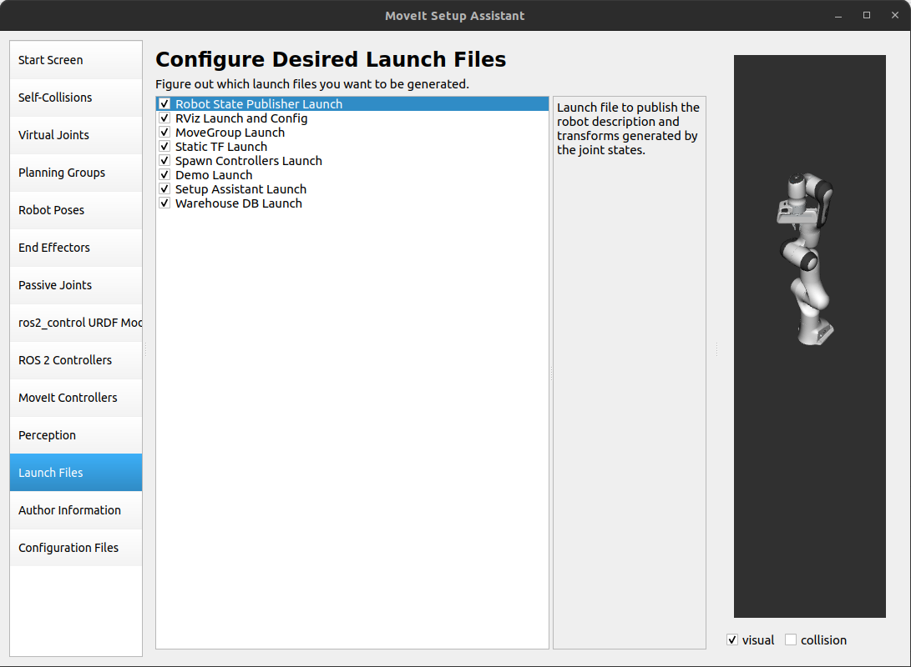

### 步骤13：添加作者信息

`Colcon` 要求提供作者信息以便出版。 点击 "作者信息 "窗格，输入您的姓名和电子邮件地址。

### 步骤14：生成配置文件

- 点击 "`Configuration Files`"窗格。 为即将生成的包含新配置文件的 `ROS2` 软件包选择位置和名称。 点击 "`Browse`"，选择一个合适的位置（例如，你的 ROS2 工作区的 src 目录），点击 "`Create Folder`"，将其命名为 `panda_moveit_config`，然后点击 "打开"。 所有生成的文件将直接进入你选择的目录。

- 单击 "`Generate Package`"按钮。 现在，安装助手将在您选择的目录下生成一组启动和配置文件。 所有生成的文件都将显示在 "待生成文件 "选项卡中，您可以点击每个文件查看它们的说明。 有关生成文件的更多信息，请参阅文档中的 "[配置(https://moveit.picknik.ai/main/doc/examples/examples.html)]"部分。

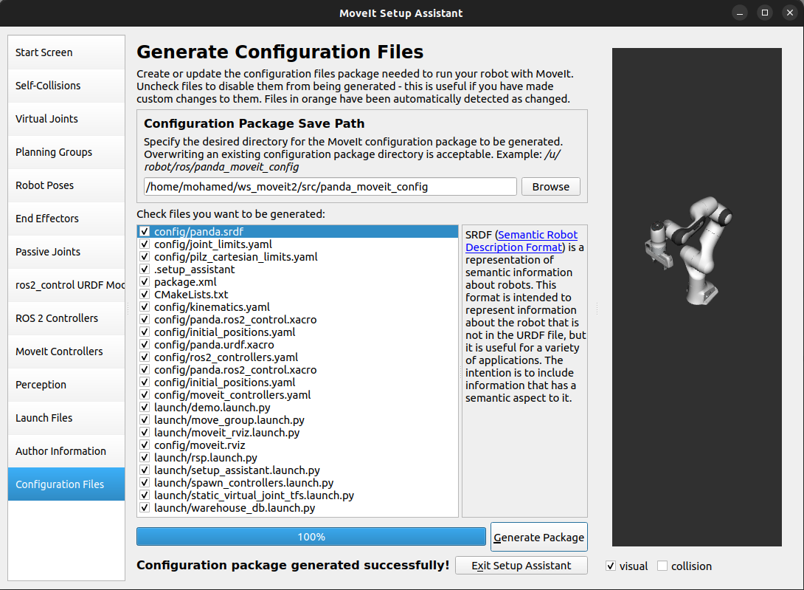


## 编译运行

```shell
cd ~/ws_moveit2
colcon build --packages-select panda_moveit_config
source install/setup.bash

ros2 launch panda_moveit_config demo.launch.py
```

## 更多阅读

- 使用 RViz 开始 MoveIt 运动规划 了解如何在 RViz 中使用生成的配置文件来规划和可视化 MoveIt 运动。 请查看[Rviz中的MoveIt快速入门教程](https://moveit.picknik.ai/main/doc/tutorials/quickstart_in_rviz/quickstart_in_rviz_tutorial.html)，以获取分步指南。 

- 编写您的第一个C++ MoveIt应用程序 通过[本教程](https://moveit.picknik.ai/main/doc/tutorials/your_first_project/your_first_project.html)，编写您的第一个使用MoveIt的C++应用程序，熟悉`MoveGroupInterface`，并使用它来规划、执行和可视化[本示例](https://moveit.picknik.ai/main/doc/examples/move_group_interface/move_group_interface_tutorial.html)中的机器人运动规划。 

- URDF与SRDF： 了解区别 请参阅[URDF和SRDF](https://moveit.picknik.ai/main/doc/examples/urdf_srdf/urdf_srdf_tutorial.html)页面，了解本教程中提到的URDF和SRDF组件的更多详情。 

- 探索可用的逆运动学求解器 除了默认的KDL求解器之外，还有其他可用的IK求解器。 更多信息，请参阅 [`IKFast`](https://moveit.picknik.ai/main/doc/examples/ikfast/ikfast_tutorial.html) 和 [`pick_ik`](https://github.com/PickNikRobotics/pick_ik)。

## 问题

### 问题1：`urdf` 文件的 `robot name` 不要有反斜杠

```xml
<!-- <robot name="manipulator_bringup/urdf/6dof"> -->   // 错误形式，生成的配置文件会因为反斜杠无法运行
<robot name="orca">
  <link name="world"/>
</robot>
```

### 问题2

```text
[rviz2-3] [ERROR] [1740131601.699043749] [rviz2]: PluginlibFactory: The plugin for class 'moveit_rviz_plugin/MotionPlanning' failed to load. Error: Failed to load library /opt/ros/humble/lib/libmoveit_motion_planning_rviz_plugin.so. Make sure that you are calling the PLUGINLIB_EXPORT_CLASS macro in the library code, and that names are consistent between this macro and your XML. Error string: Could not load library dlopen error: libgeometric_shapes.so.2.3.2: cannot open shared object file: No such file or directory, at ./src/shared_library.c:99
```

```shell
sudo apt-get install ros-humble-geometric-shapes
```

### 问题3
  
```text
[move_group-2] [INFO] [1740367651.336574261] [moveit_move_group_default_capabilities.execute_trajectory_action_capability]: Received goal request
[move_group-2] [INFO] [1740367651.336648863] [moveit_move_group_default_capabilities.execute_trajectory_action_capability]: Execution request received
[move_group-2] [INFO] [1740367651.336665992] [moveit.plugins.moveit_simple_controller_manager]: Returned 0 controllers in list
[move_group-2] [INFO] [1740367651.336671698] [moveit.plugins.moveit_simple_controller_manager]: Returned 0 controllers in list
[move_group-2] [INFO] [1740367651.336679820] [moveit.plugins.moveit_simple_controller_manager]: Returned 0 controllers in list
[move_group-2] [INFO] [1740367651.336683029] [moveit.plugins.moveit_simple_controller_manager]: Returned 0 controllers in list
[move_group-2] [ERROR] [1740367651.336686973] [moveit_ros.trajectory_execution_manager]: Unable to identify any set of controllers that can actuate the specified joints: [ rjoint1 rjoint2 rjoint3 rjoint4 rjoint5 rjoint6 rjoint7 ]
[move_group-2] [ERROR] [1740367651.336690596] [moveit_ros.trajectory_execution_manager]: Known controllers and their joints:
```

- 解决：[修改`moveit_controllers.yaml`](https://github.com/moveit/moveit2/issues/1514)

```yaml
# MoveIt uses this configuration for controller management

moveit_controller_manager: moveit_simple_controller_manager/MoveItSimpleControllerManager

moveit_simple_controller_manager:
  controller_names:
    - orca_right_arm_controller

  orca_right_arm_controller:
    type: FollowJointTrajectory
    joints:
      - rjoint1
      - rjoint2
      - rjoint3
      - rjoint4
      - rjoint5
      - rjoint6
      - rjoint7
    # 添加下面两行
    action_ns: follow_joint_trajectory  
    default: true
```

### 问题4

- `Plan`规划后动画一直播放
- 解决：`rviz2` 中取消勾选 `MotionPlanning` -> `Planed Path` -> `Loop Animation`