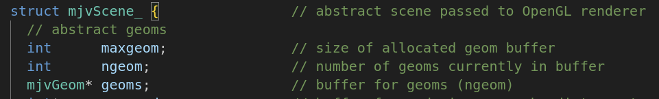
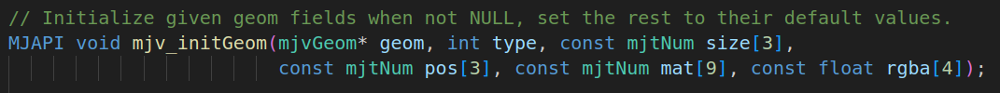
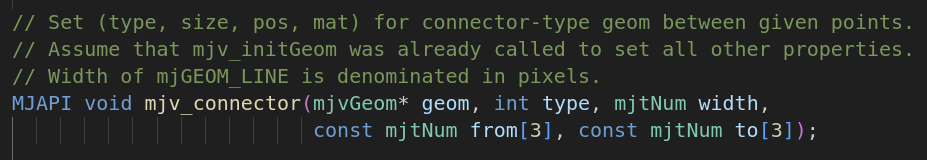
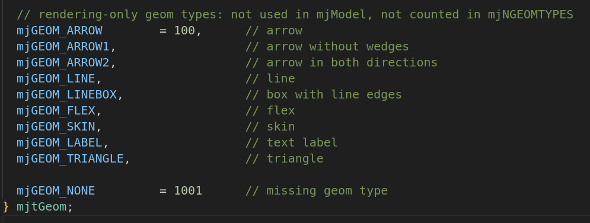

###### datetime:2025/01/10 14:45

###### author:nzb

> 该项目来源于[mujoco_learning](https://github.com/Albusgive/mujoco_learning)

# 3D绘制

`mujoco` 提供显示基础几何体和 `mujoco` 提供的一些特殊渲染几何体。查看文档可知 `mjv_initGeom` 函数能在渲染场景中增加几何体，`mjv_connector`可以用`mjv_initGeom`初始化的几何体绘制提供的一些特殊形状（如箭头，直线等）。

`mujoco` 显示画面的原理是通过 `mjv_updateScene` 将仿真数据储存到 `mjvScene` 中，这是已经处理好的几何数据，接下来使用 `mjr_render` 传递给 `opengl` 渲染。我们在绘制过程中是要在仿真的几何数据处理完之后，加入绘制信息，再交给 `opengl` 渲染。

在 `mjvScene` 中添加信息，其实是直接在 `mjvScene` 的 `geoms` 后面续写，而且要增加 `ngeom` 长度。这里通过注释可以理解， `mjvScene` 根据 `ngeom` 确定几何体数量再从 `geoms` 中获取资源。



初始化几何体`mjv_initGeom`函数原型：



`mjv_connector`函数原型：



`geom`是传入的仅绘制的几何体，需要使用`mjv_initGeom`初始化，`type`见下面，`width`是绘制的宽度，这个是对于

渲染出来的画面的宽度，`from`起点，`to`终点



这里是可以绘制的几何形状类型，分别是箭头，无楔形箭头，双向箭头，直线。

<font color=Green>*演示——绘制几何体函数：*</font>

```C++
void draw_geom(mjvScene *scn, int type,mjtNum *size, mjtNum *pos,mjtNum* mat, float rgba[4]) {
  scn->ngeom += 1;
  mjvGeom *geom = scn->geoms + scn->ngeom - 1;
  mjv_initGeom(geom, type, size, pos, mat, rgba);
}
......
mjtNum size[3] = {0.3, 0, 0};
mjtNum pos[3] = {0, 0, 1.0};
mjtNum mat[9] = {1, 0, 0, 0, 1, 0, 0, 0, 1};
draw_geom(&scn, mjGEOM_SPHERE,size, pos, mat, color);
```

<font color=Green>*演示——绘制直线函数：*</font>

```C++
void draw_line(mjvScene *scn, mjtNum *from, mjtNum *to, mjtNum width,
               float* rgba) {
  scn->ngeom += 1;
  mjvGeom *geom = scn->geoms + scn->ngeom - 1;
  mjv_initGeom(geom, mjGEOM_SPHERE, NULL, NULL, NULL, rgba);
  mjv_connector(geom, mjGEOM_LINE, width, from, to);
}
......
mjtNum from[3] = {0, 0, 0};
mjtNum to[3] = {0, 1, 1};
float color[4] = {0, 1, 0, 1};
draw_line(&scn, from, to, 20, color);
```

<font color=Green>*演示——绘制箭头函数：*</font>

```C++
void draw_arrow(mjvScene *scn, mjtNum *from, mjtNum *to, mjtNum width,
                float rgba[4]) {
  scn->ngeom += 1;
  mjvGeom *geom = scn->geoms + scn->ngeom - 1;
  mjv_initGeom(geom, mjGEOM_SPHERE, NULL, NULL, NULL, rgba);
  mjv_connector(geom, mjGEOM_ARROW, width, from, to);
}
......
mjtNum from[3] = {0, 0, 0};
mjtNum to[3] = {0, 1, 1};
float color[4] = {0, 1, 0, 1};
draw_arrow(&scn, from, to, 20, color);
```

<font color=Green>*使用：*</font>

```C++
mjv_updateScene(m, d, &opt, NULL, &cam, mjCAT_ALL, &scn);
draw_geom(&scn, mjGEOM_SPHERE,size, pos, mat, color);
draw_line(&scn, from, to, color);
draw_arrow(&scn, from, to, 20, color);
mjr_render(viewport, &scn, &con);
```
这里要注意在 mjv_updateScene函数之后，mjr_render函数之前调用。

# 2D绘制
字体尺寸的初始化：

查阅文档我们可知2D绘制要在mjr_render之后进行


<font color=Green>*绘制文本：*</font>

```C++
MJAPI void mjr_text(int font, const char* txt, const mjrContext* con,
                    float x, float y, float r, float g, float b);
```
font:字号，使用mjtFont中定义的    
txt：文本   
con：mjrContext   
x,y:渲染界面比例位置，取值[0-1)   
r,g,b:字体颜色    

<font color=Green>*绘制对应表格（overlay）：*</font>

```C++
MJAPI void mjr_overlay(int font, int gridpos, mjrRect viewport,
                       const char* overlay, const char* overlay2, const mjrContext* con);
```
font:字号，使用mjtFont中定义的    
gridpos：绘制位置，使用mjtGridPos中定义的     
mjrRect：mjrRect，界面矩形  
overlay：第一列     
overlay2：第二列      
con：mjrContext         

<font color=Green>*绘制矩形：*</font>

```C++
MJAPI void mjr_rectangle(mjrRect viewport, float r, float g, float b, float a);
```
mjrRect：mjrRect，矩形      
rgba:颜色   

<font color=Green>*绘制标签：*</font>

```C++
MJAPI void mjr_label(mjrRect viewport, int font, const char* txt,
                     float r, float g, float b, float a, float rt, float gt, float bt,
                     const mjrContext* con);
```
viewport：标签位置    
font:字号，使用mjtFont中定义的    
txt：文本   
rgba:标签底色   
rt,gt,bt:文字颜色   
con：mjrContext   

## 代码

- `draw.cpp`

```C++
#include <cmath>
#include <cstdio>
#include <cstring>

#include <GLFW/glfw3.h>
#include <mujoco/mjvisualize.h>
#include <mujoco/mujoco.h>

#include <iostream>

// MuJoCo data structures
mjModel *m = NULL; // MuJoCo model
mjData *d = NULL;  // MuJoCo data
mjvCamera cam;     // abstract camera
mjvOption opt;     // visualization options
mjvScene scn;      // abstract scene
mjrContext con;    // custom GPU context

// mouse interaction
bool button_left = false;
bool button_middle = false;
bool button_right = false;
double lastx = 0;
double lasty = 0;

// keyboard callback
void keyboard(GLFWwindow *window, int key, int scancdataode, int act,
              int mods) {
  // backspace: reset simulation
  if (act == GLFW_PRESS && key == GLFW_KEY_BACKSPACE) {
    mj_resetData(m, d);
    mj_forward(m, d);
  }
}

// mouse button callback
void mouse_button(GLFWwindow *window, int button, int act, int mods) {
  // update button state
  button_left =
      (glfwGetMouseButton(window, GLFW_MOUSE_BUTTON_LEFT) == GLFW_PRESS);
  button_middle =
      (glfwGetMouseButton(window, GLFW_MOUSE_BUTTON_MIDDLE) == GLFW_PRESS);
  button_right =
      (glfwGetMouseButton(window, GLFW_MOUSE_BUTTON_RIGHT) == GLFW_PRESS);

  // update mouse position
  glfwGetCursorPos(window, &lastx, &lasty);
}

// mouse move callback
void mouse_move(GLFWwindow *window, double xpos, double ypos) {
  // no buttons down: nothing to do
  if (!button_left && !button_middle && !button_right) {
    return;
  }

  // compute mouse displacement, save
  double dx = xpos - lastx;
  double dy = ypos - lasty;
  lastx = xpos;
  lasty = ypos;

  // get current window size
  int width, height;
  glfwGetWindowSize(window, &width, &height);

  // get shift key state
  bool mod_shift = (glfwGetKey(window, GLFW_KEY_LEFT_SHIFT) == GLFW_PRESS ||
                    glfwGetKey(window, GLFW_KEY_RIGHT_SHIFT) == GLFW_PRESS);

  // determine action based on mouse button
  mjtMouse action;
  if (button_right) {
    action = mod_shift ? mjMOUSE_MOVE_H : mjMOUSE_MOVE_V;
  } else if (button_left) {
    action = mod_shift ? mjMOUSE_ROTATE_H : mjMOUSE_ROTATE_V;
  } else {
    action = mjMOUSE_ZOOM;
  }

  // move camera
  mjv_moveCamera(m, action, dx / height, dy / height, &scn, &cam);
}

// scroll callback
void scroll(GLFWwindow *window, double xoffset, double yoffset) {
  // emulate vertical mouse motion = 5% of window height
  mjv_moveCamera(m, mjMOUSE_ZOOM, 0, -0.05 * yoffset, &scn, &cam);
}

std::vector<float> get_sensor_data(const mjModel *model, const mjData *data,
                                   const std::string &sensor_name) {
  int sensor_id = mj_name2id(model, mjOBJ_SENSOR, sensor_name.c_str());
  if (sensor_id == -1) {
    std::cout << "no found sensor" << std::endl;
    return std::vector<float>();
  }
  int data_pos = model->sensor_adr[sensor_id];
  std::vector<float> sensor_data(model->sensor_dim[sensor_id]);
  for (int i = 0; i < sensor_data.size(); i++) {
    sensor_data[i] = data->sensordata[data_pos + i];
  }
  return sensor_data;
}

/*--------绘制直线--------*/
void draw_line(mjvScene *scn, mjtNum *from, mjtNum *to, mjtNum width,
               float *rgba) {
  scn->ngeom += 1;
  mjvGeom *geom = scn->geoms + scn->ngeom - 1;
  mjv_initGeom(geom, mjGEOM_SPHERE, NULL, NULL, NULL, rgba);
  mjv_connector(geom, mjGEOM_LINE, width, from, to);
}

/*--------绘制箭头--------*/
void draw_arrow(mjvScene *scn, mjtNum *from, mjtNum *to, mjtNum width,
                float rgba[4]) {
  scn->ngeom += 1;
  mjvGeom *geom = scn->geoms + scn->ngeom - 1;
  mjv_initGeom(geom, mjGEOM_SPHERE, NULL, NULL, NULL, rgba);
  mjv_connector(geom, mjGEOM_ARROW, width, from, to);
}

/*--------绘制几何体--------*/
void draw_geom(mjvScene *scn, int type, mjtNum *size, mjtNum *pos, mjtNum *mat,
               float rgba[4]) {
  scn->ngeom += 1;
  mjvGeom *geom = scn->geoms + scn->ngeom - 1;
  mjv_initGeom(geom, type, size, pos, mat, rgba);
}

// main function
int main(int argc, const char **argv) {
  char error[1000] = "Could not load binary model";
  m = mj_loadXML("../../../../API-MJCF/mecanum.xml", 0, error, 1000);

  // make data
  d = mj_makeData(m);

  // init GLFW
  if (!glfwInit()) {
    mju_error("Could not initialize GLFW");
  }

  // create window, make OpenGL context current, request v-sync
  GLFWwindow *window = glfwCreateWindow(1200, 900, "Demo", NULL, NULL);
  glfwMakeContextCurrent(window);
  glfwSwapInterval(1);

  // initialize visualization data structures
  mjv_defaultCamera(&cam);
  mjv_defaultOption(&opt);
  mjv_defaultScene(&scn);
  mjr_defaultContext(&con);

  // create scene and context
  mjv_makeScene(m, &scn, 2000);
  mjr_makeContext(m, &con, mjFONTSCALE_150); // 字体大小

  // install GLFW mouse and keyboard callbacks
  glfwSetKeyCallback(window, keyboard);
  glfwSetCursorPosCallback(window, mouse_move);
  glfwSetMouseButtonCallback(window, mouse_button);
  glfwSetScrollCallback(window, scroll);

  float cnt = 0;
  // run main loop, target real-time simulation and 60 fps rendering
  while (!glfwWindowShouldClose(window)) {

    d->ctrl[0] = std::sin(cnt);
    d->ctrl[1] = std::cos(cnt);
    d->ctrl[2] = std::sin(cnt);
    mj_step(m, d);
    cnt += 0.001;

    // get framebuffer viewport
    mjrRect viewport = {0, 0, 0, 0};
    glfwGetFramebufferSize(window, &viewport.width, &viewport.height);

    // update scene and render
    // 在这之后绘制
    mjv_updateScene(m, d, &opt, NULL, &cam, mjCAT_ALL, &scn);
    

    /*--------3D绘制--------*/
    mjtNum from[3] = {0, 1, 1};
    mjtNum to[3] = {0, 3, 4};
    float color[4] = {0, 1, 0, 1};
    draw_line(&scn, from, to, 20, color);
    mjtNum to2[3] = {0, -1, 1};
    float color2[4] = {0, 0, 1, 1};
    draw_arrow(&scn, from, to2, 0.1, color2);

    mjtNum size[3] = {0.1, 0, 0};
    mjtNum pos[3] = {0, 0, 1.0};
    mjtNum mat[9] = {1, 0, 0, 0, 1, 0, 0, 0, 1};//坐标系，空间向量
    draw_geom(&scn, mjGEOM_SPHERE, size, pos, mat, color);
    /*--------3D绘制--------*/

    /*--------速度跟踪--------*/
    auto lin_vel = get_sensor_data(m, d, "base_lin_vel");
    auto base_pos = get_sensor_data(m, d, "base_pos");
    for (int i = 0; i < 3; i++) {
      from[i] = base_pos[i];
      to[i] = base_pos[i] + lin_vel[i] * 5;
    }
    from[2] += 0.5;
    to[2] += 0.5;
    float color3[4] = {0.3, 0.6, 0.3, 0.9};
    draw_arrow(&scn, from, to, 0.1, color3);
    /*--------速度跟踪--------*/

    // 在这之前把要绘制的绘制好
    mjr_render(viewport, &scn, &con);

    /*--------2D绘制--------*/
    mjr_text(mjFONT_NORMAL, "Albusgive", &con, 0, 0.9, 1, 0, 1);
    mjrRect viewport2 = {50, 100, 50, 50};
    mjr_overlay(mjFONT_NORMAL, mjGRID_TOPLEFT, viewport, "github", "Albusgive",
                &con);
    mjr_rectangle(viewport2, 0.5, 0, 1, 0.6);
    mjrRect viewport3 = {100, 200, 150, 50};
    mjr_label(viewport3, mjFONT_NORMAL, "Albusgive", 0, 1, 1, 1, 0, 0, 0, &con);
    /*--------2D绘制--------*/

    // swap OpenGL buffers (blocking call due to v-sync)
    glfwSwapBuffers(window);

    // process pending GUI events, call GLFW callbacks
    glfwPollEvents();
  }

  // free visualization storage
  mjv_freeScene(&scn);
  mjr_freeContext(&con);

  // free MuJoCo model and data
  mj_deleteData(d);
  mj_deleteModel(m);

  // terminate GLFW (crashes with Linux NVidia drivers)
#if defined(__APPLE__) || defined(_WIN32)
  glfwTerminate();
#endif

  return 1;
}
```

- `CMakeLists.txt`

```cmake
cmake_minimum_required(VERSION 3.20)
project(MUJOCO_T)
include_directories(${CMAKE_CURRENT_SOURCE_DIR}/simulate)

#编译安装，从cmake安装位置opt使用

# 设置 MuJoCo 的路径
set(MUJOCO_PATH "/home/nzb/programs/mujoco-3.3.0")
# 包含 MuJoCo 的头文件
include_directories(${MUJOCO_PATH}/include)
# 设置 MuJoCo 的库路径
link_directories(${MUJOCO_PATH}/bin)
set(MUJOCO_LIB ${MUJOCO_PATH}/lib/libmujoco.so)

find_package(OpenCV REQUIRED)

add_executable(draw draw.cpp)
#从cmake安装位置opt使用
target_link_libraries(draw ${MUJOCO_LIB} glut GL GLU glfw ${OpenCV_LIBS})
```