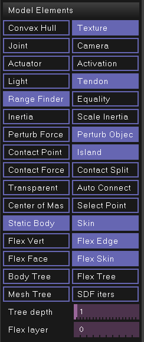
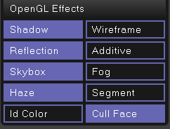
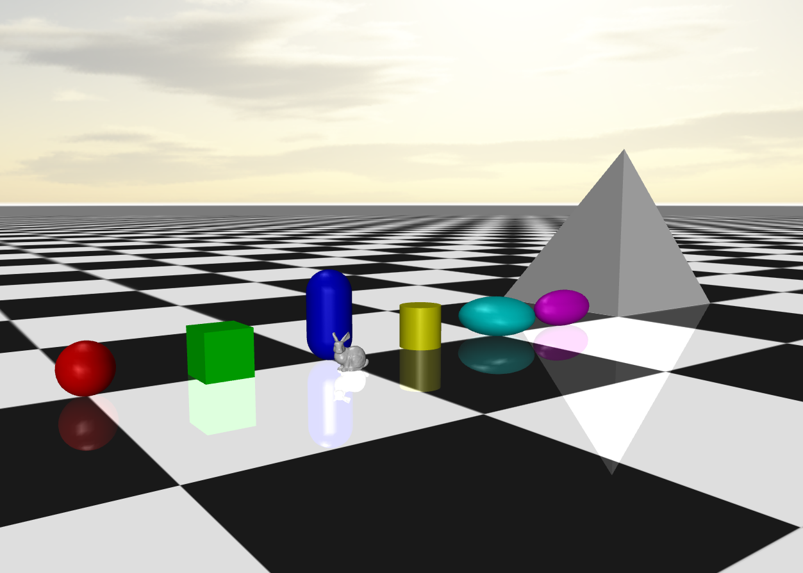
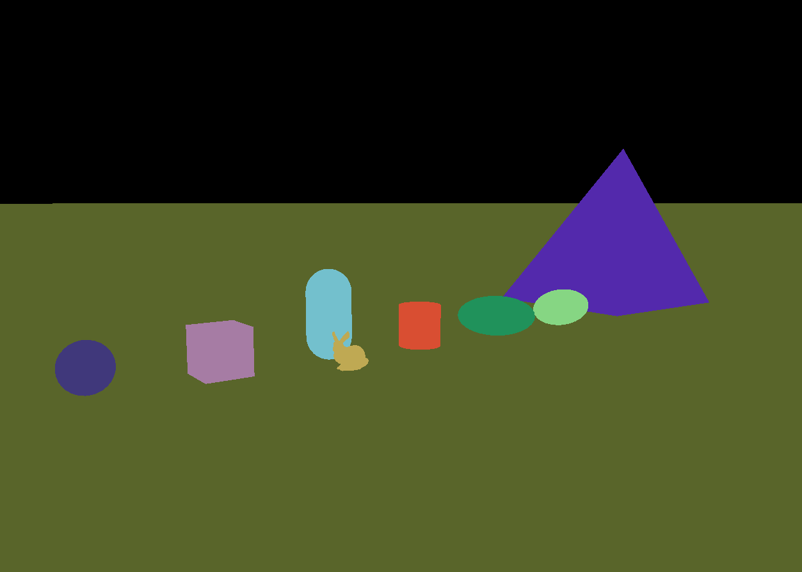
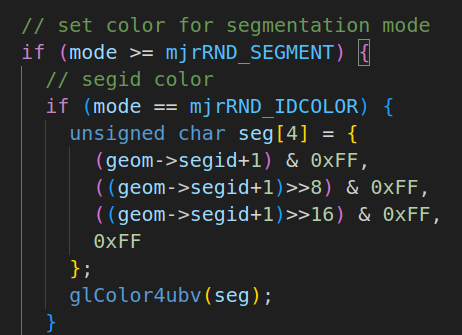
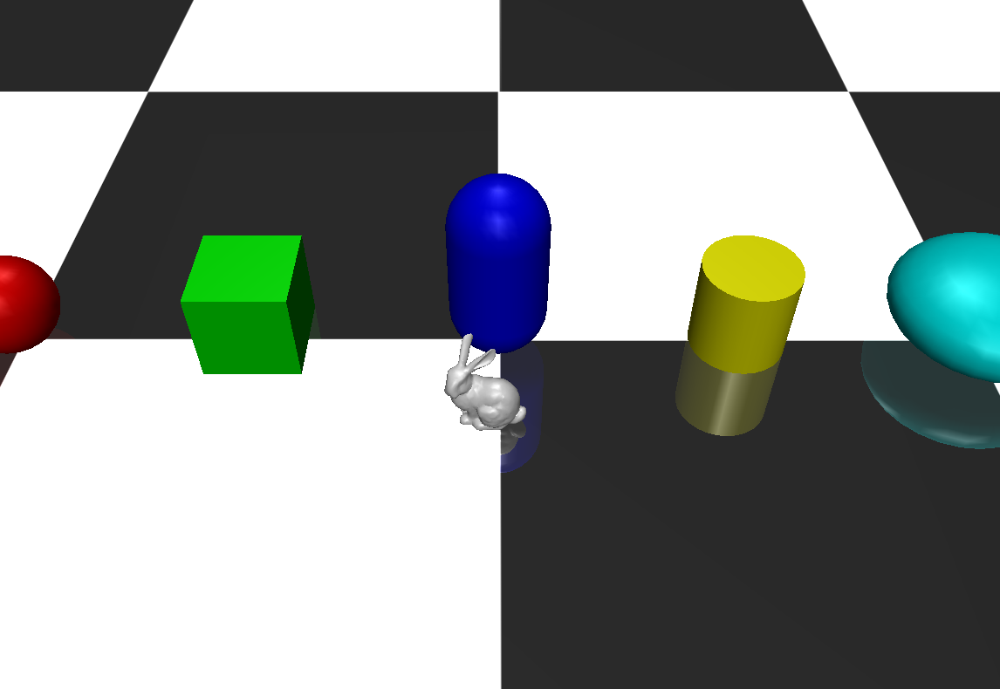
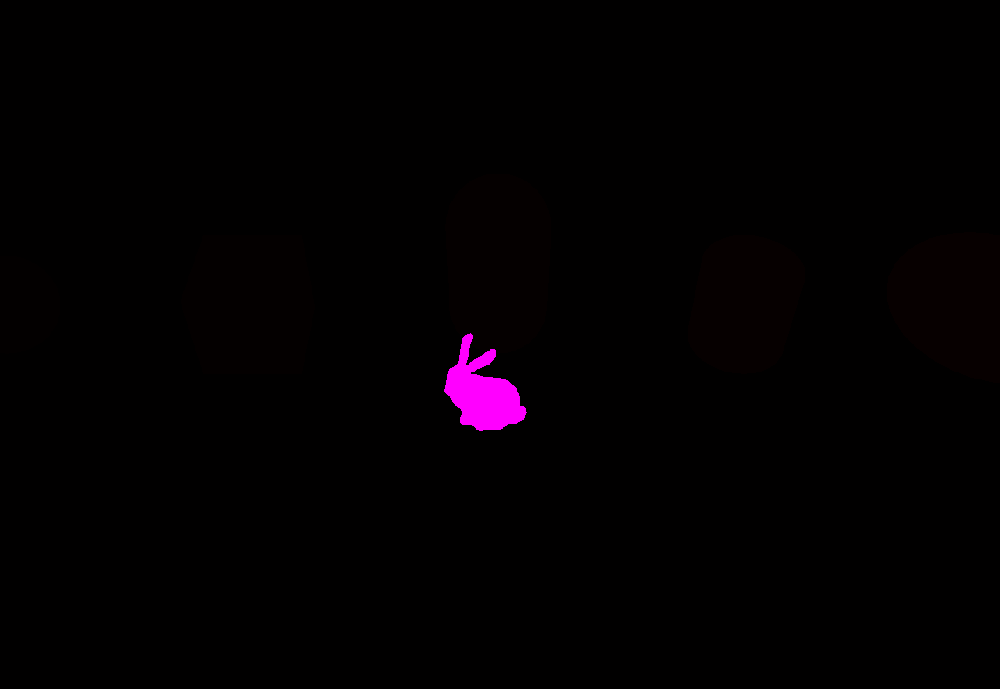
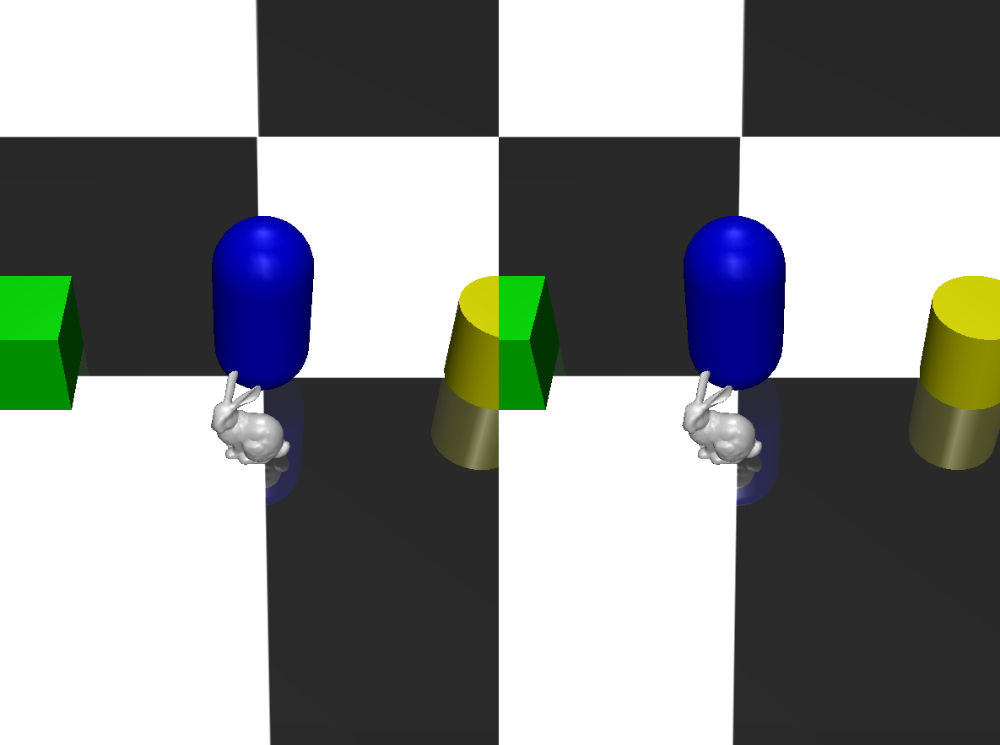

###### datetime:2025/01/10 14:45

###### author:nzb

> 该项目来源于[mujoco_learning](https://github.com/Albusgive/mujoco_learning)

# 可视化及渲染

## 可视化配置

**`mjtVisFlag`对应`mjvOption.flags`中的设置，在simulate中对应如下配置**



可以使用`opt.flags[mjtVisFlag::mjVIS_XXX]=true`开启功能

```C++
typedef enum mjtVisFlag_ {        // flags enabling model element visualization
  mjVIS_CONVEXHULL    = 0,        // mesh convex hull
  mjVIS_TEXTURE,                  // textures
  mjVIS_JOINT,                    // joints
  mjVIS_CAMERA,                   // cameras
  mjVIS_ACTUATOR,                 // actuators
  mjVIS_ACTIVATION,               // activations
  mjVIS_LIGHT,                    // lights
  mjVIS_TENDON,                   // tendons
  mjVIS_RANGEFINDER,              // rangefinder sensors
  mjVIS_CONSTRAINT,               // point constraints
  mjVIS_INERTIA,                  // equivalent inertia boxes
  mjVIS_SCLINERTIA,               // scale equivalent inertia boxes with mass
  mjVIS_PERTFORCE,                // perturbation force
  mjVIS_PERTOBJ,                  // perturbation object
  mjVIS_CONTACTPOINT,             // contact points
  mjVIS_ISLAND,                   // constraint islands
  mjVIS_CONTACTFORCE,             // contact force
  mjVIS_CONTACTSPLIT,             // split contact force into normal and tangent
  mjVIS_TRANSPARENT,              // make dynamic geoms more transparent
  mjVIS_AUTOCONNECT,              // auto connect joints and body coms
  mjVIS_COM,                      // center of mass
  mjVIS_SELECT,                   // selection point
  mjVIS_STATIC,                   // static bodies
  mjVIS_SKIN,                     // skin
  mjVIS_FLEXVERT,                 // flex vertices
  mjVIS_FLEXEDGE,                 // flex edges
  mjVIS_FLEXFACE,                 // flex element faces
  mjVIS_FLEXSKIN,                 // flex smooth skin (disables the rest)
  mjVIS_BODYBVH,                  // body bounding volume hierarchy
  mjVIS_FLEXBVH,                  // flex bounding volume hierarchy
  mjVIS_MESHBVH,                  // mesh bounding volume hierarchy
  mjVIS_SDFITER,                  // iterations of SDF gradient descent

  mjNVISFLAG                      // number of visualization flags
} mjtVisFlag;
```

**`mjvOption.label`使用`mjtLabel`显示对应标签**

**`mjvOption.frame`使用`mjtFrame`显示对应坐标系**

**`mjvOption`中还可以设置分组的可视化和`bvh`树深度**

完整定义：
```C++
struct mjvOption_ {                  // abstract visualization options
  int      label;                    // what objects to label (mjtLabel)
  int      frame;                    // which frame to show (mjtFrame)
  mjtByte  geomgroup[mjNGROUP];      // geom visualization by group
  mjtByte  sitegroup[mjNGROUP];      // site visualization by group
  mjtByte  jointgroup[mjNGROUP];     // joint visualization by group
  mjtByte  tendongroup[mjNGROUP];    // tendon visualization by group
  mjtByte  actuatorgroup[mjNGROUP];  // actuator visualization by group
  mjtByte  flexgroup[mjNGROUP];      // flex visualization by group
  mjtByte  skingroup[mjNGROUP];      // skin visualization by group
  mjtByte  flags[mjNVISFLAG];        // visualization flags (indexed by mjtVisFlag)
  int      bvh_depth;                // depth of the bounding volume hierarchy to be visualized
  int      flex_layer;               // element layer to be visualized for 3D flex
};
typedef struct mjvOption_ mjvOption;
```

## 场景渲染

**`mjtRndFlag`作用于`mjvScene.flags`，对应simulate中如下配置**



```C++
typedef enum mjtRndFlag_ {        // flags enabling rendering effects
  mjRND_SHADOW        = 0,        // shadows
  mjRND_WIREFRAME,                // wireframe
  mjRND_REFLECTION,               // reflections
  mjRND_ADDITIVE,                 // additive transparency
  mjRND_SKYBOX,                   // skybox
  mjRND_FOG,                      // fog
  mjRND_HAZE,                     // haze
  mjRND_SEGMENT,                  // segmentation with random color
  mjRND_IDCOLOR,                  // segmentation with segid+1 color
  mjRND_CULL_FACE,                // cull backward faces

  mjNRNDFLAG                      // number of rendering flags
} mjtRndFlag;
```
### 图像分割

**mjRND_SEGMENT and mjRND_IDCOLOR**

`mjtRndFlag`中`mjRND_SEGMENT`是随机颜色分割物体，

`mjRND_IDCOLOR`是通过设置`mjvGeom.segid`固定物体分割颜色
随机分割效果：





mujoco源码中segid映射到rgba见src/render/render_gl3.c如下



使用`segid`分割：





## 单/双目渲染

**mjtStereo作用于mjvScene.stereo**

分别是单目，四缓冲,并排，可以直接使用`mjSTEREO_SIDEBYSIDE`显示双目，`mjSTEREO_QUADBUFFERED`则需要更好一些的GPU
```C++
typedef enum mjtStereo_ {         // type of stereo rendering
  mjSTEREO_NONE       = 0,        // no stereo; use left eye only
  mjSTEREO_QUADBUFFERED,          // quad buffered; revert to side-by-side if no hardware support
  mjSTEREO_SIDEBYSIDE             // side-by-side
} mjtStereo;
```
演示：


## 代码

- `vis_cfg.cpp`

```C++
#include <chrono>
#include <cmath>
#include <cstddef>
#include <cstdio>
#include <cstring>
#include <iostream>
#include <mujoco/mjmodel.h>
#include <mujoco/mjrender.h>
#include <mujoco/mjspec.h>
#include <mujoco/mjtnum.h>
#include <mujoco/mjvisualize.h>
#include <thread>

#include "opencv2/opencv.hpp"
#include <GLFW/glfw3.h>
#include <mujoco/mujoco.h>

// MuJoCo data structures
mjModel *m = NULL; // MuJoCo model
mjData *d = NULL;  // MuJoCo data
mjvCamera cam;     // abstract camera
mjvOption opt;     // visualization options
mjvScene scn;      // abstract scene
mjrContext con;    // custom GPU context

// mouse interaction
bool button_left = false;
bool button_middle = false;
bool button_right = false;
double lastx = 0;
double lasty = 0;

// keyboard callback
void keyboard(GLFWwindow *window, int key, int scancode, int act, int mods) {
  // backspace: reset simulation
  if (act == GLFW_PRESS && key == GLFW_KEY_BACKSPACE) {
    mj_resetData(m, d);
    mj_forward(m, d);
  }
}

// mouse button callback
void mouse_button(GLFWwindow *window, int button, int act, int mods) {
  // update button state
  button_left =
      (glfwGetMouseButton(window, GLFW_MOUSE_BUTTON_LEFT) == GLFW_PRESS);
  button_middle =
      (glfwGetMouseButton(window, GLFW_MOUSE_BUTTON_MIDDLE) == GLFW_PRESS);
  button_right =
      (glfwGetMouseButton(window, GLFW_MOUSE_BUTTON_RIGHT) == GLFW_PRESS);

  // update mouse position
  glfwGetCursorPos(window, &lastx, &lasty);
}

// mouse move callback
void mouse_move(GLFWwindow *window, double xpos, double ypos) {
  // no buttons down: nothing to do
  if (!button_left && !button_middle && !button_right) {
    return;
  }

  // compute mouse displacement, save
  double dx = xpos - lastx;
  double dy = ypos - lasty;
  lastx = xpos;
  lasty = ypos;

  // get current window size
  int width, height;
  glfwGetWindowSize(window, &width, &height);

  // get shift key state
  bool mod_shift = (glfwGetKey(window, GLFW_KEY_LEFT_SHIFT) == GLFW_PRESS ||
                    glfwGetKey(window, GLFW_KEY_RIGHT_SHIFT) == GLFW_PRESS);

  // determine action based on mouse button
  mjtMouse action;
  if (button_right) {
    action = mod_shift ? mjMOUSE_MOVE_H : mjMOUSE_MOVE_V;
  } else if (button_left) {
    action = mod_shift ? mjMOUSE_ROTATE_H : mjMOUSE_ROTATE_V;
  } else {
    action = mjMOUSE_ZOOM;
  }

  // move camera
  mjv_moveCamera(m, action, dx / height, dy / height, &scn, &cam);
}

// scroll callback
void scroll(GLFWwindow *window, double xoffset, double yoffset) {
  // emulate vertical mouse motion = 5% of window height
  mjv_moveCamera(m, mjMOUSE_ZOOM, 0, -0.05 * yoffset, &scn, &cam);
}

std::vector<float> get_sensor_data(const mjModel *model, const mjData *data,
                                   const std::string &sensor_name) {
  int sensor_id = mj_name2id(model, mjOBJ_SENSOR, sensor_name.c_str());
  if (sensor_id == -1) {
    std::cout << "no found sensor" << std::endl;
    return std::vector<float>();
  }
  int data_pos = model->sensor_adr[sensor_id];
  std::vector<float> sensor_data(model->sensor_dim[sensor_id]);
  for (int i = 0; i < sensor_data.size(); i++) {
    sensor_data[i] = data->sensordata[data_pos + i];
  }
  return sensor_data;
}

void get_cam_image(mjvCamera *cam,int width,int height,int stereo) {
  mjrRect viewport2 = {0, 0, width, height};
  int before_stereo = scn.stereo;
  scn.stereo = stereo;
  // mujoco更新渲染
  mjv_updateCamera(m, d, cam, &scn);
  mjr_render(viewport2, &scn, &con);
  scn.stereo = before_stereo;
  // 渲染完成读取图像
  unsigned char *rgbBuffer = new unsigned char[width * height * 3];
  float *depthBuffer = new float[width * height];
  mjr_readPixels(rgbBuffer, depthBuffer, viewport2, &con);
  cv::Mat image(height, width, CV_8UC3, rgbBuffer);
  // 反转图像以匹配OpenGL渲染坐标系
  cv::flip(image, image, 0);
  // 颜色顺序转换这样要使用bgr2rgb而不是rgb2bgr
  cv::cvtColor(image, image, cv::COLOR_BGR2RGB);
  cv::imshow("Image", image);
  cv::waitKey(1);
  // 释放内存
  delete[] rgbBuffer;
  delete[] depthBuffer;
}

// main function
int main(int argc, const char **argv) {

  char error[1000] = "Could not load binary model";
  m = mj_loadXML("../../../../API-MJCF/vis_cfg.xml", 0, error, 1000);

  // make data
  d = mj_makeData(m);

  // init GLFW
  if (!glfwInit()) {
    mju_error("Could not initialize GLFW");
  }

  // create window, make OpenGL context current, request v-sync
  GLFWwindow *window = glfwCreateWindow(1200, 900, "Demo", NULL, NULL);
  glfwMakeContextCurrent(window);
  glfwSwapInterval(1);

  // initialize visualization data structures
  mjv_defaultCamera(&cam);
  mjv_defaultOption(&opt);
  mjv_defaultScene(&scn);
  mjr_defaultContext(&con);

  // create scene and context
  mjv_makeScene(m, &scn, 2000);
  mjr_makeContext(m, &con, mjFONTSCALE_150);

  // install GLFW mouse and keyboard callbacks
  glfwSetKeyCallback(window, keyboard);
  glfwSetCursorPosCallback(window, mouse_move);
  glfwSetMouseButtonCallback(window, mouse_button);
  glfwSetScrollCallback(window, scroll);

  /*--------可视化配置--------*/
  // opt.flags[mjtVisFlag::mjVIS_CONTACTPOINT] = true;
  opt.flags[mjtVisFlag::mjVIS_CAMERA] = true;
  // opt.flags[mjtVisFlag::mjVIS_CONVEXHULL] = true;
  // opt.flags[mjtVisFlag::mjVIS_COM] = true;
//   opt.label = mjtLabel::mjLABEL_BODY;
  opt.frame = mjtFrame::mjFRAME_BODY;
  /*--------可视化配置--------*/


  /*--------场景渲染--------*/
//   scn.flags[mjtRndFlag::mjRND_WIREFRAME] = true; // 网格化
  // scn.flags[mjtRndFlag::mjRND_SEGMENT] = true;
  // scn.flags[mjtRndFlag::mjRND_IDCOLOR] = true; // 需要先开启 mjRND_SEGMENT
  int bunny_id = mj_name2id(m, mjOBJ_GEOM, "bunny");
  /*--------场景渲染--------*/

  /*--------单/双目渲染--------*/
  scn.stereo = mjtStereo::mjSTEREO_SIDEBYSIDE;
  /*--------单/双目渲染--------*/

  //相机初始化
  mjvCamera cam2;
  int camID = mj_name2id(m, mjOBJ_CAMERA, "bunny_eyes");
  if (camID == -1) {
    std::cerr << "Camera not found" << std::endl;
  } else {
    mjv_defaultCamera(&cam2);
    cam2.fixedcamid = camID;
    cam2.type = mjCAMERA_FIXED;
  }

  auto step_start = std::chrono::high_resolution_clock::now();
  while (!glfwWindowShouldClose(window)) {

    mj_step(m, d);

    get_cam_image(&cam2,1024,640,mjtStereo::mjSTEREO_SIDEBYSIDE);

    //同步时间
    auto current_time = std::chrono::high_resolution_clock::now();
    double elapsed_sec =
        std::chrono::duration<double>(current_time - step_start).count();
    double time_until_next_step = m->opt.timestep * 5 - elapsed_sec;
    if (time_until_next_step > 0.0) {
      auto sleep_duration = std::chrono::duration<double>(time_until_next_step);
      std::this_thread::sleep_for(sleep_duration);
    }

    // get framebuffer viewport
    mjrRect viewport = {0, 0, 0, 0};
    glfwGetFramebufferSize(window, &viewport.width, &viewport.height);

    // update scene and render
    mjv_updateScene(m, d, &opt, NULL, &cam, mjCAT_ALL, &scn);
    /*--------设置分割颜色--------*/
    mjvGeom *geom;
    // std::cout << scn.ngeom << std::endl;
    for (int i = 0; i < scn.ngeom; i++) {
      geom = scn.geoms + i;
      if (geom->objid == bunny_id && geom->objtype == mjOBJ_GEOM)
        break;
    }
    uint32_t r = 254; // 255 会溢出
    uint32_t g = 0;
    uint32_t b = 255;
    geom->segid = (b << 16) | (g << 8) | r;
    // std::cout << geom->segid << std::endl;
    /*--------设置分割颜色--------*/
    mjr_render(viewport, &scn, &con);

    // swap OpenGL buffers (blocking call due to v-sync)
    glfwSwapBuffers(window);

    // process pending GUI events, call GLFW callbacks
    glfwPollEvents();
  }

  // free visualization storage
  mjv_freeScene(&scn);
  mjr_freeContext(&con);

  // free MuJoCo model and data
  mj_deleteData(d);
  mj_deleteModel(m);

  // terminate GLFW (crashes with Linux NVidia drivers)
#if defined(__APPLE__) || defined(_WIN32)
  glfwTerminate();
#endif

  return 1;
}
```

- `CMakeLists.txt`

```cmake
cmake_minimum_required(VERSION 3.20)
project(MUJOCO_T)
include_directories(${CMAKE_CURRENT_SOURCE_DIR}/simulate)

#编译安装，从cmake安装位置opt使用

# 设置 MuJoCo 的路径
set(MUJOCO_PATH "/home/nzb/programs/mujoco-3.3.0")
# 包含 MuJoCo 的头文件
include_directories(${MUJOCO_PATH}/include)
# 设置 MuJoCo 的库路径
link_directories(${MUJOCO_PATH}/bin)
set(MUJOCO_LIB ${MUJOCO_PATH}/lib/libmujoco.so)

find_package(OpenCV REQUIRED)

add_executable(vis_cfg vis_cfg.cpp)
#从cmake安装位置opt使用
target_link_libraries(vis_cfg ${MUJOCO_LIB} glut GL GLU glfw ${OpenCV_LIBS})
```