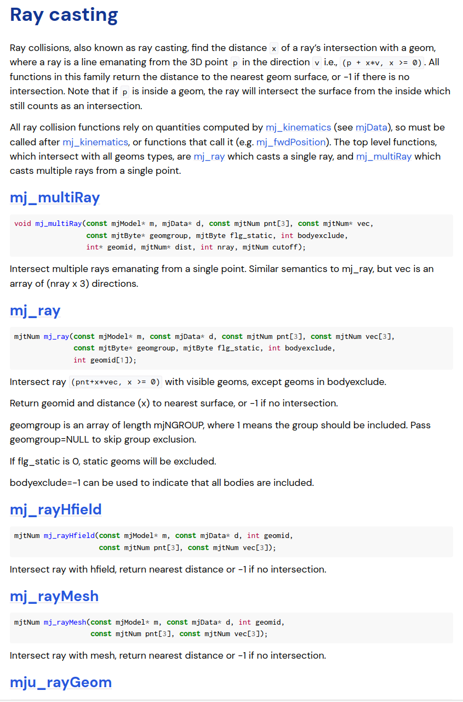

###### datetime:2025/01/10 14:45

###### author:nzb

> 该项目来源于[mujoco_learning](https://github.com/Albusgive/mujoco_learning)

# Ray

射线测距接口



```c++
void mj_multiRay(const mjModel* m, mjData* d, const mjtNum pnt[3], const mjtNum* vec,
                 const mjtByte* geomgroup, mjtByte flg_static, int bodyexclude,
                 int* geomid, mjtNum* dist, int nray, mjtNum cutoff);
```

* `m: mjModel`
* `d: mjData`
* `pnt`: 射线起点
* `vec`: 射线向量
* `geomgroup`：检测分组，NULL代表检测所有
* `flg_static`: 是否检测静态物体 1检测 0不检测
* `bodyexclude`: -1 可用于指示包括所有主体
* `geomid`: 检测到的几何体id，没有为-1
* `dist`: 到geom表面的距离，数据是距离比例，是`vec`的倍数，无限远为-1
* `nray`：射线数量
* `cutoff`: 距离截断，超过截断距离的射线不检测，判断条件(`pnt`到`geompos`中心>`cutoff`+几何体外接球半径)  

**其余ratXXX参数同理**

## 代码

- `ray.cpp`

```c++
#include <chrono>
#include <cmath>
#include <cstddef>
#include <cstdio>
#include <cstring>
#include <iostream>
#include <mujoco/mjmodel.h>
#include <mujoco/mjrender.h>
#include <mujoco/mjspec.h>
#include <mujoco/mjtnum.h>
#include <mujoco/mjvisualize.h>
#include <string>
#include <thread>

#include "opencv2/opencv.hpp"
#include <GLFW/glfw3.h>
#include <mujoco/mujoco.h>

// MuJoCo data structures
mjModel *m = NULL; // MuJoCo model
mjData *d = NULL;  // MuJoCo data
mjvCamera cam;     // abstract camera
mjvOption opt;     // visualization options
mjvScene scn;      // abstract scene
mjrContext con;    // custom GPU context

// mouse interaction
bool button_left = false;
bool button_middle = false;
bool button_right = false;
double lastx = 0;
double lasty = 0;

// keyboard callback
void keyboard(GLFWwindow *window, int key, int scancode, int act, int mods) {
  // backspace: reset simulation
  if (act == GLFW_PRESS && key == GLFW_KEY_BACKSPACE) {
    mj_resetData(m, d);
    mj_forward(m, d);
  }
}

// mouse button callback
void mouse_button(GLFWwindow *window, int button, int act, int mods) {
  // update button state
  button_left =
      (glfwGetMouseButton(window, GLFW_MOUSE_BUTTON_LEFT) == GLFW_PRESS);
  button_middle =
      (glfwGetMouseButton(window, GLFW_MOUSE_BUTTON_MIDDLE) == GLFW_PRESS);
  button_right =
      (glfwGetMouseButton(window, GLFW_MOUSE_BUTTON_RIGHT) == GLFW_PRESS);

  // update mouse position
  glfwGetCursorPos(window, &lastx, &lasty);
}

// mouse move callback
void mouse_move(GLFWwindow *window, double xpos, double ypos) {
  // no buttons down: nothing to do
  if (!button_left && !button_middle && !button_right) {
    return;
  }

  // compute mouse displacement, save
  double dx = xpos - lastx;
  double dy = ypos - lasty;
  lastx = xpos;
  lasty = ypos;

  // get current window size
  int width, height;
  glfwGetWindowSize(window, &width, &height);

  // get shift key state
  bool mod_shift = (glfwGetKey(window, GLFW_KEY_LEFT_SHIFT) == GLFW_PRESS ||
                    glfwGetKey(window, GLFW_KEY_RIGHT_SHIFT) == GLFW_PRESS);

  // determine action based on mouse button
  mjtMouse action;
  if (button_right) {
    action = mod_shift ? mjMOUSE_MOVE_H : mjMOUSE_MOVE_V;
  } else if (button_left) {
    action = mod_shift ? mjMOUSE_ROTATE_H : mjMOUSE_ROTATE_V;
  } else {
    action = mjMOUSE_ZOOM;
  }

  // move camera
  mjv_moveCamera(m, action, dx / height, dy / height, &scn, &cam);
}

// scroll callback
void scroll(GLFWwindow *window, double xoffset, double yoffset) {
  // emulate vertical mouse motion = 5% of window height
  mjv_moveCamera(m, mjMOUSE_ZOOM, 0, -0.05 * yoffset, &scn, &cam);
}

std::vector<float> get_sensor_data(const mjModel *model, const mjData *data,
                                   const std::string &sensor_name) {
  int sensor_id = mj_name2id(model, mjOBJ_SENSOR, sensor_name.c_str());
  if (sensor_id == -1) {
    std::cout << "no found sensor" << std::endl;
    return std::vector<float>();
  }
  int data_pos = model->sensor_adr[sensor_id];
  std::vector<float> sensor_data(model->sensor_dim[sensor_id]);
  for (int i = 0; i < sensor_data.size(); i++) {
    sensor_data[i] = data->sensordata[data_pos + i];
  }
  return sensor_data;
}

void get_cam_image(mjvCamera *cam, int width, int height, int stereo) {
  mjrRect viewport2 = {0, 0, width, height};
  int before_stereo = scn.stereo;
  scn.stereo = stereo;
  // mujoco更新渲染
  mjv_updateCamera(m, d, cam, &scn);
  mjr_render(viewport2, &scn, &con);
  scn.stereo = before_stereo;
  // 渲染完成读取图像
  unsigned char *rgbBuffer = new unsigned char[width * height * 3];
  float *depthBuffer = new float[width * height];
  mjr_readPixels(rgbBuffer, depthBuffer, viewport2, &con);
  cv::Mat image(height, width, CV_8UC3, rgbBuffer);
  // 反转图像以匹配OpenGL渲染坐标系
  cv::flip(image, image, 0);
  // 颜色顺序转换这样要使用bgr2rgb而不是rgb2bgr
  cv::cvtColor(image, image, cv::COLOR_BGR2RGB);
  cv::imshow("Image", image);
  cv::waitKey(1);
  // 释放内存
  delete[] rgbBuffer;
  delete[] depthBuffer;
}

/*--------绘制直线--------*/
void draw_line(mjvScene *scn, mjtNum *from, mjtNum *to, mjtNum width,
               float *rgba) {
  scn->ngeom += 1;
  mjvGeom *geom = scn->geoms + scn->ngeom - 1;
  mjv_initGeom(geom, mjGEOM_SPHERE, NULL, NULL, NULL, rgba);
  mjv_connector(geom, mjGEOM_LINE, width, from, to);
}

// main function
int main(int argc, const char **argv) {

    char error[1000] = "Could not load binary model";
    m = mj_loadXML("../../../../API-MJCF/deep_ray.xml", 0, error, 1000);

    // make data
    d = mj_makeData(m);

    // init GLFW
    if (!glfwInit()) {
        mju_error("Could not initialize GLFW");
    }

    // create window, make OpenGL context current, request v-sync
    GLFWwindow *window = glfwCreateWindow(1200, 900, "Demo", NULL, NULL);
    glfwMakeContextCurrent(window);
    glfwSwapInterval(1);

    // initialize visualization data structures
    mjv_defaultCamera(&cam);
    mjv_defaultOption(&opt);
    mjv_defaultScene(&scn);
    mjr_defaultContext(&con);

    // create scene and context
    mjv_makeScene(m, &scn, 2000);
    mjr_makeContext(m, &con, mjFONTSCALE_150);

    // install GLFW mouse and keyboard callbacks
    glfwSetKeyCallback(window, keyboard);
    glfwSetCursorPosCallback(window, mouse_move);
    glfwSetMouseButtonCallback(window, mouse_button);
    glfwSetScrollCallback(window, scroll);

    /*--------可视化配置--------*/
    // opt.flags[mjtVisFlag::mjVIS_CONTACTPOINT] = true;
    opt.flags[mjtVisFlag::mjVIS_CAMERA] = true;
    // opt.flags[mjtVisFlag::mjVIS_CONVEXHULL] = true;
    // opt.flags[mjtVisFlag::mjVIS_COM] = true;
    opt.label = mjtLabel::mjLABEL_GEOM;
    // opt.frame = mjtFrame::mjFRAME_WORLD;
    /*--------可视化配置--------*/

    /*--------场景渲染--------*/
    scn.flags[mjtRndFlag::mjRND_WIREFRAME] = true;
    // scn.flags[mjtRndFlag::mjRND_SEGMENT] = true;
    // scn.flags[mjtRndFlag::mjRND_IDCOLOR] = true;
    /*--------场景渲染--------*/

    int box_id = mj_name2id(m, mjOBJ_GEOM, "box1");
    int box2_id = mj_name2id(m, mjOBJ_GEOM, "box2");

    std::cout<<m->geom_rbound[box_id]<<std::endl;

    #define box_num  5
    int box_idx[5];
    mjtNum *boxs_pos[box_num];
    for (int i = 0; i < 5; i++) {
        std::string geom_name = "box" + std::to_string(i + 1);
        box_idx[i] = mj_name2id(m, mjOBJ_GEOM, geom_name.c_str());
        boxs_pos[i] = d->geom_xpos + box_idx[i] * 3;
    }

    //相机初始化
    mjvCamera cam2;
    int camID = mj_name2id(m, mjOBJ_CAMERA, "look_box");
    if (camID == -1) {
        std::cerr << "Camera not found" << std::endl;
    } else {
        mjv_defaultCamera(&cam2);
        cam2.fixedcamid = camID;
        cam2.type = mjCAMERA_FIXED;
    }
    // 获取摄像机的位置
    mjtNum *cam_pos = &m->cam_pos[3 * camID];
    std::cout << "Camera Position: (" << cam_pos[0] << ", " << cam_pos[1] << ", "
                << cam_pos[2] << ")" << std::endl;

    while (!glfwWindowShouldClose(window)) {
        auto step_start = std::chrono::high_resolution_clock::now();

        mj_step(m, d);

        /*--------单射线--------*/
        mjtNum *box_pos = d->geom_xpos + box_id * 3;
        mjtNum *box2_pos = d->geom_xpos + box2_id * 3;
        mjtNum vec1[3], vec2[3];
        for (int i = 0; i < 3; i++) {
        vec1[i] = box_pos[i] - cam_pos[i];
        vec2[i] = box2_pos[i] - cam_pos[i];
        }
        int geomid[1];
        mjtNum x1 = mj_ray(m, d, cam_pos, vec1, NULL, 1, -1, geomid);
        mjtNum x2 = mj_ray(m, d, cam_pos, vec2, NULL, 1, -1, geomid);
        mjtNum distance1 = mju_norm3(vec1) * x1;
        mjtNum distance2 = mju_norm3(vec2) * x2;
        // std::cout << "x1: " << x1 << "  x2: " << x2 << std::endl;
        // std::cout << "distance1: " << distance1 << "  distance2: " << distance2
        //           << std::endl;
        /*--------单射线--------*/

        /*--------多射线--------*/
        mjtNum num_vec[box_num][3];
        for (int i = 0; i < box_num; i++) {
            for (int j = 0; j < 3; j++) {
                num_vec[i][j] = boxs_pos[i][j] - cam_pos[j];
            }
        }
        int geomids[box_num]={0};
        mjtNum dist_ratio[box_num]={0.0};
        mjtNum dist[box_num]={0.0};
        mj_multiRay(m, d, cam_pos, (const mjtNum *)num_vec, NULL, 1, -1, geomids,
        dist_ratio, box_num, 999);
        for (int i = 0; i < box_num; i++) {
            if(geomids[i]==-1)
            {
                dist[i] = -1;
                continue;
            }
            dist[i] = mju_norm3(num_vec[i]) * dist_ratio[i];
        }
        std::cout << "multiRay distance: ";
        for (int i = 0; i < box_num; i++) {
            std::cout << dist[i] << " ";
        }
        std::cout << std::endl;

        /*--------多射线--------*/

        // get_cam_image(&cam2,1024,640,mjtStereo::mjSTEREO_SIDEBYSIDE);

        // get framebuffer viewport
        mjrRect viewport = {0, 0, 0, 0};
        glfwGetFramebufferSize(window, &viewport.width, &viewport.height);

        // update scene and render
        mjv_updateScene(m, d, &opt, NULL, &cam, mjCAT_ALL, &scn);
        /*--------设置分割颜色--------*/
        mjvGeom *geom;
        // std::cout << scn.ngeom << std::endl;
        for (int i = 0; i < scn.ngeom; i++) {
            geom = scn.geoms + i;
            if (geom->objid == box_id && geom->objtype == mjOBJ_GEOM)
                break;
        }
        uint32_t r = 254;
        uint32_t g = 0;
        uint32_t b = 255;
        geom->segid = (b << 16) | (g << 8) | r;
        // std::cout << geom->segid << std::endl;
        /*--------设置分割颜色--------*/
        float rgba[4] = {0, 0, 1, 0.5};
        for (int i = 0; i < box_num; i++) {
            mjtNum extremity_pos[3];
            extremity_pos[0] = cam_pos[0] + num_vec[i][0] * dist_ratio[i];
            extremity_pos[1] = cam_pos[1] + num_vec[i][1] * dist_ratio[i];
            extremity_pos[2] = cam_pos[2] + num_vec[i][2] * dist_ratio[i];
            draw_line(&scn, cam_pos, extremity_pos, 2, rgba);
        }
        mjr_render(viewport, &scn, &con);

        // swap OpenGL buffers (blocking call due to v-sync)
        glfwSwapBuffers(window);

        // process pending GUI events, call GLFW callbacks
        glfwPollEvents();

        //同步时间
        auto current_time = std::chrono::high_resolution_clock::now();
        double elapsed_sec =
            std::chrono::duration<double>(current_time - step_start).count();
        double time_until_next_step = m->opt.timestep - elapsed_sec;
        if (time_until_next_step > 0.0) {
            auto sleep_duration = std::chrono::duration<double>(time_until_next_step);
            std::this_thread::sleep_for(sleep_duration);
        }
    }

    // free visualization storage
    mjv_freeScene(&scn);
    mjr_freeContext(&con);

    // free MuJoCo model and data
    mj_deleteData(d);
    mj_deleteModel(m);

    // terminate GLFW (crashes with Linux NVidia drivers)
    #if defined(__APPLE__) || defined(_WIN32)
    glfwTerminate();
    #endif

    return 1;
}
```

- `CMakelists.txt`

```cmake
cmake_minimum_required(VERSION 3.20)
project(MUJOCO_T)
include_directories(${CMAKE_CURRENT_SOURCE_DIR}/simulate)

#编译安装，从cmake安装位置opt使用

# 设置 MuJoCo 的路径
set(MUJOCO_PATH "/home/nzb/programs/mujoco-3.3.0")
# 包含 MuJoCo 的头文件
include_directories(${MUJOCO_PATH}/include)
# 设置 MuJoCo 的库路径
link_directories(${MUJOCO_PATH}/bin)
set(MUJOCO_LIB ${MUJOCO_PATH}/lib/libmujoco.so)

find_package(OpenCV REQUIRED)

add_executable(ray ray.cpp)
#从cmake安装位置opt使用
target_link_libraries(ray ${MUJOCO_LIB} glut GL GLU glfw ${OpenCV_LIBS})
```
