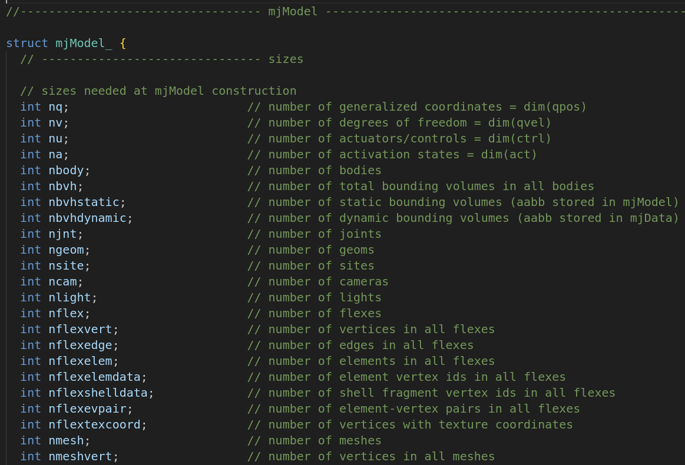
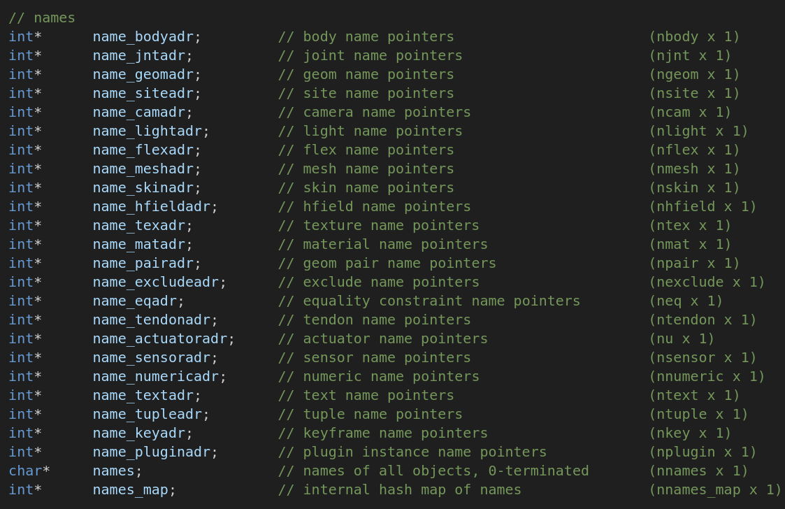
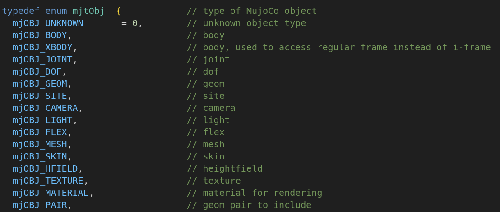
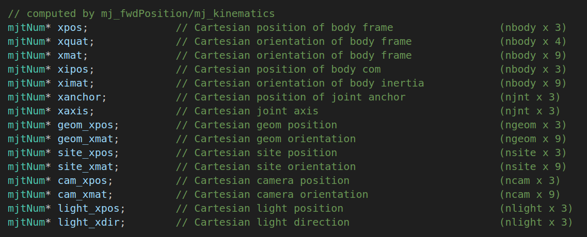

###### datetime:2025/12/28 12:25

###### author:nzb

> 该项目来源于[mujoco_learning](https://github.com/Albusgive/mujoco_learning)

# get obj

## 获取名字
数量

**先看mjModel结构体开头部分，这里的命名方式都是nXXX，这代表各个元素的数量**


## 获取id
`MJAPI int mj_name2id(const mjModel* m, int type, const char* name);`
通过 `name` 获取实体的id 
- `m:mjModel`
- `type`: `mjmodel.h`文件中的`mjtObj`中定义，这个是要获取`id`的实体类型一下是部分`type`类型枚举，在`mjtObj`中找到       
- `name: name`



## 获取位置

**可以通过 xpos和xxx_xpos获取各个对象的位置**

## 获取姿态
**通过xquat可以获取body的姿态**

我们可以和C++接口一样通过m.names中寻找各个实体的名字nXXX得到实体数量，name_xxxadr来寻找实体名字在names中的索引。
在names中名字字符串之间通过”\x00”分割，name_xxxadr定位到的是该实体的第一个字符的位置，可以使用python的数组截取功能实现读取字符串，在寻找末尾的0来截取实体的实际名字。

```python
name= m.names[m.name_bodyadr[1]:]
for i in range(len(name)):
    if name[i] == 0:
        name = name[:i]
        break
    print(name)
```

## 代码

```python
import time
import math

import mujoco
import mujoco.viewer

m = mujoco.MjModel.from_xml_path('../API-MJCF/pointer.xml')
d = mujoco.MjData(m)

with mujoco.viewer.launch_passive(m, d) as viewer:
  # Close the viewer automatically after 30 wall-seconds.
  start = time.time()
  cnt = 0
  while viewer.is_running() and time.time() - start < 30:
    step_start = time.time()
    
    # d.ctrl[1] = math.sin(cnt)
    mujoco.mj_step(m, d)
    
    # print(m.nbody)
    # print(m.njnt)
    # print(m.names)
    bsae_id = mujoco.mj_name2id(m,mujoco.mjtObj.mjOBJ_BODY,"pointer")
    # print(bsae_id)
    # print(d.xpos[bsae_id])
    imu_id = mujoco.mj_name2id(m,mujoco.mjtObj.mjOBJ_SITE,"imu")
    print(d.site_xpos[imu_id])
    # w x y z
    print(d.xquat[bsae_id])
      
    cnt += 0.005

    # Example modification of a viewer option: toggle contact points every two seconds.
    with viewer.lock():
      viewer.opt.flags[mujoco.mjtVisFlag.mjVIS_CONTACTPOINT] = int(d.time % 2)

    # Pick up changes to the physics state, apply perturbations, update options from GUI.
    viewer.sync()

    # Rudimentary time keeping, will drift relative to wall clock.
    time_until_next_step = m.opt.timestep - (time.time() - step_start)
    if time_until_next_step > 0:
      time.sleep(time_until_next_step)
```