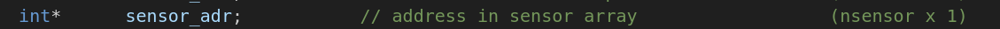
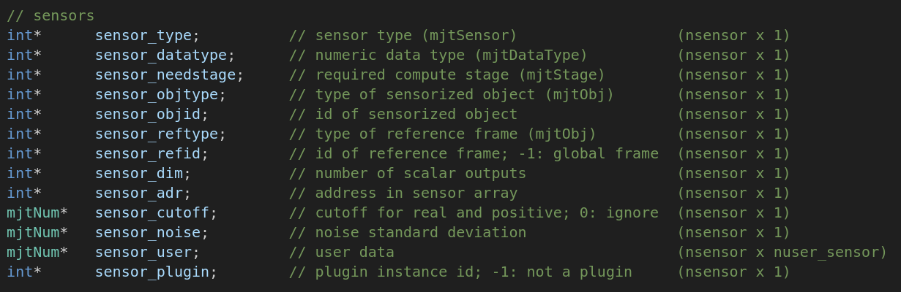

###### datetime:2025/12/29 20:53

###### author:nzb

> 该项目来源于[mujoco_learning](https://github.com/Albusgive/mujoco_learning)

# 传感器数据获取



**sensordata的索引需要依靠mjData的sensor_adr获取，这个可以使用sensor的id**
**这个我们要注意传感器具有的数据量，有的传感器是一个值，而有的传感器是三个值。我们可以使用mjModel中的sensor_dim获得传感器输出的参数量**

<font color=Green>*演示：*</font>

```python
def get_sensor_data(sensor_name):
    sensor_id = mujoco.mj_name2id(m, mujoco.mjtObj.mjOBJ_SENSOR, sensor_name)
    if sensor_id == -1:
        raise ValueError(f"Sensor '{sensor_name}' not found in model!")
    start_idx = m.sensor_adr[sensor_id]
    dim = m.sensor_dim[sensor_id]
    sensor_values = d.sensordata[start_idx : start_idx + dim]
    return sensor_values
```

对于传感器其他的属性在 mjModel中可以直接获得。如下：



**简易版：现在可以通过 MjData.sensor("sensorname").data 获取传感器数据**

## 读取相机画面
&emsp;&emsp;相机来源一般是在模型文件中创建相机，或者创建一个相机手动控制，就像 base中
与人交互的画面就是手动创建的相机。我们读取相机的步骤为：
1. 初始化glfw
2. 创建相机
3. 更新场景
4. 读取图像
5. 通过 opencv将图像转换

```cpp
MJAPI void mjr_readPixels(unsigned char* rgb, float* depth,
mjrRect viewport, const mjrContext* con);
```
将渲染画面转成rgb图像和深度图像。

**获取相机视角演示：**

初始化:

```python
# 初始化glfw
glfw.init()
glfw.window_hint(glfw.VISIBLE,glfw.FALSE)
window = glfw.create_window(1200,900,"mujoco",None,None)
glfw.make_context_current(window)
#创建相机
camera = mujoco.MjvCamera()
camID = mujoco.mj_name2id(m, mujoco.mjtObj.mjOBJ_CAMERA, "this_camera")
camera.fixedcamid = camID
camera.type = mujoco.mjtCamera.mjCAMERA_FIXED 
scene = mujoco.MjvScene(m, maxgeom=1000)
context = mujoco.MjrContext(m, mujoco.mjtFontScale.mjFONTSCALE_150)
mujoco.mjr_setBuffer(mujoco.mjtFramebuffer.mjFB_OFFSCREEN, context)

def get_image(w,h):
    # 定义视口大小
    viewport = mujoco.MjrRect(0, 0, w, h)
    # 更新场景
    mujoco.mjv_updateScene(
        m, d, mujoco.MjvOption(), 
        None, camera, mujoco.mjtCatBit.mjCAT_ALL, scene
    )
    # 渲染到缓冲区
    mujoco.mjr_render(viewport, scene, context)
    # 读取 RGB 数据（格式为 HWC, uint8）
    rgb = np.zeros((h, w, 3), dtype=np.uint8)
    mujoco.mjr_readPixels(rgb, None, viewport, context)
    cv_image = cv2.cvtColor(np.flipud(rgb), cv2.COLOR_RGB2BGR)
    return cv_image
```
获取图像:

```python
def get_image(w,h):
    # 定义视口大小
    viewport = mujoco.MjrRect(0, 0, w, h)
    # 更新场景
    mujoco.mjv_updateScene(
        m, d, mujoco.MjvOption(), 
        None, camera, mujoco.mjtCatBit.mjCAT_ALL, scene
    )
    # 渲染到缓冲区
    mujoco.mjr_render(viewport, scene, context)
    # 读取 RGB 数据（格式为 HWC, uint8）
    rgb = np.zeros((h, w, 3), dtype=np.uint8)
    mujoco.mjr_readPixels(rgb, None, viewport, context)
    cv_image = cv2.cvtColor(np.flipud(rgb), cv2.COLOR_RGB2BGR)
    return cv_image

img = get_image(640,480)
    cv2.imshow("img",img)
    cv2.waitKey(1)
```

## 代码

```python
import time
import math

import mujoco
import mujoco.viewer
import cv2
import glfw
import numpy as np

m = mujoco.MjModel.from_xml_path('../../API-MJCF/pointer.xml')
d = mujoco.MjData(m)

def get_sensor_data(sensor_name):
    sensor_id = mujoco.mj_name2id(m, mujoco.mjtObj.mjOBJ_SENSOR, sensor_name)
    if sensor_id == -1:
        raise ValueError(f"Sensor '{sensor_name}' not found in model!")
    start_idx = m.sensor_adr[sensor_id]
    dim = m.sensor_dim[sensor_id]
    sensor_values = d.sensordata[start_idx : start_idx + dim]
    return sensor_values

# 初始化glfw
glfw.init()
glfw.window_hint(glfw.VISIBLE,glfw.FALSE)
window = glfw.create_window(1200,900,"mujoco",None,None)  # 渲染窗口大小
glfw.make_context_current(window)
#创建相机
camera = mujoco.MjvCamera()
camID = mujoco.mj_name2id(m, mujoco.mjtObj.mjOBJ_CAMERA, "this_camera")
camera.fixedcamid = camID
camera.type = mujoco.mjtCamera.mjCAMERA_FIXED # xml 给的fixed
scene = mujoco.MjvScene(m, maxgeom=1000) # 更新场景
context = mujoco.MjrContext(m, mujoco.mjtFontScale.mjFONTSCALE_150) # 字体渲染大小
mujoco.mjr_setBuffer(mujoco.mjtFramebuffer.mjFB_OFFSCREEN, context) 

def get_image(w,h):
    # 定义视口大小
    viewport = mujoco.MjrRect(0, 0, w, h)
    # 更新场景
    mujoco.mjv_updateScene(
        m, d, mujoco.MjvOption(), 
        None, camera, mujoco.mjtCatBit.mjCAT_ALL, scene
    )
    # 渲染到缓冲区
    mujoco.mjr_render(viewport, scene, context)
    # 读取 RGB 数据（格式为 HWC, uint8）
    rgb = np.zeros((h, w, 3), dtype=np.uint8)
    depth = np.zeros((h, w), dtype=np.float64)
    mujoco.mjr_readPixels(rgb, depth, viewport, context)
    cv_image = cv2.cvtColor(np.flipud(rgb), cv2.COLOR_RGB2BGR)

    # 参数设置
    min_depth_m = 0.0  # 最小深度（0米）
    max_depth_m = 8.0  # 最大深度（8米）
    near_clip = 0.1    # 近裁剪面（米）
    far_clip = 50.0    # 远裁剪面（米）
    # 将非线性深度缓冲区值转换为线性深度（米）
    # 公式: linear_depth = far * near / (far - (far - near) * depth)
    linear_depth_m = far_clip * near_clip / (far_clip - (far_clip - near_clip) * depth)
    # 裁剪深度到0-8米范围
    depth_clipped = np.clip(linear_depth_m, min_depth_m, max_depth_m)
    # 映射0-8米到0-255像素值（距离越小越亮）
    # 反转映射：距离越小值越大（越亮）
    inverted_depth = max_depth_m - depth_clipped
    # 计算缩放因子：255/(max_depth_m - min_depth_m)
    scale = 255.0 / (max_depth_m - min_depth_m)
    depth_visual = (inverted_depth * scale).astype(np.uint8)
    # 翻转图像（MuJoCO坐标系到OpenCV坐标系）
    depth_visual = np.flipud(depth_visual)
    return cv_image,depth_visual


with mujoco.viewer.launch_passive(m, d) as viewer:
  # Close the viewer automatically after 30 wall-seconds.
  start = time.time()
  while viewer.is_running():
    
    d.ctrl[1] = 2
    
    step_start = time.time()
    mujoco.mj_step(m, d)
    
    # 复杂版获取
    # sensor_data = get_sensor_data("ang_vel")
    # print("sensor_data",sensor_data)
    # 简易版获取
    print(d.sensor("ang_vel").data)
    
    img,depth_img = get_image(640,480)  # 获取图像大小，注意：获取的图像不能比渲染窗口大
    cv2.imshow("img",img)
    cv2.imshow("depth_img",depth_img)
    cv2.waitKey(1)


    # Example modification of a viewer option: toggle contact points every two seconds.
    with viewer.lock():
      viewer.opt.flags[mujoco.mjtVisFlag.mjVIS_CONTACTPOINT] = int(d.time % 2)

    # Pick up changes to the physics state, apply perturbations, update options from GUI.
    viewer.sync()

    # Rudimentary time keeping, will drift relative to wall clock.
    time_until_next_step = m.opt.timestep - (time.time() - step_start)
    if time_until_next_step > 0:
      time.sleep(time_until_next_step)
```
