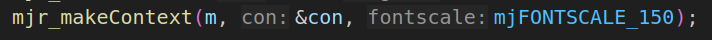
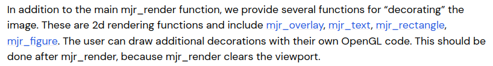

###### datetime:2025/12/30 20:32

###### author:nzb

> 该项目来源于[mujoco_learning](https://github.com/Albusgive/mujoco_learning)

# 3D绘制

`mujoco` 提供显示基础几何体和 `mujoco` 提供的一些特殊渲染几何体。查看文档可知 `mjv_initGeom` 函数能在渲染场景中增加几何体，`mjv_connector`可以用`mjv_initGeom`初始化的几何体绘制提供的一些特殊形状（如箭头，直线等）。

`mujoco` 显示画面的原理是通过 `mjv_updateScene` 将仿真数据储存到 `mjvScene` 中，这是已经处理好的几何数据，接下来使用 `mjr_render` 传递给 `opengl` 渲染。我们在绘制过程中是要在仿真的几何数据处理完之后，加入绘制信息，再交给 `opengl` 渲染。

在 `mjvScene` 中添加信息，其实是直接在 `mjvScene` 的 `geoms` 后面续写，而且要增加 `ngeom` 长度。这里通过注释可以理解， `mjvScene` 根据 `ngeom` 确定几何体数量再从 `geoms` 中获取资源。


初始化几何体`mjv_initGeom`函数原型：


`mjv_connector`函数原型：


`geom`是传入的仅绘制的几何体，需要使用`mjv_initGeom`初始化，`type`见下面，`width`是绘制的宽度，这个是对于

渲染出来的画面的宽度，`from`起点，`to`终点


这里是可以绘制的几何形状类型，分别是箭头，无楔形箭头，双向箭头，直线。

<font color=Green>*演示——绘制几何体函数：*</font>

```Python
def draw_geom(type, size, pos, mat, rgba):
    viewer.user_scn.ngeom += 1
    geom = viewer.user_scn.geoms[viewer.user_scn.ngeom - 1]   
    mujoco.mjv_initGeom(geom, type, size, pos, mat, rgba)
......
size = [0.0, 0.0, 0.0] 
pos = [0, 0, 0]         
mat = [0, 0, 0, 0, 0, 0, 0, 0, 0] 
rgba = [1.0, 0.0, 0.0, 1.0]     
draw_geom(mujoco.mjtGeom.mjGEOM_SPHERE, size, pos, mat, rgba)
```

<font color=Green>*演示——绘制直线函数：*</font>

```Python
def draw_line(start, end, width, rgba):
  viewer.user_scn.ngeom += 1
  geom = viewer.user_scn.geoms[viewer.user_scn.ngeom - 1]
  size = [0.0, 0.0, 0.0] 
  pos = [0, 0, 0]           
  mat = [0, 0, 0, 0, 0, 0, 0, 0, 0]     
  mujoco.mjv_initGeom(geom, mujoco.mjtGeom.mjGEOM_SPHERE, size, pos, mat, rgba)
  mujoco.mjv_connector(geom, mujoco.mjtGeom.mjGEOM_LINE, width, start, end)
......
pos_start = [0, 0, 0]
end = [0, 1, 1]
rgba = [1.0, 0.0, 0.0, 1.0]     
draw_line(pos_start, end, 20, rgba)
```

<font color=Green>*演示——绘制箭头函数：*</font>

```Python
def draw_arrow(start, end, width, rgba):
  viewer.user_scn.ngeom += 1
  geom = viewer.user_scn.geoms[viewer.user_scn.ngeom - 1]
  size = [0.0, 0.0, 0.0] 
  pos = [0, 0, 0]           
  mat = [0, 0, 0, 0, 0, 0, 0, 0, 0]  
  mujoco.mjv_initGeom(geom, mujoco.mjtGeom.mjGEOM_SPHERE, size, pos, mat, rgba)
  mujoco.mjv_connector(geom, mujoco.mjtGeom.mjGEOM_ARROW, width, start, end)
......
pos_start2 = [0, 0, 0]
end2 = [0, -1, 1]
rgba2 = [0.0, 1.0, 0.0, 0.5]
draw_arrow(pos_start2, end2, 0.1, rgba2)
```


# 2D绘制
字体尺寸的初始化：

python:         
```Python
context = mujoco.MjrContext(m, mujoco.mjtFontScale.mjFONTSCALE_150)
```
查阅文档我们可知2D绘制要在mjr_render之后进行


<font color=Green>*绘制文本：*</font>           

```C++
MJAPI void mjr_text(int font, const char* txt, const mjrContext* con,
                    float x, float y, float r, float g, float b);
```
`font`:字号，使用mjtFont中定义的    
`txt`：文本   
`con`：`mjrContext`   
`x,y`:渲染界面比例位置，取值`[0-1)`   
`r,g,b`:字体颜色  

**Python:**     
```Python
mujoco.mjr_text(mujoco.mjtFont.mjFONT_NORMAL, "Albusgive", context, 0, 0.8, 1, 0, 1)
```

<font color=Green>*绘制对应表格（overlay）：*</font>        

```C++
MJAPI void mjr_overlay(int font, int gridpos, mjrRect viewport,
                       const char* overlay, const char* overlay2, const mjrContext* con);
```
`font`:字号，使用`mjtFont`中定义的    
`gridpos`：绘制位置，使用`mjtGridPos`中定义的     
`mjrRect`：`mjrRect`，界面矩形  
`overlay`：第一列     
`overlay2`：第二列      
`con`：`mjrContext`      

**Python:**     
```Python
mujoco.mjr_overlay(mujoco.mjtFont.mjFONT_NORMAL, mujoco.mjtGridPos.mjGRID_TOPLEFT, viewport, "github", "Albusgive", context)
```


<font color=Green>*绘制矩形：*</font>           

```C++
MJAPI void mjr_rectangle(mjrRect viewport, float r, float g, float b, float a);
```
`mjrRect`：`mjrRect`，矩形      
`rgba`:颜色   

**Python:**     
```Python
viewport2 = mujoco.MjrRect(50, 100, 50, 50)
mujoco.mjr_rectangle(viewport2, 0.5, 0, 1, 0.6)
```

<font color=Green>*绘制标签：*</font>           

```C++
MJAPI void mjr_label(mjrRect viewport, int font, const char* txt,
                     float r, float g, float b, float a, float rt, float gt, float bt,
                     const mjrContext* con);
```
`viewport`：标签位置    
`font`:字号，使用`mjtFont`中定义的    
`txt`：文本   
`rgba`:标签底色   
`rt,gt,bt`:文字颜色   
`con`：`mjrContext`   

**Python:**     
```Python
viewport3 = mujoco.MjrRect(100, 200, 150, 50)
mujoco.mjr_label(viewport3, mujoco.mjtFont.mjFONT_NORMAL, "Albusgive", 0, 0, 1, 1, 1, 1,1, context)
```

## 代码

```Python
import time
import math

import mujoco
import mujoco.viewer
import cv2
import glfw
import numpy as np

m = mujoco.MjModel.from_xml_path('../../API-MJCF/mecanum.xml')
d = mujoco.MjData(m)

def get_sensor_data(sensor_name):
    sensor_id = mujoco.mj_name2id(m, mujoco.mjtObj.mjOBJ_SENSOR, sensor_name)
    if sensor_id == -1:
        raise ValueError(f"Sensor '{sensor_name}' not found in model!")
    start_idx = m.sensor_adr[sensor_id]
    dim = m.sensor_dim[sensor_id]
    sensor_values = d.sensordata[start_idx : start_idx + dim]
    return sensor_values

# 初始化glfw
glfw.init()
glfw.window_hint(glfw.VISIBLE,glfw.FALSE)
window = glfw.create_window(1200,900,"mujoco",None,None)
glfw.make_context_current(window)
#创建相机
camera = mujoco.MjvCamera()
camID = mujoco.mj_name2id(m, mujoco.mjtObj.mjOBJ_CAMERA, "this_camera")
camera.fixedcamid = camID
camera.type = mujoco.mjtCamera.mjCAMERA_FIXED 
scene = mujoco.MjvScene(m, maxgeom=1000)
context = mujoco.MjrContext(m, mujoco.mjtFontScale.mjFONTSCALE_150) # 字体渲染大小缩放
mujoco.mjr_setBuffer(mujoco.mjtFramebuffer.mjFB_OFFSCREEN, context)


with mujoco.viewer.launch_passive(m, d) as viewer:
  
  def draw_geom(type, size, pos, mat, rgba):
    viewer.user_scn.ngeom += 1  # 几何体加1
    geom = viewer.user_scn.geoms[viewer.user_scn.ngeom - 1]  # 创建几何体对象
    mujoco.mjv_initGeom(geom, type, size, pos, mat, rgba)  # 初始化几何体

  def draw_line(start, end, width, rgba):
    viewer.user_scn.ngeom += 1
    geom = viewer.user_scn.geoms[viewer.user_scn.ngeom - 1]
    size = [0.0, 0.0, 0.0] # 可不填，都给0，mjv_connector 会修改掉
    pos = [0, 0, 0]           # 可不填，都给0，mjv_connector 会修改掉
    mat = [0, 0, 0, 0, 0, 0, 0, 0, 0]     # 可不填，都给0，mjv_connector 会修改掉
    mujoco.mjv_initGeom(geom, mujoco.mjtGeom.mjGEOM_SPHERE, size, pos, mat, rgba)
    mujoco.mjv_connector(geom, mujoco.mjtGeom.mjGEOM_LINE, width, start, end)
  def draw_arrow(start, end, width, rgba):
    # 跟draw_line 几乎一致，只是 mjv_connector 的 type 不同
    viewer.user_scn.ngeom += 1
    geom = viewer.user_scn.geoms[viewer.user_scn.ngeom - 1]
    size = [0.0, 0.0, 0.0] 
    pos = [0, 0, 0]           
    mat = [0, 0, 0, 0, 0, 0, 0, 0, 0]   
    mujoco.mjv_initGeom(geom, mujoco.mjtGeom.mjGEOM_SPHERE, size, pos, mat, rgba)
    mujoco.mjv_connector(geom, mujoco.mjtGeom.mjGEOM_ARROW, width, start, end)
  
  cnt = 0
  start = time.time()
  ngeom = viewer.user_scn.ngeom  # 需要用到的场景信息
  while viewer.is_running() and time.time() - start < 30:
    
    d.ctrl[0] = math.sin(cnt)
    d.ctrl[1] = math.cos(cnt)
    d.ctrl[2] = math.sin(cnt)
    cnt += 0.003
    
    step_start = time.time()
    mujoco.mj_step(m, d)
    
    '''重置geom数量'''
    viewer.user_scn.ngeom = ngeom  # 需要重置，否则会一直增加，画出来就是一条轨迹，内存也可能溢出
    
    '''3D绘制'''
    size = [0.1, 0.0, 0.0] 
    pos = [0, 0, 1]         
    mat = [1, 0, 0, 0, 1, 0, 0, 0, 1] #坐标系，空间向量，x,y,z
    rgba = [1.0, 0.0, 0.0, 1.0]     
    draw_geom(mujoco.mjtGeom.mjGEOM_SPHERE, size, pos, mat, rgba)  # 圆
    
    pos_start = [0, 1, 1]
    end = [0, 3, 4]
    draw_line(pos_start, end, 20, rgba)
    
    pos_start2 = [0, 0, 1]
    end2 = [0, -1, 1]
    rgba2 = [0.0, 1.0, 0.0, 0.5]
    draw_arrow(pos_start2, end2, 0.1, rgba2)
    
    '''速度跟踪'''
    base_lin_vel = get_sensor_data("base_lin_vel")
    base_pos = get_sensor_data("base_pos")
    base_pos[2] += 1  # z 轴加1
    lin_start = base_pos # 箭头起点
    lin_end = lin_start + base_lin_vel * 2 # 起点 + 速度向量* 缩放因子
    draw_arrow(lin_start, lin_end, 0.1, rgba2)
    
    w=640
    h=480
    viewport = mujoco.MjrRect(0, 0, w, h)
    # 更新场景
    mujoco.mjv_updateScene(
        m, d, mujoco.MjvOption(), 
        None, camera, mujoco.mjtCatBit.mjCAT_ALL, scene
    )
    # 渲染到缓冲区
    mujoco.mjr_render(viewport, scene, context)
    
    '''2D绘制'''
    mujoco.mjr_text(mujoco.mjtFont.mjFONT_SHADOW, "Albusgive", context, 0, 0.8, 1, 0, 1)
    viewport2 = mujoco.MjrRect(50, 100, 50, 50) # 绘制位置
    mujoco.mjr_overlay(mujoco.mjtFont.mjFONT_NORMAL, mujoco.mjtGridPos.mjGRID_TOPLEFT, viewport, "github", "Albusgive", context)
    mujoco.mjr_rectangle(viewport2, 0.5, 0, 1, 0.6)
    viewport3 = mujoco.MjrRect(100, 200, 150, 50)
    mujoco.mjr_label(viewport3, mujoco.mjtFont.mjFONT_NORMAL, "Albusgive", 0, 1, 1, 1, 0, 0,0, context)
    
    # 读取 RGB 数据（格式为 HWC, uint8）
    rgb = np.zeros((h, w, 3), dtype=np.uint8)
    mujoco.mjr_readPixels(rgb, None, viewport, context)
    cv_image = cv2.cvtColor(np.flipud(rgb), cv2.COLOR_RGB2BGR)
    
    cv2.imshow("img",cv_image)
    cv2.waitKey(1)


    # Example modification of a viewer option: toggle contact points every two seconds.
    with viewer.lock():
      viewer.opt.flags[mujoco.mjtVisFlag.mjVIS_CONTACTPOINT] = int(d.time % 2)

    # Pick up changes to the physics state, apply perturbations, update options from GUI.
    viewer.sync()

    # Rudimentary time keeping, will drift relative to wall clock.
    time_until_next_step = m.opt.timestep - (time.time() - step_start)
    if time_until_next_step > 0:
      time.sleep(time_until_next_step)
```

```xml
<mujoco model="example">
    <compiler angle="radian" meshdir="meshes" autolimits="true" />
    <option timestep="0.01" gravity="0 0 -9.81" integrator="implicitfast" />
    <asset>
        <texture type="skybox" file="../MJCF/asset/desert.png"
            gridsize="3 4" gridlayout=".U..LFRB.D.." />
        <texture name="plane" type="2d" builtin="checker" rgb1=".1 .1 .1" rgb2=".9 .9 .9"
            width="512" height="512" mark="cross" markrgb=".8 .8 .8" />
        <material name="plane" reflectance="0.3" texture="plane" texrepeat="1 1" texuniform="true" />
    </asset>
    <visual>
        <!-- 质量 -->
        <quality shadowsize="16384" numslices="28" offsamples="4" />
        <headlight diffuse="1 1 1" specular="0.5 0.5 0.5" active="0" />
    </visual>

    <worldbody>
        <light directional="true" pos="0 0 30" dir="0 -0.5 -1" />
        <light directional="true" pos="0 0 30" dir="0 0.5 -1" />
        <geom name="floor" pos="0 0 0" size="0 0 .25" type="plane" material="plane"
            condim="3" />
        <!-- <geom type="box" size="0.3 0.3 0.5"/> -->

        <body name="base_body" pos="0 0 1">
            <freejoint />
            <camera name="this_camera" mode="fixed" pos="2 0 1.3" euler="0 1.0 1.57"
                principalpixel="50 50" focalpixel="1080 1920" sensorsize="4 4"
                resolution="1280 1080" />
            <geom type="box" size="0.5 0.5 0.01" rgba="0.5 0.5 0.5 1" mass="15" />

            <body name="Mecanum_A1" pos="0.5 0.6 0" euler="1.5707963267948966 0 0">
                <joint name="a1" type="hinge" pos="0 0 0" axis="0 0 1" frictionloss=".000002" />
                <geom type="cylinder" size="0.05 0.1" rgba=".1 .1 .1 1" />
                <site type="cylinder" size="0.15 0.045" rgba=".5 .1 .1 .5" />
                <replicate count="16" euler="0 0 0.3925">
                    <body euler="-0.78539815 0 0">
                        <joint type="hinge" pos="0.15 0 0" axis="0 0 1" frictionloss=".000002" />
                        <geom type="capsule" size="0.015 0.05" pos="0.15 0 0" />
                    </body>
                </replicate>
            </body>

            <body name="Mecanum_B1" pos="-0.5 0.6 0" euler="1.5707963267948966 0 0">
                <joint name="b1" type="hinge" pos="0 0 0" axis="0 0 1" frictionloss=".000002" />
                <geom type="cylinder" size="0.05 0.1" rgba=".1 .1 .1 1" />
                <site type="cylinder" size="0.15 0.045" rgba=".1 .1 .5 .5" />
                <replicate count="16" euler="0 0 0.3925">
                    <body euler="0.78539815 0 0">
                        <joint type="hinge" pos="0.15 0 0" axis="0 0 1" frictionloss=".000002" />
                        <geom type="capsule" size="0.015 0.05" pos="0.15 0 0" />
                    </body>
                </replicate>
            </body>

            <body name="Mecanum_A2" pos="-0.5 -0.6 0" euler="1.5707963267948966 0 0">
                <joint name="a2" type="hinge" pos="0 0 0" axis="0 0 1" frictionloss=".000002" />
                <geom type="cylinder" size="0.05 0.1" rgba=".1 .1 .1 1" />
                <site type="cylinder" size="0.15 0.045" rgba=".5 .1 .1 .5" />
                <replicate count="16" euler="0 0 0.3925">
                    <body euler="-0.78539815 0 0">
                        <joint type="hinge" pos="0.15 0 0" axis="0 0 1" frictionloss=".000002" />
                        <geom type="capsule" size="0.015 0.05" pos="0.15 0 0" />
                    </body>
                </replicate>
            </body>

            <body name="Mecanum_B2" pos="0.5 -0.6 0" euler="1.5707963267948966 0 0">
                <joint name="b2" type="hinge" pos="0 0 0" axis="0 0 1" frictionloss=".000002" />
                <geom type="cylinder" size="0.05 0.1" rgba=".1 .1 .1 1" />
                <site type="cylinder" size="0.15 0.045" rgba=".1 .1 .5 .5" />
                <replicate count="16" euler="0 0 0.3925">
                    <body euler="0.78539815 0 0">
                        <joint type="hinge" pos="0.15 0 0" axis="0 0 1" frictionloss=".000002" />
                        <geom type="capsule" size="0.015 0.05" pos="0.15 0 0" />
                    </body>
                </replicate>
            </body>
        </body>

    </worldbody>
    <tendon>
        <fixed name="forward">
            <joint joint="a1" coef="0.25" />
            <joint joint="b1" coef="0.25" />
            <joint joint="a2" coef="0.25" />
            <joint joint="b2" coef="0.25" />
        </fixed>
        <fixed name="transverse" frictionloss="0.001">
            <joint joint="a1" coef=".25" />
            <joint joint="b1" coef="-0.25" />
            <joint joint="a2" coef=".25" />
            <joint joint="b2" coef="-0.25" />
        </fixed>
        <fixed name="roatate">
            <joint joint="a1" coef=".25" />
            <joint joint="b1" coef=".25" />
            <joint joint="a2" coef="-.25" />
            <joint joint="b2" coef="-.25" />
        </fixed>
    </tendon>
    <actuator>
        <velocity tendon="forward" name="forward" kv="30" ctrlrange="-15 15" />
        <velocity tendon="transverse" name="transverse" kv="30" ctrlrange="-15 15" />
        <velocity tendon="roatate" name="roatate" kv="30" ctrlrange="-15 15" />
    </actuator>
    <sensor>
        <subtreelinvel name="base_lin_vel" body="base_body" />
        <framepos name="base_pos" objtype="body" objname="base_body"/>
    </sensor>
</mujoco>
```
