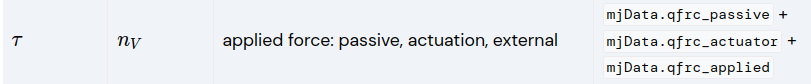
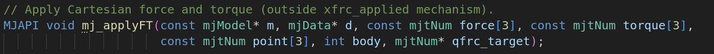
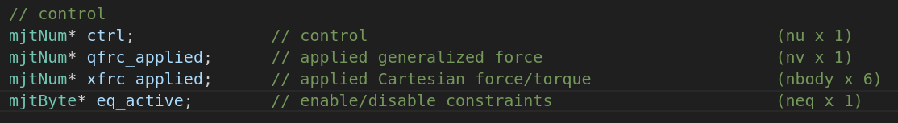
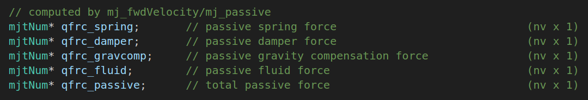
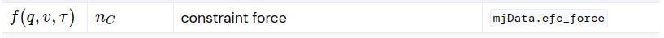
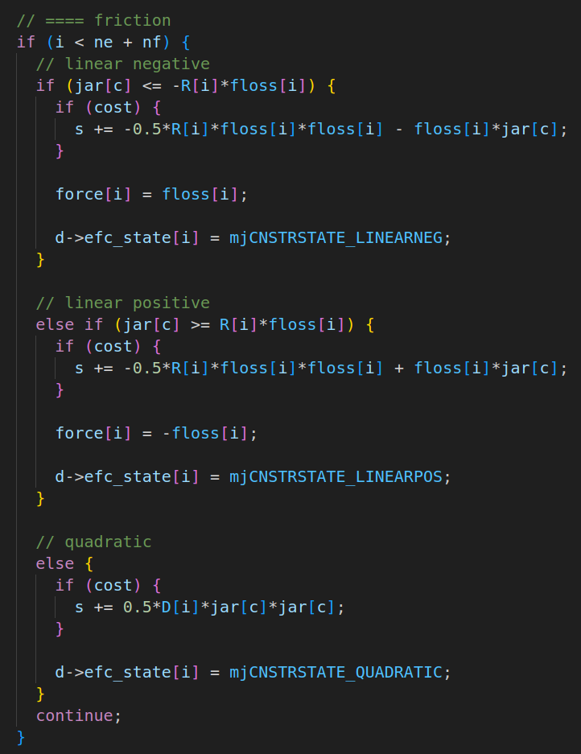
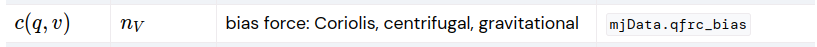

###### datetime:2025/01/10 14:45

###### author:nzb

> 该项目来源于[mujoco_learning](https://github.com/Albusgive/mujoco_learning)

# 作用力

**平动** 
     
$$ m \cdot a = F $$

**旋转**

$$ I \cdot \alpha = \tau $$  

$$ F/\tau = 外部力+驱动力+被动力+约束力+偏置力 $$  

## 外部力

我们查看文档计算部分可以看到有 `qfrc_passive`,`qfrc_actuator`,`qfrc_applied` 三个力分别对应被动力，驱动力，外部力，`nv`是自由度     



只要看手册的api或者头文件中，找到 `mj_applyFT` 函数应用外部力。



或者还可以使用 `xfrc_applied` 直接作用外部力在质心上。



**这里也说明了是笛卡尔力。**

&emsp;&emsp; `mj_applyFT` 函数的参数，是三维的力，三维扭矩，三维坐标( `worldbody` 坐标系)， `bodyid` 。 `qfrc_target` 可以直接使用 `d->qfrc_applied` 。 `mj_applyFT` 是对于 `body` 在 **“自由度”** 上施加力。于是我们可以使用两个方式对body施加外部力。       
&emsp;&emsp; `qfrc_target` 还可以是以下这些被动力等 `qfrc_xxx` 的力



**mj_Data接口演示（作用在质心上）：**
```C++
int bullet_id = mj_name2id(m, mjOBJ_BODY, "box");
mjtNum *set_torque = d->xfrc_applied + bullet_id * 6;
```

**mj_applyFT函数接口演示（可以调整施力点）:**
```C++
int bullet_id = mj_name2id(m, mjOBJ_BODY, "box");
mjtNum force[3] = {0.0, 0.0, 9.81};
mjtNum torque[3] = {0.0, 0.0, 0.0};
mjtNum point[3] = {0.0, 0.0, 0.0}; 
mj_applyFT(m, d, force, torque, point, id, d->qfrc_applied);
```
**mj_applyFT每次调用都是增量式，如果我们想清除力可以使用mju_zero，如mju_zero(d->qfrc_applied, m->nv);**

## 驱动力



&emsp;&emsp;mjData.qfrc_actuator是驱动器执行的力，不同驱动器最终会计算出力或者扭矩作用到关节上。        

## 被动力

&emsp;&emsp; `mjData.qfrc_passive` 是被动力，关节参数的 `damping，stiffness`,摩擦力，流体阻力都会最终计算到该力中。

$$ damping_{force} = (0-qvel)*damping $$
$$ stiffness_{force} = (0-qpos)*stiffness $$

## 约束力

&emsp;&emsp; `mjData.efc_force` 是约束力，关节的 `frictionloss，equality` 计算出来的合力为改力。

&emsp;&emsp;`jar = Jac*qacc-aref` 残差=雅可比*关节加速度-参考伪加速度

$$
frictionlossforce = 
\begin{cases}
    frictionloss, & \text{if } jar <= -InverseConstraintMass ⋅ floss  \\
    -frictionloss,  & \text{else if } jar>=InverseConstraintMass ⋅ floss   \\
    （没看懂）,  & \text{else }
\end{cases}
$$
**源码实现(SRC/engine/engine_core_constraint.c)**


## 偏置力



&emsp;&emsp;mjData.qfrc_bias科里奥利力等，由引擎自动计算。        


## 代码

```python
import time
import mujoco
import mujoco.viewer

m = mujoco.MjModel.from_xml_path('../../API-MJCF/force.xml')
d = mujoco.MjData(m)

mujoco.mj_step(m, d)
'''--------box--------'''
box_id = mujoco.mj_name2id(m, mujoco.mjtObj.mjOBJ_BODY, "box")
box_force = [0.0, 0.0, 0.1]
box_torque = [0.0, 0.0, 0.0]
box_point = [0.0, 0.0, 0.0]
red_point = mujoco.mj_name2id(m, mujoco.mjtObj.mjOBJ_SITE, "red_point")
point = d.site_xpos[red_point]
# mujoco.mj_applyFT(m, d, box_force, box_torque, box_point, box_id, d.qfrc_applied)
'''--------box--------'''

'''--------力——加速度--------'''
sphere_id = mujoco.mj_name2id(m, mujoco.mjtObj.mjOBJ_BODY, "sphere")
sphere_force = [0.0, 0.0, 0.0]
sphere_torque = [0.0, 0.0, 0.0]
sphere_point = [0.0, 0.0, 0.0]
# mujoco.mj_applyFT(m, d, sphere_force, sphere_torque, sphere_point, sphere_id, d.qfrc_applied)
'''--------力——加速度--------'''

'''--------扭矩--------'''
pointer_id = mujoco.mj_name2id(m, mujoco.mjtObj.mjOBJ_BODY, "pointer")
pointer_force = [0.0, 0.0, 0.0]
pointer_torque = [0.0, 0.0, 0.0]
pointer_point = [0.0, 0.0, 0.0]
# mujoco.mj_applyFT(m, d, pointer_force, pointer_torque, pointer_point, pointer_id, d.qfrc_applied)
'''--------扭矩--------'''

with mujoco.viewer.launch_passive(m, d) as viewer:
  start = time.time()
  while viewer.is_running() and time.time() - start < 30:
    step_start = time.time()
    
    '''--------box--------'''
    # d.qfrc_applied[:] = 0  # // 清空施加的力，否则会累加
    # mujoco.mj_applyFT(m, d, box_force, box_torque, point, box_id, d.qfrc_applied)
    # mujoco.mj_step(m, d)
    '''--------box--------'''
    
    '''--------box--------'''
    # box_xfrc_applied = d.xfrc_applied[box_id]
    # box_xfrc_applied[0] = 0.0 # fx
    # box_xfrc_applied[1] = 0.0 # fy
    # box_xfrc_applied[2] = 9.82 # fz 缓慢上升
    # box_xfrc_applied[3] = 0.0 # tx
    # box_xfrc_applied[4] = 0.0 # ty
    # box_xfrc_applied[5] = 0.0 # tz
    # mujoco.mj_step(m, d)
    '''--------box--------'''
    
    '''--------力——加速度--------'''
    # d.ctrl[0] = 0.6
    # sphere_xfrc_applied = d.xfrc_applied[sphere_id]
    # sphere_xfrc_applied[0] = 0.0 # fx
    # sphere_xfrc_applied[1] = 0.0 # fy
    # sphere_xfrc_applied[2] = 0.0 # fz
    # sphere_xfrc_applied[3] = 0.0 # tx
    # sphere_xfrc_applied[4] = 0.0 # ty
    # sphere_xfrc_applied[5] = 0.0 # tz
    # mujoco.mj_step(m, d)
    # print("qfrc_passive:%f  qfrc_actuator:%f  qfrc_applied:%f qfrc_bias:%f  efc_force:%f" % (
    # d.qfrc_passive[0], d.qfrc_actuator[0], d.qfrc_applied[0], d.qfrc_bias[0], d.efc_force[0]))
    # print("lin_acc:",d.sensor("lin_acc").data[0])
    # acc = (d.qfrc_passive[0] + d.qfrc_actuator[0] +
    #        d.qfrc_applied[0] + d.qfrc_bias[0] + d.efc_force[0]) / m.body_mass[sphere_id] # 合力 / 质量 = 加速度
    # print("计算加速度:",acc)
    # frictionloss = 0.0 , 是约束力
    # # stiffness = 0.0, damping = 1.0， qfrc_passive == lin_vel
    # print("lin_vel:",d.sensor("lin_vel").data[0])
    # # stiffness = 1.0, damping = 0.0， qfrc_passive == lin_pos
    # print("lin_pos:",d.sensor("lin_pos").data[0])
    '''--------力——加速度--------'''
    
    '''--------扭矩--------'''
    d.ctrl[1] = 0.6
    pointer_xfrc_applied = d.xfrc_applied[pointer_id]
    pointer_xfrc_applied[0] = 0.0 # fx
    pointer_xfrc_applied[1] = 0.0 # fy
    pointer_xfrc_applied[2] = 0.0 # fz
    pointer_xfrc_applied[3] = 0.0 # tx
    pointer_xfrc_applied[4] = 0.0 # ty
    pointer_xfrc_applied[5] = 0.0 # tz
    mujoco.mj_step(m, d)
    print("qfrc_passive:%f  qfrc_actuator:%f  qfrc_applied:%f qfrc_bias:%f  efc_force:%f" % (
      d.qfrc_passive[1], d.qfrc_actuator[1], d.qfrc_applied[1], d.qfrc_bias[1], d.efc_force[1]))
    tau = d.qfrc_passive[1] + d.qfrc_actuator[1] + d.qfrc_applied[1] + d.qfrc_bias[1] + d.efc_force[1]
    print("计算扭矩:",tau)
    print("测量扭矩:",d.sensor("torque").data)
    print("pivot_pos:",d.sensor("pivot_pos").data)
    print("pivot_vel:",d.sensor("pivot_vel").data)
    '''--------扭矩--------'''
    

    # Example modification of a viewer option: toggle contact points every two seconds.
    with viewer.lock():
      viewer.opt.flags[mujoco.mjtVisFlag.mjVIS_CONTACTPOINT] = int(d.time % 2)

    # Pick up changes to the physics state, apply perturbations, update options from GUI.
    viewer.sync()

    # Rudimentary time keeping, will drift relative to wall clock.
    time_until_next_step = m.opt.timestep - (time.time() - step_start)
    if time_until_next_step > 0:
      time.sleep(time_until_next_step)
```

```xml
<mujoco>
    <compiler angle="radian" meshdir="meshes" autolimits="true" />
    <!-- density="1.225" viscosity="1.8e-5" -->
    <option timestep="0.002" gravity="0 0 -9.81" integrator="implicitfast" />
    <asset>
        <mesh name="tetrahedron" vertex="0 0 0 1 0 0 0 1 0 0 0 1" />
        <texture type="skybox" file="../MJCF/asset/desert.png"
            gridsize="3 4" gridlayout=".U..LFRB.D.." />
        <texture name="plane" type="2d" builtin="checker" rgb1=".1 .1 .1" rgb2=".9 .9 .9"
            width="512" height="512" mark="cross" markrgb=".8 .8 .8" />
        <material name="plane" reflectance="0.3" texture="plane" texrepeat="1 1" texuniform="true" />
    </asset>

    <worldbody>
        <geom name="floor" pos="0 0 0" size="0 0 .25" type="plane" material="plane"
            condim="3" />
        <light directional="true" ambient=".3 .3 .3" pos="30 30 30" dir="0 -.5 -1"
            diffuse=".5 .5 .5" specular=".5 .5 .5" />

        <site type="ellipsoid" pos="0 1 0.2" size="10 0.01 0.01" rgba=".7 .7 .7 1" />
        <body name="sphere" pos="0 1 0.2">
            <joint name="lin_jnt" type="slide" axis="1 0 0" range="-10 10" damping="0.0"
                frictionloss="0.1" stiffness="1.0" />
            <geom type="sphere" mass="1" size="0.1" rgba=".2 .6 .6 1" />
        </body>

        <body name="base" pos="0 0 0">
            <geom type="cylinder" mass="100" size="0.05 0.5" rgba=".2 .2 .2 1" />
            <body name="pointer" pos="0 0 0.55">
                <joint type="hinge" name="pivot" axis="0 0 1" damping="0.0"
                    frictionloss="0.1" stiffness="0.0" />
                <site name="force_torque" size="0.01" rgba="0 1 0 1" />
                <geom type="capsule" mass="0.1" fromto="0 0 0 0.2 0 0" size="0.01"
                    rgba="0.8 0.2 0.2 0.5" />
            </body>
        </body>

        <body name="box" pos="1 0 0.2">
            <freejoint />
            <geom type="box" mass="1" size="0.1 0.1 0.1" rgba=".5 .4 .3 .5" />
            <site name="red_point" pos="0.1 0.1 0.1" rgba="1 0 0 .8" size="0.01"/>
        </body>
    </worldbody>

    <actuator>
        <motor name="lin_force" joint="lin_jnt" gear="1" />
        <motor name="motor" joint="pivot" gear="1" />
    </actuator>

    <sensor>
        <framelinacc name="lin_acc" objtype="body" objname="sphere" />
        <framelinvel name="lin_vel" objtype="body" objname="sphere" />
        <framepos name="lin_pos" objtype="body" objname="sphere" />
        <jointpos joint="pivot" name="pivot_pos"/>
        <jointvel joint="pivot" name="pivot_vel"/>
        <force name="force" site="force_torque" />
        <torque name="torque" site="force_torque" />
    </sensor>

</mujoco>
```