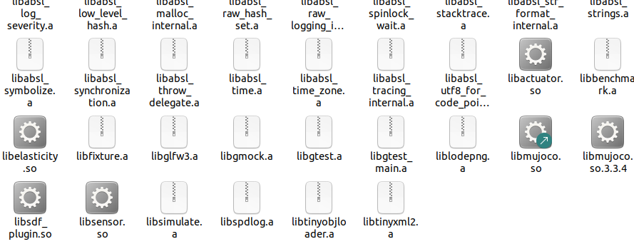
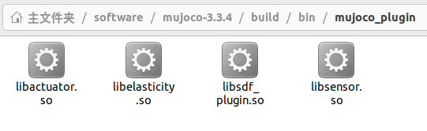
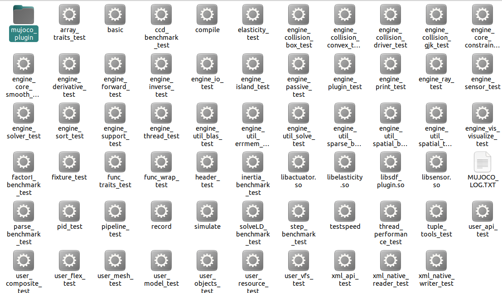

###### datetime:2025/12/27 12:51

###### author:nzb

> 该项目来源于[mujoco_learning](https://github.com/Albusgive/mujoco_learning)

# Mujoco 安装

## 方法1：编译安装
* 克隆项目
  ``` git clone https://github.com/google-deepmind/mujoco.git ```
* 编译（建议开启魔法）
```
cd mujoco
mkdir build
cd build
cmake ..
cmake --build . 
# 多线程编译使用 
cmake --build . -j线程数
```  
* 选择安装位置（推荐/opt）  
  `cmake -DCMAKE_INSTALL_PREFIX=/opt/mujoco .`
* `sudo cmake --install .`

### 插件支持

创建一个mujoco_plugin文件夹，再将编译好之后的build/lib下的链接库(如libactuator.so，libelasticity.so，libsdf_plugin.so，libsensor.so等)拷贝到该文件夹中
把该文件夹拷贝到你运行simulata的同级目录中
1.

2.

3.

**之后就可以加载model/plugin中的模型**

### 测试
```
cd bin/
./simulate ../model/humanoid.xml
```

## 方法2：release版本

在github上下载对应平台的压缩包解压即可
https://github.com/google-deepmind/mujoco/releases
### 测试
```
cd bin/
./simulate ../model/humanoid/humanoid.xml
```

## 方法3：python安装

  `pip install mujoco`
### 测试
 `python -m mujoco.viewer` or `python3 -m mujoco.viewer`
 或者加载模型
 `python -m mujoco.viewer --mjcf=/path/to/some/mjcf.xml` or
 `python3 -m mujoco.viewer --mjcf=/path/to/some/mjcf.xml`

遇到`GLIBCXX_x.x.xx' not found`类似问题可尝试更新libstdcxx
`conda install -c conda-forge libstdcxx-ng`