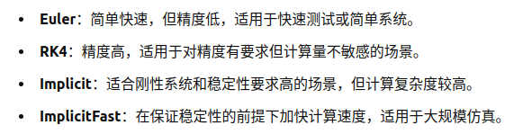
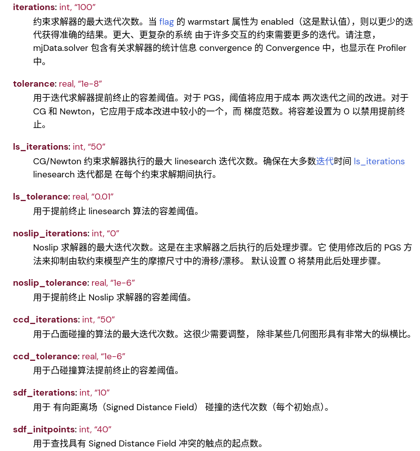

###### datetime:2025/12/27 12:51

###### author:nzb

> 该项目来源于[mujoco_learning](https://github.com/Albusgive/mujoco_learning)

# 仿真世界

## 世界根节点
```xml
<mujoco model="模型名称">
</mujoco>
```
## 仿真计算配置

### compiler节点
```xml
<compiler angle="radian/degree" autolimits="true" >
```
compiler节点中定义的包括angle（角度单位），autolimits（受力限制）等，常用的就像上面这样写就行，规定角度单位为弧度制，受力限制开启。角度单位为弧度制是机器人开发的常用单位制。

### option节点
```xml
<option timestep="0.002" gravity="0 0 -9.81" integrator="implicitfast" 
density="1.225" viscosity="1.8e-5"/>
```
* `timestep` 代表仿真走一步的时间，也就是运行一次之后仿真计算出 `timestep` 时长后的世界，单位秒。 `timestep` 是一定要规定的，不然仿真不知道如何计算
* `gravity` 重力加速度
* `wind` 风在`x,y,z`三个方向的速度
* `magnetic="0 -0.5 0"`世界磁场，影响磁力传感器
* `density` 介质密度，水，空气等，单位`kg/m³`
* `viscosity` 介质粘度
* `integrator= [Euler/RK4/implicit/implicitfast]`积分器，默认欧拉，用于仿真世界每步就求解计算，各个优势见下图

    

* `solver= [PGS, CG, Newton]`求解器配置，默认牛顿
* `iterations="100"` 约束求解器最大迭代次数,按需配置。

- 求解器其他配置：


## 可视化配置

### visual节点
```xml
<visual>
    <global realtime="1"/>
    <quality shadowsize="16384" numslices="28" offsamples="4" />
    <headlight diffuse="1 1 1" specular="0.5 0.5 0.5" active="1" />
    <rgba fog="0 1 0 1" haze="1 0 0 1"/>
</visual>
```
* `global`: `realtime` 仿真速度比例，在 `simulate` 中可以使用，大于1的按1计算
* `quality`:画面渲染质量
  * `shadowsize`：这个数值越高，他的阴影细节越好
  * `numslices`：涉及到一些渲染的面数，还有也就是他渲染的计算量，会和这个显存额有有关系一些，然后还有它的这个计算速度有关系，然后和它的渲染精度也是这个越大效果越好，越低效果越差
  * `offsamples`：抗锯齿，数值越高，渲染效果越好，但是计算量也会增加
* `headlight`：头灯，和 `simulate` 中自由相机相同方向的光源
  * `diffuse`：漫反射颜色
  * `specular`：镜面反射颜色
  * `active`：是否开启
* `map`：鼠标影响操作
* `scale`：渲染缩放，默认不改，实际一般通过代码修改
* `rgba`: `fog` 迷雾颜色；`haze` 地平线颜色

## 资源配置
```xml
<asset>
    <mesh name="tetrahedron" vertex="0 0 0 1 0 0 0 1 0 0 0 1" />
    <mesh file="card.obj" scale="10 10 10"/>
    <texture type="2d" file="./king_of_clubs.png" />
    <material name="king_of_clubs" texture="king_of_clubs" />
    <hfield name="agent_eval_gym" file="agent_eval_gym.png" size="10 10 1 1" />
    <texture type="skybox" file="./imgs/desert.png"
        gridsize="3 4" gridlayout=".U..LFRB.D.." />
    <texture name="plane" type="2d" builtin="checker" rgb1=".1 .1 .1" rgb2=".9 .9 .9"
        width="512" height="512" mark="cross" markrgb=".8 .8 .8" />
    <material name="plane" reflectance="0.3" texture="plane" texrepeat="1 1" texuniform="true"/>
    <material name="box" rgba="0 0.5 0 1"  emission="0"/>
</asset>
```

### 几何资源 mesh
* `name` 资源名称，如果不指定，默认为文件名
* `vertex` 通过坐标点`x,y,z`构造几何体
* `scale` 缩放
* `file` 加载obj或者stl模型，不指定name默认为文件名
* `hfield` 高度场，通过高度图加载几何体，实际是一张`png`灰度图
  * `file`：文件路径
  * `size`：尺寸，`x,y,z,base_z`, `base_z`为高度场基准高度

### 纹理/材质资源
* `texture` 可以通过加载 `png` 对物体进行贴图，使用方法 `texture` 不能直接使用，只能作为参数传给 `material` 使用
  * `type`: 类型，包括`2d` `cube` `skybox`
  * `file`: 文件路径
* `material` 材质，可以指定纹理，颜色，反射，发光等
  * `name` 材质名称
  * `texture` 纹理名称
  * `rgba` 颜色
  * `emission` 发光
  * `reflectance` 反射率
  * 等等
* `skybox` `texture` 的类型，直接加载即可，一个场景里只能有一个`skybox`
  * `gridsize`：网格大小
  * `gridlayout`：网格布局，`.U..LFRB.D..`，U：上，L：左，R：右，F：前，B：后，D：下


**地板演示：**
```xml
    <texture name="plane" type="2d" builtin="checker" rgb1=".1 .1 .1" rgb2=".9 .9 .9"
        width="512" height="512" mark="cross" markrgb=".8 .8 .8" />
    <material name="plane" reflectance="0.3" texture="plane" texrepeat="1 1" texuniform="true"/>
```

**天空盒演示：**
```xml
<texture type="skybox" builtin="gradient" rgb1="1 1 1" rgb2="0.6 0.8 1" width="256" height="256"/>
```