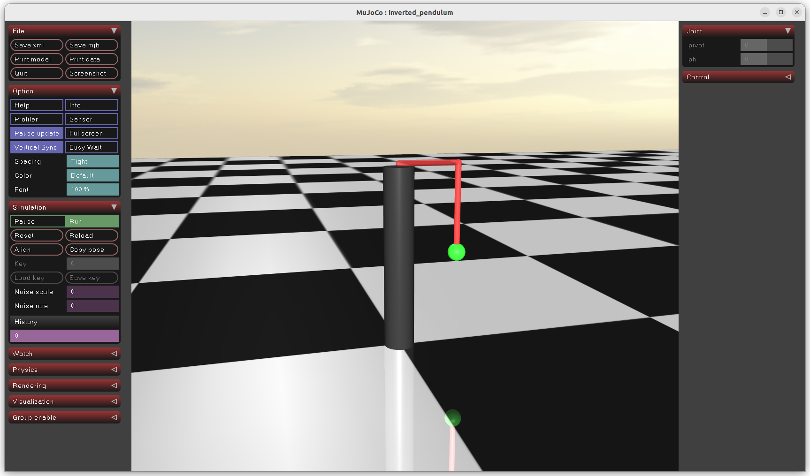

###### datetime:2025/12/27 12:51

###### author:nzb

> 该项目来源于[mujoco_learning](https://github.com/Albusgive/mujoco_learning)

# joint


&emsp;&emsp;joint将body之间连接在一起，使其可以进行活动。这么说吧，body中的所有geom为一个整体然后joint是连接这些整体的。就是body和body靠joint活动，body中只能有一个joint用来连接当前body和上一层body。再根本一点就是joint对于上一层body是相对静止的，当前body与joint是在运动。
* name
* `tpye="[free/ball/slide/hinge]"` 自由关节，一般不用；球形关节，绕球旋转；滑轨；旋转关节
* `pos="0 0 0"`关节在body的位置
* `axis="0 0 1"` x,y,z活动轴，只有 slide 和 hinge 有用
* `stiffness="0"` 弹簧，数值正让关节具有弹性, 一般调整 PD 控制器的 P 值
**`(0-pos)*stiffness`**
* `range="0 0"` 关节限制，当球形时只有二参有效，一参设置为0，但是要在 `compiler` 指定 `autolimits`
* `limited="auto"` 此属性指定关节是否有限制
* `damping="0"` 阻尼, 交叉滚子轴承 `damping`, 在Isaac Gym中的PD控制器中，D 是 `damping`，P 是 `stiffness`
**`(0-v)*damping`**, v 为速度
* `frictionloss="0"`关节摩擦损失
* `armature="0"` 电枢，[转子转动惯量*减速比^2（很小的值）](https://blog.csdn.net/xingmeng416/article/details/115765475)
* `ref` 角度偏置，每次计算的时候都会加上这个值返回

```xml
<?xml version="1.0" encoding="utf-8"?>
<mujoco model="inverted_pendulum">
    <compiler angle="radian" meshdir="meshes" autolimits="true" />
    <option timestep="0.002" gravity="0 0 -9.81" wind="0 0 0" integrator="implicitfast"
        density="1.225"
        viscosity="1.8e-5" />

    <visual>
        <global realtime="1" />
        <quality shadowsize="16384" numslices="28" offsamples="4" />
        <headlight diffuse="1 1 1" specular="0.5 0.5 0.5" active="1" />
        <rgba fog="1 0 0 1" haze="1 1 1 1" />
    </visual>

    <asset>
        <texture type="skybox" file="../asset/desert.png"
            gridsize="3 4" gridlayout=".U..LFRB.D.." />
        <texture name="plane" type="2d" builtin="checker" rgb1=".1 .1 .1" rgb2=".9 .9 .9"
            width="512" height="512" mark="cross" markrgb=".8 .8 .8" />
        <material name="plane" reflectance="0.3" texture="plane" texrepeat="1 1" texuniform="true" />
        <material name="box" rgba="0 0.5 0 1" emission="0" />
    </asset>

    <default>
        <geom solref=".5e-4" solimp="0.9 0.99 1e-4" fluidcoef="0.5 0.25 0.5 2.0 1.0" />
        <default class="card">
            <geom type="mesh" mesh="card" mass="1.84e-4" fluidshape="ellipsoid" contype="0"
                conaffinity="0" />
        </default>
        <default class="collision">
            <geom type="box" mass="0" size="0.047 0.032 .00035" group="3" friction=".1" />
        </default>
    </default>

    <worldbody>
        <geom name="floor" pos="0 0 0" size="10 10 .1" type="plane" material="plane"
            condim="3" />
        <light directional="true" ambient=".3 .3 .3" pos="30 30 30" dir="0 -2 -1"
            diffuse=".5 .5 .5" specular=".5 .5 .5" />

        <!-- 支撑柱 -->
        <body name="support" pos="0 0 0.1">
            <geom type="cylinder" mass="100" size="0.05 0.5" rgba="0.2 0.2 0.2 1"/>
            <!-- 水平杆 -->
            <body name="rotay_am" pos="0 0 0.51">
                <joint type="hinge" name="pivot" pos="0 0 0" axis="0 0 1" damping="0.001"
                    frictionloss="0.0" stiffness="0.5"/>
                <geom type="capsule" mass="0.01" fromto="0 0 0 0.2 0 0" size="0.01"
                    rgba="0.8 0.2 0.2 0.5"/>
                <!-- 摆 -->
                <body name="pendulum" pos="0.2 0 0">
                    <joint type="hinge" name="ph" pos="0 0 0" axis="1 0 0" damping="0.001"
                        frictionloss="0.0" />
                    <geom type="capsule" mass="0.005" fromto="0 0 0 0 0 -0.3" size="0.01"
                        rgba="0.8 0.2 0.2 1" />
                    <!-- 配重 -->
                    <geom type="sphere" mass="0.01" size="0.03" pos="0 0 -0.3" rgba="0.2 0.8 0.2 1" />
                </body>
            </body>
        </body>

    </worldbody>
</mujoco>
```