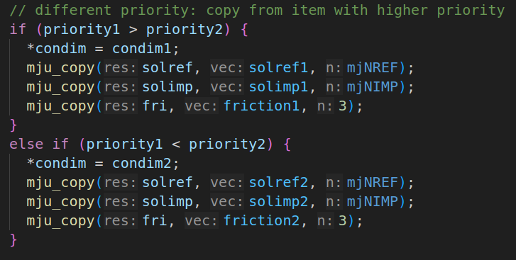
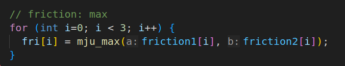
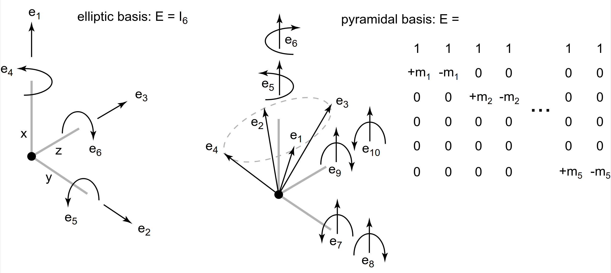
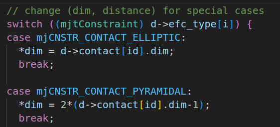
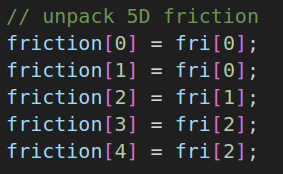
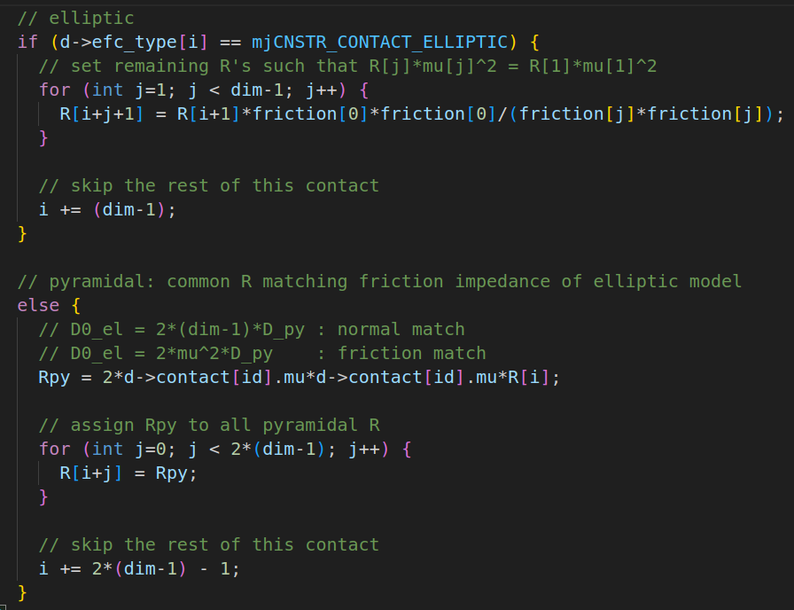

###### datetime:2025/12/27 12:51

###### author:nzb

> 该项目来源于[mujoco_learning](https://github.com/Albusgive/mujoco_learning)

# friction

`friction` 有三个参数分别是滑动摩擦，转动摩擦，滚动摩擦系数

## option（椭圆/金字塔）

`cone=[pyramidal, elliptic]` 摩擦力近似计算方法,默认 `pyramidal` 金字塔计算速度快， `elliptic` 椭圆效果更好

`impratio="1"` 椭圆摩擦的比例，更高的数值摩擦力会更硬一些，防止打滑，不建议在使用 `pyramidal` 的时候调大，适合机械臂抓取打滑时调整参数

## 优先级

**摩擦计算的时候会先根据 geom 的 priority 选择使用那个 geom 的 friction 参数，如果相同就会选择最大的使用**

源码位置：engine/engine_collision_driver.c: mj_contactParam



## condim设置

|condim|作用|
|---|----|
|1|只有垂直于接触面的法向力，两个物体碰撞或者挤压产生的力|
|3|可以生成接触面上的力，也就是常见的摩擦力，friction第一个参数调控|
|4|增加了抑制在绕接触面法线旋转的摩擦力，friction第二个参数调控|
|6|会抑制滚动，滚动摩擦力是滚动过程中接触变形产生的能量损耗，friction第三个参数调控|

## 计算

### 约束力维度
摩擦力在mujoco中是约束力的一部分，根据不同condim会产生不同数量的约束力，elliptic产生condim相同维度的约束力，pyramidal则会产生2*(condim-1)维度的约束力

**condim和约束力维度：**
|condim|elliptic|pyramidal|
|-|-|-|
|1|e1|e1|
|3|e1~e3|e1~e4|
|4|e1~e4|e1~e6|
|6|e1~e6|e1~e10|

**约束力对应摩擦系数：**
|elliptic|pyramidal||
|-|-|-|
|e1|e1|None|
|e1~e3|e1~e4|friction1|
|e4|e5,e6|friction2|
|e5,e6|e7~e10|friction3|

**源码：**
engine/engine_core_constraint.c：getposdim      
      
engine/engine_core_constraint.c：mj_makeImpedance           
**下面friction是一个长度为5的数组，fri是mjcf中定义的friction参数**      
     
     

官方文档：
- [Contact](https://mujoco.readthedocs.io/en/latest/computation/index.html#contact)
- [Friction cones](https://mujoco.readthedocs.io/en/latest/computation/index.html#friction-cones)


```xml
<?xml version="1.0" encoding="utf-8"?>
<mujoco model="inverted_pendulum">
    <compiler angle="radian"/>
    <option timestep="0.002" gravity="0 0 -9.81" wind="0 0 0" integrator="implicitfast"
    cone="elliptic" impratio="1"/>

    <visual>
        <global realtime="1" />
        <quality shadowsize="16384" numslices="28" offsamples="4" />
        <headlight diffuse="1 1 1" specular="0.5 0.5 0.5" active="1" />
        <rgba fog="1 0 0 1" haze="1 1 1 1" />
    </visual>

    <asset>
        <texture type="skybox" file="./imgs/desert.png"
            gridsize="3 4" gridlayout=".U..LFRB.D.." />
        <texture name="plane" type="2d" builtin="checker" rgb1=".1 .1 .1" rgb2=".9 .9 .9"
            width="512" height="512" mark="cross" markrgb=".8 .8 .8" />
        <material name="plane" reflectance="0.3" texture="plane" texrepeat="1 1" texuniform="true" />
        <texture name="y_and_c" type="cube" builtin="checker" rgb1="1 1 0" rgb2="0 1 1"
            width="512" height="512" />
        <material name="y_and_c" reflectance="0.3" texture="y_and_c" texrepeat="1 1"
            texuniform="true" />
        <texture name="r_and_b" type="cube" builtin="checker" rgb1="1 0 0" rgb2="0 0 1"
            width="512" height="512" />
        <material name="r_and_b" reflectance="0.3" texture="r_and_b" texrepeat="1 1"
            texuniform="true" />
        <texture name="g_and_b" type="cube" builtin="checker" rgb1="0 1 0" rgb2="0 0 1"
            width="512" height="512" />
        <material name="g_and_b" reflectance="0.3" texture="g_and_b" texrepeat="1 1"
            texuniform="true" />

        <texture name="r2b" type="cube" builtin="gradient" rgb1="1 0 0" rgb2="0 0 1"
            width="512" height="512" />
        <material name="r2b" reflectance="0.3" texture="r2b" texrepeat="1 1"
            texuniform="true" />
        <texture name="g2b" type="cube" builtin="gradient" rgb1="0 1 0" rgb2="0 0 1"
            width="512" height="512" />
        <material name="g2b" reflectance="0.3" texture="g2b" texrepeat="1 1" texuniform="true" />
        <mesh name="slope1"
            vertex="0 0 0 
                1 0 0
                1 2 0 
                0 2 0
                1 2 1
                0 2 1" />
        <mesh name="slope2"
            vertex="0 0 0 
                    1 0 0
                    1 2 0 
                    0 2 0
                    1 2 0.5
                    0 2 0.5" />
    </asset>

    <worldbody>
        <geom name="floor" pos="0 0 0" size="10 10 .1" type="plane" material="plane"
            condim="3" friction="1 0.005 0.0001" priority="-1" />
        <light directional="true" ambient=".3 .3 .3" pos="30 30 30" dir="0 -2 -1"
            diffuse=".5 .5 .5" specular=".5 .5 .5" />

        <body pos="-1 -1 0.3">
            <freejoint />
            <geom type="box" mass="1" size="0.3 0.3 0.3" condim="1" friction="1 0.005 0.0001"
                rgba="1 0.2 0.2 1" />
        </body>

        <body pos="0 -1 0.3">
            <freejoint />
            <geom type="box" mass="1" size="0.3 0.3 0.3" condim="3" friction="1 0.005 0.0001"
                rgba="0.2 1 0.2 1" />
        </body>

        <body pos="-1 0 0.3">
            <freejoint />
            <geom type="sphere" mass="1" size="0.3" condim="3" friction="1 0.01 0.01"
                material="r_and_b" />
        </body>

        <body pos="0 0 0.3">
            <freejoint />
            <geom type="sphere" mass="1" size="0.3" condim="4" friction="1 0.01 0.01"
                material="y_and_c" />
        </body>

        <body pos="1 0 0.3">
            <freejoint />
            <geom type="sphere" mass="1" size="0.3" condim="6" friction="1 0.01 0.01"
                material="g_and_b" />
        </body>

        <!-- 斜坡 -->
        <body pos="-2.5 1 0">
            <geom type="mesh" mesh="slope1" priority="-1" material="r2b" />
        </body>
        <body pos="-2 2.6 1.2">
            <freejoint />
            <geom type="cylinder" mass="1" size="0.3" condim="1" fromto="0 0 0 0 0.1 -0.2"
                friction="1 0.005 0.01" material="r2b" />
        </body>

        <body pos="-1 1 0">
            <geom type="mesh" mesh="slope1" priority="-1" material="g2b" />
        </body>
        <body pos="-0.5 2.6 1.2">
            <freejoint />
            <geom type="cylinder" mass="1" size="0.3" condim="3" fromto="0 0 0 0 0.1 -0.2"
                friction="1 0.005 0.01" material="g2b" />
        </body>


        <body pos="1.5 1 0">
            <geom type="mesh" mesh="slope2" priority="-1" material="r2b" />
        </body>
        <body pos="2 2.6 0.7">
            <freejoint />
            <geom type="sphere" mass="1" size="0.3" condim="4" friction="1 0.005 0.01"
                material="r2b" />
        </body>
        
        <body pos="2.5 1 0">
            <geom type="mesh" mesh="slope2" priority="-1" material="g2b" />
        </body>
        <body pos="3 2.6 0.7">
            <freejoint />
            <geom type="sphere" mass="1" size="0.3" condim="6" friction="1 0.005 0.05"
                material="g2b" />
        </body>
        

    </worldbody>
</mujoco>

```