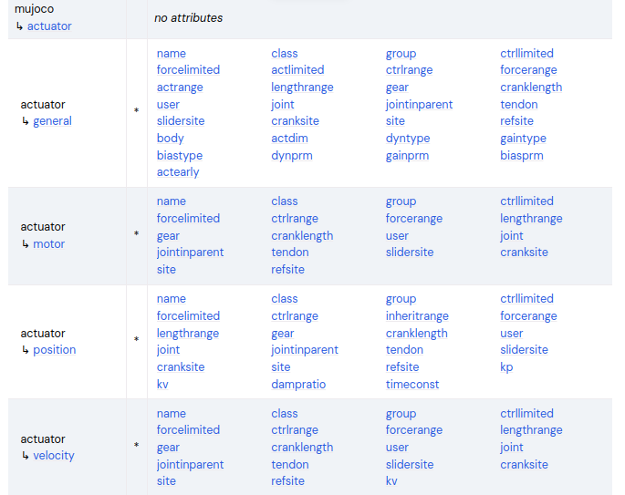
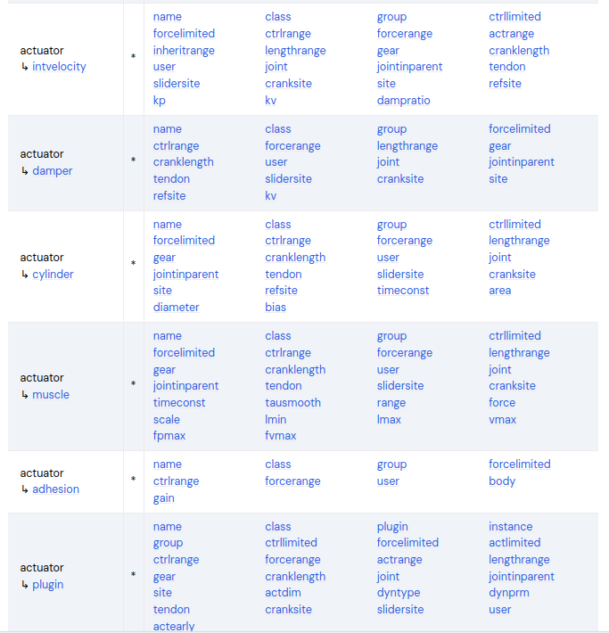
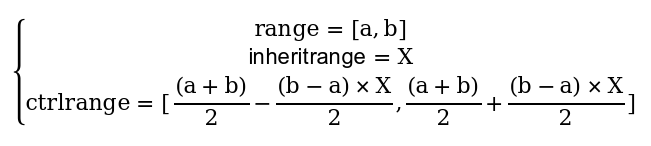

###### datetime:2025/12/27 12:51

###### author:nzb

> 该项目来源于[mujoco_learning](https://github.com/Albusgive/mujoco_learning)

# actuator

<font color=DarkCyan>*actuator 节点包含在 mujoco 节点中*</font>

这是 mujoco中运动控制的节点，在这里指定驱动器，给机器人加入肌肉。

## general 通用驱动器



  

&emsp;&emsp;`general` 驱动器类似编程语言中的父对象，后面很多驱动器继承该驱动器的属性，建模的时候不要使用该驱动器。name，class，group   

**ctrllimited=[false/true/auto]**   

&emsp;&emsp;控制限制，指对驱动器输入值限制，默认 auto, auto 和 true 下面的`ctrlrange`就生效  

**ctrlrange="0 0"**  

&emsp;&emsp;控制范围        

**forcelimited==[false/true/auto]** ，同上      
&emsp;&emsp;驱动器输出力范围     

**forcerange="0 0"**    

&emsp;&emsp;力范围      

**actlimited==[false/true/auto]** ，同上     
&emsp;&emsp;驱动器活动范围      

**actrange="0 0"**      

&emsp;&emsp;活动范围，如平面关节为角度范围，默认单位按照设置单位**lengthrange="0 0"**       
&emsp;&emsp;活动长度范围，模拟肌肉用到的  

**cranklength="0"**     

&emsp;&emsp;用于滑块曲柄，设置连杆长度，先建立连杆结构的几何体，之后直接将组合几何体给到 cranksite   

**cranksite="string"**      

&emsp;&emsp;指定曲柄滑块机构  

**gear="100000"**       

&emsp;&emsp;对力进行缩放第一个参数有效，其余是joint、
jointinparent和site用的，先不用管       

**tendon="string"**   

&emsp;&emsp;肌腱，抽象控制器组合，比如双轮同时控制，多个控制器合成一控制输入 

**dynprm，gainprm，biasprm**

这些参数都是任意数量        
&emsp;&emsp;激活动态参数,表现为阻尼或者响应     
&emsp;&emsp;增益参数，表现为映射或者缩放        
&emsp;&emsp;偏置参数，零点偏置      

## motor 驱动器

扭矩控制器，和电机差不多，相当于通用驱动器如下设置：  


|Attribute	|Setting|	Attribute|	Setting|
|-----------|-------|------------|---------|
|dyntype	|none	|dynprm	|1 0 0|
|gaintype	|fixed	|gainprm	|1 0 0|
|biastype	|none	|biasprm	|0 0 0|

其他属性继承通用驱动器

<font color=Green>*演示：*</font>

`<motorjoint="joint"name="Torque"/>`

<font color=Green>*等效：*</font>

```xml
<general joint="joint" name="Torque" ctrlrange="-1 1" dynprm="1 0 0" gainprm="1 0 0" biasprm="0 0 0"/>
```

## position 驱动器

位置控制伺服，相当于通用的

|Attribute	|Setting	|Attribute	|Setting|
|-----------|-----------|-----------|-------|
|dyntype	|none or filterexact|	dynprm	|timeconst 0 0|
|gaintype	|fixed	|gainprm	|kp 0 0|
|biastype	|affine	|biasprm	|0 -kp -kv|

**kp=" 0 "（反馈增益，比例，相当于输入*kp）**

**kv=" 0 "**

&emsp;&emsp;阻尼，使用这个建议 option中积分器改成 implicitfast或者implicit

**dampratio=" 0 "**

&emsp;&emsp;阻尼比，加了阻尼才能加这个，计算方式为 2 √(kp*m)，值为 1 对应于临界阻尼振荡器，该振荡器通常会产生理想的行为。小于或大于 1 的值分别对应于欠阻尼和过阻尼振荡。小于或大于 1 的值分别对应于欠阻尼和过阻尼振荡

**timeconst=" 0 "**

&emsp;&emsp;大于 0 为一阶滤波器时间常数，等
于 0 不使用滤波器）。inheritrange（看文档）。

<font color=Green>*演示：*</font>

```xml
<position joint="joint" name="pos" kp="2" kv="0.1"/>
```

**inheritrange：**

|inheritrange|	ctrlrange|
|------------|-----------|
|0	|手动设置|
|1.0	|和限制的range一致|
|<1.0	|大于限制|
|>1.0	|小于限制|

&emsp;&emsp;非0/1.0时计算公式：



<font color=Green>*演示：*</font>

```xml
<position joint="joint" name="pos" kp="2" kv="0.1" />
```

## velocity 驱动器

速度伺服控制，等效通用驱动器：

|Attribute|	Setting|	Attribute|	Setting|
|---------|--------|-------------|---------|
|dyntype|	none|	dynprm|	1 0 0|
|gaintype|	fixed	|gainprm|	kv 0 0|
|biastype|	affine|	biasprm|	0 0 -kv|

**kv（速度增益）**

## intvelocity 驱动器

积分速度伺服：

|Attribute	|Setting|	Attribute|	Setting|
|-----------|-------|------------|---------|
|dyntype	|integrator|	dynprm|	1 0 0|
|gaintype	|fixed|	gainprm|	kp 0 0|
|biastype	|affine|	biasprm|	0 -kp -kv|
|actlimited	|true|		|     -          |

这里 kp变成速度增益了，kv变为积分。
inheritrange同上position

## damper 驱动器

产生与速度和控制正比的力，建议开建议 option中积分器 implicitfast或者 implicit，
F=-kv*velocity*control,等效：

|Attribute	|Setting|	Attribute|	Setting|
|-----------|-------|------------|---------|
|dyntype	|none	|dynprm	|1 0 0|
|gaintype	|affine|	gainprm|	0 0 -kv|
|biastype	|none	|biasprm|	0 0 0|
|ctrllimited|	true|		| - |

## cylinder 驱动器

气缸和液缸模拟：

|Attribute|	Setting|	Attribute|	Setting|
|---------|--------|-------------|---------|
|dyntype|	filter|	dynprm|	timeconst 0 0|
|gaintype|	fixed|	gainprm|	area 0 0|
|biastype|	affine|	biasprm|	bias(3)|

**timeconst=" 1 "（时间常数）**
**area=" 1 "（圆柱体面积，输出增益）**
**diameter=""（指定为直径，比面积优先）**
**bias=" 000 "（偏置）**

<font color=Green>*演示：*</font>

```xml
<actuator>
    <position joint="rfd" name="rfdp" kp="2" kv="0.1"/>
    <motor joint="rfa" name="rfav"/>
</actuator>
```

```xml
<?xml version="1.0" encoding="utf-8"?>
<mujoco model="inverted_pendulum">
    <compiler angle="radian" meshdir="meshes" autolimits="true" />
    <option timestep="0.002" gravity="0 0 -9.81" wind="0 0 0" integrator="implicitfast"
        density="1.225"
        viscosity="1.8e-5" />

    <visual>
        <global realtime="1" />
        <quality shadowsize="16384" numslices="28" offsamples="4" />
        <headlight diffuse="1 1 1" specular="0.5 0.5 0.5" active="1" />
        <rgba fog="1 0 0 1" haze="1 1 1 1" />
    </visual>

    <asset>
        <texture type="skybox" file="../asset/desert.png"
            gridsize="3 4" gridlayout=".U..LFRB.D.." />
        <texture name="plane" type="2d" builtin="checker" rgb1=".1 .1 .1" rgb2=".9 .9 .9"
            width="512" height="512" mark="cross" markrgb=".8 .8 .8" />
        <material name="plane" reflectance="0.3" texture="plane" texrepeat="1 1" texuniform="true" />
        <material name="box" rgba="0 0.5 0 1" emission="0" />
    </asset>

    <default>
        <geom solref=".5e-4" solimp="0.9 0.99 1e-4" fluidcoef="0.5 0.25 0.5 2.0 1.0" />
        <default class="card">
            <geom type="mesh" mesh="card" mass="1.84e-4" fluidshape="ellipsoid" contype="0"
                conaffinity="0" />
        </default>
        <default class="collision">
            <geom type="box" mass="0" size="0.047 0.032 .00035" group="3" friction=".1" />
        </default>
    </default>

    <worldbody>
        <geom name="floor" pos="0 0 0" size="10 10 .1" type="plane" material="plane"
            condim="3" />
        <light directional="true" ambient=".3 .3 .3" pos="30 30 30" dir="0 -2 -1"
            diffuse=".5 .5 .5" specular=".5 .5 .5" />

        <!-- 支撑柱 -->
        <body name="support" pos="0 0 0.1">
            <geom type="cylinder" mass="100" size="0.05 0.5" rgba="0.2 0.2 0.2 1" />
            <!-- 水平杆 -->
            <body name="rotay_am" pos="0 0 0.51">
                <joint type="hinge" name="pivot" pos="0 0 0" axis="0 0 1" damping="0.001"
                    frictionloss="0.0"/>
                <geom type="capsule" mass="0.01" fromto="0 0 0 0.2 0 0" size="0.01"
                    rgba="0.8 0.2 0.2 0.5" />
                <!-- 摆 -->
                <body name="pendulum" pos="0.2 0 0">
                    <joint type="hinge" name="ph" pos="0 0 0" axis="1 0 0" damping="0.001"
                        frictionloss="0.0" />
                    <geom type="capsule" mass="0.005" fromto="0 0 0 0 0 -0.3" size="0.01"
                        rgba="0.8 0.2 0.2 1" />
                    <!-- 配重 -->
                    <geom type="sphere" mass="0.01" size="0.03" pos="0 0 -0.3" rgba="0.2 0.8 0.2 1" />
                </body>
            </body>
        </body>
    </worldbody>

    <actuator>
        <!-- <motor name="pivot" joint="pivot" ctrlrange="-5 5" forcerange="-0.1 0.1" /> -->
        <!-- <motor name="ph" joint="ph"/> -->
        <position kp="2" kv="0.1" name="pivot" joint="pivot" ctrlrange="-3.14 3.14" forcerange="-5 5" />
        <intvelocity name="ph" joint="ph" kp="100" kv="2" actrange="-1 1"/>
    </actuator>
</mujoco>
```