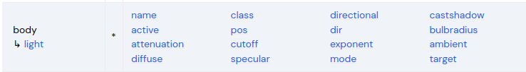
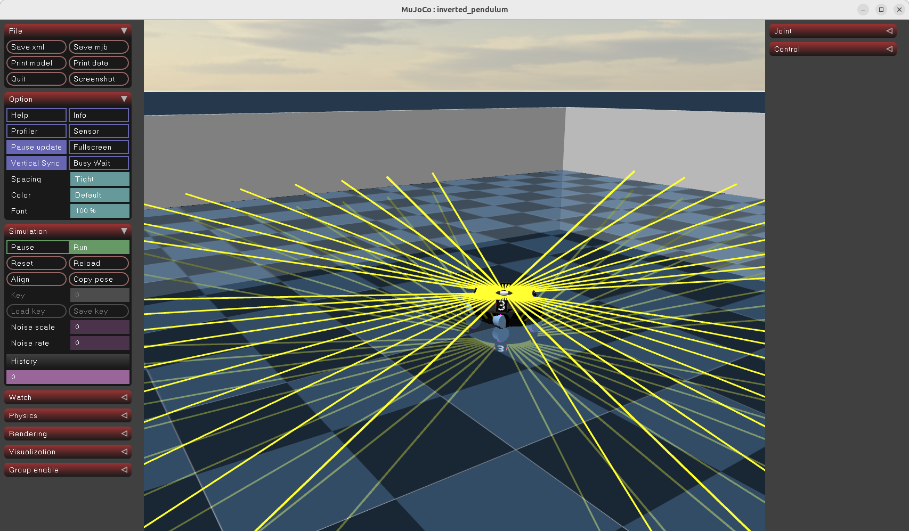
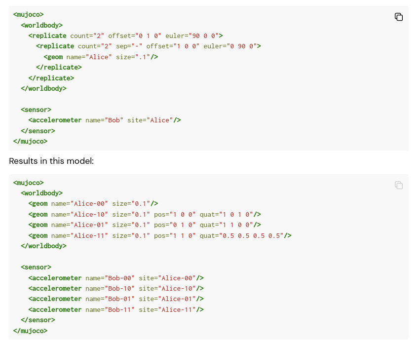

###### datetime:2025/12/27 12:51

###### author:nzb

> 该项目来源于[mujoco_learning](https://github.com/Albusgive/mujoco_learning)

# light 灯光节点



**name=""（用来索引）**  
**mode=[fixed/track/trackcom/targetbody/targetbodycom]**  
&emsp;&emsp;fixed在某处固定光   
&emsp;&emsp;tarck追踪物体的 trackcom几乎差不多      
&emsp;&emsp;targetbody跟着body一起动的      
**target=""**       
&emsp;&emsp;跟踪的目标      
**directional=[false/true]**        
&emsp;&emsp;true是定向的光，就像场一样，定向平行光；false就是聚光灯，和车灯一样     
**castshadow="[true/false]"**       
&emsp;&emsp;照射物体有没有影子      
**active="bool"**       
&emsp;&emsp;是否能控制开关灯**      
**pos="0 0 0"**     
**dir="0 0 0"**     
&emsp;&emsp;方向        
**attenuation="1 0 0"**     
&emsp;&emsp;衰减系数,[a,b,c],I(d)=I_0/a+bd+cd^2。可以看到a,b,c越大，衰减越明显。        
**cutoff="0"**      
&emsp;&emsp;聚光灯截止（最大）角度，角度制      
**exponent="0"**        
&emsp;&emsp;聚光灯汇聚光程度，数值越大光线角度越小      
**ambient="0 0 0"**     
&emsp;&emsp;颜色，亮度也算是这个        
**diffuse="0.7 0.7 0.7"**       
&emsp;&emsp;漫射颜色        
**specular="0.3 0.3 0.3"**      
&emsp;&emsp;反射颜色        
<font color=Green>*定向光演示：*</font>     
```xml
<light directional="true" ambient="111 "pos=" 005 "dir=" 00 - 1 " diffuse=" 111 "specular=" 111 "/>
```
<font color=Green>*车灯演示：*</font>
```xml
<light pos="0.1 0.02" dir="10 0 -1" ambient="1 1 1" cutoff="60" exponent="0" mode="targetbody" diffuse="1 1 1" specular=" 1 1 1"/>
```
<font color=Green>*跟踪物体打光：*</font>
```xml
<light name="light2arm" castshadow="true" mode="targetbody" target="armor0" diffuse="1 0 0" specular="1 0 0" ambient="1 0 0" cutoff="1" exponent="0" pos="2 2 1"/>
```

# replicate 复制节点（阵列排布）
&emsp;&emsp;mujoco中的阵列排布可以是圆周阵列和直线阵列，就像我们在常见的建模软件中的阵列一样，首先需要一个实体，可以是 body或者是 geom，然后我们要确定圆形，半径，排列数量，相距角度等。        
**count="0"**       
&emsp;&emsp;阵列数量        
**euler="0 0 0"**       
&emsp;&emsp;围绕三个轴阵列，参数为两个实体相隔角度，角度单位为 compiler中定义的     
**sep=""**      
&emsp;&emsp;名字分隔，阵列的实体名字会是原来的 name+编号,如果sep有字符，则是 name+sep+编号      
**offset="0 0 0"**      
&emsp;&emsp;阵列的坐标偏移，前两个是 xy偏移，第三个是阵列的元素在 z方向上的距离间隔，也就是螺旋上升     
<font color=Green>*圆周演示:*</font>
```xml  
<body name="laser" pos="0.25 0.25 0.5">
    <geom type="cylinder" size="0.01 0.01"/>
    <replicate count="50" euler="0 0 0.1254">
        <site name="rf" pos="0.1 0 0" zaxis="1 0 0" size="0.001 0.001 0.001" rgba="0.8 0.2 0.2 1"/>
    </replicate>
</body>
```
&emsp;&emsp;这个演示中我们在 body里面圆周阵列了 50 个site，绕 z轴，每个site相隔角度为 0. 1254 pi，阵列半径为site中pos的第一个参数，此时pos不再决定几何体的三维空间位置，而是配合阵列使用。  
<font color=Green>*效果:*</font>    


## 官方文档演示：
    

<font color=Green>*直线阵列演示（不加入 euler就是直线阵列,offset作为排布方向和间距）：*</font>  
```xml
<replicate count="4" offset="0 .5 0">
<geom type="box" size=".1 .1 .1"/>
</replicate>
```


```xml
<?xml version="1.0" encoding="utf-8"?>
<mujoco model="inverted_pendulum">
    <compiler angle="radian" meshdir="meshes" autolimits="true" />
    <option timestep="0.002" gravity="0 0 -9.81" wind="0 0 0" integrator="implicitfast"
        density="1.225"
        viscosity="1.8e-5" />

    <visual>
        <global realtime="1" />
        <quality shadowsize="16384" numslices="28" offsamples="4" />
        <headlight diffuse="1 1 1" specular="0.5 0.5 0.5" active="1" />
        <rgba fog="1 0 0 1" haze="1 1 1 1" />
    </visual>

    <asset>
        <texture type="skybox" file="../asset/desert.png"
            gridsize="3 4" gridlayout=".U..LFRB.D.." />
        <texture name="plane" type="2d" builtin="checker" rgb1=".1 .1 .1" rgb2=".9 .9 .9"
            width="512" height="512" mark="cross" markrgb=".8 .8 .8" />
        <material name="plane" reflectance="0.3" texture="plane" texrepeat="1 1" texuniform="true" />
        <material name="box" rgba="0 0.5 0 1" emission="0" />
    </asset>

    <default>
        <geom solref=".5e-4" solimp="0.9 0.99 1e-4" fluidcoef="0.5 0.25 0.5 2.0 1.0" />
        <default class="card">
            <geom type="mesh" mesh="card" mass="1.84e-4" fluidshape="ellipsoid" contype="0"
                conaffinity="0" />
        </default>
        <default class="collision">
            <geom type="box" mass="0" size="0.047 0.032 .00035" group="3" friction=".1" />
        </default>
    </default>

    <worldbody>
        <geom name="floor" pos="0 0 0" size="0 0 .1" type="plane" material="plane"
            condim="3" />
        <!-- 世界头灯 -->
        <!-- <light directional="true" ambient=".3 .3 .3" pos="30 30 30" dir="0 -2 -1"
            diffuse=".5 .5 .5" specular=".5 .5 .5" /> -->
        <!-- 舞台灯光 -->
        <light mode="targetbodycom" target="A" directional="false" ambient=".3 .3 .3" pos="0 0
        10"
            dir="0 -2 -1" cutoff="15" exponent="0"
            diffuse=".5 .5 .5" specular=".5 .5 .5" />

        <body name="A" pos="0 0 0.2">
            <freejoint />
            <geom type="box" size=".1 .1 .1" />
        </body>

        <body name="B" pos="0 0 0.5">
            <freejoint />
            <geom type="box" size=".1 .1 .1" rgba=".8 .1 .1 1" />
            <!-- 自身带一个灯光对场景打光 -->
            <light mode="trackcom" directional="false" ambient=".3 .3 .3" diffuse=".5 .5 .5" specular=".5 .5 .5" />
        </body>


        <body name="laser" pos="0 0 0.5">
            <geom type="sphere" size="0.01" rgba="0.2 0.2 0.2 1" />
            <replicate count="25" euler="0 0.251327412 0" sep="BBB">
                <!-- <replicate count="25" euler="0 0 0.251327412" sep="AAA"  offset="0.01 0.01 0.01"> -->
                <replicate count="25" euler="0 0 0.251327412" sep="AAA">
                    <site name="rf" pos="0.02 0 0" zaxis="1 0 0" size="0.001 0.001 0.001"
                        rgba="0.2 0.2 0.2 1" />
                </replicate>
            </replicate>
        </body>

        <!-- 直线阵列 -->
        <replicate count="10" offset="0 .5 .5">
            <geom type="box" size=".1 .1 .1" />
        </replicate>

        <!-- 用于可视化传感器 -->
        <!-- <geom type="box" size="5 0.1 5" pos="0 5 0" rgba="0.2 0.2 0.2 0.2"/>
        <geom type="box" size="5 0.1 5" pos="0 -5 0" rgba="0.2 0.2 0.2 0.2"/>
        <geom type="box" size="0.1 5 5" pos="5 0 0" rgba="0.2 0.2 0.2 0.2"/>
        <geom type="box" size="0.1 5 5" pos="-5 0 0" rgba="0.2 0.2 0.2 0.2"/>
        <geom type="box" size="5 5 0.1" pos="0 0 5" rgba="0.2 0.2 0.2 0.2"/> -->
    </worldbody>
    <sensor>
        <!-- 传感器 -->
        <!-- <rangefinder site="rf" /> -->
    </sensor>
</mujoco>
```