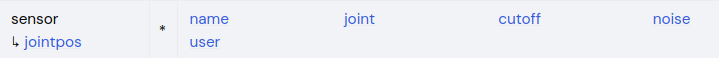
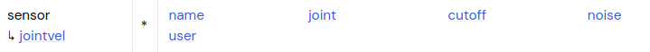
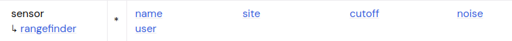
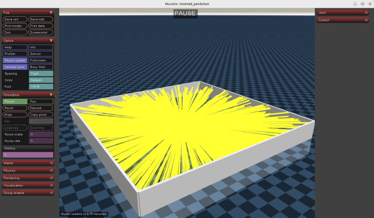
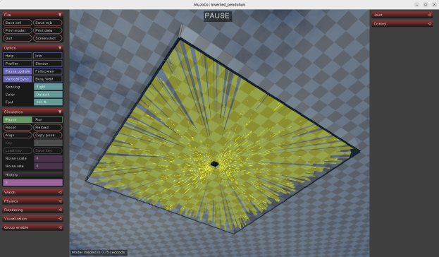
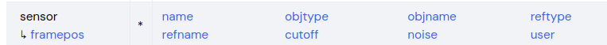
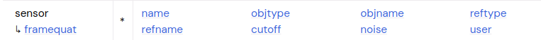
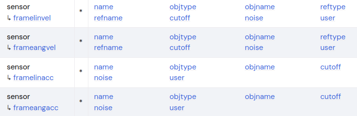

###### datetime:2025/12/28 12:25

###### author:nzb

> 该项目来源于[mujoco_learning](https://github.com/Albusgive/mujoco_learning)

# 传感器
**传感器基础属性为 name,noise（已经没有用了，仅作为标记信息），cutoff（是否绝
对值输出数据**）

## camera
&emsp;&emsp;和light元素很像，就像一个聚光灯一样。相同的配置有name.mode,target.pos,姿态的quat, axisangle, xyaxes, zaxis, euler，这些配置和上面的light一样。下面说明特有配置。（获取相机画面在mujoco接口里面讲解）        
**mode=[fixed/track/trackcom/targetbody/targetbodycom]**    
***设置相机视野有分为两种：***      
**1. fovy=" 45 "（垂直视野，单位度）。**        
**2. focal=" 00 "（焦距还对画面的长宽拉伸有影响，长度单位），sensorsize=" 00 "
（传感器尺寸，对畸变影响较大），resolution=" 00 "（分辨率）。**     
**focalpixel=" 0 0 "**      
&emsp;&emsp;焦距，单位像素      
**sensorsize=" 00 "**       
&emsp;&emsp;传感器角度      
**resolution=" 00 "**       
&emsp;&emsp;分辨率      
相机中心位置和fovy冲突principal="0 0"（相机中心位置，长度单位）       
**principalpixel="0 0"**        
&emsp;&emsp;相机中心位置，像素偏移      
**ipd="0.068"**     
&emsp;&emsp;瞳距，给双目用的

<font color=Green>*演示1：*</font>
```xml
<camera name="cam2armor" mode="targetbody"  target="armor0" principalpixel="200 200" focalpixel="1280 1080" sensorsize="4 4" resolution="1280 1080"/>
```
<font color=Green>*演示2：*</font>
```xml
<camera name="cam2armor1" mode="targetbody" target="armor0" fovy="54.225" />
```

## IMU
&emsp;&emsp;imu是常见机器人传感器，在mujoco中没有imu，而是分成了三个传感器（imu本身也是组合传感器），accelerometer（加速度计），gyro（陀螺仪）framequat（姿态）,这三个传感器都是输出三个数据，分别是x,y,z轴或者方向的数据。只要将这三个组合一下就能得到imu。
在使用传感器的时候一般使用一个 site作为传感器安装位置，然后将传感器的 site
固定到 site上。
&emsp;&emsp;在使用传感器的时候一般使用一个site作为传感器安装位置，然后将传感器的site固定到site上。

> F4 打开传感器窗口

<font color=Green>*演示：*</font>
```xml
<site name="imu" type="box" size="0.02 0.02 0.02"  />
......
<sensor>
    <!-- framequat 是姿态传感器，输出的是四元数数据，数据来自mjData.qpos -->
    <framequat name='orientation' objtype='site' objname='imu' />
    <!-- accelerometer 是加速度计，输出的是三个轴的数据，数据来自mjData.qacc -->
    <accelerometer name="accel" site="imu" />
    <!-- gyro 是陀螺仪，输出的是三个轴的数据，数据来自mjData.qvel -->
    <gyro name='base_ang_vel' site='imu' />
    <!-- subtreelinvel 是线速度，它是需要安装在 body 上的，输出的是三个轴的数据，数据来自mjData.qvel -->
    <subtreelinvel name="base_lin_vel" body="B" />
</sensor>
```

## 关节角度传感器

关节角度直接来自 mjData.qpos
```xml
<jointpos joint="joint_name" name="this_name"/>
```
## 关节速度传感器

关节角速度直接来自 mjData.qvel
```xml
<jointvel joint="joint_name" name="this_name"/>
```
## 激光测距传感器

&emsp;&emsp;绑定在 site上。不可见或者 rgba中 alpha= 0 的几何体不会被测量到，通过禁用其
geom组而在visualizer中不可见的会被测量。
**激光雷达处理**
&emsp;&emsp;激光雷达可以使用阵列排布传感器，在上面阵列排布中我们已经写完了传感器的阵列，
接下来只需要在传感器中将激光测距传感器绑定在阵列的 site中即可。
```xml
<rangefinder site="rf" />
```
3D激光雷达，我们只需要在xyz三个轴上分别阵列排布即可，注意按照现实中的激光雷达参数进行排布。

<font color=Green>*演示在第7节*</font>
<font color=Green>*效果：*</font>


<font color=Red>建议：</font>激光雷达在mujoco中计算频率和仿真频率相同，当点云数量较多的时候会严重影响效率，一般激光雷达的反馈频率都比较低，所以建议但开一个线程和模型单独计算激光雷达的点云数据。

## 力传感器（ **force and torque** ）
&emsp;&emsp;这两个都是在body之间作用的，加入力传感器我们可以知道一个body对另一个body的作用力。力传感器通过site安装到body中。
<font color=Green>*演示：*</font>
```xml
<body pos="0 0 1">
    <geom type="box" size=".3 .3 .005" rgba=".2 .2 .2 1"/>
    <body name="up_box" pos="0 0 .02">
        <site name="force_torque" />
        <geom type="box" size=".3 .3 .005" rgba=".3 .3 1 1"/>
    </body>
</body>
```
<font color=Green>*sensor：*</font>
```xml
<sensor>
    <force name="force" site="force_torque" />
    <torque name="torque" site="force_torque" />
</sensor>
```

## 球形关节传感器
**ballquat**
&emsp;&emsp;直接指定关节即可，传感器信息是球形关节四元数数据，数据和mjData.qpos一致。
**ballangvel**
&emsp;&emsp;直接指定关节即可，传感器信息是球形关节三个角速度数据，数据和mjData.qvel一致。

<font color=Green>*演示：*</font>
```xml
<ballquat name="ball" site="ball" />
<ballangvel name="ball" site="ball" />
```

## 相对传感器
**前面带 fram的都是可以获得全局或者相对的传感器数据。**

### 位置传感器
      
**objtype=[body,xbody,geom,site,camera]**       
&emsp;&emsp;传感器链接对象类型，body是全局,xbody是相对坐标      
**objname=""**      
&emsp;&emsp;传感器链接对象      
**reftype=[body,xbody,geom,site,camera]**       
&emsp;&emsp;参照系所附加到的对象的类型      
**refname=""**      
&emsp;&emsp;引用框架所附加到的对象的名称。      
&emsp;&emsp;解释：如果指定了 reftype和 refname那么传感器测量的就是相对于 refname的坐标。        

### 姿态传感器

这个参数和上面的一样。

### 速度、角速度、加速度和角加速度传感器

这些参数和上面的一样。

### 质心传感器
&emsp;&emsp;subtreecom可以获得body的运动质心的全局坐标。subtreelinvel可以获得body运动质心的线速度，subtreeangmom获得质心角动量。
这些传感器都是两个参数name和body（指定测量body）。


```xml
<?xml version="1.0" encoding="utf-8"?>
<mujoco model="inverted_pendulum">
    <compiler angle="radian" meshdir="meshes" autolimits="true" />
    <option timestep="0.002" gravity="0 0 -9.81" integrator="implicitfast" density="1.225"
        viscosity="1.8e-5" />

    <visual>
        <quality shadowsize="16384" numslices="28" offsamples="4" />
        <headlight diffuse="1 1 1" specular="0.5 0.5 0.5" active="1" />
    </visual>
    <asset>
        <mesh name="tetrahedron" vertex="0 0 0 1 0 0 0 1 0 0 0 1" />
        <texture type="skybox" file="../asset/desert.png"
            gridsize="3 4" gridlayout=".U..LFRB.D.." />
        <texture name="plane" type="2d" builtin="checker" rgb1=".1 .1 .1" rgb2=".9 .9 .9"
            width="512" height="512" mark="cross" markrgb=".8 .8 .8" />
        <material name="plane" reflectance="0.3" texture="plane" texrepeat="1 1" texuniform="true" />
    </asset>

    <worldbody>
        <geom name="floor" pos="0 0 0" size="0 0 .25" type="plane" material="plane"
            condim="3" />
        <light directional="true" ambient=".3 .3 .3" pos="30 30 30" dir="0 -.5 -1"
            diffuse=".5 .5 .5" specular=".5 .5 .5" />

        <camera name="c2" pos="1 0 1" mode="targetbody" target="B" fovy="54.225" />

        <body name="B" pos="0 0 0">
            <freejoint />
            <site name="imu" />
            <camera name="c1" mode="fixed" fovy="54.225" euler="3.14 0 0" />
            <geom type="box" size="0.1 0.1 0.1" rgba=".5 .5 .5 1" />
        </body>

        <body pos="0 0 1">
            <geom type="box" size=".3 .3 .005" rgba=".2 .2 .2 1" />
            <body name="up_box" pos="0 0 .02">
                <site name="force_torque" />
                <geom type="box" size=".3 .3 .005" rgba=".3 .3 1 1" mass="0.01" />
            </body>
        </body>


        <!-- 支撑柱 -->
        <body name="support" pos="1 0 0.1">
            <geom type="cylinder" mass="100" size="0.05 0.5" rgba="0.2 0.2 0.2 1" />
            <!-- 水平杆 -->
            <body name="rotay_am" pos="0 0 0.51">
                <joint type="hinge" name="pivot" pos="0 0 0" axis="0 0 1" damping="0.001"
                    frictionloss="0.0" stiffness="0.5" />
                <geom type="capsule" mass="0.01" fromto="0 0 0 0.2 0 0" size="0.01"
                    rgba="0.8 0.2 0.2 0.5" />
                <!-- 摆 -->
                <body name="pendulum" pos="0.2 0 0">
                    <joint type="ball" name="ph" pos="0 0 0" damping="0.001"
                        frictionloss="0.0" />
                    <geom type="capsule" mass="0.005" fromto="0 0 0 0 0 -0.3" size="0.01"
                        rgba="0.8 0.2 0.2 1" />
                    <!-- 配重 -->
                    <geom type="sphere" mass="0.01" size="0.03" pos="0 0 -0.3" rgba="0.2 0.8 0.2 1" />
                </body>
            </body>
        </body>

    </worldbody>
    <sensor>
        <!-- Imu -->
        <!-- <framequat name='orientation' objtype='site' objname='imu' />
        <gyro name='base_ang_vel' site='imu' />
        <accelerometer name="accel" site="imu" />
        <subtreelinvel name="base_lin_vel" body="B" /> -->

        <!-- 相对传感器 -->
        <!-- <framepos name='base_pos' objtype='body' objname='B' /> -->
        <!-- 力传感器 -->
        <!-- <force name="force" site="force_torque" />
        <torque name="torque" site="force_torque" /> -->
        
        <!-- 关节角度传感器 和 关节速度传感器 -->
        <!-- <jointpos name='pivot_p' joint='pivot' />
        <jointvel name='pivot_v' joint='pivot' /> -->

        <!-- 球形关节传感器 -->
        <!-- <ballquat name="ballquat" joint="ph" />
        <ballangvel name="ballangvel" joint="ph" /> -->
    </sensor>

    <actuator>
        <position kp="2" kv="0.1" name="pivot" joint="pivot" ctrlrange="-3.14 3.14"
            forcerange="-5 5" />
    </actuator>
</mujoco>
```