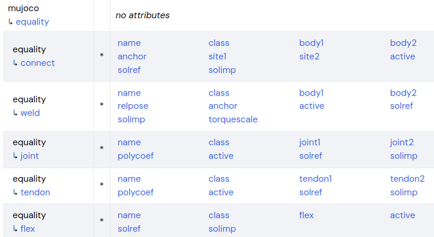

###### datetime:2025/12/28 12:25

###### author:nzb

> 该项目来源于[mujoco_learning](https://github.com/Albusgive/mujoco_learning)

# 闭链

在机器人设计中有时候会出现并联连杆结构，但是常规的建模方式没办法形成闭环，在urdf中我们没办法实现并联连杆，但是mujoco中提供了一种连接方式。



`mujoco` 节点下的 `equality` 节点可以实现这一功能，它可以将两个物体连接到一起。

- `connect` 和 `weld` 中 `body1` 和 `body2` 是要连接的两个 `body`

  * `anchor` 是在 `body1` 的坐标系中的两个 `body` 连接位置。
  * `site` 作为连接点(3.2.5后更新的，不建议使用 `body`链接)
    * `connect` 是点对点连接，自由度和球形关节一样，连接只限制了物体之间的距离。
    * `weld` 是刚性连接，自由度是锁死的，可以通过 `torquescale` 来调节连接强度（阻尼）。

- `joint` 和 `tendon` 是使用四次多项式让 `joint1/tendon1` 的数据跟踪 `joint2/tendon2` 的数据
  `y - y0 = a0 + a1(x-x0) + a2(x-x0)^2 + a3(x-x0)^3 + a3(x-x0)^4`
  * y为joint1/tendon1的数据
  * y0为joint1/tendon1的参考数据（初始值）
  * x为joint2/tendon2的数据
  * x0为joint2/tendon2的参考数据（初始值）

```xml
<mujoco>
    <asset>
        <mesh name="tetrahedron" vertex="0 0 0 1 0 0 0 1 0 0 0 1" />
        <texture type="skybox" file="../asset/desert.png"
            gridsize="3 4" gridlayout=".U..LFRB.D.." />
        <texture name="plane" type="2d" builtin="checker" rgb1=".1 .1 .1" rgb2=".9 .9 .9"
            width="512" height="512" mark="cross" markrgb=".8 .8 .8" />
        <material name="plane" reflectance="0.3" texture="plane" texrepeat="1 1" texuniform="true" />
    </asset>

    <worldbody>
        <geom name="floor" pos="0 0 0" size="0 0 .25" type="plane" material="plane"
            condim="3" />
        <light directional="true" ambient=".3 .3 .3" pos="30 30 30" dir="0 -.5 -1"
            diffuse=".5 .5 .5" specular=".5 .5 .5" />

        <body name="red_b" pos="0 0 1">
            <geom type="ellipsoid" size="0.2 0.02 0.02" rgba="1 0 0 1" />
            <site name="red_connect" size="0.02" rgba="1 0 0 .5" pos="0.2 0 0" />
            <!-- <site size="0.05" rgba="0 1 0 .5" pos="0 0 0"/> -->
            <body name="green_b" pos="-0.2 0 -0.2" euler="0 90 0">
                <geom type="ellipsoid" size="0.2 0.02 0.02" rgba="0 1 0 1" contype="2"
                    conaffinity="2" />
                <joint name="j0" type="hinge" pos="-0.2 0 0" axis="0 1 0" damping="0" />
                <body name="blue_b" pos="0.2 0 0.2" euler="0 -90 0">
                    <geom type="ellipsoid" size="0.2 0.02 0.02" rgba="0 0 1 1" />
                    <site name="blue_connect" size="0.02" rgba="0 0 1 .5" pos="0.2 0 0" />
                    <joint name="j1" type="hinge" pos="-0.2 0 0" axis="0 1 0" damping="0" />
                    <body name="white_b" pos="0.2 0 0.2" euler="0 -90 0">
                        <geom type="ellipsoid" size="0.2 0.02 0.02" rgba="1 1 1 1" contype="2"
                            conaffinity="2" />
                        <site name="white_connect" size="0.02" rgba="1 1 1 .5" pos="0.2 0 0" />
                        <joint name="j2" type="hinge" pos="-0.2 0 0" axis="0 1 0" damping="0" />
                    </body>
                </body>
            </body>
        </body>

        <body pos="0.5 0 0">
            <geom type="cylinder" mass="100" size="0.05 0.5" rgba="0.2 0.2 0.2 1" />
            <body pos="0 0 0.51">
                <joint type="hinge" name="pivot1" pos="0 0 0" axis="0 0 1" damping="0"
                    frictionloss="0" stiffness="0" />
                <geom type="capsule" mass="0.01" fromto="0 0 0 0.2 0 0" size="0.01"
                    rgba="0.8 0.2 0.2 0.5" />
            </body>
        </body>

        <body pos="1 0 0">
            <geom type="cylinder" mass="100" size="0.05 0.5" rgba="1 1 1 1" />
            <body pos="0 0 0.51">
                <joint type="hinge" name="pivot2" pos="0 0 0" axis="0 0 1" damping="0"
                    frictionloss="0.0" stiffness="0" />
                <geom type="capsule" mass="0.01" fromto="0 0 0 0.2 0 0" size="0.01"
                    rgba="0.8 0.2 0.2 0.5" />
            </body>
        </body>

    </worldbody>

    <equality>
        <!-- 不建议使用 body1 和 body2，建议使用 site1 和 site2 -->
        <!-- <connect body1="red_b" body2="white_b" anchor="0.2 0 0"/> -->

        <connect site1="red_connect" site2="white_connect" />
        <!-- <weld site1="red_connect" site2="white_connect" torquescale="0"/> -->

        <joint joint1="pivot1" joint2="pivot2" polycoef="0 1 0 0 1"/>
    </equality>

    <tendon>
        <fixed name="open">
            <joint joint="j0" coef="1" />
            <joint joint="j2" coef="1" />
        </fixed>
    </tendon>

    <actuator>
        <position name="connect" tendon="open" kp="2" kv="0.1" ctrlrange="-10 10" />
        <position name="joint" joint="pivot2" kp="2" kv="0.1" ctrlrange="-1 1" />
    </actuator>
</mujoco>
```