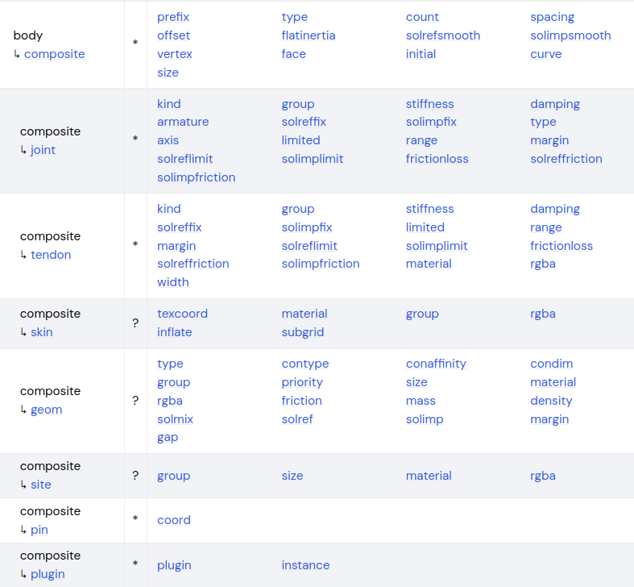
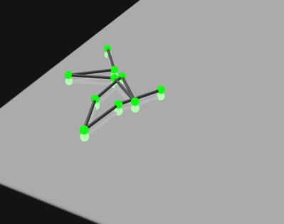
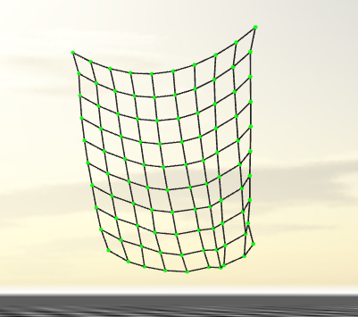
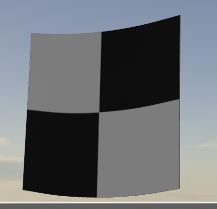

###### datetime:2025/12/28 12:25

###### author:nzb

> 该项目来源于[mujoco_learning](https://github.com/Albusgive/mujoco_learning)

 # composite 复合体 (3.2.7及以前版本)

   
          
&emsp;&emsp;复合体可以仿真，body集合，软体，布料，鱼网等。本质上是一堆微小几何体组合形成的新型结构。        
**prefix="name"**       
&emsp;&emsp;和name相同也就是names，prefix表示整个复合体的命名索引，具体复合体中的body名称为name+B+（坐标），比如坐标为（1,2）那body的name就是nameB1_2）     
**type=[particle,grid,cable（代替后两个）,rope（弃用）,loop（弃用）,cloth（弃用，使用 grid代替布料）,box,cylinder,ellipsoid]**      
&emsp;&emsp;particle粒子集合        
&emsp;&emsp;grid网格 1 D或者 2 D，也代替布料，绳子      
&emsp;&emsp;box立方体集合，可以做成软体立方体。         
**count=" 0 0 0 "**       
&emsp;&emsp;复合体的排列数量和方式，分别对应三个方向上的数量）      
**spacing=""**      
&emsp;&emsp;复合体排列中，两个小 body之间距离       
**offset=" 000 "**      
&emsp;&emsp;相当于整个复合体的空间坐标      
**joint=[main,twist,stretch,particle]**     
&emsp;&emsp;复合体活动类型      
**pin-coord=""**        
&emsp;&emsp;复合体固定位置      
<font color=Green>*演示：*</font>       
**1. 粒子集合**         
```xml
<composite type="particle" prefix="bullet" count="5 5 10" spacing="0.01" offset="1 1 2">
<geom type="sphere" size="0.0084" material="green_grapes" mass="0.0032" />
<joint kind="particle" type="free" />
</composite>
```
&emsp;&emsp;这里是创建了一个 5 * 5 * 10 的小弹丸集合，命名为 bullet，joint添加 particle是给粒
子用的，free就是代表可以自由碰撞。          
**2. 绳**           
```xml
<composite type="grid" prefix="C" count="10 1 1" spacing="0.1" offset="1 1 2">
<geom type="sphere" size="0.0084" material="green_grapes" mass="0.0032" />
<joint kind="twist" type="free" />
</composite>
```
&emsp;&emsp;这里可以使用 grid，这是给 1 D和 2 D集合体使用的，可以仿真一节一节类似线的集合。
注意这里 1 D的仿真的 count。joint的 twist是给这类复合体使用的，也可以不加入
joint。     
      
**3. 悬挂鱼网**     
```xml
<composite type="grid" prefix="C" count="10 10 1" spacing="0.1" offset="1 1 2">
<geom type="sphere" size="0.0084" material="green_grapes" />
<pin coord="0 0"/>
<pin coord="0 9"/>
<joint kind="twist" type="free" />
</composite>
```
&emsp;&emsp;这里我们还是使用 grid，创造了一个 10 * 10 的网，网格间距为 0. 1 ,通过 pin的作用是
固定网面上的( 0 , 0 )和( 0 , 9 )点让网悬挂起来。         
   

**4. 布料** 
        
```xml
<composite type="grid" count="5 5 1" spacing="0.6" offset="0 0 3">
<skin texcoord="true" material="plane" inflate="0.01" subgrid="3" />
<pin coord="0 0" />
<pin coord="4 0" />
<geom size="0.1" />
<joint kind="main" damping="5" />
</composite>
```
&emsp;&emsp;这里仍然使用的是 grid，但是加入了 skin，这可以使整个网的表面联合起来，形成布料
的效果，这里的 count和 spacing会影响布的“密度”，密度越大越不容易活动。
skin中texcoord是影响纹理可视化的，inflate类似厚度，负值可以直接穿过布料。正
值表示布料比较厚，对于碰撞影响较大。subgrid越高渲染等级越高，建议不要大于 3 。      
     

# flex（新版3.3.0及以后）

**name=""**        
&emsp;&emsp;复合体固定位置          
**dim=""**        
&emsp;&emsp;维度，可以写1,2,3。在 1D 中，元素是胶囊，在 2D 中，元素是 具有半径的三角形，在 3D 中，元素是具有（可选）半径的四面体。      
**radius=""**        
&emsp;&emsp;所有 flex 元素的半径。它在 3D 中可以为零，但在 1D 和 2D 中必须为正。半径会影响两者 碰撞检测和渲染。在 1D 和 2D 中，需要使单元具有体积。         
**body="string"**        
&emsp;&emsp;定点元素名  
**material=""**        
&emsp;&emsp;材质        
**rgba=""**        
&emsp;&emsp;颜色

## flex/edge
边缘弯曲的阻尼和刚度  
**stiffness="0"**       
**damping="0"**   

## flex/elasticity
有限元参数  
**young="0"**        
&emsp;&emsp;杨式模量        
**poisson="0"**        
&emsp;&emsp;柏松比        
**damping="0"**        
&emsp;&emsp;该量缩放由 Young 模量定义的刚度，以生成阻尼矩阵。           
**thickness="-1"**        
&emsp;&emsp;壳厚，长度单位;仅适用于二手 2D 弯曲。用于缩放拉伸刚度。 此厚度可以设置为等于半径的 2 倍，以匹配几何体， 但会单独显示，因为半径可能受到与碰撞检测相关的注意事项的限制。  
**elastic2d="[none, bend, stretch, both]"**
&emsp;&emsp;该参数在3.3.3及以后版本使用，对 2D 弯曲的被动力的弹性贡献。“none”： 无， “bend”： 仅弯曲， “stretch”： 仅拉伸， “both”： 弯曲和拉伸。

## flex/contact
**internal="false"**        
&emsp;&emsp;启用或禁用内部碰撞        
**selfcollide="auto" [none, narrow, bvh, sap, auto]**        
&emsp;&emsp;启用或禁用内部碰撞

# flexcomp
**name=""**        
&emsp;&emsp;生成命名          
**dim=""**        
&emsp;&emsp;维度，可以写1,2,3。在 1D 中，元素是胶囊，在 2D 中，元素是 具有半径的三角形，在 3D 中，元素是具有（可选）半径的四面体。  
**dof="full" [full, radial, trilinear]**        
&emsp;&emsp;弯曲自由度 （dof） 的参数化。       
**type="grid" [grid, box, cylinder, ellipsoid, disc, circle, mesh, gmsh, direct]**        
&emsp;&emsp;有限元子对象类型  
**count=""**        
&emsp;&emsp;每个维度中自动生成的点的数量。this 和 next 属性仅适用于类型网格， box、cylinder、ellipsoid。         
**spacing=""**        
&emsp;&emsp;每个维度中自动生成的点之间的间距。间距应足够大 与半径相比，以避免永久接触。          
**mass=""**        
&emsp;&emsp;总质量，每个自动生成的实体的质量等于该值除以点数。           
**inertiabox=""**        
&emsp;&emsp;每个点的旋转惯性，此处为对角线。         
**file=""**        
&emsp;&emsp;从中加载曲面（三角形）或体积（四面体）网格的文件的名称。可以是stl,obj,gmsh格式      
**rigid="false"**        
&emsp;&emsp;如果为 true，则所有点都对应于父形体中的顶点，并且不会创建新形体。这是 等效于固定所有点。请注意，如果所有点都确实被固定，模型编译器将检测到 Flex 是刚性的（在碰撞检测中表现为非凸面网格）。           
**pos=""**        
&emsp;&emsp;位置          
**quat，axisangle, xyaxes, zaxis, euler=""**        
&emsp;&emsp;旋转             
**scale=""**        
&emsp;&emsp;点坐标缩放，宏观就是尺寸缩放       

## flexcomp/edge
边缘弯曲的阻尼和刚度  
**stiffness="0"**       
**damping="0"**  
**equality="false"  [true, false]**  
&emsp;&emsp;约束边缘    

## flexcomp/pin
固定body/grid  
**id=""**        
&emsp;&emsp;位置        
**range="int(2 * n)"**        
&emsp;&emsp;位置        
**grid="int(dim * n)"**        
&emsp;&emsp;位置        
**gridrange="int(2 * dim * n)"**        
&emsp;&emsp;位置        