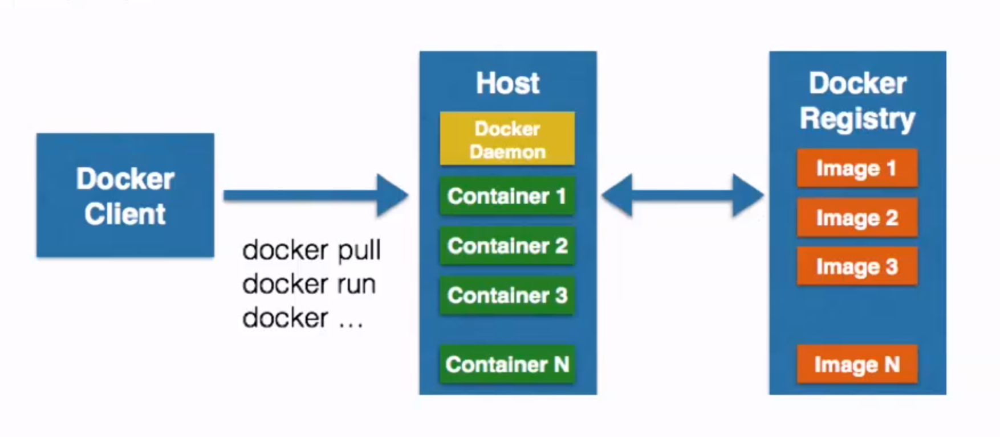
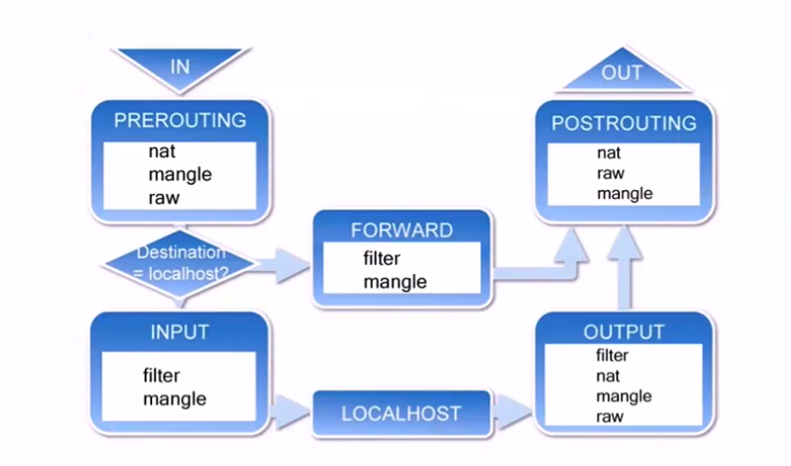
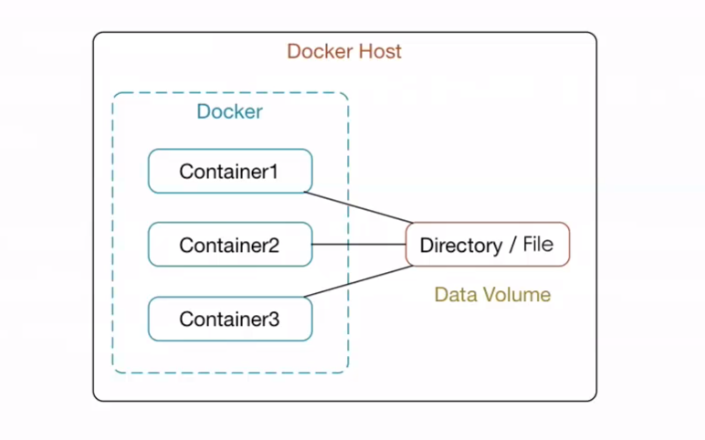
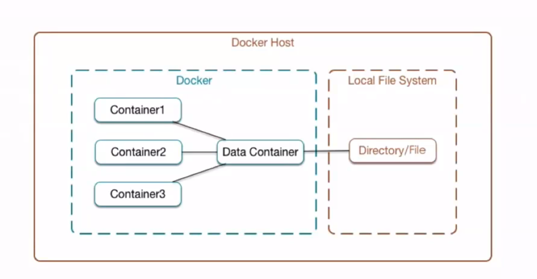
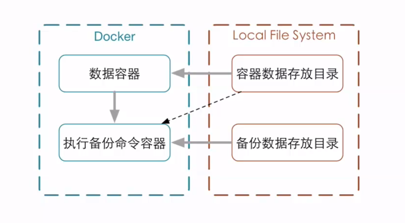

# 1、Docker基本组成

- 1.1、Docker Client 客户端

- 1.2、Docker Daemon 守护进程  
  客户端/守护进程  
  C/S模式      
  我们通过客户端发送命令给守护进程，守护进程执行结果返回给客户端

- 1.3、Docker Image 镜像  
  容器的基石  
  层叠的只读文件系统

- 1.4、Docker Container 容器  
  通过镜像启动

- 1.5、Docker Registry 仓库  
  公有  
  私有

- 1.6、示意图

[comment]: <> (   ![image]&#40;https://github.com/bluesnie/Learning-notes/blob/master/Utils/img/20190407101329.png&#41;)


# 2、Docker容器相关技术简介

- 2.1、Docker依赖的Linux内核特性
    - 2.1.1、Namespaces命名空间
        - 编程语言  
          封装 -> 代码隔离
        - 操作系统
            - 系统资源的隔离
            - 进程、网络、文件系统...
        - 分为5种命名空间：
            - `PID(Process ID)  `                     进程隔离
            - `NET(Network)`                        管理网络接口
            - `IPC(InterProcess Communication)`     管理跨进程通信的访问
            - `MNT(Mount)  `                        管理挂载点
            - `UTS(Unix Timesharing System)`        隔离内核和版本标识

    - 2.1.2、Control groups(cgroups)控制组
        - 用来分配资源
        - 资源限制
        - 优先级设定
        - 资源计量
        - 资源控制

- 2.2、Docker容器的能力
    - 文件系统隔离：每个容器都有自己的root文件系统
    - 进程隔离：每个容器都运行在自己的进程环境中
    - 网络隔离：容器间的虚拟网络接口和IP地址都是分开的
    - 资源隔离和分组：使用cgroups将CPU和内存之类的资源独立分配给每个Docker容器

# 3、Docker客户端与守护进程

- 1、客户端与守护进程通信

[comment]: <> (![image]&#40;https://github.com/bluesnie/Learning-notes/blob/master/Utils/img/20190407105316.png&#41;)


- 2、Remote API与Docker守护进程进行通信 RESTful 风格API

[comment]: <> (![image]&#40;https://github.com/bluesnie/Learning-notes/blob/master/Utils/img/20190407105239.png&#41;)


- 3、连接方式
    - unix://var/run/docker.sock(默认)
    - tcp://host:port
    - fd://sockerfd

[comment]: <> (![image]&#40;https://github.com/bluesnie/Learning-notes/blob/master/Utils/img/20190407105512.png&#41;)


# 4、Docker守护进程的配置和操作

- 1、查看守护进程  
  `ps -ef | grep docker  `  
  `sudo docker stats`      查看docker的运行状态

- 2、使用service命令管理  
  `sudo service docker start/stop/restart`

- 3、Docker的启动选项 `docker -d [OPTIONS]`

    ```text
    运行相关：
        -d：                                    以守护的形式运行
        -D,--debug=false                     
        -e,--exec-driver="native"
        -g,--graph="/var/lib/docker"
        --icc=true
        -l,--log-level="info"
        --label=[]                              标签区别，key-value形式：name=nzb
        -p,--pidfile="/var/run/docker.pid
    
    服务器连接相关：
        -G,--group="docker"
        -H,--host=[]                            启动选项，默认 -H unix://var/run/docker.sock
        --tls=false
        --tlscacert="/home/sven/.docker/ca.pem"
        --tlscert="/home/sven/.docker/cert.pem"
        --tlskey="/home/sven/.docker/key.pem"
        --tlsverify=false
    
    Remote API相关：
        --api-enable-cors=false
    
    存储相关：
        -s,--storage-driver=""
        --selinux-enabled=false
        --storage-opt=[]
    
    Registry相关：
        --insecure-registry=[]
        --registry-mirror=[] 
    
    网络设置相关：
        -b,--bridge=""
        --bip=""
        --fixed-cidr=""
        --fixed-cidr-v6=""
        --dns=[]
        --dns-search=[]
        --ip=0.0.0.0
        --ip-forward=true
        --ip-masq=true
        --iptables=true
        --ipv6=false
        --mtu=0  
    ```

- 4、启动配置文件 `/etc/default/docker`

# 5、Docker的远程访问

- 1、环境准备

    - 另一台安装Docker的服务器
      `--label name=server1/2`

    - 修改Docker守护进程启动选项，区别服务器  
      `-H tcp://0.0.0.0:2375`  
      测试：  
      `curl http://host:2375/info`

    - 保证Client API与Server API 版本一致
        - 修改客户端配置  
          `docker -H tcp:host:2375`  
          或  
          使用环境变量`DOCKER_HOST `  
          `export DOCKER_HOST="tcp://host:2375"`  
          测试：  
          `docker info`
        - 如想访问本地的docker服务：  
          `export DOCKER_HOST=""`   置空环境变量

    - 如果docker开启了远程服务，如何访问本地：  
      修改启动选项-H，可以有多个：
      `-H tcp://0.0.0.0:2375 -H unix://var/run/docker.sock`

# 6、Docker容器

- 1、基本操作

    - 1.1、启动容器  
      `docker run IMAGE [COMMAND] [ARG]`  
      例：
      `docker run ubuntu echo 'Hello World'`

    - 1.2、启动交互式容器  
      `docker run -i -t IMAGE /bin/bash`
        - -i `--interactive=true | false` 默认是false
        - -t `--tty=true | false` 默认是false

    - 1.3、查看容器  
      `docker ps [-a] [-l]`
        - -a：列出使用容器
        - -l：列出最新创建的容器
        - 不指定参数则列出所有正在运行的容器
        - `docker inspect 容器id或容器名字`：查看容器详细信息

    - 1.4、自定义容器名
      `docker run --name=自定义名 -i -t IMAGE /bin/bash`

    - 1.5、重新启动停止的容器
      `docker start [-i] 容器名`
        - -i：以交互的方式重新启动容器

    - 1.6、删除停止的容器
      `docker rm 容器名`

- 2、守护式容器

    - 2.1、以守护形式运行容器 `docker run -i -t IMAGE /bin/bash` `Ctrl+P` `Ctrl+Q` 组合键退出就会在后台运行

    - 2.2、附加到运行中的容器 `docker attach 容器名或容器id`

    - 2.3、启动守护式容器 `docker run -d 镜像名 [COMMAND] [ARG...]`
        - -d：启动时使用后台的方式启用

      例： `docker run --name dc1 -d ubuntu /bin/sh -c "while true; do echo hello world; sleep 1; done"`

    - 2.4、查看容器日志 `docker logs [-f] [-t] [--tail] 容器名`
        - -f `--follows=true | false` 默认是false 一直跟踪并放回结果
        - -t `--timestamps=true | false` 默认是false 加上时间戳
        - `--tail="all"`  返回结尾多少条的数据

    - 2.5、查看容器内进程 `docker top 容器名`

    - 2.6、在运行中的容器内启动新进程 `docker exec [-d] [-i] [-t] 容器名 [COMMAND] [ARG...]`

        - 进入mysql容器： `docker exec -it 容器名 bash`

    - 2.7、停止守护式容器 `docker stop 容器名` 或 `docker kill 容器名`

# 7、容器中部署静态网站

- 7.1、设置容器的端口映射
  `run [-P] [-p]`

    ```text
    -P,--publish-all=true | false 默认是false      将为容器暴露的所有端口进行映射 
    例：
        docker run -P -i -t ubuntu /bin/bash
    -p,--pulish=[]                                  指定映射哪些容器的端口
        四种方式：
            containerPort
                docker run -p 80 -i -t ubuntu /bin/bash     随机映射
            hostPort:containerPort
                docker run -p 8080:80 -i -t ubuntu /bin/bash
            ip:containerPort
                docker run -p 0.0.0.0:80 -i -t ubuntu /bin/bash
            ip:hostPort:containerPort
                docker run -p 0.0.0.0:8080:80 -i -t ubuntu /bin/bash
    ```

- 7.2、部署流程
    - 创建映射80端口的交互式容器
    - 安装Nginx
    - 安装文本编辑器vim
    - 创建静态文件
    - 修改Nginx配置文件
    - 运行Nginx
    - 验证网站访问

# 8、查看和删除镜像

- 1、镜像的存储地址
  `docker info 查看镜像的存储地址`

- 2、列出镜像
  `docker images [OPTIONS] [REPOSITORY]`
    - -a,`--all=false `                     显示所有镜像，包括中间层镜像
    - -f,`-filter `
    - `--no-trunc=false`                    id截断
    - -q,`--quiet=false`                    只显示镜像的唯一ID  
      REPOSITORY仓库是包含一系列的镜像，而REGISTRY仓库包含很多REPOSITORY仓库TAG  
      例如：  
      ubuntu:14.04  
      ubuntu:latest

- 3、查看镜像
  `docker inspect [OPTIONS] CONTAINER|IMAGE [CONTAINER|IMAGE...]`
    - -f,`--format=""`

- 4、删除镜像
  `docker rmi [OPTIONS] IMAGE [IMAGE...]`
    - -f,`--force=false`                    强制删除镜像 - `--no-prune=false`                    不会删除未打标签的镜像
        - 例：
          `docker rmi $(docker images -q ubuntu)  删除所有Ubuntu仓库中的所有镜像`

# 9、获取和推送镜像

- 1、查找镜像
    - 1.1、Docker Hub
      `https://registry.hub.docker.com`

    - 1.2、`docker search [OPTIONS] TERM`
        - --automated=false 是否是自动构建的镜像
        - --no-trunc=false
        - -s,`--stars=0  `
        - 最多返回25个结果

- 2、拉取镜像
  `docker pull [OPTIONS] NAME[:TAG]`
    - -a,`--all-tags=false`             下载带有标签的的仓库的所有镜像
        - 使用`--registry-mirror`选项加速拉取镜像速度
            - 修改：etc/default/docker
            - 添加：`DOCKER_OPTS="--registry-mirror=http://MIRROR-ADDR"`   例：https://www.daocloud.io 注册获取加速地址

- 3、推送镜像
  `docker push NAME[:TAG]`
    - NAME:仓库名
    - TAG:标签名

# 10、构建镜像

- 1、`docker commit`     通过容器构建  
  `docker commit [OPTIONS] CONTAINER [REPOSITORY[:TAG]]`
    - `CONTAINER`                   容器名
    - -a,`--author=""`
    - -m,`--message=""`
    - -p,`--pause=true`             构建镜像时不暂停运行的容器

- 2、`docker build`      通过Dockerfile文件构建
    ```text
     例：
        #First Dockerfile
        From ubuntu:14.04
        MAINTAINER  dormancypress "dormancypress@outlook.com"
        RUN apt-get update
        RUN apt-get install -y nginx
        EXPOSE 80
    ```

  `docker build [OPTIONS] PATH | URL | -`
    - --force-rm=false
    - --no-cache=false 不使用缓存
    - --pull=false
    - -q,`--quite=false`                    不显示构建过程
    - --rm=true
    - -t,`--tag=""`                         指定构建的镜像的名字
    - `PATH | URL` 构建镜像的路径，可以使用`“.”`表示当前文件夹

# 11、Dockerfile指令

- 1、指令格式
    - `# Comment`                  注释
    - `INSTRUCTION argument`        指令

- 2、指令
    - 2.1、`FROM`
        - `FROM <image>`
        - `FROM <image>:<tag>`

      > 已经存在的镜像
      >
      >基础镜像
      >
      > 必须是第一条非注释指令

    - 2.2、`MAINTAINER`
        - `MAINTAINER <name>`

        - 指定镜像的作者信息，包含镜像的所有者和联系信息相当于前面的commit命令的-a选项

    - 2.3、`RUN`
      指定当前镜像中运行的命令(镜像构建时运行的)
        - `-RUN <command>`                              (shell模式)
          `/bin/sh -c command`
            ```text
            例：
                RUN echo hello
            ```

        - `-RUN ["executable","param1","param2"]`       (exec模式)
            ```text
            例：
                RUN ["/bin/bash","-c","echo hello"]
            ```

    - 2.4、`EXPOSE`
      `EXPOSE <port>[<port>...]`
      指定运行该镜像的容器使用的端口（只是告诉容器使用的端口）
        - 为了安全起见，run命令中还要指定端口
          `docker run -p 80 -d dormancypress/df_test1 nginx -g "daemon off;"`

    - 2.5、`CMD`     
      容器运行时运行的指令，会被`docker run` 命令中的指令覆盖
        - `CMD ["executable","param1","param2"]`    (exec模式)
        - `CMD command param1 param2`               (shell模式)
        - `CMD ["param1","param2"]`                 (作为ENTERYPOINT指令的默认参数)

      例：CMD ["/usr/sbin/nginx", "-g", "daemon off;"]

    - 2.6、`ENTERYPOINT`
      容器运行时运行的指令，不会被docker run 命令中的指令覆盖
        - `ENTERYPOINT ["executable","param1","param2"]`    (exec模式)
        - `ENTERYPOINT command param1 param2`               (shell模式)

    - 2.7、`ADD`
        - `ADD <src>...<dest>`
        - `ADD ["<src>"..."<dest>"]`(适用于文件路径中有空格的情况)

    - 2.8、`COPY`
        - `COPY <src>...<dest>`
        - `COPY ["<src>"..."<dest>"]`(适用于文件路径中有空格的情况)

        - `ADD vs COPY`
            - `ADD`包含类型tar的解压功能
            - 如果当纯复制文件，Docker推荐使用COPY

    - 2.9、`VOLUME`添加容器卷`VOLUME ["/data"]`

    - 2.10、`WORKDIR`
        - `WORKDIR /path/to/workdir`
          > 一般不使用绝对路径，如果使用相对路径，会一直传递下去

    - 2.11、`ENV`
      设置环境变量与`WORKDIR`类似
        - `ENV <key><value>`
        - `ENV <key>=<value>`

    - 2.12、`USER`
      指定镜像会以什么用户来运行

    - 2.13、`ONBUILD`
        - 镜像触发器
        - 当一个镜像被其他镜像作为基础镜像时执行
        - 会在构建过程中插入指令

# 12、构建过程

- 1、构建过程
    - 从基础镜像运行一个容器
    - 执行一条指令，对容器做出修改
    - 执行类似`docker commit`的操作，提交一个新的镜像层
    - 在基于刚提交的镜像运行一个新容器
    - 执行Dockerfile中的下一条指令，直至所有指令执行完毕

      > ps:构建中会删除中间层容器，而不会删除中间层镜像，所以可以使用中间层镜像进行调试，查找错误

- 2、镜像缓存
    - 构建缓存:
      构建一次后再构建就会使用构建缓存
    - 不使用缓存
        - 使用--no-cache选项
        - 或
        - ENV REFRESH_DATE 2019-4-7

3、查看镜像构建的过程
`docker history [image]`

- --no-trunc: 不截断输出完整信息

# 13、容器的网络连接

- 1、Docker容器的网络基础
    - Linux虚拟网桥特点：
        - 可设置IP地址
        - 相当于拥有一个隐藏的虚拟网卡
    - docker0的地址划分：
        - IP：`172.17.42.1` 子网掩码：`255.255.0.0`
        - `MAC:02:42:ac:11:00:00`到`02:42:11:ff:ff`
        - 总共提供了65534个地址

    - 需要使用网桥管理工具：`sudo apt-get install bridge-utils`
    - 查看网桥：`sudo brctl show`
    - 添加虚拟网桥：`sudo brctl add br0`
    - 修改地址：`sudo ifconfig docker0 192.168.200.1 netmask 255.255.255.0`

    - 修改docker0地址：
      `sudo ifconfig docker0 192.168.200.1 netmask 255.255.255.0`

    - 更改docker守护进程的启动配置
      `/etc/default/docker` 中添加`DOCKER_OPS`值
      `DOCKER_OPS="-b=br0"  `

[comment]: <> (![image]&#40;https://github.com/bluesnie/Learning-notes/blob/master/Utils/img/20190407165702.png&#41;)


- 2、Docker容器的互联

    - 2.1、运行所有容器互联（默认） 因为每次关闭重启容器IP地址都会改变所有使用`--link`选项可以使新启动的容器为其起别名，就不用担心IP改变
        - --link  
          `docker run --link=[CONTAINER_NAME]:[ALIAS] [IMAGE] [COMMAND]`

    - 2.2、拒绝容器间的互联
        - --icc=false

    - 2.3、允许特点容器间的连接
        - --icc=false
        - --iptables=true
        - --link

- 3、Docker容器与外部网络的连接
    - 3.1、`ip-forward`
        - `--ip-forward=true(默认)`               允许数据转发
        - 查看ip_forward的值：
          `sysctl net.ipv4.conf.all.forwarding`

    - 3.2、`iptables`
        - 什么是iptables:
            - Iptables是Linux内核集成的包过滤防火墙系统，几乎所有的Linux发行版本都会包含IPtables的功能。
            - 表(table):下图中的nat、mangle、raw、filter...
            - 链(chain):代表数据处理的不同环节
            - 规则(rule):每个链下的操作
                - ACCEPT、REJECT、DROP
            - filter表中包含的链：
                - INPUT
                - FORWARD
                - OUTPUT

            - 查看iptables：
              `sudo iptables [-t filter] -L -n`
                - -t:指定表名（默认）  
                  

    - 3.3、允许特定IP访问容器
      `sudo iptables -I DOCKER -s 禁止访问ip -d 目的ip -p TCP --dport 80 -j ACCEPT`

    - 3.4、限制IP访问容器
      `sudo iptables -I DOCKER -s 禁止访问ip -d 目的ip -p TCP --dport 80 -j DROP`

# 14、Docker容器的数据卷

- 什么是数据卷：
    - 数据卷是经过特殊设计的目录，可以绕过联合文件系统（UFS）,为一个或多个容器提供访问。

    - 数据卷设计的目的，在于设计的永久化，他完全独立于容器的生存周期，因此，Docker不会再容器删除时删除其挂载的数据卷， 也不会存在类似的垃圾收集机制，对容器引用的数据卷进行处理。

[comment]: <> (![image]&#40;https://github.com/bluesnie/Learning-notes/blob/master/Utils/img/20190408103517.png&#41;)


- 1、为容器添加数据卷
  `docker run -v ~/container_data:/data -it ubuntu /bin/bash`
    - `~/container_data`： 本机目录
    - `/data`： 容器目录

- 2、为数据卷添加访问权限
  `docker run -v ~/container_data:/data:ro -it ubuntu /bin/bash`
    - `ro`:  只读

- 3、使用`Dockerfile`构建包含数据卷的镜像 Dockerfile指令
  `VOLUME["/data"]`
  > 但是，利用这个镜像创建的容器构建的数据卷都是不一样的，则不能实现共享。

# 15、Docker的数据卷容器

[comment]: <> (![image]&#40;https://github.com/bluesnie/Learning-notes/blob/master/Utils/img/20190408104601.png&#41;)


- 1、挂载数据卷容器的方法
  `docker run --volumes-from [CONTAINER NAME]`

  > 即时删除了数据卷容器，挂载了这个数据卷容器的容器还是能正常使用。因为只要一个数据卷还在被使用就不会被删除。

# 16、Docker数据卷的备份和还原

- 1、数据备份方法
  `docker run --volumes-from [container name] -v $(pwd):/backup:wr ubuntu tar -cvf /backup/backup.tar [container data volume]`

    - `$(pwd)`:备份文件存储的目录
    - `/backup`：容器中的目录
    - `wr` ：读写（默认）
    - `[container data volume]`：需要压缩的数据卷目录
    - `tar -cvf/backup/backup.tar [container data volume]`：备份操作（压缩）

- 2、数据还原方法
  `docker run --volumes-from [container name] -v $(pwd):/backup:wr ubuntu tar -xvf /backup/backup.tar [container data volume]`

[comment]: <> (![image]&#40;https://github.com/bluesnie/Learning-notes/blob/master/Utils/img/20190408105802.png&#41;)


# 17、Docker容器的跨主机连接

[comment]: <> (![image]&#40;https://github.com/bluesnie/Learning-notes/blob/master/Utils/img/20190408112528.png&#41;         )


- 1、使用网桥实现跨主机容器连接

    - 1.1、环境准备

        - Mac OS X + Parallels
        - 两台Ubuntu14.04虚拟机
        - 安装网桥管理工具：
          `apt-get install bridge-utils`
        - ip地址：
            - Host1:10.211.55.3
            - Host2:10.211.55.5
        - 修改`/etc/network/interfaces`文件
            ```text
            auto bro
            iface bro inet static
            address 10.211.55.3
            netmask 255.255.255.0
            geteway 10.211.55.1
            bridge_ports eth0
            ``` 

        - Docker设置
            - 修改`/etc/default/docker`文件
                - -b指定使用自定义网桥
                    - -b=br0
                - --fixed-cidr限制ip地址分配范围
                    - IP地址划分：
                    - Host1:10.211.55.64/26
                        - 地址范围：10.211.55.65~10.211.55.126
                    - Host2:10.211.55.128/26
                        - 地址范围：10.211.55.129~10.211.55.190

- 2、使用Open vSwitch实现跨主机容器连接


- 3、使用Weave实现跨主机容器连接

# Docker 磁盘空间占用和清理

### 磁盘空间占用

Docker 的内置 CLI 指令`docker system df`，可用于查询镜像（Images）、容器（Containers）和本地卷（Local Volumes）等空间使用大户的空间占用情况。

```text
[root@dockercon ~]# docker images
REPOSITORY                    TAG                 IMAGE ID            CREATED             SIZE
kalilinux/kali-linux-docker   latest              c927a54ec8a4        8 days ago          1.88GB
nginx                         latest              3f8a4339aadd        9 days ago          108MB
busybox                       latest              6ad733544a63        2 months ago        1.13MB
[root@dockercon ~]# docker system df
TYPE                TOTAL               ACTIVE              SIZE                RECLAIMABLE
Images              3                   0                   1.994GB             1.994GB (100%)
Containers          0                   0                   0B                  0B
Local Volumes       0                   0                   0B                  0B
Build Cache                                                 0B                  0B
```

可以进一步通过`-v`参数查看空间占用细节

```text
[root@dockercon ~]# docker system df -v
#镜像空间使用情况
Images space usage:

REPOSITORY                    TAG                 IMAGE ID            CREATED ago         SIZE                SHARED SIZE         UNIQUE SiZE         CONTAINERS
kalilinux/kali-linux-docker   latest              c927a54ec8a4        8 days ago ago      1.884GB             0B                  1.884GB             0
nginx                         latest              3f8a4339aadd        9 days ago ago      108.5MB             0B                  108.5MB             0
busybox                       latest              6ad733544a63        2 months ago ago    1.129MB             0B                  1.129MB             0

#容器空间使用情况
Containers space usage:

CONTAINER ID        IMAGE               COMMAND             LOCAL VOLUMES       SIZE                CREATED ago         STATUS              NAMES

#本地卷使用情况
Local Volumes space usage:

VOLUME NAME         LINKS               SIZE

Build cache usage: 0B
```

### 空间清理

|   不同状态  |  已使用镜像（used image）   |  未引用镜像（unreferenced image）  |  悬空镜像（dangling image）   |
|-----|-----|-----|-----|
| 镜像含义 | 指所有已被容器（包括已停止的）关联的镜像 | 没有被分配或使用在容器中的镜像 | 未配置任何 Tag （也就无法被引用）的镜像 |

#### Docker内置自动清理

通过 Docker 内置的 CLI 指令`docker system prune`来进行自动空间清理。

```text
[root@dockercon ~]# docker system prune --help

Usage:  docker system prune [OPTIONS]

Remove unused data

Options:
  -a, --all             Remove all unused images not just dangling ones
      --filter filter   Provide filter values (e.g. 'label=<key>=<value>')
  -f, --force           Do not prompt for confirmation
      --volumes         Prune volumes
```

- `docker system prune` 自动清理说明

    - 该指令默认会清除所有如下资源：
        - 已停止的容器（container）
        - 未被任何容器所使用的卷（volume）
        - 未被任何容器所关联的网络（network）
        - 所有悬空镜像（image）。
    - 该指令默认只会清除悬空镜像，未被使用的镜像不会被删除。添加-a 或 --all参数后，可以一并清除所有未使用的镜像和悬空镜像。

    - 可以添加-f 或 --force参数用以忽略相关告警确认信息。
    ```text
    [root@dockercon ~]# docker system prune --help
    
    Usage:  docker system prune [OPTIONS]
    
    Remove unused data
    
    Options:
      -a, --all             Remove all unused images not just dangling ones
          --filter filter   Provide filter values (e.g. 'label=<key>=<value>')
      -f, --force           Do not prompt for confirmation
          --volumes         Prune volumes
    [root@dockercon ~]# docker system prune --all
    WARNING! This will remove:
            - all stopped containers
            - all networks not used by at least one container
            - all images without at least one container associated to them
            - all build cache
    Are you sure you want to continue? [y/N] y
    Deleted Containers:
    f095899e7343e160d5b32d0688a6561a1a7f6af91c42ffe966649240b58ca23f
    
    Deleted Images:
    untagged: busybox:latest
    untagged: busybox@sha256:e3789c406237e25d6139035a17981be5f1ccdae9c392d1623a02d31621a12bcc
    deleted: sha256:6ad733544a6317992a6fac4eb19fe1df577d4dec7529efec28a5bd0edad0fd30
    deleted: sha256:0271b8eebde3fa9a6126b1f2335e170f902731ab4942f9f1914e77016540c7bb
    untagged: kalilinux/kali-linux-docker:latest
    untagged: kalilinux/kali-linux-docker@sha256:28ff9e4bf40f7399e0570394a2d3d388a7b60c748be1b0a180c14c87afad1968
    deleted: sha256:c927a54ec8a46164d7046b2a6dc09b2fce52b3066317d50cf73d14fa9778ca48
    untagged: alpine:latest
    untagged: alpine@sha256:ccba511b1d6b5f1d83825a94f9d5b05528db456d9cf14a1ea1db892c939cda64
    untagged: alpine-io:latest
    
    Total reclaimed space: 5.219GB
    ```


