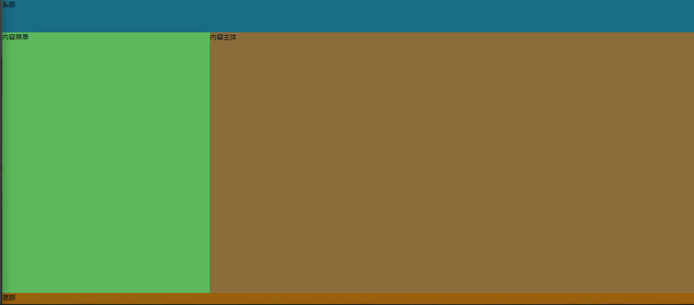
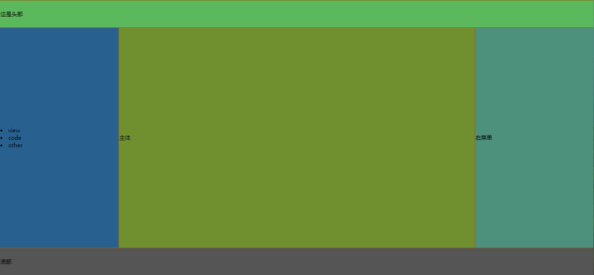
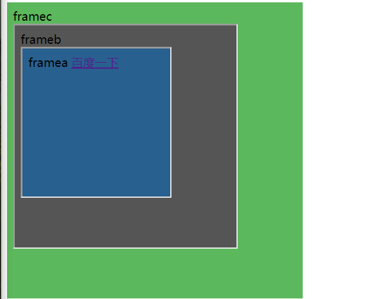
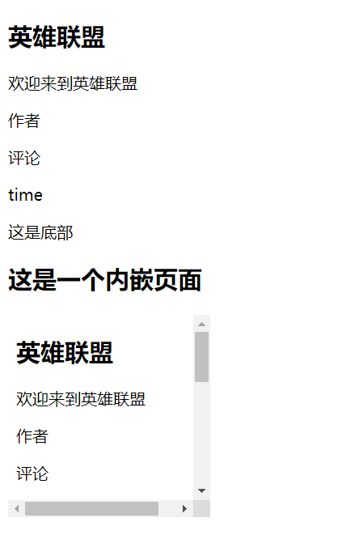
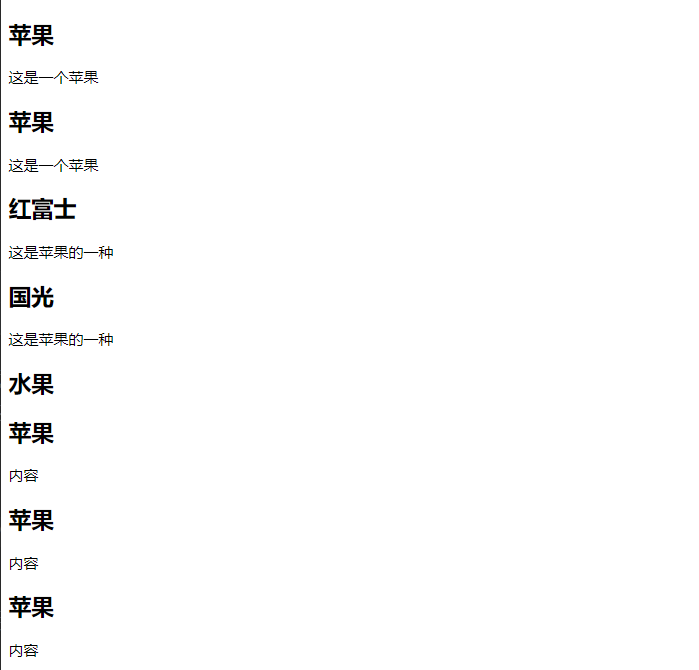

###### datetime:2019/7/1 9:43
###### author:nzb

## HTML5元素

- 元素指的是从开始标签到结束标签的所有代码

| 开始标签  | 元素内容 | 结束标签 |
|----------|---------|---------|
| `<p>` | this is my web page| `</P>`|
| `<br />` |
 
- HTML元素语法：
    - 元素的内容是开始标签与结束标签之间的内容
    - 空元素在开始标签进行关闭
    - 大多数HTML元素拥有属性

- 嵌套HTML元素

## HTML5属性使用方法

- 标签可以拥有属性为元素提供更多的信息

- 属性以键值对的形式出现。
    如：href="www.baidu.com"
    
- 常用标签属性：
    - `<h1>`:align对齐方式
    - `<body>`:bgcolor背景颜色
    - `<a>`:target规定在何处打开链接

- 通用属性
    - class：规定元素的类名
    - id：规定元素唯一id
    - style：规定元素的样式
    - title：规定元素的额外信息

## HTML5格式化

| 标签  | 描述 |
|--------|-------|
| `<b>` | 定义粗体文本|
| `<big>` | 定义大号字,在HTML5取消采用CSS代替|
| `<em>` | 定义着重文字|
| `<i>` | 定义斜体字|
| `<small>` | 定义小号字|
| `<strong>` | 定义加重语气|
| `<sub>` | 定义下标字|
| `<sup>` | 定义上标字|
| `<ins>` | 定义插入字|
| `<del>` | 定义删除字|

## HTML5样式

- 标签：
    - `<style>`：样式定义
    - `<link>`：资源引用

- 属性：
    - rel="stylesheet"：外部样式表
    - type="text/css"：引入文档的类型
    - margin-left：边距

- 三种样式表插入方法：
    - 外部样式表：
    ```html
        <link rel="stylesheet" type="text/css" href="mystyle.css">
    ```
    - 内部样式表：
    
    ```html
        <style type="text/css">
            body{background-color: red}
            p{margin-left: 20px;}
        </style>
    ```

    - 内联样式表：
    ```html
        <p style="color: red;"></p>
    ```
        

## HTML5链接

- 链接数据：
    - 文本链接
    - 图片链接

- 属性：
    - href属性：指向另一个文档的链接
    - name属性：创建文档内的链接

- img标签属性：
    - alt：替换文本属性
    - width：宽
    - height：高

## HTML5表格

| 标签  | 描述 |
|--------|-------|
| `<table>` | 定义表格|
| `<caption>` | 定义表格标题|
| `<th>` | 定义表格的表头|
| `<tr>` | 定义表格的行|
| `<td>` | 定义表格的单元|
| `<thead>` | 定义表格的页眉|
| `<tbody>` | 定义表格的主体|
| `<tfoot>` | 定义表格的页脚|
| `<col>` | 定义表格的列属性|

- 没有边框的表格：不加border属性
- 表格中的表头：`<tr><th>表头</th></tr>`
- 空单元格：不书写内容即可
- 带有标题的表格：`<caption>标题</caption>`
- 表格内的标签：
```html
    <tr>
        <td>单元4</td>
        <td>单元5</td>
        <td>
            <ul>
                <li>苹果</li>
                <li>香蕉</li>
                <li>桃子</li>
            </ul>
        </td>
    </tr>
```
- 单元格边距：cellpadding="20"
- 单元格间距：cellspacing="10"
- 表格内背景颜色和图像：bgcolor="red"

## HTML5列表

| 标签  | 描述 |
|--------|-------|
| `<ol>` | 有序列表|
| `<ul>` | 无序列表|
| `<li>` | 列表项|
| `<dl>` | 列表|
| `<dt>` | 列表项|
| `<dd>` | 描述|

- 无序列表
    - 使用标签：`<ul>、<li>`
    - 属性：`disc、circle、square`
    
- 有序列表
    - 使用标签：`<ol>、<li>`
    - 属性：`A、a、I、i、start`
    
- 嵌套列表
    - 使用标签：`<ul>、<ol>、<li>`

- 自定义列表
    - 使用标签：`<dl>、<dt>、<dd>`

## HTML5块

- HTML块元素
    - 块元素在显示时，通常会以新行开始。
    如：`<h1>、<p>、<ul>`

- HTML内联元素
    - 内联元素通常不会以新行开始。
    如：`<b>、<a>、`
    
- HTML`<div>`元素
    - `<div>`元素也被称为块元素，其主要是组合HTML元素的容器
    
- HTML`<span>`元素
    - `<span>`元素是内联元素，可作为文本的容器

## HTML5布局

- 使用`<div>`元素布局

```html
    <!DOCTYPE html>
    <html lang="en">
    <head>
        <meta charset="UTF-8">
        <title>div布局</title>
        <style>
            body{
                margin: 0px;
            }
            #container{
                width: 100%;
                height: 950px;
                background-color: gray;
            }
            #heading{
                width: 100%;
                height: 10%;
                background-color: #1b6d85;
            }
            #content_menu{
                width: 30%;
                height: 80%;
                background-color: #5cb85c;
                /*从左到右浮动*/
                float: left;
            }
            #content_body{
                width: 70%;
                height: 80%;
                background-color: #8a6d3b;
                float: left;
            }
            #footing{
                width: 100%;
                height: 10%;
                background-color: #985f0d;
                /*清除浮动*/
                clear: both;
            }
        </style>
    </head>
    <body>
    
    <div id="container">
        <div id="heading">头部</div>
        <div id="content_menu">内容菜单</div>
        <div id="content_body">内容主体</div>
        <div id="footing">底部</div>
    </div>
    
    </body>
    </html>
```

- 使用`<table>`元素布局

```html
    <!DOCTYPE html>
    <html lang="en">
    <head>
        <meta charset="UTF-8">
        <title>table布局</title>
    </head>
    <body style="margin: 0px">
        <table width="100%" height="950px" style="background-color: #985f0d">
            <tr>
                <!--colspan="3"就是合并单元格，3个合成1个-->
                <td colspan="3" width="100%" height="10%" style="background-color: #5cb85c">这是头部</td>
            </tr>
            <tr>
                <td width="20%" height="80%" style="background-color: #286090">
                    <ur>
                        <li>view</li>
                        <li>code</li>
                        <li>other</li>
                    </ur>
                </td>
                <td width="60%" height="80%" style="background-color: #709030">主体</td>
                <td width="20%" height="80%" style="background-color: #4d907c">右菜单</td>
            </tr>
            <tr>
                <td width="100%" height="10%" colspan="3" style="background-color: #555555">底部</td>
            </tr>
        </table>
    </body>
    </html>
```

## HTML5表单

- 表单用于获取不同类型的用户输入
- 常用表单标签

|   |   |
|--------|-------|
| `<form>` | 表单|
| `<input>` | 输入域|
| `<textarea>` | 文本域|
| `<label>` | 控制标签|
| `<fieldset>` | 定义域|
| `<legend>` | 域的标题|
| `<select>` | 选择列表|
| `<optgroup>` | 选项组|
| `<option>` | 下拉列表中的选项|
| `<button>` | 按钮|

## HTML5框架

- 框架标签(frame):(HTML5已过时)
    - 框架对于页面的设计有着很大的作用
    
- 框架集标签(`<frameset>`):(HTML5中已过时)
    - 框架集标签定义如何将窗口分隔为框架
    - 每一个frameset定义一系列行或列
    - rows/cols的值规定了每行或每列占据屏幕的面积

- 常用标签：
    - noresize：固定框架大小
    - cols：列
    - rows：行

- 内联框架(HTML5主要使用的)
    - iframe
        - target属性：
           - _self：当前frame打开
           - _blank：新窗口打开
           - _parent：父级frame打开
           - _top：当前窗口打开

frame.html        
```html
    <!DOCTYPE html>
    <html lang="en">
    <head>
        <meta charset="UTF-8">
        <title>frame</title>
    </head>
    <body>
        <!--<a href="https://www.baidu.com" target="">百度</a>-->
        <br/>
        <iframe src="framec.html" frameborder="0" width="400px" height="400px">
    
        </iframe>
    
    </body>
    </html>
```

framea.html
```html
    <!DOCTYPE html>
    <html lang="en">
    <head>
        <meta charset="UTF-8">
        <title>Title</title>
    </head>
    <body style="background-color: #286090">
    framea
    <a href="https://www.baidu.com" target="_top">百度一下</a>
    <!--<iframe src="framec.html"></iframe>-->
    </body>
    </html>
```

frameb.html
```html
    <!DOCTYPE html>
    <html lang="en">
    <head>
        <meta charset="UTF-8">
        <title>Title</title>
    </head>
    <body style="background-color: #555555">
    frameb
    <br/>
    <iframe src="framea.html" width="200px" height="200px"></iframe>
    
    </body>
    </html>
```

framec.html
```html
    <!DOCTYPE html>
    <html lang="en">
    <head>
        <meta charset="UTF-8">
        <title>Title</title>
    </head>
    <body style="background-color: #5cb85c">
    framec
    <br/>
    <iframe src="frameb.html" width="300px" height="300px"></iframe>
    
    </body>
    </html>
```



## HTML5背景

- 背景标签：
    - Background
    
- 背景颜色
    - Bgcolor

- 颜色：
    - 颜色是由一个十六进制符号来定义，这个符号由红色、蓝色和绿色的值组成(RGB)
    - 颜色值最小值：0(#00)
    - 颜色值最大值：255(#FF)    
    - 红色：#FF0000
    - 绿色：#00FF00
    - 蓝色：#0000FF

## HTML5实体

- [实体](https://baike.baidu.com/item/HTML%E5%AE%9E%E4%BD%93/9172201?fr=aladdin)
    - HTML中预留字符串必须被替换成字符实体。如：`<、>、&`

## XHTML的规范化

- 什么是XHTML?
    - XHTML指的是可扩展超文本标记语言
    - XHTML与HTML4.01几乎是相同的
    - XHTML是更严格更纯净的HTML版本
    - XHTML是以XML应用的方式定义的HTML
    - XHTML得到所有主流浏览器的支持

- 为什么使用XHTML?
    - 为了代码的完整性和良好性

- 文档声明：
    - DTD：规定了使用通用标记语言的网页语法
    
- 三种XHTML文档类型
    - STRICT(严格类型)
    - TRANSITIONAL(过度类型)
    - FRAMESET(框架类型)
    
- XHTML元素语法：
    - XHTML元素必须嵌套
    - XHTML元素必须始终关闭
    - XHTML元素必须小写
    - XHTML文档必须有一个根元素

- XHTML属性语法规则：
    - XHTML属性必须使用小写
    - XHTML属性值必须用引号包围
    - XHTML属性最小化也是禁止的

## HTML5新特性

- 引入原生多媒体支持（audio和video标签）
    - 视频格式和播放器
    - 视频托管服务
    - 添加视频的准备工作
    - video标签和属性 - autoplay / controls / loop / muted / preload / src
    - audio标签和属性 - autoplay / controls / loop / muted / preload / src / width / height / poster
- 引入可编程内容（canvas标签）
- 引入语义Web（article、aside、details、figure、footer、header、nav、section、summary等标签）
- 引入新的表单控件（日历、邮箱、搜索、滑条等）
- 引入对离线存储更好的支持（localStorage和sessionStorage）
- 引入对定位、拖放、WebSocket、后台任务等的支持

## HTML5新增的主体结构元素

- article元素
    - article元素代表文档、页面或应用程序中独立的、完整的、可以独立被外部引用的内容。它可以是一篇博客或者报刊中的一篇文章，一篇论坛帖子、一段用户评论或独立的插件，或其他任何独立的内容。
    - article元素可以嵌套使用，也可以用来表示插件。



```html
    <!DOCTYPE html>
    <html lang="en">
    <head>
        <meta charset="UTF-8">
        <title>article元素</title>
    </head>
    <body>
        <article>
            <header>
                <h1>英雄联盟</h1>
                <p>欢迎来到英雄联盟</p>
            </header>
            <article>
                <header>作者</header>
                <p>评论</p>
                <footer>time</footer>
            </article>
            <footer>
                <p>这是底部</p>
            </footer>
        </article>
    
        <article>
            <h1>这是一个内嵌页面</h1>
            <object>
                <embed src="#" width="200" height="200">
            </object>
        </article>
    </body>
    </html>
```

- section元素
    - section元素用于对网站或应用程序中页面上的内容进行分块。一个section元素通常由其内容及标题组成。但section元素并非一个普通的容器元素；当一个容器需要被直接定义样式或通过脚本定义行为时，推荐使用div而非section元素。



```html
    <!DOCTYPE html>
    <html lang="en">
    <head>
        <meta charset="UTF-8">
        <title>section元素</title>
    </head>
    <body>
        <section>
            <h1>苹果</h1>
            <p>这是一个苹果</p>
        </section>
    
        <article>
            <h1>苹果</h1>
            <p>这是一个苹果</p>
            <section>
                <h2>红富士</h2>
                <p>这是苹果的一种</p>
            </section>
            <section>
                <h2>国光</h2>
                <p>这是苹果的一种</p>
            </section>
        </article>
    
        <section>
            <h1>水果</h1>
            <article>
                <h2>苹果</h2>
                <p>内容</p>
            </article>
            <article>
                <h2>苹果</h2>
                <p>内容</p>
            </article>
            <article>
                <h2>苹果</h2>
                <p>内容</p>
            </article>
        </section>
    
    </body>
    </html>
```
section与article的区别
            section的作用强调对文章或页面进行分段、分块，而article元素强调独立性
            
section使用总结：1、不要将section元素作为设置样式的页面容器，那是div的工作。2、如果使用article、aside、nav元素更符合使用条件，那就不要使用section元素。3、没有标题内容，不要使用section元素。

- nav元素

    - nav元素是一个可以用作页面导航的连接组，其中的导航元素链接到其他页面或当前页面的其他部分。并不是所有的连接组都要被放进nav元素，只需要将主要的、基本的连接组放进nav元素即可。nav的应用场景：传统导航栏、侧边导航栏、页内导航、翻页操作。
```html
    <!DOCTYPE html>
    <html lang="en">
    <head>
        <meta charset="UTF-8">
        <title>nav元素</title>
    </head>
    <body>
        <nav>
            <ul>
                <li><a href="#">主页</a></li>
                <li><a href="#">开发文档</a></li>
            </ul>
        </nav>
        <article>
            <header>
                <h1>html5与css3的历史</h1>
                <nav>
                    <ul>
                        <li><a href="#">html5历史</a></li>
                        <li><a href="#">css3历史</a></li>
                    </ul>
                </nav>
            </header>
            <section>
                <h1>css3的历史</h1>
                <p>...</p>
            </section>
            <footer>
                <a href="#">删除</a>
                <a href="#">修改</a>
            </footer>
        </article>
        <footer>
            <p><small>版权声明</small></p>
        </footer>
    </body>
    </html>
```
HTML5中不能使用menu元素代替nav元素

- aside元素
    
    -aside元素用来表示当前页面或文章的附属信息部分，它可以包含于当前页面或主要内容相关的引用、侧边栏、广告、导航条，以及其他类似的有区别于主要内容的部分。
```html
    <!DOCTYPE html>
    <html lang="en">
    <head>
        <meta charset="UTF-8">
        <title>aside元素</title>
    </head>
    <body>
    <!--第一种-->
        <header>
            <h1>js入门</h1>
        </header>
        <article>
            <h1>语法</h1>
            <p>文章的正文。。。</p>
            <aside>
                <h1>名词解释</h1>
                <p>语法：。。。。。。。</p>
            </aside>
        </article>
    
    <!--第二种-->
    <aside>
        <nav>
            <h2>评论</h2>
            <ul>
                <li><a href="#">2019-7-1</a></li>
                <li><a href="#">好好学习</a></li>
            </ul>
        </nav>
    </aside>
    </body>
    </html>
```

- time元素和微格式
```html
    <!DOCTYPE html>
    <html lang="en">
    <head>
        <meta charset="UTF-8">
        <title>time元素</title>
    </head>
    <body>
        <time datetime="2019-7-1">2019-7-1</time>
        <time datetime="2019-7-1T20:00">2019-7-1</time>
        <time datetime="2019-7-1T20:00Z">2019-7-1</time>
        <time datetime="2019-7-1T20:00+09:00">2019-7-1</time>
    
        <article>
            <header>
                <h1>苹果</h1>
                <p>发布时间
                    <time datetime="2019-7-1" pubdate>2019-7-1</time>
                </p>
                <p>舞会事件
                    <time datetime="2019-7-2">2019-7-2</time>
                </p>
            </header>
        </article>
    
    </body>
    </html>
```
    

## HTML5新增的非主体结构元素

- header元素

    Header元素是一种具有引导和导航作用的结构元素，通常放置整个页面或页面内的一个内容区域的标题，但是也可以包含其他内容列如数据表格，搜索表单或相关Logo图片！
```html
    <!DOCTYPE html>
    <html lang="en">
    <head>
        <meta charset="UTF-8">
        <title>header元素</title>
    </head>
    <body>
        <header>
            <h1>it最新技术</h1>
            <a href="http://www.baidu.com"></a>
        </header>
        <nav>
            <ul>
                <li><a href="#">信息</a> </li>
                <li><a href="#">信息1</a> </li>
                <li><a href="#">信息2</a> </li>
            </ul>
        </nav>
    </body>
    </html>
```

- footer元素
    
    footer元素可作为上层父级内容区块或是一个根区块的脚注。footer通常包括相关区块的脚注信息，如作者，相关阅读连接及其版权信息等。
```html
    <!DOCTYPE html>
    <html lang="en">
    <head>
        <meta charset="UTF-8">
        <title>footer元素</title>
    </head>
    <body>
        <!--<div class="footer">-->
        <footer>
            <ul>
                <li><a href="#">版权信息</a></li>
                <li><a href="#">版权信息</a></li>
                <li><a href="#">版权信息</a></li>
                <li><a href="#">版权信息</a></li>
            </ul>
        </footer>
        <!--</div>-->
    
        <article>
            <footer>
                这是文章的底部
            </footer>
        </article>
        <section>
            <footer>
                这是块底部
            </footer>
        </section>
    </body>
    </html>
```

- hgroup元素(已废除)
    - hgroup元素是将标题及其子标题进行分组的元素。  
    - hgroup元素通常被分为H1~H6元素进行分组，如一个内容区块的标题及其子元素算一组。
```html
    <!DOCTYPE html>
    <html lang="en">
    <head>
        <meta charset="UTF-8">
        <title>hgroup元素</title>
    </head>
    <body>
        <article>
            <header>
                <hgroup>
                    <h1>这是文章标题</h1>
                    <h2>这是一个子标题</h2>
                </hgroup>
                <p><time datetime="2019-7-1">2019-7-1</time></p>
            </header>
            <div>
                这是内容
            </div>
            <footer>
                这是底部
            </footer>
        </article>
    </body>
    </html>
```

- address元素
    
    address元素用来存放文档中呈现的联系信息，文档作者，等等的名字 网站链接 电子邮箱 真实地址 电话号码 等
```html
    <!DOCTYPE html>
    <html lang="en">
    <head>
        <meta charset="UTF-8">
        <title>address元素</title>
    </head>
    <body>
        <address>
            <a href="#">a</a>
            <a href="#">b</a>
        </address>
        <footer>
            <div>
                <address>
                    <a href="#">c</a>
                    百度一下
                </address>
                <time datetime="2019-7-1">2019-7-1</time>
            </div>
        </footer>
    </body>
    </html>
```
网页编排规则
```html
    <body>
        <!-- 网页标题 -->
        <header>
            <h1>网页标题</h1>
            <!-- 网站导航链接 -->
            <nav>
                <li>
                    <a href="example.html"></a>
                </li>
                <li>
                    <a href="example.html"></a>
                </li>
            </nav>
        </header>
        <!-- 文章正文 -->
        <article>
            <hgroup>
                <h1>文章主标题</h1>
                <h2>文章子标题</h2>
            </hgroup>
            <p>文章正文</p>
            <!-- 文章评论 -->
            <section class="comment">
                <h1>评论标题</h1>
                <p>评论正文</p>
            </section>
        </article>
        <!-- 版权信息 -->
        <footer>
            <small>版权所有：hawen</small>
        </footer>
    
    </body>
```


    