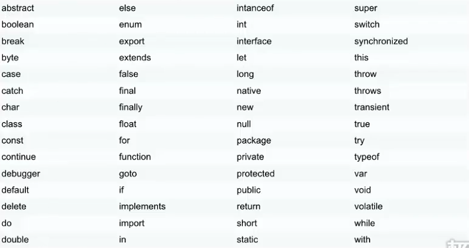

###### datetime:2019/7/3 15:48
###### author:nzb

## 语法与注释

- JavaScript语句
    
    JavaScript语句向浏览器发出的命令。语句的作用是告诉浏览器该做什么。
    
- 分号：
    - 语句之间的分割是分号(;)
    - 注意：分号是可选项，有时候看到不以分号隔开的。
    
- JavaScript代码：
    
    按照编写顺序依次执行
    
- 标识符：
    - JavaScript标识符必须以字母、下划线或美元符号开始
    - JavaScript关键字
    
- JavaScript对大小写敏感

- 空格
    
    JavaScript会忽略多余的空格

- 代码换行

- 保留字

    

- 单行注释

    //
    
- 多行注释

    /**/

## 变量和数据类型

- 变量是用来存储信息的“容器”，使用`var`来声明

    例:
    
        var x=10;
        var y=10.1;
        var z="hello";

- 数据类型
    - 字符串(String)
    - 数字(Number)
    - 布尔(Boolean)
    - 数组(Array)
        - `var arr=['hello',1,2];`
        - `var arr=new Array('world',2,3);`
        - `var arr=new Array();
            arr[0]=4;
            arr[1]=5;
            arr[2]=6;`
    - 对象(Object)
    - 空(null)
    - 未定义
    - 可以通过赋值为null的方式清除变量

## 运算符

- 赋值运算符

    =、+=、-=、*=、/=、%=

- 算术运算符

    +、-、*、/、++、--
    
- 比较运算符
    
    ==、===、!=、!==、>、<、>=、<=

- 逻辑运算符

    &&、||、！
    
- 条件(三目)运算符

    例：`x<10? "x比10小" : "x比10大"`

- 字符串操作
    
    相加就是拼接，任何类型相加字符串都会转化为字符串然后拼接

## 分支结构

- if...else...
    ```javascript
        var i = 10;
        if(i>=10){
            document.write("i大于等于10");
        }else{
            document.write("i小于10");
        }
        
        // 可以无限嵌套
        if(i>10){
            document.write("i大于10");
        }else if(i<10){
            document.write("i小于10");
        }else{
            document.write("i等于10");
        }
    ```

- switch...cas...default...
    ```javascript
        var i = 5;
        switch (i){
            case 1:
              document.write("i为1");
              break;
            case 2:
              document.write("i为2");
              break;
            default:
                document.write("条件不满足");
        };
    ```

## 循环结构

- for循环
    ```javascript
        var i=[1,2,3,4,5,6];
        for(var j=0;j<i.length;j++){
            document.write(i[j]);
        };
      
        // 第二种
        var i=[1,2,3,4,5,6];
        var j=0;
        for(;j<i.length;j++){
            document.write(i[j]);
        };
      
        // 第三种
        var i=[1,2,3,4,5,6];
        var j=0;
        for(;j<i.length;){
            document.write(i[j]);
            j++
        };
       
        // for/in循环
        var i=[1,2,3,4,5,6];
        var j;
        for(j in j){
            document.write(i[j]);
        };

    ```

- while循环
    ```javascript
        var i = 1;
        while (i<10){
            document.write("i");
            i++;
        } 
    ```

- do...while循环
    ```javascript
        var i = 1;
        do{
          document.write("i");
          i++;
        }while (i<10){
        };
    ```

## 跳转语句

- break
- continue
- return

## 函数

- 定义函数
    - 定义函数：
    
        function 函数名(){
            函数体;  (代码块)
        }
    - 注意：
        
        JavaScript对大小写十分敏感，所以这里的function必须小写。在函数调用时，也必须按照函数的相同名称来调用函数。
    
- 调用函数
    ```javascript
        function demo() {
          var a = 10;
          var b = 20;
          var sum = a+b;
          alert(sum);
        }
    
        // 第一种调用方式
        demo();
    
        // 第二种调用方式
        <button onclick="demo()">按钮</button>
    ```

- 带参数的函数
    - 参数的个数可以为任意多，每个参数通过","隔开
    ```javascript
        function demo(a,b) {
          var sum = a+b;
          alert(sum);
        }
        demo(10,20);
    ```

- 带返回值的函数
    ```javascript
        function demo(a,b) {
          var sum = a+b;
          return sum;
        }
        var sum = demo(10,20);
        alert(sum)
    ```

## 局部变量和全局变量

- 局部变量：函数内部声明
- 全局变量：函数外部声明

    ```javascript
        var n = 10; m = 10; //全局变量  任何地方都可以使用
        function demo() {
          var i = 10; //局部变量   只能在当前函数中使用
          x = 10;  // 全局变量   只要调用了该函数任何地方都可以使用
        }
        demo();
        alert(x);
    ```


