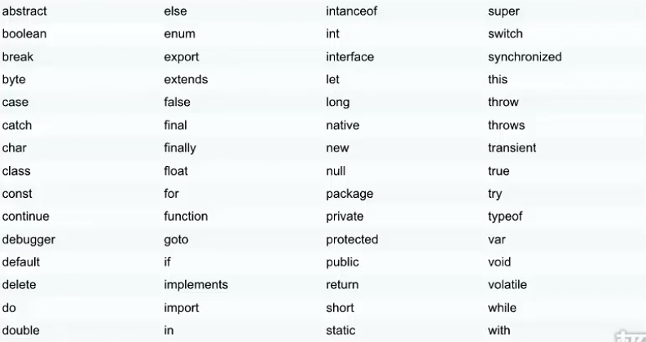

###### datetime:2019/7/3 15:48
###### author:nzb

## 语法与注释

- JavaScript语句
    
    JavaScript语句向浏览器发出的命令。语句的作用是告诉浏览器该做什么。
    
- 分号：
    - 语句之间的分割是分号(;)
    - 注意：分号是可选项，有时候看到不以分号隔开的。
    
- JavaScript代码：
    
    按照编写顺序依次执行
    
- 标识符：
    - JavaScript标识符必须以字母、下划线或美元符号开始
    - JavaScript关键字
    
- JavaScript对大小写敏感

- 空格
    
    JavaScript会忽略多余的空格

- 代码换行

- 保留字

    

- 单行注释

    //
    
- 多行注释

    /**/

## 变量和数据类型

- 变量是用来存储信息的“容器”，使用`var`来声明

    例:
    
        var x=10;
        var y=10.1;
        var z="hello";

- 数据类型
    - 字符串(String)
    - 数字(Number)
    - 布尔(Boolean)
    - 数组(Array)
        - `var arr=['hello',1,2];`
        - `var arr=new Array('world',2,3);`
        - `var arr=new Array();
            arr[0]=4;
            arr[1]=5;
            arr[2]=6;`
    - 对象(Object)
    - 空(null)
    - 未定义
    - 可以通过赋值为null的方式清除变量

## 运算符

- 赋值运算符

    =、+=、-=、*=、/=、%=

- 算术运算符

    +、-、*、/、++、--
    
- 比较运算符
    
    ==、===、!=、!==、>、<、>=、<=

- 逻辑运算符

    &&、||、！
    
- 条件(三目)运算符

    例：`x<10? "x比10小" : "x比10大"`

- 字符串操作
    
    相加就是拼接，任何类型相加字符串都会转化为字符串然后拼接

## 分支结构

- if...else...
    ```javascript
        var i = 10;
        if(i>=10){
            document.write("i大于等于10");
        }else{
            document.write("i小于10");
        }
        
        // 可以无限嵌套
        if(i>10){
            document.write("i大于10");
        }else if(i<10){
            document.write("i小于10");
        }else{
            document.write("i等于10");
        }
    ```

- switch...cas...default...
    ```javascript
        var i = 5;
        switch (i){
            case 1:
              document.write("i为1");
              break;
            case 2:
              document.write("i为2");
              break;
            default:
                document.write("条件不满足");
        };
    ```

## 循环结构

- for循环
    ```javascript
        var i=[1,2,3,4,5,6];
        for(var j=0;j<i.length;j++){
            document.write(i[j]);
        };
      
        // 第二种
        var i=[1,2,3,4,5,6];
        var j=0;
        for(;j<i.length;j++){
            document.write(i[j]);
        };
      
        // 第三种
        var i=[1,2,3,4,5,6];
        var j=0;
        for(;j<i.length;){
            document.write(i[j]);
            j++
        };
       
        // for/in循环
        var i=[1,2,3,4,5,6];
        var j;
        for(j in j){
            document.write(i[j]);
        };

    ```

- while循环
    ```javascript
        var i = 1;
        while (i<10){
            document.write("i");
            i++;
        } 
    ```

- do...while循环
    ```javascript
        var i = 1;
        do{
          document.write("i");
          i++;
        }while (i<10){
        };
    ```

## 跳转语句

- break
- continue
- return

## 函数

- 定义函数
    - 定义函数：
    
        function 函数名(){
            函数体;  (代码块)
        }
    - 注意：
        
        JavaScript对大小写十分敏感，所以这里的function必须小写。在函数调用时，也必须按照函数的相同名称来调用函数。
    
- 调用函数
    ```javascript
        function demo() {
          var a = 10;
          var b = 20;
          var sum = a+b;
          alert(sum);
        }
    
        // 第一种调用方式
        demo();
    
        // 第二种调用方式
        <button onclick="demo()">按钮</button>
    ```

- 带参数的函数
    - 参数的个数可以为任意多，每个参数通过","隔开
    ```javascript
        function demo(a,b) {
          var sum = a+b;
          alert(sum);
        }
        demo(10,20);
    ```

- 带返回值的函数
    ```javascript
        function demo(a,b) {
          var sum = a+b;
          return sum;
        }
        var sum = demo(10,20);
        alert(sum)
    ```

## 局部变量和全局变量

- 局部变量：函数内部声明
- 全局变量：函数外部声明

    ```javascript
        var n = 10; m = 10; //全局变量  任何地方都可以使用
        function demo() {
          var i = 10; //局部变量   只能在当前函数中使用
          x = 10;  // 全局变量   只要调用了该函数任何地方都可以使用
        }
        demo();
        alert(x);
    ```

## 异常捕获

- 异常

    当JavaScript引擎执行JavaScript代码时，发生了错误，导致程序停止运行
    
- 异常抛出

    当异常产生，并且将这个异常生成一个错误信息
    
- 异常捕获

    try{
        发生异常的代码块;
    }catch(err){
        错误信息处理;
    }

- Throw语句：
    
    通过throw语句创建一个自定义错误
    ```html
    <form>
        <input type="text" id="txt">
        <button onclick="demo()">提交</button>
    </form>
    <script>
        function demo() {
            try{
                var e = document.getElementById("txt").value;
                if(e==""){
                    throw "请输入";
                }
            }catch (e) {
                alert(e)
            }
        }
    </script>
    ```

## 事件

- 什么是事件

    事件是可以被JavaScript侦测到的行为

    | 事件 | 描述 |
    |------|-----|
    | onClick | 单击事件 |
    | onMouseOver | 鼠标经过事件 |
    | onMouseOut | 鼠标移出事件 |
    | onChange | 文本内容改变事件 |
    | onSelect | 文本框选中事件 |
    | onFocus | 光标聚集事件 |
    | onBlur | 移开光标事件 |
    | onLoad | 网页加载事件 |
    | onUnload | 关闭网页事件 |

- 事件处理
  - 事件类型
    - UI事件：`load` / `unload` / `error` / `resize` / `scroll`
    - 键盘事件：`keydown` / `keyup` / `keypress`
    - 鼠标事件：`click` / `dbclick` / `mousedown` / `mouseup` / `mousemove` / `mouseover` / `mouseout`
    - 焦点事件：`focus` / `blur`
    - 表单事件：`input` / `change` / `submit` / `reset` / `cut` / `copy` / `paste` / `select`
  - 事件绑定
    - HTML事件处理程序（不推荐使用，因为要做到标签与代码分离）
    - 传统的DOM事件处理程序（只能附加一个回调函数）
    - 事件监听器（旧的浏览器中不被支持）
  - 事件流：事件捕获 / 事件冒泡
  - 事件对象（低版本IE中的window.event）
    - `target`（有些浏览器使用srcElement）获取事件目标
    - `type`：获取事件类型
    - `cancelable`：
    - `preventDefault()`：阻止事件默认行为
    - `stopPropagation()`（低版本IE中的cancelBubble）：阻止时间冒泡
  - 鼠标事件 - 事件发生的位置
    - 屏幕位置：`screenX`和`screenY`
    - 页面位置：`pageX`和`pageY`
    - 客户端位置：`clientX`和`clientY`
  - 键盘事件 - 哪个键被按下了
    - `keyCode`属性（有些浏览器使用`which`）
    - `String.fromCharCode(event.keyCode)`
  - HTML5事件
    - `DOMContentLoaded`
    - `hashchange`
    - `beforeunload`

## DOM

- HTML DOM

    当网页被加载时，浏览器会创建页面的文档对象模型(Document Object Model)
    
    

- DOM操作HTML
    - JavaScript能够改变页面中的所有HTML元素
    - JavaScript能够改变页面中的所有HTML属性
    - JavaScript能够改变页面中的所有CSS样式
    - JavaScript能够改变页面中的所有事件作出反应

## DOM操作HTML

- 改变 HTML 输出流

    注意：绝对不要在文档加载完成之后使用document.write()。这会覆盖该文档
    
- 寻找元素：
    - 通过id找到HTML元素
    - 通过标签名找到HTML元素
    
- 改变 HTML 内容

    使用属性：innerHTML
    `document.getElementById(id).innerHTML=新的 HTML`

- 改变 HTML 属性
    
    使用属性：attribute
    `document.getElementById(id).attribute=新属性值`
    `document.getElementById(id).href="https://www.baidu.com"`
    `document.getElementById(id).src="https://www.baidu.com"`

## DOM操作CSS

- 改变 HTML 样式

    如需改变 HTML 元素的样式，请使用这个语法：
    `document.getElementById(id).style.property=新样式`

    ```html
        <!DOCTYPE html>
        <html>
        <head>
        <meta charset="utf-8">
        <title>菜鸟教程(runoob.com)</title>
        </head>
        <body>
         
        <p id="p1">Hello World!</p>
        <p id="p2">Hello World!</p>
        <script>
        document.getElementById("p2").style.color="blue";
        document.getElementById("p2").style.fontFamily="Arial";
        document.getElementById("p2").style.fontSize="larger";
        </script>
        <p>以上段落通过脚本修改。</p>
         
        </body>
        </html>
    ```

## DOM EventListener

- addEventListener()
    - addEventListener() 方法用于向指定元素添加事件句柄。
    - addEventListener() 方法添加的事件句柄不会覆盖已存在的事件句柄。
    - 你可以向一个元素添加多个事件句柄。
    - 你可以向同个元素添加多个同类型的事件句柄，如：两个 "click" 事件。
    - 你可以向任何 DOM 对象添加事件监听，不仅仅是 HTML 元素。如： window 对象。
    - addEventListener() 方法可以更简单的控制事件（冒泡与捕获）。
    - 当你使用 addEventListener() 方法时, JavaScript 从 HTML 标记中分离开来，可读性更强， 在没有控制HTML标记时也可以添加事件监听。
    - 你可以使用 removeEventListener() 方法来移除事件的监听。
    - 语法：`element.addEventListener(event, function, useCapture);`
        - 第一个参数是事件的类型 (如 "click" 或 "mousedown").
        - 第二个参数是事件触发后调用的函数。
        - 第三个参数是个布尔值用于描述事件是冒泡还是捕获。该参数是可选的。
        - **注意**：不要使用 "on" 前缀。 例如，使用 "click" ,而不是使用 "onclick"。
    - 例：在用户点击按钮时触发监听事件：
    `document.getElementById("myBtn").addEventListener("click", displayDate);`

- removeEventListener()
    - removeEventListener() 方法移除由 addEventListener() 方法添加的事件句柄:
    `element.removeEventListener("mousemove", myFunction);`

- 事件冒泡或事件捕获？
    - 事件传递有两种方式：冒泡与捕获。
    - 事件传递定义了元素事件触发的顺序。 如果你将 `<p>` 元素插入到 `<div>` 元素中，用户点击 `<p>` 元素, 哪个元素的 "click" 事件先被触发呢？
    - 在 冒泡 中，内部元素的事件会先被触发，然后再触发外部元素，即： `<p>` 元素的点击事件先触发，然后会触发 `<div>` 元素的点击事件。
    - 在 捕获 中，外部元素的事件会先被触发，然后才会触发内部元素的事件，即： `<div>` 元素的点击事件先触发 ，然后再触发 `<p>` 元素的点击事件。
    - addEventListener() 方法可以指定 "useCapture" 参数来设置传递类型：
        `addEventListener(event, function, useCapture);`
    - 默认值为 false, 即冒泡传递，当值为 true 时, 事件使用捕获传递。

- 浏览器支持
    
    IE 8 及更早 IE 版本，Opera 7.0及其更早版本不支持 addEventListener() 和 removeEventListener() 方法。但是，对于这类浏览器版本可以使用 detachEvent() 方法来移除事件句柄:
    
    `element.attachEvent(event, function);`
    
    `element.detachEvent(event, function);`

    例：
    ```javascript
        var x = document.getElementById("myBtn");
        if (x.addEventListener) {                    // 所有主流浏览器，除了 IE 8 及更早版本
            x.addEventListener("click", myFunction);
        } else if (x.attachEvent) {                  // IE 8 及更早版本
            x.attachEvent("onclick", myFunction);
        }
    ```


