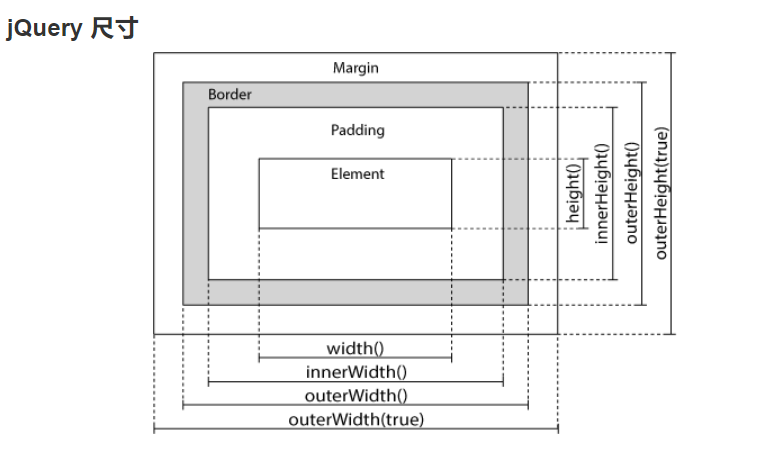

###### datetime:2019/7/10 13:43
###### author:nzb

## jQuery简介

jQuery 库可以通过一行简单的标记被添加到网页中。

### 什么是 jQuery ？

- jQuery是一个JavaScript函数库。
- jQuery是一个轻量级的"写的少，做的多"的JavaScript库。
- jQuery库包含以下功能：
- HTML 元素选取
- HTML 元素操作
- CSS 操作
- HTML 事件函数
- JavaScript 特效和动画
- HTML DOM 遍历和修改
- AJAX
- Utilities
- **提示**： 除此之外，Jquery还提供了大量的插件。

## 语法

jQuery 语法是通过选取 HTML 元素，并对选取的元素执行某些操作。

- 基础语法： $(selector).action()
    - 美元符号定义 jQuery
    - 选择符（selector）"查询"和"查找" HTML 元素
    - jQuery 的 action() 执行对元素的操作

- 实例:
    - $(this).hide() - 隐藏当前元素
    - $("p").hide() - 隐藏所有 `<p>` 元素
    - $("p.test").hide() - 隐藏所有 class="test" 的 `<p>` 元素
    - $("#test").hide() - 隐藏所有 id="test" 的元素

- 文档就绪事件

您也许已经注意到在我们的实例中的所有 jQuery 函数位于一个 document ready 函数中：
```javascript
    $(document).ready(function(){
     
       // 开始写 jQuery 代码...
     
    });
```
这是为了防止文档在完全加载（就绪）之前运行 jQuery 代码，即在 DOM 加载完成后才可以对 DOM 进行操作。

如果在文档没有完全加载之前就运行函数，操作可能失败。下面是两个具体的例子：
- 试图隐藏一个不存在的元素
- 获得未完全加载的图像的大小

**提示：**简洁写法（与以上写法效果相同）:
```javascript
    $(function(){
     
       // 开始写 jQuery 代码...
     
    });
```
以上两种方式你可以选择你喜欢的方式实现文档就绪后执行 jQuery 方法。

JavaScript 入口函数:
```javascript
    window.onload = function () {
        // 执行代码
    }
```
jQuery 入口函数与 JavaScript 入口函数的区别：
 - jQuery 的入口函数是在 html 所有标签(DOM)都加载之后，就会去执行。
 - JavaScript 的 window.onload 事件是等到所有内容，包括外部图片之类的文件加载完后，才会执行。

## 选择器

jQuery 选择器允许您对 HTML 元素组或单个元素进行操作。

jQuery 中所有选择器都以美元符号开头：$()。

### 元素选择器

用户点击按钮后，所有 <p> 元素都隐藏：
```javascript
    $(document).ready(function(){
      $("button").click(function(){
        $("p").hide();
      });
    });
```

### #id 选择器

当用户点击按钮后，有 id="test" 属性的元素将被隐藏：
```javascript
    $(document).ready(function(){
      $("button").click(function(){
        $("#test").hide();
      });
    });
```

### .class 选择器

用户点击按钮后所有带有 class="test" 属性的元素都隐藏：
```javascript
    $(document).ready(function(){
      $("button").click(function(){
        $(".test").hide();
      });
    });
```

### 更多实例
| 语法 | 描述 |
|----------|------------|
| $("*") | 选取所有元素	 |
| $(this) | 选取当前 HTML 元素	 |
| $("p.intro") | 选取 class 为 intro 的 `<p>` 元素	 |
| $("p:first") | 选取第一个 `<p>` 元素	 |
| $("ul li:first") | 选取第一个 `<ul>` 元素的第一个 `<li>` 元素	 |
| $("ul li:first-child") | 选取每个 `<ul>` 元素的第一个 `<li>` 元素	 |
| $("[href]") | 选取带有 href 属性的元素	 |
| $("a[target='_blank']") | 选取所有 target 属性值等于 "_blank" 的 `<a>` 元素	 |
| $("a[target!='_blank']") | 选取所有 target 属性值不等于 "_blank" 的 `<a>` 元素	 |
| $(":button") | 选取所有 type="button" 的 <input> 元素 和 <button> 元素	 |
| $("tr:even") | 选取偶数位置的 `<tr>` 元素	 |
| $("tr:odd") | 选取奇数位置的 `<tr>` 元素	 |
| $("#id", ".class") | 复合选择器 |
| $(div p span)      | 层级选择器 //div下的p元素中的span元素 |
| $(div>p)           | 父子选择器 //div下的所有p元素 |
| $(div+p)           | 相邻元素选择器 //div后面的p元素(仅一个p) |
| $(div~p)           | 兄弟选择器  //div后面的所有p元素(同级别) |
| $(.p:last)         | 类选择器 加 过滤选择器  第一个和最后一个（first 或者 last） |
| $("#mytable td:odd")     | 层级选择 加 过滤选择器 奇偶（odd 或者 even） |
| $("div p:eq(2)")   | 索引选择器 div下的第三个p元素（索引是从0开始） |
| $("a[href='www.baidu.com']") | 属性选择器 |
| $("p:contains(test)")       | // 内容过滤选择器，包含text内容的p元素 |
| $(":emtyp")       | //内容过滤选择器，所有空标签（不包含子标签和内容的标签）parent 相反 |
| $(":hidden")      | //所有隐藏元素 visible  |
| $("input:enabled") | //选取所有启用的表单元素 |
| $(":disabled")    | //所有不可用的元素 |
| $("input:checked") | //获取所有选中的复选框单选按钮等 |
| $("select option:selected") | //获取选中的选项元素 |

关于 : 和 [] 这两个符号的理解

“**：**”：可以理解为种类的意思，如：p:first，p 的种类为第一个。

“**[]**” ：很自然的可以理解为属性的意思，如：[href] 选取带有 href 属性的元素。

$(":button") 为 jQuery 中表单选择器（貌似与过滤选择器同级），旨在选择所有的按钮，所以会找到 <input>、<button> 元素；而 $("button") 则为基本选择器，旨在选择为 <button> 的标签。

**:** 即为 jQuery 的过滤选择器，语法类似于 css 中的伪类选择器；其过滤选择器大概可以分为基本过滤（p:first 之类）、内容过滤（:empty）、子元素过滤(:first-child)和属性过滤 [href] 选择器。

## 事件

页面对不同访问者的响应叫做事件。

事件处理程序指的是当 HTML 中发生某些事件时所调用的方法。

实例：

- 在元素上移动鼠标。
- 选取单选按钮
- 点击元素

在事件中经常使用术语"触发"（或"激发"）例如： "当您按下按键时触发 keypress 事件"。

### 常用的 jQuery 事件方法

- $(document).ready()

    $(document).ready() 方法允许我们在文档完全加载完后执行函数。该事件方法在 jQuery 语法 章节中已经提到过。

- click()

    click() 方法是当按钮点击事件被触发时会调用一个函数。

- dblclick()

    当双击元素时，会发生 dblclick 事件。

- mouseenter()

    当鼠标指针穿过元素时，会发生 mouseenter 事件。
    
- mouseleave()

    当鼠标指针离开元素时，会发生 mouseleave 事件。

- mousedown()

    当鼠标指针移动到元素上方，并按下鼠标按键时，会发生 mousedown 事件。

- mouseup()

    当在元素上松开鼠标按钮时，会发生 mouseup 事件。

- hover()

    hover()方法用于模拟光标悬停事件。

    当鼠标移动到元素上时，会触发指定的第一个函数(mouseenter);当鼠标移出这个元素时，会触发指定的第二个函数(mouseleave)。

- focus()

    当元素获得焦点时，发生 focus 事件。

    当通过鼠标点击选中元素或通过 tab 键定位到元素时，该元素就会获得焦点。

- blur()

    当元素失去焦点时，发生 blur 事件。

- on() 和 off()
    
    绑定事件和解除绑定事件

### 笔记

一.keypress,keydown,keyup的区别:

     1.keydown：在键盘上按下某键时发生,一直按着则会不断触发（opera浏览器除外）, 它返回的是键盘代码;
     2.keypress：在键盘上按下一个按键，并产生一个字符时发生, 返回ASCII码。注意: shift、alt、ctrl等键按下并不会产生字符，所以监听无效 ,换句话说, 只有按下能在屏幕上输出字符的按键时keypress事件才会触发。若一直按着某按键则会不断触发。
     3.keyup：用户松开某一个按键时触发, 与keydown相对, 返回键盘代码.

二.两种常用用法举例

案例1:获取按键代码或字符的ASCII码
```javascript
    $(window).keydown( function(event){
       // 通过event.which可以拿到按键代码.  如果是keypress事件中,则拿到ASCII码.
    } );
```
案例2:传递数据给事件处理函数

语法:

jQueryObject.keypress( [[ data ,]  handler ] );
- data: 通过event.data传递给事件处理函数的任意数据;
- handler: 指定的事件处理函数;

举例:
```javascript
    // 只允许按下的字母键生效, 65~90是所有大写字母的键盘代码范围.
    var validKeys = { start: 65, end: 90  };
    $("#keys").keypress( validKeys, function(event){
        var keys = event.data;  //拿到validKeys对象.
        return event.which >= keys.start && event.which <= keys.end;
    } );
```

三.关于获取触发事件的说明：

1.获取事件对象
```javascript
    $(document).ready(function(){
        $(window).keypress(function(event){    
            //获取事件对象，里面包含各种有用的信息。
            console.log(event);
            //console.log(event.which);
        });
    });
```
2.keypress事件获取键入字符
```javascript
    $(window).keypress(function(event){
        //event.which是获取ASCII码，前面的函数是将ASCII码转换成字符，空格键和Enter键输出均为空白。
        console.log(String.fromCharCode(event.which));
        //从event对象中key属性获取字符，但是Enter键的key值为"Enter"，空白键还是空白" "。
        console.log(event.key);
    });
```

## jQuery - noConflict() 方法

正如您已经了解到的，jQuery 使用 $ 符号作为 jQuery 的简写。

如果其他 JavaScript 框架也使用 $ 符号作为简写怎么办？

其他一些 JavaScript 框架包括：MooTools、Backbone、Sammy、Cappuccino、Knockout、JavaScript MVC、Google Web Toolkit、Google Closure、Ember、Batman 以及 Ext JS。

其中某些框架也使用 $ 符号作为简写（就像 jQuery），如果您在用的两种不同的框架正在使用相同的简写符号，有可能导致脚本停止运行。

jQuery 的团队考虑到了这个问题，并实现了 noConflict() 方法。

noConflict() 方法会释放对 $ 标识符的控制，这样其他脚本就可以使用它了。

当然，您仍然可以通过全名替代简写的方式来使用 jQuery：
```javascript
    $.noConflict();
    jQuery(document).ready(function(){
      jQuery("button").click(function(){
        jQuery("p").text("jQuery 仍然在工作!");
      });
    });
```
您也可以创建自己的简写。noConflict() 可返回对 jQuery 的引用，您可以把它存入变量，以供稍后使用。请看这个例子：
```javascript
    var jq = $.noConflict();
    jq(document).ready(function(){
      jq("button").click(function(){
        jq("p").text("jQuery 仍然在工作!");
      });
    });
```
如果你的 jQuery 代码块使用 $ 简写，并且您不愿意改变这个快捷方式，那么您可以把 $ 符号作为变量传递给 ready 方法。这样就可以在函数内使用 $ 符号了 - 而在函数外，依旧不得不使用 "jQuery"：
```javascript
    $.noConflict();
    jQuery(document).ready(function($){
      $("button").click(function(){
        $("p").text("jQuery 仍然在工作!");
      });
    });
```

## jQuery HTML

### 获取内容和属性

- 获得内容： text()、html() 以及 val()
- 三个简单实用的用于 DOM 操作的 jQuery 方法：
    - text() - 设置或返回所选元素的文本内容
    - html() - 设置或返回所选元素的内容（包括 HTML 标记）
    - val() - 设置或返回表单字段的值
    ```javascript
        $("#btn1").click(function(){
          alert("Text: " + $("#test").text());
        });
        $("#btn2").click(function(){
          alert("HTML: " + $("#test").html());
        });
        $("#btn1").click(function(){
          alert("值为: " + $("#test").val());
        });
    ```

- 获取属性 - attr()：用于获取属性值。
    ```javascript
        $("button").click(function(){
          alert($("#runoob").attr("href"));
        });
    ```

### 设置内容和属性

- 设置内容： text()、html() 以及 val()
- 我们将使用前一章中的三个相同的方法来设置内容：
    - text() - 设置或返回所选元素的文本内容
    - html() - 设置或返回所选元素的内容（包括 HTML 标记）
    - val() - 设置或返回表单字段的值
    ```javascript
        $("#btn1").click(function(){
            $("#test1").text("Hello world!");
        });
        $("#btn2").click(function(){
            $("#test2").html("<b>Hello world!</b>");
        });
        $("#btn3").click(function(){
            $("#test3").val("RUNOOB");
        });
    ```

- text()、html() 以及 val() 的回调函数

上面的三个 jQuery 方法：text()、html() 以及 val()，同样拥有回调函数。回调函数有两个参数：被选元素列表中当前元素的下标，以及原始（旧的）值。然后以函数新值返回您希望使用的字符串。

下面的例子演示带有回调函数的 text() 和 html()：
```javascript
    $("#btn1").click(function(){
        $("#test1").text(function(i,origText){
            return "旧文本: " + origText + " 新文本: Hello world! (index: " + i + ")"; 
        });
    });
     
    $("#btn2").click(function(){
        $("#test2").html(function(i,origText){
            return "旧 html: " + origText + " 新 html: Hello <b>world!</b> (index: " + i + ")"; 
        });
    });
```

- 设置属性 - attr()：用于设置/改变属性值。
    ```javascript
        $("button").click(function(){
          $("#runoob").attr("href","http://www.runoob.com/jquery");
        });
    ```
attr() 方法也允许您同时设置多个属性。

下面的例子演示如何同时设置 href 和 title 属性：
```javascript
    $("button").click(function(){
        $("#runoob").attr({
            "href" : "http://www.runoob.com/jquery",
            "title" : "jQuery 教程"
        });
    });
```

- attr() 的回调函数

jQuery 方法 attr()，也提供回调函数。回调函数有两个参数：被选元素列表中当前元素的下标，以及原始（旧的）值。然后以函数新值返回您希望使用的字符串。

下面的例子演示带有回调函数的 attr() 方法：
```javascript
    $("button").click(function(){
      $("#runoob").attr("href", function(i,origValue){
        return origValue + "/jquery"; 
      });
    });
```

### 添加元素

- 添加新内容的四个 jQuery 方法：
    - append() - 在被选元素的结尾插入内容
    - prepend() - 在被选元素的开头插入内容
    - after() - 在被选元素之后插入内容
    - before() - 在被选元素之前插入内容

- append() 方法

    jQuery append() 方法在被选元素的结尾插入内容（仍然该元素的内部）。
    ```javascript
        $("p").append("追加文本");
    ```

- prepend() 方法

    jQuery prepend() 方法在被选元素的开头插入内容。
    ```javascript
        $("p").prepend("在开头追加文本");
    ```

- 通过 append() 和 prepend() 方法添加若干新元素

    在上面的例子中，我们只在被选元素的开头/结尾插入文本/HTML。
    
    不过，append() 和 prepend() 方法能够通过参数接收无限数量的新元素。可以通过 jQuery 来生成文本/HTML（就像上面的例子那样），或者通过 JavaScript 代码和 DOM 元素。
    
    在下面的例子中，我们创建若干个新元素。这些元素可以通过 text/HTML、jQuery 或者 JavaScript/DOM 来创建。然后我们通过 append() 方法把这些新元素追加到文本中（对 prepend() 同样有效）：
    ```javascript
        function appendText()
        {
            var txt1="<p>文本。</p>";              // 使用 HTML 标签创建文本
            var txt2=$("<p></p>").text("文本。");  // 使用 jQuery 创建文本
            var txt3=document.createElement("p");
            txt3.innerHTML="文本。";               // 使用 DOM 创建文本 text with DOM
            $("body").append(txt1,txt2,txt3);        // 追加新元素
        }
    ```

- jQuery after() 和 before() 方法
    ```javascript
        $("img").after("在后面添加文本");
         
        $("img").before("在前面添加文本");
    ```

- 通过 after() 和 before() 方法添加若干新元素

    after() 和 before() 方法能够通过参数接收无限数量的新元素。可以通过 text/HTML、jQuery 或者 JavaScript/DOM 来创建新元素。
    
    在下面的例子中，我们创建若干新元素。这些元素可以通过 text/HTML、jQuery 或者 JavaScript/DOM 来创建。然后我们通过 after() 方法把这些新元素插到文本中（对 before() 同样有效）：
    ```javascript
        function afterText()
        {
            var txt1="<b>I </b>";                    // 使用 HTML 创建元素
            var txt2=$("<i></i>").text("love ");     // 使用 jQuery 创建元素
            var txt3=document.createElement("big");  // 使用 DOM 创建元素
            txt3.innerHTML="jQuery!";
            $("img").after(txt1,txt2,txt3);          // 在图片后添加文本
        }
    ```

- append/prepend和after/before有什么区别？
    - append
        ```javascript
            <p>
              <span class="s1">s1</span>
            </p>
            <script>
            $("p").append('<span class="s2">s2</span>');
            </script>
        ```
        结果是这样的:
        ```html
            <p>
              <span class="s1">s1</span>
              <span class="s2">s2</span>
            </p>
        ```
        
    - after
        ```javascript
            <p>
              <span class="s1">s1</span>
            </p>
            <script>
            $("p").after('<span class="s2">s2</span>');
            </script>
        ```
        结果是这样的:
        ```html
            <p>
              <span class="s1">s1</span>
            </p>
            <span class="s2">s2</span>
        ```
        
    - **总结：**
        - append/prepend 是在选择元素内部嵌入。
        - after/before 是在元素外面追加。

### 删除元素

- 使用以下两个 jQuery 方法：
    - remove() - 删除被选元素（及其子元素）
    - empty() - 从被选元素中删除子元素

- jQuery remove() 方法：删除被选元素及其子元素。
    ```javascript
        $("#div1").remove();
    ```

- jQuery empty() 方法：删除被选元素的子元素。
    ```javascript
        $("#div1").empty();
    ```

- 过滤被删除的元素

    jQuery remove() 方法也可接受一个参数，允许您对被删元素进行过滤。

    该参数可以是任何 jQuery 选择器的语法。

    下面的例子删除 class="italic" 的所有 `<p>` 元素：
    ```javascript
        $("p").remove(".italic");
    ```

## jQuery CSS

### CSS类和方法

- jQuery 拥有若干进行 CSS 操作的方法。我们将学习下面这些：
    - addClass() - 向被选元素添加一个或多个类
    - removeClass() - 从被选元素删除一个或多个类
    - toggleClass() - 对被选元素进行添加/删除类的切换操作
    - css() - 设置或返回样式属性

实例样式表
```css
.important
{
        font-weight:bold;
        font-size:xx-large;
}
 
.blue
{
        color:blue;
}
```

- addClass() 方法
    ```javascript
        $("button").click(function(){
          $("h1,h2,p").addClass("blue");
          $("div").addClass("important");
        });

    // 或规定多个类：
        $("button").click(function(){
            $("body div:first").addClass("important blue");
        });
    ```

- removeClass() 方法
    ```javascript
        $("button").click(function(){
          $("h1,h2,p").removeClass("blue");
        });
    ```

- toggleClass() 方法

    该方法对被选元素进行添加/删除类的切换操作：
    ```javascript
        $("button").click(function(){
          $("h1,h2,p").toggleClass("blue");
        });
    ```

- css() 方法

    设置或返回被选元素的一个或多个样式属性。
    
    - 返回 CSS 属性
    
        如需返回指定的 CSS 属性的值，请使用如下语法：
        ```javascript
            css("propertyname");
    
            // 例
            $("p").css("background-color");
        ```
    
    - 设置 CSS 属性
    
        如需设置指定的 CSS 属性，请使用如下语法：
        ```javascript
            css("propertyname","value");

            // 例
            $("p").css("background-color","yellow");
        ```
        
    - 设置多个 CSS 属性
    
        如需设置多个 CSS 属性，请使用如下语法：
        ```javascript
            css({"propertyname":"value","propertyname":"value",...});
            
            // 例
            $("p").css({"background-color":"yellow","font-size":"200%"});
        ```

### CSS盒子模型(尺寸)

- jQuery 提供多个处理尺寸的重要方法：
    - width()
    - height()
    - innerWidth()
    - innerHeight()
    - outerWidth()
    - outerHeight()
    
- jQuery尺寸

    

- width() 和 height() 方法

    width() 方法设置或返回元素的宽度（不包括内边距、边框或外边距）。
    
    height() 方法设置或返回元素的高度（不包括内边距、边框或外边距）。
    ```javascript
        $("button").click(function(){
          var txt="";
          txt+="div 的宽度是: " + $("#div1").width() + "</br>";
          txt+="div 的高度是: " + $("#div1").height();
          $("#div1").html(txt);
        });
    ```
    
- innerWidth() 和 innerHeight() 方法

    innerWidth() 方法返回元素的宽度（包括内边距）。
    
    innerHeight() 方法返回元素的高度（包括内边距）。
    ```javascript
        $("button").click(function(){
          var txt="";
          txt+="div 宽度，包含内边距: " + $("#div1").innerWidth() + "</br>";
            txt+="div 高度，包含内边距: " + $("#div1").innerHeight();
          $("#div1").html(txt);
        });
    ```

- outerWidth() 和 outerHeight() 方法

    outerWidth() 方法返回元素的宽度（包括内边距和边框）。
    
    outerHeight() 方法返回元素的高度（包括内边距和边框）。
    ```javascript
        $("button").click(function(){
          var txt="";
          txt+="div 宽度，包含内边距和边框: " + $("#div1").outerWidth() + "</br>";
          txt+="div 高度，包含内边距和边框: " + $("#div1").outerHeight();
          $("#div1").html(txt);
        });
    ```

## jQuery 效果

### 隐藏和显示

- hide() 和 show()

    使用 hide() 和 show() 方法来隐藏和显示 HTML 元素：
    ```javascript
        $("#hide").click(function(){
          $("p").hide();
        });
         
        $("#show").click(function(){
          $("p").show();
        });
    ```
    - 语法:
        ```javascript
            $(selector).hide(speed,callback);
            
            $(selector).show(speed,callback);
        ```
        可选的 speed 参数规定隐藏/显示的速度，可以取以下值："slow"、"fast" 或毫秒。
    
        可选的 callback 参数是隐藏或显示完成后所执行的函数名称。
        
        对于可选的 callback 参数，有以下两点说明：
    
        1.$(selector)选中的元素的个数为n个，则callback函数会执行n次；当 callback 函数加上括号时，函数立即执行，只会调用一次， 如果不加括号，元素显示或隐藏后调用函数，才会调用多次。
        
        2.callback函数名后加括号，会立刻执行函数体，而不是等到显示/隐藏完成后才执行；
        
        3.callback既可以是函数名，也可以是匿名函数；
            
        下面的例子演示了带有 speed 参数的 hide() 方法：
        ```javascript
            $("button").click(function(){
              $("p").hide(1000);
            });
        ```
        下面的例子演示了带有 speed 参数的 hide() 方法，并使用回调函数：
        ```javascript
            $(document).ready(function(){
              $(".hidebtn").click(function(){
                $("div").hide(1000,"linear",function(){
                  alert("Hide() 方法已完成!");
                });
              });
            });
        ```
        第二个参数是一个字符串，表示过渡使用哪种缓动函数。（译者注：jQuery自身提供"linear" 和 "swing"，其他可以使用相关的插件）。

- toggle()

    使用 toggle() 方法来切换 hide() 和 show() 方法。显示被隐藏的元素，并隐藏已显示的元素：
    ```javascript
        $("button").click(function(){
          $("p").toggle();
        });
    ```
    
    - 语法:
        ```javascript
            $(selector).toggle(speed,callback);
        ```
        可选的 speed 参数规定隐藏/显示的速度，可以取以下值："slow"、"fast" 或毫秒。
    
        可选的 callback 参数是隐藏或显示完成后所执行的函数名称。

### 淡入淡出

- jQuery 拥有下面四种 fade 方法：
    - fadeIn()
    - fadeOut()
    - fadeToggle()
    - fadeTo()

- fadeIn() 方法：用于淡入已隐藏的元素。

    - 语法:
        ```javascript
            $(selector).fadeIn(speed,callback);
        ```
        可选的 speed 参数规定效果的时长。它可以取以下值："slow"、"fast" 或毫秒。.
        
        可选的 callback 参数是 fading 完成后所执行的函数名称。
    
        下面的例子演示了带有不同参数的 fadeIn() 方法：
        ```javascript
            $("button").click(function(){
              $("#div1").fadeIn();
              $("#div2").fadeIn("slow");
              $("#div3").fadeIn(3000);
            });
        ```

- fadeOut() 方法：用于淡出可见元素。

    - 语法:
        ```javascript
            $(selector).fadeOut(speed,callback);
        ```
        可选的 speed 参数规定效果的时长。它可以取以下值："slow"、"fast" 或毫秒。
        
        可选的 callback 参数是 fading 完成后所执行的函数名称。
        
        下面的例子演示了带有不同参数的 fadeOut() 方法：
        ```javascript
            $("button").click(function(){
              $("#div1").fadeOut();
              $("#div2").fadeOut("slow");
              $("#div3").fadeOut(3000);
            });
        ```

- fadeToggle() 方法：

    jQuery fadeToggle() 方法可以在 fadeIn() 与 fadeOut() 方法之间进行切换。
    
    如果元素已淡出，则 fadeToggle() 会向元素添加淡入效果。
    
    如果元素已淡入，则 fadeToggle() 会向元素添加淡出效果。

    - 语法:
    ```javascript
        $(selector).fadeToggle(speed,callback);
    ```
    可选的 speed 参数规定效果的时长。它可以取以下值："slow"、"fast" 或毫秒。
    
    可选的 callback 参数是 fading 完成后所执行的函数名称。
    
    下面的例子演示了带有不同参数的 fadeToggle() 方法：
    ```javascript
        $("button").click(function(){
          $("#div1").fadeToggle();
          $("#div2").fadeToggle("slow");
          $("#div3").fadeToggle(3000);
        });
    ```

- fadeTo() 方法

    jQuery fadeTo() 方法允许渐变为给定的不透明度（值介于 0 与 1 之间）。

    - 语法:
    
    必需的 speed 参数规定效果的时长。它可以取以下值："slow"、"fast" 或毫秒。
    
    fadeTo() 方法中必需的 opacity 参数将淡入淡出效果设置为给定的不透明度（值介于 0 与 1 之间）。
    
    可选的 callback 参数是该函数完成后所执行的函数名称。
    
    下面的例子演示了带有不同参数的 fadeTo() 方法：
    ```javascript
        $("button").click(function(){
          $("#div1").fadeTo("slow",0.15);
          $("#div2").fadeTo("slow",0.4);
          $("#div3").fadeTo("slow",0.7);
        });
    ```

### 滑动

- jQuery 拥有以下滑动方法：
    - slideDown()
    - slideUp()
    - slideToggle()

- slideDown() 方法

    jQuery slideDown() 方法用于向下滑动元素。

    - 语法:
    ```javascript
        $(selector).slideDown(speed,callback);
    ```
    可选的 speed 参数规定效果的时长。它可以取以下值："slow"、"fast" 或毫秒。
    
    可选的 callback 参数是滑动完成后所执行的函数名称。
    
    下面的例子演示了 slideDown() 方法：
    ```javascript
        $("#flip").click(function(){
          $("#panel").slideDown();
        });
    ```

- slideUp() 方法

    jQuery slideUp() 方法用于向上滑动元素。
    
    - 语法:
    ```javascript
        $(selector).slideUp(speed,callback);
    ```
    可选的 speed 参数规定效果的时长。它可以取以下值："slow"、"fast" 或毫秒。
    
    可选的 callback 参数是滑动完成后所执行的函数名称。
    
    下面的例子演示了 slideUp() 方法：
    ```javascript
        $("#flip").click(function(){
          $("#panel").slideUp();
        });
    ```

- slideToggle() 方法

    jQuery slideToggle() 方法可以在 slideDown() 与 slideUp() 方法之间进行切换。
    
    如果元素向下滑动，则 slideToggle() 可向上滑动它们。
    
    如果元素向上滑动，则 slideToggle() 可向下滑动它们。
    ```javascript
        $(selector).slideToggle(speed,callback);
    ```
    可选的 speed 参数规定效果的时长。它可以取以下值："slow"、"fast" 或毫秒。
    
    可选的 callback 参数是滑动完成后所执行的函数名称。
    
    下面的例子演示了 slideToggle() 方法：
    ```javascript
        $("#flip").click(function(){
          $("#panel").slideToggle();
        });
    ```

### 动画

- animate() 方法

    用于创建自定义动画。
    
    - 语法：
        ```javascript
            $(selector).animate({params},speed,callback);
        ```
        必需的 params 参数定义形成动画的 CSS 属性。
        
        可选的 speed 参数规定效果的时长。它可以取以下值："slow"、"fast" 或毫秒。
        
        可选的 callback 参数是动画完成后所执行的函数名称。
        
        下面的例子演示 animate() 方法的简单应用。它把 `<div>` 元素往右边移动了 250 像素：
        ```javascript
            $("button").click(function(){
              $("div").animate({left:'250px'});
            });
        ```
    默认情况下，所有 HTML 元素都有一个静态位置，且无法移动。
    
    如需对位置进行操作，要记得首先把元素的 CSS position 属性设置为 relative、fixed 或 absolute！

    - 操作多个属性
    
        生成动画的过程中可同时使用多个属性：

        实例
        ```javascript
            $("button").click(function(){
              $("div").animate({
                left:'250px',
                opacity:'0.5',
                height:'150px',
                width:'150px'
              });
            });
        ```
    
    - 使用相对值
    
        也可以定义相对值（该值相对于元素的当前值）。需要在值的前面加上 += 或 -=：
        ```javascript
            $("button").click(function(){
              $("div").animate({
                left:'250px',
                height:'+=150px',
                width:'+=150px'
              });
            });
        ```
        
    - 使用预定义的值
    
        甚至可以把属性的动画值设置为 "show"、"hide" 或 "toggle"：
        ```javascript
            $("button").click(function(){
              $("div").animate({
                height:'toggle'
              });
            });
        ```
        
    - 使用队列功能
    
        默认地，jQuery 提供针对动画的队列功能。

        这意味着如果您在彼此之后编写多个 animate() 调用，jQuery 会创建包含这些方法调用的"内部"队列。然后逐一运行这些 animate 调用。
        ```javascript
            $("button").click(function(){
              var div=$("div");
              div.animate({height:'300px',opacity:'0.4'},"slow");
              div.animate({width:'300px',opacity:'0.8'},"slow");
              div.animate({height:'100px',opacity:'0.4'},"slow");
              div.animate({width:'100px',opacity:'0.8'},"slow");
            });

            // 下面的例子把 <div> 元素往右边移动了 100 像素，然后增加文本的字号：
            $("button").click(function(){
                var div=$("div");
                div.animate({left:'100px'},"slow");
                div.animate({fontSize:'3em'},"slow");
            });
        ```
    
- 可以用 animate() 方法来操作所有 CSS 属性吗？
   
    是的，几乎可以！不过，需要记住一件重要的事情：当使用 animate() 时，必须使用 Camel 标记法书写所有的属性名，比如，必须使用 paddingLeft 而不是 padding-left，使用 marginRight 而不是 margin-right，等等。
    
    同时，色彩动画并不包含在核心 jQuery 库中。
    
    如果需要生成颜色动画，您需要从 [jquery.com](https://jquery.com/download/) 下载 [颜色动画](https://plugins.jquery.com/color/) 插件。

### 停止动画

- stop() 方法

    用于停止动画或效果，在它们完成之前。
    
    stop() 方法适用于所有 jQuery 效果函数，包括滑动、淡入淡出和自定义动画。
    
    - 语法:
        ```javascript
            $(selector).stop(stopAll,goToEnd);
        ```
    可选的 stopAll 参数规定是否应该清除动画队列。默认是 false，即仅停止活动的动画，允许任何排入队列的动画向后执行。

    可选的 goToEnd 参数规定是否立即完成当前动画。默认是 false。
    
    因此，默认地，stop() 会清除在被选元素上指定的当前动画。
    
    下面的例子演示 stop() 方法，不带参数：
    ```javascript
        $("#stop").click(function(){
          $("#panel").stop();
        });
    ```

- 动画队列停止动画测试，只停止当前正在进行的动画，停止当前动画后，队列中的下一个动画开始进行：
    ```javascript
        $(document).ready(function(){
          $("#flip").click(function(){
            $("#panel").slideDown(5000);
            $("#panel").slideUp(5000);
          });
          $("#stop").click(function(){
            $("#panel").stop();
          });
        });
    ```

- 可以在 stop() 中设置 stopAll 的参数为 true，这样就可以停止所有动画效果而不是只停止当前动画：
    ```javascript
        $(document).ready(function(){
          $("#flip").click(function(){
            $("#panel").slideDown(5000);
            $("#panel").slideUp(5000);
          });
          $("#stop").click(function(){
            $("#panel").stop(true);
          });
        });
    ```

### Callback(回调) 方法

Callback 函数在当前动画 100% 完成之后执行。

- jQuery 动画的问题

    许多 jQuery 函数涉及动画。这些函数也许会将 speed 或 duration 作为可选参数。
    
    例子：$("p").hide("slow")
    
    speed 或 duration 参数可以设置许多不同的值，比如 "slow", "fast", "normal" 或毫秒。
    
    实例
    
    以下实例在隐藏效果完全实现后回调函数:
    ```javascript
        $("button").click(function(){
          $("p").hide("slow",function(){
            alert("段落现在被隐藏了");
          });
        });
    ```
    以下实例没有回调函数，警告框会在隐藏效果完成前弹出：
    ```javascript
        $("button").click(function(){
          $("p").hide(1000);
          alert("段落现在被隐藏了");
        });
    ```
- 被立即停止的动画不会触发回调，被立即完成的动画会触发回调。
    ```javascript
        $(document).ready(function(){
            
          $("button").click(function(){
            $("p").hide(3000,function(){
              alert("段落现在被隐藏了");
            });
          });
          $("#happy").click(function(){
              $("p").stop(false,true);
          });
        });
    ```

- 如果动画有队列的话，想实现其快速完成所有动画并停止，就要相应的与队列数对应条数的停止语句。
    ```javascript
        $(document).ready(function(){
          $("#start").click(function(){
            $("div").animate({left:'300px'},5000);
            $("div").animate({fontSize:'3em'},5000);
          });
        
          $("#stop1").click(function(){
            $("div").stop();
          });
        
          $("#stop2").click(function(){
            $("div").stop(true);
          });
        
          $("#stop3").click(function(){
            $("div").stop(false,true);
            $("div").stop(false,true);
          });
        });
    ```

### 链(Chaining)

通过 jQuery，可以把动作/方法链接在一起。

Chaining 允许我们在一条语句中运行多个 jQuery 方法（在相同的元素上）。

直到现在，我们都是一次写一条 jQuery 语句（一条接着另一条）。

不过，有一种名为链接（chaining）的技术，允许我们在相同的元素上运行多条 jQuery 命令，一条接着另一条。

**提示：** 这样的话，浏览器就不必多次查找相同的元素。

如需链接一个动作，您只需简单地把该动作追加到之前的动作上。

下面的例子把 css()、slideUp() 和 slideDown() 链接在一起。"p1" 元素首先会变为红色，然后向上滑动，再然后向下滑动：
```javascript
    $("#p1").css("color","red").slideUp(2000).slideDown(2000);
```
如果需要，我们也可以添加多个方法调用。

提示：当进行链接时，代码行会变得很长。不过，jQuery 语法不是很严格；您可以按照希望的格式来写，包含换行和缩进。

如下书写也可以很好地运行：
```javascript
    $("#p1").css("color","red")
      .slideUp(2000)
      .slideDown(2000);
```

## jQuery - AJAX 

### 简介

AJAX 是与服务器交换数据的技术，它在不重载全部页面的情况下，实现了对部分网页的更新。

- 什么是 AJAX？

    AJAX = 异步 JavaScript 和 XML（Asynchronous JavaScript and XML）。
    
    简短地说，在不重载整个网页的情况下，AJAX 通过后台加载数据，并在网页上进行显示。
    
    使用 AJAX 的应用程序案例：谷歌地图、腾讯微博、优酷视频、人人网等等。
    
    您可以在 [jQuery Ajax 参考手册]()学会 jQuery Ajax 的具体应用。
    
    您可以在菜鸟教程中的 [AJAX 教程](https://www.runoob.com/ajax/ajax-tutorial.html)中学到更多有关 AJAX 的知识。

- 关于 jQuery 与 AJAX

    jQuery 提供多个与 AJAX 有关的方法。
    
    通过 jQuery AJAX 方法，您能够使用 HTTP Get 和 HTTP Post 从远程服务器上请求文本、HTML、XML 或 JSON - 同时您能够把这些外部数据直接载入网页的被选元素中。

- 如果没有 jQuery，AJAX 编程还是有些难度的。

    编写常规的 AJAX 代码并不容易，因为不同的浏览器对 AJAX 的实现并不相同。这意味着您必须编写额外的代码对浏览器进行测试。不过，jQuery 团队为我们解决了这个难题，我们只需要一行简单的代码，就可以实现 AJAX 功能。

### AJAX load() 方法

- jQuery load() 方法

    jQuery load() 方法是简单但强大的 AJAX 方法。
    
    load() 方法从服务器加载数据，并把返回的数据放入被选元素中。

    - 语法:
    ```javascript
        $(selector).load(URL,data,callback);
    ```
    必需的 URL 参数规定您希望加载的 URL。

    可选的 data 参数规定与请求一同发送的查询字符串键/值对集合。
    
    可选的 callback 参数是 load() 方法完成后所执行的函数名称。
    
    这是示例文件（"demo_test.txt"）的内容：
    ```text
        <h2>jQuery AJAX 是个非常棒的功能！</h2>
        <p id="p1">这是段落的一些文本。</p>
    ```
    下面的例子会把文件 "demo_test.txt" 的内容加载到指定的 `<div>` 元素中：
    ```javascript
        $("#div1").load("demo_test.txt");
    ```
    也可以把 jQuery 选择器添加到 URL 参数。

    下面的例子把 "demo_test.txt" 文件中 id="p1" 的元素的内容，加载到指定的 `<div>` 元素中：
    
    实例
    ```javascript
        $("#div1").load("demo_test.txt #p1");
    ```
    可选的 callback 参数规定当 load() 方法完成后所要允许的回调函数。回调函数可以设置不同的参数：
    - responseTxt - 包含调用成功时的结果内容
    - statusTXT - 包含调用的状态
    - xhr - 包含 XMLHttpRequest 对象
    
    下面的例子会在 load() 方法完成后显示一个提示框。如果 load() 方法已成功，则显示"外部内容加载成功！"，而如果失败，则显示错误消息：
    ```javascript
        $("button").click(function(){
          $("#div1").load("demo_test.txt",function(responseTxt,statusTxt,xhr){
            if(statusTxt=="success")
              alert("外部内容加载成功!");
            if(statusTxt=="error")
              alert("Error: "+xhr.status+": "+xhr.statusText);
          });
        });
    ```
    为了避免多页面情形下的代码重复，可以利用 load() 方法，将重复的部分（例如导航栏）放入单独的文件，使用下列方法进行导入：
    ```javascript
        //1.当前文件中要插入的地方使用此结构：
        <div class="include" file="***.html"></div>
        
        //2.***.html中放入内容，用html格式仅仅因为会有编辑器的书写辅助。。
        
        //3.代码：
        $(".include").each(function() {
            if (!!$(this).attr("file")) {
                var $includeObj = $(this);
                $(this).load($(this).attr("file"), function(html) {
                    $includeObj.after(html).remove(); //加载的文件内容写入到当前标签后面并移除当前标签
                })
            }
        });
        或者在index文件里只写重复部分，剩下的一股脑放各自单独文件 load() 进来~
    ```

### AJAX get() 和 post() 方法

jQuery get() 和 post() 方法用于通过 HTTP GET 或 POST 请求从服务器请求数据。

HTTP 请求：GET vs. POST

两种在客户端和服务器端进行请求-响应的常用方法是：GET 和 POST。
- GET - 从指定的资源请求数据
- POST - 向指定的资源提交要处理的数据

GET 基本上用于从服务器获得（取回）数据。注释：GET 方法可能返回缓存数据。

POST 也可用于从服务器获取数据。不过，POST 方法不会缓存数据，并且常用于连同请求一起发送数据。

- $.get() 方法

    通过 HTTP GET 请求从服务器上请求数据。
    - 语法：
    ```javascript
        $.get(URL,callback);
    ```
    必需的 URL 参数规定您希望请求的 URL。
    
    可选的 callback 参数是请求成功后所执行的函数名。
    
    下面的例子使用 $.get() 方法从服务器上的一个文件中取回数据：
    ```javascript
        $("button").click(function(){
          $.get("demo_test.php",function(data,status){
            alert("数据: " + data + "\n状态: " + status);
          });
        });
    ```
    $.get() 的第一个参数是我们希望请求的 URL（"demo_test.php"）。

    第二个参数是回调函数。第一个回调参数存有被请求页面的内容，第二个回调参数存有请求的状态。
    
- $.post() 方法

    通过 HTTP POST 请求向服务器提交数据。
    - 语法:
    ```javascript
        $.post(URL,data,callback);
    ```
    必需的 URL 参数规定您希望请求的 URL。

    可选的 data 参数规定连同请求发送的数据。
    
    可选的 callback 参数是请求成功后所执行的函数名。
    
    下面的例子使用 $.post() 连同请求一起发送数据：
    ```javascript
        $("button").click(function(){
            $.post("/try/ajax/demo_test_post.php",
            {
                name:"菜鸟教程",
                url:"http://www.runoob.com"
            },
                function(data,status){
                alert("数据: \n" + data + "\n状态: " + status);
            });
        });
    ```
    $.post() 的第一个参数是我们希望请求的 URL ("demo_test_post.php")。

    然后我们连同请求（name 和 url）一起发送数据。
    
    "demo_test_post.php" 中的 PHP 脚本读取这些参数，对它们进行处理，然后返回结果。
    
    第三个参数是回调函数。第一个回调参数存有被请求页面的内容，而第二个参数存有请求的状态。

## jQuery 遍历

### 祖先

- 这些 jQuery 方法很有用，它们用于向上遍历 DOM 树：
    - parent()
    - parents()
    - parentsUntil()

- parent() 方法

    parent() 方法返回被选元素的直接父元素。
    
    该方法只会向上一级对 DOM 树进行遍历。
    
    下面的例子返回每个 `<span>` 元素的的直接父元素：
    ```javascript
        $(document).ready(function(){
          $("span").parent();
        });
    ```
    
- parents() 方法

    parents() 方法返回被选元素的所有祖先元素，它一路向上直到文档的根元素 (`<html>`)。

    下面的例子返回所有 `<span>` 元素的所有祖先：
    ```javascript
        $(document).ready(function(){
          $("span").parents();
        });
    ```
    您也可以使用可选参数来过滤对祖先元素的搜索。

    下面的例子返回所有 `<span>` 元素的所有祖先，并且它是 `<ul>` 元素：
    ```javascript
        $(document).ready(function(){
          $("span").parents("ul");
        });
    ```

- parentsUntil() 方法

    parentsUntil() 方法返回介于两个给定元素之间的所有祖先元素。

    下面的例子返回介于 `<span>` 与 <div>` 元素之间的所有祖先元素：
    ```javascript
        $(document).ready(function(){
          $("span").parentsUntil("div");
        });
    ```

### 后代

- 下面是两个用于向下遍历 DOM 树的 jQuery 方法：
    - children()
    - find()

- children() 方法

    children() 方法返回被选元素的所有直接子元素。
    
    该方法只会向下一级对 DOM 树进行遍历。
    
    下面的例子返回每个 `<div>` 元素的所有直接子元素：
    ```javascript
        $(document).ready(function(){
          $("div").children();
        });
    ```
    您也可以使用可选参数来过滤对子元素的搜索。
    
    下面的例子返回类名为 "1" 的所有 `<p>` 元素，并且它们是 `<div>` 的直接子元素：
    ```javascript
        $(document).ready(function(){
          $("div").children("p.1");
        });
    ```

- find() 方法

    find() 方法返回被选元素的后代元素，一路向下直到最后一个后代。

    下面的例子返回属于 `<div>` 后代的所有 `<span>` 元素：
    ```javascript
        $(document).ready(function(){
          $("div").find("span");
        });
    ```
    下面的例子返回 `<div>` 的所有后代：
    ```javascript
        $(document).ready(function(){
          $("div").find("*");
        });
    ```

### 同胞(siblings)

- 有许多有用的方法让我们在 DOM 树进行水平遍历：
    - siblings()
    - next()
    - nextAll()
    - nextUntil()
    - prev()
    - prevAll()
    - prevUntil()

- siblings() 方法

    siblings() 方法返回被选元素的所有同胞元素。
    
    下面的例子返回 `h2>` 的所有同胞元素：
    ```javascript
        $(document).ready(function(){
          $("h2").siblings();
        });
    ```
    您也可以使用可选参数来过滤对同胞元素的搜索。

    下面的例子返回属于 `<h2>` 的同胞元素的所有 `<p>` 元素：
    ```javascript
        $(document).ready(function(){
          $("h2").siblings("p");
        });
    ```

- next() 方法

    next() 方法返回被选元素的下一个同胞元素。
    
    该方法只返回一个元素。
    
    下面的例子返回 `<h2>` 的下一个同胞元素：
    ```javascript
        $(document).ready(function(){
          $("h2").next();
        });
    ```

- nextAll() 方法

    nextAll() 方法返回被选元素的所有跟随的同胞元素。
    
    下面的例子返回 `<h2>` 的所有跟随的同胞元素：
    ```javascript
        $(document).ready(function(){
          $("h2").nextAll();
        });
    ```
    
- nextUntil() 方法

    nextUntil() 方法返回介于两个给定参数之间的所有跟随的同胞元素。
    
    下面的例子返回介于 `<h2>` 与 `<h6>` 元素之间的所有同胞元素：
    ```javascript
        $(document).ready(function(){
          $("h2").nextUntil("h6");
        });
    ```

- prev(), prevAll() & prevUntil() 方法

    prev(), prevAll() 以及 prevUntil() 方法的工作方式与上面的方法类似，只不过方向相反而已：它们返回的是前面的同胞元素（在 DOM 树中沿着同胞之前元素遍历，而不是之后元素遍历）。

### 过滤

- 缩小搜索元素的范围

    三个最基本的过滤方法是：first(), last() 和 eq()，它们允许您基于其在一组元素中的位置来选择一个特定的元素。
    
    其他过滤方法，比如 filter() 和 not() 允许您选取匹配或不匹配某项指定标准的元素。

- first() 方法

    first() 方法返回被选元素的首个元素。
    
    下面的例子选取首个 `<div>` 元素内部的第一个 `<p>` 元素：
    ```javascript
        $(document).ready(function(){
          $("div p").first();
        });
    ```

- last() 方法

    last() 方法返回被选元素的最后一个元素。
    
    下面的例子选择最后一个 `<div>` 元素中的最后一个 `<p>` 元素：
    ```javascript
        $(document).ready(function(){
          $("div p").last();
        });
    ```

- eq() 方法

    eq() 方法返回被选元素中带有指定索引号的元素。
    
    索引号从 0 开始，因此首个元素的索引号是 0 而不是 1。下面的例子选取第二个 `<p>` 元素（索引号 1）：
    ```javascript
        $(document).ready(function(){
          $("p").eq(1);
        });
    ```

- filter() 方法

    filter() 方法允许您规定一个标准。不匹配这个标准的元素会被从集合中删除，匹配的元素会被返回。
    
    下面的例子返回带有类名 "url" 的所有 `<p>` 元素：
    ```javascript
        $(document).ready(function(){
          $("p").filter(".url");
        });
    ```

- not() 方法

    not() 方法返回不匹配标准的所有元素。
    
    提示：not() 方法与 filter() 相反。
    
    下面的例子返回不带有类名 "url" 的所有 `<p>` 元素：
    ```javascript
        $(document).ready(function(){
          $("p").not(".url");
        });
    ```