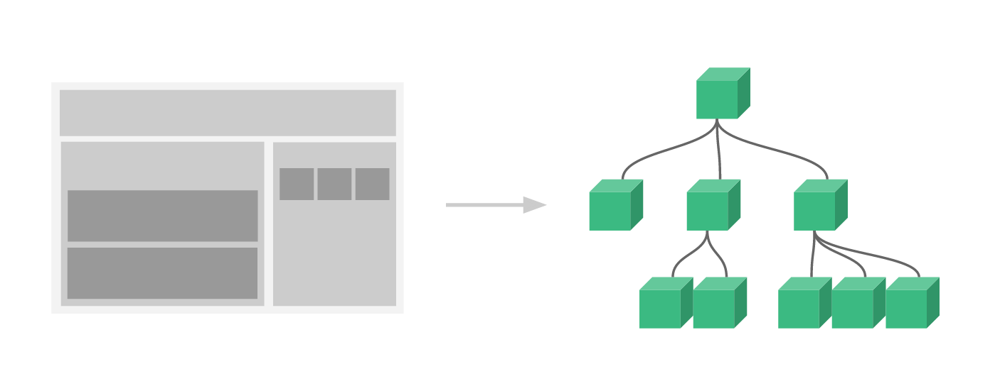

###### datetime:2019/11/27 16:40
###### author:nzb

## [Vue.js组件](https://cn.vuejs.org/v2/guide/components.html#data-%E5%BF%85%E9%A1%BB%E6%98%AF%E4%B8%80%E4%B8%AA%E5%87%BD%E6%95%B0)

### 基础

#### 基本示例

简单示例
    
```html
<div id="components-demo">
  <button-counter></button-counter>
</div>

<script >
// 定义一个名为 button-counter 的新组件
Vue.component('button-counter', {
  data: function () {
    return {
      count: 0
    }
  },
  template: '<button v-on:click="count++">You clicked me {{ count }} times.</button>'
})


new Vue({ el: '#components-demo' })
</script>
```

组件是可复用的 Vue 实例，且带有一个名字：在这个例子中是 `<button-counter>`。我们可以在一个通过 `new Vue` 创建的 Vue 根实例中，把这个组件作为自定义元素来使用：

因为组件是可复用的 Vue 实例，所以它们与 new Vue 接收相同的选项，例如 data、computed、watch、methods 以及生命周期钩子等。仅有的例外是像 el 这样根实例特有的选项。

#### 组件的复用

你可以将组件进行任意次数的复用：

```html
<div id="components-demo">
    <button-counter></button-counter>
    <button-counter></button-counter>
    <button-counter></button-counter>
</div>  
```
注意当点击按钮时，每个组件都会各自独立维护它的 count。因为你每用一次组件，就会有一个它的新实例被创建。

##### data必须是一个函数

当我们定义这个 `<button-counter>` 组件时，你可能会发现它的 data 并不是像这样直接提供一个对象：
```text
data: {
    count: 0
}   
```
取而代之的是，一个组件的 data 选项必须是一个函数，因此每个实例可以维护一份被返回对象的独立的拷贝：

```javascript
data: function f() {
  return {
      count: 0
  }
}
```

#### [组件的注册](https://cn.vuejs.org/v2/guide/components-registration.html)

通常一个应用会以一颗嵌套的组件树的形式来组织


例如，你可能会有页头、侧边栏、内容区等组件，每个组件又包含了其它的像导航链接、博文之类的组件。

为了能在模板中使用，这些组件必须先注册以便 Vue 能够识别。这里有两种组件的注册类型：全局注册和局部注册。

##### 组件名

在注册一个组件的时候，我们始终需要给它一个名字。比如在全局注册的时候我们已经看到了：

```javascript
Vue.component('my-component-name', { /* ... */ })
```
该组件名就是 Vue.component 的第一个参数。

你给予组件的名字可能依赖于你打算拿它来做什么。当直接在 DOM 中使用一个组件 (而不是在字符串模板或单文件组件) 的时候，我们强烈推荐遵循 W3C 规范中的自定义组件名 (字母全小写且必须包含一个连字符)。这会帮助你避免和当前以及未来的 HTML 元素相冲突。

你可以在风格指南中查阅到关于组件名的其它建议。

- 组件名大小写

    - 使用kebab-case
    
        ```javascript
        Vue.component('my-component-name', { /* ... */ })
        ```
        当使用 kebab-case (短横线分隔命名) 定义一个组件时，你也必须在引用这个自定义元素时使用 kebab-case，例如 `<my-component-name>`。

    - 使用 PascalCase
        
        ```javascript
        Vue.component('MyComponentName', { /* ... */ })
        ```
        当使用 PascalCase (首字母大写命名) 定义一个组件时，你在引用这个自定义元素时两种命名法都可以使用。也就是说 `<my-component-name>` 和 `<MyComponentName>` 都是可接受的。注意，尽管如此，直接在 DOM (即非字符串的模板) 中使用时只有 kebab-case 是有效的。

##### 全局注册

到目前为止，我们只用过 Vue.component 来创建组件：
```javascript
Vue.component('my-component-name', {
  // ... 选项 ...
})
```
这些组件是全局注册的。也就是说它们在注册之后可以用在任何新创建的 Vue 根实例 (new Vue) 的模板中。比如：

```html
<div id="app">
  <component-a></component-a>
  <component-b></component-b>
  <component-c></component-c>
</div>
<script >
Vue.component('component-a', { /* ... */ })
Vue.component('component-b', { /* ... */ })
Vue.component('component-c', { /* ... */ })

new Vue({ el: '#app' })
</script>

```
在所有子组件中也是如此，也就是说这三个组件在各自内部也都可以相互使用。

##### 局部注册

全局注册往往是不够理想的。比如，如果你使用一个像 webpack 这样的构建系统，全局注册所有的组件意味着即便你已经不再使用一个组件了，它仍然会被包含在你最终的构建结果中。这造成了用户下载的 JavaScript 的无谓的增加。

在这些情况下，你可以通过一个普通的 JavaScript 对象来定义组件：
```javascript
var ComponentA = { /* ... */ }
var ComponentB = { /* ... */ }
var ComponentC = { /* ... */ }
```
然后在 components 选项中定义你想要使用的组件：

```javascript
new Vue({
  el: '#app',
  components: {
    'component-a': ComponentA,
    'component-b': ComponentB
  }
})
```
对于 components 对象中的每个属性来说，其属性名就是自定义元素的名字，其属性值就是这个组件的选项对象。

注意**局部注册的组件在其子组件中不可用**。例如，如果你希望 ComponentA 在 ComponentB 中可用，则你需要这样写：
```javascript
var ComponentA = { /* ... */ }

var ComponentB = {
  components: {
    'component-a': ComponentA
  },
  // ...
}
```
或者如果你通过 Babel 和 webpack 使用 ES2015 模块，那么代码看起来更像：
```javascript
import ComponentA from './ComponentA.vue'

export default {
  components: {
    ComponentA
  },
  // ...
}
```
注意在 ES2015+ 中，在对象中放一个类似 ComponentA 的变量名其实是 ComponentA: ComponentA 的缩写，即这个变量名同时是：

- 用在模板中的自定义元素的名称
- 包含了这个组件选项的变量名

#### 通过 Prop 向子组件传递数据

早些时候，我们提到了创建一个博文组件的事情。问题是如果你不能向这个组件传递某一篇博文的标题或内容之类的我们想展示的数据的话，它是没有办法使用的。这也正是 prop 的由来。

Prop 是你可以在组件上注册的一些自定义特性。当一个值传递给一个 prop 特性的时候，它就变成了那个组件实例的一个属性。为了给博文组件传递一个标题，我们可以用一个 props 选项将其包含在该组件可接受的 prop 列表中：
```javascript
Vue.component('blog-post', {
  props: ['title'],
  template: '<h3>{{ title }}</h3>'
})
```
一个组件默认可以拥有任意数量的 prop，任何值都可以传递给任何 prop。在上述模板中，你会发现我们能够在组件实例中访问这个值，就像访问 data 中的值一样。

一个 prop 被注册之后，你就可以像这样把数据作为一个自定义特性传递进来：
```html
<blog-post title="My journey with Vue"></blog-post>
<blog-post title="Blogging with Vue"></blog-post>
<blog-post title="Why Vue is so fun"></blog-post>
```
然而在一个典型的应用中，你可能在 data 里有一个博文的数组：
```javascript
new Vue({
  el: '#blog-post-demo',
  data: {
    posts: [
      { id: 1, title: 'My journey with Vue' },
      { id: 2, title: 'Blogging with Vue' },
      { id: 3, title: 'Why Vue is so fun' }
    ]
  }
})
```
并想要为每篇博文渲染一个组件：
```html
<blog-post
  v-for="post in posts"
  v-bind:key="post.id"
  v-bind:title="post.title"
></blog-post>
```
如上所示，你会发现我们可以使用 `v-bind` 来动态传递 prop。这在你一开始不清楚要渲染的具体内容，比如[从一个 API 获取博文列表](https://jsfiddle.net/chrisvfritz/sbLgr0ad)的时候，是非常有用的。

到目前为止，关于 prop 你需要了解的大概就这些了，如果你阅读完本页内容并掌握了它的内容，我们会推荐你再回来把 [prop](https://cn.vuejs.org/v2/guide/components-props.html) 读完。
