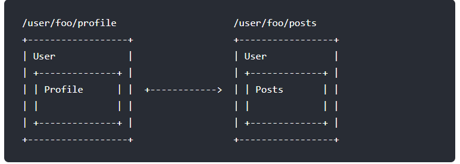

###### datetime:2019/12/3 14:13
###### author:nzb

## [Vue.js路由](https://router.vuejs.org/zh/)

### 什么是路由

**后端路由**：对于普通的网站，所有的超链接都是URL地址，所有的URL地址都对应服务器上对应的资源；

**前端路由**：对于单页面应用程序来说，主要通过URL中的hash(#号)来实现不同页面之间的切换，同时，hash有一个特点：HTTP请求中不会包含hash相关的内容；所以，单页面程序中的页面跳转主要用hash实现；

在单页面应用程序中，这种通过hash改变来切换页面的方式，称作前端路由（区别于后端路由）；

基本示例
```html
<!DOCTYPE html>
<html lang="en">
<head>
    <meta charset="UTF-8">
    <meta name="viewport" content="width=device-width, initial-scale=1.0">
    <meta http-equiv="X-UA-Compatible" content="ie=edge">
    <title>Document</title>
    <script src="./lib/vue.js"></script>
    <script src="./lib/vue-router.js"></script>
    <style>
        .router-link-active, .myactive{
            color: red;
            font-weight: 800;
            font-style: italic;
            font-size: 80px;
            text-decoration: underline;
            background-color: green;
        }
        .v-enter, 
        .v-leave-to{
            opacity: 0;
            transform: translateX(140px);
        }
        .v-enter-active,
        .v-leave-active{
            transition: all 0.5s  ease; 
        }
    </style>
</head>
<body>
    <div id="app">
        <a href="#/login">登陆</a>    <!--注意要加#号-->
        
        <a href="#/register">注册</a>
        <br><br>
        <!--router-link默认渲染为一个a标签 可以用tag修改-->
        <router-link to="/login" tag="span">登陆</router-link>
        <router-link to="/register">注册</router-link>
        <!--在这是vue-router提供的元素，专门用来当作占位符-->
        <transition mode="out-in">
            <router-view> 

            </router-view>
        </transition>
    </div>
    <script>
        var login = {
            template:  '<h1>login</h1>'
        }
        var register = {
            template: '<h1>注册</h1>'
        }
        /*
            1 创建一个路由对象， 当导入vue-router之后，在windows 全局对象中，就有了一个路由的构造函数叫做VueRouter 
            在new路由对象的时候，可以为构造函数传递一个配置对象
        */
        var routerObj = new VueRouter({
            
            routes:[   //路由匹配规则  
            /*
                每个路由规则都是一个对象，这个规则的对象必须有两个必须的属性
                属性1：path 表示监听哪个路由链接地址
                属性2：component，表示如果路由是前面匹配到的path，则展示component属性对应的组件
            */
            //注意：component的属性值必须是一个组件的模板对象 不能是组件的引用名称
            
            //{ path: '/', component: login},
            { path:'/', redirect: '/login'},
            { path: '/login', component: login},
            { path: '/register', component: register}   ],
            linkActiveClass: 'myactive'        
        })
        var vm = new Vue({
            el: '#app',
            data: {
            },
            methods: {
                
            },
            //将路由规则对象， 注册到vm实例上，用来舰艇URL地址的变化，然后展示对应的组件
            
            router: routerObj 
        })
    </script>
</body>
</html>
```

### 重定向和别名
- 重定向
```javascript
// 重定向也是通过 `routes` 配置来完成，下面例子是从 `/a` 重定向到 `/b`：
const router = new VueRouter({
  routes: [
    { path: '/a', redirect: '/b' }
  ]
})
//重定向的目标也可以是一个命名的路由：
const router = new VueRouter({
  routes: [
    { path: '/a', redirect: { name: 'foo' }}
  ]
})
// 甚至是一个方法，动态返回重定向目标：
const router = new VueRouter({
  routes: [
    { path: '/a', redirect: to => {
      // 方法接收 目标路由 作为参数
      // return 重定向的 字符串路径/路径对象
    }}
  ]
})
```
注意[导航守卫](https://router.vuejs.org/zh/guide/advanced/navigation-guards.html)并没有应用在跳转路由上，而仅仅应用在其目标上。在下面这个例子中，为 `/a` 路由添加一个 `beforeEach` 或 `beforeLeave` 守卫并不会有任何效果。

其它高级用法，请参考[例子](https://github.com/vuejs/vue-router/blob/dev/examples/redirect/app.js)。

- 别名

    “重定向”的意思是，当用户访问 `/a`时，URL 将会被替换成 `/b`，然后匹配路由为 `/b`，那么“别名”又是什么呢？
    
    `/a` 的别名是 `/b`，意味着，当用户访问 `/b` 时，URL 会保持为 `/b`，但是路由匹配则为 `/a`，就像用户访问 `/a` 一样。
    
    上面对应的路由配置为：
    ```javascript
    const router = new VueRouter({
      routes: [
        { path: '/a', component: A, alias: '/b' }
      ]
    })
    ```
“别名”的功能让你可以自由地将 UI 结构映射到任意的 URL，而不是受限于配置的嵌套路由结构。更多高级用法，请查看[例子](https://github.com/vuejs/vue-router/blob/dev/examples/route-alias/app.js)。

- [高亮，过渡动画，重定向示例](../../code/JavaScript/vue-路由基本使用.html)

### [在路由规则中定义参数](../../code/JavaScript/vue-路由传参.html)

- 在规则中定义参数：
```javascript
{ path: '/register/:id', component: register }
```
- 通过 this.$route.params来获取路由中的参数：
```javascript
var register = Vue.extend({
      template: '<h1>注册组件 --- {{this.$route.params.id}}</h1>'
    });

```

### [路由嵌套](https://router.vuejs.org/zh/guide/essentials/nested-routes.html#%E5%B5%8C%E5%A5%97%E8%B7%AF%E7%94%B1)

实际生活中的应用界面，通常由多层嵌套的组件组合而成。同样地，URL 中各段动态路径也按某种结构对应嵌套的各层组件，例如：


借助 `vue-router`，使用嵌套路由配置，就可以很简单地表达这种关系。

接着上节创建的 app：
```html
<div id="app">
  <router-view></router-view>
</div>
<script >

</script>
<div id="app">
  <router-view></router-view>
</div>
```
这里的 <router-view> 是最顶层的出口，渲染最高级路由匹配到的组件。同样地，一个被渲染组件同样可以包含自己的嵌套 `<router-view>`。例如，在 User 组件的模板添加一个 `<router-view>`：
```javascript
const User = {
  template: `
    <div class="user">
      <h2>User {{ $route.params.id }}</h2>
      <router-view></router-view>
    </div>
  `
}
```
要在嵌套的出口中渲染组件，需要在 `VueRouter` 的参数中使用 `children` 配置：
```javascript
const router = new VueRouter({
  routes: [
    { path: '/user/:id', component: User,
      children: [
        {
          // 当 /user/:id/profile 匹配成功，
          // UserProfile 会被渲染在 User 的 <router-view> 中
          path: 'profile',
          component: UserProfile
        },
        {
          // 当 /user/:id/posts 匹配成功
          // UserPosts 会被渲染在 User 的 <router-view> 中
          path: 'posts',
          component: UserPosts
        }
      ]
    }
  ]
})
```
**要注意，以 `/` 开头的嵌套路径会被当作根路径。 这让你充分的使用嵌套组件而无须设置嵌套的路径。**

你会发现，`children` 配置就是像 `routes` 配置一样的路由配置数组，所以呢，你可以嵌套多层路由。

此时，基于上面的配置，当你访问 `/user/foo` 时，`User` 的出口是不会渲染任何东西，这是因为没有匹配到合适的子路由。如果你想要渲染点什么，可以提供一个 空的 子路由：
```javascript
const router = new VueRouter({
  routes: [
    {
      path: '/user/:id', component: User,
      children: [
        // 当 /user/:id 匹配成功，
        // UserHome 会被渲染在 User 的 <router-view> 中
        { path: '', component: UserHome },

        // ...其他子路由
      ]
    }
  ]
})
```

### [命名视图](https://router.vuejs.org/zh/guide/essentials/named-views.html#%E5%91%BD%E5%90%8D%E8%A7%86%E5%9B%BE)
[示例实现经典布局](../../code/JavaScript/vue-命名视图实现经典布局.html)

### 名称拼接案例

- [案例1：使用keyup](../../code/JavaScript/vue-名称案例1-使用keyup实现.html)
- [案例2：使用watch监听](../../code/JavaScript/vue-名称案例2-使用watch监听文本框的数据变化.html)
    - [使用watch监听路由变化](../../code/JavaScript/vue-watch监听路由改变.html)
- [案例3：computed计算属性](../../code/JavaScript/vue-名称案例3-computed计算属性的使用.html)

- `watch`、`computed`和`methods`之间的对比
    - `computed`属性的结果会被缓存，除非依赖的响应式属性变化才会重新计算。主要当作属性来使用；
    - `methods`方法表示一个具体的操作，主要书写业务逻辑；
    - `watch`一个对象，键是需要观察的表达式，值是对应回调函数。主要用来监听某些特定数据的变化，从而进行某些具体的业务逻辑操作；可以看作是`computed`和`methods`的结合体；
