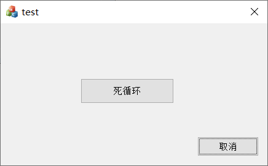
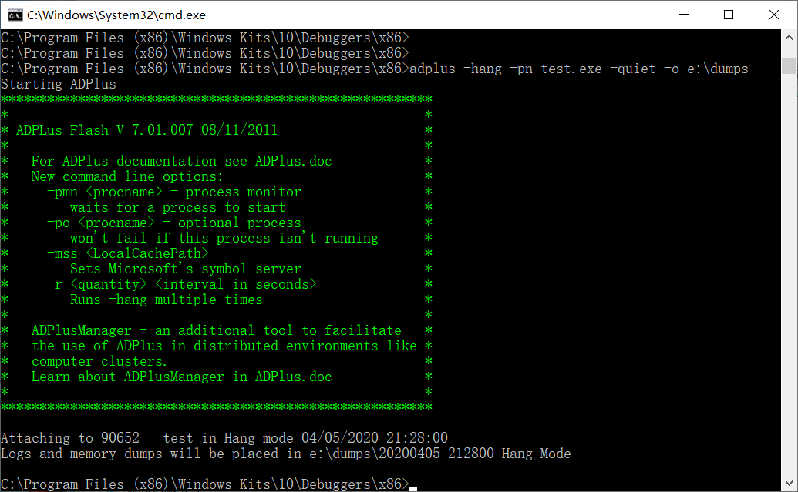
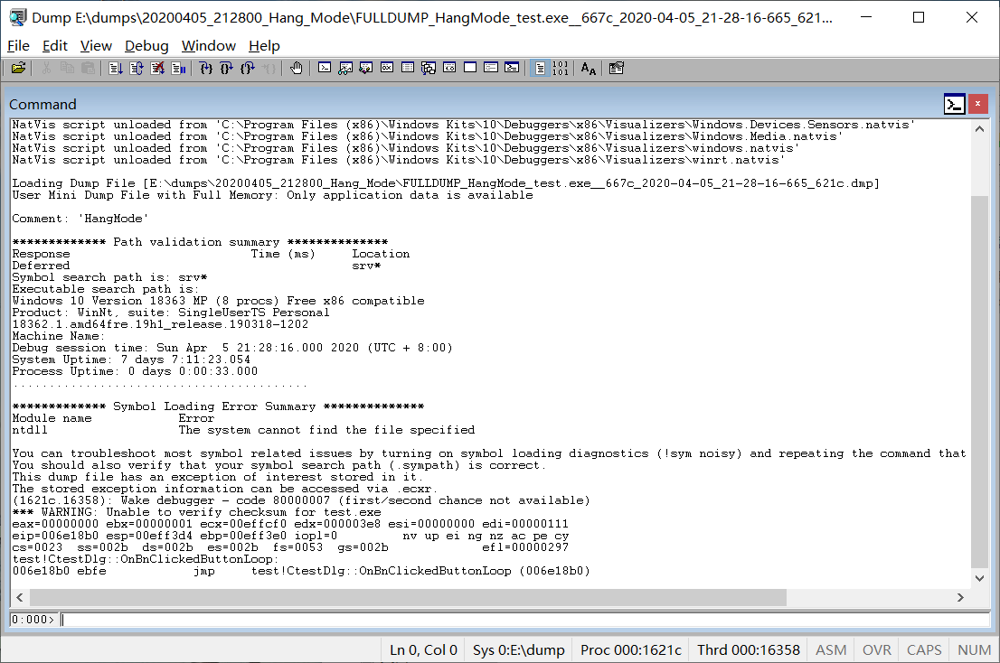
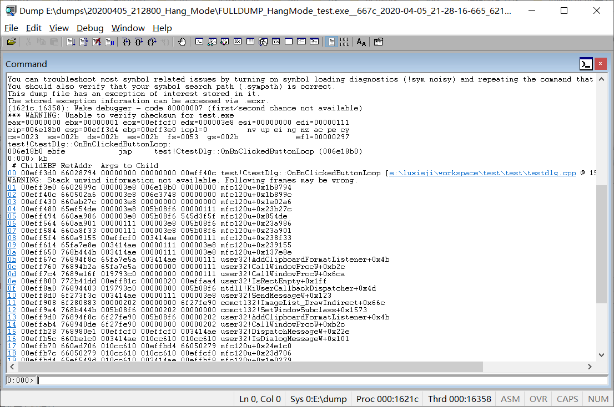

###### datetime:2024/09/27 15:49

###### author:nzb

# Windows程序卡顿、无响应问题定位

当`windows`程序出现异常、界面卡顿、无响应情况时，在有工程和源码的情况下，程序员通常是打开`IDE`，在`DEBUG`模式下进行调试。但如果是一个`RELEASE`程序，且无调试环境，该如何来定位呢。

这里介绍一下通过`adplus`导出`dump`文件，用`windbg`来查看的方法。

## windbg

在这之前，先大概了解一下`windbg`。简单来说`windbg`就是`Windows`下对用户态/内核态的程序进行调试、分析的工具。不仅提供了图形界面操作，还有着着强大的调试命令。

`adplus`是一个`Microsoft Product Support Services (PSS) `的工具，可以用来排查任何进程或者应用程序的停止响应(`hang`)，或者崩溃(`crash`)的错误。

`windbg`和`adplus` 都随 `Microsoft Debugging Tools for Windows` 一起提供。

[下载地址](https://developer.microsoft.com/zh-cn/windows/downloads/windows-10-sdk/)

安装的时候可以选择需要的功能，不用全都装，不然会比较大。

## 一个例子

下面通过一个例子来看一下吧。

先模拟一个有问题的界面程序。这里用`VC`创建一个`MFC`对话框程序，添加了一按钮，点击按钮会进入死循环。　



```vc
void CtestDlg::OnBnClickedButtonLoop()
{
    while (true) {}
}
```

### 获取dmp文件

点击“死循环”按钮，程序出现无响应的情况。  
这个时候需要用到`adplus`了。如果`winsdk`正常安装的话，`windbg` 和 `adplus` 会存放在`C:\Program Files (x86)\Windows Kits\10\Debuggers\x86`路径下。
- `adplus` 具有两种操作模式：
  - `Hang`模式用于解决进程挂起、100% CPU 使用率以及不涉及崩溃的其他问题。
  - `Crash`模式用于解决崩溃问题，或者用于解决导致程序或服务意外退出的任何其他类型的错误。
`adplus`的具体使用就不做介绍了，这里仅用到 `Hang` 模式，用来抓取程序的快照，导出`dump`文件。

- 获取方式1

```text
adplus -hang -pn test.exe -quiet -o e:\dumps
```

在控制台执行上述命令，执行成功的话会有类似如下打印，并在`e:\dumps`目录下生成`dump`文件。



- 获取方式2
  - 打开任务管理器
- 找到对应进程，右键选择“创建转储文件”

### 分析文件

接下来，`cmd`打开`windbg`，点击“File”->“Open Crash Dump...”，选择刚才导出的dump文件。

 
 
然后在windbg下方的命令行输入kb，windbg会打印出当前进程的调用栈。

 

一般来说，通过查看进程的调用栈，就能大概知道程序出错的地方了。

如果无法显示符号名称，请点击“File”->“Symbol File Path...”来设置pdb文件的路径。

- windbg的其它命令：
  - `~`：简洁地显示当前进程的所有线程，
  - `~*`：表示所有线程
  - `~0kp`：显示第一个线程栈
  - `~*kp`：显示所有线程栈

## 例子2：OrcaAR 无响应，发现是ROS2的dds问题，可以发给GPT分析问题

```text
************* Preparing the environment for Debugger Extensions Gallery repositories **************
   ExtensionRepository : Implicit
   UseExperimentalFeatureForNugetShare : true
   AllowNugetExeUpdate : true
   NonInteractiveNuget : true
   AllowNugetMSCredentialProviderInstall : true
   AllowParallelInitializationOfLocalRepositories : true

   EnableRedirectToV8JsProvider : false

   -- Configuring repositories
      ----> Repository : LocalInstalled, Enabled: true
      ----> Repository : UserExtensions, Enabled: true

>>>>>>>>>>>>> Preparing the environment for Debugger Extensions Gallery repositories completed, duration 0.031 seconds

************* Waiting for Debugger Extensions Gallery to Initialize **************

>>>>>>>>>>>>> Waiting for Debugger Extensions Gallery to Initialize completed, duration 0.015 seconds
   ----> Repository : UserExtensions, Enabled: true, Packages count: 0
   ----> Repository : LocalInstalled, Enabled: true, Packages count: 29

Microsoft (R) Windows Debugger Version 10.0.26100.1742 X86
Copyright (c) Microsoft Corporation. All rights reserved.


Loading Dump File [C:\Users\Intel\AppData\Local\Temp\OrcaAR.DMP]
User Mini Dump File with Full Memory: Only application data is available

Symbol search path is: srv*
Executable search path is: 
Windows 10 Version 19045 MP (16 procs) Free x64
Product: WinNt, suite: SingleUserTS
Edition build lab: 19041.1.amd64fre.vb_release.191206-1406
Debug session time: Fri Sep 27 14:35:49.000 2024 (UTC + 8:00)
System Uptime: 0 days 2:29:14.857
Process Uptime: 0 days 0:00:29.000
................................................................
............................................................
Loading unloaded module list
....
For analysis of this file, run !analyze -v
ntdll!NtDelayExecution+0x14:
00007fff`5d0adbe4 c3              ret
0:000> 
0:000> 
0:000> 
0:000> !analyze -v
*******************************************************************************
*                                                                             *
*                        Exception Analysis                                   *
*                                                                             *
*******************************************************************************

*** WARNING: Unable to verify checksum for fastrtps-2.6.dll
*** WARNING: Unable to verify checksum for rmw_fastrtps_shared_cpp.dll
*** WARNING: Unable to verify checksum for rmw_fastrtps_cpp.dll
*** WARNING: Unable to verify checksum for rcl.dll
*** WARNING: Unable to verify checksum for GameAssembly.dll
*** WARNING: Unable to verify checksum for OrcaAR.exe

KEY_VALUES_STRING: 1

    Key  : Analysis.CPU.mSec
    Value: 5921

    Key  : Analysis.Elapsed.mSec
    Value: 75648

    Key  : Analysis.IO.Other.Mb
    Value: 13

    Key  : Analysis.IO.Read.Mb
    Value: 143

    Key  : Analysis.IO.Write.Mb
    Value: 268

    Key  : Analysis.Init.CPU.mSec
    Value: 3984

    Key  : Analysis.Init.Elapsed.mSec
    Value: 54109

    Key  : Analysis.Memory.CommitPeak.Mb
    Value: 179

    Key  : Failure.Bucket
    Value: BREAKPOINT_80000003_fastrtps-2.6.dll!Unknown

    Key  : Failure.Hash
    Value: {4679187c-69b1-73ea-b190-e9d20e7a3a92}

    Key  : Timeline.OS.Boot.DeltaSec
    Value: 8954

    Key  : Timeline.Process.Start.DeltaSec
    Value: 29

    Key  : WER.OS.Branch
    Value: vb_release

    Key  : WER.OS.Version
    Value: 10.0.19041.1

    Key  : WER.Process.Version
    Value: 2020.3.48.64479


FILE_IN_CAB:  OrcaAR.DMP

NTGLOBALFLAG:  0

APPLICATION_VERIFIER_FLAGS:  0

EXCEPTION_RECORD:  (.exr -1)
ExceptionAddress: 0000000000000000
   ExceptionCode: 80000003 (Break instruction exception)
  ExceptionFlags: 00000000
NumberParameters: 0

FAULTING_THREAD:  00003c64

PROCESS_NAME:  OrcaAR.exe

ERROR_CODE: (NTSTATUS) 0x80000003 - {    }

EXCEPTION_CODE_STR:  80000003


# 从下往上为调用栈，最后都发生在qos中

STACK_TEXT:  
0000008c`29ce9d78 00007fff`5abd5b8e     : 0000008c`29ce9e38 00000000`00000000 00007ffe`e2996581 00007fff`5abe7fac : ntdll!NtDelayExecution+0x14
0000008c`29ce9d80 00007ffe`e29a9ded     : 00000000`00000000 00000000`00000000 00000014`c00000bb 00000000`00000000 : KERNELBASE!SleepEx+0x9e
0000008c`29ce9e20 00007ffe`e29bdc57     : 0000008c`29ceaca0 00000240`f04df358 00000240`f01916a0 00007ffe`e2df5597 : fastrtps_2_6!eprosima::fastdds::dds::LatencyBudgetQosPolicy::LatencyBudgetQosPolicy+0x167872
0000008c`29cea1b0 00007ffe`e2c78f0b     : 00000240`f01916a0 00000240`f01916a0 00000240`f04df358 00000000`00000000 : fastrtps_2_6!eprosima::fastdds::dds::LatencyBudgetQosPolicy::LatencyBudgetQosPolicy+0x17b6dc
0000008c`29cea240 00007ffe`e2c8329f     : 00000240`f04df358 00007fff`5aa8fde6 00000000`00000000 00000000`00000088 : fastrtps_2_6!eprosima::fastdds::dds::LatencyBudgetQosPolicy::LatencyBudgetQosPolicy+0x436990
0000008c`29ceaf90 00007ffe`e2c7fc63     : 00000000`00000000 00000240`f0a1f210 00000000`00000000 00000240`effe79b0 : fastrtps_2_6!eprosima::fastdds::dds::LatencyBudgetQosPolicy::LatencyBudgetQosPolicy+0x440d24
0000008c`29ceb000 00007ffe`e2c7fff3     : 00000240`f086e820 00000240`f086e7b0 00000240`f086e7b0 00000240`f04df358 : fastrtps_2_6!eprosima::fastdds::dds::LatencyBudgetQosPolicy::LatencyBudgetQosPolicy+0x43d6e8
0000008c`29ceb0c0 00007ffe`e29e7a05     : 0000008c`29ceb2b8 00000000`ffffffff 00000240`f04df358 00000240`f0a9cac0 : fastrtps_2_6!eprosima::fastdds::dds::LatencyBudgetQosPolicy::LatencyBudgetQosPolicy+0x43da78
0000008c`29ceb120 00007ffe`e29e5a32     : 00000240`f086e820 00000000`00000001 0000008c`29ceb2b8 00000240`f0a9c9e0 : fastrtps_2_6!eprosima::fastdds::dds::LatencyBudgetQosPolicy::LatencyBudgetQosPolicy+0x1a548a
0000008c`29ceb200 00007ffe`e29f69fd     : 00000240`f086dbb0 00000000`00000001 00000240`f0a133e0 00000000`ffffffff : fastrtps_2_6!eprosima::fastdds::dds::LatencyBudgetQosPolicy::LatencyBudgetQosPolicy+0x1a34b7
0000008c`29ceb270 00007ffe`e29f2862     : 00000000`00000001 00000240`f0a12ea8 00000000`00000001 00000000`00000000 : fastrtps_2_6!eprosima::fastdds::dds::LatencyBudgetQosPolicy::LatencyBudgetQosPolicy+0x1b4482
0000008c`29ceb310 00007ffe`e29f34ee     : 0000008c`00000000 00000240`f0a12dc0 00000000`00000000 00007ffe`e2df5597 : fastrtps_2_6!eprosima::fastdds::dds::LatencyBudgetQosPolicy::LatencyBudgetQosPolicy+0x1b02e7
0000008c`29ceb970 00007ffe`e2a00d76     : 00007ffe`e31e9fd0 00000000`00000001 00000000`00000000 00007ffe`e2fe8708 : fastrtps_2_6!eprosima::fastdds::dds::LatencyBudgetQosPolicy::LatencyBudgetQosPolicy+0x1b0f73
0000008c`29ceb9c0 00007ffe`e2a5fa55     : 0000008c`29cec190 00000000`00000000 0000008c`29cec100 00000000`00000000 : fastrtps_2_6!eprosima::fastdds::dds::LatencyBudgetQosPolicy::LatencyBudgetQosPolicy+0x1be7fb
0000008c`29cec000 00007ffe`e2de5acd     : 00007ffe`e31eaf38 00000240`f097c830 0000008c`29cec660 00000000`00000000 : fastrtps_2_6!eprosima::fastdds::dds::LatencyBudgetQosPolicy::LatencyBudgetQosPolicy+0x21d4da
0000008c`29cec560 00007ffe`e2a4c522     : 00000240`5440cdc8 00007ffe`e31eaf48 0000008c`29cec660 00000240`546ed910 : fastrtps_2_6!eprosima::fastdds::dds::LatencyBudgetQosPolicy::LatencyBudgetQosPolicy+0x5a3552
0000008c`29cec590 00007fff`3b9674ed     : 00000240`f097c830 00000240`53f90840 00007ffe`e31eaf48 00000000`00000020 : fastrtps_2_6!eprosima::fastdds::dds::LatencyBudgetQosPolicy::LatencyBudgetQosPolicy+0x209fa7
0000008c`29cec660 00007fff`3b969000     : 00007fff`50a23d5c 00000000`00000008 00007fff`3b9d5300 00000240`546dd940 : rmw_fastrtps_shared_cpp!rmw_fastrtps_shared_cpp::__rmw_get_topic_names_and_types+0x35638
0000008c`29cec8a0 00007fff`40538a04     : 00000240`f0237ab0 00000240`f0237ae0 00000000`00000000 00000240`f0237b00 : rmw_fastrtps_shared_cpp!rmw_fastrtps_shared_cpp::__rmw_get_topic_names_and_types+0x3714b
0000008c`29cee160 00007fff`405387e4     : 00007fff`5205dfd0 00000240`f077ee70 00000240`547276c0 00000240`eff54190 : rmw_fastrtps_cpp!rmw_subscription_get_actual_qos+0x16eba
0000008c`29cee410 00007fff`40545cfe     : 00000240`f077ee70 00000240`eff54190 00000240`547276c0 00007fff`50a11950 : rmw_fastrtps_cpp!rmw_subscription_get_actual_qos+0x16c9a
0000008c`29cee440 00007fff`52045465     : ffffffff`ffffffff 00000240`cfea6db0 ffffffff`ffffffff 00000240`546ed900 : rmw_fastrtps_cpp!rmw_subscription_get_actual_qos+0x241b4
0000008c`29cee490 00007fff`3a10bb58     : 00000000`00000000 00007fff`3a1e61c9 00000000`00000001 00000000`000003e8 : rcl!rcl_log_levels_init+0x13d1c
0000008c`29ceed80 00007fff`3ab9ba2b     : 00000240`f08673c0 00000240`f047aee0 00007fff`3a10bb00 00000240`cfe9be00 : GameAssembly!DelegatePInvokeWrapper_NodeInitType_t17E72E2DE9D5ACD01A81227C25C1A25664568B5E+0x58
0000008c`29ceedc0 00007fff`3aba223e     : 00000240`cfe9be00 00000240`cfeaff50 00000240`cfe5bf68 00000240`54d5c690 : GameAssembly!PublisherInitType_Invoke_mFD1E9FFCD4BEEC63467823B61A4C2B54F28984F6+0x30b
0000008c`29ceee50 00007fff`3aba3b97     : 00000240`cfea6d90 00000000`00000000 00000240`54d5c690 00000000`00000000 : GameAssembly!Node__ctor_mB30B350E6497EB7EC1A35B1BB52A1D95393F2F05+0x28e
0000008c`29ceeeb0 00007fff`3ac39da3     : 00000240`54d5c690 00000240`54d5c690 0000023f`eb7aa301 00007fff`3b004480 : GameAssembly!Ros2cs_CreateNode_m5131DD898BFAC816F3423AC71921BEB0E297BD57+0x327
0000008c`29ceef40 00007fff`3ac3b9ff     : 00000240`cfeaced0 00000240`cfe56fa0 0000023f`ec091e40 00007fff`3a8027ff : GameAssembly!ROS2Node__ctor_mC1D8CB50907D0F2A144E5C99040BA58C38C0EFF2+0x73
0000008c`29ceef70 00007fff`3ac362ec     : 00000240`cfe56fa0 00000240`54d5c690 0000023f`ec07ad01 00000240`54786c01 : GameAssembly!ROS2UnityCore_CreateNode_mFA607360855BF0B323FA04AF9C5C799AC3B7F5C7+0x17f
0000008c`29cef020 00007fff`3a0808ac     : 0000023f`ec07ad10 00000240`2d6a4480 00000240`2d6937b0 00000000`00000000 : GameAssembly!MultiImgPlaneSubV2_Update_mBECC3AE334BF7CC545D9FD29038707202087A775+0x13c
0000008c`29cef0a0 00007fff`3a1ac940     : 00000000`00000000 00000000`00000000 00000000`00000000 0000008c`29cef220 : GameAssembly!RuntimeInvoker_TrueVoid_t700C6383A2A510C2CF4DD86DABD5CA9FF70ADAC5+0xc
0000008c`29cef0d0 00007ffe`b109a738     : 00000240`2d6a4480 0000008c`29cef210 00000000`00000000 0000008c`29cef200 : GameAssembly!il2cpp::vm::Runtime::Invoke+0x80
0000008c`29cef130 00007ffe`b109d7b2     : 0000008c`29cef350 00000000`00000000 0000008c`29cef200 0000008c`29cef210 : UnityPlayer!UnityMain+0x38c348
0000008c`29cef180 00007ffe`b10ba5e3     : 0000023f`ec07ad10 00000240`60235540 00000000`00000000 00000240`2d6a4480 : UnityPlayer!UnityMain+0x38f3c2
0000008c`29cef1e0 00007ffe`b10ba6c6     : 0000023f`ec07ad10 00000000`00000000 00000014`cbb3a848 00000000`00000000 : UnityPlayer!UnityMain+0x3ac1f3
0000008c`29cef350 00007ffe`b0e0fd10     : 0000023f`ec07ad10 0000023f`3011f610 0000023f`ec07ad10 00000000`00000101 : UnityPlayer!UnityMain+0x3ac2d6
0000008c`29cef380 00007ffe`b0f49aba     : 00000000`00000000 00000240`2d260220 0000023f`90a48ad8 00000000`00000000 : UnityPlayer!UnityMain+0x101920
0000008c`29cef3f0 00007ffe`b0f49b60     : 00000000`00000000 00000000`00000000 00000240`2d260220 00000000`00000000 : UnityPlayer!UnityMain+0x23b6ca
0000008c`29cef590 00007ffe`b0f4de08     : 00000000`00000d48 00000000`00000000 00000000`00000d48 00000000`00000000 : UnityPlayer!UnityMain+0x23b770
0000008c`29cef730 00007ffe`b0d08dda     : 00000000`00000000 00000000`00000d48 00000000`00000000 00000000`00000000 : UnityPlayer!UnityMain+0x23fa18
0000008c`29cef7b0 00007ffe`b0d071fb     : 00000000`00000d48 00000000`00000000 00000000`00000001 00000000`00000000 : UnityPlayer+0x508dda
0000008c`29cef7e0 00007ffe`b0d0c722     : 00000000`00000001 ffffffff`ffffffff 00000000`0000000b 00007ffe`b1ec7bf8 : UnityPlayer+0x5071fb
0000008c`29cef850 00007ffe`b0d0e3fb     : 00000000`00000001 00000000`00000000 0000023e`c9722b60 00007ff7`00000001 : UnityPlayer+0x50c722
0000008c`29cffaf0 00007ff7`9de511f2     : 00000000`00000000 00000000`00000000 00000000`00000000 00000000`00000000 : UnityPlayer!UnityMain+0xb
0000008c`29cffb20 00007fff`5cda7374     : 00000000`00000000 00000000`00000000 00000000`00000000 00000000`00000000 : OrcaAR+0x11f2
0000008c`29cffb60 00007fff`5d05cc91     : 00000000`00000000 00000000`00000000 00000000`00000000 00000000`00000000 : kernel32!BaseThreadInitThunk+0x14
0000008c`29cffb90 00000000`00000000     : 00000000`00000000 00000000`00000000 00000000`00000000 00000000`00000000 : ntdll!RtlUserThreadStart+0x21


STACK_COMMAND:  ~0s; .ecxr ; kb

SYMBOL_NAME:  fastrtps_2_6+167872

MODULE_NAME: fastrtps_2_6

IMAGE_NAME:  fastrtps-2.6.dll

FAILURE_BUCKET_ID:  BREAKPOINT_80000003_fastrtps-2.6.dll!Unknown

OS_VERSION:  10.0.19041.1

BUILDLAB_STR:  vb_release

OSPLATFORM_TYPE:  x64

OSNAME:  Windows 10

IMAGE_VERSION:  2.6.4.0

FAILURE_ID_HASH:  {4679187c-69b1-73ea-b190-e9d20e7a3a92}

Followup:     MachineOwner
---------

0:000> 
ExceptionAddress: 0000000000000000
   ExceptionCode: 80000003 (Break instruction exception)
  ExceptionFlags: 00000000
NumberParameters: 0
```

### 问题解决
  - windows 本机发送topic，本机接收不了，也阻塞，但是跨平台(Linux接收)可以，原因未知
  - 解决方法：windows创建新用户，跑ros2 demo，可以正常发布接收

## 无响应端口查看对应什么程序导致

- 打开任务管理器，右键对应无响应的应用 -> 转到详细信息 -> 右键分析等待链 -> 示例：OrcaAR.exe的一个或多个线程正在等待完成网络I/O
- `netstat -ab`查看应用的网络连接情况，有个`TIME_WAIT`状态，获取对方的端口，比如`8080`
- `netstat -ano | findstr 8080`，找到`pid`
- `tasklist | findstr pid`找到进程名或在任务管理器中找到对应进程，看是什么程序导致的。