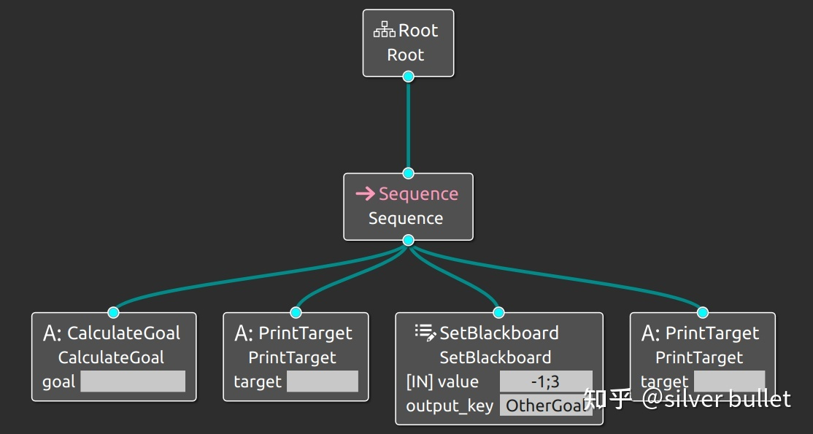
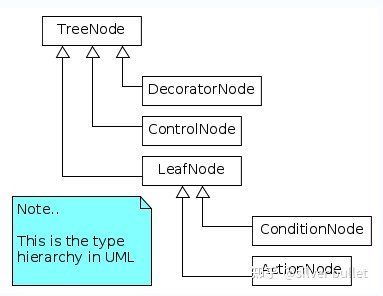

###### datetime:2023/05/11 15:12

###### author:nzb

# BT2：行为树的基本知识点

## xml文件

行为树按照xml文件格式来设计、书写和保存，如`BehaviorTree.CPP/examples/t03_generic_ports.cpp`中这样定义了一棵行为树：

```xml
<root main_tree_to_execute = "MainTree" >
     <BehaviorTree ID="MainTree">
         <Sequence name="root">
             <CalculateGoal   goal="{GoalPosition}" />
             <PrintTarget     target="{GoalPosition}" />
             <SetBlackboard   output_key="OtherGoal" value="-1;3" />
             <PrintTarget     target="{OtherGoal}" />
         </Sequence>
     </BehaviorTree>
</root> 
```

图形化后如下图，表示依次执行4个`action node`。



而定义行为树的`xml`文件使用`createTreeFromText()`或`createTreeFromFile()`加载进来。函数定义在`BehaviorTree.CPP/include/behaviortree_cpp_v3/bt_factory.h`，声明如下。这时会调用树中各`nodes`的构造函数。

```cpp
Tree createTreeFromText(const std::string& text,
                        Blackboard::Ptr blackboard = Blackboard::create());

Tree createTreeFromFile(const std::string& file_path,
                        Blackboard::Ptr blackboard = Blackboard::create());
```

使用方法如下：

```cpp
BehaviorTreeFactory factory;
auto tree = factory.createTreeFromText(xml_text);
tree.tickRoot();
```

## tick()

类似于数据结构中“tree”的概念，行为树是控制任务执行流程的分层节点树。一个称为“ tick ”的信号，由开发者发送到树的根部并在树的节点中传播，
直到它到达树的底部——叶节点。接收到tick信号的节点会执行它的回调，即被设定的该节点的任务，然后向上返回执行的结果。在大多数开源库中，
该结果有且只有3种：成功完成SUCCESS，执行失败FAILURE，正在执行RUNNING。

## 节点种类



行为树主要有4种节点，其中的`ControlNode`和`DecoratorNode`常由库实现，而`ConditionNode`和`ActionNode`需开发者自行实现，即定义何种情况执行何种行为。

- `ControlNode`：控制节点，有至少1个子节点，负责控制执行流程；可以细分成非常多的种类。
- `DecoratorNode`：装饰节点，有且仅有1个子节点，负责重复执行子节点，或更改子节点的返回结果。
- `ConditionNode`：条件节点，没有子节点，需要由开发者实现，不可以返回`RUNNING`，必须`atomic and synchronous`，负责任务执行的判断条件，不应该改变系统的状态。
- `ActionNode`：动作节点，没有子节点，需要由开发者实现，负责执行具体任务。有同步和异步之分。


