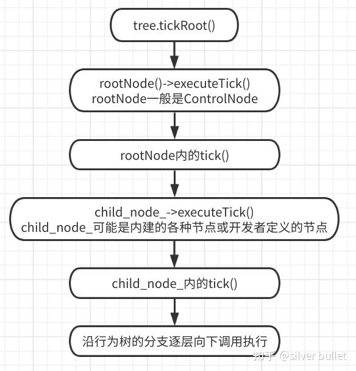

###### datetime:2023/05/11 15:12

###### author:nzb

# BT3：库中基本类型Tree和TreeNode

本文重点讲述`BehaviorTree.CPP`中的几个重要的基本的类定义，尤其是类所包含的数据。

## Tree

定义在`BehaviorTree.CPP/include/behaviortree_cpp_v3/bt_factory.h`。有3个重要的`public`成员变量。

```cpp
public:
    // 保存树的所有node
    std::vector<TreeNode::Ptr> nodes;
    // 保存所有blackboard
    std::vector<Blackboard::Ptr> blackboard_stack;
    // 保存所有node注册信息
    std::unordered_map<std::string, TreeNodeManifest> manifests;
```

以`BehaviorTree.CPP/examples/t06_subtree_port_remapping.cpp`中的行为树为例，打印出以上3个容器的元素数量。

```cpp
<root main_tree_to_execute = "MainTree">

    <BehaviorTree ID="MainTree">
        <Sequence name="main_sequence">
            <SetBlackboard output_key="move_goal" value="1;2;3" />
            <SubTree ID="MoveRobot" target="move_goal" output="move_result" />
            <SaySomething message="{move_result}"/>
        </Sequence>
    </BehaviorTree>

    <BehaviorTree ID="MoveRobot">
        <Fallback name="move_robot_main">
            <SequenceStar>
                <MoveBase       goal="{target}"/>
                <SetBlackboard output_key="output" value="mission accomplished" />
            </SequenceStar>
            <ForceFailure>
                <SetBlackboard output_key="output" value="mission failed" />
            </ForceFailure>
        </Fallback>
    </BehaviorTree>

</root>
```

共有10个节点，2个`blackboard`（因为有2棵树），31个注册节点信息（可以理解为该`tree`认识31个节点，却只创建和包含了10个节点） 。

```text
tree nodes count = 10
tree blackboard_stack count = 2
tree manifests count = 31
```

将节点的名称和注册节点信息的名称打印如下，可见一棵子树也会作为一个节点对待。而31个manifests中，就包含了`BehaviorTree.CPP`库提供的所有`ControlNodes`和`DecoratorNodes`，
以及示例用的`SaySomething`和`MoveBase`。

```text
tree root node = main_sequence

nodes[1] = main_sequence
nodes[2] = SetBlackboard
nodes[3] = MoveRobot
nodes[4] = move_robot_main
nodes[5] = SequenceStar
nodes[6] = MoveBase
nodes[7] = SetBlackboard
nodes[8] = ForceFailure
nodes[9] = SetBlackboard
nodes[10] = SaySomething
```

```text
manifests[1] = SaySomething
manifests[2] = Switch4
manifests[3] = Switch6
manifests[4] = BlackboardCheckDouble
manifests[5] = BlackboardCheckInt
manifests[6] = SubTree
manifests[7] = KeepRunningUntilFailure
manifests[8] = Switch5
manifests[9] = ReactiveSequence
manifests[10] = Parallel
manifests[11] = Delay
manifests[12] = SetBlackboard
manifests[13] = SequenceStar
manifests[14] = Fallback
manifests[15] = AlwaysSuccess
manifests[16] = ReactiveFallback
manifests[17] = Sequence
manifests[18] = Switch3
manifests[19] = Switch2
manifests[20] = AlwaysFailure
manifests[21] = IfThenElse
manifests[22] = WhileDoElse
manifests[23] = SubTreePlus
manifests[24] = ForceSuccess
manifests[25] = Inverter
manifests[26] = BlackboardCheckString
manifests[27] = RetryUntilSuccesful
manifests[28] = ForceFailure
manifests[29] = MoveBase
manifests[30] = Repeat
manifests[31] = Timeout
```

## TreeNode

定义在`BehaviorTree.CPP/include/behaviortree_cpp_v3/tree_node.h`。注意区分`name_`和`registration_ID_`的区别。

```cpp
private:
    const std::string name_;  // 从xml获得的node名称，可没有，可重复
    NodeStatus status_;       // node的返回结果，即执行状态
    std::condition_variable state_condition_variable_;
    mutable std::mutex state_mutex_;
    StatusChangeSignal state_change_signal_;  // 订阅的信号
    const uint16_t uid_;      // 唯一ID
    NodeConfiguration config_;
    std::string registration_ID_; // 类型名称，一定与class name相同
```

以`BehaviorTree.CPP/examples/t06_subtree_port_remapping.cpp`中的行为树为例，打印出所有`node`的`name`和`注册ID`对比。 可见`registration_ID_`
和`node`的`class name`相同（非强制，下篇讲解），而`name`可以随意指定，如`nodes[4]`，当不设置时默认是`registration_ID_`，如其中的`nodes[2]`和`nodes[5]`。

```text
nodes[1].name=main_sequence, reg_id=Sequence
nodes[2].name=SetBlackboard, reg_id=SetBlackboard
nodes[3].name=MoveRobot, reg_id=SubTree
nodes[4].name=move_robot_main, reg_id=Fallback
nodes[5].name=SequenceStar, reg_id=SequenceStar
nodes[6].name=MoveBase, reg_id=MoveBase
nodes[7].name=SetBlackboard, reg_id=SetBlackboard
nodes[8].name=ForceFailure, reg_id=ForceFailure
nodes[9].name=SetBlackboard, reg_id=SetBlackboard
nodes[10].name=SaySomething, reg_id=SaySomething
```

`NodeConfiguration`中包含了`blackboard`的指针，和输入输出`ports`的映射信息。

```cpp
typedef std::unordered_map<std::string, std::string> PortsRemapping;

struct NodeConfiguration {
    Blackboard::Ptr blackboard;
    PortsRemapping input_ports;   // 输入port的映射关系
    PortsRemapping output_ports;  // 输出port的映射关系
};
```

打印`SaySomething`的`input_ports`如下，没有`output ports`。

```text
input port: message --- {move_result}
```

打印`SetBlackboard`的`ports`如下，该`node`比较特殊，`output_key`是个`INOUT`双向`port`，以后会单独介绍。

```text
input port: output_key --- move_goal
input port: value --- 1;2;3

output port: output_key --- move_goal
```

`TreeNode`类中提供了2个容易迷惑的接口，1个是虚函数`executeTick()`，1个是纯虚函数`tick()`，那么开发者应该实现和调用哪一个呢？

```text
public:
  /// The method that should be used to invoke tick() and setStatus();
  virtual BT::NodeStatus executeTick();
protected:
  /// Method to be implemented by the user
  virtual BT::NodeStatus tick() = 0;
```

`executeTick()`提供了默认实现，即先调用`tick()`然后设置返回的状态。而各种`ControlNodes`和`DecoratorNodes`，
都是在`tick()`中调用`child_node_->executeTick()`，所以开发者只需实现子类的`tick()`就好了。

```cpp
NodeStatus TreeNode::executeTick() {
  const NodeStatus status = tick();
  setStatus(status);
  return status;
}
```

行为树执行时会是这样的逻辑：




