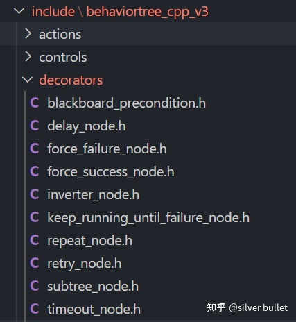
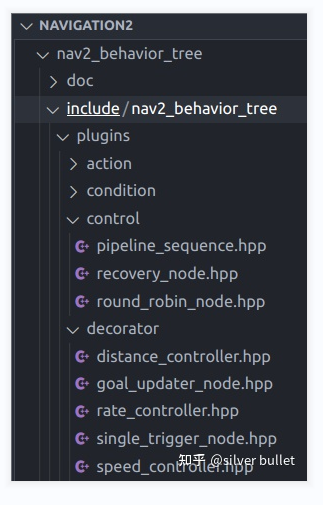

###### datetime:2023/05/11 15:12

###### author:nzb

# BT5：DecoratorNodes源码解析

## DecoratorNode基类

`BehaviorTree.CPP`中内建的装饰节点如下，都继承自 `BehaviorTree.CPP\include\behaviortree_cpp_v3\decorator_node.h` 中的`DecoratorNode`类。
很明显，该类只有1个子节点。ROS中也定义了一些方便使用的`ControlNodes`和`DecoratorNodes`，可以导入使用。

```cpp
class DecoratorNode : public TreeNode {
  protected:
    TreeNode* child_node_;
  ... ...
}
```





## BlackboardPreconditionNode

细分为3个节点：`BlackboardCheckInt`、`BlackboardCheckDouble`、`BlackboardCheckString`。顾名思义，该节点是检查`blackboard`的某个`port`的值是否符合预期的。

包含3个`InputPort`，当`value_A`和`value_B`的值相等时，执行子节点。否则，不执行子节点，并返回`return_on_mismatch`设定的值。

```cpp
static PortsList providedPorts() {
    return {InputPort("value_A"),
            InputPort("value_B"),
            InputPort<NodeStatus>("return_on_mismatch") };
}
```

源代码中使用`==`来判断2个变量的值，对于`double`类型不妥。

```cpp
template <typename T>
inline NodeStatus BlackboardPreconditionNode<T>::tick() {
  T value_A;
  T value_B;
  NodeStatus default_return_status = NodeStatus::FAILURE;
  setStatus(NodeStatus::RUNNING);

  if (getInput("value_A", value_A) && getInput("value_B", value_B) &&
      value_B == value_A) {
    return child_node_->executeTick();
  }
  if (child()->status() == NodeStatus::RUNNING) {
    haltChild();
  }
  getInput("return_on_mismatch", default_return_status);
  return default_return_status;
}
```

示例：

```xml

<BlackboardCheckInt value_A="{the_answer}"
                    value_B="42"
                    return_on_mismatch="FAILURE"/>
```

## DelayNode

延时`delay_msec`毫秒后，执行子节点，并返回子节点的执行结果。延时期间，返回`RUNNING`。

```cpp
static PortsList providedPorts() {
    return {InputPort<unsigned>("delay_msec", "Tick the child after a few milliseconds")};
}
```

示例：

```xml

<Delay delay_msec="5000">
    <KeepYourBreath/>
</Delay>
```

## ForceFailureNode

如果子节点执行后返回`RUNNING`，该节点返回`RUNNING`；否则，该节点返回`FAILURE`，即强制返回失败状态。

`ForceSuccessNode`与`ForceFailureNode`大同小异。

## InverterNode

如果子节点执行后返回`RUNNING`，该节点返回`RUNNING`；

如果子节点执行后返回`SUCCESS`，该节点返回`FAILURE`；

如果子节点执行后返回`FAILURE`，该节点返回`SUCCESS`；

即对子节点的执行结果取反。

## KeepRunningUntilFailureNode

如果子节点执行后返回`RUNNING`或`SUCCESS`，下次`tick()`继续执行子节点，直到子节点返回`FAILURE`。

## RepeatNode

重复执行子节点`NUM_CYCLES` 次，若每次都返回 `SUCCESS`，该节点返回`SUCCESS`；

若子节点某次返回`FAILURE`，该节点不再重复执行子节点，立即返回`FAILURE`；

若子节点返回`RUNNING`，该节点也返回`RUNNING`。

```cpp
static PortsList providedPorts() {
    return { InputPort<int>(NUM_CYCLES,
                            "Repeat a succesful child up to N times. "
                            "Use -1 to create an infinite loop.") };
}
```

示例：

```xml

<Repeat num_cycles="3">
    <ClapYourHandsOnce/>
</Repeat>
```

## RetryNode

如果子节点执行后返回`RUNNING`，该节点返回`RUNNING`；

如果子节点执行后返回`SUCCESS`，该节点返回`SUCCESS`，不再执行；

如果子节点执行后返回`FAILURE`，该节点再次尝试执行子节点，直到尝试了`num_attempts`次；

```cpp
static PortsList providedPorts() {
    return { InputPort<int>(NUM_ATTEMPTS,
                           "Execute again a failing child up to N times. "
                           "Use -1 to create an infinite loop.") };
}
```

示例：

```xml

<RetryUntilSuccesful num_attempts="3">
    <OpenDoor/>
</RetryUntilSuccesful>
```

## SubtreeNode

用来封装一个`subtree`，这样会有一个独立的`blackboard`，`__shared_blackboard port`的默认值是`false`，因此开发者要自行重映射端口。 但`tick()`
函数中并没有使用`__shared_blackboard port`，而是在 `BehaviorTree.CPP\src\xml_parsing.cpp`中使用的，这点要注意，`SubtreePlusNode`
的`__autoremap port`也是如此。

```cpp
static PortsList providedPorts() {
    return { InputPort<bool>("__shared_blackboard", false,
                             "If false (default) the subtree has its own blackboard and you"
                             "need to do port remapping to connect it to the parent") };
}
```

## SubtreePlusNode

控制重映射的强化版`SubtreeNode`。当`__autoremap port`为`true`时，会自动重映射名称相同的`port`。结合代码示例会更容易理解。

```cpp
static PortsList providedPorts() {
    return { InputPort<bool>("__autoremap", false,
                             "If true, all the ports with the same name will be remapped") };
}
```

示例：

```xml

<root main_tree_to_execute="MainTree">
    <BehaviorTree ID="MainTree">
        <Sequence>
            <!--第一种-->
            <SetBlackboard value="Hello" output_key="myParam"/>
            <SubTreePlus ID="Talk" param="{myParam}"/>
            <!--第二种-->
            <SubTreePlus ID="Talk" param="World"/>
            <!--第三种-->
            <SetBlackboard value="Auto remapped" output_key="param"/>
            <SubTreePlus ID="Talk" __autoremap="1"/>

        </Sequence>
    </BehaviorTree>

    <BehaviorTree ID="Talk">
        <SaySomething message="{param}"/>
    </BehaviorTree>
</root>
```

上面有3种重映射的实现方式。第1、2种是最常见的。

- 第1种将`Subtree`的`blackboard`的`param entry`映射到`Parent tree`的`blackboard`的`myParam entry`，将其值设置为字符串"Hello"。

- 第2种将`Subtree`的`blackboard`的`param entry`的值直接设置为字符串"World"。

- 第3种在`Parent tree`的`blackboard`中增加了`param entry`，没有指定映射到`subtree`的哪个`port`。但由于设定`__autoremap=true`， 该`entry`
  会自动映射到`subtree`的`blackboard`的`param entry`。`SaySomething`节点会在其`message port`中获取到值为字符串“Auto remapped”。

## TimeoutNode

在设置的`msec` 毫秒内，返回子节点执行的状态。若子节点返回`FAILURE`或`SUCCESS`，不再执行。如果超时，终止子节点执行，并返回`FAILURE`。 类中使用了`TimerQueue`
作为计时器，可以定时多个任务，比较有趣。

```cpp
static PortsList providedPorts() {
    return { InputPort<unsigned>("msec", "After a certain amount of time, "
                                         "halt() the child if it is still running.") };
}
```

示例：

```cpp
<Timeout msec="5000">
   <KeepYourBreath/>
</Timeout>
```


