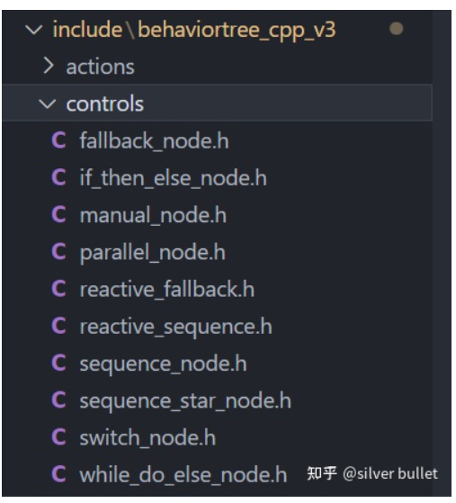

###### datetime:2023/05/11 15:12

###### author:nzb

# BT6：ControlNodes源码解析

## ControlNode基类

`BehaviorTree.CPP`中内建的控制节点如下，都继承自 `BehaviorTree.CPP\include\behaviortree_cpp_v3\control_node.h` 中的`ControlNode`类。
很明显，该类有多个子节点，其执行顺序就是控制节点的核心内容。默认子节点是从左到右执行。

除了这些`ControlNodes`之外，其他开源库实现的个性化`nodes`，用起来也很方便，开发者可以自行导入。

```cpp
class ControlNode : public TreeNode {
  protected:
    std::vector<TreeNode*> children_nodes_;
  ... ...
}
```



## FallbackNode

`FallbackNode`也被称为`Selector`，适用于“如果子节点返回`FAILURE`该怎么办？”的场景，类似逻辑或，众多子节点中只要有1个成功即可，若某1个失败，尝试下一个。

如果某个子节点返回`RUNNING`，返回`RUNNING`，且下次`tick()`时之前的子节点不会再执行。

如果某个子节点返回`SUCCESS`，返回`SUCCESS`。

如果某个子节点返回`FAILURE`，立即执行下一个子节点（不会等下一次`tick()`）。如果所有子节点返回`FAILURE`，返回`FAILURE`。

```cpp
NodeStatus FallbackNode::tick() {
    const size_t children_count = children_nodes_.size();
    setStatus(NodeStatus::RUNNING);
    while (current_child_idx_ < children_count) {
        // 保存了current_child_idx_，所以下次tick()时，若上次返回RUNNING，会执行同一个node
        // 若上次返回FAILURE，会执行下一个node
        TreeNode* current_child_node = children_nodes_[current_child_idx_];
        const NodeStatus child_status = current_child_node->executeTick();
        switch (child_status) {
            case NodeStatus::RUNNING: {
                return child_status;
            }
            case NodeStatus::SUCCESS: {
                haltChildren();
                current_child_idx_ = 0;
                return child_status;
            }
            case NodeStatus::FAILURE: {
                current_child_idx_++;
            }
            break;  // 这里不会退出while循环
            case NodeStatus::IDLE: {
                throw LogicError("A child node must never return IDLE");
            }
        }   // end switch
    }       // end while loop

    // The entire while loop completed. This means that all the children returned FAILURE.
    if (current_child_idx_ == children_count) {
        haltChildren();
        current_child_idx_ = 0;
    }
    return NodeStatus::FAILURE;
}
```

## ReactiveFallback

顾名思义，是`FallbackNode`的`reactive`版本，类似`ParallelNode`，最多含1个`asynchronous node`。

如果某个子节点返回`RUNNING`，返回`RUNNING`，且下次`tick()`时之前的子节点会再次执行，`reactive`所在。

如果某个子节点返回`SUCCESS`，不再执行，且返回`SUCCESS`。

如果某个子节点返回`FAILURE`，立即执行下一个子节点（不会等下一次`tick()`）。如果所有子节点返回`FAILURE`，返回`FAILURE`。

```cpp
NodeStatus ReactiveFallback::tick() {
  size_t failure_count = 0;  // 统计FAILURE的node个数
  for (size_t index = 0; index < childrenCount(); index++) {
    // 每次tick()都是从第一个node（最左侧）开始执行
    TreeNode* current_child_node = children_nodes_[index];
    const NodeStatus child_status = current_child_node->executeTick();
    switch (child_status) {
      case NodeStatus::RUNNING: {
        for (size_t i = index + 1; i < childrenCount(); i++) {
          haltChild(i);  // 终止其他node
        }
        return NodeStatus::RUNNING;
      }
      case NodeStatus::FAILURE: {
        failure_count++;
      } break;
      case NodeStatus::SUCCESS: {
        haltChildren();  // 终止所有node
        return NodeStatus::SUCCESS;
      }
      case NodeStatus::IDLE: {
        throw LogicError("A child node must never return IDLE");
      }
    }  // end switch
  }    // end for

  if (failure_count == childrenCount()) {
    haltChildren();  // 终止所有node
    return NodeStatus::FAILURE;
  }
  return NodeStatus::RUNNING;
}
```

## ParallelNode

当返回`SUCCESS`的子节点个数`>=THRESHOLD_SUCCESS`时，返回`SUCCESS`。

当返回`FAILURE`的子节点个数`>=THRESHOLD_FAILURE`时，返回`FAILURE`。

当程序判断绝不可能`SUCCESS`时，返回`FAILURE`。如 `failure_children_num > children_count - success_threshold_`。

```cpp
static PortsList providedPorts() {
  return {InputPort<unsigned>(
              THRESHOLD_SUCCESS,
              "number of childen which need to succeed to trigger a SUCCESS"),
          InputPort<unsigned>(
              THRESHOLD_FAILURE, 1,
              "number of childen which need to fail to trigger a FAILURE")};
}
```

## IfThenElseNode

有2或3个子节点，`node1`就是`if`判断的条件。如果`node1`返回`SUCCESS`，那么`node2`执行；否则，`node3`执行。如果没有`node3`，返回`FAILURE`。 该结点`not reactive`
，体现在一旦`node1`不返回`RUNNING`了，就进入了`node2`或`node3`的执行，以后`tick()`不会再执行`node1`了，也即不会再检查`if`条件的变化。

```cpp
NodeStatus IfThenElseNode::tick() {
    const size_t children_count = children_nodes_.size();
    if (children_count != 2 && children_count != 3) {
        throw std::logic_error("IfThenElseNode must have either 2 or 3 children");
    }
    setStatus(NodeStatus::RUNNING);
    if (child_idx_ == 0) {
        NodeStatus condition_status = children_nodes_[0]->executeTick();
        if (condition_status == NodeStatus::RUNNING) {
            return condition_status;
        }
        else if (condition_status == NodeStatus::SUCCESS) {
            child_idx_ = 1;
        }
        else if (condition_status == NodeStatus::FAILURE) {
            if (children_count == 3) {
                child_idx_ = 2; // 执行第3个node
            } else {
                return condition_status;   // 直接返回FAILURE
            }
        }
    }
    // not an else 立即执行，不会等下一次tick()
    if (child_idx_ > 0) {
        NodeStatus status = children_nodes_[child_idx_]->executeTick();
        if (status == NodeStatus::RUNNING) {
            return NodeStatus::RUNNING;
        } else {
            haltChildren();
            child_idx_ = 0;
            return status;
        }
    }
    throw std::logic_error("Something unexpected happened in IfThenElseNode");
}
```

示例：

```xml

<IfThenElse>
    <IsBatteryEnough/>
    <Work/>
    <Charge/>
</IfThenElse>
```

## WhileDoElseNode

是`IfThenElseNode`的`reactive`版本。功能同上，`reactive`体现在每次`tick()`都会执行`node1`，即检查`if`条件的变化。若n`ode1`返回值有`SUCCESS`、`FAILURE`
的切换变化， 就会打断`node2`或`node3`的执行，重新选择对应的`node`。

```cpp
NodeStatus WhileDoElseNode::tick() {
  const size_t children_count = children_nodes_.size();
  // 源代码错误，应该是 if (children_count != 2 && children_count != 3) {}
  if (children_count != 3) {
    throw std::logic_error("WhileDoElse must have either 2 or 3 children");
  }
  setStatus(NodeStatus::RUNNING);
  // 每次tick()都会先执行第1个节点，即判断条件，reactive体现在此，及时响应外界变化
  NodeStatus condition_status = children_nodes_[0]->executeTick();
  if (condition_status == NodeStatus::RUNNING) {
    return condition_status;
  }
  NodeStatus status = NodeStatus::IDLE;
  // 根据第1个节点的返回值，执行对应节点，并终止另外的节点
  if (condition_status == NodeStatus::SUCCESS) {
    haltChild(2);
    status = children_nodes_[1]->executeTick();
  } else if (condition_status == NodeStatus::FAILURE) {
    haltChild(1);
    status = children_nodes_[2]->executeTick();
  }

  if (status == NodeStatus::RUNNING) {
    return NodeStatus::RUNNING;
  } else {
    haltChildren();
    return status;
  }
}
```

## SwitchNode

`switch-case`。`blackboard`的某个`entry`的值和哪个`case`的值相等，就执行哪个`case`。同样的，最后1个未指定值的`case`就是`default`默认执行的分支。
`SwitchN`有`N`个分支，必须指定`N`个子节点对应。`reactive`体现在每次`tick()`都会重新读取`entry`的值，选择对应的分支，并终止其他节点。

```cpp
static PortsList providedPorts() {
  PortsList ports;
  ports.insert(BT::InputPort<std::string>("variable"));
  for (unsigned i = 0; i < NUM_CASES; i++) {
    char case_str[20];
    sprintf(case_str, "case_%d", i + 1);
    ports.insert(BT::InputPort<std::string>(case_str));
  }
  return ports;
}
```

示例：

```xml

<Switch3 variable="{var}" case_1="1" case_2="42" case_3="666">
    <ActionA name="action_when_var_eq_1"/>
    <ActionB name="action_when_var_eq_42"/>
    <ActionC name="action_when_var_eq_666"/>
    <ActionD name="default_action"/>
</Switch3>
```

## ManualSelectorNode

和用户交互，由用户选择特定的节点执行。使用较少，略。

