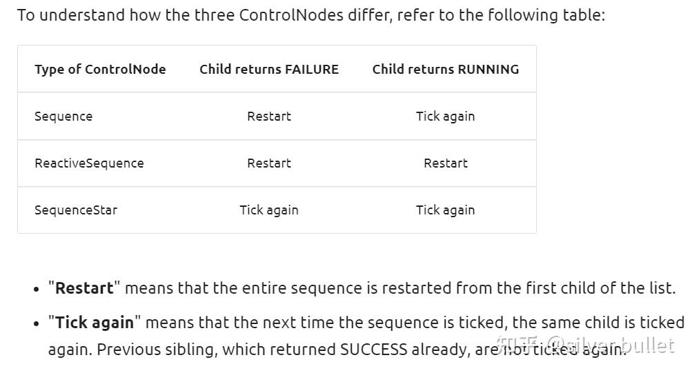

###### datetime:2023/05/11 15:12

###### author:nzb

# BT7：ControlNodes源码解析之Sequence

## SequenceNode

最常见的`control node`，按从左到右的顺序依次执行子节点。

如果某个子节点返回`RUNNING`，返回`RUNNING`，且下次`tick()`时之前的子节点不会再执行。类内维护当前执行节点的标号`current_child_idx_`。

如果某个子节点返回`SUCCESS`，立即执行下一个子节点（不会等下一次`tick()`）。如果所有子节点返回`SUCCESS`，返回`SUCCESS`。

如果某个子节点返回`FAILURE`，返回`FAILURE`，并且复位所有成员变量（尤其注意`current_child_idx_`）。当再次`tick()`时，从头开始。

```cpp
NodeStatus SequenceNode::tick() {
  const size_t children_count = children_nodes_.size();
  setStatus(NodeStatus::RUNNING);
  while (current_child_idx_ < children_count) {
    TreeNode* current_child_node = children_nodes_[current_child_idx_];
    const NodeStatus child_status = current_child_node->executeTick();
    switch (child_status) {
      case NodeStatus::RUNNING: {
        return child_status;
      }
      case NodeStatus::FAILURE: {
        // Reset on failure
        haltChildren();
        current_child_idx_ = 0;
        return child_status;
      }
      case NodeStatus::SUCCESS: {
        current_child_idx_++;
      } break;
      case NodeStatus::IDLE: {
        throw LogicError("A child node must never return IDLE");
      }
    }  // end switch
  }    // end while loop

  // The entire while loop completed. This means that all the children returned SUCCESS.
  if (current_child_idx_ == children_count) {
    haltChildren();
    current_child_idx_ = 0;
  }
  return NodeStatus::SUCCESS;
}
```

## SequenceStarNode

同上，不同之处在于如果某个子节点返回`FAILURE`，返回`FAILURE`，终止所有节点的执行，但不复位`current_child_idx_`。所以当再次`tick()`时，从`FAILURE`的子节点开始。

```cpp
NodeStatus SequenceStarNode::tick() {
  ...
  while (current_child_idx_ < children_count) {
    TreeNode* current_child_node = children_nodes_[current_child_idx_];
    const NodeStatus child_status = current_child_node->executeTick();
    switch (child_status) {      
      case NodeStatus::FAILURE: {
        // DO NOT reset current_child_idx_ on failure
        for (size_t i = current_child_idx_; i < childrenCount(); i++) {
          haltChild(i);
        }
        return child_status;
      }
      case NodeStatus::RUNNING: {
        return child_status;
      }
      case NodeStatus::SUCCESS: {
        current_child_idx_++;
      } break;
      case NodeStatus::IDLE: {
        throw LogicError("A child node must never return IDLE");
      }
    }  // end switch
  }    // end while loop
  
  // The entire while loop completed. This means that all the children returned SUCCESS.
  if (current_child_idx_ == children_count) {
    haltChildren();
    current_child_idx_ = 0;
  }
  return NodeStatus::SUCCESS;
}
```

## ReactiveSequence

是`SequneceNode`的`reactive`版本，和`ParallelNode`类似，常用来周期检查某个外部条件是否成立。类内不保存当前执行节点的标号。

如果某个子节点返回`RUNNING`，返回`RUNNING`，终止其他节点，下次`tick()`时从头开始执行。`reactive`所在。

如果某个子节点返回`SUCCESS`，立即执行下一个子节点（不会等下一次`tick()`）。如果所有子节点返回`SUCCESS`，返回`SUCCESS`。

如果某个子节点返回`FAILURE`，返回`FAILURE`，终止所有节点，下次`tick()`时从头开始执行。

```cpp
NodeStatus ReactiveSequence::tick() {
    for (size_t index = 0; index < childrenCount(); index++) {
        TreeNode* current_child_node = children_nodes_[index];
        const NodeStatus child_status = current_child_node->executeTick();
        switch (child_status) {
            case NodeStatus::RUNNING: {
                for (size_t i = index + 1; i < childrenCount(); i++) {
                  haltChild(i);
                }
                return NodeStatus::RUNNING;
            }
            case NodeStatus::FAILURE: {
                haltChildren();
                return NodeStatus::FAILURE;
            }
            case NodeStatus::SUCCESS: {
                current_child_idx_++;
            } break;
            case NodeStatus::IDLE: {
                throw LogicError("A child node must never return IDLE");
            }
        }  // end switch
    }    // end for
  
    // The entire while loop completed. This means that all the children returned SUCCESS.
    if (current_child_idx_ == children_count) {
    haltChildren();
    current_child_idx_ = 0;
    }
    return NodeStatus::SUCCESS;
}
```

## 3种node的差异可以总结如下：




