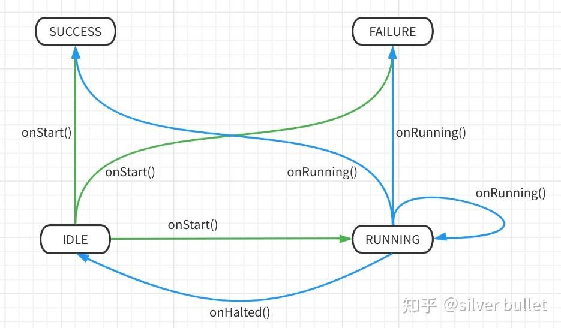

###### datetime:2023/05/12 10:30

###### author:nzb

# BT8：ActionNode及同步、异步

定义在`BehaviorTree.CPP/include/behaviortree_cpp_v3/action_node.h`，这个文件中定义了`ActionNodeBase`、`SyncActionNode`
、`SimpleActionNode`、`AsyncActionNode`、`StatefulActionNode`、`CoroActionNode`等类，开发者自己定义的`action node`一般都会继承其中一个基类。

## ActionNodeBase

最通用的`action node`基类，子类要实现`executeTick()`、`tick()`、`halt()`等函数。

## SyncActionNode

继承自`ActionNodeBase`，同步`action node`，不会返回`RUNNING`，无需开发者实现`halt()`。

```cpp
NodeStatus SyncActionNode::executeTick() {
  auto stat = ActionNodeBase::executeTick();
  if (stat == NodeStatus::RUNNING) {
    throw LogicError("SyncActionNode MUST never return RUNNING");
  }
  return stat;
}

virtual void halt() override final { setStatus(NodeStatus::IDLE); }
```

## SimpleActionNode

继承自`SyncActionNode`，常使用`lambdas`或`std::bind`构造`std::function`对象来构造`SimpleActionNode`，这个`function`就是`tick()`的内容。
这样开发者无需定义`node`，只需指定`node`的`类型ID`和`tick()`即可，`SimpleConditionNode`同理。

```cpp
class SimpleActionNode : public SyncActionNode {
 public:
  typedef std::function<NodeStatus(TreeNode&)> TickFunctor;

  // You must provide the function to call when tick() is invoked
  SimpleActionNode(const std::string& name, TickFunctor tick_functor,
                   const NodeConfiguration& config);
  ~SimpleActionNode() override = default;
 protected:
  virtual NodeStatus tick() override final;
  TickFunctor tick_functor_;  // tick()执行的内容
};

NodeStatus SimpleActionNode::tick() {
  ...
  NodeStatus status = tick_functor_(*this);
  if (status != prev_status) {
    setStatus(status);
  }
  return status;
}
```

`BehaviorTree.CPP/examples/t01_build_your_first_tree.cpp`中有使用示例。

```cpp
GripperInterface gripper;
// open()是GripperInterface类的成员函数
factory.registerSimpleAction("OpenGripper",
                               std::bind(&GripperInterface::open, &gripper));
```

`register`函数不会调用`node`的构造函数，其作用是向`BehaviorTreeFactory`注册类型，创建构造函数匹配的`builder`。

```cpp
// 不需要输入config
void BehaviorTreeFactory::registerSimpleAction(
    const std::string& ID, const SimpleActionNode::TickFunctor& tick_functor,
    PortsList ports) {
  NodeBuilder builder = [tick_functor, ID](const std::string& name,
                                           const NodeConfiguration& config) {
    return std::make_unique<SimpleActionNode>(name, tick_functor, config);
  };
  TreeNodeManifest manifest = {NodeType::ACTION, ID, std::move(ports)};
  registerBuilder(manifest, builder);
}
```

```cpp
void BehaviorTreeFactory::registerBuilder(const TreeNodeManifest& manifest,
                                          const NodeBuilder& builder) {
  auto it = builders_.find(manifest.registration_ID);
  if (it != builders_.end()) {
    throw BehaviorTreeException("ID [", manifest.registration_ID,
                                "] already registered");
  }
  builders_.insert({manifest.registration_ID, builder});
  manifests_.insert({manifest.registration_ID, manifest});
}
```

## AsyncActionNode

继承自`ActionNodeBase`，会在`executeTick()`函数中创建1个线程来执行`tick()`，通过`halt_requested_`变量监控节点是否被终止。 开发者需要在子类`tick()`
中周期性检查`isHaltRequested()`的返回值，以便及时终止执行。子类`halt()`要记得调用父类`AsyncActionNode::halt()`。 子类不必显式的返回`RUNNING`
，只需根据结果返回`SUCCESS/FAILURE`，未执行完成时会自动置位和返回`RUNNING`。

```cpp
NodeStatus BT::AsyncActionNode::executeTick() {
  // send signal to other thread.
  //  The other thread is in charge for changing the status
  if (status() == NodeStatus::IDLE) {
    setStatus(NodeStatus::RUNNING);
    halt_requested_ = false;
    thread_handle_ = std::async(std::launch::async, [this]() {
      try {
        setStatus(tick());
      } catch (std::exception&) {
        std::cerr << "\nUncaught exception from the method tick(): ["
                  << registrationName() << "/" << name() << "]\n"
                  << std::endl;
        exptr_ = std::current_exception();
        thread_handle_.wait();
      }
      return status();
    });
  }
  if (exptr_) {
    std::rethrow_exception(exptr_);
  }
  return status();
}
```

`BehaviorTree.CPP/sample_nodes/movebase_node.h`有`AsyncActionNode`的使用示例。

### 参考链接

- [（原创）用C++11的std::async代替线程的创建](https://link.zhihu.com/?target=https%3A//www.cnblogs.com/leijiangtao/p/12076251.html)
- [std::async的使用总结](https://link.zhihu.com/?target=https%3A//segmentfault.com/a/1190000039083151)

## StatefulActionNode

继承自`ActionNodeBase`，像状态机的运行方式。如果节点在`IDLE state`就会调用`onStart()`，如果在`RUNNING state`就会调用`onRunning()`，如果被`halt()`
就会调用`onHalted()`。

```cpp
class StatefulActionNode : public ActionNodeBase {
 public:
  StatefulActionNode(const std::string& name, const NodeConfiguration& config)
      : ActionNodeBase(name, config) {}

  // do not override this method
  NodeStatus tick() override final;
  // do not override this method
  void halt() override final;

  /// method to be called at the beginning.
  /// If it returns RUNNING, this becomes an asychronous node.
  virtual NodeStatus onStart() = 0;

  /// method invoked by a RUNNING action.
  virtual NodeStatus onRunning() = 0;

  /// when the method halt() is called and the action is RUNNING, this method is
  /// invoked. This is a convenient place todo a cleanup, if needed.
  virtual void onHalted() = 0;
};
```

```cpp
NodeStatus StatefulActionNode::tick() {
  const NodeStatus initial_status = status();  // 当前状态

  if (initial_status == NodeStatus::IDLE) {
    NodeStatus new_status = onStart();  // 状态跳转
    ...
    return new_status;
  }

  if (initial_status == NodeStatus::RUNNING) {
    NodeStatus new_status = onRunning();  // 状态跳转
    ...
    return new_status;
  }
  //  当前状态不是IDLE、RUNNING，那么就是SUCCESS/FAILURE，可以直接返回结果
  return initial_status;
}

void StatefulActionNode::halt() {
  if (status() == NodeStatus::RUNNING) {
    onHalted();  // 状态跳转
  }
  setStatus(NodeStatus::IDLE);
}
```



## CoroActionNode

理解不透，略。


