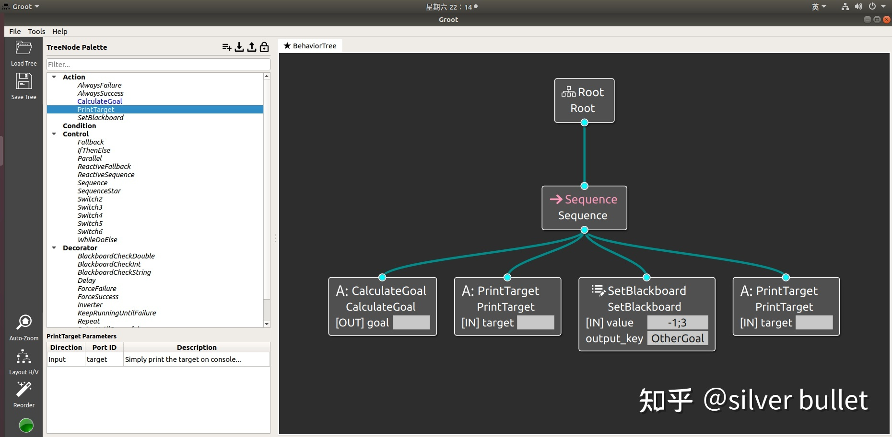
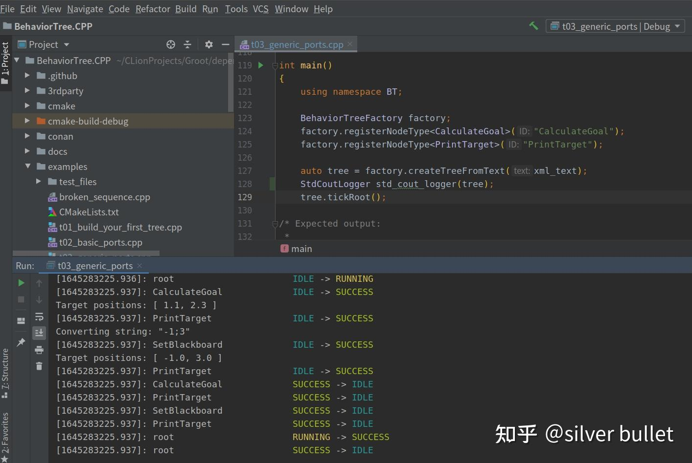
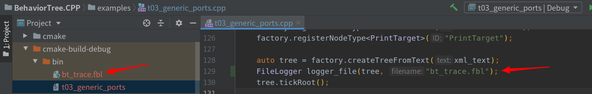
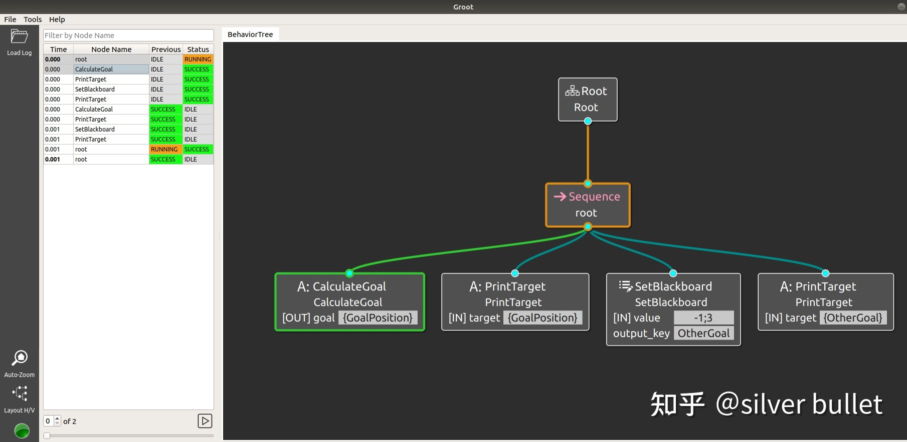
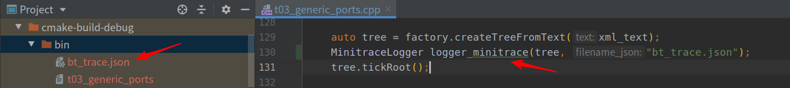
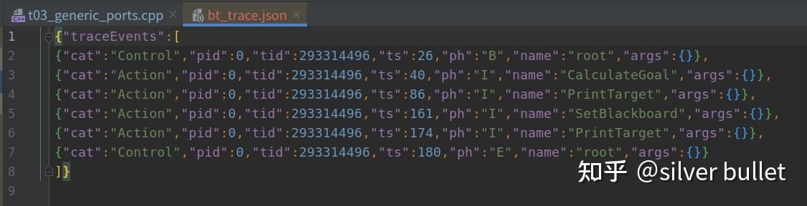
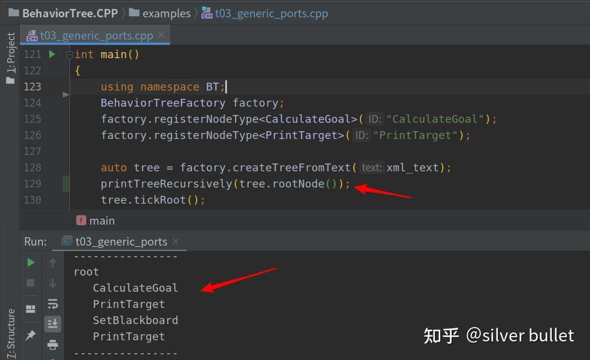

###### datetime:2023/05/12 10:30

###### author:nzb

# BT9：各种调试工具介绍

## 1、Groot

`Groot`是与`BehaviorTree.CPP`搭配使用的工具，分为`Editor`、`Monitor`、`Log Replay` 3种模式，具有行为树编辑、状态监控、历史`log`回放等功能。


- [GitHub](https://link.zhihu.com/?target=https%3A//github.com/BehaviorTree/Groot)
- [Groot入门使用指引](https://link.zhihu.com/?target=https%3A//navigation.ros.org/tutorials/docs/using_groot.html%23groot-introduction%25C2%25A0)

在Groot中可以图形化的方式创建节点（node），为节点添加输入输出端口（port），可以像Visio一样拖动、连接节点，从而构造行为树，而无需在意节点代码是否完成。 将树保存、导出为xml文件，可以被`BehaviorTree.CPP`
的接口读入并解析。这样就可以避免开发者自行编写xml文件的复杂局面。

如`BehaviorTree.CPP/examples/t03_generic_ports.cpp`中这样定义了一棵行为树：

```xml

<root main_tree_to_execute="MainTree">
    <BehaviorTree ID="MainTree">
        <Sequence name="root">
            <CalculateGoal goal="{GoalPosition}"/>
            <PrintTarget target="{GoalPosition}"/>
            <SetBlackboard output_key="OtherGoal" value="-1;3"/>
            <PrintTarget target="{OtherGoal}"/>
        </Sequence>
    </BehaviorTree>
</root>
```

在Groot中依此创建，如图所示：



将其保存为`xml`文件，如下所示。和上段代码的区别在于缺失了`blackboard entry`的指定，增加了`node`的类型。其实这2段代码都可以被Groot加载和解析。

```xml
<?xml version="1.0"?>
<root main_tree_to_execute="BehaviorTree">
    <!-- ////////// -->
    <BehaviorTree ID="BehaviorTree">
        <Sequence>
            <Action ID="CalculateGoal" goal=""/>
            <Action ID="PrintTarget" target=""/>
            <SetBlackboard output_key="OtherGoal" value="-1;3"/>
            <Action ID="PrintTarget" target=""/>
        </Sequence>
    </BehaviorTree>
    <!-- ////////// -->
    <TreeNodesModel>
        <Action ID="CalculateGoal">
            <output_port name="goal"/>
        </Action>
        <Action ID="PrintTarget">
            <input_port name="target">Simply print the target on console...</input_port>
        </Action>
    </TreeNodesModel>
    <!-- ////////// -->
</root>
```

## 2、StdCoutLogger

作用：在终端打印行为树中的节点执行状态变化。

代码仅需在加载`tree`后添加`StdCoutLogger`类的1个实例（且只能有1个实例），运行效果如下：



`BehaviorTree.CPP/examples/t05_crossdoor.cpp`中也有本文各工具的使用示例。

## 3、FileLogger

作用：行为树中的节点执行状态变化保存在文件中（必须是*.fbl格式文件），可以通过Groot打开并回放执行过程。

代码仅需在加载tree后添加FileLogger类的1个实例，运行效果如下：



`Groot`选择`Log Replay`模式后加载`bt_trace.fbl`，如下。当选中左侧的节点时，右侧会通过线条的颜色来表示执行的状态（绿色-`SUCCESS`，橙色-`RUNNING`，青色-未执行）。



## 4、MinitraceLogger

作用：保存节点的执行时序。

代码仅需在加载`tree`后添加`FileLogger`类的1个实例（且只能有1个实例），运行效果如下：



生成的json文件内容如下：



## 5、PublisherZMQ

作用：在节点执行的同时发布其状态变化，在`Groot`中实时观察。

代码仅需在加载`tree`后添加`PublisherZMQ`类的1个实例（且只能有1个实例）。

`Groot`需要选择`Monitor`模式，并设置下列输入。如果行为树与`Groot`都在同一台机器运行的话，就自发自收，`Server IP`可以设置为`“127.0.0.1”`，`Publisher Port`设置为“`1666`
”，`Server Port`设置为“`1667`”。

`Groot`会自动获得树的结构，无需用户手动加载，但是它会自动展开1棵树中的所有子树，使得界面内容非常密集，因此复杂的树并不方便观察。

## 6、printTreeRecursively内置函数

作用：层级打印树结构，默认打印在终端。

该函数定义在`BehaviorTree.CPP/include/behaviortree_cpp_v3/behavior_tree.h`中，声明和运行效果如下。

```cpp
void printTreeRecursively(const TreeNode* root_node);
```



## 7、debugMessage内置函数

打印不同的树之间的端口（`port`）映射关系，也可以反映出`port`是否被设置值。

该函数定义在`BehaviorTree.CPP/include/behaviortree_cpp_v3/blackboard.h`
中，`BehaviorTree.CPP/examples/t06_subtree_port_remapping.cpp`有代码示例。

```cpp
void Blackboard::debugMessage() const {
  for (const auto& entry_it : storage_) {
    auto port_type = entry_it.second.port_info.type();
    if (!port_type) {
      port_type = &(entry_it.second.value.type());
    }
    std::cout << entry_it.first << " (" << demangle(port_type) << ") -> ";

    if (auto parent = parent_bb_.lock()) {
      auto remapping_it = internal_to_external_.find(entry_it.first);
      // if条件满足，说明有port外部映射
      if (remapping_it != internal_to_external_.end()) {
        std::cout << "remapped to parent [" << remapping_it->second << "]"
                  << std::endl;
        continue;
      }
    }
    // 若此处打印，而不是在上面continue处返回，说明没有外部映射
    // empty表明该port没有值（从未被设置值），无法读取，读取会抛出异常
    // full表明该port有值，可以被读取
    std::cout << ((entry_it.second.value.empty()) ? "empty" : "full")
              << std::endl;
  }
}
```


